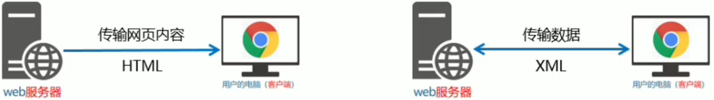
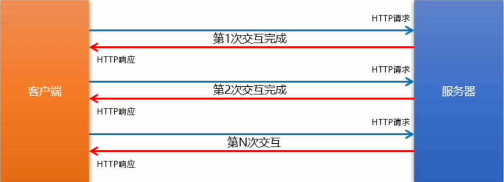
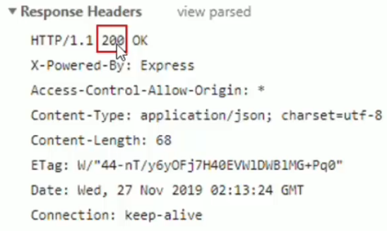

# 1. 服务器的基本概念与初识 Ajax

## 1. 客户端与服务器

### 1. 上网的目的

- 刷微博
- 浏览新闻
- 在线听音乐
- 在线看电影
- etc...

上网的本质目的：通过互联网的形式来获取和消费资源。

### 2. 服务器

上网过程中，负责存放和对外提供资源的电脑，叫做服务器。


### 3. 客户端

上网过程中，负责获取和消费资源的电脑，叫做客户端。


## 2. URL地址

### 1. URL地址的概念

URL（全称是 UniformResourceLocator）中文叫统一资源定位符，用于标识互联网上每一个资源的唯一存放位置。

浏览器只有通过URL地址，才能正确定位资源的存放位置，从而成功访问到对应的资源。

常见的URL举例：

http://www.baidu.com

http://www.taobao.com

### 2. URL地址的组成部分

1. 客户端与服务器之间的通信协议
2. 存有该资源的服务器名称
3. 资源在服务器上具体的存放位置


## 3. 分析网页的打开过程

### 1. 图解客户端与服务器的通信过程


注意：

1. 客户端与服务器之间的通信过程，分为**请求-处理-响应**三个步骤
2. 网页中的每一个资源，都是通过**请求-处理-响应**的方式从服务器获取回来的

### 2. 基于浏览器的开发者工具分析通信过程


## 4. 服务器对外提供了哪些资源

### 1. 举例网页中常见的资源

文字内容、image图片、audio音频、video视频

思考：网页中的**数据**是不是资源？

### 2. 数据也是资源

网页中的数据，也是服务器对外提供的一种资源。例如股票数据、各行业排行榜等。

### 3. 数据是网页的灵魂

- **HTML**是网页的**骨架**
- **CSS**是网页的**颜值**
- **JavaScript**是**网页**
- **数据**，则是网页的**灵魂**

骨架、颜值、行为**皆为数据服务**

**数据**，在网页中**无处不在**

### 4. 网页中如何请求数据

**数据**，也是服务器对外提供的一种**资源**。只要是资源，必然要通过**请求-处理-响应**的方式进行获取。

如果要在网页中请求服务器上的数据资源，则需要用到 **XMLHttpRequest** 对象。

XMLHttpRequest（简称 xhr）是浏览器提供的 js 成员，通过它，可以请求服务器上的数据资源。

最简单的用法：

```javascript
var xhr = new XMLHttpRequest();
```

### 5. 资源的请求方式

客户端请求服务器时，**请求的方式**有很多种，最常见的两种请求方式分别为 **get** 和 **post** 请求。

- **get请求**通常用于**获取服务器资源**（向服务器要资源）

    例如：根据URL地址，从服务器获HTML文件、CSS文件、js文件、图片文件、数据资源等

- **post请求**通常用于**向服务器提交数据**（往服务器发送资源）

    例如：登录时向服务器**提交的登录信息**、注册时向服务器**提交的注册信息**、添加用户时向服务器**提交的用户信息**等各种**数据提交操作**

## 5. 了解 Ajax

### 1. 什么是 Ajax

Ajax 的全称是 **A**synchronous **J**avaScript **A**nd **X**ML（异步 JavaScript 和 XML）。

通俗的理解：在网页中利用 XMLHttpRequest 对象和服务器进行数据交互的方式，就是 Ajax。

### 2. 为什么要学 Ajax

之前所学的技术，只能把网页做的更美观漂亮，或添加一些动画效果，但是，**Ajax** 能让我们轻松实现**网页**与**服务器**之间的数据交互。


### 3. Ajax 的典型

用户名检测：注册用户时，通过 ajax 的形式，动态**检测用户名是否被占用**


搜索提示：当输入搜索关键字时，通过 ajax 的形式，动态**加载搜索提示列表**


数据分页显示：当点击页码值的时候，通过 ajax 的形式，**根据页码值东涛刷新表格的数据**


书v就的增删改查：书v就的添加、删除、修改、查询操作，都需要通过 ajax 的形式，来实现数据的交互


## 6. jQuery 中的 Ajax

### 1. 了解 jQuery 中的 Ajax

浏览器中提供的 **XMLHttpRequest 用法比较复杂**，所以 jQuery 对 XMLHttpRequest 进行了封装，提供了一系列 Ajax 相关的函数，极大地**降低了 Ajax 的使用难度**。

jQuery 中发起 Ajax 请求最常用的三个方法如下：

- $.get()
- $.post()
- $.ajax()

### 2. $.get() 函数的语法

语法：$.get(url, [data], [callback])

其中，三个参数各自代表的含义如下：

的三个参数.png)

```javascript
// 发起不带参数的请求
$.get("./json/data.json", function(data) {
    console.log(data);// data 是服务器返回的数据
});

// 发起带参数的请求
$.get("./json/data.json", {id: 1}, function(data) {
    console.log(data);// data 是服务器返回的数据
});
```

### 3. $.post() 函数的语法

语法：$.post(url, [data], [callback])

其中，三个参数各自代表的含义如下：

的三个参数.png)

```javascript
// 发起不带参数的请求
$.post("./json/data.json", function(data) {
	console.log(data);// data 是服务器返回的数据
});

// 发起带参数的请求
$.post("./json/data.json", {id: 1}, function(data) {
	console.log(data);// data 是服务器返回的数据
});
```

### 4. $.ajax() 函数的语法

相比于 $.get 和 $.post() 函数，jQuery 中提供的 $.ajax() 函数，是一个功能比较综合的函数，它允许我们对 Ajax 请求进行更详细的配置。

基本语法如下：

```javascript
$.ajax({
    type: "get",// 请求方式，例如 get 或 post
    url: "./json/data.json",// 请求的 URL 地址
    data: {id: 1},// 这次请求要携带的数据
    success: function (data) {// 请求成功之后的回调函数
        console.log(data);// data 是服务器返回的数据
    }
});
```


## 7. 接口

### 1. 接口的概念

使用Ajax请求数据时，**被请求的URL地址**，就叫做数据接口（简称**接口**）。同时，每个接口必须有**请求方式**。

例如：

http://www.liulongbin.top:3006/api/getbooks 获取图书列表的接口（get请求）

http://www.liulongbin.top:3006/api/addbook 添加图书的接口（post请求）

### 2. 分析接口的请求过程

通过 get 方式请求接口的过程（post 请求与其同理）


### 3. 接口测试工具

#### 1. 什么是接口测试工具

为了验证接口能否被正常访问，我们常常需要使用接口测试工具，来对数据接口进行检测。

好处：接口测试工具能让我们在**不写任何代码**的情况下，对接口进行**调用**和**测试**。

#### 2. 下载并安装 PostMan

访问 PostMan 的官方下载网址 https://www.postman.com/downloads/，下载所需的安装程序后，直接安装即可。

### 4. 接口文档

#### 1. 什么是接口文档

接口文档，故名思意就是**接口的说明文档，它是我们调用接口的依据**。好的接口文档包含了对**接口URL，参数**以及**输出内容**的说明，我们参照接口文档就能方便的知道接口的作用，以及接口如何进行调用。

#### 2. 接口文档的组成部分

接口文档可以包含很多信息，也可以按需进行精简，不过，一个合格的接口文档，应该包含以下6项内容，从而为接口的调用提供依据：

1. **接口名称**：用来标识各个接口的简单说明，如**登录接口**，**获取图书列表接口**等。
2. **接口URL**：接口的调用地址。
3. **调用方式**：接口的调用方式，如 **get** 或 **post**。
4. **参数格式**：接口需要传递的参数，每个参数必须包含**参数名称、参数类型、是否必选、参数说明**这4项内容。
5. **响应格式**：接口的返回值的详细描述，一般包含**数据名称、数据类型、说明**3项内容。
6. 返回示例（可选）：通过对象的形式，举例服务器返回数据的结构。

#### 3. 接口文档示例


返回示例：

```json
{
    "status": 200,
    "msg": "获取图书列表成功",
    "data": [
        {
            "id": 1,
            "bookname": "西游记",
            "author": "吴承恩",
            "publisher": "北京图书出版社"
        },
        {
            "id": 2,
            "bookname": "红楼梦",
            "author": "曹雪芹",
            "publisher": "上海图书出版社"
        },
        {
            "id": 3,
            "bookname": "三国演义",
            "author": "罗贯中",
            "publisher": "北京图书出版社"
        }
    ]
}
```

# 2. form 表单与模板引擎

## 1. form 表单的基本使用

### 1. 什么是表单

表单在网页中主要负责**数据采集功能**。HTML 中的 form 标签，就是用于采集用户输入的信息，并通过 form 标签的提交操作，把采集到的信息提交到服务器端进行处理。

### 2. 表单的组成部分


表单由三个基本部分组成：

- 表单标签

- 表单域

    表单域包含了文本框、密码框、隐藏域、多行文本框、复选框、单选框、下拉选择框和文件上传框等。

- 表单按钮

### 3. form 标签的属性

form 标签用来采集数据，form 标签的属性则是用来规定如何把采集到的数据发送到服务器。


#### 1. action

action 属性用来规定当提交表单时，**向何处发送表单数据**。

action 属性的值应该时后端提供的一个 URL 地址，这个 URL 地址专门负责接收表单提交过来的数据。

当 form 表单在未指定 action 属性的情况下，action的默认值为当前页面的 URL 地址。

注意：当提交表单后，页面会立即跳转到 action 属性指定的 URL 地址

#### 2. target

target 属性用来规定**在何处打开 action URL**。

它的可选值有5个，默认情况下，target 的值是 _self，表示在相同的框架中打开 action URL。


#### 3. method

method 属性用来规定**以何种方式**把表单数据提交到 action URL。

它的可选值有两个，分别是 get 和 post。

默认情况下，method 的值为 get，表示通过 URL 地址的形式，把表单数据提交到 action URL。

注意：

1. get 方式适合用来提交少量的、简单的数据。
2. post 方式适合用来提交**大量的**、**复杂的**、或包含**文件上传**的数据。
3. 在实际开发中，form 表单的 post 提交方式用的最多，很少用 get。例如登录、注册、添加数据等表单操作，都需要使用 post 方式来提交表单。

#### 4. enctype

enctype 属性用来规定在**发送表单数据之前如何对数据进行编码**。

他的可选值有三个，默认情况下，enctype 的值为 application/x-www-form-urlencoded，表示在发送前编码所有的字符。


注意：

1. 在涉及到**文件上传**的操作时，**必须**将 enctype 的值设置为 multipart/form-data
2. 如果表单的提交不涉及到文件上传操作，则直接不设置 enctype 的值即可！

### 4. 表单的同步提交缺点

#### 1. 什么是表单的同步提交

通过点击 submit 按钮，触发表单提交的操作，从而使页面跳转到 action URL 的行为，叫做表单的同步提交。

#### 2. 表单同步提交的缺点

1. form 表单同步提交后，整个页面会发生跳转，**跳转到 action URL 所指向的地址**，用户体验很差。
2. form 表单同步提交后，**页面之前的状态和数据会丢失**。

思考：如何解决上述两个问题？

#### 3. 如何解决表单同步提交的缺点

如果使用表单提交数据，则会导致以下两个问题：

1. 页面会发送跳转
2. 页面之前的状态和数据会丢失

解决方案：表单只负责采集数据，Ajax 负责将数据提交到服务器。

## 2. 通过 Ajax 提交表单数据

### 1. 监听表单提交事件

在 jQuery 中，可以使用如下两种方式，监听到表单的提交事件。

```javascript
// 第一种
$("form").submit(() => {
    alert("监听到了表单的提交事件");
});

// 第二种
$("form").on("submit", () => {
    alert("监听到了表单的提交事件");
});
```

### 2. 阻止表单默认提交行为

当监听到表单的提交事件以后，可以调用事件对象的 event.preventDefault() 函数，来阻止表单的提交和页面的跳转，示例代码如下：

```javascript
// 第一种
$("form").submit(event => {
	event.preventDefault();// 阻止表单的提交和页面的跳转
});

// 第二种
$("form").on("submit", event => {
    event.preventDefault();// 阻止表单的提交和页面的跳转
});
```

### 3. 快速获取表单中的数据

#### 1. serialize() 函数

为了简化表单中数据的获取操作，jQuery 提供了 serialize() 函数，其语法格式如下：

$(selector).serialize();

serialize() 函数的好处：**可以一次性获取到表单中的所有的数据**。

#### 2. serialize() 函数示例

html 代码：

```html
<form>
    <input type="text" name="username">
    <input type="password" name="password">
    <button type="submit">提交</button>
</form>
```

javascript 代码：

```javascript
$("form").on("submit", function (event) {
    event.preventDefault();
    var data = $(this).serialize();// 结果：username=用户名的值&password=密码的值
    console.log(data);
});
```

注意：在使用 serialize() 函数快速获取表单数据时，**必须为每个表单元素添加 name 属性**！

## 3. 模板引擎的基本概念

### 1. 渲染 UI 结构时遇到的问题

```javascript
var rows = [];
$.each(data.data, (index, item) => {// 循环拼接字符串
    var str = "<li class=\"list-group-item\">"
    + "<span class=\"badge\">评论时间：" + item.time + "</span>"
    + "<span class=\"badge\">评论人：" + item.username + "</span>"
    + item.content
    + "</li>";
    rows.push(str);
})
$("#cmt-list").empty().append(rows.join(""));// 渲染列表的 UI 结构
```

上述代码是通过**字符串拼接**的形式，来渲染 UI 结构。

如果 UI 结构比较复杂，则拼接字符串的时候需要格外注意**引号之间的嵌套**。且一旦需求发生变化，**修改起来也非常麻烦**。

### 2. 什么是模板引擎

模板引擎，顾名思义，它可以根据程序员指定的**模板结构**和**数据**，自动生成一个完整的 HTML 页面。


### 3. 模板引擎的好处

1. 减少了字符串的拼接操作
2. 使代码结构更清晰
3. 使代码更易于阅读与维护

## 4. art-template 模板引擎

### 1. art-template 简介

art-template 是一个简约、超快的模板引擎。中文官网首页为 https://aui.github.io/art-template/zh-cn/index.html

各个模板引擎性能比较：（越长性能越差）


### 2. art-template 的安装

访问 https://aui.github.io/art-template/zh-cn/docs/installation.html 页面，找到下载链接后，鼠标右键，选择”**链接另存为**“，将 art-template 下载到本地，然后，通过 script 标签加载到网页上进行使用。

### 3. art-template 模板引擎的基本使用

#### 1. 使用传统方式渲染UI结构

数据：

```javascript
var data = {
    title: "<h3>用户信息</h3>",
    name: "zhangsan",
    age: 18,
    isVIP: true,
    regTime: new Date(),
    hobby: ["吃饭", "睡觉", "打豆豆"]
}
```

页面：


#### 2. art-template 模板引擎的基本使用

1. 导入 art-template
2. 定义数据
3. 定义模板
4. 调用 template 函数
5. 渲染 HTML 结构

### 4. art-template 标准语法

#### 1. 什么是标准语法

art-template 提供了 **{{}}** 这种语法格式，在 {{}} 内可以进行**变量输出**，或**循环数组**等操作，这种 {{}} 语法在 art-template 中被称为标准语法。

#### 2. 标准语法-输出

```html
{{value}}

{{obj.key}}

{{obj['key']}}

{{a ? b : c}}

{{a || b}}

{{a + b}}
```

在 {{}} 语法中，可以进行**变量**的输出，**对象属性**的输出、**三元表达式**输出、**逻辑或**输出、**加减乘除等表达式**输出。

#### 3. 标准语法-原文输出

```html
{{@value}}
```

如果要输出的 value 值中，包含了 HTML 标签结构，则需要使用**原文输出**语法，才能保证 HTML 标签被正常渲染。

#### 4. 标准语法-条件输出

如果要实现条件输出，则可以在 {{}} 中使用 **if...else if.../if** 的方式，进行按需输出。

```html
{{if value}} 按需输出的内容 {{/if}}
{{if v1}} 按需输出的内容 {{else if v2}} 按需输出的内容 {{/if}}
```

#### 5. 标准语法-循环输出

如果要实现循环输出，则可以在 {{}} 内，通过 each 语法循环数组，当前循环的索引使用 $index 进行访问，当前的循环项使用 $value 进行访问。

```html
{{each array}}
索引=={{$index}}，元素=={{$value}}
{{/each arr}}
```

#### 6. 标准语法-过滤器


过滤器的本质，就是一个 function 处理函数。

```html
<!-- value 是值，filterName 是过滤器函数 -->
{{value | filterName}}
```

过滤器语法类似于**管道操作符**，它的上一个输出作为下一个输入。

定义过滤器的基本语法如下：

```javascript
template.defaults.imports.filterName = function(value) {
    return 处理的结果集;
}
```


## 5. 模板引擎的实现原理

### 1. 基本语法

exec() 函数用于**检索字符串**中的正则表达式的匹配。

如果字符串中有匹配的值，**则返回该匹配值**，否则返回 **null**。

```javascript
RegExp.exec(string);
```

示例代码如下：

```javascript
var str = "hello";
var pattern = /o/;
console.log(pattern.exec(str));// 输出结果：["o", index: 4, input: "hello", groups: undefined]
```

### 2. 分组

正则表达式中 () 包起来的内容表示一个分组，可以通过分组来**提取自己想要的内容**，示例代码如下：

```javascript
var str = "<div>我是{{name}}</div>";
var pattern = /{{([a-zA-Z]+)}}/;// 用正则提取 {{name}} 和 name
console.log(pattern.exec(str));// ["{{name}}", "name", index: 7, input: "<div>我是{{name}}</div>", groups: undefined]
```

### 3. 字符串的 replace 函数

replace() 函数用于在字符串中用一些字符**替换**另一些字符，示例代码如下：

```javascript
var str = "<div>我是{{name}}</div>";
var pattern = /{{([a-zA-Z]+)}}/;

var patternResult = pattern.exec(str);
console.log(patternResult);

str = str.replace(patternResult[0], patternResult[1]);// 将 {{name}} 替换成 name
console.log(str);// <div>我是name</div>
```

### 4. 多次 replace

```javascript
var str = "<div>{{name}}今年{{ age }}岁了</div>";
var pattern = /{{\s*([a-zA-Z]+)\s*}}/;// \s匹配空格

// 第一次匹配
var res1 = pattern.exec(str);
str = str.replace(res1[0], res1[1]);
console.log(str);// <div>name今年{{age}}岁了</div>

// 第二次匹配
var res2 = pattern.exec(str);
str = str.replace(res2[0], res2[1]);
console.log(str);// <div>name今年age岁了</div>

// 第三次匹配
var res3 = pattern.exec(str);
console.log(res3);// null
```

### 5. 使用 while 循环 replace

```javascript
var str = "<div>{{name}}今年{{ age }}岁了</div>";
var pattern = /{{\s*([a-zA-Z]+)\s*}}/;

var patternResult = null;
while (patternResult = pattern.exec(str)) {
    str = str.replace(patternResult[0], patternResult[1]);
}
console.log(str);// <div>name今年age岁了</div>
```

### 6. replace 替换为真值

```javascript
var data = {name: '张三', age: 20};

var str = "<div>{{name}}今年{{ age }}岁了</div>";
var pattern = /{{\s*([a-zA-Z]+)\s*}}/;

var patternResult = null;
while (patternResult = pattern.exec(str)) {
    str = str.replace(patternResult[0], data[patternResult[1]]);
}
console.log(str);// <div>张三今年20岁了</div>
```

# 3. Ajax 加强

## 1. XMLHttpRequest 的基本使用

### 1. 什么是 XMLHttpRequest

XMLHttpRequest（简称 xhr）是浏览器提供的 JavaScript 对象，通过它，可以**请求服务器上的数据资源**。之前所学的 jQuery 中的 Ajax 函数，就是基于 xhr 对象封装出来的。


思考：能否直接使用 xhr 对象发起 Ajax 请求？

### 2. xhr 对象的 readyState 属性

readyState 属性，用来表示**当前 Ajax 请求所处的状态**。每个 Ajax 请求必然处于以下状态中的一个：

- 0：XMLHttpRequest 对象没有完成初始化。创建异步对象是 new XMLHttpRequest()
- 1：XMLHttpRequest 对象开始发送请求。初始异步请求对象，xmlHttp.open()
- 2：XMLHttpRequest 对象的请求发送完成。发送请求，xmlHttp.send()
- 3：XMLHttpRequest 对象开始读取响应，还没有结束。从服务器端获取了数据，注意 3 是异步对象内部使用，获取了原始的数据
- 4：XMLHttpRequest 对象读取响应结束。异步对象把接收的数据处理完成后。此时开发人员在 4 的时候处理数据

在 4 的时候，开发人员做什么？更新当前页面

### 3. xhr 对象的 status 属性

status 属性，表示**网络请求的状况**

- 200：服务器响应正常
- 400：无法找到请求的资源
- 403：没有访问权限
- 404：访问的资源不存在
- 500：服务器内部错误

需要的是当 status === 200 时，表示网络请求是成功的

### 4. 使用 xhr 发起 get 请求

步骤：

1. 创建 xhr 对象
2. 调用 xhr.open() 函数
3. 调用 xhr.send() 函数
4. 监听 xhr.onreadystatechange 事件

```javascript
// 1.创建异步对象
var xhr = new XMLHttpRequest();

$("button").click(() => {
    // 拼接参数
    var input = $("input");
    var parameter = "?";
    if (input.val()) {
        parameter += "id=" + input.val();
    } else parameter = "";

    // 2.建立连接
    xhr.open("get", "http://www.liulongbin.top:3006/api/getbooks" + parameter, true);// 第三个参数表示同步或异步请求 true(异步)、false(同步)

    // 3.发起请求
    xhr.send();

    // 4.接收并处理来自服务器的响应结果
    xhr.onreadystatechange = function () {
        if (xhr.readyState === 4 && xhr.status === 200) {// 当就绪状态为 4，且响应状态码为 200 说明成功
            console.log(xhr.responseText);// xhr.responseText 是 后台返回的数据
        }
    }
});
```

### 5. 使用 xhr 发起 post 请求

步骤：

1. 创建 xhr 对象
2. 调用 xhr.open() 函数
3. **设置 Content-Type 属性**（固定写法）
4. 调用 xhr.send() 函数，**同时指定要发送的数据**
5. 监听 xhr.onreadystatechange 事件

```javascript
// 1.创建异步对象
var xhr = new XMLHttpRequest();

$("button").click(() => {
    // 拼接参数
    var parameter = "bookname=" + $("#bookname").val()
    + "&author=" + $("#author").val()
    + "&publisher=" + $("#publisher").val();
    console.log(parameter);

    // 2.建立连接
    xhr.open("post", "http://www.liulongbin.top:3006/api/addbook", true);// 第三个参数表示同步或异步请求 true(异步)、false(同步)

    // 3.发起请求
    xhr.setRequestHeader("Content-Type", "application/x-www-form-urlencoded");// 设置请求的头部信息内容类型为表单数据
    xhr.send(parameter);

    // 4.接收并处理来自服务器的响应结果
    xhr.onreadystatechange = function () {
        if (xhr.readyState === 4 && xhr.status === 200) {// 当就绪状态为 4，且响应状态码为 200 说明成功
            console.log(xhr.responseText);// xhr.responseText 是 后台返回的数据
        }
    }
});
```

### 6. URL 编码与解码

#### 1. 什么是 URL 编码

URL 地址中，只允许出现英文相关的字母、标点符号、数字，因此，在 URL 地址中不允许出现中文字符。

如果 URL 中需要包含中文这样的字符，则必须对中文字符进行**编码**（转义）。

**URL 编码的原则**：使用安全的字符（没有特殊用途或者特殊意义的可打印字符）去表示那些不安全的字符。

URL 编码原则的通俗理解：使用**英文字符**去表示**非英文字符**。

#### 2. 如何对 URL 进行编码与解码

浏览器提供了对 URL 编码与解码的 API，分别是：

- encodeURI() 编码的函数
- decodeURI() 解码的函数

```javascript
var en = encodeURI("黑马程序员");// 编码
console.log(en);// %E9%BB%91%E9%A9%AC%E7%A8%8B%E5%BA%8F%E5%91%98

var de = decodeURI("%E9%BB%91%E9%A9%AC%E7%A8%8B%E5%BA%8F%E5%91%98");// 解码
console.log(de);// 黑马程序员
```

#### 3. URL 编码的注意事项

由于浏览器会自动对 URL 地址进行编码操作，因此，大多数请款下，程序员不需要关心 URL 地址的编码与解码操作。

## 2. 数据交换格式

### 1. 什么是数据交换格式

数据交换格式，就是**服务器端**与**客户端**之间进行数据传输与交换的格式。

前端领域，经常提及的两种数据交换格式分别是 XML 和 JSON。其中 XML 用的非常少，所以，我们重点要学习的数据交换格式就是 JSON。


### 2. XML

#### 1. 什么是 XML

XML 的英文全称是 EXtensible Markup Language，即**可扩展标记语言**。因此，XML 和 HTML 类似，也是一种标记语言。

#### 2. XML 和 HTML 的区别

XML 和 HTML 虽然都是标记语言，但是，它们两者之间没有任何的关系。

- HTML 被设计用来描述网页上的**内容**，是网页内容的载体
- XML 被设计用来**传输和存储数据**，是数据的载体



#### 3. XML 的缺点

```xml
<note>
    <to>lisi</to>
    <form>zhangsan</form>
    <heading>通知</heading>
    <body>晚上开会</body>
</note>
```

1. XML 格式臃肿，和数据无关的代码多，体积大，传输效率低
2. 在 JavaScript 中解析 XML 比较麻烦

### 3. JSON

#### 1. 什么是 JSON

概念：JSON 的英文全称是 JavaScript Object Notation，即 “JavaScript 对象表示法”。简单来讲，**JSON 就是 JavaScript 对象和数组的字符串表示法**，它使用文本表示一个 JS 对象或数组的信息，因此，**JSON 的本质是字符串**。

作用：JSON 是一种**轻量级的文本数据交换格式**，在作用上类似于 XML，专门用于存储和传输数据，但是 JSON 比 XML **更小、更快、更易解析**。

现状：JSON 是在 2001 年开始被推广和使用的数据格式，到现今为止，**JSON 已经成为了主流的数据交换格式**。

#### 2. JSON 的两种结构

JSON 就是用字符串来表示 JavaScript 的对象和数组。所以，JSON 中包含**对象**和**数组**两种结构，通过这两种结构的**相互嵌套**，可以表示各种复杂的数据结构。

**对象结构**：对象结构在 JSON 中表示为 {} 括起来的内容。数据结构为 {key: value, key: value, ...} 的键值对结构。其中，key 必须是使用**英文的双引号包裹**的字符串，value 的数据类型可以是**数字、字符串、布尔值、null、数组、对象**6种类型。

```json
{
    "name": "zhangsan",
    "age": 18,
    "gender": "男",
    "address": null,
    "hobby": ["吃饭", "睡觉", "打豆豆"]
}
```

**数组结构**：数组结构在 JSON 中表示为 [] 括起来的内容。数据结构为 ["java", "javascript", 30, true, ...]。

数组中数据的类型可以是**数字、字符串、布尔值、null、数组、对象**6种类型。

```json
["java", "python", "php"]
[100, 200, 300.5]
[true, false, null]
[{"name": "zhangsan", "age": 20}, {"name": "lisi", "age": 20}]
[["苹果", "榴莲", "椰子"], [4, 50, 5]]
```

#### 3. JSON 语法注意事项

1. 属性名必须使用双引号包裹
2. 字符串类型的值必须使用双引号包裹
3. JSON 中不允许使用单引号表示字符串
4. JSON 中不能写注释
5. JSON 的最外层必须是对象或数组格式
6. 不能使用 undefined 或函数作为 JSON 的值

**JSON 的作用**：在计算机与网络之间存储和传输数据。

**JSON 的本质**：用字符串来表示 JavaScript 对象数据或数组数据。

#### 4. JSON 和 JS 对象的关系

JSON 是 JS 对象的字符串表示法，它使用文本表示一个 JS 对象的信息，本质是一个字符串。例如：

```javascript
var obj = {a: 'Hello', b: 'World'};// 这是一个对象
var json = '{"a": "Hello", "b": "World"}';//这是一个 JSON 字符串，本质是一个字符串
```

#### 5. JSON 和 JS 对象互转

要实现从 JSON 字符串转换为 JS 对象，使用 JSON.parse() 方法：

```javascript
var obj = JSON.parse('{"a": "Hello", "b": "World"}');
console.log(obj);// 结果是 {a: 'Hello', b: 'World'}
```

要实现从 JS 对象转换为 JSON 字符串，使用 JSON.stringify() 方法：

```javascript
var json = JSON.stringify({a: 'Hello', b: 'World'});
console.log(json);// 结果是 {"a":"Hello","b":"World"}
```

#### 6. 序列化和反序列化

把**数据对象转换为字符串**的过程，叫做**序列化**，例如：调用 JSON.stringify() 函数的操作，叫做 JSON 序列化。

把**字符串转换为数据对象**的过程，叫做**反序列化**，例如：调用 JSON.parse() 函数的操作，叫做 JSON 反序列化。

## 3. 封装自己的 Ajax 函数

实现代码：

```javascript
// 拼接请求参数
function resolveData(data) {
    var array = [];
    for (var key in data) {
        var str = key + "=" + data[key];
        array.push(str);
    }
    return array.join("&");
}

/*
要实现的效果：
    ajax({
        method: "请求类型",
        url: "请求地址",
        data: {请求参数},
        success: function (data) {// 成功的回调函数
            console.log(data);// 打印数据
        }
    });
*/
function ajax(options) {
    console.log(options);
    var xhr = new XMLHttpRequest();

    var qs = resolveData(options.data);// 把外界传递过来的参数对象，转换为查询字符串

    if (options.method.toLowerCase() === "get") {
        // 发起 get 请求
        xhr.open(options.method, options.url + "?" + qs);
        xhr.send();
    } else if (options.method.toLowerCase() === "post") {
        // 发起 post 请求
        xhr.open(options.method, options.url);
        xhr.setRequestHeader("Content-Type", "application/x-www-form-urlencoded");
        xhr.send(qs);
    }

    xhr.onreadystatechange = function () {
        if (xhr.readyState === 4 && xhr.status === 200) options.success(JSON.parse(xhr.responseText));
    }
}
```

调用：

```javascript
// 发起 get 请求，获取图书列表
function get() {
    ajax({
        method: "get",
        url: "http://www.liulongbin.top:3006/api/getbooks",
        data: {
            id: 1
        },
        success: function (data) {
            console.log(data);
            alert(data.msg);
        }
    });
}

// 发起 post 请求，添加图书
function post() {
    ajax({
        method: "post",
        url: "http://www.liulongbin.top:3006/api/addbook",
        data: {
            bookname: "测试测试测试",
            author: "111",
            publisher: "111"
        },
        success: function (data) {
            console.log(data);
            alert(data.msg);
        }
    });
}
```

## 4. XMLHttpRequest Level2 的新特性

### 1. 认识 XMLHttpRequest Level2

#### 1. 旧版 XMLHttpRequest 的缺点

1. 只支持文本数据的传输，无法用来读取和上传文件
2. 传送和接收数据时，没有进度信息，只能提示有没有完成

#### 2. XMLHttpRequest Level2 的新功能

1. 可以设置 HTTP 请求的时限
2. 可以使用 FormData 对象管理表单数据
3. 可以上传文件
4. 可以获取数据传输的进度信息

### 2. 设置 HTTP 请求时限

有时，Ajax 操作很耗时，而且无法预知要花多少时间。如果网速很慢，用户可能要等很久。新版本的 XMLHttpRequest 对象，增加了 timeout 属性，可以设置 HTTP 请求的时限：

```javascript
xhr.timeout = 3000;// 如果 3 秒之内没有还没有完成请求，就停止请求
```

上面的语句，将最长等待时间设为 300 毫秒。过了这个时限，就自动停止 HTTP 请求。与之配套的还有一个 timeout 事件，用来指定超时之后的回调函数：

```javascript
xhr.ontimeout = funciton (event) {
    alert("请求超市！");
}
```

### 3. FormData 对象管理表单数据

Ajax 操作往往用来提交表单数据。为了方便表单处理，HTML5 新增了一个 FormData 对象，可以模拟表单操作：

```javascript
// 1.创建 FormData 实例
var fd = new FormData();

// 2.向 fd 中追加数据
fd.append("name", "zhangsan");
fd.append("age", 18);

// 3.创建 xhr 对象
var xhr = new XMLHttpRequest();

// 4.指定请求类型与 URL 地址
xhr.open("post", "http://www.liulongbin.top:3006/api/formdata");
// 5.直接提交 FormData 对象，这与提交网页表单的效果，完全一样
// xhr.setRequestHeader("Content-Type", "application/x-www-form-urlencoded");// 不需要再设置 Content-Type
xhr.send(fd);
xhr.onreadystatechange = function () {
    if (xhr.readyState === 4 && xhr.status === 200) console.log(JSON.parse(xhr.responseText));
}
```

### 4. 上传文件

新版 XMLHttpRequest 对象，不仅可以发送文本信息，还可以上传文件。

实现步骤：

1. 定义 UI 结构
2. 验证是否选择了文件
3. 向 FormData 中追加文件
4. 使用 xhr 发起上传文件的请求
5. 监听 onreadystatechange 事件

html 代码：

```html
<!-- 1.定义UI结构 -->
<input type="file" id="file">
<button id="btnUpload">上传文件</button>
<br>

```

js 代码：

```javascript
var btnUpload = document.querySelector("#btnUpload");
btnUpload.addEventListener("click", () => {
    // 2.验证是否选择了文件
    var files = document.querySelector("#file").files;// 获取到用户选择的文件列表
    if (files.length <= 0) return alert("请选择要上传的文件！");

    // 3.向 FormData 中追加文件
    var fd = new FormData();
    fd.append("avatar", files[0]);

    // 4.使用 xhr 发起上传文件的请求
    var xhr = new XMLHttpRequest();
    xhr.open("post", "http://www.liulongbin.top:3006/api/upload/avatar");// 必须是 post 请求
    xhr.send(fd);

    // 5.监听 onreadystatechange 事件
    xhr.onreadystatechange = function () {
        if (xhr.readyState === 4 && xhr.status === 200) {
            var data = JSON.parse(xhr.responseText);
            if (data.status === 200) {
                document.querySelector("#img").src = "http://www.liulongbin.top:3006" + data.url;
            } else console.log("图片上传失败！" + data.message);
        }
    }
});
```


### 5. 显示文件上传进度

新版本的 XMLHttpRequest 对象中，可以通过监听 xhr.upload.onprogress 事件，来获取到文件的上传进度。

在 html 中加入代码：

```Html
<!-- bootstrap 中的进度条样式 -->
<div class="progress" style="width: 500px; margin: 15px 10px;">
    <div class="progress-bar progress-bar-striped active" style="width: 0%;" id="percent">
        0%
    </div>
</div>
```

在 js 中加入代码：

```javascript
// 监听文件上传的进度
xhr.upload.onprogress = function (event) {
    if (event.lengthComputable) {
        // event.loaded: 已传输的字节
        // event.total: 需传输的总字节
        var procentComplete = Math.ceil((event.loaded / event.total) * 100);// 计算出上传的百分比进度
        $("#percent").attr("style", "width: " + procentComplete + "%;").html(procentComplete + "%");// 动态设置进度条
    }
}

// 监听上传完成的事件
xhr.upload.onload = function () {
    $("#percent").removeClass().addClass("progress-bar progress-bar-success");// 上传完成将进度条改成绿色，先删除所有的 class 再添加 class
}
```

## 5. jQuery 高级用法

### 1. jQuery 实现文件上传

html 代码：

```html
<input type="file" id="file">
<button id="btnUpload">上传文件</button>
<br>

```

js 代码：

```javascript
$(() => {
    // 监听到 Ajax 请求被发起了
    $(document).ajaxStart(() => {
        $("#loading").show();// 显示加载图片
    });

    // 监听到 Ajax 完成的事件
    $(document).ajaxStop(() => {
        // $("#loading").hide();// 隐藏加载图片
        console.log("请求完成啦");
    });

    $("#btnUpload").on("click", () => {
        var files = $("#file")[0].files;
        if (files.length <= 0) return alert("请选择文件后再上传！");

        var fd = new FormData();
        fd.append("avatar", files[0]);

        // 发起 jQuery 的 Ajax 请求，上传文件
        $.ajax({
            method: "post",
            url: "http://www.liulongbin.top:3006/api/upload/avatar",
            data: fd,
            success: data => {
                $("#loading").prop("src", "http://www.liulongbin.top:3006" + data.url);
            },
            contentType: false,// 不修改 Content-Type 属性，使用 FormData 默认的 Content-Type 值
            processData: false// 不对 FormData 中的数据进行 url 编码，而是将 FormData 数据原样发送到服务器
        });
    });
});
```

## 6. axios

### 1. 什么是 axios

axios 是专注于**网络数据请求**的库。

相比于原生的 XMLHttpRequest 对象，axios **简单易用**。

相比于 jQuery，axios 更加**轻量化**，只专注于网络数据请求。

### 2. axios.get() 发起 get 请求

```javascript
axios.get("http://www.liulongbin.top:3006/api/get", {
    params: {
        name: "zhangsan",
        age: 20
    }
}).then(response => {// 成功的回调
    console.log(response.data);
}, error => {// 错误的回调
    console.warn(error);
}).finally(() => {// 不管请求成不成功，都会执行的回调
    console.log('finally...');
});
```

### 3. axios.post() 发起 post 请求

```javascript
axios.post("http://www.liulongbin.top:3006/api/post", {
    address: "北京",
    location: "顺义区"
}).then(response => {// 成功的回调
    console.log(response.data);
}, error => {// 错误的回调
    console.warn(error);
}).finally(() => {// 不管请求成不成功，都会执行的回调
    console.log('finally...');
});
```

### 4. 直接使用 axios 发起 get 请求

```javascript
axios({
    method: "get",
    url: "http://www.liulongbin.top:3006/api/get",
    params: {
        name: "钢铁侠",
        age: 35
    }
}).then(response => {// 成功的回调
    console.log(response.data);
}, error => {// 错误的回调
    console.warn(error);
}).finally(() => {// 不管请求成不成功，都会执行的回调
    console.log('finally...');
});
```

### 5. 直接使用 axios 发起 post 请求

```javascript
axios({
    method: "post",
    url: "http://www.liulongbin.top:3006/api/post",
    data: {
        name: "娃哈哈",
        age: 18,
        gender: "女"
    }
}).then(response => {// 成功的回调
    console.log(response.data);
}, error => {// 错误的回调
    console.warn(error);
}).finally(() => {// 不管请求成不成功，都会执行的回调
    console.log('finally...');
});
```

# 4. 跨域与 JSONP

## 1. 了解同源策略和跨域

### 1. 同源策略

#### 1. 什么是同源

如果两个页面的**协议**，**域名**和**端口**都相同，则两个页面具有**相同的源**。

例如，下表给出了相对于 http://www.test.com/index.html 页面的同源检测：


#### 2. 什么是同源策略

**同源策略**（英文全称 Same origin policy）是**浏览器**提供的一个**安全功能**。

MDN 官方给定的概念：同源策略限制了从同一个源加载的文档或脚本如何与来自另一个源的资源进行交互。这是一个用于隔离潜在恶意文件的重要安全机制。

通俗的理解：浏览器规定，A 网站的 JavaScript，不允许和**非同源的**网站 C 之间，进行资源的交互，例如：

1. 无法读取非同源网页的 Cookie、LocalStorage 和 IndexedDB
2. 无法接触非同源网页的 DOM
3. 无法向非同源地址发送 Ajax 请求

### 2. 跨域

#### 1. 什么是跨域

**同源**指的是两个 URL 的协议、域名、端口一致，反之，则是**跨域**。

出现跨域的根本原因：**浏览器的同源策略**不允许非同源的 URL 之间进行资源的交互。

网页：http://www.test.com/index.html

接口：http://www.api.com/userlist

#### 2. 浏览器对跨域请求的拦截


注意：浏览器允许发起跨域请求，但是，跨域请求回来的数据，会被浏览器拦截，无法被页面获取到！

#### 3. 如何实现跨域数据请求

现如今，实现跨域数据请求，最主要的两种解决方案，分别是 JSONP 和 CORS。

JSONP：出现的早，兼容性好（兼容性低版本IE）。是前端程序员为了解决跨域问题，被迫想出来的一种**临时解决方案**。缺点是**只支持 get 请求**。不支持 post 请求。

CORS：出现的较晚，它是 W3C 标准，属于跨域 Ajax 请求的根本解决方案。支持 get 和 post 请求。缺点是不兼容某些低版本的浏览器。

## 2. JSONP

### 1. 什么是 JSONP

JSONP（JSON with Padding）是 JSON 的一种 “使用模式”，可用于解决主流浏览器的跨域数据访问的问题。

### 2. JSONP 的实现原理

由于**浏览器同源策略**的限制，网页中**无法通过 Ajax 请求非同源的接口数据**。但是 script 标签不受浏览器同源策略的影响，可以通过 src 属性，请求非同源的 js 脚本。

因此，JSONP 的实现原理，就是通过 script 标签的 src 属性，请求跨域的数据接口，并通过**函数调用**的形式，接收跨域接口响应回来的数据。

### 3. 自己实现一个简单的 JSONP

定义一个 success 回调函数：

```html
<!-- 定义 -->
<script>
    function success(data) {
        console.log("拿到了Data数据: ", data);
    }
</script>
```

通过 script 标签的 src 属性，请求接口数据：

```html
<!-- 调用 -->
<script src="./js/getdata.js?callback=success"></script>
```

### 4. JSONP 的缺点

由于 JSONP 是通过 script 标签的 src 属性，来实现跨域数据获取的，所以，JSONP 只支持 get 数据请求，不支持 post 请求。

注意：**JSONP 和 Ajax 之间没有任何关系**，不能把 JSONP 请求数据的方式叫做 Ajax，因为 JSONP 没有用到 XMLHttpRequest 这个对象。

### 5. jQuery 中的 JSONP

jQuery 提供的 $.ajax() 函数，除了可以发起真正的 Ajax 数据请求之外，还能够发起 JSONP 数据请求，例如：

```javascript
$.ajax({
    url: "http://ajax.frontend.itheima.net:3006/api/jsonp?name=zhangsan&age=20",
    dataType: "jsonp",// 发起 JSONP 的请求
    success: function (data) {
        console.log(data);
    }
});
```

默认情况下，使用 jQuery 发起 JSONP 请求，会自动携带一个 callback=jQueryxxx 的参数，jQueryxxx 是随机生成的一个回调函数名称。

### 6. 自定义参数及回调函数名称

在使用 jQuery 发起 JSONP 请求时，如果想要自定义 JSONP 的**参数**以及**回调函数名称**，可以通过如下两个参数来指定：

```javascript
$.ajax({
    url: "http://ajax.frontend.itheima.net:3006/api/jsonp?name=zhangsan&age=20",
    dataType: "jsonp",
    jsonp: "callback",// 设置发送到服务器的参数名称，默认值为 callback
    jsonpCallback: "success",// 设置自定义的回调函数名称，默认值为 jQueryxxx 格式
    success: function (data) {
        console.log(data);
    }
});
```

### 7. jQuery 中 JSONP 的实现过程

jQuery 中的 JSONP，也是通过 script 标签的 src 属性实现跨域数据访问的，只不过，jQuery 采用的是**动态创建和移除 script 标签**的方式，来发起 JSONP 数据请求。

- 在**发起 JSONP 请求**的时候，动态向 header 中 append 一个 script 标签
- 在 **JSONP 请求成功**以后，动态从 header 中移除刚才 append 进去的 script 标签

## 3. 防抖和节流

### 1. 什么是防抖

**防抖策略**（debounce）是当事件被触发后，**延迟 n 秒**后再**执行回调**，如果在这 **n 秒内事件又被触发**，则**重新计时**。

### 2. 防抖的应用场景

用户在输入框中连续输入一串字符时，可以通过防抖策略，只在输入完后，才执行查询的请求，这样可以有效减少请求次数，节约请求资源

### 3. 防抖案例-淘宝搜索

```js
// 定义防抖的函数
function debounceSearch(keywords) {
  // 延迟 500 毫秒后再执行操作
  timer = setTimeout(() => {
    getSuggestList(keywords)
  }, 500)
}

// 监听输入框输入
document.querySelector('input').addEventListener("keyup", () => {
  clearTimeout(timer) // 每次输入把防抖的定时器删除掉
	debounceSearch(keywords) // 再调用防抖的函数
})
```

### 4. 什么是节流

**节流策略**（throttle），顾名思义，可以减少一段时间内事件的触发频率。


### 5. 节流的应用场景

1. 鼠标连续不断地触发某事件（如点击），只在单位时间内触发一次
2. 懒加载时要监听计算滚动条的位置，但不必每次滑动都触发，可以降低计算的频率，而不必去浪费 CPU 资源

### 6. 节流案例-鼠标跟随效果

html 代码：

```html

```

css 代码：

```css
html,
body {
    margin: 0;
    padding: 0;
    overflow: hidden;
}

#angel {
    position: absolute;
}
```

js 代码：

```javascript
$(function () {
    // 1.获取到图片
    var angel = $("#angel");

    // 4.定义节流阀
    var timer = null;

    // 2.绑定 mousemove 事件
    $(document).on("mousemove", event => {
        // 6.判断节流阀是否为空，不为空就退出
        if (timer) return;
        // 5.开启延时器
        timer = setTimeout(() => {
            // 3.设置图片的位置
            $(angel).css("left", event.pageX + "px").css("top", event.pageY + "px");
            timer = null;
        }, 16);
    });
});
```

### 7. 节流阀的概念

高铁卫生间是否被占用，由红绿灯控制，**红灯**表示**被占用**，**绿灯**表示**可使用**。

假设每个人上卫生间都需要花费**5分钟**，则**五分钟之内**，被占用的卫生间无法被其他人使用。

上一个人使用完毕后，需要将红灯**重置**为绿灯，表示下一个人可以使用卫生间。

下一个人在上卫生间之前，需要**先判断控制灯**是否为绿色，来知晓能否上卫生间。

节流阀为**空**，表示**可以执行下次操作**；**不为空**，表示**不能执行下次操作**。

当前操作执行完，必须将节流阀**重置**为空，表示可以执行下次操作了。

每次执行操作前，必须**先判断节流阀是否为空**。

### 8. 总结防抖和节流的区别

- 防抖：如果事件被频繁触发，防抖能保证**只有最后一次触发生效**！前面 n 多次的触发都会被忽略！
- 节流：如果事件被频繁触发，节流能够**减少事件触发的频率**，因此，节流是**有选择性地**执行一部分事件！

# 5. HTTP 协议加强

## 1. HTTP 协议简介

### 1. 什么是通信

通信，就是**信息的传递和交换**。

通信三要素：

- 通信的**主体**
- 通信的**内容**
- 通信的**方式**

#### 1. 现实生活中的通信

案例：**张三**要把自己**考上传智专修学院**的好消息**写信**告诉自己的好朋友**李四**。

其中：

通信的**主体**是**张三**和**李四**

通信的**内容**是**考上传智专修学院**

通信的**方式**是**写信**

#### 2. 互联网中的通信

案例：**服务器**把**传智专修学院的简介**通过**响应**的方式发送给**客户端浏览器**。

其中：

通信的**主体**是**服务器**和**客户端浏览器**

通信的**内容**是**传智专修学院的简介**

通信的**方式**是**响应**

### 2. 什么是通信协议

**通信协议**（Communication Protocol）是指通信的双方完成通信所**必须遵循**的**规则和约定**。

通俗的理解：通信双方**采用约定好的格式**来发送和接收消息，这种**事先约定好的通信格式，就叫做通信协议**。

#### 1. 现实生活中的通信协议

张三与李四采用写信的方式进行通信，在填写信封时，写信的双方需要遵循固定的规则。**信封的填写规则**就是一种通信协议。

#### 2. 互联网中的通信协议

客户端与服务器之间要实现**网页内容**的传输，则通信的双方必须遵守**网页内容的传输协议**。

**网页内容**又叫做**超文本**，因此**网页内容的传输协议**又叫做**超文本传输协议**（HyperText Transfer Protocol），简称**HTTP协议**。

### 3. HTTP

#### 1. 什么是 HTTP 协议

**HTTP协议**即超文本传输协议（**H**yper**T**ext **T**ransfer **P**rotocol），它规定了客户端与服务器之间进行网页内容传输时，所必须遵守的传输格式。

例如：

- **客户端**要以HTTP协议要求的格式把数据**提交**到**服务器**
- **服务器**要以HTTP协议要求的格式把内容**响应**给**客户端**

#### 2. HTTP 协议的交互模型

HTTP协议采用了**请求/响应**的交互模型。



## 2. HTTP 请求

### 1. 什么是 HTTP 请求消息

由于HTTP协议属于客户端浏览器和服务器之间的通信协议。因此，**客户端发起的请求**叫做**HTTP请求**，**客户端发送到服务器的消息**，叫做**HTTP请求消息**。

注意：HTTP**请求消息**又叫做HTTP**请求报文**。

### 2. HTTP 请求消息的组成部分

HTTP请求消息由**请求行**（request line）、**请求头部**（header）、**空行**和**请求体**4个部分组成。


#### 1. 请求行

**请求行**由**请求方式、URL**和**HTTP协议版本**3个部分组成，它们之间使用空格隔开。


#### 2. 请求头部

**请求头部**用来描述**客户端的基本信息**，从而**把客户端相关的信息告知服务器**。比如：**User-Agent** 用来说明当前是什么类型的浏览器；**Content-Type** 用来描述发送到服务器的数据格式；**Accept** 用来描述客户端能够接收什么类型的返回内容；**Accept-Language** 用来描述客户端期望接收哪种人类语言的文本内容。

请求头部由多行**键/值对**组成，每行的键和值之间用英文的冒号分隔。


常见的请求头字段：


#### 3. 空行

最后一个请求头字段的后面是一个**空行**，通知服务器**请求头部至此结束**。

请求消息中的空行，用来分隔**请求头部**与**请求体**。


#### 4. 请求体

请求体中存放的，是要通过 **post 方式**提交到服务器的数据。


注意：只有 post 请求才有请求体，get 请求没有请求体！

## 3. HTTP 响应

### 1. 什么是 HTTP 响应消息

**响应消息**就是**服务器响应给客户端的消息内容**，也叫作响应报文。

### 2. HTTP 响应消息的组成部分

HTTP响应消息由**状态行、响应头部、空行**和**响应体**4个部分组成，如下图所示：


#### 1. 状态行

**状态行**由**HTTP协议版本、状态码**和**状态码的描述文本**3个部分组成，它们之间使用空格隔开；


#### 2. 响应头部

**响应头部**用来描述**服务器的基本信息**。响应头部由多行**键/值对**组成，每行的键和值之间用英文的冒号分隔。


常见的响应头部字段：


#### 3. 空行

在最后一个响应头部字段结束之后，会紧跟一个**空行**，用来通知客户端**响应头部至此结束**。

响应消息中的空行，用来分隔**响应头部**与**响应体**。


#### 4. 响应体

响应体中存放的，是服务器响应给客户端的资源内容。


## 4. HTTP 请求方法

### 1. 什么是 HTTP 请求方法

HTTP请求方法，属于HTTP协议中的一部分，请求方法的作用是：用来表明**要对服务器上的资源执行的操作**。

最常用的请求方法是 get 和 post。


## 5. HTTP 响应状态代码

### 1. 什么是 HTTP 响应状态码

**HTTP响应状态码**（HTTP Status Code），也属于HTTP协议的一部分，**用来标识响应的状态**。

响应状态码会随着响应消息一起被发送至客户端浏览器，浏览器根据服务器返回的响应状态码，就能知道这次HTTP请求的结果是成功还是失败了。



### 2. HTTP 响应状态码的组成及分类

HTTP状态码由**三个十进制数字**组成，**第一个十进制数字**定义了**状态码的类型**，后两个数字用来对状态码进行细分。

HTTP状态码共分为5种类型：


#### 1. 成功相关的响应状态码（2**）

200+ 范围的状态码，表示服务器已成功接收到请求并进行处理。常见的 200+ 类型的状态码如下：


#### 2. 重定向相关的响应状态码（3**）

300+ 范围的状态码，表示服务器要求客户端重定向，需要客户端进一步的操作以完成资源的请求。常见的 300+ 类型的状态码如下：


#### 3. 客户端错误相关的响应状态码（4**）

400+ 范围的状态码，表示客户端的请求有非法内容，从而导致这次请求失败。常见的 400+ 类型的状态码如下：


#### 4. 服务器错误相关的响应状态码（5**）

500+ 范围的状态码，表示服务器未能正常处理客户端的请求而出现意外错误。常见的 500+ 类型的状态码如下：


