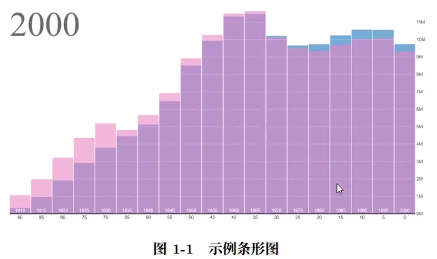
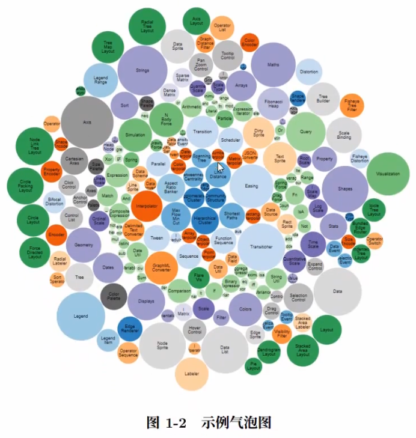
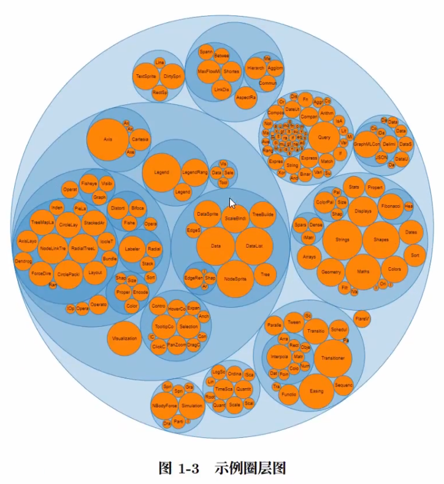
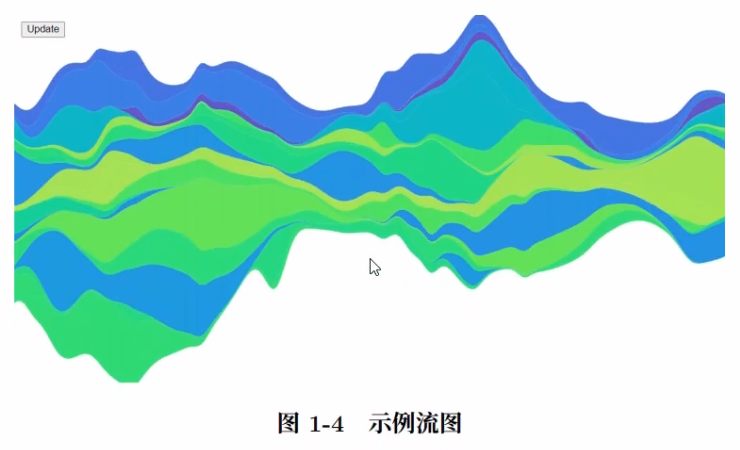
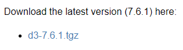

# 1. 简介

D3.js（Data-Driven Documents）是一个使用动态图形，基于数据操作文档的，进行数据可视化的 JavaScript 程序库。D3 帮助您通过使用 HTML、SVG 和 CSS 使数据树树如生，产生交互式的数据展示效果——分层条形图、动画树状图、力导向图、等高线、散点图···。且 D3 提供了现代浏览器的全部功能，无需将束缚在特定框架中，可以与 Vue、React 等结合使用，提供强大的可视化组件和数据驱动的 DOM 操作方法。目前最新版本的 D3 已经更新到了 7.0 版本（截止到 2021 年 7 月）。

D3 是一个开源项日，其源码托管于 GitHub，地址为 https://github.com/d3/d3，官网地址为 https://d3js.org/。另外，官方的 Wiki 手册和推荐资源可在 https://github.com/d3/d3/wiki 中找到。

D3.js 有这样一些特点：

1. **使用 Web 标准**：D3 是一个非常强大的可视化工具，用于创建交互式数据可视化。它利用现代网络标准：SVG、HTML 和 CSS 来创建数据可视化。
2. **数据驱动**：D3 是数据驱动的。它可以使用静态数据或从远程服务器以不同格式（如数组、对象、CSV、JSON、XML 等）获取数据来创建不同类型的图表。
3. **DOM 操作**：D3 允许您根据数据操作文档对象模型（DOM）。
4. **数据驱动元素**：它使您的数据能够动态生成元素并将样式应用于元素,表格、图形等都支持。
5. **动态属性**：D3 可以灵活地为其大部分功能提供动态属性。属性可以指定为数据的函数。这意味着您的数据可以驱动您的样式和属性。
6. **可视化类型**：对于 D3，尽管没有标准的可视化格式，但它允许你自由发挥，创建从 HTML 表格到饼图、图形、条形图到地理空间地图等任何内容。
7. **自定义可视化效果**：由于 D3 使用 Web 标准，因此您可以完全控制可视化功能。
8. **交互和动画**：D3 通过 duration()、delay() 和 ease() 等函数为动画提供了很好的支持，能快速响应用户交互的需要。

如`图1-1`、`图1-2`、`图1-3`、`图1-4` 中所示，这些都是用 D3.js 所绘制出的交互式数据可视化图表。









# 2. 安装

D3 作为一个 JavaScript 函数库，其实并不是标题中所说的 “安装”，更准确地说是 “导入”。它只有单文件，在 HTML 中引用即可。有两种方法：

## 方法一

从官网处下载 D3.js 的压缩包文件并解压。

解压后，在 HTML 中导入相关的 js 文件即可使用 D3。（package/dist 文件夹下的 d3.js 或 d3.min.js）

## 方法二

直接通过网络上的 D3 地址，引用链接到 HTML 中。

```html
<script src="https://d3js.org/d3.v7.min.js"></script>
```
