# 1. 简介

D3.js（Data-Driven Documents）是一个使用动态图形，基于数据操作文档的，进行数据可视化的 JavaScript 程序库。D3 帮助您通过使用 HTML、SVG 和 CSS 使数据树树如生，产生交互式的数据展示效果——分层条形图、动画树状图、力导向图、等高线、散点图···。且 D3 提供了现代浏览器的全部功能，无需将束缚在特定框架中，可以与 Vue、React 等结合使用，提供强大的可视化组件和数据驱动的 DOM 操作方法。目前最新版本的 D3 已经更新到了 7.0 版本（截止到 2021 年 7 月）。

D3 是一个开源项日，其源码托管于 GitHub，地址为 https://github.com/d3/d3，官网地址为 https://d3js.org/。另外，官方的 Wiki 手册和推荐资源可在 https://github.com/d3/d3/wiki 中找到。

D3.js 有这样一些特点：

1. **使用 Web 标准**：D3 是一个非常强大的可视化工具，用于创建交互式数据可视化。它利用现代网络标准：SVG、HTML 和 CSS 来创建数据可视化。
2. **数据驱动**：D3 是数据驱动的。它可以使用静态数据或从远程服务器以不同格式（如数组、对象、CSV、JSON、XML 等）获取数据来创建不同类型的图表。
3. **DOM 操作**：D3 允许您根据数据操作文档对象模型（DOM）。
4. **数据驱动元素**：它使您的数据能够动态生成元素并将样式应用于元素,表格、图形等都支持。
5. **动态属性**：D3 可以灵活地为其大部分功能提供动态属性。属性可以指定为数据的函数。这意味着您的数据可以驱动您的样式和属性。
6. **可视化类型**：对于 D3，尽管没有标准的可视化格式，但它允许你自由发挥，创建从 HTML 表格到饼图、图形、条形图到地理空间地图等任何内容。
7. **自定义可视化效果**：由于 D3 使用 Web 标准，因此您可以完全控制可视化功能。
8. **交互和动画**：D3 通过 duration()、delay() 和 ease() 等函数为动画提供了很好的支持，能快速响应用户交互的需要。

如`图1-1`、`图1-2`、`图1-3`、`图1-4` 中所示，这些都是用 D3.js 所绘制出的交互式数据可视化图表。

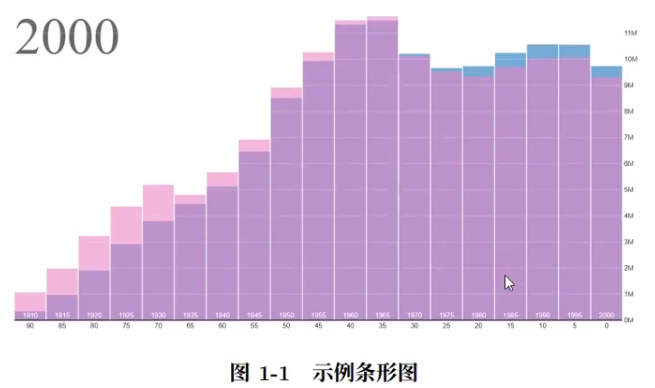

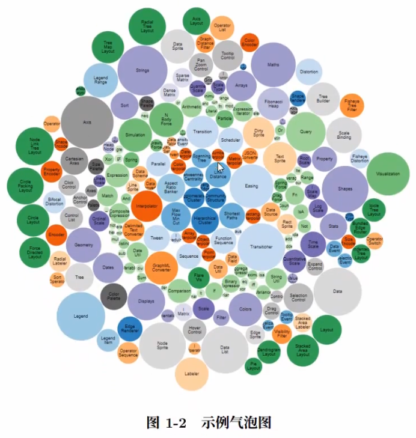

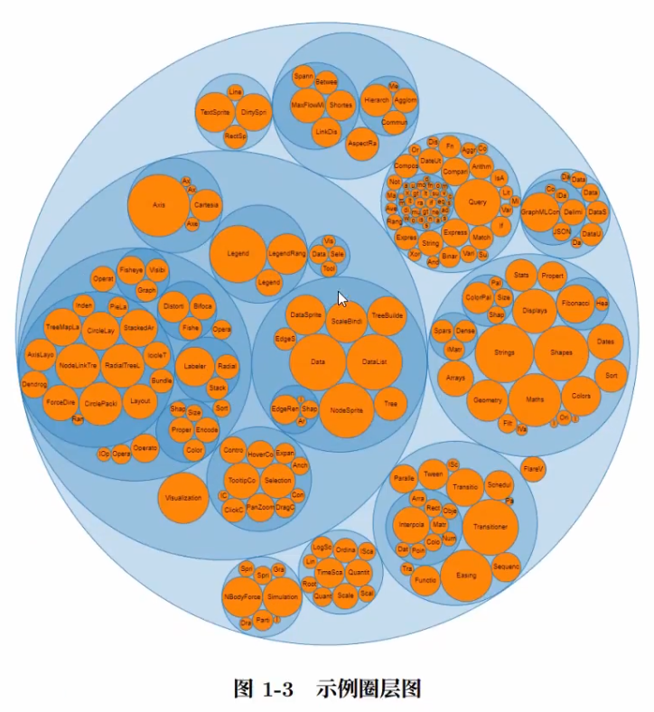

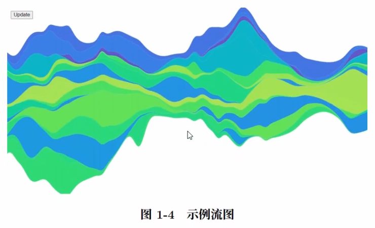

# 2. 安装

D3 作为一个 JavaScript 函数库，其实并不是标题中所说的 “安装”，更准确地说是 “导入”。它只有单文件，在 HTML 中引用即可。有两种方法：

## 方法一

从官网处下载 D3.js 的压缩包文件并解压。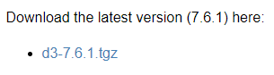

解压后，在 HTML 中导入相关的 js 文件即可使用 D3。（package/dist 文件夹下的 d3.js 或 d3.min.js）

## 方法二

直接通过网络上的 D3 地址，引用链接到 HTML 中。

```html
<script src="https://d3js.org/d3.v7.min.js"></script>
```

# 3. HTML 模板和导入 D3.js

```html
<!DOCTYPE html>
<html lang="en">
<head>
  <meta charset="UTF-8">
  <meta http-equiv="X-UA-Compatible" content="IE=edge">
  <meta name="viewport" content="width=device-width, user-scalable=no, initial-scale=1.0">
  <!-- 导入 d3.js -->
  <script src="./lib/d3.min.js"></script>
  <title>Title</title>
</head>
<body>
<p>张三</p>
<p>李四</p>
<p>王五</p>
</body>
</html>

```

# 4. 元素选择和数据绑定

## 1. 元素选择

```js
const p = d3.select('body').selectAll('p') // 选择所有 div 标签
p.style('color', 'blue').style('font-size', '50px') // 用链式语法设置样式
```

## 2. 数据绑定

### 1. 绑定一个数据 `datum()`

```js
const str = 'China'
p.datum(str)
// 第一个参数：China
// 第二个参数：索引
p.text((item, index) => index + ': ' + item)
```

效果图：

.png)

### 2. 绑定多个数据 `data()`

```js
const array = ['a', 'b', 'c']
p.data(array).text((item, index) => index + ': ' + item)
```

效果图：

.png)

# 5. 插入和删除元素

## 1. 插入元素

插入元素涉及的函数有两个，分别是：

1. **append()**：在选择集末尾插入元素
2. **insert()**：在选择集前面插入元素

html：

```html
<p>张三</p>
<p id="label">李四</p>
<p>王五</p>
```

js：

```js
const body = d3.select('body')
body.append('p').text('赵六') // 在 body 的末尾添加 p 元素
body.insert('p', '#label').text('insert here') // 在 id 为 label 的元素的前面添加 p 元素
```

效果图：

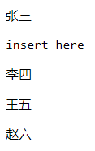

## 2. 删除元素

```js
const p = body.select('#label')
p.remove()
```

# 6. enter() 和 exit() 方法

html:

```html
<p>a</p>
<p>b</p>
```

js：

```js
// Case 1：更新元素
// 结果为 1 2
// 即 a 和 b 被替换成了数组中的前两个元素
d3.select('body').selectAll('p').data([1, 2, 3, 4]).text(item => item)

// Case 2：插入多余的元素
// 结果为 1 2 3 4
// 在 Case 1 的基础上继续操作
// 数据长度大于节点数，通过 enter()，3 和 4 成为了附加节点
d3.select('body').selectAll('p').data([1, 2, 3, 4]).enter().append('p').text(item => item)

// Case 3: 删除多余的元素
// 结果为 1
// 在 Case 2 的基础上继续操作
// 数据长度小于节点数，通过 exit()，删除了多余节点，留下了 1
// 注意：如果先 .text，再 .exit().remove()，则会因为先赋值了而结果为 8
d3.select('body').selectAll('p').data([8]).exit().remove().text(item => item)
```

# 7. 绘制 SVG 图形

前面我们所处理对象都是 HTML 的文字，没有涉及图形的制作。若要进行绘图，首要需要的是一块绘图的 “画布”。在 HTML5 中，提供了两种强有力的 “画布”：SVG 和 Canvas。其中，D3 对 SVG 的支持非常好，提供了众多的 SVG 图形的生成器。本节中，我们将用 SVG 绘制简单的条形图为例来了解 D3 是如何操作 SVG 图形的。

## 1. 什么是 SVG

SVG，指可缩放矢量图形（Scalable Vector Graphics），是用于描述二维矢量图形的种图形格式，是由万维网联盟制定的开放标准。SVG 使用 XML 格式来定义图形，除了 IE8 之前的版本外，绝大部分浏览器都支持 SVG，可将 SVG 文本直接嵌入 HTML 中显示。

SVG 有如下特点：

1. SVG 绘制的是矢量图，因此对图像进行放大不会失真。
2. 基于 XML，可以为每个元素添加 JavaScript 事件处理器。
3. 每个图形均视为对象，更改对象的属性，图形也会改变。

## 2. 添加画布

使用 D3 在 body 元素中添加 SVG 画布的代码如下：

```js
const width = 300, height = 300 // 画布的宽高
const svg = d3.select('body').append('svg').attr('width', width).attr('height', height) // 在 body 末尾添加画布
```

有了画布，接下来就可以在画布上作图了。

## 3. 绘制矩形

在 SVG 中，矩形的元素标签时 `rect`，在 HTML 中可作为标签使用。

```html
<svg>
  <rect width="100" height="100"></rect>
  <rect width="100" height="100" x="110" y="10"></rect>
</svg>
```

矩形的属性，常用的有四个：

1. **width**：矩形的宽度
2. **height**：矩形的高度
3. **x**：矩形左上角的 x 坐标
4. **y**：矩形左上角的 y 坐标

> 要注意的是，在 SVG 中，x 轴的正方向是水平向右，y 轴的正方向是垂直向下的。
>

现在，我们给出一组数据（截止到 2021 年 7 月 31 日的东京奥运会金牌榜前五名的金牌数）对此进行可视化。数据如下：

```js
const array = [21, 17, 16, 11, 10] // 数据（表示矩形的宽度）
```

我们直接将数值的大小作为矩形的宽度，然后添加以下代码：

```js
const rectHeight = 25 // 每个矩形所占的像素高度（包括空白）
svg.selectAll('rect')
  .data(array) // 绑定数据
  .enter()
  .append('rect') // enter() + append()：插入多余的元素
  .attr('y', (item, index) => index * rectHeight) // 设置每个矩形的 y 坐标
  .attr('width', item => item * 10) // 设置每个矩形的宽度（为了显示效果对数值进行了缩放，更好的放啊是通过设置比例尺来优化）
  .attr('height', rectHeight - 5) // 设置每个矩形的高度
  .attr('fill', 'gold') // 设置填充颜色为金色
```

其中便应用到了 `enter()` 方法，它使得在有数据，而没有足够图形元素的情况下，补充足够的元素。

效果图：

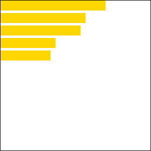

## 4. 使用比例尺

在先前的代码注释中，提到了比例尺的概念。比例尺中有线性比例尺（连续）、序数比例尺（离散）等多种类型之分。其中线性比例尺能使数值从一个连续的区间（定义域 domain）映射到另一个区间（值域 range），来解决条形图宽度的问题。

仍然对于金牌榜的数据，我们应用以下代码来使用线性比例尺：

```js
const linear = d3.scaleLinear().domain([0, d3.max(array)]).range([0, width]) // 创建线性比例尺
```

其中 `d3.scaleLinear()` 的返回值，可被当做函数来使用。因此，有如这样的用法：`linear(0.9)` 去调用该比例尺，于是先前代码中的 `item * 10` 可替换成 `linear(item)`

```js
// .attr('width', item => item * 10) // 设置每个矩形的宽度（为了显示效果对数值进行了缩放，更好的放啊是通过设置比例尺来优化）
.attr('width', item => linear(item)) // 使用比例尺
```

效果图：

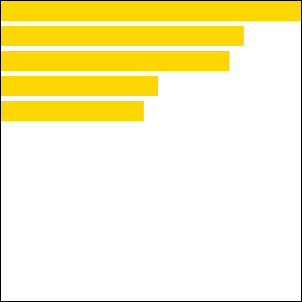

# 8. 坐标轴

## 1. 类型简介

坐标轴，是可视化图表中经常出现的一种图形，由轴线、刻度和标签组成，可以分为水平的 x 轴和垂直方向上的 y 轴。D3 支持了以下四种绘制坐标轴的函数，使用起来很方便。

1. **d3.axisTop()**：创建顶部坐标轴
2. **d3.axisRight()**：创建垂直居右坐标轴
3. **d3.axisBottom()**：创建底部坐标轴
4. **d3.axisLeft()**：创建垂直居左坐标轴

## 2. x 轴坐标轴

```js
// 定义数据、创建画布
const data = [10, 15, 20, 25, 30] // 需要刻画的数据
const width = 400, height = 100 // 将 SVG 画布的宽高定义成变量
const svg = d3.select('body').append('svg').attr('width', width).attr('height', height) // 添加 SVG 画布

// 添加坐标轴
const scale = d3.scaleLinear().domain([d3.min(data), d3.max(data)]).range([0, width - 100]) // 创建线性比例尺（定义域：[10, 30]，值域：[0, 300]）
const x_axis = d3.axisBottom().scale(scale) // 创建横向底部的 x 轴，并向 x 轴添加比例尺
svg.append('g').call(x_axis) // 创建 “组” 并向其中插入 x 轴坐标
```

运行这个例子，可以观察到已作出了一个 x 坐标轴。运行后的效果如图所示：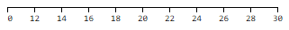

## 3. y 轴坐标轴

类似地，我们也可以创建垂直方向上地轴，代码如下：

```js
// 定义数据、创建画布
const data = [10, 15, 20, 25, 30]
const width = 100, height = 400
const svg = d3.select('body').append('svg').attr('width', width).attr('height', height)

// 添加坐标轴
const scale = d3.scaleLinear().domain([d3.min(data), d3.max(data)]).range([height / 2, 0]) // 创建线性比例尺（定义域：[10, 30]，值域：[200, 0]）
const y_axis = d3.axisLeft().scale(scale) // 创建横向底部的 y 轴，并向 y 轴添加比例尺
svg.append('g').attr('transform', 'translate(50, 10)').call(y_axis) // transform 操作调整了坐标在 SVG 图中地位置
```

运行后的效果如图所示：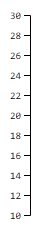

## 4. 同时包含 x 轴和 y 轴坐标轴

现在我们可以把 x 轴和 y 轴并在一张图里，代码如下：

```js
// 定义数据、创建画布
const width = 400, height = 400
const data = [10, 15, 20, 25, 30]
const svg = d3.select('body').append('svg').attr('width', width).attr('height', height)

// 添加坐标轴
const x_scale = d3.scaleLinear().domain([d3.min(data), d3.max(data)]).range([0, width - 100])
const y_scale = d3.scaleLinear().domain([d3.min(data), d3.max(data)]).range([height / 2, 0])

const x_axis = d3.axisBottom().scale(x_scale)
const y_axis = d3.axisLeft().scale(y_scale)

const xAxisTranslate = height / 2 + 10
svg.append('g').attr('transform', `translate(50, ${xAxisTranslate})`).call(x_axis)
svg.append('g').attr('transform', 'translate(50, 10)').call(y_axis)
```

效果如图所示：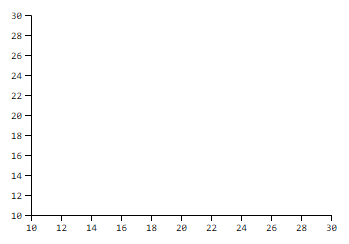

# 9. 条形图

此前，我们已经学会了如何用 SVG 绘制简单的矩形、创建比例尺和坐标轴等。现在，我们可以综合运用起来画出一个带有完整信息的条形图。

我们呢模拟 X 公司在 2011 年至 2016 年期间的股票价格作为数据集，并为它作出条形图实现数据可视化。数据保存在与 HTML 文件同级目录下，命名为 `data.csv`，内容如下：

```
year,value
2011,45
2012,47
2013,52
2014,70
2015,75
2016,78
```

接下来，我们将用这份数据创建垂直方向的条形图。

## 1. 建立画布并定义比例尺

在 HTML 标签中的 body 部分建立好 SVG 画布空间：

```html
<svg width="600" height="500"></svg>
```

在 `<script>` 脚本中，为 SVG 画布定义宽高等，并分别为 x 轴和 y 轴创建比例尺，设定了比例尺的值域。

```js
const svg = d3.select('svg'),
  margin = 200, // 通过 margin 外边距调整位置
  width = svg.attr('width') - margin,
  height = svg.attr('height') - margin
const xScale = d3.scaleBand().range([0, width]).padding(0.4), // scaleBand() 序数比例尺常用于散离值，如年份。padding 用于调整条之间的距离
  yScale = d3.scaleLinear().range([height, 0])
const g = svg.append('g').attr('transform', 'translate(100, 100)') // 创建 ”组“ 元素，调整了图表在 SVG 中的位置
```

## 2. 加载数据并创建坐标轴

在上述 `<script>` 的代码中，继续添加以下这些部分：

```js
d3.csv('./data.csv').then(data => {
  xScale.domain(data.map(item => item.year))
  yScale.domain([0, d3.max(data, item => item.value)])
  g
    .append('g')
    .attr('transform', `translate(0, ${height})`)
    .call(d3.axisBottom(xScale))
  g
    .append('g')
    .call(d3.axisLeft(yScale).tickFormat(item => '$' + item).ticks(10))
})
```

我们来一点点拆解这里新增的代码：

```js
d3.csv('./data.csv').then(data => {
  ...
})
```

这一步使用了 `d3.csv()` 方法加载了数据集 data.csv。然后，我们可以为 x 轴和 y 轴上的比例尺继续添加定义域的范围（在上一步中已经给出了值域）。

```js
// 使用 data.map() 映射离散的年份值给 x 比例尺
xScale.domain(data.map(item => item.year))
// 对于 y 轴，使用 d3.max() 将定义域设为 [0, max]
yScale.domain([0, d3.max(data, item => item.value)])
```

通过创建组（g）元素，将 x 轴添进元素中，然后我们用 `transform` 属性来调整其在 SVG 画布中的位置居底部，并调用了 `d3.axisBottom(xScale)` 插入了 x 轴坐标轴。

```js
g.append('g').attr('transform', `translate(0, ${height})`).call(d3.axisBottom(xScale))
```

同样地，我们调用 `axisLeft()` 在组元素中创建了 y 轴坐标轴。由于 y 轴上的元素是股价，我们可以格式化添加 $ 的前缀，同时使用了 `ticks()` 方法来指定 y 轴大致由多少个区间。

```js
g.append('g').call(d3.axisLeft(yScale).tickFormat(item => '$' + item).ticks(10))
```

截止到这里，如图所示，我们呢已经作出了与数据相适应的坐标系。

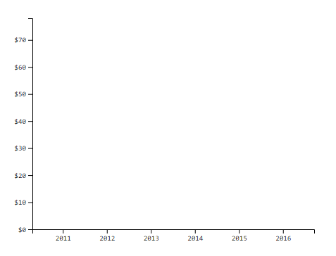

## 3. 条形绘制

然后，我们可以在轴上根据数据创建条形。见如下代码（添加在 `.csv()` 的回调函数内），我在此通过注释方式来讲解。

```js
g
  .selectAll('.bar') // class 选择器
  .data(data)
  .enter()
  .append('rect') // 使用 enter() + append() 绑定数据
  .attr('class', 'bar') // 添加 class 属性
  .attr('x', item => xScale(item.year)) // x 轴坐标为年份
  .attr('y', item => yScale(item.value)) // y 轴坐标为股票价格
  .attr('width', xScale.bandwidth()) // 和 x 轴下的 scaleBand() 对应
  .attr('height', item => height - yScale(item.value))
  .attr('fill', 'grey') // 使用灰色填充，也可以根据 .bar 写 css 样式来改变颜色
```

此时的效果如图所示：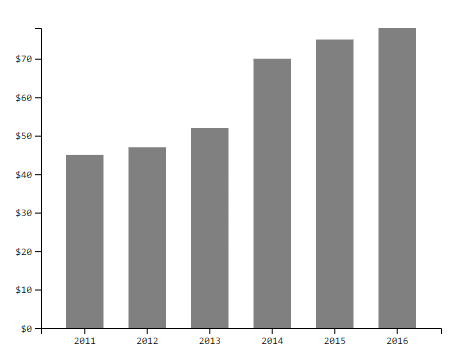

## 4. 添加标签

我们还需要为图表添加标签，如标题、坐标轴上的单位等。使用以下代码添加条形图位于正上方的标题：

```js
svg
  .append('text')
  .attr('transform', 'translate(100, 0)')
  .attr('x', 50)
  .attr('y', 50)
  .attr('font-size', '24px')
  .text('X 公司股票价格')
```

找到此前为 x 轴和 y 轴分别使用 `axisBottom()` 和 `axisLeft()` 方法创建坐标轴的代码段，修改为：

```js
g
  .append('g')
  .attr('transform', `translate(0, ${height})`)
  .call(d3.axisBottom(xScale))
	// 4. 添加标签
  .append('text')
  .attr('transform', 'translate(0, -100)')
  .attr('x', width - 100)
  .attr('y', width - 250)
  .attr('text-anchor', 'end')
  .attr('stroke', 'black')
  .text('年份')
g
  .append('g')
  .call(d3.axisLeft(yScale).tickFormat(item => '$' + item).ticks(10))
	// 4. 添加标签
  .append('text')
  .attr('transform', 'rotate(-90)')
  .attr('y', 6)
  .attr('dy', '-5.1em')
  .attr('text-anchor', 'end')
  .attr('stroke', 'black')
  .text('股价')
```

至此条形图绘制完成，效果如图所示：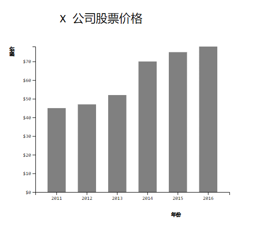

# 10. 饼图

在这一节中，我们将学习如何使用 D3 来绘制饼图做数据可视化。我们会用到以下几个方法：

1. **SVG 路径**：使用预定义的命令创建 SVG 路径
2. **d3.scaleOrdinal()**：创建序数比例尺
3. **d3.pie()**：饼图生成器
4. **d3.arc()**：弧生成器

## 1. SVG 路径

路径元素用于在 SVG 上创建路径。我们可以使用命令在 SVG 中绘制出路径。

```html
<svg width="400" height="210">
  <path d="M150 0 L75 200 L225 200 Z"></path>
</svg>
```

如上述代码定义了一条从起点（150, 0）开始，经过（75, 200），（225, 200）的路径，并在起点处汇合。

见图所示：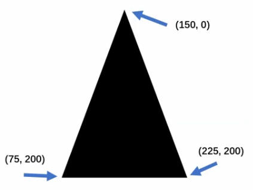

## 2. d3.scaleOrdinal()

我们在此前也学习过了比例尺的相关概念，此处我们会新使用到序数比例尺 `d3.scaleOrdinal()`。

```js
const color = d3.scaleOrdinal(['#4daf4a', '#377eb8', '#ff7f00', '#984ea3', '#e41a1c'])
console.log(color(0)) // #4daf4a
console.log(color(1)) // #377eb8
console.log(color(2)) // #ff7f00
console.log(color(3)) // #984ea3
console.log(color(4)) // #e41a1c
console.log(color(5)) // #4daf4a，循环序数
```

在这段代码中，我们定义了 5 种颜色，并进行了枚举遍历。当遍历到第 6 个值时，超出了颜色总数量会回到起点，即循环序数。

## 3. d3.pie()

`d3.pie()` 函数根据给定的数据，生成在 SVG 中的饼图对象（楔形）。对每一个楔形计算了初始角度和结束角度，而这便能被用于创建 SVG 中楔形的实际路径。

```js
const data = [2, 4, 8, 10]
const pie = d3.pie()
console.log(pie(data))
```

打开浏览器中的 Console 调试，可以看到 log 输出：

```js
[
  {
    data: 2,
    index: 3,
    value: 2,
    startAngle: 5.759586531581287,
    endAngle: 6.283185307179586,
    padAngle: 0
  },
  {...}, {...}, {...}
]
```

## 4. d3.arc()

`d3.arc()` 函数生成弧，具体楔形的路径。弧需要一个内径和外径。如果内径为 0，则结果将是饼图，否则结果将是环形图。我们需要用到这些生成的弧线提供给我们的 SVG 路径元素。

以下这段代码生成了一个简单的饼图：

html：

```html
<svg width="300" height="200"></svg>
```

js：

```js
// 定义变量
const svg = d3.select('svg'),
  width = svg.attr('width'), // 宽
  height = svg.attr('height'), // 高
  radius = Math.min(width, height) / 2, // 半径（除以 2 保证不会超出 SVG 画布边界）
  g = svg.append('g').attr('transform', `translate(${width / 2}, ${height / 2})`) // 添加组元素

// 对颜色使用序数比例尺
const color = d3.scaleOrdinal(['#4daf4a', '#377eb8', '#ff7f00', '#984ea3', '#e41a1c'])

// 生成饼
const pie = d3.pie()

// 生成弧
const arc = d3
	.arc()
  .innerRadius(0) // 内半径
  .outerRadius(radius) // 外半径

const data = [2, 4, 8, 10]

// 生成组
const arcs = g
	.selectAll('arc')
  .data(pie(data))
  .enter()
  .append('g')
  .attr('class', 'arc')

// 绘制路径
arcs
  .append('path')
  .attr('d', arc)
	.attr('fill', (item, index) => color(index)) // 枚举序数填充颜色
```

效果图：

.png)

## 5. 饼图案例 - 浏览器市场份额

接下来，我们将以绘制桌面端浏览器市场份额饼图的实际案例来演示一个完整包含了标签等信息的饼图。

创建一个 `browser_share.csv` 的 CSV 文件，内容为：

```
browser,percent
Chrome ,68.4
Safari ,9.41
Firefox,8.03
Edge   ,6.36
Opera  ,2.5
其他     ,5.3
```

html：

```html
<svg width="500" height="400"></svg>
```

css：

```css
.arc text {
  font: 8px sans-serif;
  text-anchor: middle;
}

.arc path {
  stroke: #fff;
}

.title {
  fill: teal;
  font-weight: bold;
}
```

js：

```js
// 定义变量
const svg = d3.select('svg'),
  width = svg.attr('width'),
  height = svg.attr('height'),
  radius = Math.min(width, height) / 2,
  g = svg.append('g').attr('transform', `translate(${width / 2}, ${height / 2})`)

// 对颜色使用序数比例尺
const color = d3.scaleOrdinal(['#4daf4a', '#377eb8', '#ff7f00', '#984ea3', '#e41a1c'])

// 生成饼
const pie = d3.pie().value(item => item.percent) // 创建匿名函数返回数据中百分比的值

// 生成弧
const arc = d3
  .arc()
  .outerRadius(radius - 30)
  .innerRadius(90) // 0 时为饼图，非 0 为环形图

// 定义标签所在位置
const label = d3
  .arc()
  .outerRadius(radius)
  .innerRadius(radius - 100)

// 读取 CSV 文件
d3.csv('./browser_share.csv').then(data => {
  // 生成组
  const arcs = g
    .selectAll('.arc')
    .data(pie(data))
    .enter()
    .append('g')
    .attr('class', 'arc')

  // 绘制路径
  arcs
    .append('path')
    .attr('d', arc)
    .attr('fill', item => color(item.data.browser)) // 枚举序数填充颜色

  // 在每个楔形中添加标签为浏览器名称
  arcs
    .append('text')
    .attr('transform', item => `translate(${label.centroid(item)})`)
    .text(item => item.data.browser)
})

// 添加图表标题
svg
  .append('g')
  .attr('transform', `translate(${width / 2 - 150}, 20)`)
  .append('text')
  .attr('class', 'title')
  .text('桌面端浏览器市场份额统计（截至 2021 年 7 月）')
```

绘制出的效果如图所示：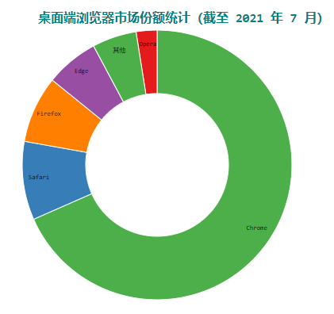

# 11. 动态交互

D3 支持制作动态的图表。有时候，图表的变化需要缓慢地发生，以便于让用户看清楚变化的过程。此外，用户还可能会对图表中的部分元素进行点击，而图表可会对不同的事件作出反应。D3 提供了这些能提升交互式的用户体验的方法和操作。

## 1. 什么是动态效果

前面几节中制作的图表是直接显示出现，且绘制完成后不再发生变化的，这是静态的图表。

动态的图表，是指图表在某一时间段会发生某种变化，可能是形状、颜色、位置等，用户能够看到变化的过程。

例如，有一个圆，圆心坐标为（100, 100）。现在我们希望圆的 x 坐标从 100 移到 300，并且移动过程在 2 秒的时间内发生。

这种时候就需要用到动态效果，在 D3 里我们称之为过渡（transition）。

## 2. 实现动态的方法

D3 提供了 4 个方法用于实现图形的过渡：从状态 A 变为状态 B。

### 1. transition()

`transition()` 用于启动过渡效果。其前后是图形变化前后的状态（形状、位置、颜色等）。例如这段代码片段：

```js
.attr('fill', 'red') // 初始颜色为红色
.transition() // 启动过渡
.attr('fill', 'green') // 终止颜色为绿色
```

D3 会自动对两种颜色（如上例中的红色和绿色）之间的颜色值（RGB 值）进行插值计算，得到过渡用的颜色值。我们可以观察到颜色变化时的动态渐变效果。

### 2. duration()

`duration()` 用来指定过渡的持续时间，单位为毫秒。

```js
.attr('fill', 'red') // 初始颜色为红色
.transition() // 启动过渡
.duration(1000) // 设置过渡的持续时间为 1 秒
.attr('fill', 'green') // 终止颜色为绿色
```

### 3. delay()

`delay()` 指定延迟的时间，表示一定时间后才开始转变，单位同样为毫秒。此函数可以对整体指定延迟，也可以对个别指定延迟。

如对整体指定延迟：

```js
.transition()
.duration(1000)
.delay(500) // 延迟 500 毫秒
```

图形整体会在延迟 500 毫秒后发生变化，变化的时长为 1000 毫秒。因此，过渡的总时长为 1500 毫秒。

也能对一个个的图形（假设已经绑定了数据）分别指定设置延迟：

```js
.transition()
.duration(1000)
.delay((item, index) => 200 * index)
```

假设有 10 个元素，则第 1 个元素延迟 0 毫秒，第 2 个元素延迟 200 毫秒，第 3 个 元素延迟 400 毫秒，以此类推。

### 4. ease()

`ease()` 指定过渡的缓动函数。常用的有：

1. `d3.easeLinear`：普通的线性变化
2. `d3.easeCircle`：慢慢地到达变换的最终状态
3. `d3.easeElastic`：带有弹跳的到达最终状态
4. `d3.easeBounce`：在最终状态处弹跳几次

调用方式形如：

```js
.ease(d3.easeLinear)
```

### 5. 拿之前的饼图案例演示

```js
arcs
  .append('path')
  .attr('d', arc)
  .attr('fill', item => color(item.data.browser)) // 初始颜色
  .transition() // 启动过渡
  .duration(1000) // 持续时间
  // .delay(500) // 延迟时间
  .delay((item, index) => 200 * index) // 第 1 个元素延迟 0 毫秒，第 2 个元素延迟 200 毫秒，第 3 个 元素延迟 400 毫秒，以此类推
  .ease(d3.easeElastic) // 指定过渡的缓动函数
  .attr('fill', 'gold') // 终止颜色
```

## 3. 什么是交互

交互，指的是用户输入了某种指令，程序接受到指令之后必须做出某种响应。对可视化图表来说，交互能使图表更加生动，能表现更多内容。例如：拖动图表中某些图形、鼠标滑到图形上出现提示框、用触屏放大或缩小图形等等。

用户用于交互的工具一般有三种：鼠标、键盘、触屏。

## 4. 如何添加交互

对某一元素添加交互操作十分简单，代码如下：

```js
const circle = svg.append('circle')
circle.on('click', () => {
  // 在此处添加交互内容
})
```

这段代码在 SVG 中添加了一个圆，然后通过 `on()` 添加了一个监听器。在 D3 中，每一个选择集都有 `on()` 函数，用于添加事件监听器。

其中，`on()` 的第一个参数是监听的事件，第二个参数是监听到事件后响应的内容，第二个参数是一个函数。

对于鼠标，常用的事件有：

click：鼠标单击某元素时，相当于 mousedown 和 mouseup 组合在一起。

1. **mouseover**：光标放在某元素上。
2. **mousemove**：鼠标被移动的时候。
3. **mouseout**：光标从某元素上移出来时。
4. **mousedown**：鼠标按钮被按下。
5. **mouseup**：鼠标按钮被松开。
6. **dblclick**：鼠标双击。

键盘常用的事件有三个：

1. **keydown**：当用户按下任意键时触发，按住不放会重复触发此事件。该事件不会区分字母的大小写，例如 “A” 和 “a” 被视为一致。
2. **keypress**：当用户按下字符键（大小写字母、数字、加号、等号、回车等）时触发，按住不放会重复触发此事件。该事件区分字母的大小写。
3. **keyup**：当用户释放键时触发，不区分字母的大小写。

触屏常用的事件有三个：

1. **touchstart**：当触摸点被放在触摸屏上时。
2. **touchmove**：当触摸点在触摸屏上移动时。
3. **touchend**：当触摸点从触摸屏上拿开时。
