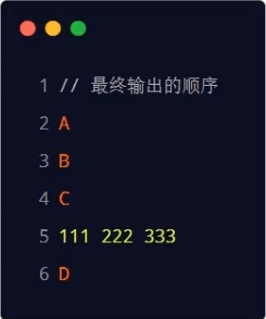
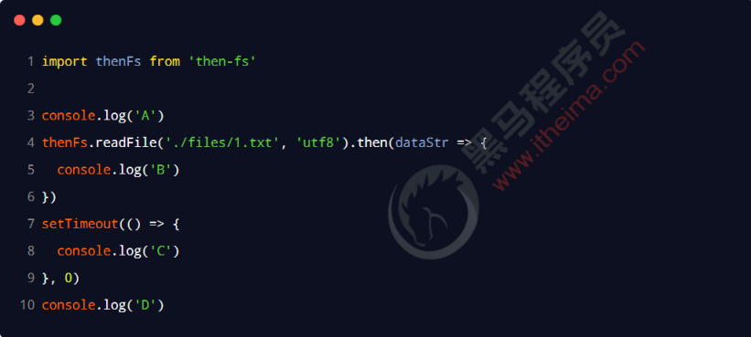
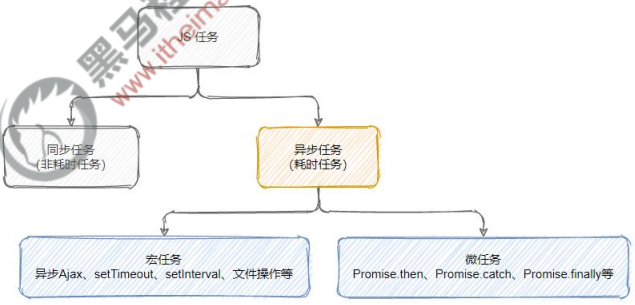

# 1. ES 介绍

ES 全称 **E**CMA**S**cript，是脚本语言的**规范**，而平时经常编写的 **JavaScript**，是 ECMAScript 的**一种实现**，所以 ES 新特性其实指的就是 **JavaScript 的新特性**

# 2. 为什么要学习 ES 新特性

1. 语法简洁，功能丰富
2. 框架开发应用
3. 前端开发职位要求

# 3. 前置知识

1. JavaScript 基本语法
2. AJAX 与 Node.js

# 4. ECMAScript 6+

## 1. ECMAScript 相关介绍

### 1. 什么是 ECMA

ECMA（European Computer Manufacturers Association）中文名称为欧洲计算机制造商协会，这个组织的目标是评估、开发和认可电信和计算机标准。1994 年后该组织改名为 ECMA 国际。

### 2. 什么是 ECMAScript

ECMAScript 是由 ECMA 国际通过 ECMA-262 标准化的脚本程序设计语言。

### 3. 什么是 ECMA-262

ECMA 国际制定了许多标准，而 ECMA-262 只是其中的一个，所有标准列表查看：

https://www.ecma-international.org/publications-and-standards/standards/

### 4. ECMA-262 历史

ECMA-262（ECMAScript）历史版本查看网址：

https://www.ecma-international.org/publications-and-standards/standards/ecma-262/

### 5. 谁在维护 ECMA-262

TC39（Technical Committee 39）是推进 ECMAScript 发展的委员会。其会员都是公司（其中主要是浏览器厂商，由苹果、谷歌、微软、因特尔等）。TC39 定期召开会议，会议由会员公司的代表与特邀专家出席。

### 6. 为什么要学习 ES6

- ES6 的版本变动内容最多，具有里程碑意义
- ES6 加入许多新的语法特性，编程实现更简单、高效
- ES6 是前端发展趋势，就业必备技能

## 2. ECMAScript 6 新特性

### 1. let 定义变量

```js
// 1.let 用来声明变量
let a;
let b, c, d;
let e = 100;
let f = 10, g = 'zhangsan', h = [];

// 2.变量不能重复声明
// let start = 'a';
// let start = 'b';

// 3.块级作用域
// 在 ES5 里面有三种作用域：全局、函数、eval
// 在 ES6 中加入了块级作用域
{
    let name = 'zhangsan';
    console.log(name);
}
console.log(name);// 在这里访问不到

// 4.不存在变量提升
// console.log(age);
// let age = 19;// 会报错

// 5.不影响作用域
{
    let gender = '男';
    function fun() {
        console.log(gender);// 可以访问到
    }
    fun();
}
```

### 2. const 定义常量

```js
// 1.声明常量
const SCHOOL = '尚硅谷';
console.log(SCHOOL);

// 2.一定要赋初始值
// const A;

// 3.一般常量使用大写（潜规则）
const a = 100;

// 4.常量的值不能修改
// SCHOOL = 'ATGUIGU';// 报错

// 5.块级作用域
{
    const PLAYER = 'UZI';
}
// console.log(PLAYER);// 这里访问不到

// 6.对于数组和对象的元素修改，不算做对常量的修改，不会报错
const ARRAY = [1, 2, 3];
ARRAY.push(4);
console.log(ARRAY);
```

### 3. 变量结构赋值

ES6 允许按照一定模式从数组和对象中提取值，对变量进行赋值，这被称为结构赋值。

```js
// 1.数组的结构
const ARRAY = ['值1', '值2', '值3'];
let [a, b, c] = ARRAY;// 将数组中每个值拿出来赋值给 a、b、c 三个变量
console.log(a, b, c);

// 2.对象的结构
const OBJ = {
    id: 10,
    name: 'zhangsan',
    fun: function () {
        console.log('fun===');
    }
};
let { id, name, fun } = OBJ;// 将对象中指定键的值拿出来，然后将值赋给一个变量，以键名作为变量
console.log(id, name);
fun();
```

### 4. 模板字符串

ES6 加入新的声明字符串的方式 ``

```js
// 1.声明
let str = `我也是一个字符串哦！`;
console.log(str, typeof str);

// 2.内容中可以直接出现换行符
str = `<ul>
            <li>第1个li</li>
            <li>第2个li</li>
            <li>第3个li</li>
            </ul>`;
console.log(str);

// 3.变量拼接
let a = 'aaa';
let b = `${a}bbb`;
console.log(b);
```

### 5. 简化对象写法

ES6 允许在大括号里面，直接写入变量和函数，作为对象的属性和方法。

```js
let name = '尚硅谷';
let change = function () {
    console.log('change...');
};

const school = {
    name,
    change,
    add() {
        console.log('add...');
    }
};
// 以上写法等价于以下写法
// const school = {
//     name: name,
//     change: change,
//     add: function () {
//         console.log('add...');
//     }
// };
console.log(school);
```

### 6. 箭头函数

ES6 允许使用箭头（=>）定义函数

```js
// 1.声明一个函数
let fun = (a, b) => {
    return a + b;
};
// 以上写法等价于以下写法
// let fun = function (a, b) {
//     return a + b;
// };
let sum = fun(10, 20);
console.log(sum);

// 2.this 是静态的，this 始终指向函数声明时所在作用域下的 this 的值
function getName() {
    console.log(this.name);
}

let getName2 = () => {
    console.log(this.name);
}

// 设置 window 对象的 name 属性
window.name = '尚硅谷';
const school = {
    name: 'ATGUIGU'
};

// 直接调用
getName();
getName2();

// call 方法调用，call 方法可以用来代替另一个对象调用一个方法
getName.call(school);
getName2.call(school);

// 3.不能作为构造实例化对象
// let Person = (name, age) => {
//     this.name = name,
//     this.age = age
// };
// let person = new Person('zhangsan', 18);// 报错
// console.log(person);

// 4.不能使用 arguments 变量
// let fun2 = () => {
//     console.log(arguments);
// };
// fun2(1, 2, 3);

// 5.箭头函数的简写
// 5.1 省略小括号，当形参有且只有一个的时候
let add = n => {
    return n;
};
// 5.2 省略大括号，当代码体只有一条语句的时候，此时 return 必须省略，而且语句的执行结果就是函数的返回值
let pow = n => n + n;
console.log(pow(5));
```

### 7. 参数默认值

ES6 允许给函数参数赋值初始值

```js
// 1.形参初始值，具有默认值的参数，一般位置要靠后（潜规则）
function add(a, b, c = 10) {
    return a + b + c;
}
let result = add(1, 2);
console.log(result);

// 2.与解构赋值结合
function connection({ host = 'localhost', username, password, port }) {
    console.log(host, username, password, port);
}
connection({
    // host: 'localhost',
    username: 'root',
    password: '123',
    port: 3306
});
```

### 8. rest 参数

ES6 引入 rest 参数，用于获取函数的实参，用来代替 arguments

```js
// ES5 获取实参的方式
let data = function () {
    console.log(arguments);
}
data('a', 'b', 'c');

// rest 参数，可以在箭头函数中使用
data = (...args) => {
    console.log(args);
}
data('d', 'e', 'f');

// rest 参数必须要放到最后
function fun(a, b, ...args) {
    console.log(a, b, args);
}
fun('g', 'h', 'i', 'j', 'k');
```

### 9. spread 扩展运算符

【...】 扩展运算符能将【数组】转换为逗号分隔的【参数序列】

```js
// 声明一个数组
const array = ['a', 'b', 'c'];

// 声明一个函数
function fun() {
    console.log(arguments);
}
fun(...array);// 相当于 fun('a', 'b', 'c');
```

### 10. Symbol

ES6 引入了一种新的原始数据类型 Symbol，表示独一无二的值。它是 JavaScript 语言的第七种数据类型，是一种类似于字符串的数据类型。

Symbol 特点：

1. Symbol 的值是唯一的，用来解决命名冲突的问题
2. Symbol 值不能与其他数据进行运算
3. Symbol 定义的对象属性不能使用 for...in 循环遍历，但是可以使用 Reflect.ownKeys 来获取对象的所有键名

#### 1. Symbol 的简单使用

```js
// 创建 Symbol
let s = Symbol();
console.log(s, typeof s);

let s2 = Symbol('尚硅谷');
let s3 = Symbol('尚硅谷');
console.log(s2, s3, s2 === s3);// false

// Symbol.for 创建
let s4 = Symbol.for('尚硅谷');
let s5 = Symbol.for('尚硅谷');
console.log(s4, s5, s4 === s5);// true

// 不能与其他数据进行运算
// let result = s + 100;
// let result = s > 100;
// let result = s + s;
```

#### 2. Symbol 创建对象属性

```js
// 向对象中添加方法 up down
let game = {
    up: function () {
        console.log('up');
    },
    down: function () {
        console.log('down');
    }
};

let methods = {
    up: Symbol(),
    down: Symbol()
};

game[methods.up] = function () {
    console.log('我可以改变形状');
}

game[methods.down] = function () {
    console.log('我可以快速下降');
}

console.log(game);

// 第二种
let youxi = {
    name: '狼人杀',
    [Symbol('say')]: function () {
        console.log('我可以发言');
    },
    [Symbol('zibao')]: function () {
        console.log('我可以自爆');
    }
};

console.log(youxi);
```

#### 3. Symbol 内置属性

```js
// hasInstance：当其他对象使用 instanceof 运算符，判断是否为该对象的实例时，会调用这个方法
class Person {
    static [Symbol.hasInstance](param) {
        console.log(param);
        console.log('我被用来检测类型了');
        return true;
    }
}

let o = {};

console.log(o instanceof Person);

// isConcatSpreadable：对象的 isConcatSpreadable 属性等于的是一个布尔值，表示该对象用于 Array.Prototype.concat() 时，是否可以展开。
const array = [1, 2, 3];
const array2 = [4, 5, 6];
array2[Symbol.isConcatSpreadable] = false;
console.log(array.concat(array2));
```

### 11. 迭代器

迭代器（Iterator）是一种接口，为各种不同的数据结构提供统一的访问机制。任何数据类型只要部署 Iterator 接口，就可以完成遍历操作。

ES6 创造了一种新的遍历命令 for...of 循环，Iterator 接口主要供 for...of 消费

```js
// 使用 for...of 遍历数组
const array = ['a', 'b', 'c', 'd', 'e'];
for (let i of array) {
    console.log(i);
}

console.log(array);

let iterator = array[Symbol.iterator]();
console.log(iterator);

// 调用对象的 next() 方法
console.log(iterator.next());
console.log(iterator.next());
console.log(iterator.next());
console.log(iterator.next());
console.log(iterator.next());
```

**迭代器自定义遍历对象**

```js
const banji = {
    name: '一班',
    stus: [
        'xiaoming',
        'xiaoning',
        'xiaotian'
    ],
    [Symbol.iterator]() {// 自定义迭代器
        let index = 0;
        let _this = this;
        return {
            next: function () {
                if (index < _this.stus.length) {
                    return {
                        value: _this.stus[index++],
                        done: false
                    }
                } else return { value: undefined, done: true };
            }
        };
    }
};

// 遍历这个对象
for (let i of banji) {
    console.log(i);
}
```

### 12. 生成器函数

生成器函数是 ES6 提供的一种异步编程解决方案，语法行为与传统函数完全不同

```js
// 生成器其实就是一个特殊的函数
// 异步编程，纯回调函数 node、fs、ajax、mongoDB

function* gen() {
    console.log('hello generator');

    // 函数代码的分隔符，
    console.log(111);
    yield 'aaa';// 第一次调用 next() 代码执行到这里结束，并返回 aaa
    console.log(222);
    yield 'bbb';// 第二次调用 next() 代码执行到这里结束，并返回 bbb
    console.log(333);
    yield 'ccc';// 第三次调用 next() 代码执行到这里结束，并返回 bbb
    console.log(444);// 第四次调用 next() 执行以这行代码
}

// 直接调用返回的是一个迭代器
let iterator = gen();
console.log(iterator.next());
console.log(iterator.next());
console.log(iterator.next());
console.log(iterator.next());

console.log('==============================');

// 遍历
for (let i of gen()) {
    console.log(i);
}
```

**生成器函数参数**

```js
function* gen(args) {
    console.log(args);
    let one = yield 111;// 第二次调用 next() 传的参数，将作为上一个 yield 的返回结果
    console.log(one);// bbb
    let two = yield 222;// 第三次调用 next() 传的参数，将作为上一个 yield 的返回结果
    console.log(two);// ccc
    let three = yield 333;// 第四次调用 next() 传的参数，将作为上一个 yield 的返回结果
    console.log(three);// ddd
}

let iterator = gen('AAA');
console.log(iterator.next());
console.log(iterator.next('bbb'));
console.log(iterator.next('ccc'));
console.log(iterator.next('ddd'));
```

### 13. Promise

Promise 是 ES6 引入的异步编程的新解决方案。语法上 Promise 是一个构造函数，用来封装异步操作并可以获取其成功或失败的结果。

1. Promise 构造函数：Promise(excutor) {}
2. Promise.prototype.then 方法
3. Promise.prototype.catch 方法

#### 1. Promise 基本语法

```js
// 实例化 Promise 对象
const p = new Promise((resolve, reject) => {
    setTimeout(() => {// 模拟数据库查询
        // let data = '数据库中的用户数据';
        // resolve(data);// 成功

        let error = '数据读取失败';
        reject(error);// 失败
    }, 1000);
});

// 调用 Promise 对象的 then 方法
p.then(value => {
    // 如果是成功，进入这里
    console.log(value);
}, reason => {
    // 如果是失败，进入这里
    console.error(reason);
});
```

#### 2. Promise 读取文件

```js
const fs = require('fs');
const path = require('path');

// 正常读取
// fs.readFile(path.join(__dirname, './a.txt'), (error, data) => {
//     if (error) throw error;
//     console.log(data.toString());
// });

// 使用 Promise 封装
const p = new Promise((resolve, reject) => {
    fs.readFile(path.join(__dirname, './a.txt'), (error, data) => {
        if (error) reject(error);
        resolve(data);
    });
});

p.then(value => console.log(value.toString()), reason => console.error(reason));
```

#### 3. Promise 封装 AJAX

```js
const p = new Promise((resolve, reject) => {
    const xhr = new XMLHttpRequest();
    xhr.open("get", "http://www.liulongbin.top:3006/api/getbooks", true);
    xhr.send();
    xhr.onreadystatechange = () => {
        if (xhr.readyState === 4) {
            if (xhr.status >= 200 && xhr.status < 300) {
                resolve(xhr.response);// 跟 xhr.responseText 一样
            } else reject(xhr.status);
        }
    }
});

p.then(value => console.log(value), (reason) => console.error(reason));
```

#### 4. Promise 的 then() 方法

```js
const p = new Promise((resolve, reject) => {
    setTimeout(() => {
        resolve('用户数据');
        // reject('出错啦');
    }, 1000);
});

// then 方法的返回结果是 Promise 对象，状态由回调函数的执行结果决定
// 如果回调函数中返回的结果是非 Promise 类型的属性，则状态为成功，返回值为对象的成功的值
const result = p.then(value => {
    console.log(value);

    // return 111;// 如果没有返回值，默认返回 undefined 也是非 Promise 类型的属性

    // return new Promise((resolve, reject) => {
    //     // resolve('ok');// 返回成功的 Promise 对象
    //     reject('error');// 返回失败的 Promise 对象
    // });

    // throw new Error('出错啦！');// 抛出错误也是失败状态
    throw '出错啦！';// 抛出错误也是失败状态
}, reason => {
    console.error(reason);
});
console.log(result);

// 链式调用
// p.then().then().then();
```

#### 5. Promise 读取多个文件

```js
const fs = require('fs');
const path = require('path');

// 使用 Promise 封装
const p = new Promise((resolve, reject) => {
    fs.readFile(path.join(__dirname, './a.txt'), (error, data) => {
        resolve(data);
    });
});

p.then(value => {
    return new Promise((resolve, reject) => {
        fs.readFile(path.join(__dirname, './b.txt'), (error, data) => {
            resolve([value, data]);
        });
    });
}).then(value => {
    return new Promise((resolve, reject) => {
        fs.readFile(path.join(__dirname, './c.txt'), (error, data) => {
            value.push(data);
            resolve(value);
        });
    });
}).then(value => {
    console.log(value.join('\r\n'))
});
```

#### 6. Promise 的 catch 方法

```js
const p = new Promise((resolve, reject) => {
    setTimeout(() => {
        reject('出错啦！');
    }, 1000);
});

// p.then(value => {}, (reason) => console.error(reason));

// 调用 catch 直接指定错误回调
p.catch(reason => console.warn(reason));
```

#### 7. 基于 then-fs 读取文件内容

由于 node.js 官方提供的 fs 模块**仅支持**以**回调函数的方式**读取文件，**不支持 Promise 的调用方式**。因此，需要先运行如下的命令，安装 **then-fs** 这个第三方包，从而支持我们基于 Promise 的方式读取文件的内容：

```bash
npm i then-fs
```

调用 then-fs 提供的 **readFile()** 方法，可以异步地读取文件的内容，**它的返回值是 Promise 的实例对象**。因此可以**调用 .then() 方法**为每个 Promise 异步操作指定**成功**和**失败**之后的回调函数。示例代码如下：

```js
import thenFs from 'then-fs'

thenFs.readFile('../files/a.txt', 'utf8').then(result => console.log(result), error => console.error(error.message))
thenFs.readFile('../files/b.txt', 'utf8').then(result => console.log(result), error => console.error(error.message))
thenFs.readFile('../files/c.txt', 'utf8').then(result => console.log(result), error => console.error(error.message))
```

> 注意：上述的代码**无法保证文件的读取顺序**，需要做进一步改进！

如果上一个 .then() 方法中**返回了一个新的 Promise 实例对象**，则可以通过下一个 .then() 继续进行处理。通过 .then() 方法的**链式调用**，就解决了回调地狱的问题：

```js
thenFs.readFile('../files/a.txt', 'utf8').then(result => {
  console.log(result)
  return thenFs.readFile('../files/b.txt', 'utf8')
}).then(result => {
  console.log(result)
  return thenFs.readFile('../files/c.txt', 'utf8')
}).then(result => {
  console.log(result)
}, error => {
  console.error(error.message)
}).catch(error => {
  // 通过 catch() 方法来捕获以上所有的异常
  console.error(error.message)
})
```

```js
thenFs.readFile('../files/aaaaaaaaaaaaaaaaaaaaaaa.txt', 'utf8').catch(error => {
  // 可以把 catch() 方法往前提，这样这个文件读取错误后，后面的文件可以继续读取
  console.error(error.message)
}).then(result => {
  console.log(result)
  return thenFs.readFile('../files/b.txt', 'utf8')
}).then(result => {
  console.log(result)
  return thenFs.readFile('../files/c.txt', 'utf8')
}).then(result => {
  console.log(result)
}, error => {
  console.error(error.message)
})
```

#### 8. Promise.all() 方法

Promise.all() 方法会发起并行的 Promise 异步操作，等**所有的异步操作全部结束后**才会执行下一步的 .then 操作（等待机制）。示例代码如下：

```js
import thenFs from 'then-fs'

const promiseArray = [
  thenFs.readFile('../files/a.txt', 'utf-8'),
  thenFs.readFile('../files/b.txt', 'utf-8'),
  thenFs.readFile('../files/c.txt', 'utf-8')
]

// .then() 方法接收一个数组，用 [r1, r2, r3] 结构赋值
Promise.all(promiseArray).then(([r1, r2, r3]) => {
  console.log(r1, r2, r3)
}).catch(error => console.error(error.message))
```

> 注意：数组中的 Promise 实例的顺序就是最终结果的顺序！
>

#### 9. Promise.race() 方法

Promise.race() 方法会发起并行的 Promise 异步操作，**只要任何一个异步操作完成，就立即执行下一步的 .then 操作**（赛跑机制）。示例代码如下：

```js
import thenFs from 'then-fs'

const promiseArray = [
  thenFs.readFile('../files/a.txt', 'utf-8'),
  thenFs.readFile('../files/b.txt', 'utf-8'),
  thenFs.readFile('../files/c.txt', 'utf-8')
]

Promise.race(promiseArray).then(result => {
  // 输出读取最快的那个文件
  console.log(result)
}).catch(error => console.error(error.message))
```


### 14. Set

ES6 提供了新的数据结构 Set（集合）。它类似于数组，但成员的值都是唯一的，集合实现了 iterator 接口，所以可以使用【扩展运算符】和【for...of】进行遍历，集合的属性和方法：

1. size：返回集合的元素个数
2. add：增加一个新元素，返回当前集合
3. delete：删除元素，返回 boolean 值
4. has：检测集合中是否包含某个元素，返回 boolean 值
5. clear：清空集合

```js
// 创建，如果不传数组就是创建空 Set 集合
let set = new Set(['a', 'b', 'c']);

// 增加一个新元素，返回当前集合
set.add('d');
set.add('e');
set.add('a');// 重复的值添加不进去
console.log(set);

// 返回集合的元素个数
console.log('长度：', set.size);

// 删除元素，返回 boolean 值
set.delete('a');
console.log(set);

// 检测集合中是否包含某个元素，返回 boolean 值
console.log(set.has('b'));

// 清空集合
set.clear();
console.log(set);

// 遍历
set = new Set(['a', 'b', 'c']);
for (let i of set) {
    console.log(i);
}
```

### 15. Map

ES6 提供了 Map 数据结构。它类似于对象，也是键值对的集合。但是 “键” 的范围不限于字符串，各种类型的值（包括对象）都可以当做键。Map 也实现了 iterator 接口，所以可以使用【扩展运算符】和【for...of】进行遍历。Map 的属性和方法：

1. size：返回集合的元素个数
2. set：增加一个新元素，返回当前集合
3. get：返回指定键的值
4. delete：删除指定键，返回 boolean 值
5. has：检测集合中是否包含某个键，返回 boolean 值
6. clear：清空集合

```js
// 创建，如果不传数组就是创建空 Map 集合
let map = new Map();

// 增加一个新元素，返回当前集合
map.set('a', 1);
map.set('b', 'bbb');
map.set('c', () => console.log('我们可以改变你！！'));
map.set({name: 'zhangsan'}, [1, 2, 3]);
console.log(map);

// 返回集合的元素个数
console.log(map.size);

// 返回指定键的值
console.log(map.get('a'));

// 删除指定键，返回 boolean 值
map.delete('a');
console.log(map);

// 检测集合中是否包含某个键，返回 boolean 值
console.log(map.has('b'));

// 清空集合
map.clear();
console.log(map);
```

### 16. class 类

ES6 提供了更接近传统语言的写法，引入了 Class（类）这个概念，作为对象的模板。通过 class 关键字，可以定义类。基本上，ES6 的 class 可以看作只是一个语法糖，它的绝大部分功能，ES5 都可以做到，新的 class 写法只是让对象原型的写法更加勤洗、更像面向对象编程的语法而已。

#### 1. 基本使用

```js
// ***************** ES5 方式 *****************
// 定义手机构造函数
function Phone(brand, price) {
    this.brand = brand;
    this.price = price;
}

// 添加方法
Phone.prototype.call = function () {
    console.log('我可以打电话');
}

// 实例化对象
let huawei = new Phone('华为', 5999);
console.log(huawei);
huawei.call();

// ***************** class 方式 *****************
// 定义手机类
class Phone2 {
    // 构造方法，名字不能修改
    constructor(brand, price) {
        this.brand = brand;
        this.price = price;
    }

    // 方法必须使用该语法，不能使用 call: function () {}
    call() {
        console.log('我可以打电话');
    }
}

// 实例化对象
let huawei2 = new Phone2('华为', 5999);
console.log(huawei2);
huawei2.call();
```

#### 2. 类的静态成员

```js
// ***************** ES5 方式 *****************
function Phone() {}

// 添加静态属性
Phone.phoneName = '手机';
// 访问静态属性
console.log(Phone.phoneName);

// 添加实例属性
Phone.prototype.size = '5.5inch';
// 访问实例属性
let huawei = new Phone();
// console.log(huawei.name);// 实例访问不到静态属性
console.log(huawei.size);

// ***************** class 方式 *****************
class Phone2 {
    // 添加静态属性
    static phoneName = '手机2';

    // 添加实例属性
    size = '6.6inch';
}

// 访问静态属性
console.log(Phone2.phoneName);
// 访问实例属性
let huawei2 = new Phone2();
console.log(huawei2.size);
```

#### 3. ES5 类继承

```js
// 手机
function Phone(brand, price) {
    this.brand = brand;
    this.price = price;
}

Phone.prototype.call = function () {
    console.log('我可以打电话');
}

// 智能手机
function SmartPhone(brand, price, color, size) {
    Phone.call(this, brand, price);
    this.color = color;
    this.size = size;
}

// 设置子级构造函数的原型
SmartPhone.prototype = new Phone;
SmartPhone.prototype.constructor = SmartPhone;

// 声明子类的方法
SmartPhone.prototype.photo = function () {
    console.log('我可以拍照');
}

SmartPhone.prototype.playGame = function () {
    console.log('我可以玩游戏');
}

const chuizi = new SmartPhone('锤子', 2499, '黑色', '5.5inch');
console.log(chuizi);
chuizi.photo();// 调用自己的方法
chuizi.call();// 调用父类的方法
```

#### 4. class 类继承

```js
class Phone {
    // 构造方法
    constructor(brand, price) {
        this.brand = brand;
        this.price = price;
    }

    // 父类的成员属性
    call() {
        console.log('我可以打电话');
    }
}

class SmartPhone extends Phone {
    // 构造方法
    constructor(brand, price, color, size) {
        super(brand, price);// 相当于 Phone.call(this, brand, price);
        this.color = color;
        this.size = size;
    }

    photo() {
        console.log('拍照');
    }

    playGame() {
        console.log('玩游戏');
    }
}

const xiaomi = new SmartPhone('小米', 799, '黑色', '4.7inch');
console.log(xiaomi);
xiaomi.photo();// 调用自己的方法
xiaomi.call();// 调用父类的方法
```

#### 5. class 的 get 和 set

```js
// get 和 set
class Phone {
    get price() {
        console.log('价格属性被读取了');
        return "aaa";
    }

    set price(value) {
        console.log('价格属性被修改了');
        console.log(value);
    }
}

// 实例化对象
let phone = new Phone();
console.log(phone.price);// 调用 get
phone.price = 'free';// 调用 set
```

### 17. 数值扩展

```js
// 1. Number.EPSILON 是 JavaScript 表示的最小精度
// EPSILON 属性的值接近于 2.2204460492503130808472633361816E-16
function equals(a, b) {
    // 判断精度是否小于 js 最小精度
    return Math.abs(a - b) < Number.EPSILON;
}
console.log(0.1 + 0.2 === 0.3);// false
console.log(equals(0.1 + 0.2, 0.3));// true
console.log('01==================================');

// 2. 二进制和八进制
let b = 0b1010;// 二进制
console.log(b);

let o = 0o777;// 八进制
console.log(o);

let d = 100;// 十进制
console.log(d);

let x = 0xff;// 十六进制
console.log(x);
console.log('02==================================');

// 3. Number.isFinite 检测一个数值是否为有限数
console.log(Number.isFinite(100));// true
console.log(Number.isFinite(100 / 0));// false
console.log(Number.isFinite(Infinity));// false, Infinity 表示无穷大
console.log('03==================================');

// 4. Number.isNaN 检测一个数值是否为 NaN
console.log(Number.isNaN(123));// false
console.log(Number.isNaN(NaN));// true
console.log('04==================================');

// 5. Number.parseInt 和 Number.parseFloat 字符串转整数
console.log(Number.parseInt('123abc'));// 123
console.log(Number.parseFloat('123.11abc'));// 123.11
console.log('05==================================');

// 6. Number.isInteger 判断一个数是否为整数
console.log(Number.isInteger(5));// true
console.log(Number.isInteger(5.5));// false
console.log('06==================================');

// 7. Math.trunc 将数字的小数部分抹掉
console.log(Math.trunc(3.5));// 3
console.log('07==================================');

// 8. Math.sign 判断一个数到底为正数 负数 还是零
console.log(Math.sign(100));// 1
console.log(Math.sign(0));// 0
console.log(Math.sign(-100));// -1
console.log('08==================================');
```

### 18. 对象方法扩展

```js
// 1. Object.is 判断两个值是否完全相等
console.log(Object.is(100, 100));// true
console.log(Object.is(100, 200));// false
console.log(Object.is(NaN, NaN));// true
console.log(NaN === NaN);// false
console.log('01==========================================================');

// 2. Object.assign 对象的合并
const config1 = {
    host: 'localhost',
    port: 3306,
    username: 'root',
    password: '123'
};

const config2 = {
    host: 'http://atguigu.com',
    port: 33060,
    username: 'atguigu.com',
};

console.log(Object.assign(config1, config2));// 如果有重复值，后面的对象的值会把前面对象的覆盖
console.log(config1, config2);// config1 和 config2 都会改变
console.log('02==========================================================');

// 3. Object.setPrototypeOf 和 Object.getPrototypeOf
const school = {
    name: '尚硅谷'
};
const cities = {
    xiaoqu: ['北京', '上海', '深圳'],
    xiaoqu2: ['a', 'b', 'c']
};
Object.setPrototypeOf(school, cities);// 给 school 对象设置原型属性 cities
console.log(school);
console.log(Object.getPrototypeOf(school));// 获取 school 对象的所有原型属性
console.log('03==========================================================');
```

### 19. 模块化

模块化是指将一个打的程序文件，拆分成许多小的文件，然后将小文件组合起来。

#### 1. 模块化的好处

1. 防止命名冲突
2. 代码复用
3. 高维护性

#### 2. 模块化规范产品

1. CommonJS => Node.js、Browserify
2. AMD => requireJS
3. CMD => seaJS

#### 3. ES6 模块化语法

模块功能主要由两个命令构成：export 和 import

- export 命令用于规定模块的对外接口
- import 命令用于输入其他模块提供的功能

#### 4. 在 node.js 中使用 ES6 模块化

node.js 中**默认仅支持 CommonJS 模块化规范**，若想基于 node.js 体验于学习 ES6 的模块化语法，可以按照如下两个步骤进行配置：

1. 确保安装了 **v14.15.1** 或更高版本的 node.js
2. 在 package.json 的根节点中添加 **"type": "module"** 节点

## 3. ECMAScript 7 新特性

### 1. Array.prototype.includes

includes 方法用来检测数组中是否包含某个元素，返回布尔类型值

```js
// includes
const mingzhu = ['西游记', '红楼梦', '三国演义', '水浒传'];
console.log(mingzhu.includes('西游记'));// true
console.log(mingzhu.includes('金瓶梅'));// false
```

### 2. 指数操作符

在 ES7 中引入指数运算符【**】，用来实现幂运算，功能与 Math.pow() 结果相同

```js
// **
console.log(2 ** 10);// 计算 2 的 10 次方，相当于 Math.pow(2, 10);
```

## 4. ECMAScript 8 新特性

### 1. async 和 await

async 和 await 两种语法结合可以让异步代码像同步代码一样

#### 1. async 函数

1. async 函数的返回值为 promise 对象
2. promise 对象的结果由 async 函数执行的返回值决定

```js
async function fun() {
    // return '尚硅谷';// 成功的 Promise 对象
    // return;// 如果结果不是一个 Promise 对象，返回的就是成功的 Promise 对象
    // throw new Error('出错啦！');// 抛出错误，返回的是一个失败的 Promise 对象
    return new Promise((resolve, reject) => {
        // resolve('成功');
        reject('失败');
    });
}
const result = fun();
console.log(result);
result.then(value => console.log(value), reason => console.error(reason));
```

#### 2. await 表达式

1. await 必须写在 async 函数中
2. await 右侧的表达式一般为 promise 对象
3. await 返回的是 promise 成功的值
4. await 的 promise 失败了，就会抛出异常，需要通过 try...catch 捕获处理

```js
// 创建 Promise 对象
const p = new Promise((resolve, reject) => {
    // resolve('成功的值');
    reject('失败的值');
});

// await 要放在 async 函数中，用来接收 Promise 对象的结果
async function main() {
    try {
        let result = await p;
        console.log(result);
    } catch (e) {
        console.error(e);
    }
}

main();
```

#### 3. async 和 await 的使用注意事项

在 async 方法中，**第一个 await 之前的代码会同步执行**，await 之后的代码会异步执行




### 2. 对象方法扩张

```js
let obj = {
    name: 'zhangsan',
    hobby: ['Java', 'Vue', 'React']
};

// 获取所有的键
console.log(Object.keys(obj));

// 获取所有的值
console.log(Object.values(obj));

// Object.entries 返回一个数组，数组里面还有两个数组，装的分别是所有键和所有值
console.log(Object.entries(obj));

// 用 Object.entries 创建 Map
const map = new Map(Object.entries(obj));
console.log(map);

// Object.getOwnPropertyDescriptors 对象属性的描述对象
console.log(Object.getOwnPropertyDescriptors(obj));

// 演示对象属性的描述对象
const obj2 = Object.create(null, {// 第一个参数是原型对象，第二个就是描述对象
    name: {
        value: '尚硅谷',// 设置值
        writable: true,// 是否可写（修改）
        configurable: true,// 是否可以删除
        enumerable: true// 是否可以枚举
    }
});
```

## 5. ECMAScript 9 新特性

### 1. 对象展开

rest 参数与 spread 扩展运算符在 ES6 中已经引入，不过 ES6 中只针对与数组，在 ES9 中为对象提供了像数组一样的 rest 参数和扩展运算符

```js
// rest 参数
function connection({ host, port, ...user }) {
    console.log(host);
    console.log(port);
    console.log(user);// 剩余参数在 user 对象里
}

connection({
    host: 'localhost',
    port: 3306,
    username: 'root',
    password: '123'
});

// 扩展运算符
const skillOne = { q: '天音破' };// ...skillOne => q: '天音破'
const skillTwo = { w: '金钟罩' };
const skillThree = { e: '天雷破' };
const skillFour = { r: '猛龙摆尾' };
const mangsend = {...skillOne, ...skillTwo, ...skillThree, ...skillFour};
console.log(mangsend);
```

### 2. 正则扩展

#### 1. 命名捕获分组

```js
// 提取 url 与【标签文本】
let str = '<a href="./01-对象展开.html">对象展开</a>';

// 传统方式
let reg = /<a href="(.*)">(.*)<\/a>/;
let result = reg.exec(str);
console.log(result);

console.log(result[1]);// url
console.log(result[2]);// 标签文本
console.log('======================================================');

// 命令捕获分组
reg = /<a href="(?<url>.*)">(?<text>.*)<\/a>/;
result = reg.exec(str);
console.log(result);

console.log(result.groups.url);// url
console.log(result.groups.text);// 标签文本
```

#### 2. 反向断言

```js
// 提取啦前面的数字 555
let str = 'JS5201314你知道么555啦啦啦';

// 正向断言，根据目标后面的内容判断前面的内容是否合法
let reg = /\d+(?=啦)/;
let result = reg.exec(str);
console.log(result);

// 方向断言，根据目标前面的内容判断前面的内容是否合法
reg = /(?<=么)\d+/;
result = reg.exec(str);
console.log(result);
```

#### 3. dotAll 模式

```js
// dot 是 . 的意思，除换行符以外的任意单个字符
let str = `<ul>
                <li>
                    <a href="">肖生克的救赎</a>
                    <p>上映日期：1994-09-10</p>
                </li>
                <li>
                    <a href="">阿甘正传</a>
                    <p>上映日期：1994-07-06</p>
                </li>
            </ul>`;
// const reg = /<li>\s*<a href="">(.*?)<\/a>\s*<p>(.*?)<\/p>/;
// 在最后加上 s 后 . 就能够匹配任意字符包括空白符，只能匹配当个
// 再加上 g 匹配全部，要调用多次 exec() 方法
const reg = /<li>.*?<a href="">(.*?)<\/a>.*?<p>(.*?)<\/p>/sg;
let result;
while (result = reg.exec(str)) {
    console.log(result);
}
```

## 6. ECMAScript 10 新特新

### 1. Object.fromEntries

```js
// 二维数组转对象
let result = Object.fromEntries([
    ['name', '尚硅谷'],
    ['xueke', 'Java, 大数据, 前端, 云计算']
]);
console.log(result);

// Map 转对象
const map = new Map();
map.set('name', 'ATGUIGU');
map.set('xueke', 'Java');
result = Object.fromEntries(map);
console.log(result);
```

### 2. trimStart 与 trimEnd

```js
let str = '    aaa      bbb     ';
console.log(str.trim());// 清除左右两边的空格
console.log(str.trimStart());// 清除左边的空格
console.log(str.trimEnd());// 清除右边的空格
```

### 3. Array.prototype.flat 与 flatMap

```js
// flat 将多维数组转成低维数组
let array = [1, 2, 3, 4, [5, 6]];// 二维
console.log(array.flat());// 一维

array = [1, 2, 3, 4, [5, 6, [7, 8]]];// 三维
console.log(array.flat());// 二维

// 参数是深度，默认为 1
console.log(array.flat(2));// 一维
console.log('================================================');

// flatMap
array = [1, 2, 3, 4];
let result = array.map(item => [item * 10]);// 给数组的每一项乘以 10，返回的每一项都是数组
console.log(result);

result = array.flatMap(item => [item * 10]);// 给数组的每一项乘以 10，用 flatMap 降维
console.log(result);
```

### 4. Symbol.prototype.description

```js
let s = Symbol('尚硅谷');
console.log(s.description);// 获取 s 的值
```

## 7. ECMAScript 11 新特性

### 1. 私有属性

```js
class Person {
    // 共有属性
    name;

    // 私有属性
    #age;
    #weight;

    // 构造方法
    constructor(name, age, weight) {
        this.name = name;
        this.#age = age;
        this.#weight = weight;
    }

    intro() {
        console.log(this.name);
        console.log(this.#age);
        console.log(this.#weight);
    }
}

const girl = new Person('小红', 18, '45kg');
console.log(girl);
// console.log(girl.#age);// 私有属性只能在类的内部访问
girl.intro();// 访问私有属性
```

### 2. Promise.allSettled

```js
const p1 = new Promise((resolve, reject) => {
    setTimeout(() => resolve('商品数量 - 1'), 1000);
});

const p2 = new Promise((resolve, reject) => {
    setTimeout(() => reject('出错啦！'), 1000);
});

// 调用 allSettled() 方法
// 会执行 p1 和 p2，不管 p1 或 p2 成不成功，都返回一个成功状态的数组
let result = Promise.allSettled([p1, p2]);
console.log(result);

// 会执行 p1 和 p2，只有 p1 和 p2 全部成功，才返回一个成功状态的数组，反之返回一个错误状态的数组
result = Promise.all([p1, p2]);
console.log(result);
```

### 3. String.prototype.matchAll

```js
let str = `<ul>
                <li>
                    <a href="">肖生克的救赎</a>
                    <p>上映日期：1994-09-10</p>
                </li>
                <li>
                    <a href="">阿甘正传</a>
                    <p>上映日期：1994-07-06</p>
                </li>
            </ul>`;

const reg = /<li>.*?<a href="">(.*?)<\/a>.*?<p>(.*?)<\/p>/sg;

// 调用 matchAll() 方法，返回一个可迭代对象
const result = str.matchAll(reg);
console.log(result);

// 遍历
for (let i of result) {
    console.log(i);
}

// 展开
const array = [...result];
console.log(array);
```

### 4. 可选链操作符

```js
function main(config) {
    // const dbHost = config && config.db && config.db.host;
    const dbHost = config?.db?.host;// 如果前面的属性有，就调用后面的属性，以此类推
    console.log(dbHost);
}

main({
    // db: {
    //     host: 'localhost',
    //     username: 'root'
    // },
    cache: {
        host: '127.0.0.1',
        username: 'admin'
    }
});
```

### 5. 动态 import 加载

```js
// 以前的方式
// import * as m1 from './hello.js';

document.querySelector('#btn').addEventListener('click', () => {
    // 以前的方式
    // m1.hello();

    // 动态加载的方式
    import('./hello.js').then(module => module.hello());
});
```

### 6. BigInt

```js
// 大整形
let n = 521n;
console.log(n, typeof n);

// 函数
n = BigInt(123);
console.log(n, typeof n);

// 大数值运算
let max = Number.MAX_SAFE_INTEGER;// 最大安全数
console.log(max + 2);// 运算错误

// 转换成 BigInt，BigInt 类型只能和 BigInt 类型进行运算
console.log(BigInt(max) + BigInt(2));// 运算成功
```

### 7. globalThis

表示全局对象，在 html 中是 Window，在 js 中是 global

# 5. EventLoop

## 1. JavaScript 是单线程的语言

JavaScript 是一门**单线程执行**的编程语言。也就是说，同一时间只能做一件事情。


> 单线程执行任务队列的问题：
>
> 如果**前一个任务非常耗时**，则后续的任务就不得不一直等待，从而导致**程序假死**的问题。

## 2. 同步任务和异步任务

为了防止某个**耗时任务**导致**程序假死**的问题，JavaScript 把待执行的任务分为了两类：

1. **同步任务**（synchronous）
    - 又叫做**非耗时任务**，指的是在主线程上排队执行的那些任务
    - 只有前一个任务执行完毕，才能执行后一个任务
2. 异步任务（asynchronous）
    - 又叫做**耗时任务**，异步任务由 JavaScript **委托给**宿主环境进行执行
    - 当异步任务执行完成后，会**通知 JavaScript 主线程**执行异步任务的**回调函数**

## 3. 同步任务和异步任务的执行过程


1. 同步任务由 JavaScript 主线程次序执行
2. 异步任务**委托给**宿主环境执行
3. 已完成的异步任务**对应的回调函数**，会被加入到任务队列中等待执行
4. JavaScript 主线程的**执行栈**被清空后，会读取任务队列中的回调函数，次序执行
5. **JavaScript 主线程不断重复上面的第 4 步**

## 4. EventLoop 的基本概念


**JavaScript 主线程从 “任务队列” 中读取异步任务的回调函数，放到执行栈中依次执行**。这个过程是循环不断的，所以整个的这种运行机制又称为 **EventLoop**（事件循环）。

## 5. 结合 EventLoop 分析输出的顺序



正确的输出结果：ADCB。其中：

- A 和 D 属于**同步任务**。会根据代码的先后顺序**依次被执行**
- C 和 B 属于**异步任务**。它们的回调函数会被加入到任务队列中，等待主线程空闲时再执行

# 6. 宏任务和微任务

## 1. 什么是宏任务和微任务

JavaScript 把异步任务又做了进一步的划分，异步任务又分为两类，分别是：

1. **宏任务**（macrotask）
    - 异步 Ajax 请求、
    - setTimeout、setInterval、
    - 文件操作
    - 其它宏任务
2. **微任务**（microtask）
    - Promise.then、.catch 和 .finally
    - process.nextTick
    - 其它微任务



## 2. 宏任务和微任务的执行顺序


每一个宏任务执行完之后，都会检查**是否存在待执行的微任务**，

如果有，则执行完所有微任务之后，再继续执行下一个宏任务。

## 3. 去银行办业务的场景

1. 小云和小腾去银行办业务。首先，需要**取号之后进行排队**
    - 宏任务队列
2. 假设当前银行网点只有一个柜员，小云在办理存款业务时，**小腾只能等待**
    - **单线程**，宏任务**按次序执行**
3. 小云办完存款业务后，柜员询问他**是否还想办理其它业务**？
    - 当前宏任务执行完，**检查是否有微任务**
4. 小云告诉柜员：想要买理财产品、再办个信用卡、最后再兑换点马年纪念币？
    - 执行微任务，后续**宏任务被推迟**
5. 小云离开柜台后，柜员开始为小腾办理业务
    - **所有微任务执行完毕**，开始**执行下一个宏任务**

## 4. 分析以下代码输出的顺序


正确的输出顺序是：2431

分析：

1. 先执行所有的**同步任务**
    - 执行第 6 行、第 12 行代码
2. 再执行**微任务**
    - 执行第 9 行代码
3. 再执行**下一个宏任务**
    - 执行第 2 行代码

## 5. 经典面试题

请分析以下代码输出的顺序（代码较长，截取成了左中右 3 个部分）：


正确的输出顺序是：156234789
