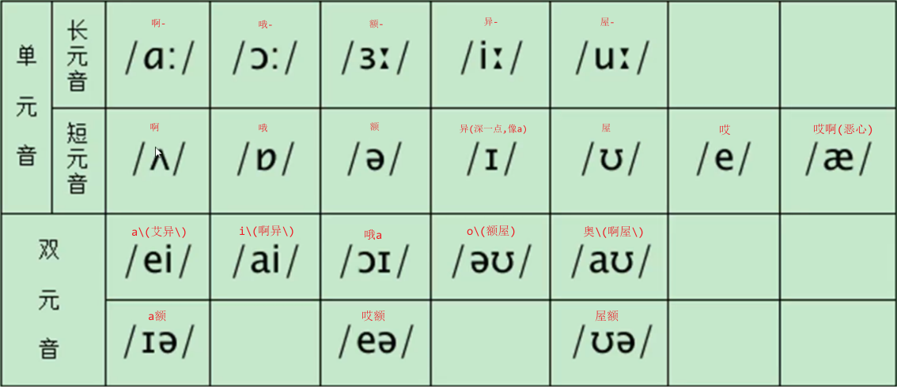

# 1. 元音（20个）

## 1. 单元音

1. 
   - bee -> `波异- -> b\`
   - we -> `屋异- -> 微\`
   - read -> `日异-的 -> 瑞\的`
   - meat -> `目异-特 -> 密\特`
   - heat -> `喝异-特 -> 嘿特`
   - seat -> `丝异-特 -> c特`
2. 
   - sit -> `丝a特 -> c特`
   - fish -> `夫a时 -> 费时`
   - king -> `克a嗯\ -> k嗯\`
   - win -> `屋a嗯 -> 问`
   - live -> `勒a夫 -> 列夫`
   - hit -> `呵a特 -> 嘿特`
   - little -> `勒a特哎奥 -> 雷头哦`
3. 
   - pen -> `坡哎嗯 -> 盆嗯 -> 盆\`
   - bend -> `波哎嗯的 -> 笨嗯的`
   - dress -> `胶哎丝 -> 绝丝`
   - egg -> `哎格`
   - bed -> `波哎的 -> 拜的`
   - red -> `日哎的 -> 瑞的`
4. 
   - lamb -> `勒哎目 -> 呐\目`
   - tan -> `特哎嗯 -> 疼\`
   - ant -> `哎嗯特 -> 安嗯\特`
   - pan -> `坡哎嗯 -> 判嗯\`
   - band -> `波哎嗯的 -> 变暗\的`
   - mass -> `目哎丝 -> 麦丝`
5. 
   - run - > `日啊嗯 -> 日安 -> 软安`
   - sun -> `丝啊嗯 -> 丝安 -> 散安`
   - brush -> `波日啊时 -> 波啊时`
   - cup -> `克啊普 -> 卡普`
   - bus -> `波啊丝 -> 把丝`
   - son -> `丝啊嗯 -> 丝安 -> 散安`
6. 
   - bird -> `波额的 -> 波儿\的`
   - girl -> `格额哎奥 -> 格儿奥`
   - work -> `屋额克 -> 屋儿克`
   - word -> `屋额的 -> 屋儿的`
   - learn -> `勒额嗯 -> 呢嗯`
   - heard -> `呵额的 -> 呵儿的`
7. 
   - woman -> ``
   - sofa -> ``
   - extra -> ``
   - panda -> ``
   - actor -> ``
   - center -> ``
   - arrive -> ``
   - driver -> ``

