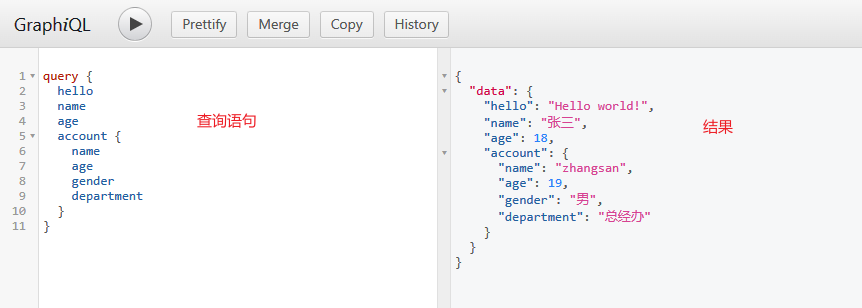
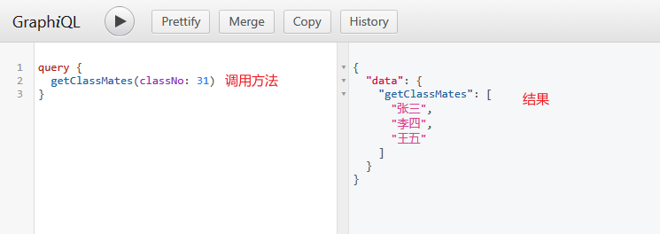
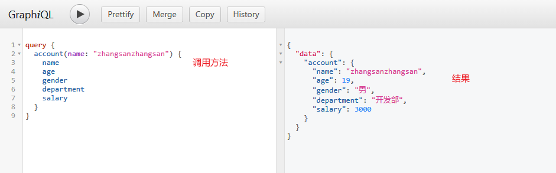
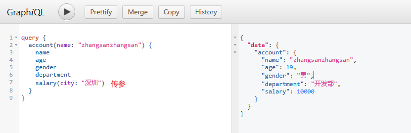
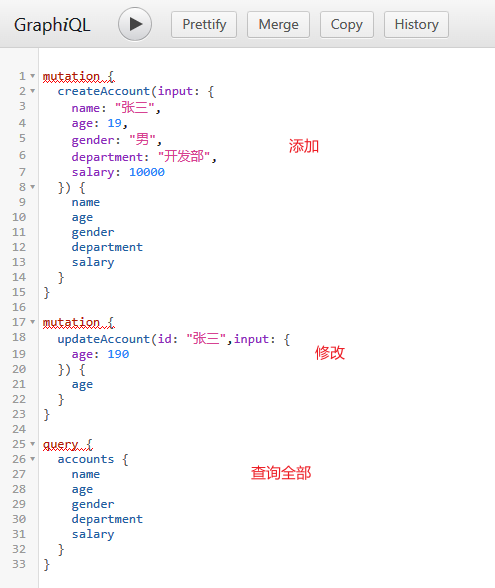
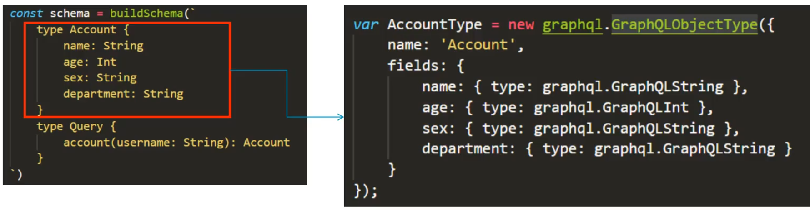
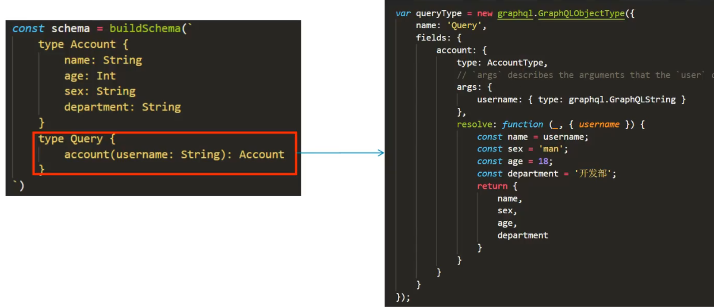
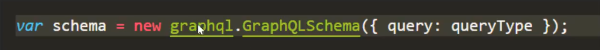
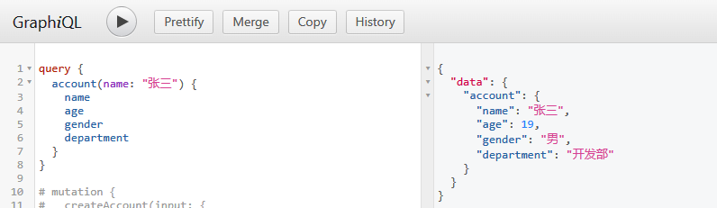

# 1. GraphQL 介绍

- GraphQL（瓜服QL） 是 Facebook 开发的一种数据查询语言，并于 2015 年公开发布。它是 REST API 的替代品
- GraphQL 既是一种用于 API 的查询语言也是一个满足你数据查询的运行时。GraphQL 对你的 API 中的数据提供了一套易于理解的完整描述，使得客户端能够准确地获得它需要的数据，而且没有任何冗余，也让 API 更容易地随着时间推移而演进。
- 官网：https://graphql.org/
- 中文网：https://graphql.cn/
- 特点
  1. 请求需要的数据，不多不少例如：account 中有 name、age、sex、department 等。可以只取得需要的字段。
  2. 获取多个资源，只用一个请求
  3. 描述所有可能类型的系统。便于维护，根据需求平滑演进，添加或者隐藏字段。

# 2. GraphQL 与 restful 对于

- restful：Representational State Transfer 表属性状态转移。本质上就是用定义 uri，通过 api 接口来取得资源。通用系统架构，不受语言限制。
- 例子：饿了么接口
- restful 一个接口只能返回一个资源，graphql 一次可以获取多个资源。
- restful 用不同的 url 来区分资源，graphql 用类型区分资源

# 3. 使用 express + GraphQL

```js
const express = require('express')
const { graphqlHTTP } = require('express-graphql') // 先安装这个再装 graphql，不然会报错
const { buildSchema } = require('graphql')

const app = express()

// 定义查询的语句和类型
const schema = buildSchema(`
  type Account {
    name: String
    age: Int
    gender: String
    department: String
  }
  type Query {
    hello: String
    name: String
    age: Int
    account: Account
  }
`)

// 定义查询对应的 resolver，也就是查询对应的处理器
const root = {
  hello: () => 'Hello world!',
  name: () => '张三',
  age: () => 18,
  account: () => ({
    name: 'zhangsan',
    age: 19,
    gender: '男',
    department: '总经办'
  })
}

app.use('/graphql', graphqlHTTP({
  schema,
  rootValue: root,
  graphiql: true
}))

app.listen(3000, () => console.log('http://localhost:3000/graphql'))
```



# 4. 数据类型

## 1. 基本参数类型

- 基本类型：String、Int、Float、Boolean、ID。可以在 schema 声明的时候直接使用。
- `[类型]`代表数组，例如：`[Int]`代表整形数组

## 2. 参数传递

- 和 js 传递参数一样，小括号内定义形参，但是注意：参数需要定义类型。
- `!`代表参数不能为空。

```js
const schema = buildSchema(`
  type Query {
    getClassMates(classNo: Int!): [String]
  }
`)

const root = {
  getClassMates({ classNo }) {
    const obj = {
      31: ['张三', '李四', '王五'],
      61: ['张大三', '李大四', '王大五']
    }
    return obj[classNo]
  }
}
```



## 3. 自定义参数类型

- GraphQL 允许用户自定义参数类型，通常用来描述要获取的资源的属性。

```js
const schema = buildSchema(`
  type Account {
    name: String
    age: Int
    gender: String
    department: String
    salary(city: String): Int
  }
  type Query {
    account(name: String): Account
  }
`)

const root = {
  account({ name }) {
    const age = 19
    const gender = '男'
    const department = '开发部'
    const salary = ({ city }) => {
      if (city === '北京' || city === '上海' || city === '广州' || city === '深圳') return 10000
      return 3000
    }
    return { name, age, gender, department, salary }
  }
}
```





# 5. GraphQL clients

如何在客户端访问 graphql 的接口？

- query：查询数据

  ```html
  <!-- 数据参见上面的【自定义参数类型】 -->
  
  <button onclick="getData()">获取数据</button>
  <script>
    function getData() {
      fetch('/graphql', {
        method: 'POST',
        headers: {
          'Content-Type': 'application/json',
          'Accept': 'application/json'
        },
        body: JSON.stringify({
          query: `
            query Account($name: String, $city: String) {
              account(name: $name) {
                name
                age
                gender
                department
                salary(city: $city)
              }
            }
          `,
          variables: {
            name: 'zhangsan123',
            city: '深圳'
          }
        })
      })
        .then(response => response.json())
        .then(data => console.log('data returned', data))
    }
  </script>
  ```

- Mutation：添加与修改数据

  ```js
  const schema = buildSchema(`
    type Account {
      name: String
      age: Int
      gender: String
      department: String
      salary(city: String): Int
    }
    type Query {
      accounts: [Account]
    }
    input AccountInput {
      name: String
      age: Int
      gender: String
      department: String
      salary: Int
    }
    type Mutation {
      createAccount(input: AccountInput): Account
      updateAccount(id: ID!, input: AccountInput): Account
    }
  `)
  
  const database = {} // 模拟数据库
  
  const root = {
    accounts() { // 查询全部
      const array = []
      for (const key in database) {
        array.push(database[key])
      }
      return array
    },
    createAccount({ input }) { // 添加
      database[input.name] = input
      return database[input.name]
    },
    updateAccount({ id, input }) { // 修改，id 用 name 代替
      database[id] = Object.assign(database[id], input) // 将后面的对象合并到第一个对象上，如果有重复属性，覆盖到第一个对象上去
      return database[id]
    }
  }
  ```

  

# 6. 配置权限中间件

如果 Cookies 没有携带 auth 这个键，不允许访问。

```js
app.use((request, response, next) => {
  if (request.url.indexOf('/graphql') !== -1 && request.headers.cookie.indexOf('auth') === -1) {
    response.send(JSON.stringify({
      error: '您没有权限访问这个接口'
    }))
  } else next()
})
```

# 7. Construction Types

1. 使用 GraphQLObjectType 定义 type（类型）

   

2. 使用 GraphQLObjectType 定义 query（查询）

   

3. 创建 schema

   

```js
const express = require('express')
const { graphqlHTTP } = require('express-graphql')
const { GraphQLSchema, GraphQLObjectType, GraphQLString, GraphQLInt } = require('graphql')

const app = express()

const AccountType = new GraphQLObjectType({
  name: 'Account',
  fields: {
    name: { type: GraphQLString },
    age: { type: GraphQLInt },
    gender: { type: GraphQLString },
    department: { type: GraphQLString }
  }
})

const QueryType = new GraphQLObjectType({
  name: 'Query',
  fields: {
    account: {
      type: AccountType,
      args: {
        name: { type: GraphQLString }
      },
      resolve(_, { name }) {
        return {
          name,
          age: 19,
          gender: '男',
          department: '开发部'
        }
      }
    }
  }
})

const schema = new GraphQLSchema({ query: QueryType })

app.use('/graphql', graphqlHTTP({
  schema,
  graphiql: true
}))

app.listen(3000, () => console.log('http://localhost:3000/graphql'))
```

