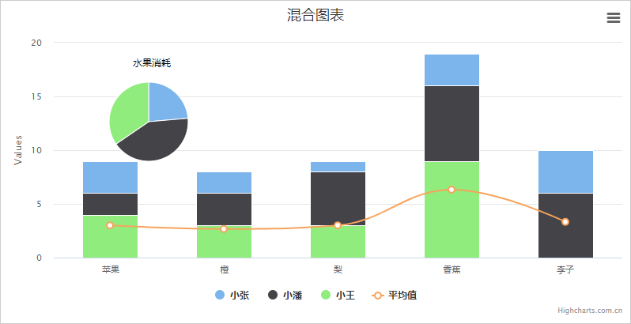
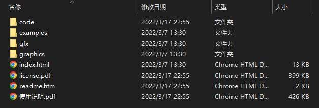
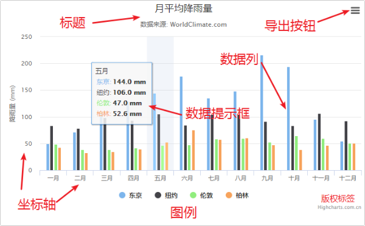

# 1. Highcharts 系列软件简介

Highcharts 系列软件包含 Highcharts JS，Highstock JS，Highmaps JS 共三款软件，均为纯 JavaScript 编写的 HTML5 图表库，全部源码开放，个人及非商业用途可以任意使用及源代码编辑。

## 1. Highcharts

Highcharts 是一个用纯 JavaScript 编写的一个图表库， 能够很简单便捷的在 Web 网站或是 Web 应用程序添加有交互性的图表，并且免费提供给个人学习、个人网站和非商业用途使用。

Highcharts 支持的图表类型有直线图、曲线图、区域图、柱状图、饼状图、散状点图、仪表图、气泡图、瀑布流图等多达 20 种图表，其中很多图表可以集成在同一个图形中形成混合图。



## 2. Highstock

Highstock 是用纯 JavaScript 编写的股票图表控件，可以开发股票走势或大数据量的时间轴图表。它包含多个高级导航组件：预设置数据时间范围，日期选择器、滚动条、平移、缩放功能。


## 3. Highmaps

Highmaps 是一款基于 HTML5 的优秀地图组件。

Highmaps 继承了 Highcharts 简单易用的特性，利用它可以方便快捷的创建用于展现销售、选举结果等其他与地理位置关系密切的交互性地图图表。

Highmaps 可以单独使用，也可以作为 Highcharts 的一个组件来使用。


# 2. 文件下载与使用

## 1. 文件下载

我们提供完整的 Highcharts 资源包，包含实例文件、所有的 js 压缩版及源码等。

到我们的 [下载中心](https://www.highcharts.com.cn/download) 页面即可获取最新的资源包。

解压下载得到的压缩包，进入相应的目录查看所有包含文件，Highcharts 提供的文件目录如下图所示：



目录结构说明：

```
|-- examples                       例子
|-- gfx                            例子用到的图片资源
|-- graphics                       例子用到的图片资源 
|-- code                           所有 js 文件及源代码
    |-- css                        Highcharts css 文件（只用于 CSS 版本 Highcharts）
    |-- lib                        相关的库文件
    |-- modules                    功能模块文件目录
    |-- themes                     主题文件目录
    |-- highcharts.js              highcharts 主文件
    |-- highcharts.src.js          highcharts 主文件源码
    |-- highcharts-3d.js           highcharts 3d 功能文件
    |-- highcharts-3d.src.js       highcharts 3d 功能文件源码
    |-- highcharts-more.js         highcharts 增加功能文件
    |-- highcharts-more.src.js     highcharts 增加功能文件源码
    |-- readme.txt                 源代码目录说明文件
|-- index.htm                      例子入口文件 
|-- license.pdf                    使用协议文档
|-- readme.txt                     说明文件
```

建议初学者从我们提供的例子代码入手，我们提供的丰富例子可以让你轻松入门。

## 2. 文件的使用

### 1. 基础使用

Highcharts 最基本的运行只需要一个 JS 文件，即 `highcharts.js`，例如引入下面的文件即可创建基础的图表了。

```html
<script src="images/code/highcharts.js"></script>
```

注：Highcharts 从 4.2.0 开始，已经不依赖 jQuery（[参考例子](https://code.hcharts.cn/demos/hhhhxL)），如果你的页面中不需要 jQuery，那么无需引入；不依赖 jQuery 的原因是我们将去掉了适配器并支持 CommonJS 模块标准，也就是说 Highcharts 可以在所有 CommonJS 规范下的环境中运行（例如 Nodejs），这也使得我们的产品可以结合目前市面上常用的库使用，例如 Browserify、Webpack、Vue、React、AngularJS 等。

### 2. 功能模块

功能模块是在 Highcharts 主要功能的基础做的扩展，是由官方发布的功能包，常用功能模块有：

- 更多图表类型扩展模块 `code/highcharts-more.js`
- 3D 图表模块 `code/highcharts-3d.js`
- 导出功能模块 `code/modules/exporting.js`
- 金字塔图表类型 `code/modules/funnel.js`
- 钻取功能模块 `code/modules/drilldown.js`
- 数据加载功能模块 `code/modules/data.js`

更多模块可以在下载的资源包的 `code/modules` 目录找到，具体的功能我们会在后面的教程中讲解。

使用功能模块很简单，只需要引入对应的文件即可，唯一需要注意的是保证 **highcharts.js** 的引用顺序是在功能模块之前。

例如启用导出功能时需要引入的文件及顺序是：

```html
<script src="images/code/highcharts.js"></script>
<script src="images/code/modules/exporting.js"></script>
```

## 3. Highstock 和 Highmaps

Highstock 和 Highmaps 是另外两款针对不同使用场景的图表产品，三款产品之间相互独立又有密切关系，他们关系和混合使用的说明如下：

### 1. 三款产品简介

- Highcharts 基础图表
- Highstock 股票及大数据量时间轴图表
- Highmaps 地图

### 2. 相关之间的关系

Highstock 是完全包含 Highcharts 的，是在 Highcharts 的基础上增加了更多高级功能；Highmaps 则完全独立，不过我们提供了地图功能模块 map.js （在 Highmaps 资源包的 modules 目录）供 Highcharts 或 Highstock 调用。

### 3. 混合使用（重要）

**Highcharts + Highstock** 混合使用时只需要引入 **highstock.js**

```html
<script src="./highcharts-stock/code/highstock.js"></script>
```

**Highcharts + Highmaps** 混合使用时需要引入 **highcharts.js + map.js**

```html
<script src="./highcharts-stock/code/highstock.js"></script>
<script src="./highcharts-maps/code/modules/map.js"></script>
```

**Highstock + Highmaps** 或 **Highcharts + Highstock + Highmaps** 混合使用时需引入 **highstock.js + map.js**

```html
<script src="./highcharts-stock/code/highstock.js"></script>
<script src="./highcharts-maps/code/modules/map.js"></script>
```

> 注意：上面说到的 Highstock 是完全包含 Highcharts 的，如果在同一个页面重复引用的话就会报 [#16](https://www.highcharts.com.cn/errors/16) 号错误。

### 4. 主题

我们提供图表更换主题功能，引入相应的主题 JS 文件即可改变图表样式。除默认主题样式外，我们提供了多款主题，另外你也可以根据需要自己设计图表主题。

我们提供的主题文件放置在资源包的 `code/themes` 目录下，您可以按照自己需要引用。

给图表加上灰色（Gray）主题时需要引用的文件如下：

```html
<script src="images/code/highcharts.js"></script>
<script src="images/code/themes/gray.js"></script>
```

# 3. HelloWorld

```html
<!DOCTYPE html>
<html lang="en">
<head>
  <meta charset="UTF-8">
  <meta http-equiv="X-UA-Compatible" content="IE=edge">
  <meta name="viewport" content="width=device-width, user-scalable=no, initial-scale=1.0">
  <!-- 引入 Highcharts -->
  <script src="images/code/highcharts.js"></script>
  <!-- 引入灰色主题 -->
  <script src="images/code/themes/gray.js"></script>
  <title>Title</title>
</head>
<body>
<!-- 图表容器 DOM -->
<div id="container" style="width: 600px; height: 400px;"></div>
<script>
  // 图表配置
  const options = {
    chart: {
      type: 'bar' // 指定图表的类型，默认是折线图（line）
    },
    title: {
      text: '我的第一个图表' // 标题
    },
    xAxis: {
      categories: ['苹果', '香蕉', '橙子'] // x 轴分类
    },
    yAxis: {
      title: {
        text: '吃水果个数' // y 轴标题
      }
    },
    series: [ // 数据列
      {
        name: '小明', // 数据列名
        data: [1, 0, 4] // 数据
      },
      {
        name: '小红',
        data: [5, 7, 3]
      }
    ]
  }
  // 图表初始化函数
  Highcharts.chart('container', options)
</script>
</body>
</html>
```

# 4. 通过 npm 安装

我们提供的 Highcharts npm 包，包含了 Highcharts、Highstock、Highmaps 及所有的功能模块，通过下面的命令即可完成安装：

```sh
npm i highcharts
```

## 1. 加载 Highcharts

```js
const Highcharts = require('highcharts') // 导入 Highcharts
require('highcharts/modules/exporting')(Highcharts) // 导入并加载其他功能模块

// 创建图表
Highcharts.chart('container', {
  chart: {
    type: 'bar'
  },
  title: {
    text: '我的第一个图表'
  },
  xAxis: {
    categories: ['苹果', '香蕉', '橙子']
  },
  yAxis: {
    title: {
      text: '吃水果个数'
    }
  },
  series: [
    {
      name: '小明',
      data: [1, 0, 4]
    },
    {
      name: '小红',
      data: [5, 7, 3]
    }
  ]
})
```

## 2. 加载 Highstock 或 Highmaps

Highstock 是完全包含 Highcharts 的，所以没必要将两个文件都引用；**Highmaps 可以单独导入**也可以**通过地图模块来引用 Highmaps**。

```js
const Highcharts = require('highcharts/highstock') // 导入 Highstock
require('highcharts/modules/map')(Highcharts) // 通过地图模块来引用 Highmaps
```

如果只需要 Highmaps 功能，那么只需要引用 highmaps.js 即可

```js
const Highcharts = require('highcharts/highmaps') // 单独导入 Highmaps
```

## 3. import 语法

```js
import Highcharts from 'highcharts' // 导入 Highcharts
// 导入其他功能模块
import HighchartsMore from 'highcharts/highcharts-more'
import HighchartsDrilldown from 'highcharts/modules/drilldown'
import Highcharts3D from 'highcharts/highcharts-3d'

// 加载其他功能模块
HighchartsMore(Highcharts)
HighchartsDrilldown(Highcharts)
Highcharts3D(Highcharts)
```

> 注意：类似 `highcharts-more`、`drilldown`、`highcharts-3d`，Highcharts 其他模块都需要初始化（类似 `HighchartsMore(Highcharts)`）

## 4. TypeScript

```typescript
import * as Highcharts from 'highcharts'

Highcharts.chart('container', {...})
```

# 5. 图表主要组成

一般情况下，Highcharts 包含**标题**（Title）、**坐标轴**（Axis）、**数据列**（Series）、**数据提示框**（Tooltip）、**图例**（Legend）、**版权标签**（Credits）等，另外还可以包括**导出功能按钮**（Exporting）、**标示线**（PlotLines）、**标示区域**（PlotBands）、数据标签（dataLabels）等。

Highcharts 基本组成部分如下图所示：



1. **标题**（Title）
   - 图表标题，包含标题和副标题（subTitle），其中副标题是非必须的。
2. **坐标轴**（Axis）
   - 坐标轴包含 x 轴（xAxis）和 y 轴（yAxis）。通常情况下，x 轴显示在图表的底部，y 轴显示在图表的左侧。多个数据列可以共同使用同一个坐标轴，为了对比或区分数据，Highcharts 提供了多轴的支持。
3. **数据列**（Series）
   - 数据列即图表上一个或多个数据系列，比如曲线图中的一条曲线，柱状图中的一个柱形。
4. **数据提示框**（Tooltip）
   - 当鼠标悬停在某点上时，以框的形式提示该点的数据，比如该点的值、数据单位等。数据提示框内提示的信息完全可以通过格式化函数动态指定。
5. **图例**（Legend）
   - 图例是图表中用不同形状、颜色、文字等 标示不同数据列，通过点击标示可以显示或隐藏该数据列。
6. **版权标签**（Credits）
   - 显示在图表右下方的包含链接的文字，默认是 Highcharts 官网地址。通过指定 `credits.enabled = false` 即可不显示该信息。
7. **导出功能**（Exporting）
   - 通过引入 exporting.js 即可增加图表导出为常见文件功能。
8. **标示线**（PlotLines）
   - 可以在图表上增加一条标示线，比如平均值线，最高值线等。
9. **标示区域**（PlotBands）
   - 可以在图表添加不同颜色的区域带，标示出明显的范围区域。
