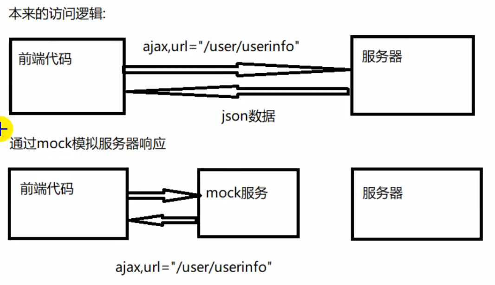
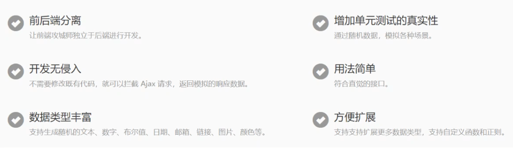

# 1. 什么是 mock？它的使用场景是什么？

当前端工程师需要独立于后端并行开发时，后端接口还没有完成那么前端怎么获取数据？

这时可以考虑前端搭建 web server 自己模拟数据，这里我们选第三方库`mockjs`来生成随机数据，拦截 Ajax 请求。

下面是 mock 的原理图：



下面是`mockjs`具有的特点：



# 2. 搭建测试项目

创建项目：

```bash
vue create mock.js
```

安装依赖：

```bash
# 使用 axios 发送 ajax
npm i axios

# 使用 mockjs 产生随机数据
npm i -D mockjs
```

# 3. 使用 mockjs

**写法**：

- `'name|+step': value`
- `'name|count': value`
- `'name|min-max': value`

**常用生成规则**：

1. value 为 String 时
   1. `'name|count': value`
      - 表示生成一个字符串，重复次数等于 count
   2. `'name|min-max': value`
      - 表示生成一个字符串，重复次数大于等于 min，小于等于 max
2. value 为 Number 时
   1. `'name|+count': value`
      - value 值自动加 count
   2. `'name|min-max': value`
      - 表示生成一个大于等于 min、小于等于 max 的整数
3. value 为 Boolean 时
   1. `'name|count': value`
      - 随机生成一个布尔值，值为 value 的概率是 `1 / count`
      - 值为 false 的概率是 `count - 1 / count`
   2. `'name|min-max': value`
      - 随机生成一个布尔值，值为 value 的概率是 `min / (min + max)`，值为 !value 的概率是 `max / (min + max)`
4. value 为 Object 时
   1. `'name|count': value`
      - 从对象中随机选取 count 个属性
   2. `'name|min-max': value`
      - 从对象中随机选取 min 到 max 个属性
5. value 为 Array 时
   1. `'name|1': value`
      - 从数组中随机选取 1 个元素
   2. `'name|+1': value`
      - 从数组中按顺序选取 1 个元素
   3. `'name|min-max': value`
      - 将数组重复 min 到 max 次后返回（注意：不是随机选取 min-max 个元素）
   4. `'name|count': value`
      - 将数组重复 count 次后返回（注意：不是随机选取 count 个元素）
6. value 为 function
   - 返回函数执行后 return 的结果
7. value 为正则表达式
   - 随机生成符合正则表达式的字符串

**示例**：

```js
const Mock = require('mockjs')

// 生成随机 id
const id = Mock.mock('@id')
console.log(id)

// 生成随机对象
const obj = Mock.mock({
  id: '@id()', // 随机 id
  username: '@cname()', // 随机中文名
  password: /[a-zA-Z0-9]{6,9}/, // 随机 6-9 位密码
  isLogin: '@boolean()', // 随机 true 或 false
  date: '@date()', // 随机日期 yyyy-MM-dd
  datetime: '@datetime()', // 随机日期 yyyy-MM-dd HH:mm:ss
  avatar: '@image("200x200", "red", "#fff", "avatar")', // 生成图片，可以用 @color() 生成随机颜色
  color: '@color()', // 随机颜色
  'age|18-30': 18, // 18-30 之间
  phone: /^1[35789]\d{9}$/, // 随机电话号
  description: '@paragraph()', // 描述
  ip: '@ip()', // IP 地址
  email: '@email()', // 邮箱
  postCode: '@zip', // 邮政编码
  'person|10': [ // 生成 10 个 person 对象
    {
      id: '@increment()', // 自增 id
      name: '@name()', // 随机英文名
      address: '@city(true)', // 随机地址，如果不加 true 只生成一个地址
      'grade|1': ['大学', '大专', '高中', '小学'] // 随机 4 选一
    }
  ]
})
console.log(obj)
```

# 4. 使用 json5

使用 json5 解决 json 文件，无法添加注释问题

安装：

```bash
npm i -D json5
```

mock/userInfo.json5 文件：

```json
{
  id: '@id()', // 随机 id
  username: '@cname()', // 随机中文名
//  password: /[a-zA-Z0-9]{6,9}/, // json5 不能使用正则表达式
  isLogin: '@boolean()', // 随机 true 或 false
  date: '@date()', // 随机日期 yyyy-MM-dd
  datetime: '@datetime()', // 随机日期 yyyy-MM-dd HH:mm:ss
  avatar: '@image("200x200", "red", "#fff", "avatar")', // 生成图片，可以用 @color() 生成随机颜色
  color: '@color()', // 随机颜色
  'age|18-30': 18, // 18-30 之间
//  phone: /^1[35789]\d{9}$/, // json5 不能使用正则表达式
  description: '@paragraph()', // 描述
  ip: '@ip()', // IP 地址
  email: '@email()', // 邮箱
  postCode: '@zip', // 邮政编码
  'person|10': [ // 生成 10 个 person 对象
    {
      id: '@increment()', // 自增 id
      name: '@name()', // 随机英文名
      address: '@city(true)', // 随机地址，如果不加 true 只生成一个地址
      'grade|1': ['大学', '大专', '高中', '小学'] // 随机 4 选一
    }
  ]
}
```

mock/testMockJson5.js 文件：

```js
const fs = require('fs')
const path = require('path')
const JSON5 = require('json5') // 导入 json5

const json = fs.readFileSync(path.join(__dirname, './userInfo.json5'), 'utf-8') // 同步读取 文件
console.log(json) // 是个字符串
console.log(JSON5.parse(json)) // 转成对象
```

# 5. mock 和 vue-cli 结合

创建 mock/index.js 文件：

```js
const fs = require('fs')
const path = require('path')
const Mock = require('mockjs')
const JSON5 = require('json5')

// webpack4 的写法
// module.exports = app => {
//   // 监听 http 请求
//   app.get('/user/userinfo', (request, response) => {...})
// }

// webpack5 的写法
module.exports = devServer => {
  // 监听 http 请求
  devServer.app.get('/user/userinfo', (request, response) => {
    const json = fs.readFileSync(path.join(__dirname, './userInfo.json5'), 'utf-8')
    response.json({
      msg: '拦截到了...',
      data: Mock.mock(JSON5.parse(json))
    })
  })
}
```

在 vue.config.js 文件中添加配置：

```js
const {defineConfig} = require('@vue/cli-service')

module.exports = defineConfig({
  transpileDependencies: true,
  configureWebpack: {
    devServer: {
      // webpack4 用的是 devServer.before
      // before: require('./mock') // 引入 mock/index.js 文件
      // webpack5 改成了 devServer.onBeforeSetupMiddleware
      onBeforeSetupMiddleware: require('./mock') // 引入 mock/index.js 文件
    }
  }
})
```

在 src/components/HelloWorld.vue 组件中发送 ajax 请求：

```vue
<script>
import axios from 'axios'

export default {
  props: {
    msg: String
  },
  async created() {
    // 发起 ajax 请求
    const {data} = await axios.get('/user/userinfo')
    console.log(data)
  }
}
</script>
```

**添加环境变量，控制 mock 是否拦截请求**

模式：

- `development` 模式用于 `vue-cli-service serve`
- `test` 模式用于 `vue-cli-service test:unit`
- `production` 模式用于 `vue-cli-service build` 和 `vue-cli-service test:e2e`

环境变量：

```bash
.env                # 在所有的环境中被载入
.env.local          # 在所有的环境中被载入，但会被 git 忽略
.env.[mode]         # 只在指定的模式中被载入
.env.[mode].local   # 只在指定的模式中被载入，但会被 git 忽略
```

> 详情参考官网：[模式和环境变量](https://cli.vuejs.org/zh/guide/mode-and-env.html)

修改 mock/index.js 文件：

```js
module.exports = function (devServer) {
  // 如果环境变量 MOCK 为 true 就拦截请求
  if (process.env.MOCK === 'true') {
    devServer.app.get('/user/userinfo', (request, response) => {
      const json = fs.readFileSync(path.join(__dirname, './userInfo.json5'), 'utf-8')
      response.json({
        msg: '拦截到了...',
        data: Mock.mock(JSON5.parse(json))
      })
    })
  }
}
```

在项目根目录下创建 .env.development 文件并添加以下内容：

```
MOCK=true
```

# 7. mock 和 jquery 结合

mock/index.js 文件：

```js
// Mock.mock(请求地址, 请求方式, 响应数据)
Mock.mock('/user/userinfo', 'get', {
  msg: '拦截到了...',
  data: {
    id: '@id()',
    username: '@cname()',
    date: '@date(yyyy-MM-dd HH:mm:ss)',
    avatar: '@image("200x200", "red", "#fff", "avatar")',
    description: '@paragraph()',
    ip: '@ip()',
    email: '@email()',
    'person|10': [
      {
        id: '@increment()',
        name: '@name()',
        address: '@city(true)',
        'grade|1': ['大学', '大专', '高中', '小学']
      }
    ]
  }
})
```

index.html 文件：

```html
<!DOCTYPE html>
<html lang="en">
<head>
  <meta charset="UTF-8">
  <meta http-equiv="X-UA-Compatible" content="IE=edge">
  <meta name="viewport" content="width=device-width, user-scalable=no, initial-scale=1.0">
  <!-- 导入 jquery -->
  <script src="./lib/jquery-3.6.0.min.js"></script>
  <!-- 导入 mock -->
  <script src="./lib/mock-min.js"></script>
  <title>Title</title>
</head>
<body>
<!-- 导入 mock/index.js -->
<script src="./mock/index.js"></script>
<script>
  // 发起 ajax 请求
  $.get('/user/userinfo', data => console.log(data), 'json')
</script>
</body>
</html>
```

**控制 mock 是否拦截请求**

第一种：直接将 script 标签注释掉

```html
<!--<script src="./mock/index.js"></script>-->
```

第二种：通过变量控制

```html
<script>MOCK = 'true'</script>
<script>
  if (MOCK === 'true') {
    // 发起 ajax 请求
    $.get('/user/userinfo', data => console.log(data), 'json')
  }
</script>
```

