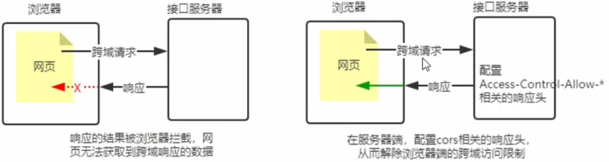
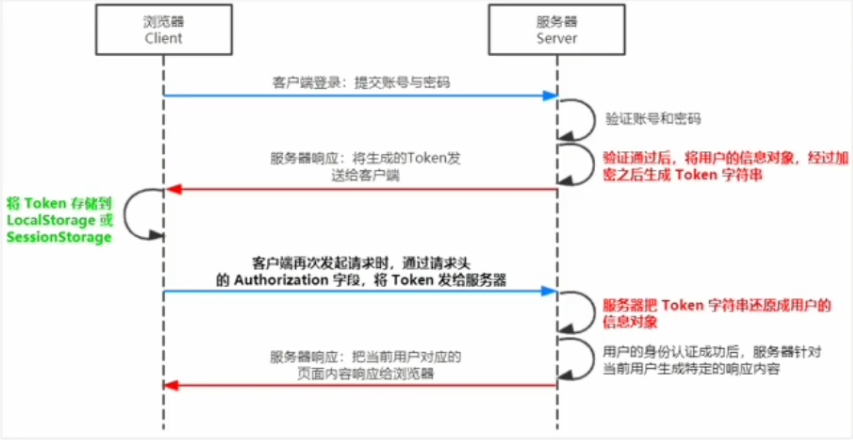

# 1. 初识 Node.js 与内置模块

## 1. 初识 Node.js

### 1. 回顾与思考

#### 1. 已经掌握了哪些技术

HTML、CSS、JavaScript

#### 2. 浏览器中的 JavaScript 的组成部分


#### 3. 为什么 JavaScript 可以在浏览器中被执行


不同的浏览器使用不同的 JavaScript 解析引擎：

- Chrome 浏览器 => V8
- Firefox 浏览器 => OdinMonkey（奥丁猴）
- Safri 浏览器 => JSCore
- IE 浏览器 => Chakra（查克拉）
- etc...

其中，Chrome 浏览器的 V8 解析引擎性能最好！

#### 4. 为什么 JavaScript 可以操作DOM和BOM


每个浏览器都**内置了** DOM、BOM 这样的 API 函数，因此，浏览器中的 JavaScript 才可以调用它们。

#### 5. 浏览器中的 JavaScript 运行环境

**运行环境**是指**代码正常运行所需的必要环境**。


总结：

1. V8 引擎负责解析和执行 JavaScript 代码。
2. 内置 API 是由**运行环境**提供的特殊接口，**只能在所属的运行环境中被调用**。

#### 6. JavaScript 能否做后端开发

JavaScript 也能做后端开发，只不过在做后端开发的时候需要借助一个运行环境 **Node.js**


### 2. Node.js 简介

#### 1. 什么是 Node.js

**Node.js **是一个基于 Chrome V8 引擎的 **JavaScript 运行环境**。

Node.js 的官网地址 https://nodejs.org/en/

#### 2. Node.js 中的 JavaScript 运行环境


注意：

1. **浏览器**是 JavaScript 的**前端运行环境**
2. **Node.js** 是 JavaScript 的**后端运行环境**
3. Node.js 中**无法调用** DOM 和 BOM 等**浏览器内置 API**

#### 3. Node.js 可以做什么

Node.js 作为一个 JavaScript 的运行环境，仅仅提供了基础的功能和 API。然而，基于 Node.js 提供的这些基础功能之上，很多强大的工具和框架如雨后春笋，层出不穷，所以学会了 Node.js，可以让前端程序员胜任更多的工作和岗位：

1. 基于 Expree 框架（http://www.expressjs.com.cn/），可以快速构建 Web 应用
2. 基于 Electron 框架（https://electronjs.org/），可以构建跨平台的桌面应用
3. 基于 restify 框架（http://restify.com/），可以快速构建 API 接口项目
4. 读写和操作数据库、创建实用的命令行工具辅助前端开发、etc...

总之：Node.js 是**大前端时代**的 “大宝剑”，有了 Node.js 这个超级 buff 的加持，前端程序员的**行业竞争力**会越来越强！

#### 4. Node.js 怎么学

浏览器中的 JavaScript 学习路径：

JavaScript 基础语法 + 浏览器内置 API（DOM 和 BOM） + 第三方库（jQuery、art-template 等）

**JavaScript 基础语法** + **Node.js 内置 API 模块**（fs、path、http 等） + **第三方 API 模块**（express、mysql 等）

### 3. Node.js 环境的安装

如果希望通过 Node.js 来运行 JavaScript 代码，则必须在计算机上安装 Node.js 环境才行。

安装包可以从 Node.js 的官网首页直接下载，进入到 Node.js 的官网首页（https://nodejs.org/en/），点击绿色的按钮，下载所需的版本后，双击一直下一步直接安装即可（建议不要更改安装目录，默认 C 盘即可）。

#### 1. 区分 LTS 版本和 Current 版本的不同

1. LTS 为长期稳定版，对于**追求稳定性**的**企业级项目**来说，推荐安装 LTS 版本的 Node.js。
2. Current 为新特性尝鲜版，对**热衷于尝试新特性**的用户来说，推荐安装 Current 版本的 Node.js。但是，Current 版本中可能存在隐藏的 Bug 或安全性漏洞，因此不推荐在企业级项目中使用 Current 版本的 Node.js。

#### 2. 查看已安装的 Node.js 的版本号

打开**终端**，在终端输入命令 **node -v** 后，按下回车键，即可查看已安装的 Node.js 的版本号。

### 4. 在 Node.js 环境中执行 JavaScript 代码

1. 打开终端
2. 输入 **node 要执行的js文件的路径**

#### 1. 终端中的快捷键

在 Windwos 的 powershell 或 cmd 终端中，我们可以通过如下快捷键，来提高终端的操作效率：

1. 使用**上方向**键，可以快速定位到上一次执行的命令
2. 使用 **tab** 键，能够快速补全路径
3. 使用 **esc** 键，能够快速清空当前已输入的命令
4. 使用 **cls** 命令，可以清空终端

## 2. fs 文件系统模块

### 1. 什么是 fs 文件系统模块

**fs 模块**是 Node.js 官方提供的、用来操作文件的模块。它提供了一系列的方法和属性，用来满足用户对文件的操作需求。

例如：

- **fs.readFile()** 方法，用来**读取**指定文件中的内容
- **fs.writeFile()** 方法，用来向指定的文件中**写入**内容

如果要在 JavaScript 代码中，使用 fs 模块来操作文件，则需要使用如下的方式先导入它：

```javascript
const fs = require("fs");
```

### 2. 读取指定文件中的内容

使用 fs.readFile() 方法，可以读取指定文件中的内容，语法格式如下：

fs.readFile(path[, options], callback);

参数解读：

- 参数1：**必选**参数，字符串，表示文件的路径
- 参数2：可选参数，表示以什么**编码格式**来读取文件
- 参数3：**必选**参数，文件读取完成后，通过回调函数拿到读取失败和成功的结果

示例代码：

```javascript
// 以 utf8 的编码格式，读取指定文件的内容，并打印 error 和 data 的值
fs.readFile("./files/a.txt", "utf8", function (error, data) {
    console.log(error);// 打印失败的结果，如果成功，则 error 值为 null
    console.log("=======================");
    console.log(data);// 打印成功的结果，如果失败，则 data 值为 undefined
});
```

### 3. 判断文件是否读取成功

示例代码：

```javascript
fs.readFile("./files/aaaaaaaaaaaaaaaaaaaaaaaa.txt", "utf8", function (error, data) {
    if (error) return console.log("读取文件失败！" + error.message);
    console.log("读取文件成功！" + data);
});
```

### 4. 向指定的文件中写入内容

使用 fs.writeFile() 方法，可以向指定的文件中写入内容，语法格式如下：

fs.writeFile(file, data[, options], callback);

参数解读：

- 参数1：**必选**参数，需要指定一个**文件路径的字符串**，表示文件的存放路径
- 参数2：**必选**参数，表示要写入的内容
- 参数3：可选参数，表示以什么格式写入文件内容，默认值是 utf8
- 参数4：**必选**参数，文件写入完成后的回调函数

示例代码：

```javascript
// 向指定的文件路径中，写入文件内容（会覆盖文件里的内容）
fs.writeFile("./files/a.txt", "ok123", function (error) {
    if (error) return console.log("文件写入失败！" + error.message);
    console.log("文件写入成功！");
});
```

### 5. fs 模块-路径动态拼接的问题

在使用 fs 模块操作文件时，如果提供的操作路径是以 ./ 或 ../ 开头的**相对路径**时，很容易出现路径动态拼接错误的问题

原因：代码在运行的时候，**会以执行 node 命令时所处的目录**，动态拼接出被操作文件的完整路径

解决方案1：**直接提供完整的路径**，不要提供 ./ 或 ../ 开头的相对路径

解决方案2：使用 __dirname，它表示当前文件所处的目录（当前文件的绝对路径），用它再拼接上要操作的文件路径即可

## 3. path 路径模块

### 1. 什么是 path 路径模块

**path 模块**是 Node.js 官方提供的、用来**处理路径**的模块。它提供了一系列的方法和属性，用来满足用户对路径的处理需求。

例如：

- **path.join()** 方法，用来**将多个路径片段拼接成一个完整的路径字符串**
- **path.basename()** 方法，用来从路径字符串中将文件名解析出来

如果要在 JavaScript 代码中，使用 path 模块来处理路径，则需要使用如下的方法先导入它：

```javascript
const path = require("path");
```

### 2. 路径拼接

使用 path.join() 方法，可以把多个路径片段拼接为完整的路径字符串，语法格式如下：

path.join([...paths]);

参数解读：

- ...paths 路径片段的序列
- 返回值：string 类型

代码示例：

```javascript
var pathStr = path.join("/a", "/b/c", "./d", "e", "../../");// 注意: ../ 会抵消前面的路径
console.log(pathStr);// 结果: \a\b\c\d\e

pathStr = path.join(__dirname, "./files/a.txt");
console.log(pathStr);// 结果: E:\Visual Studio Code-courseware\Node.js\Node.js-courseware\files\a.txt
```

注意：**今后凡是涉及到路径拼接的操作，都要使用 path.join() 方法进行处理**。不要直接使用 + 进行字符串的拼接。

### 3. 获取路径中的文件名

使用 path.basename() 方法，可以获取路径中的最后一部分，经常通过这个方法获取路径中的文件名，语法格式如下：

path.basename(path[, ext]);

参数解读：

- path 必选参数，表示一个路径的字符串
- ext 可选参数，表示文件扩展名
- 返回值：string 类型，表示路径中的最后一部分

代码示例：

```javascript
// 定义一个文件路径
var filePath = "/a/b/c/index.html";

var fullName = path.basename(filePath);
console.log(fullName);// 结果: index.html

var nameWithoutExt = path.basename(filePath, ".html");// 如果扩展名是 .html 就不显示扩展名
console.log(nameWithoutExt);// 结果: index
```

### 4. 获取路径中的文件扩展名

使用 path.extname() 方法，可以获取路径中的扩展名部分，语法格式如下：

path.extname(path);

参数解读：

- path 必选参数，表示一个路径的字符串
- 返回值：string 类型，返回得到的扩展名字符串

代码示例：

```javascript
// 定义一个文件路径
var filePath = "/a/b/c/index.html";

var fullExt = path.extname(filePath);
console.log(fullExt);// 结果: .html
```

## 4. http 模块

### 1. 什么是 http 模块

回顾：什么**客户端**、什么是**服务器**？

在网络节点中，负责消费资源的电脑，叫做客户端；**负责对外提供网络资源**的电脑，叫做服务器。

**http 模块**是 Node.js 官方提供的、用来**创建 web 服务器**的模块。通过 http 模块。通过 http 模块提供的 http.createServer()  方法，就能方便的把一台普通的电脑，变成一台 Web 服务器，从而对外提供 Web 资源服务。

如果要希望使用 http 模块创建 Web 服务器，则需要先导入它：

```javascript
const http = require("http");
```

### 2. 进一步理解 http 模块的作用

服务器和普通电脑的**区别**在于，服务器上安装了 **web 服务器软件**，例如：IIS、**Apache** 等。通过安装这些服务器软件，就能把一台普通的电脑变成一台 web 服务器。

在 Node.js 中，我们**不需要使用** IIS，Apache 等这些**第三方 web 服务器软件**。因为我们可以基于 Node.js 提供的 http 模块，**通过几行简单的代码，就能轻松的手写一个服务器软件**，从而对外提供 web 服务。

### 3. 服务器相关的概念

#### 1. IP 地址

**IP 地址**就是互联网上**每台计算机的唯一地址**，因此 IP 地址具有唯一性。如果把 “个人电脑” 比作 “一台电话”，那么 “IP 地址” 就相当于 “电话号码”，只有在知道对方 IP 地址的前提下，才能与对应的电脑之间进行数据通信。

IP 地址的格式：通常用 “**点分十进制**” 表示成（a.b.c.d）的形式，其中，a、b、c、d 都是 0~255 之间的十进制数。例如：用点分十进制表示的 IP 地址（192.168.1.1）

注意：

1. **互联网中每台 Web 服务器，都有自己的 IP 地址**，例如：大家可以在 Windows 的终端中运行 ping www.baidu.com 命令，即可查看到百度服务器的 IP 地址。
2. 在开发期间，自己的电脑既是一台服务器，也是一个客户端，为了方便测试，可以在自己的浏览器中输入 127.0.0.1 这个 IP 地址，就能把自己的电脑当做一台服务器进行访问了。

#### 2. 域名和域名服务器

尽管 IP 地址能够唯一地标记网络上的计算机，但 IP 地址是一长串数字，**不直观**，而且**不便于记忆**，于是人们又发明了另一套**字符型**的**地址方案**，即所谓的**域名（Domain Name）地址**。

**IP 地址**和**域名**是**一一对应的关系**这份关系存放在一种就做**域名服务器**（DNS，Domain name server）的电脑中。使用者只需通过好记的域名访问对应的服务器即可，对应的转换工作由域名服务器实现。因此，**域名服务器就是提供 IP 地址和域名之间的转换服务的服务器**。

注意：

1. 单纯使用 IP 地址，互联网中的电脑也能够正常工作。但是有了域名的加持，能让互联网的世界变得更加方便。
2. 在开发测试期间，**127.0.0.1** 对应的域名是 **localhost**，它们都代表我们自己的这台电脑，在使用效果上没有任何区别。

#### 3. 端口号

计算机中的端口号，就好像是现实生活中的门牌号一样。通过门牌号，外卖小哥可以在整栋大楼众多的房间中，准确把外卖送到你的手中。

同样的道理，在一台电脑中，可以运行成百上千个 web 服务。每个 web 服务都对应一个唯一的端口号。客户端发送过来的网络请求，通过端口号，可以被准确地交给**对应的 web 服务**进行处理。


注意：

1. 每个端口号不能同时被多个 web 服务占用
2. 在实际应用中，URL 中的 **80 端口可以被省略**

#### 4. 创建最基本的 web 服务器

##### 步骤1-导入 http 模块

如果希望在自己的电脑上创建一个 web 服务器，从而对外提供 web 服务器，则需要导入 http 模块：

```javascript
const http = require("http");
```

##### 步骤2-创建 web 服务器实例

调用 **http.createServer()** 方法，即可快速创建一个 web 服务器实例：

```javascript
const server = http.createServer();
```

##### 步骤3-为服务器实例绑定 request 事件

为服务器实例绑定request事件，即可监听客户端发送过来的网络请求：

```javascript
server.on("request", (request, response) => {
    // 只要有客户端来请求我们自己的服务器，就会触发 request 事件，从而调用这个事件处理函数
    console.log("Someone visit our web server.");
});
```

##### 步骤4-启动服务器

调用服务器实例的 .listen() 方法，即可启动当前的 web 服务器实例：

```javascript
server.listen(8080, () => {
    console.log("http server running at http://localhost:8080");
});
```

##### 1. request 请求对象

只要服务器接收到了客户端的请求，就会调用通过 server.on() 为服务器绑定的 **request 事件处理函数**。

如果想在事件处理函数中，**访问与客户端相关的<span style="color: skyblue;">数据</span>或<span style="color: skyblue;">属性</span>**，可以使用如下的方式：

```javascript
// request 是请求对象，它包含了与客户端相关的数据和属性
server.on("request", request => {
    // request.url 是客户端请求的 URL 地址
    // request.method 是客户端的 method 请求类型
    console.log(`Your request url is ${request.url}, add request method is ${request.method}`);
});
```

##### 2. response 响应对象

在服务器的 request 事件处理函数中，如果想**访问与服务器相关的<span style="color: skyblue;">数据</span>或<span style="color: skyblue;">属性</span>**，可以使用如下的方式：

```javascript
// response 是响应对象，它包含了与服务器相关的数据和属性
server.on("request", (request, response) => {
    // 向客户端响应指定的内容，并结束这次请求的处理过程
    response.end(`Your request url is ${request.url}, add request method is ${request.method}`);
});
```

##### 3. 解决中文乱码问题

当调用 response.end() 方法，向客户端发送中文内容的时候，会出现乱码问题，此时，需要手动**设置内容的编码格式**：

```javascript
server.on("request", (request, response) => {
    // 调用 response.setHeader() 方法，设置 Content-Type 响应头，解决中文乱码的问题
    response.setHeader("Content-Type", "text/html;charset=utf-8");
    response.end(`您请求的 URL 地址是 ${request.url}，请求的 method 类型为 ${request.method}`);
});
```

# 2. 模块化

## 1. 模块化的基本概念

### 1. 什么是模块化

**模块化**是指解决一个**复杂问题**时，自顶向下逐层**把系统划分成若干模块的过程**。对于整个系统来说，**模块是可组合，分解和更换的单元**。

#### 1. 编程领域中的模块化

编程领域中的模块化，就是**遵守固定的规则**，把一个**大文件**拆成**独立并互相依赖**的**多个小模块**。

把代码进行模块化拆分的好处：

1. 提高了代码的**复用性**
2. 提高了代码的**可维护性**
3. 可以实现**按需加载**

### 2. 模块化规范

**模块化规范**就是对代码进行模块化的拆分与组合时，需要遵守的那些规则。

例如：

- 使用什么样的语法格式来**引用模块**
- 在模块中使用什么样的语法格式**向外暴露成员**

**模块化规范的好处**：大家都遵守同样的模块化规范写代码，降低了沟通的成本，极大方便了各个模块之间的相互调用，利人利己。

## 2. Node.js 中模块化

### 1. Node.js 中模块的分类

Node.js 中根据模块来源的不同，将模块分为了3大类，分别是：

- **内置模块**（内置模块是由 Node.js 官方提供的，例如 fs、path、http 等）
- **自定义模块**（用户创建的每个 .js 文件，都是自定义模块）
- **第三方模块**（**由第三方开发出来的模块**，并非官方提供的内置模块，也不是用户创建的自定义模块，**使用前需要先下载**）

### 2. 加载模块

使用强大的 **require()** 方法，可以加载需要的**内置模块、用户自定义模块、第三方模块**进行使用。例如：

```javascript
const fs = require("fs");// 加载内置的 fs 模块
const custom = require("./custom.js");// 加载用户的自定义模块
const moment = require("moment");// 加载第三方模块
```

注意：使用 require() 方法加载其它模块时，会执行被加载模块中的代码。

### 3. Node.js 中的模块作用域

#### 1. 什么是模块作用域

和**函数作用域**类似，在自定义模块中定义的**变量、方法**等成员，**只能在当前模块内被访问**，这种**模块级别的访问限制**，叫做**模块作用域**。


#### 2. 模块作用域的好处

防止了全局变量污染的问题


### 4. 向外共享模块作用域中的成员

#### 1. module 对象

在每个 .js 自定义模块中都有一个 module 对象，它里面**存储了和当前模块有关的信息**，打印如下：


#### 2. module.exports 对象

在自动逸模块中，可以使用 module.exports 对象，将模块内的成员共享出去，供外界使用。

外界用 **require() 方法**导入自定义模块时，得到的就是 module.exports 所指向的对象。

#### 3. 共享成员时的注意点

使用 require() 方法导入模块时，导入的结果，永远以 **module.exports 指向的对象为准**。

#### 4. exports 对象

由于 module.exports 单词写起来比较复杂，为了简化向外共享成员的代码，Node 提供了 **exports** 对象。**默认情况下，exports 和 module.exports 指向同一个对象**。最终共享的结果，还是以 module.exports 指向的对象为准。

#### 5. module.exports 和 exports 的使用误区

时刻谨记，require() 模块时，得到的永远是 **module.exports** 指向的对象：

```javascript
exports.username = "zhangsan";
module.exports = {
    gender: "男",
    age: 20
}
// 得到的是 {gender: "男", age: 20}
```

```javascript
module.exports.username = "zhangsan";
exports = {
    gender: "男",
    age: 20
}
// 得到的是 {username = "zhangsan"}
```

```javascript
exports.username = "zhangsan";
module.exports.gender = "男";
// 得到的是 {username: "zhangsan", gender: "男"}
```

```javascript
exports = {
    username: "zhangsan",
    gender: "男"
}
module.exports = exports;
module.exports.age = "20";
// 得到的是 {username: "zhangsan", gender: "男", age: "20"}
```

注意：为了防止混乱，建议大家不要在用一个模块中同时使用 exports 和 module.exports

### 5. Node.js 中的模块化规范

Node.js 遵循了 CommonJS 模块化规范，CommonJS 规定了**模块的特性**和**各模块之间如何相互依赖**。

CommonJS 规定：

1. 每个模块内部，**module 变量**代表当前模块
2. module 变量是一个对象，它的 exports 属性（即 **module.exports**）**是对外的接口**
3. 加载某个模块，其实是加载该模块的 module.exports 属性。**require() 方法用于加载模块**

## 3. npm 与包

### 1. 包

#### 1. 什么是包

Node.js 中你的**第三方模块**又叫做**包**

就像**电脑**和**计算机**指的是相同的东西，**第三方模块**和**包**指的是同一个概念，只不过叫法不同

#### 2. 包的来源

不同于 Node.js 中的内置模块与自定义模块，**包是由第三方个人或团队开发出来的**，免费供所有人使用

注意：Node.js 中的包都是免费且开源的，不需要付费即可免费下载使用

#### 3. 为什么需要包

由于 Node.js 的内置模块仅提供了一些底层的 API，导致在基于内置模块进行项目开发的时候，效率很低。

**包是基于内置模块封装出来的**，提供了更高级、更方便的 API **极大的提高了开发效率**。

**包**和**内置模块**之间的关系，类似于 **jQuery** 和**浏览器内置 API** 之间的关系。

#### 4. 从哪里下载包

国外有一家 IT 公司，叫做 **npm, Inc.** 这家公司旗下有一个非常著名的网站：https://www.npmjs.com/，它是**全球最大的包共享平台**，你可以从这个网站上搜索到任何你需要的包，只要你有足够的耐心！

到目前为止，全球约**1100多万**的开发人员，通过这个包共享平台，开发并共享了超过**120多万个包**供我们使用。

**npm, Inc. 公司**提供了一个地址为 https://registry.npmjs.org/ 的服务器，来对外共享所有的包，我们可以从这个服务器上下载自己所需要的包。

注意：

- 从 https://www.npmjs.com/ 网站上搜索自己所需的包
- 从 https://registry.npmjs.org/ 服务器上下载自己需要的包

#### 5. 如何下载包

**npm, Inc. 公司**提供了一个包管理工具，我们可以使用这个包管理工具，从 https://registry.npmjs.org/ 服务器把需要的包下载到本地使用。

这个包管理工具的名字叫做 **Node Package Manager**（简称 **npm 包管理工具**），这个包管理工具随着 Node.js 的安装包一起被安装到了用户的电脑上。

大家可以在终端中执行 **npm -v** 命令，来查看自己电脑上所安装的 npm 包管理工具的版本号：


### 2. npm 初体验

#### 1. 格式化日期的传统做法


1. 创建格式化日期的自定义模块
2. 定义格式化日期的方法
3. 创建补零函数
4. 从自定义模块中导出格式化时间的函数
5. 导入格式化日期的自定义模块
6. 调用格式化日期的函数

#### 2. 格式化日期的高级做法

1. 使用 npm 管理包工具，在项目中安装格式化日期的包 moment
2. 使用 require() 导入格式化日期的包
3. 参考 moment 的官方 API 文档对日期进行格式化

#### 3. 在项目中安装包的命令

如果想在项目中安装指定名称的包，需要运行如下的命令：

```bash
# 安装指定的包
npm install 包名称

# 安装指定的所有包
npm install 包名称1 包名称2 ...
```

上述的装包命令，可以简写成如下格式：

```bash
# 安装指定的包
npm i 包名称

# 安装指定的所有包
npm i 包名称1 包名称2 ...
```

例如，安装 moment 包：

```bash
npm i moment
```

#### 4. 初次安装包后多了哪些文件

初次装包完成后，在项目文件夹下多了一个叫做 **node_modules** 的文件夹和 **package-lock.json** 的配置文件。

其中：

**node_modules 文件夹**用来**存放所有已安装到项目中的包**。require() 导入第三方包时，就是从这个目录中查找并加载包。

**package-lock.json 配置文件**用来**记录 node_modules 目录下的每一个的下载信息**，例如包的名字、版本号、下载地址等。

注意：程序员不要手动修改 node_modules 或 package-lock.json 文件中的任何代码，npm 包管理工具会自动维护它们。

#### 5. 安装指定版本的包

默认情况下，使用 npm install 命令安装包的时候，**会自动安装最新版本的包**。如果需要安装指定版本的包，可以在包名之后，通过 **@ 符号**指定具体的版本，例如：

```bash
npm i moment@2.29.3
```

注意：如果已经安装过的包再次安装会**覆盖**之前安装的包

#### 6. 包的语义化版本规范

包的版本号是以 “点分十进制” 形式进行定义的，总共有三位数字，例如 **2.29.3**

第1位数字：**大版本**

第2位数字：**功能版本**

第3位数字：Bug 修复版本

**版本号提升规则**：只要前面的版本号增长了，则后面的版本号**归零**。

### 3. 包管理配置文件

npm 规定，在**项目根目录**中，**必须**提供一个叫做 package.json 的包管理配置文件。用来记录与项目有关的一些配置信息。例如：

- 项目的名称、版本号、描述等
- 项目中都用到了哪些包
- 哪些包只在**开发期间**会用到
- 那些包在**开发**和**部署**时都需要用到

#### 1. 多人协作的问题

整个项目的体积是 30.4MB

第三方包的体积是 **28.8MB**

项目源代码的体积 **1.6MB**

遇到的问题：**第三方包的体积过大**，不方便团队成员之间共享项目源代码。

解决方案：**共享时剔除 node_modules**

#### 2. 如何记录项目中安装了哪些包

在**项目根目录**中，创建一个叫做 **package.json** 的配置文件，即可用来记录项目中安装了哪些包。从而方便剔除 node_modules 目录之后，在团队成员之间共享项目的源代码。

**注意**：今后在项目开发中，一定要把 node_modules 文件夹，添加到 .gitignore 忽略文件中。

#### 3. 快速创建 package.json

npm 包管理工具提供了一个**快捷命令**，可以在**执行命令时所处的目录中**，快速创建 package.json 这个包管理配置文件：

```bash
npm init -y
```

注意：

1. 上述命令**只能在英文的目录下成功运行**！所以，项目文件夹的名称一定要使用英文命名，**不要使用中文，不能出现空格**。
2. 运行 npm install 命令安装包的时候，npm 包管理工具会自动把**包的名称**和**版本号**，记录到 package.json 中。 

#### 4. dependencies 节点


package.json 文件中，有一个 **dependencies** 节点，专门用来记录您使用 npm install 命令安装了哪些包。

#### 5. 一次性安装所有的包

当我们拿到一个**剔除了 node_modules** 的项目之后，需要先把所有的包下载到项目中，才能将项目运行起来。

否则会报类似于下面的错误：

```bash
Error: Cannot find module "moment"
```

直接运行 **npm install** 命令（或 **npm i**）不指定包的名称，就可以一次性安装 package.json 里记录的所有依赖包

#### 6. 卸载包

可以运行 **npm uninstall** 命令，来卸载指定的包：

```bash
npm uninstall moment
```

注意：npm uninstall 命令执行成功后，会把卸载的包，自动从 package.json 的 dependencies 中移除掉。

#### 7. devDependencies 节点

如果某些包**只在项目开发阶段**会用到，在**项目上线之后不会用到**，则建议把这些包记录到 devDependencies 节点中。

与之对应的，如果某些包在**开发**和**项目上线之后**都需要用到，则建议把这些包记录到 dependencies 节点中。

您可以使用如下的命令，将包记录到 devDependencies 节点中：

```bash
# 安装指定的包，并记录到 devDependencies 节点中
npm i 包名称 -D
```

注意：上述命令是简写形式，等价于下面完整的写法：

```bash
npm install 包名称 --save-dev
```

### 4. 解决下包速度慢的问题

#### 1. 为什么下包速度慢

在使用 npm 下包的时候，默认从国外的 https://registry.npmjs.org/ 服务器进行下载，此时，网络数据的传输需要经过漫长的海底光缆，因此下包速度会很慢。

#### 2. 淘宝 npm 镜像服务器


#### 3. 切换 npm 的下包镜像源

下包的镜像源，指的就是**下包的服务器地址**。

```bash
# 查看当前的下包镜像源
npm config get registry

# 将下包的镜像源切换为淘宝镜像源
npm config set registry=https://registry.npm.taobao.org/
```

#### 4. nrm

为了更方便的切换下包的镜像源，我们可以安装 **nrm** 这个小工具，利用 nrm 提供的终端命令，可以快速查看和切换下包的镜像源。

```bash
# 通过 npm 包管理器，将 nrm 安装为全局可用的工具
npm i nrm -g

# 查看所有可用的镜像源
nrm ls

# 将下包的镜像源切换为 taobao 镜像源
nrm use taobao
```

**如果执行 nrm 报错**

如果出现以下问题：


解决方案：

1. 右键 win 图标，打开 Windows PowerShell (管理员)(A)

    

2. 改变执行策略更改为 RemoteSigned，输入【y】确定

    ```bash
    set-ExecutionPolicy RemoteSigned
    ```

3. 查看执行策略

    ```bash
    get-ExecutionPolicy
    ```

### 5. 包的分类

使用 npm 包管理工具下载的包，共分为两大类，分别是：

- 项目包
- 全局包

#### 1. 项目包

那些被安装到**项目**的 **node_modules 目录**中的包，都是项目包。

项目包又分为两类，分别是：

- **开发依赖包**（被记录到 **devDependencies** 节点中的包，只在开发期间会用到）
- **核心依赖包**（被记录到 **dependencies** 节点中的包，在开发期间和项目上线之后都会用到）

#### 2. 全局包

在执行 npm install 命令时，如果提供了 **-g** 参数，则会把包安装为**全局包**。

全局包会被安装到 **C:/Users/用户目录/AppData/Roaming/npm/node_modules** 目录下。

```bash
# 安装全局包
npm i 包名称 -g

# 卸载全局包
npm uninstall 包名称 -g
```

注意：

1. 只有**工具性质的包**，才有全局安装的必要性。因为它们提供了好用的终端命令。
2. 判断某个包是否需要全局安装后才能使用，可以**参考官方提供的使用说明**即可。

#### 3. i5ting_toc

i5ting_toc 是一个可以把 md 文档转为 html 页面的小工具，使用如下：

```bash
# 将 i5ting_toc 安装为全局包
npm i i5ting_toc -g

# 调用 i5ting_toc，实现 md 转 html 的功能
# -o 表示转换完成后在浏览器中打开
i5ting_toc -f 要装换的md文件路径 -o
```

### 6. 规范的包结构

在清楚了包的概念、以及如何下载和使用包之后，接下来，我们深入了解一下**包的内部结构**。

一个规范的包，它的组成结构，必须符合以下3点要求：

1. 包必须以**单独的目录**而存在
2. 包的顶级目录下必须要包含 **package.json** 这个包管理配置文件
3. package.json 中必须包含 **name、version、main** 这三个属性，分别代表**包的名字、版本号、包的入口**。

### 7. 开发属于自己的包

#### 1. 需要实现的功能

1. **格式化日期**

    ```js
    // 格式化日期的方法
    function dateFormat(dateStr) {
        const date = new Date(dateStr);
        const y = date.getFullYear();
        const m = padZero(date.getMonth() + 1);
        const d = padZero(date.getDate());
        const hh = padZero(date.getHours());
        const mm = padZero(date.getMinutes());
        const ss = padZero(date.getSeconds());
        return `${y}-${m}-${d} ${hh}:${mm}:${ss}`;
    }
    
    // 补零的函数
    function padZero(n) {
        return n > 9 ? n : "0" + n;
    }
    
    module.exports = {
        dateFormat
    }
    ```

2. **转义** HTML 中的**特殊字符**

    ```js
    // 定义转义 HTML 字符的函数
    function htmlEscape(htmlStr) {
        return htmlStr.replace(/<|>|"|&/g, match => {
            switch (match) {
                case "<":
                    return "&lt;";
                case ">":
                    return "&gt;";
                case "\"":
                    return "&quot;";
                case "&":
                    return "&amp;";
            }
        });
    }
    ```

3. **还原** HTML 中的**特殊字符**

    ```js
    // 定义还原 HTML 字符串的函数
    function htmlUnEscape(htmlStr) {
        return htmlStr.replace(/&lt;|&gt;|&quot;|&amp;/g, match => {
            switch (match) {
                case "&lt;":
                    return "<";
                case "&gt;":
                    return ">";
                case "&quot;":
                    return "\"";
                case "&amp;":
                    return "&";
            }
        });
    }
    ```

#### 2. 初始化包的基本结构

1. 新建 itcast-tools 文件夹，作为**包的根目录**
2. 在 itcast-tools 文件夹中，新建如下三个文件：
    - package.json（包管理配置文件）
    - index.js（包的入口文件）
    - README.md（包的说明文档）

#### 3. 初始化 package.json

```json
{
    "name": "itcast-tools",// 指定包名
    "version": "1.0.0",// 版本号
    "main": "index.js",// 指定包的入口
    "description": "提供了格式化时间、HTMLEscape相关的功能",// 描述的信息
    "keywords": [// 搜索关键字
        "itcast",
        "dateFormat",
        "escape"
    ],
    "license": "ISC"// 所遵循的开源许可协议
}
```

#### 4. 发布包

##### 1. 注册 npm 账号

1. 访问 https://www.npmjs.com/ 网站，点击 **sign up** 按钮，进入注册用户界面
2. 填写账号相关的信息：**Username、Email address、Password**
3. 点击 **Create an Account** 按钮，注册账号
4. 登录邮箱，**点击验证链接**，进行账号的验证

##### 2. 登录 npm 账号

npm 账号注册完成后，可以在终端中执行 **npm login** 命令，依赖输入用户名、密码、邮箱后，即可登录成功。

注意：在运行 npm login 命令之前，必须先把**下包的服务器**地址切换为 **npm 的官方服务器**。否则会导致发布包失败！

##### 3. 把包发布到 npm 上

将终端切换到包的根目录之后，运行 **npm publish** 命令，即可将包发布到 npm 上（注意：**包名不能雷同**）

##### 4. 删除已发布的包

运行 **npm unpublish 包名称 --force** 命令，即可从 npm 删除已发布的包。

注意：

1. npm unpublish 命令只能删除 **72小时以内**发布的包
2. npm unpublish 删除的包，在 **24小时内**不允许重复发布
3. 发布包的时候要慎重，**尽量不要往 npm 上发布没有意义的包**！

### 8. 清除缓存

如果用 npm 下包报错可以执行以下命令：

- npm cache clean --force
- npm cache clean -f

这两条命令效果一样

### 9. 解决 npm 安装包报错

如果在安装包时出现如下错误：


解决方法：在命令后面加上 --legacy-peer-deps

例如：

```bash
npm i xxx --legacy-peer-deps
```

**–legacy-peer-deps 作用**：

在 npm v7 中，默认安装 peerDependencies。

在很多情况下，这会导致版本冲突，从而中断安装过程。

–legacy-peer-deps 标志是在 v7 中引入的，目的是绕过 peerDependency 自动安装；它告诉 npm 忽略项目中引入的各个 modules 之间的相同 modules 但不同版本的问题并继续安装，保证各个引入的依赖之间对自身所使用的不同版本 modules 共存。

## 4. 模块的加载机制

### 1. 优先从缓存中加载

**模块在第一次加载后会被缓存**。这也意味着多次调用 **require()** 不会导致模块的代码被执行多次。

注意：不论是内置模块、用户自定义模块、还是第三方模块，它们都会优先从缓存中加载，从而**提高模块的加载效率**。

### 2. 内置模块的加载机制

内置模块是由 Node.js 官方提供的模块，**内置模块的加载优先级最高**。

例如，require("fs") 始终返回内置的 fs 模块，即使在 node_modules 目录下有名字相同的包也叫做 fs。

### 3. 自定义模块的加载机制

使用 require() 加载自定义模块时，必须指定以 **./** 或 **../** 开头的**路径标识符**。在加载自定义模块时，如果没有指定 ./ 或 ../ 这样的路径标识符，则 node 会把它当作**内置模块**或**第三方模块**进行加载。

同时，在使用 require() 导入自定义模块时，如果省略了文件的扩展名，则 Node.js 会**按顺序**分别尝试加载以下的文件：

1. 按照**确切的文件名**进行加载
2. 补全 **.js** 扩展名进行加载
3. 补全 **.json** 扩展名进行加载
4. 补全 **.node** 扩展名进行加载
5. 如果还加载失败，终端报错

### 4. 第三方模块的加载机制

如果传递给 require() 的模块标识符不是一个内置模块，也没有以 ./ 或 ../ 开头，则 Node.js 会从当前模块的父目录开始，尝试从 /node_modules 文件夹中加载第三方模块。

**如果没有找到对应的第三方模块，则移动到再上一层父目录中，进行加载，直到文件系统的根目录**。

例如，假设在 **C:/Users/itheima/project/**foo.js 文件里调用了 **require("tools");** 则 Node.js 会按一下顺序查找：

1. **C:/Users/itheima/project/<span style="color: skyblue;">node_modules/</span>**tools
2. **C:/Users/itheima/<span style="color: skyblue;">node_modules/</span>**tools
3. **C:/Users/<span style="color: skyblue;">node_modules/</span>**tools
4. **C:/<span style="color: skyblue;">node_modules/</span>**tools

### 5. 目录作为模块

当把目录作为模块标识符，传递给 require() 进行加载的时候，有三种加载方式：

1. 在被加载的目录下查找一个叫做 package.json 的文件，并寻找 main 属性，作为 require() 加载的入口
2. 如果目录里没有 package.json 文件，或者 main 入口不存在或无法解析，则 Node.js 将会试图加载目录下的 **index.js 文件**。
3. 如果以上两步都失败了，则 Node.js 会在终端打印错误消息，报告模块的缺失：Error: Cannot find module "xxx"

# 3. Express

## 1. 初识 Express

### 1. Express 简介

#### 1. 什么是 Express

官方给出的概念：Express 是**基于 Node.js 平台，<span style="color: skyblue;">快速、开放、极简</span>**的 **Web 开发框架**。

通俗的理解：Express 的作用和 Node.js 内置的 http 模块类似，**是专门用来创建 Web 服务器的**。

**Express 的本质**：就是一个 npm 上的第三方包，提供了快速创建 Web 服务器的便捷方法。

Express 的中文官网：https://www.expressjs.com.cn/

#### 2. 进一步理解 Express

思考：不使用 Express 能否创建 Web 服务器？

答案：能，使用 Node.js 提供的原生 http 模块即可。

思考：既生瑜何生亮（有了 http 内置模块，为什么还要用 Express）？

答案：http 内置模块用起来很复杂，开发效率低；Express 是基于内置的 http 模块进一步封装出来的，能够极大的提高开发效率。

思考：http 内置模块与 Express 是什么关系？

答案：类似于浏览器中 Web API 和 jQuery 的关系。后者是基于前者进一步封装出来的。

#### 3. Express 能做什么

对于前端程序员来说，最常见的**两种**服务器，分别是：

- **Web 网站服务器**：专门对外提供 Web 网页资源的服务器
- **API 接口服务器**：专门对外提供 API 接口的服务器

使用 Express，我们可以方便、快速的创建 **Web 网站**的服务器或 **API 接口**的服务器。

### 2. Express 的基本使用

#### 1. 安装

在项目所处的目录中，运行如下的终端命令，即可将 express 安装到项目中使用：

```bash
npm i express@4.17.2
```

#### 2. 创建基本的 Web 服务器

```js
// 导入 express 模块
const express = require("express");

// 创建 web 服务器
const app = express();

// 启动 web 服务器
app.listen(80, () => {
    console.log("express server running at http://localhost");
});
```

#### 3. 监听 get 请求

通过 **app.get()** 方法，可以监听客户端的 get 请求，具体的语法格式如下：

```js
app.get("请求URL", (request, response) => {});
```

#### 4. 监听 post 请求

通过 **app.post()** 方法，可以监听客户端的 post 请求，具体的语法格式如下：

```js
app.post("请求URL", (request, response) => {});
```

#### 5. 把内容响应给客户端

通过 **response.send()** 方法，可以把处理号的内容，发送给客户端：

```js
// get 请求
app.get("/user", (request, response) => {
    response.send({ name: "zs", age: 20, gender: "男" });// 向客户端响应一个 JSON 对象
});

// post 请求
app.post("/user", (request, response) => {
    response.send("请求成功");// 向客户端响应一个文本字符串
});
```

#### 6. 获取 URL 中携带的查询参数

通过 **request.query** 对象，可以访问到客户端通过**查询字符串**的形式，发送到服务器的参数：

```js
// 获取查询字符串参数，默认情况下 request.query 是一个空对象
app.get("/", (request, response) => {
    // 客户端的请求为: localhost/?name=zhangsan&age=20
    console.log(request.query);// 结果为: { name: 'zhangsan', age: '20' }
    response.send(request.query);// 结果为: { name: 'zhangsan', age: '20' }
});
```

#### 7. 获取 URL 中的动态参数

通过 **request.params** 对象，可以访问到 URL 中，通过 **:** 匹配到的**动态参数**：

```js
// 获取动态参数，这里的 :name 和 :age 是动态的参数，默认情况下 request.params 是一个空对象
app.get("/user/:name/:age", (request, response) => {
    // 客户端的请求为: localhost/user/zhangsan/20
    console.log(request.params);// 结果为: { name: 'zhangsan', age: '20' }
    response.send(request.params);// 结果为: { name: 'zhangsan', age: '20' }
});
```

### 3. 托管静态资源

#### 1. express.static()

express 提供了一个非常好用的函数，叫做 **express.static()**，通过它，我们可以**非常方便地创建**一个**静态资源服务器**，例如，通过如下代码就可以将 public 目录下的图片、CSS文件、JavaScript文件对外开放访问了：

```js
app.use(express.static("./public"));
```

现在，你就可以访问 public 目录中的所有文件了

**注意**：Express 在**指定的**静态目录中查找文件，并对外提供资源的访问路径。

因此，**存放静态文件的目录名不会出现在 URL 中**。

#### 2. 托管多个静态资源目录

如果要托管多个静态资源目录，请多次调用 express.static() 函数：

```js
app.use(express.static("./public"));
app.use(express.static("./files"));
```

访问静态资源文件时，express.static() 函数会根据目录的添加顺序查找所需的文件。

#### 3. 挂载路径前缀

如果希望在托管的**静态资源访问路径**之前，**挂载路径前缀**，则可以使用如下的方式：

```js
app.use("/public", express.static("./public"));
```

现在，你就可以通过带有 **/public** 前缀的地址来访问 public 目录中的文件了

### 4. nodemon

#### 1. 为什么要使用 nodemon

在编写调式 Node.js 项目的时候，如果修改了项目的代码，则需要频繁的手动 close 掉，然后再重新启动，非常繁琐。

现在，我们可以使用 nodemon（https://www.npmjs.com/package/nodemon）这个工具，它能够**监听项目文件的变动**，当代码被修改后，nodemon 会**自动帮我们重启项目**，极大方便了开发和调试。

#### 2. 安装 nodemon

在终端中，运行如下命令，即可将 nodemon 安装为全局可用的工具：

```bash
npm i nodemon -g
```

#### 3. 使用 nodemon

当基于 Node.js 编写了一个网站应用的时候，传统的方式，是运行 **ndoe aap.js** 命令，来启动项目。这样做的坏处是：代码被修改之后，需要手动重启项目。

现在，我们可以将 node 命令替换为 nodemon 命令，使用 **nodemon app.js** 来启动项目。这样做的好处是：代码被修改之后，会被 nodemon 监听到，从而实现自动重启项目的效果。

## 2. Express 路由

### 1. 路由的概念

#### 1. 什么是路由

广义上来讲，路由就是**映射关系**。

#### 2. 现实生活中的路由


- 按键1 -> 业务查询
- 按键2 -> 手机充值
- 按键3 -> 业务办理
- 按键4 -> 密码服务与停复机
- 按键5 -> 家庭宽带
- 按键6 -> 话费流量
- 按键8 -> 集团业务
- 按键0 -> 人工服务

在这里，路由是**按键**与**服务**之间的**映射关系**

#### 3. Express 中的路由

在 Express 中，路由指的是**客户端的请求**与**服务器处理函数**之间的**映射关系**。

Express 中的路由分3部分组成，分别是**请求的类型、请求的 URL 地址、处理函数**，格式如下：

```js
app.METHOD(PATH, HANDLER);
```

#### 4. Express 中的路由的例子

```js
// 匹配 get 请求，且请求 URL 为 /user
app.get("/user", (request, response) => {
    response.send("请求成功");
});

// 匹配 post 请求，且请求 URL 为 /user
app.post("/user", (request, response) => {
    response.send("请求成功");
});
```

#### 5. 路由的匹配过程

每当一个请求到达服务器之后，**需要先经过路由的匹配**，只有匹配成功之后，才会调用对应的处理函数。

在匹配时，会按照路由的顺序进行匹配，如果**请求类型**和**请求的 URL** 同时匹配成功，则 Express 会将这次请求，转交给对应的 function 函数进行处理。


路由匹配的注意点：

1. 按照定义的**先后顺序**进行匹配
2. **请求类型**和**请求的 URL** 同时匹配成功，才会调用对应的处理函数

### 2. 路由的使用

#### 1. 最简单的用法

```js
// 挂载路由
app.get("/", () => {
    response.send("请求成功");
});

// 挂载路由
app.post("/", () => {
    response.send("请求成功");
});
```

#### 2. 模块化路由

为了**方便对路由进行模块化的管理**，Express **不建议**将路由直接挂载到 app 上，而是**推荐将路由抽离为单独的模块**。

将路由抽离为单独模块的步骤如下：

1. 创建路由模块对应的 .js 文件
2. 调用 **express.Router()** 函数创建路由对象
3. 向路由对象上挂载具体的路由
4. 使用 **module.exports** 向外共享路由对象
5. 使用 **app.use()** 函数注册路由模块

#### 3. 创建路由模块

```js
// 这是路由模块
const express = require("express");

// 创建路由对象
const router = express.Router();

// 挂载具体的路由
router.get("/list", (request, response) => {
    response.send("Get user list.");
});

router.post("/add", (request, response) => {
    response.send("Add new user.");
});

// 向外暴露路由对象
module.exports = router;
```

#### 4. 注册路由模块

```js
const express = require("express");
// 导入路由模块
const router = require("./26-router");

const app = express();

// 注册路由模块
// app.use(router);

// 添加前缀
app.use("/user", router);

// 注意: app.use() 函数的作用，就是来注册全局中间件
app.listen(80, () => {
    console.log("http://localhost");
});
```

## 3. Express 中间件

### 1. 中间件的概念

#### 1. 什么是中间件

中间件（Middleware），特指**业务流程**的**中间处理环节**。

#### 2. 现实生活中的例子

在处理污水的时候，一般都要经过**三个处理环节**，从而保证处理过后的废水，达到排放标准。


处理污水的这三个中间处理环节，就可以叫做中间件。

#### 3. Express 中间件的调用流程

当一个请求到达 Express 的服务器之后，可以连续调用多个中间件，从而对这次请求进行**预处理**。


#### 4. Express 中间件的格式

Express 的中间件，**本质**上就是一个 **function 处理函数**，Express 中间件的格式如下：


注意：中间件函数的形参列表中，**必须包含 next 参数**。而路由处理函数中只包含 request 和 response。

#### 5. next 函数的作用

**next 函数**是实现**多个中间件连续调用**的关键，它表示把流转关系**转交**给下一个**中间件**或**路由**。


### 2. Express 中间件的初体验

#### 1. 注册全局生效的中间件

客户端发起的**任何请求**，到达服务器之后，**都会触发的中间件**，叫做全局生效的中间件。

通过调用 **app.use(中间件函数)**，即可注册一个**全局生效**的中间件，示例代码如下：

```js
// 注册全局生效的中间件
app.use(function (request, response, next) {
    console.log("这是一个最简单的中间件");
    next();// 把流转关系，转交给下一个中间件或路由
});
```

#### 2. 中间件的作用

多个中间件之间，**共享同一份 <span style="color: skyblue;">request</span> 和 <span style="color: skyblue;">response</span>**。基于这样的特性，我们可以在**上游**的中间件中，**统一**为 request 或 response 对象添加**自定义**的**属性**或**方法**，供**下游**的中间件或路由进行使用。


#### 3. 局部生效的中间件

**不使用 app.use()** 定义的中间件，叫做**局部生效的中间件**，示例代码如下：

```js
// 定义多个中间件: app.get("/", mw1, mw2, ..., () => {});
app.get("/", (request, response, next) => {
    // 这个中间件只在 “当前路由中生效”，这种用法属于 “局部生效的中间件”
    console.log("这是第一个中间件函数");
    next();
}, (request, response, next) => {
    console.log("这是第二个中间件函数");
    next();
}, (request, response, next) => {
    console.log("这是第三个中间件函数");
    next();
}, (request, response) => {
    response.send("Home page.");
});

// 以数组的方式定义多个中间件: app.get("/", [mw1, mw2, ...], () => {});
app.get("/user", [
    (request, response, next) => {
        // 这个中间件只在 “当前路由中生效”，这种用法属于 “局部生效的中间件”
        console.log("这是第一个中间件函数");
        next();
    }, (request, response, next) => {
        console.log("这是第二个中间件函数");
        next();
    }, (request, response, next) => {
        console.log("这是第三个中间件函数");
        next();
    }
], (request, response) => {
    response.send("Home page.");
});
```

#### 4. 了解中间件的5个使用注意事项

1. 一定要在**路由之前**注册中间件
2. 客户端发送过来的请求，**可以连续调用多个**中间件进行处理
3. 执行完中间件的业务代码之后，**不要忘记调用 next() 函数**
4. 为了**防止代码逻辑混乱**，调用 next() 函数后不要再写额外的代码
5. 连续调用多个中间件时，多个中间件之间，**共享** request 和 response 对象

### 3. 中间件的分类

为了方便大家**理解**和**记忆**中间件的使用，Express 官方把**常见的中间件用法**，分成了**5大类**，分别是：

1. **应用级别**的中间件
2. **路由级别**的中间件
3. **错误级别**的中间件
4. **Express 内置**的中间件
5. **第三方**的中间件

#### 1. 应用级别的中间件

通过 **app.use()** 或 **app.get()** 或 **app.post()**，,<span style="color: pink;">绑定到 app 实例上的中间件</span>，叫做应用级别的中间件，代码示例如下：

```js
// 应用级别的中间件（全局中间件）
app.use((request, response, next) => {
    next();
});

// 应用级别的中间件（局部中间件）
app.get("/", (request, response, next) => {
    next();
}, (request, response) => {
    response.send("Home page.");
};
```

#### 2. 路由级别的中间件

绑定到 **express.Router()** 实例上的中间件，叫做路由级别的中间件。它的用法和应用级别中间件没有任何区别。只不过，**应用级别中间件是绑定到 app 实例上，路由级别中间件绑定到 router 实例上**，代码示例如下：

```js
// 路由级别的中间件
router.use((request, response, next) => {
    next();
});
```

#### 3. 错误级别的中间件

错误级别中间件的**作用**：专门用来捕获整个项目中发生的异常错误，从而防止项目异常崩溃的问题。

**格式**：错误级别中间件的 function 处理函数中，**必须有4个形参**，形参顺序从前到后，分别是（**error**, request, response, next）。

```js
app.get("/", (request, response) => {
    throw new Error("服务器内部发生了错误！");// 抛出一个自定义的错误
    response.send("Home page.");
});

// 错误级别的中间件，要注册在所有路由之后
app.use((error, request, response, next) => {
    console.log("Error! " + error.message);
    response.send("Error! " + error.message);
});
```

注意：错误级别的中间件，**必须注册在所有路由之后**！

#### 4. Express 内置的中间件

自 Express4.16.0 版本开始，Express 内置了**3个**常用的中间件，极大的提高了 Express 项目的开发效率和体验：

1. **express.static** 快速托管静态资源的内置中间件，例如：HTML文件、图片、CSS样式等（无兼容性）

2. **express.json** 解析 JSON 格式的请求体数据（**有兼容性**，仅在 4.16.0+ 版本中可用）

    ```js
    // 配置解析 application/json 格式数据的内置中间件
    app.use(express.json());
    ```

3. **express.urlencoded** 解析 URL-encoded 格式的请求体数据（**有兼容性**，仅在 4.16.0+ 版本中可用）

    ```js
    // 配置解析 application/x-www-form-urlencoded 格式数据的内置中间件
    app.use(express.urlencoded({extended: false}));
    ```

#### 5. 第三方的中间件

非 Express 官方内置的，而是由第三方开发出来的中间件，叫做第三方中间件。在项目中，大家可以**按需下载**并**配置**第三方中间件，从而提高项目的开发效率。

例如：在 express@4.16.0 之前的版本中，经常使用 body-parser 这个第三方中间件，来解析请求体数据。使用步骤如下：

1. 运行 **npm i body-parser** 安装中间件
2. 使用 **require** 导入中间件
3. 调用 **app.use()** 注册并使用中间件

**注意**：Express 内置的 express.urlencoded 中间件，就是基于 body-parser 这个第三方中间件进一步封装出来的。

### 4. 自定义中间件

#### 1. 需求描述与实现步骤

自己**手动模拟**一个类似于 express.urlencoded 这样的中间件，来**解析 post 提交到服务器的表单数据**。

实现步骤：

1. 定义中间件
2. 监听 request 的 data 事件
3. 监听 request 的 end 事件
4. 使用 querystring 模块解析请求体数据
5. 将解析出来的数据对象挂载为 request.body
6. 将自定义中间件封装为模块

#### 2. 定义中间件

使用 app.use() 来定义全局生效的中间件，代码如下：

```js
app.use((request, response, next) => {
    // 中间件的业务逻辑
});
```

#### 3. 监听 request 的 data 事件

在中间件中，需要监听 request 对象的 data 事件，来获取客户端发送到服务器的数据。

如果数据量比较大，无法一次性发送完毕，则客户端会**把数据切割后，分批发送到服务器**。所以 data 事件可能会触发多次，每一次触发 data 事件时，**获取到数据只是完整数据的一部分**，需要手动对接收到的数据进行拼接。

```js
// 定义一个 str 字符串，专门用来存储客户端发送过来的请求体数据
let str = "";

// 监听 request 的 data 事件
request.on("data", chunk => {
    str += chunk;
});
```

#### 4. 监听 request 的 end 事件

当请求体数据**接收完毕**之后，会自动触发 request 的 end 事件。

因此，我们可以在 request 的 end 事件中，**拿到并处理完整的请求体数据**。示例代码如下：

```js
// 监听 request 的 end 事件
request.on("end", () => {
    console.log(str);// 在 str 中存放的是完整的请求体数据
});
```

#### 5. 使用 querystring 模块解析请求体数据

Node.js 内置了一个 **querystring** 模块，**专门用来处理查询字符串**。通过这个模块提供的 **parse()** 函数，可以轻松把查询字符串，解析成对象的格式。示例代码如下：

```js
// 导入 Node.js 内置的 querystring 模块
const qs = require("querystring");

// 把字符串格式的请求体数据解析成对象格式
const body = qs.parse(str);
```

#### 6. 将解析出来的数据对象挂载为 request.body

**上游**的**中间件**和**下游**的**中间件及路由**之间，**共享同一份 request 和 response**。因此，我们可以将解析出来的数据，挂载为 request 的自定义属性，命名为 **request.body**，供下游使用。示例代码如下：

```js
// 监听 request 的 end 事件
request.on("end", () => {
    const body = qs.parse(str);// 把字符串格式的请求体数据解析成对象格式
    console.log(body);
    request.body = body;
    next();
});
```

#### 7. 将自定义中间件封装为模块

为了优化代码的结构，我们可以把自定义的中间件函数，**封装为独立的模块**，示例代码如下：

中间件模块文件内容：

```js
const qs = require("querystring");

// 将解析表单数据的中间件的函数定义到这里来
const bodyParser = (request, response, next) => {
    // 省略代码
}

// 对外暴露 bodyParser 函数
module.exports = bodyParser;
```

使用方式：

```js
// 1.导入自己封装的中间件模块
const customBodyParser = require("./34-custom-body-parser");

// 2.将自定义的中间件函数，注册为全局可用的中间件
app.use(customBodyParser);
```

## 4. 使用 Express 写接口

### 1. 创建基本的服务器

```js
const express = require("express");

const app = express();

// write your code here...

app.listen(80, () => {
    console.log("express server running at http://localhost");
});
```

### 2. 创建 API 路由模块

路由模块内容：

```js
const express = require("express");

const router = express.Router();

// bind your router here...

module.exports = router;
```

在基本服务器内导入路由模块：

```js
const router = require("./35-apiRouter");

app.use("/api", router);
```

### 3. 编写 get 接口

```js
// 定义 get 接口
router.get("/get", (request, response) => {
    response.send({
        status: 0,// 0 表示处理成功，1 表示处理失败
        msg: "GET请求成功！",// 状态的描述
        data: request.query// 需要响应给客户端的数据
    });
});
```

### 4. 编写 post 接口

路由模块内容：

```js
// 定义 post 接口
router.post("/post", (request, response) => {
    response.send({
        status: 0,// 0 表示处理成功，1 表示处理失败
        msg: "POST请求成功！",// 状态的描述
        data: request.body// 需要响应给客户端的数据
    })
});
```

在基本服务器中定义：

```js
app.use(express.urlencoded({extended: false}));
```

### 5. CORS 跨域资源共享

#### 1. 接口的跨域问题

刚才编写的 get 的 post 接口，存在一个很严重的问题：**不支持跨域请求**。

解决接口跨域问题的方案主要有两种：

1. **CORS**（主流的解决方案，**推荐使用**）
2. **JSONP**（有缺陷的解决方案：只支持 get 请求）

#### 2. 使用 cors 中间件解决跨域问题

cors 是 Express 的一个第三方中间件。通过安装和配置 cors 中间件，可以很方便地解决跨域问题。

安装：

```bash
npm i cors
```

导入：

```js
const cors = require("cors");
```

使用：

```js
app.use(cors());
```

#### 3. 什么是 CORS

CORS（Cross-Origin Resource Sharing，跨域资源共享）由一系列 **HTTP 响应头**组成，**这些 HTTP 响应头决定浏览器是否阻止前端 JS 代码跨域获取资源**。

浏览器的**同源安全策略**默认会阻止网页 “跨域” 获取资源。但如果接口服务器**配置了 CORS 相关的 HTTP 响应头**，就可以**解除浏览器端的跨域访问限制**。



#### 4. CORS 的注意事项

1. CORS 主要在**服务器端**进行配置。客户端浏览器**无须做任何额外的配置**，即可请求开启了 CORS 的接口
2. CORS 在浏览器中**有兼容性**。只有支持 XMLHttpRequest Level2 的浏览器，才能正常访问开启了 CORS 的服务器端接口（例如：IE10+、Chrome4+、FireFox3.5+）

#### 5. CORS 响应头部-Access-Control-Allow-Origin

响应头部中可以携带一个 **Access-Control-Allow-Origin** 字段，其语法如下：

```
Access-Control-Allow-Origin: <origin> | *
```

其中，origin 参数的值指定了**允许访问该资源的外域 URL**。

```js
// 只允许来自 http://itcast.cn 的请求
response.setHeader("Access-Control-Allow-Origin", "http://itcast.cn");

// 允许来自任何跨域的请求
response.setHeader("Access-Control-Allow-Origin", "*");
```

#### 6. CORS 响应头部-Access-Control-Allow-Headers

默认情况下，CORS **仅**支持**客户端向服务器**发送如下的9个**请求头**：

Accept、Accept-Language、Content-Language、DPR、Downlink、Save-Data、Viewport-Width、Width、Content-Type（值仅限于 text/plain、multipart/form-data、application/x-www-form-urlencoded 三者之一）

如果客户端向服务器**发送了额外的请求头信息**，则需要在**服务器端**，通过 Access-Control-Allow-Headers **对额外的请求头进行声明**，否则这次请求会失败！

```js
// 允许客户端额外向服务器发送 Content-Type 和 X-Custom-Header 请求头
response.setHeader("Access-Control-Allow-Headers", "Content-Type, X-Custom-Header");
```

#### 7. CORS 响应头部-Access-Control-Allow-Methods

默认情况下，CORS 仅支持客户端发起 get、post、head 请求。

如果客户端希望通过 **put、delete** 等方式请求服务器的资源，则需要在服务器端，通过 Access-Control-Alow-Methods 来**指明实际请求所允许使用的 HTTP 方法**。

示例代码如下：

```js
// 只允许 GET, POST, HEAD, PUT, DELETE 请求方法
response.setHeader("Access-Control-Allow-Methods", "GET, POST, HEAD, PUT, DELETE");

// 允许所有的 HTTP 请求方法
response.setHeader("Access-Control-Allow-Methods", "*");
```

#### 8. CORS 请求的分类

客户端在请求 CORS 接口时，根据**请求方式**和**请求头**的不同，可以将 CORS 的请求分为**两大类**，分别是：

1. 简单请求
2. 预检请求

#### 9. 简单请求

同时满足以下两大条件的请求，就属于简单请求：

1. **请求方式**：GET、POST、HEAD 三者之一
2. **HTTP 头部信息**不超过以下几种字段：**无自定义头部字段**、Accept、Accept-Language、Content-Language、DPR、Downlink、Save-Data、Viewport-Width、Width、Content-Type（只有三个值 text/plain、multipart/form-data、application/x-www-form-urlencoded）

#### 10. 预检请求

只要符合以下任何一个条件的请求，都需要进行预检请求：

1. 请求方式为 **GET、POST、HEAD 之外的请求 Method 类型**
2. 请求头中**包含自定义头部字段**
3. 向服务器发送了 **application/json 格式的数据**

在浏览器与服务器正式通信之前，浏览器会**先发送 OPTION 请求进行预检，以获知服务器是否允许该实际请求**，所以这一次的 OPTION 请求称为 “预检请求”。**服务器成功响应预检请求后，才会发送真正的请求，并且携带真实数据**。

#### 11. 简单请求和预检请求的区别

**简单请求的特点**：客户端预服务器之间**只会发生一次请求**。

**预检请求的特点**：客户端与服务器之间会发生两次请求，**OPTION 预检请求成功之后，才会发起真正的请求**。

### 6. JSONP接口

#### 1. 创建 JSONP 接口的注意事项

如果项目中**已经配置了 CORS** 跨域资源共享，为了**防止冲突，必须在配置 CORS 中间件之前声明 JSONP 的接口**。否则 JSONP 接口会被处理成开启了 CORS 的接口。示例代码如下：

```js
// 必须在配置 cors 中间件之前，配置 JSONP 的接口
app.get("/api/jsonp", (request, response) => {});

// 再配置 CORS 中间件【后续的所有接口，都会被处理成 CORS 接口】
const cors = require("cors");
```

#### 2. 实现 JSONP 接口的步骤

1. **获取**客户端发送过来的**回调函数的名字**
2. **得到要**通过 JSONP 形式**发送给客户端的数据**
3. 根据前两步得到的数据，**拼接出一个函数调用的字符串**
4. 把上一步拼接得到的字符串，响应给客户端的 script 标签进行解析执行

具体代码如下：

```js
app.get("/api/jsonp", (request, response) => {
    // 1.得到函数的名称
    const functionName = request.query.callback;
    // 2.定义要发送到客户端的数据对象，这里的值用的是客户端传递过来的参数
    const data = {name: request.query.name, age: request.query.age};
    // 3.拼接出一个函数的调用
    const scriptStr = `${functionName}(${JSON.stringify(data)});`;
    // 4.把拼接的字符串，响应给客户端
    response.send(scriptStr);
});
```

#### 3. 在网页中使用 jQuery 发起 JSONP 请求

调用 $.ajax() 函数，**提供 JSONP 的配置选项**，从而发起 JSONP 请求，示例代码如下：

```js
$.ajax({
    url: "http://localhost/api/jsonp",
    data: {
        name: "zhangsan",
        age: 20
    },
    dataType: "jsonp",
    success: function (data) {
        console.log(data);
    }
});
```

# 4. 数据库与身份认证

## 1. 安装并配置 MySQL

对于开发人员来说，只需要安装 **MySQL Server** 和 **MySQL Workbench** 这两个软件，就能满足开发的需要了。

- MySQL Server：**专门用来提供数据存储和服务的软件**
- MySQL Workbench：**可视化的 MySQL 管理工具**，通过它，可以方便的操作存储在 MySQL Server 中的数据

## 2. 在项目中操作 MySQL

### 1. 在项目中操作数据库的步骤

1. 安装操作 MySQL 数据库的第三方模块（**mysql**）
2. 通过 mysql 模块**连接到 MySQL 数据库**
3. 通过 mysql 模块**执行 SQL 语句**


### 2. 安装与配置 mysql 模块

#### 1. 安装 mysql 模块

mysql 模块是托管于 npm 上的**第三方模块**。它提供了在 Node.js 项目中**连接**和**操作** MySQL 数据库的能力。

想要在项目中使用它，需要先运行如下命令，将 mysql 安装为项目的依赖包：

```bash
npm i mysql
```

#### 2. 配置 mysql 模块

在使用 mysql 模块操作 MySQL 数据库之前，**必须先对 mysql 模块进行必要的配置**，主要的配置步骤如下：

```js
// 1.导入 mysql 模块
const mysql = require("mysql");

// 2.建立与 MySQL 数据库的连接关系
const db = mysql.createPool({
    host: "localhost",// 数据库的 IP 地址
    user: "root",// 登录数据库的账号
    password: "bB4{gD5$",// 登录数据库的密码
    database: "test"// 指定要操作哪个数据库
});
```

#### 3. 测试 mysql 模块能否正常工作

调用 db.query() 函数，指定要执行的 SQL 语句，通过回调函数拿到执行的结果：

```js
// 测试 mysql 模块能否正常工作
db.query("select 1", (error, results) => {
    if (error) return console.log(error.message);
    console.log(results);// [ RowDataPacket { '1': 1 } ]
});
```

### 3. 使用 mysql 模块操作MySQL数据库

#### 1. 查询数据

```js
// 查询所有的数据
db.query("select * from t_user", (error, results) => {
    if (error) return console.log(error.message);
    console.log(results);
});
```

#### 2. 插入数据

```js
// 插入数据
db.query("insert into t_user value(?, ?, ?)", [0, "aaa", "111"], (error, results) => {
    if (error) return console.log(error.message);
    if (results.affectedRows > 0) console.log("插入数据成功！");
});
```

#### 3. 插入数据的便捷写法

```js
// 插入数据的便捷写法
db.query("insert into t_user set ?", { username: "aaa", password: "111" }, (error, results) => {
    if (error) return console.log(error.message);
    if (results.affectedRows > 0) console.log("插入数据成功！");
});
```

#### 4. 更新数据

```js
// 更新数据
db.query("update t_user set username = ?, password = ? where id = ?", ["bbb", "222", 4], (error, results) => {
    if (error) return console.log(error.message)
    if (results.affectedRows > 0) console.log("更新成功");
});
```

#### 5. 更新数据的便捷写法

```js
// 更新数据的便捷写法
db.query("update t_user set ? where id = ?", [{ username: "ccc", password: "333" }, 5], (error, results) => {
    if (error) return console.log(error.message)
    if (results.affectedRows > 0) console.log("更新成功");
});
```

#### 6. 删除数据

```js
// 删除数据
db.query("delete from t_user where id = ?", 6, (error, results) => {
    if (error) return console.log(error.message)
    if (results.affectedRows > 0) console.log("删除数据成功！");
});
```

#### 7. 标记删除

```js
// 标记删除
db.query("update t_user set delete_status = 1 where id = ?", [1, 7], (error, results) => {
    if (error) return console.log(error.message);
    if (results.affectedRows > 0) console.log("标记删除成功！");
});
```

## 3. 前后端的身份认证

### 1. Web 开发模式

目前主流的 Web 开发模式有两种，分别是：

1. 基于**服务端渲染**的传统 Web 开发模式
2. 基于**前后端分离**的新型 Web 开发模式

#### 1. 服务端渲染的 Web 开发模式

**服务端渲染的概念**：服务器**发送给客户端的 HTML 页面**，是**在服务器通过字符串的拼接，动态生成的**。因此，客户端不需要使用 Ajax 这样的技术额外请求页面的数据。代码示例如下：

```js
app.get("/index.html", (request, response) => {
    // 1.要渲染的数据
    const user = {name: "zhangsan", age: 20};
    // 2.服务器端通过字符串的拼接，动态生成 HTML 内容
    const html = "<h1>姓名：${user.name}，年龄：${user.age}</h1>";
    // 3.把生成好的页面内容响应给客户端。因此，客户端拿到的是带有真实数据的 HTML 页面
    response.send(html);
});
```

#### 2. 服务端渲染的优缺点

优点：

1. **前端耗时少**。因为服务器端负责动态生成 HTML 内容，浏览器只需要直接渲染页面即可。尤其是移动端，更省电。
2. **有利于 SEO**。因为服务器端响应的是完整的 HTML 页面内容，所以爬虫更容易爬取获得信息，更有利于 SEO。

缺点：

1. **占用服务器端资源**。即服务器端完成 HTML 页面内容的拼接，如果请求较多，会对服务器造成一定的访问压力。
2. **不利于前后端分离，开发效率低**。使用服务器渲染，则**无法进行分工合作**，尤其对于**前端复杂度高**的项目，不利于项目高效开发。

#### 3. 前后端分离的 Web 开发模式

前后端分离的概念：前后端分离的开发模式，**依赖于 Ajax 技术的广泛应用**。简而言之，前后端分离的 Web 开发模式，就是**后端只负责提供 API 接口，前端使用 Ajax 调用接口**的开发模式。

#### 4. 前后端分离的优缺点

优点：

1. **开发体验好**。前端专注于 UI 页面的开发，后端专注于 api 的开发，且前端有更多的选择性。
2. **用户体验好**。Ajax 技术的广泛应用，极大的提高了用户的体验，可以轻松实现页面的布局刷新。
3. **减轻了服务器端的渲染压力**。因为页面最终是在每个用户的浏览器中生成的。

缺点：

1. **不利于 SEO**。因为完的 HTML 页面需要在客户端动态拼接完成，所以爬虫对无法爬取页面的有效信息。（解决方案：利用 Vue、React 等前端框架的 **SSR**（server side render）技术能够很好的解决 SEO 问题！）

#### 5. 如何选择 Web 开发模式

**不谈业务场景而盲目选择使用何种开发模式都是耍流氓。**

- 比如企业级网站，主要功能是展示而没有复杂的交互，并且需要良好的 SEO，则这时我们就需要使用服务器端渲染；
- 而类似于后台管理项目，交互性比较强，不需要考虑 SEO，那么就可以使用前后端分离的开发模式。

另外，具体使用何种开发模式并不是绝对的，为了**同时兼顾**了<span style="color: skyblue;">首页的渲染速度</span>和<span style="color: skyblue;">前后端分离的开发效率</span>，一些网站采用了首屏服务器端渲染 + 其他也买你前后端分离的开发模式。

### 2. 在 Express 中使用 Session 认证

#### 1. 安装 express-session 中间件

在 Express 项目中，只需要安装 **express-session** 中间件，即可在项目中使用 Session 认证：

```bash
npm i express-session
```

#### 2. 配置 express-session 中间件

express-session 中间件安装成功后，需要通过 **app.use()** 来**注册 session 中间件**，示例代码如下：

```js
const session = require("express-session");

// 配置 session 中间件
app.use(session({
    secret: "keyboard cat",// secret 属性的值可以为任意字符串
    resave: false,// 固定写法
    saveUninitialized: true// 固定写法
}));
```

#### 3. 向 session 中存数据

当 express-session 中间件配置成功后，即可通过 **request.session** 来访问和使用 session 对象，从而存储用户的关键信息：

```js
// 登录的 API 接口
app.post("/api/login", (request, response) => {
    // 判断用户提交的登录信息是否正确
    if (request.body.username !== "admin" || request.body.password !== "123") return response.send({ status: 1, msg: "登录失败" });

    // TODO_02：请将登录成功后的用户信息，保存到 Session 中
    // 注意：只有成功配置了 express-session 这个中间件之后，才能够通过 request 点出来 session 这个属性
    request.session.user = request.body;// 用户的信息
    request.session.islogin = true;// 用户的登录状态

    response.send({ status: 0, msg: "登录成功" });
});
```

#### 4. 从 session 中取数据

可以直接从 **request.session** 对象上获取之前存储的数据，示例代码如下：

```js
// 获取用户姓名的接口
app.get("/api/username", (request, response) => {
    // TODO_03：请从 Session 中获取用户的名称，响应给客户端
    if (!request.session.islogin) return response.send({ status: 1, msg: "fail" });
    response.send({
        status: 0,
        msg: "success",
        username: request.session.user.username// 获取 session 中的数据
    });
});
```

#### 5. 清空 session

调用 **request.session.destroy()** 函数，即可清空服务器保存的 session 信息。

```js
// 退出登录的接口
app.post("/api/logout", (request, response) => {
    // TODO_04：清空 Session 信息
    request.session.destroy();

    response.send({
        status: 0,
        msg: "退出登录成功"
    });
});
```

### 3. JWT认证机制

#### 1. 了解 Session 认证的局限性

Session 认证机制**需要配合 Cookie 才能实现**。由于 Cookie 默认不支持跨域访问，所以，当涉及到**前端跨域请求后端接口**的时候，**需要做很多额外的配置**，才能实现跨域 Session 认证。

注意：

- 当前端请求后端接口**不存在跨域问题**的时候，**推荐使用 Session** 身份认证机制。
- 当前端需要跨域请求后端接口的时候，不推荐使用 Session 身份认证机制，推荐使用 JWT 认证机制。

#### 2. 什么是 JWT

JWT（英文全称：JSON Web Token）是目前**最流行**的**跨域认证解决方案**。

#### 3. JWT 的工作原理



总结：用户的信息通过 Token 字符串的形式，保存在客户端浏览器中。服务器通过还原 Token 字符串的形式来认证用户的身份。

#### 4. JWT 的组成部分

JWT 通常由三部分组成，分别是 **Header**（头部）、**Payload**（有效荷载）、**Signature**（签名）。

三者之间使用英文的 "." 分隔，格式如下：

```
Header.Payload.Signature
```

下面是 JWT 字符串的示例：


#### 5. JWT 的三个部分各自代表的含义

JWT 的三个组成部分，从前到后分别是 Header、Payload、Signature。

其中：

- **Payload** 部分**才是真正的用户信息**，它是用户信经过加密之后生成的字符串。
- Header 和 Signature 是**安全性相关**的部分，只是为了保证 Token 的安全性。

#### 6. JWT 的使用方式

客户端收到服务器返回的 JWT 之后，通常会将它存储在 **localStorage** 或 **sessionStorage** 中。

此后，客户端每次与服务器通信，都要带上这个 JWT 的字符串，从而进行身份认证。推荐的做法是**把 JWT 放在 HTTP 请求头的 Authorization 字段中**，格式如下：

```
Authorization: Bearer <token>
```

### 4. 在 Express 中使用JWT认证

#### 1. 安装 JWT 相关的包

运行如下命令，安装如下两个 JWT 相关的包：

```bash
npm i jsonwebtoken express-jwt@5.3.3
```

其中：

- **jsonwebtoken** 用于**生成 JWT 字符串**
- **express-jwt** 用于**将 JWT 字符串解析还原成 JSON 对象**

#### 2. 导入 JWT 相关的包

使用 **require()** 函数，分别导入 JWT 相关的两个包：

```js
const jwt = require("jsonwebtoken");
const expressJWT = require("express-jwt");
```

#### 3. 定义 secret 密钥

为了**保证 JWT 字符串的安全性**，防止 JWT 字符串在网络传输过程中被别人破解，我们需要专门定义一个用于**加密**和**解密**的 secret 密钥：

1. 当生成 JWT 字符串的时候，需要使用 secret 密钥对用户的信息**进行加密**，最终得到加密好的 JWT 字符串
2. 当把 JWT 字符串解析还原成 JSON 对象的时候，需要使用 secret 密钥**进行解密**

```js
const secretKey = "itheima No1 ^_^";
```

#### 4. 在登录成功后生成 JWT 字符串

调用 **jsonwebtoken** 包提供的 **sign()** 方法，将用户的信息加密成 JWT 字符串，响应给客户端：

```js
// 登录接口
app.post("/api/login", function (request, response) {
    // 将 request.body 请求体中的数据，转存为 userinfo 常量
    const userinfo = request.body;
    // 登录失败
    if (userinfo.username !== "admin" || userinfo.password !== "123") return response.send({ status: 400, message: "登录失败！" });
    // 登录成功
    // TODO_03：在登录成功之后，调用 jwt.sign() 方法生成 JWT 字符串。并通过 token 属性发送给客户端
    // 参数1：用户的信息对象
    // 参数2：加密的秘钥
    // 参数3：配置对象，可以配置当前 token 的有效期
    // 记住：千万不要把密码加密到 token 字符中
    const tokenStr = jwt.sign({ username: userinfo.username }, secretKey, { expiresIn: "30s" });
    response.send({
        status: 200,
        message: "登录成功！",
        token: tokenStr// 要发送给客户端的 token 字符串
    });
});
```

#### 5. 将 JWT 字符串还原为 JSON 对象

客户端每次在访问哪些由权限接口的时候，都需要主动通过**请求头中的 Authorization 字段**，将 Token 字符串发送到服务器进行身份认证。

此时，服务器可以通过 **express-jwt** 这个中间件，自动将客户端发送过来的 Token 解析还原成 JSON 对象：

```js
// 注意：只要配置成功了 express-jwt 这个中间件，就可以把解析出来的用户信息，挂载到 request.user 属性上
app.use(expressJWT({ secret: secretKey }).unless({ path: [/^\/api\//] }));// 指定 api 接口不需要访问权限
```

#### 6. 使用 request.user 获取用户信息

当 express-jwt 这个中间件配置成功之后，即可在那些有权限的接口中，使用 **request.user** 对象，来访问从 JWT 字符串中解析出来的用户信息了，示例代码如下：

```js
// 这是一个有权限的 API 接口
app.get("/admin/getinfo", function (request, response) {
    // TODO_05：使用 request.user 获取用户信息，并使用 data 属性将用户信息发送给客户端
    console.log(request.user);
    response.send({
        status: 200,
        message: "获取用户信息成功！",
        data: request.user// 要发送给客户端的用户信息
    });
});
```

#### 7. 捕获解析 JWT 失败后产生的错误

当使用 express-jwt 解析 Token 字符串时，如果客户端发送过来的 Token 字符串**过期**或**不合法**，会产生一个**解析失败**的错误，影响项目的正常运行。我们可以通过 **Express 的错误中间件**，捕获这个错误并进行相关的处理，示例代码如下：

```js
app.use((error, request, response, next) => {
    // token 解析失败的错误
    if (error.name === "UnauthorizedError") return response.send({ status: 401, message: "无效的token" });
    // 其他原因导致的错误
    response.send({ status: 500, message: "未知的错误" });
});
```

# 5. ejs 渲染模板

安装：

```bash
npm i ejs
```

使用：

```js
app.set('views', path.join(__dirname, '/views')) // 设置 .ejs 文件的存放路径
app.set('view engine', 'ejs') // 设置渲染模板为 ejs

// 访问 / 路径就显示 /views/index.ejs 里的内容
app.get('/', (request, response) => {
  // 第一个参数：从 /views 目录开始的路径
  // 第二个参数：传递的参数对象
  response.render('index', {
    user: {
      isLogin: true,
      username: 'zhangsan',
      age: 18,
      gender: '男'
    }
  })
})
```

/views/index.ejs 文件：

```ejs
<!doctype html>
<html lang="en">
<head>
    <meta charset="UTF-8">
    <meta name="viewport" content="width=device-width, user-scalable=no, initial-scale=1.0">
    <meta http-equiv="X-UA-Compatible" content="ie=edge">
    <title>Document</title>
</head>
<body>
<h2>我的系统</h2>
<% if(user.isLogin) { %>
    <p>欢迎<%= user.username %>，你的信息是</p>
    <p>年龄：<%= user.age %></p>
    <p>性别：<%= user.gender %></p>
<% } else { %>
    <a href="">登录</a>
    <a href="">注册</a>
<% } %>
</body>
</html>
```

# 6. Express 脚手架

全局安装：

```bash
npm i -g express-generator
```

创建基于 ejs 的项目：

```bash
express 项目名 --ejs
```

安装依赖，启动项目：

```bash
npm i
npm start
```

目录分析：

- bin：入口
- public：静态文件
- routes：路由
- views：模板文件
- app.js：服务器启动文件
- package.json：包描述文件

# 7. APIDOC-API 文档生成工具

apidoc 是一个简单的 RESTful API 文档生成工具，它从代码注释中提取特定格式的内容生成文档。支持诸如 Go、Java、C++、Rust 等大部分开发语言，具体可使用 `apidoc lang` 命令行查看所有的支持列表。

apidoc 拥有以下的特点：

1. 跨平台，linux、windows、macOS 等都支持
2. 支持语言广泛，即使是不支持，也很方便扩展
3. 支持多个不同语言的多个项目生成一份文档
4. 输出模板可自定义
5. 根据文档生成 mock 数据

全局安装：

```sh
npm i -g apidoc
```

创建 apidoc.json 文件：

```json
{
  "title": "标题",
  "name": "名称",
  "description": "描述",
  "version": "1.0.0",
  "template": {
    "withCompare": false
  }
}
```

apiDoc 从源代码中的 API 注释创建文档：

```js
/**
 * @api {get} /users/:id 根据ID获取用户
 * @apiName GetUsersById
 * @apiGroup 用户管理
 * @apiHeader {String} Authorization Token令牌
 *
 * @apiParam {Number} id 用户ID，写在地址栏中
 *
 * @apiSuccess {Number} status 状态码
 * @apiSuccess {String} msg 消息
 * @apiSuccess {Object} data 数据
 * @apiSuccessExample {json} 响应数据
 * {
 *   "status": 200,
 *   "msg": "获取成功",
 *   "data": {
 *     "id": 10, // 用户ID
 *     "username": "zhangsan", // 用户名
 *     "age": 18 // 年龄
 *   }
 * }
 */
app.get('/api/users/:id', (request, response) => {
  response.send({
    status: 200,
    msg: '获取成功',
    data: {
      id: parseInt(request.params.id),
      username: 'zhangsan',
      age: 18
    }
  })
})
```

运行：

```sh
# 将 src 目录下的文件输出到 apidoc 目录
apidoc -i src -o apidoc
```

