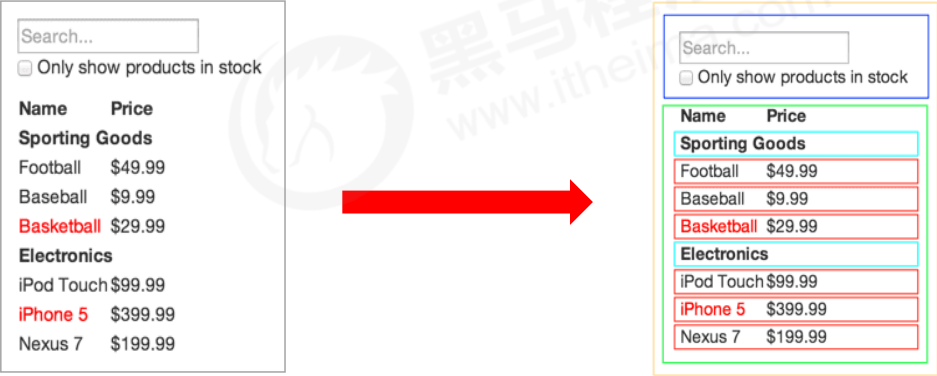
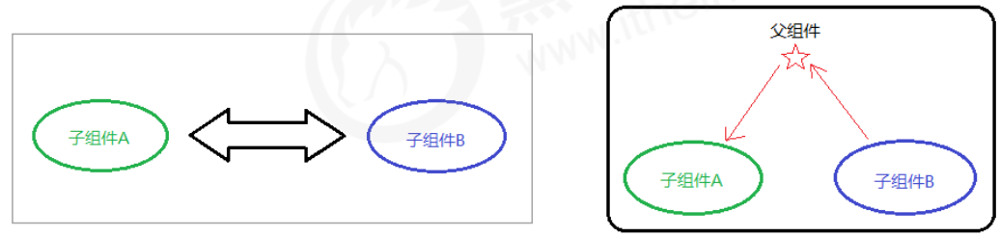
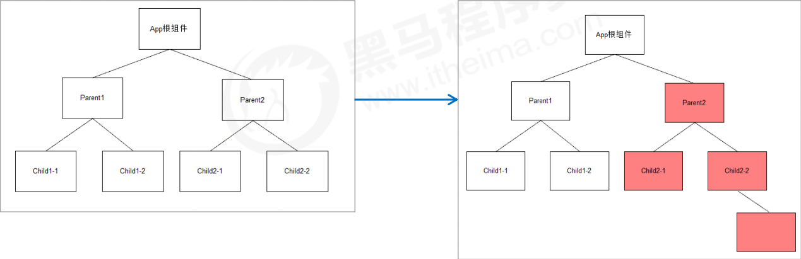
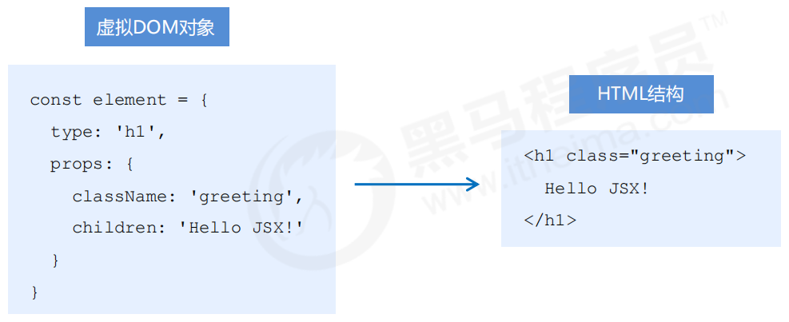

# 1.React 基础

## 1.React 概述

### 1.什么是 React

**React** 是一个用于**构建用户界面**的 **JavaScript 库**。

用户界面：HTML 页面（前端）

React 主要用来写 HTML 页面，或**构建 Web 应用**

如果从 MVC 的角度来看，React 仅仅是视图层（V），也就是只负责视图的渲染，而并非提供了完整的 M 和 C 的功能。

React 起源于 Facebook 的内部项目，后又用来架设 Instagram 的网站，并于 2013 年 5 月开源

### 2.React 的特点

- 声明式
- 基于组件
- 学习一次，随处使用

#### 1.声明式

你只需要描述 UI（HTML）看起来是什么样，就跟写 HTML 一样

React 负责渲染 UI，并在数据变化时更新 UI

```react
const jsx = <div className="app">
	<h1>Hello React! 动态变化数据：{ count }</h1>
</div>
```

#### 2.基于组件

- 组件是 React **最重要**的内容
- 组件表示页面中的部分内容
- 组合、复用多个组件，可以实现完整的页面功能


#### 3.学习一次，随处使用

- 使用 React 可以开发 Web 应用
- 使用 React 可以开发移动端原生应用（react-native） 
- 使用 React 可以开发 VR（虚拟现实）应用（react 360）


## 2.React 的基本使用

### 1.React 的安装

运行如下安装命令：

```bash
npm i react react-dom
```

- react 包是核心，提供创建元素、组件等功能
- react-dom 包提供 DOM 相关功能等

### 2.React 的使用

1. 引入 react 和 react-dom 两个 js 文件

   ```html
   <!-- 1. 引入 js 文件 -->
   <script src="./node_modules/react/umd/react.development.js"></script>
   <script src="./node_modules/react-dom/umd/react-dom.development.js"></script>
   ```

2. 创建 React 元素

3. 渲染 React 元素到页面中

   ```html
   <div id="root"></div>
   
   <script>
     // 2. 创建 react 元素
     const title = React.createElement('h1', { title: '标题' }, 'Hello React')
   
     // 3. 渲染 react 元素
     ReactDOM.render(title, document.getElementById('root'))
   </script>
   ```

### 3.方法说明

- React.createElement() 说明（知道）

  ```js
  // 第一个参数：元素名称
  // 第二个参数：元素属性
  // 第三个及以后的参数：元素的子节点
  const title = React.createElement(
    'h1',
    { title: '标题' },
    'Hello React',
    React.createElement('a', { href: 'https://www.baidu.com/' }, '跳转至百度')
  )
  ```

- ReactDOM.render 说明

  ```js
  // 第一个参数：要渲染的 React 元素
  // 第二个参数：挂载点，DOM 对象
  ReactDOM.render(title, document.getElementById('root'))
  ```

## 3.React 脚手架的使用

### 1.React 脚手架意义

1. 脚手架是开发 现代Web 应用的必备。
2. 充分利用 Webpack、Babel、ESLint 等工具辅助项目开发。
3. 零配置，无需手动配置繁琐的工具即可使用。
4. 关注业务，而不是工具配置。

### 2.使用 React 脚手架初始化项目

#### 1.npx 方式

1. 初始化项目，命令：

   ```bash
   npx create-react-app 项目名称
   ```

2. 启动项目，在项目根目录执行如下命令：

   ```bash
   npm start
   ```

**npx 命令介绍**

- **npm v5.2.0** 引入的一条命令
- 目的：提升包内提供的命令行工具的使用体验
- 原来：先安装脚手架包，再使用这个包中提供的命令
- 现在：**无需安装脚手架包**，就可以直接使用这个包提供的命令

**补充说明**

1. 推荐使用：**npx create-react-app my-app**
2. npm init react-app my-app
3. yarn create react-app my-app
   - yarn 是 Facebook 发布的包管理器，可以看做是 npm 的替代品，功能与 npm 相同
   - yarn 具有快速、可靠和安全的特点
   - 初始化新项目：**yarn init**
   - 安装包： **yarn add 包名称**
   - 安装项目依赖项：**yarn**
   - 其他命令，请参考 **yarn 文档**

#### 2.安装全局脚手架方式

1. 执行如下命令全局安装脚手架（安装一次即可）：

   ```bash
   npm i create-react-app -g
   ```

2. 在要创建项目的文件夹下，执行如下命令：

   ```bash
   create-react-app 项目名称
   ```

3. 启动项目，在项目根目录执行如下命令：

   ```bash
   npm start
   ```

### 3.在脚手架中使用 React

1. 导入 react 和 react-dom 两个包。

   ```js
   import React from 'react'
   import ReactDOM from 'react-dom'
   ```

2. 调用 **React.createElement()** 方法创建 react 元素。

3. 调用 **ReactDOM.render()** 方法渲染 react 元素到页面中。

## 4.总结

1. React 是构建用户界面的 JavaScript 库
2. 使用 react 时，**推荐使用脚手架方式**。
3. 初始化项目命令：**npx create-react-app 项目名称**。
4. 启动项目命令：**yarn start**（或 **npm start**）。
5. React.createElement() 方法用于创建 react 元素（知道）。
6. ReactDOM.render() 方法负责渲染 react 元素到页面中。

# 2.JSX

## 1.JSX 的基本使用

### 1.createElement() 的问题

1. 繁琐不简洁。
2. 不直观，无法一眼看出所描述的结构。
3. 不优雅，用户体验不爽。

的问题.png)

### 2.JSX 简介

**JSX** 是 **JavaScript XML** 的简写，表示在 JavaScript 代码中写 XML（HTML） 格式的代码。

优势：声明式语法更加直观、与HTML结构相同，降低了学习成本、提升开发效率。

**JSX 是 React 的核心内容。**

### 3.使用步骤

```jsx
// 使用 JSX 语法，创建 React 元素
const title = <h1>Hello JSX</h1>

// 渲染创建好的 React 元素
ReactDOM.render(title, root)
```

**为什么脚手架中可以使用 JSX 语法？**

1. JSX 不是标准的 ECMAScript 语法，它是 ECMAScript 的语法扩展。
2. 需要使用 babel 编译处理后，才能在浏览器环境中使用。
3. create-react-app 脚手架中已经默认有该配置，无需手动配置。
4. 编译 JSX 语法的包为：**@babel/preset-react**。

### 4.注意点

1. React元素的属性名使用驼峰命名法
2. 特殊属性名：class -> **className**、for -> **htmlFor**、tabindex -> **tabIndex**。
3. 没有子节点的 React 元素可以用 **/>** 结束。
4. 推荐：使用**小括号包裹 JSX**，从而避免 JS 中的自动插入分号陷阱。

```jsx
// 使用小括号包裹 JSX
const dv = (
	<div>Helo JSX</div>
)
```

## 2.JSX 中使用 JavaScript 表达式

### 1.嵌入 JS 表达式

- 数据存储在 JS 中
- 语法：**{ JavaScript 表达式 }**
- 注意：语法中是**单大括号**，不是双大括号！

```jsx
const name = 'Jack'

const div = (
	<div>你好，我叫：{ name }</div>
)
```

### 2.注意点

- **单大括号**中可以使用任意的 JavaScript 表达式
- JSX 自身也是 JS 表达式
- 注意：JS 中的对象是一个例外，一般只会出现在 style 属性中
- 注意：**不能在 { } 中出现语句**（比如：if/for 等）

## 3.JSX 的条件渲染

- 场景：loading 效果
- 条件渲染：根据条件渲染特定的 JSX 结构
- 可以使用 **if/else** 或**三元运算符**或**逻辑与运算符**来实现

```jsx
const isLoading = true

const loadData = () => {
  if (isLoading) return (<div>数据加载中，请稍后...</div>)
  return (<div>数据加载完成，此处显示加载后的数据</div>)
}

const div = (
  <div>
  { loadData() }
  </div>
)
```

## 4.JSX 的列表渲染

- 如果要渲染一组数据，应该使用数组的 **map()** 方法
- 注意：渲染列表时应该添加 key 属性，**key 属性的值要保证唯一**
- 原则：map() 遍历谁，就给谁添加 key 属性
- 注意：**尽量避免使用索引号作为 key**

```jsx
const songs = [
  {id: 1, name: '痴心绝对'},
  {id: 2, name: '像我这样的人'},
  {id: 3, name: '南山南'}
]

const list = (
  <ul>
    { songs.map(item => (<li key={ item.id }>{ item.name }</li>)) }
  </ul>
)
```

## 5.JSX 的样式处理

1. 行内样式 —— style

   ```jsx
   <div style={{ color: 'red', backgroundColor: 'pink' }}>JSX 的样式处理 style 方式</div>
   ```

2. 类名 —— className（推荐）

   ```jsx
   <div className='div'>JSX 的样式处理 className 方式</div>
   ```

## 6.总结

1. JSX 是 React 的核心内容。
2. JSX 表示在 JS 代码中写 HTML 结构，是 React 声明式的体现。
3. 使用 JSX 配合嵌入的 JS 表达式、条件渲染、列表渲染，可以描述任意 UI 结构。
4. 推荐使用 className 的方式给 JSX 添加样式。
5. React 完全利用 JS 语言自身的能力来编写 UI，而不是造轮子增强 HTML 功能。

# 3.React 组件基础

## 1.React 组件介绍

- 组件是 React 的**一等公民**，使用 React 就是在用组件
- 组件表示页面中的部分功能
- 组合多个组件实现完整的页面功能
- 特点：可复用、独立、可组合



## 2.React 组件的两种创建方式

1. 使用函数创建组件
2. 使用类创建组件

### 1.使用函数创建组件

- 函数组件：使用 JS 的函数（或箭头函数）创建的组件

- 约定1：函数名称必须以**大写字母开头**

- 约定2：函数组件**必须有返回值**，表示该组件的结构

- 如果返回值为 null，表示不渲染任何内容

- 渲染函数组件：用函数名作为组件标签名

- 组件标签可以是单标签也可以是双标签

  ```jsx
  function Hello() {
    return (<div>这是我的第一个函数组件！</div>)
  }
  
  ReactDOM.render(<Hello />, document.getElementById('root'))
  ```

### 2.使用类创建组件

- 类组件：使用 ES6 的 class 创建的组件

- 约定1：类名称也必须以**大写字母开头**

- 约定2：类组件应该继承 **React.Component** 父类，从而可以使用父类中提供的方法或属性

- 约定3：类组件必须提供 **render()** 方法

- 约定4：render() 方法**必须有返回值**，表示该组件的结构

  ```jsx
  class Hello extends React.Component {
    render() {
  	  return (<div>Hello Class Component!</div>)
    }
  }
  
  ReactDOM.render(<Hello />, document.getElementById('root'))
  ```

### 3.抽离为独立 JS 文件

- 思考：项目中的组件多了之后，该如何组织这些组件呢？
- 选择一：将所有组件放在同一个 JS 文件中
- 选择二：将每个组件放到单独的 JS 文件中
- 组件作为一个独立的个体，一般都会**放到一个单独的 JS 文件中**

**步骤**

1. 创建 Hello.js
2. 在 Hello.js 中导入 React
3. 创建组件（函数或类）
4. 在 Hello.js 中导出该组件
5. 在 index.js 中导入 Hello 组件
6. 渲染组件

Hello.js：

```jsx
import React from 'react'

class Hello extends React.Component {
  render() {
	  return (<div>Hello Class Component!</div>)
  }
}

export default Hello
```

index.js：

```jsx
import Hello from './Hello'

ReactDOM.render(<Hello />, document.getElementById('root'))
```

## 3.React 事件处理

1. 事件绑定
2. 事件对象

### 1.事件绑定

- React 事件绑定语法与 DOM 事件语法相似
- 语法：on事件名称={ 事件处理程序 }，比如：onClick={ () => {} }
- 注意：React 事件采用**驼峰命名法**，比如：onMouseEnter、onFocus
- 在函数组件中绑定事件：

使用函数创建组件：

```jsx
function Hello() {
  function handleClick() {
	  console.log('触发了点击事件')
  }

  return (<div onClick={ handleClick }>点我</div>)
}
```

使用类创建组件：

```jsx
class Hello2 extends React.Component {
  handleClick() {
    console.log('触发了点击事件')
  }

  render() {
	  return (<div onClick={ this.handleClick }>点我</div>)
  }
}
```

### 2.事件对象

- 可以通过**事件处理程序的参数**获取到事件对象
- React 中的事件对象叫做：**合成事件**（对象）
- 合成事件：兼容所有浏览器，无需担心跨浏览器兼容性问题

```jsx
handleClick(event) {
  console.log('触发了点击事件', event)
}

return (<div onClick={ this.handleClick }>点我</div>)
```

## 4.有状态组件和无状态组件

- 函数组件又叫做无状态组件，类组件又叫做有状态组件
- 状态（state）即数据
- 函数组件没有自己的状态，只负责数据展示（静）
- 类组件有自己的状态，负责更新 UI，让页面 “动” 起来

比如计数器案例中，点击按钮让数值加 1。0 和 1 就是不同时刻的状态，而由 0 变为 1 就表示状态发生了变化。状态变化后，UI 也要相应的更新。React 中想要实现该功能，就要使用有状态组件来完成。


## 5.组件中的 state 和 setState()

1. state 的基本使用
2. setState() 修改状态

### 1.state 的基本使用

- 状态（state）即数据，是组件内部的**私有**数据，只能在组件内部使用
- **state 的值是对象**，表示一个组件中可以有多个数据

```jsx
class Hello extends React.Component {
  constructor() {
    super()
    // 初始化 state
    this.state = {
      count: 0
    }
  }
}
```

```jsx
class Hello extends React.Component {
  // 简化写法
  state = {
    count: 0
  }
}
```

**获取状态**

- 状态即数据
- 状态是私有的，只能在组件内部使用
- 通过 **this.state** 来获取状态

```jsx
class Hello extends React.Component {
  render() {
    return (<div>state.count 的值是：{ this.state.count }</div>)
  }
}
```

### 2.setState() 修改状态

- 状态是可变的
- 语法：this.setState({ 要修改的数据 })
- 注意：**不要直接修改 state 中的值，这是错误的！！！**
- setState() 作用：1.**修改 state** 2.**更新 UI**
- 思想：**数据驱动视图**

```jsx
class Hello extends React.Component {
  render() {
	  return (
      <div>
        <div>state.count 的值是：{ this.state.count }</div>
        <button onClick={ () => this.setState({ count: this.state.count + 1 }) }>state.count++</button>
        <button onClick={ () => this.setState({ count: this.state.count - 1 }) }>state.count--</button>
      </div>
    )
  }
}
```

**从 JSX 中抽离事件处理程序会报错**

- JSX 中掺杂过多 JS 逻辑代码，会显得非常混乱

- 推荐：**将逻辑抽离到单独的方法中**，保证 JSX 结构清晰

  

- 原因：事件处理程序中 this 的值为 undefined

- 希望：this 指向组件实例（render 方法中的 this 即为组件实例）

### 3.在函数组件中使用 state

```jsx
import {useState} from "react"

function Hello() {
  const [count, setCount] = useState(1) // 定义 count
  const [message, setMessage] = useState("aaa") // 定义 message

  const handleCount = () => setCount(count + 1) // count 的处理函数
  const handleMessage = () => setMessage('bbb') // message 的处理函数

  return (
    <div>
      <div>count：{count} -- message：{message}</div>
      <button onClick={handleCount}>count++</button>
      <button onClick={handleMessage}>改变message</button>
    </div>
  )
}
```

## 6.事件绑定 this 指向

1. 箭头函数
2. Function.prototype.bind()
3. class 的实例方法

### 1.调用时用箭头函数

- 利用箭头函数自身不绑定this的特点
- render() 方法中的 this 为组件实例，可以获取到 setState()

```jsx
class Hello extends React.Component {
  addCount() {
    this.setState({ count: this.state.count + 1 })
  }

  render() {
    // 箭头函数中的 this 指向外部环境，此处为：render() 方法
	  return (<button onClick={ () => this.addCount() }>addCount 函数中 state.count++</button>)
  }
}
```

### 2.Function.prototype.bind()

利用 ES5 中的 bind 方法，将事件处理程序中的 this 与组件实例绑定到一起

```jsx
class Hello extends React.Component {
  constructor() {
    super()
    // 事件绑定 this 指向 -- Function.prototype.bind()
    this.subCount = this.subCount.bind(this)
  }

  subCount() {
    this.setState({ count: this.state.count - 1 })
  }

  render() {
	  return (<button onClick={ this.subCount }>subCount 函数中 state.count--</button>)
  }
}
```

### 3.用箭头函数定义 class 的实例方法（推荐使用这个）

- 利用箭头函数形式的 class 实例方法
- 注意：该语法是实验性语法，但是，由于 babel 的存在可以直接使用

```jsx
class Hello extends React.Component {
  countAdd5 = () => this.setState({ count: this.state.count + 5 })

  render() {
	  return (<button onClick={ this.countAdd5 }>countAdd5 函数中 state.count += 5</button>)
  }
}
```

## 7.表单处理

1. 受控组件
2. 非受控组件（DOM方式）

### 1.受控组件

- HTML 中的表单元素是可输入的，也就是有自己的可变状态
- 而，React 中可变状态通常保存在 state 中，并且只能通过 setState() 方法来修改
- React 将 state 与表单元素值 value 绑定到一起，**由 state 的值来控制表单元素的值**
- 受控组件：其值受到 React 控制的表单元素


**步骤：**

1. 在 state 中添加一个状态，作为表单元素的 value 值（控制表单元素值的来源）
2. 给表单元素绑定 change 事件，将 表单元素的值 设置为 state 的值（控制表单元素值的变化）

```jsx
class Hello extends React.Component {
  state = {
    txt: ''
  }

  handleTxt = event => this.setState({ txt: event.target.value })

  render() {
	  return (<input type="text" value={ this.state.txt } onChange={ this.handleTxt } />)
  }
}
```

**多表单元素优化：**

- 问题：每个表单元素都有一个单独的事件处理程序处理太繁琐
- 优化：使用一个事件处理程序同时处理多个表单元素

**步骤：**

1. 给表单元素添加 name 属性，名称与 state 相同
2. 根据表单元素类型获取对应值
3. 在 change 事件处理程序中通过 [name] 来修改对应的 state

```jsx
class Hello extends React.Component {
  state = {
    txt: ''
  }

  handleForm = event => {
    // 获取当前 DOM 对象
    const target = event.target
    // 根据表单元素类型获取值
    const value = target.type === 'checkbox' ? target.checked : target.value
    // 根据 name 设置对应 state
    this.setState({ [target.name]: value })
  }

  render() {
    // 添加 name 属性，值与 state 里的名称相同
	  return (<input type="text" name='txt' value={ this.state.txt } onChange={ this.handleForm } />)
  }
}
```

### 2.非受控组件

- 说明：借助于 ref，使用原生 DOM 方式来获取表单元素值
- ref 的作用：获取 DOM 或组件

**使用步骤：**

1. 调用 React.createRef() 方法创建一个 ref 对象

   ```jsx
   // 类组件
   constructor() {
     super()
     this.txtRef = React.createRef()
   }
   
   // 函数组件
   import useRef from 'react'
   const txtRef = useRef(null)
   ```

2. 将创建好的 ref 对象添加到文本框中

   ```jsx
   <input type="text" ref={ this.txtRef } />
   ```

3. 通过 ref 对象获取到文本框的值

   ```jsx
   console.log(this.txtRef.current.value)
   ```


## 8.总结

1. 组件的两种创建方式：函数组件和类组件
2. 无状态（函数）组件，负责静态结构展示
3. 有状态（类）组件，负责更新 UI，让页面动起来
4. 绑定事件注意 this 指向问题
5. 推荐使用受控组件来处理表单
6. 完全利用 JS 语言的能力创建组件，这是 React 的思想

# 4.React 组件进阶

## 1.组件通讯介绍

**组件**是独立且封闭的单元，默认情况下，只能使用组件自己的数据。在组件化过程中，我们将一个完整的功能拆分成多个组件，以更好的完成整个应用的功能。而在这个过程中，多个组件之间不可避免的要共享某些数据。为了实现这些功能，就需要打破组件的独立封闭性，让其与外界沟通。这个过程就是**组件通讯**。


## 2.组件的 props

- 组件是封闭的，要接收外部数据应该通过 props 来实现
- **props 的作用：接收传递给组件的数据**
- 传递数据：**给组件标签添加属性**
- 接收数据：函数组件通过参数 **props** 接收数据，类组件通过 **this.props** 接收数据

```jsx
class Hello extends React.Component {
  render() {
    return (
      <div>
        {/*接收 props 参数*/}
        <div>接收到的 name：{this.props.name}</div>
        <div>接收到的 age：{this.props.age}</div>
      </div>
    )
  }
}

class App extends React.Component {
  render() {
    return (
      <div>
        {/*使用 Hello 组件时传递 name 和 age 参数*/}
        <Hello name='zhangsan' age={18}/>
      </div>
    )
  }
}
```

**特点**

1. 可以给组件传递任意类型的数据
2. **props** 是**只读**的对象，只能读取属性的值，无法修改对象
3. 注意：使用类组件时，如果写了构造函数，**应该将 props 传递给 super()**，否则，无法在构造函数中获取到 props！

```jsx
class Hello extends React.Component {
  constructor(props) {
    // 如果有构造函数，必须将 props 传递给构造函数，否则，无法在构造函数中获取到 props
    super(props)
  }

  render() {
    return (
      <div>
        <div>接收到的 name：{this.props.name}</div>
        <div>接收到的 age：{this.props.age}</div>
      </div>
    )
  }
}
```

## 3.组件通讯的三种方式

组件之间的通讯分为 3 种：

1. 父组件 -> 子组件
2. 子组件 -> 父组件
3. 兄弟组件

### 1.父组件传递数据给子组件

1. 父组件提供要传递的 state 数据
2. 给子组件标签添加属性，值为 **state** 中的数据
3. 子组件中通过 **props** 接收父组件中传递的数据

子组件：

```jsx
class Child extends React.Component {
  render() {
    return (
      <div>
        {/*接收父组件传递过来的参数*/}
        <div>接收父组件传递过来的 name：{this.props.name}</div>
      </div>
    )
  }
}
```

父组件：

```jsx
class Parent extends React.Component {
  state = {
    name: 'lisi'
  }

  render() {
    return (
      <div>
        {/*传递参数给子组件*/}
        <Child name={this.state.name}/>
      </div>
    )
  }
}
```

### 2.子组件传递数据给父组件

思路：利用回调函数，父组件提供回调，子组件调用，将要传递的数据作为回调函数的参数。

1. 父组件提供一个回调函数（用于接收数据）
2. 将该函数作为属性的值，传递给子组件
3. 子组件通过 props 调用回调函数
4. 将子组件的数据作为参数传递给回调函数

父组件：

```jsx
class Parent extends React.Component {
  state = {
    childMsg: ''
  }

  getChildMsg = (childMsg) => this.setState({childMsg: childMsg})

  render() {
    return (
      <div>
        {/*接收子组件传递过来的参数*/}
        <Child getChildMsg={this.getChildMsg}/>
        <div>接收子组件传递过来的 childMsg：{this.state.childMsg}</div>
      </div>
    )
  }
}
```

子组件：

```jsx
class Child extends React.Component {
  state = {
    childMsg: 'Hello Parent'
  }

  render() {
    return (
      <div>
        {/*传递参数给父组件*/}
        <div>{this.props.getChildMsg(this.state.childMsg)}</div>
      </div>
    )
  }
}
```

### 3.兄弟组件

- 将共享状态提升到最近的公共父组件中，由公共父组件管理这个状态
- 思想：**状态提升**
- 公共父组件职责：1.提供共享状态 2.提供操作共享状态的方法
- 要通讯的子组件只需通过 **props** 接收状态或操作状态的方法



Child 子组件（发送方）：

```jsx
class Child extends React.Component {
  state = {
    msg: 'Hello Child2'
  }

  render() {
    return (
      <div>
        {/*传递参数给 Child2 兄弟组件*/}
        <div>{this.props.getMsg(this.state.msg)}</div>
      </div>
    )
  }
}
```

Parent 父组件：

```jsx
class Parent extends React.Component {
  state = {
    msg: ''
  }

  getMsg = (msg) => this.setState({msg: msg})

  render() {
    return (
      <div>
        {/*接收 Child 组件传递过来的参数*/}
        <Child getMsg={this.getMsg}/>
        {/*兄弟组件之间的传参 -- Child 组件要传给 Child2 的参数*/}
        <Child2 msg={this.state.msg}/>
      </div>
    )
  }
}
```

Child2 子组件（接收方）：

```jsx
class Child2 extends React.Component {
  state = {
    msg: ''
  }

  render() {
    return (
      <div>
        {/*接收 Child 兄弟组件传递过来的参数*/}
        <div>接收 Child 兄弟组件传递过来的 msg：{this.props.msg}</div>
      </div>
    )
  }
}
```

## 4.Context

思考：App 组件要传递数据给 Child 组件，该如何处理？

- 处理方式：使用 props 一层层组件往下传递（繁琐）

  

- 更好的姿势：使用 Context

- **作用：跨组件传递数据**（比如：主题、语言等）

  

**使用步骤：**

1. 调用 React. createContext() 创建 Provider（提供数据）和 Consumer（消费数据）两个组件

   ```jsx
   const { Provider, Consumer } = React.createContext()
   ```

2. 使用 Provider 组件作为父节点，并设置 value 属性，表示要传递的数据

   ```jsx
   class App extends React.Component {
     render() {
       return (
         // 演示 Context -- value 是要向下传递的值
         <Provider value='pink'>
           <Parent/>
         </Provider>
       )
     }
   }
   ```

3. 调用 Consumer 组件接收数据

   ```jsx
   class Child extends React.Component {
     render() {
       return (
         <div>
           {/*演示 Context -- data 是接收到的参数*/}
           <Consumer>
             {data => (<span>接收到的 Context 数据 -- {data}</span>)}
           </Consumer>
         </div>
       )
     }
   }
   ```

## 5.props 深入

### 1.children 属性

- children 属性：表示组件标签的子节点。当组件标签有子节点时，props 就会有该属性
- children 属性与普通的 props 一样，值可以是任意值（文本、React 元素、组件，甚至是函数）

```jsx
class Hello extends React.Component {
  render() {
    return (
      <div>
        {/*演示 props.children 属性，输出：我是子节点*/}
        <div>{this.props.children}</div>
      </div>
    )
  }
}
```

```jsx
class App extends React.Component {
  render() {
    return (
      <Provider value='pink'>
        {/*演示 props.children 属性*/}
        <Hello>我是子节点</Hello>
      </Provider>
    )
  }
}
```

### 2.props 校验

#### 1.问题

- 对于组件来说，props 是外来的，无法保证组件使用者传入什么格式的数据

- 如果传入的数据格式不对，可能会导致组件内部报错

- 关键问题：组件的使用者不知道明确的错误原因

  ```jsx
  class Hello extends React.Component {
    propsValidator = () => {
      // 会报错，但不会给出明确的错误提示
      const lis = this.props.colors.map((item, index) => (<li key={index}>{item}</li>))
      return (<ul>{lis}</ul>)
    }
  
    render() {
      return (
        <div>
          <div>{this.propsValidator()}</div>
        </div>
      )
    }
  }
  
  // 在 App 组件中使用 Hello 组件
  class App extends React.Component {
    render() {
      return (
        <Provider value='pink'>
          <Hello colors={10}></Hello>
        </Provider>
      )
    }
  }
  ```

- props 校验：允许在创建组件的时候，就指定 props 的类型、格式等

- 作用：捕获使用组件时因为 props 导致的错误，给出明确的错误提示，增加组件的健壮性

  ```jsx
  App.propTypes = {
  	colors: PropTypes.array
  }
  ```

  

#### 2.使用步骤

1. 安装包 prop-types

   ```bash
   yarn add prop-types
   # 或者
   npm i prop-types
   ```

2. 导入 prop-types 包

   ```jsx
   import PropTypes from 'prop-types'
   ```

3. 使用**组件名.propTypes = {}** 来给组件的 props 添加校验规则

4. **校验规则**通过 PropTypes 对象来指定

   ```jsx
   class Hello extends React.Component {
     propsValidator = () => {
       // 配置了 prop-types 之后，会给出一个明确的错误提示
       const lis = this.props.colors.map((item, index) => (<li key={index}>{item}</li>))
       return (<ul>{lis}</ul>)
     }
   
     render() {
       return (
         <div>
           <div>{this.propsValidator()}</div>
         </div>
       )
     }
   }
   Hello.propTypes = {
     // 约定 colors 属性为 array 类型，如果类型不对，则报出明确错误，便于分析错误原因
     colors: PropTypes.array
   }
   ```

#### 3.约束规则

1. 常见类型：array、bool、func、number、object、string
2. React 元素类型：element
3. 必填项：isRequired
4. 特定结构的对象：shape({ })

```jsx
Hello.propTypes = {
  // 类型为数组，isRequired 必选
  colors: PropTypes.array.isRequired,
  // 特定结构的对象
  obj: PropTypes.shape({
    color: PropTypes.string,
    fontSize: PropTypes.number
  })
}
```

### 3.props 的默认值

- 场景：分页组件 -> 每页显示条数
- 作用：给 props 设置默认值，在未传入 props 时生效

```jsx
class Hello extends React.Component {
  render() {
    return (
      <div>
        {/*props 默认值*/}
        <div>props 默认值是：{this.props.pageSize}</div>
      </div>
    )
  }
}
// 设置 props 默认值
Hello.defaultProps = {
  pageSize: 10
}
```

## 6.组件的生命周期

### 1.组件的生命周期概述

- 意义：组件的生命周期有助于理解组件的运行方式、完成更复杂的组件功能、分析组件错误原因等
- **组件的生命周期**：组件从被创建到挂载到页面中运行，再到组件不用时卸载的过程
- 生命周期的每个阶段总是伴随着一些方法调用，这些方法就是生命周期的**钩子函数**
- 钩子函数的作用：为开发人员在不同阶段操作组件提供了时机
- **只有类组件才有生命周期**

### 2.生命周期的三个阶段

1. 每个阶段的执行时机
2. 每个阶段钩子函数的执行顺序
3. 每个阶段钩子函数的作用


#### 1.创建时（挂载阶段）

执行时机：组件创建时（页面加载时）

执行顺序：

| 钩子函数          | 触发时机                    | 作用                                      |
| ----------------- | --------------------------- | ----------------------------------------- |
| constructor       | 创建组件时，最先执行        | 1.初始化 state  2.为事件处理程序绑定 this |
| render            | 每次组件渲染都会触发        | 渲染 UI（注意：**不能调用 setState()**）  |
| componentDidMount | 组件挂载（完成 DOM 渲染）后 | 1.发送网络请求  2.DOM 操作                |

#### 2.更新时（更新阶段）

执行时机：1.setState() 2.forceUpdate() 3.组件接收到新的 props

说明：以上三者任意一种变化，组件就会重新渲染

执行顺序：

| 钩子函数              | 触发时机                    | 作用                                                         |
| --------------------- | --------------------------- | ------------------------------------------------------------ |
| shouldComponentUpdate | 每次重新渲染前执行          | 通过返回值决定该组件是否重新渲染，返回 true 表示重新渲染，false 表示不重新渲染 |
| render                | 每次组件渲染都会触发        | 渲染 UI（与挂载阶段是同一个 render）                         |
| componentDidUpdate    | 组件更新（完成 DOM 渲染）后 | 1.发送网络请求  2.DOM 操作  注意：如果要 setState() 必须放在一个 if 条件中 |

#### 3.卸载时（卸载阶段）

执行时机：组件从页面中消失

| 钩子函数             | 触发时机                 | 作用                               |
| -------------------- | ------------------------ | ---------------------------------- |
| componentWillUnmount | 组件卸载（从页面中消失） | 执行清理工作（比如：清理定时器等） |

### 3.不常用钩子函数介绍

旧版生命周期钩子函数（知道）：


新版完整生命周期钩子函数（知道）：


### 4.函数组件的 useEffect

useEffect 使用时有以下 4 种情况

#### 1.不传递

useEffect 不传递第二个参数会导致每次渲染都会运行 useEffect。然后，当它运行时，它获取数据并更新状态。然后，一旦状态更新，组件将重新呈现，这将再次触发 useEffect，这就是问题所在。

```jsx
// 所有更新都执行
useEffect(() => console.log('组件更新了'))
```

#### 2.传递空数组

```jsx
// 仅在挂载的时候执行
useEffect(() => console.log('组件挂载了'), [])
```

#### 3.传递一个值

```jsx
// count 更新时执行
useEffect(() => console.log('count 更新了'), [count])
```

#### 4.传递多个

```jsx
// 监听 props 对象 number 的更改
const Asynchronous: React.FC = ({number}) => {
  // setNumber 是 useState 返回的 setter，所以不会在每次渲染时重新创建它，因此 useEffect 只会运行一次
  const [number, setNumber] = useState(number)
  useEffect(()=>{
    console.log(number)
    setNumber(number)
  }, [number, setNumber])
}
```

#### 5.return 方法

```jsx
const timer = setInterval(() => setCount(count + 1), 1000)

// useEffect 方法的第一个参数是一个函数，函数可以 return 一个方法，这个方法就是在组件销毁的时候会被调用
useEffect(() => {
  // 组件销毁时清除定时器
  return () => clearInterval(timer)
}, [])
```

## 7.render-props 和高阶组件

### 1.React组件复用概述

- 思考：如果两个组件中的部分功能相似或相同，该如何处理？
- 处理方式：复用相似的功能（联想函数封装）
- 复用什么？1.state 2.操作 state 的方法（组件状态逻辑）
- 两种方式：1.**render props 模式** 2.**高阶组件（HOC）**
- 注意：这两种方式**不是新的 API**，而是利用 React 自身特点的编码技巧，演化而成的固定模式（写法）

### 2.render props 模式

#### 1.思路分析

- 思路：将要复用的 state 和操作 state 的方法封装到一个组件中

- 问题1：如何拿到该组件中复用的 state？

- 在使用组件时，添加一个值为**函数的 prop**，通过函数**参数**来获取（需要组件内部实现）

  ```jsx
  <Mouse render={mouse => {}}/>
  ```

- 问题2：如何渲染任意的 UI？

- 使用**该函数的返回值**作为要渲染的 UI 内容（需要组件内部实现）

  ```jsx
  <Mouse render={mouse => (<p>鼠标当前位置 {mouse.x}，{mouse.y}</p>)}/>
  ```


#### 2.使用步骤

1. 创建 Mouse 组件，在组件中提供复用的**状态逻辑**代码（1.状态 2.操作状态的方法）
2. 将要**复用的状态**作为 props.render(**state**) 方法的参数，暴露到组件外部
3. 使用 props.render() 的**返回值**作为要渲染的内容

```jsx
class Mouse extends React.Component {
  state = {
    x: 0,
    y: 0
  }

  handleMouseMove = (event) => {
    this.setState({
      x: event.pageX,
      y: event.pageY
    })
  }

  render() {
    // 返回一个 render 函数接收页面结构
    return this.props.render(this.state)
  }

  componentDidMount() {
    window.addEventListener('mousemove', this.handleMouseMove)
  }
}

class App extends React.Component {
  render() {
    return (
      <Provider value='pink'>
        {/*将页面结构通过 render 传递进去，同时还能操作 Mouse 组件的 state*/}
        <Mouse render={state => <p>鼠标当前位置 {state.x}，{state.y}</p>}/>
      </Provider>
    )
  }
}
```

- Mouse 组件负责：**封装复用的状态逻辑代码**（1.状态 2.操作状态的方法）
- 状态：鼠标坐标（x, y）
- 操作状态的方法：鼠标移动事件
- 传入的render prop负责：**使用复用的状态来渲染 UI 结构**

#### 3.children 代替 render 属性

- 注意：并不是该模式叫 render props 就必须使用名为 render 的 prop，实际上可以使用任意名称的 prop
- 把 prop 是一个函数并且告诉组件要渲染什么内容的技术叫做：render props 模式
- 推荐：使用 **children** 代替 render 属性

Mouse 组件：

```jsx
render() {
  // children 代替 render 属性
  return this.props.children(this.state)
}
```

App 组件：

```jsx
{/*children 代替 render 属性*/}
<Mouse>{state => <p>鼠标当前位置 {state.x}，{state.y}</p>}</Mouse>
```

#### 4.代码优化

1. 推荐：给 render props 模式添加 props 校验

   ```jsx
   Mouse.propTypes = {
     children: PropTypes.func.isRequired
   }
   ```

2. 应该在组件卸载时解除 mousemove 事件绑定

   ```jsx
   componentWillUnmount() {
     window.removeEventListener('mousemove', this.handleMouseMove)
   }
   ```

### 3.高阶组件

#### 1.概述

- 目的：**实现状态逻辑复用**
- 采用 **包装（装饰）模式**，比如说：手机壳
- 手机：获取保护功能
- 手机壳：提供保护功能
- 高阶组件就相当于手机壳，通过包装组件，增强组件功能

#### 2.思路分析

- **高阶组件**（HOC：Higher-Order Component）**是一个函数**，接收要包装的组件，返回增强后的组件
- 高阶组件内部**创建一个类组件**，在这个类组件中**提供复用的状态逻辑**代码，通过 prop 将复用的状态传递给被包装组件 WrappedComponent

#### 3.使用步骤

1. 创建一个函数，名称约定**以 with 开头**
2. 指定函数参数，参数应该以大写字母开头（作为要渲染的组件）
3. 在函数内部创建一个类组件，**提供复用的状态逻辑代码**，并返回
4. 在该组件中，渲染参数组件，同时将状态通过 prop 传递给参数组件
5. 调用该高阶组件，传入要增强的组件，通过返回值拿到增强后的组件，并将其渲染到页面中

```jsx
// 高阶组件
function withMouse(WrappedComponent) {
  class Mouse extends React.Component {
    state = {
      x: 0,
      y: 0
    }

    handleMouseMove = (event) => {
      this.setState({
        x: event.pageX,
        y: event.pageY
      })
    }

    render() {
      // 相当于 <WrappedComponent x={this.state.x} y={this.state.y}/>
      return <WrappedComponent {...this.state}/>
    }

    componentDidMount() {
      window.addEventListener('mousemove', this.handleMouseMove)
    }

    componentWillUnmount() {
      window.removeEventListener('mousemove', this.handleMouseMove)
    }
  }

  return Mouse
}

// Position 组件，用来测试高阶组件
class Position extends React.Component {
  render() {
    return (<p>（高阶组件）鼠标当前位置 {this.props.x}，{this.props.y}</p>)
  }
}

// 创建组件（增强 Position 组件）
const MousePosition = withMouse(Position)
```

#### 4.设置 displayName

- 使用高阶组件存在的问题：得到的两个组件名称相同
- 原因：默认情况下，React 使用**组件名称**作为 displayName
- 解决方式：为高阶组件设置 **displayName** 便于调试时区分不同的组件
- displayName 的作用：用于设置调试信息（react developer tools 信息）
- 设置方式：

```jsx
function withMouse(WrappedComponent) {
  class Mouse extends React.Component {...}

  // 设置 displayName
  Mouse.displayName = `WithMouse${getDisplayName(WrappedComponent)}`

  return Mouse
}

// 获取 displayName 的函数
function getDisplayName(WrappedComponent) {
  return WrappedComponent.displayName || WrappedComponent.name || 'Component'
}
```

#### 5.传递 props

- 问题：props 丢失
- 原因：高阶组件没有往下传递 props
- 解决方式：渲染 WrappedComponent 时，将 **state** 和 **props** 一起传递给组件
- 传递方式：

```jsx
<WrappedComponent {...this.state} {...this.props}/>
```

## 8.总结

1. 组件通讯是构建 React 应用必不可少的一环。
2. props 的灵活性让组件更加强大。
3. 状态提升是 React 组件的常用模式。
4. 组件生命周期有助于理解组件的运行过程。
5. 钩子函数让开发者可以在特定的时机执行某些功能。
6. render props 模式和高阶组件都可以实现组件状态逻辑复用。
7. 组件极简模型：(state, props) => UI

# 5.React 原理揭秘

## 1.setState() 的说明

### 1.更新数据

- **setState()** 是**异步**更新数据的
- 注意：使用该语法时，后面的 setState() 不要依赖于前面的 setState()
- 可以多次调用 setState()，只会触发一次重新渲染

```jsx
state = {
  count: 1
}

addCount = () => {
  this.setState({count: this.state.count + 1})
  console.log(this.state.count)// 输出：1
}
```

### 2.推荐语法

- 推荐：使用 **setState((state, props) => {})** 语法
- 参数 state：表示最新的 state
- 参数 props：表示最新的 props

```jsx
// 使用 setState() 方式调用两次只会加 1
this.setState({count: this.state.count + 1})
this.setState({count: this.state.count + 1})

// 使用 setState((state, props) => {}) 的方式调用两次可以加 2
this.setState((state, props) => ({count: state.count + 1}))
this.setState((state, props) => ({count: state.count + 1}))
```

### 3.第二个参数

- 场景：在状态更新（页面完成重新渲染）后立即执行某个操作
- 语法：**setState(updater[, callback])**

```jsx
this.setState((state, props) => ({count: state.count + 1}), () => console.log('状态更新完成 count 值是', this.state.count))
```

```jsx
this.setState((state, props) => ({count: state.count + 1}), () => {
  const count = document.querySelector('.hello-container .count')
  console.log('count 的内容是', count.innerHTML)
})
```

## 2.JSX 语法的转化过程

- JSX 仅仅是 createElement() 方法的语法糖（简化语法）
- JSX 语法被 @babel/preset-react 插件编译为 createElement() 方法
- React 元素：是一个对象，用来描述你希望在屏幕上看到的内容


## 3.组件更新机制

- **setState()** 的两个作用：1.修改 state 2.更新组件（UI）
- 过程：父组件重新渲染时，也会重新渲染子组件。但只会渲染**当前组件子树**（当前组件及其所有子组件）



## 4.组件性能优化

### 1.减轻 state

- **减轻 state**：只存储跟组件渲染相关的数据（比如：count / 列表数据 / loading 等）
- 注意：不用做渲染的数据不要放在 state 中，比如定时器 id 等
- 对于这种需要在多个方法中用到的数据，应该放在 this 中

```jsx
class Hello extends React.Component {
  render() {...}

  componentDidMount() {
    // timerId 存储到 this 中，而不是 state 中
    this.timerId = setInterval(() => console.log('定时器执行了...'), 2000)
  }

  componentWillUnmount() {
    clearInterval(this.timerId)
  }
}
```

### 2.避免不必要的重新渲染

- 组件更新机制：父组件更新会引起子组件也被更新，这种思路很清晰

- 问题：子组件没有任何变化时也会重新渲染

- 如何避免不必要的重新渲染呢？

- 解决方式：使用**钩子函数 shouldComponentUpdate(nextProps, nextState)**

- 作用：通过返回值决定该组件是否重新渲染，返回 true 表示重新渲染，false 表示不重新渲染

- 触发时机：更新阶段的钩子函数，组件重新渲染前执行 （shouldComponentUpdate -> render）

  ```jsx
  class Hello extends React.Component {
    shouldComponentUpdate(nextProps, nextState) {
      console.log('最新的 props', nextProps)
      console.log('更新前的 props', this.props)
      console.log('最新的状态', nextState)
      console.log('更新前的状态', this.state)
      // 根据条件，决定是否重新渲染组件
      return true
    }
  
    render() {...}
  }
  ```

- 案例：随机数

  ```jsx
  class App extends React.Component {
    state = {
      number: 0
    }
  
    handleRandom = () => this.setState({number: Math.floor(Math.random() * 3)})
  
    shouldComponentUpdate(nextProps, nextState) {
      // 随机数案例，如果随机数重复就不更新
      return nextState.number !== this.state.number
    }
  
    render() {
      console.log('app 组件更新了...')
      return (
        <div className='app-container'>
          <div>随机数：{this.state.number}</div>
          <button onClick={this.handleRandom}>重置随机数</button>
        </div>
      )
    }
  }
  ```

### 3.纯组件

- 纯组件：PureComponent 与 React.Component 功能相似

- 区别：PureComponent 内部自动实现了 shouldComponentUpdate 钩子，不需要手动比较

- 原理：纯组件内部通过分别对比前后两次 props 和 state 的值，来决定是否重新渲染组件

  ```jsx
  // 纯组件，继承 PureComponent
  class App extends React.PureComponent {...}
  ```

- 说明：纯组件内部的对比是 **shallow compare**（浅层对比）

- 对于值类型来说：比较两个值是否相同（直接赋值即可，没有坑）

- 对于**引用类型**来说：只比较对象的引用（地址）是否相同

- 注意：**state 或 props 中属性值为引用类型时，应该创建新数据，不要直接修改原数据！**

  ```jsx
  // 正确！创建新数据
  const newObj = {...state.obj, number: 2}
  this.setState({obj: newObj})
  
  // 正确！创建新数据
  // 不要用数组的 push / unshift 等直接修改当前数组的的方法，而应该用 concat 或 slice 等这些返回新数组的方法
  const newArray = [...this.state.list, {新数据}]
  this.setState({list: newArray})
  ```

## 5.虚拟 DOM 和 Diff 算法

- React 更新视图的思想是：只要 state 变化就重新渲染视图
- 特点：思路非常清晰
- 问题：组件中只有一个 DOM 元素需要更新时，也得把整个组件的内容重新渲染到页面中？**不是**
- 理想状态：**部分更新**，只更新变化的地方。
- 问题：React 是如何做到部分更新的？**虚拟 DOM 配合 Diff 算法**

### 1.虚拟 DOM

虚拟 DOM：本质上就是一个 JS 对象，用来描述你希望在屏幕上看到的内容（UI）。



### 2.执行过程

1. 初次渲染时，React 会根据初始 state（Model），创建一个虚拟 DOM 对象（树）。
2. 根据虚拟 DOM 生成真正的 DOM，渲染到页面中。
3. 当数据变化后（setState()），重新根据新的数据，创建新的虚拟DOM对象（树）。
4. 与上一次得到的虚拟 DOM 对象，使用 **Diff 算法**对比（找不同），得到需要更新的内容。
5. 最终，React 只将**变化的内容**更新（patch）到 DOM 中，重新渲染到页面。


### 3.代码演示

- 组件 render() 调用后，根据**状态**和 **JSX 结构**生成虚拟 DOM 对象
- 示例中，只更新 p 元素的文本节点内容

```jsx
{
  type: 'div',
  props: {
    children: [
      {type: 'h1', props: {children: '随机数'}},
      {type: 'p', props: {children: 0}}
    ]
  }
}

// ...省略其他结构
{type: 'p', props: {children: 2}}
```

## 6.总结

1. 工作角度：应用第一，原理第二。
2. 原理有助于更好地理解 React 的自身运行机制。
3. setState() 异步更新数据。
4. 父组件更新导致子组件更新，纯组件提升性能。
5. 思路清晰简单为前提，虚拟 DOM 和 Diff 保效率。
6. 虚拟 DOM -> state + JSX。
7. 虚拟 DOM 的真正价值从来都不是性能。

# 6.React 路由基础

## 1.React路由介绍

现代的前端应用大多都是 **SPA**（单页面应用程序），也就是只有一个 HTML 页面的应用程序。因为它的用户体验更好、对服务器的压力更小，所以更受欢迎。为了有效的使用单个页面管理原来多页面的功能，前端路由应运而生。

- 前端路由的功能：让用户从一个视图（页面）导航到另一个视图（页面）
- 前端路由是一套映射规则，在 React 中，是 **URL 路径**与**组件**的对应关系
- 使用 React 路由简单来说，就是配置**路径**和**组件**（配对）

## 2.react-router-dom 5.x 版本

### 1.路由的基本使用

#### 1.使用步骤

1. 安装

   ```bash
   npm i react-router-dom@5.3.3
   ```
   
2. 导入路由的三个核心组件：**Router** / **Route** / **Link**

   ```jsx
   import { BrowserRouter, Route, Link } from 'react-router-dom'
   ```

3. 使用 **Router 组件**包裹整个应用（重要）

   ```jsx
   <BrowserRouter>
     <div className='app-container'>
       ...省略其他代码
     </div>
   </BrowserRouter>
   ```

4. 使用 **Link 组件**作为导航菜单（路由入口）

   ```jsx
   <Link to='/first'>First 页面</Link>
   ```

5. 使用 **Route 组件**配置路由规则和要展示的组件（路由出口）

   ```jsx
   // First 组件
   class First extends React.Component {
     render() {
       return (
         <div className='first-container'>
           <h2>First 组件</h2>
         </div>
       )
     }
   }
   
   // App 组件
   class App extends React.Component {
     render() {
       return (
         <BrowserRouter>
           <div className='app-container'>
             <h2>App 组件</h2>
             <Link to='/first'>First页面</Link>
             {/*path 属性：路由规则*/}
             {/*component 属性：展示的组件*/}
             <Route path='/first' component={First}/>
           </div>
         </BrowserRouter>
       )
     }
   }
   ```

#### 2.常用组件说明

- Router 组件：包裹整个应用，一个 React 应用只需要**使用一次**
- 两种常用 Router：HashRouter 和 **BrowserRouter**
- HashRouter：使用 URL 的哈希值实现（localhost:3000/#/first）
- （推荐）**BrowserRouter**：使用 H5 的 history API 实现（localhost:3000/first）
- Link 组件：用于指定导航链接（a 标签）
- Route 组件：指定路由展示组件相关信息

### 3.路由的执行过程

1. 点击 Link 组件（a 标签），修改了浏览器地址栏中的 url。
2. React 路由监听到地址栏 url 的变化。
3. React 路由内部遍历所有 Route 组件，使用路由规则（path）与 pathname 进行匹配。
4. 当路由规则（path）能够匹配地址栏中的 pathname 时，就展示该 Route 组件的内容。


### 4.编程式导航

- 场景：点击登录按钮，登录成功后，通过代码跳转到后台首页，如何实现？
- 编程式导航：**通过 JS 代码来实现页面跳转**
- history 是 React 路由提供的，用于获取**浏览器历史记录**的相关信息
- **push(path)**：跳转到某个页面，参数 path 表示要跳转的路径
- **go(n)**： 前进或后退到某个页面，参数 n 表示前进或后退页面数量（比如：-1 表示后退到上一页）

```jsx
class First extends React.Component {
  handleSecond = () => {
    // 使用 push 跳转
    this.props.history.push('/second')
    // 返回上一个页面
    // this.props.history.go(-1)
  }

  render() {
    return (
      <div className='first-container'>
        <h2>First 组件</h2>
        <button onClick={this.handleSecond}>跳转到Second页面（编程式导航）</button>
      </div>
    )
  }
}
```

### 5.默认路由

- 问题：现在的路由都是点击导航菜单后展示的，如何在进入页面的时候就展示呢？
- 默认路由：表示进入页面时就会匹配的路由
- 默认路由 path 为：/

```jsx
<Route path='/' element={<Home/>}/>
```

### 6.匹配模式

#### 1.模糊匹配模式

- 问题：当 Link 组件的 to 属性值为 “/login” 时，为什么默认路由也被匹配成功？
- 默认情况下，React 路由是**模糊匹配模式**
- 模糊匹配规则：只要 pathname **以 path 开头**就会匹配成功

```jsx
<Link to='/login'>登录页面</Link>
{/*匹配成功*/}
<Route exact path='/' element={<Home/>}/>
```

#### 2.精确匹配

- 问题：默认路由任何情况下都会展示，如何避免这种问题？
- 给 Route 组件添加 **exact** 属性，让其变为**精确匹配模式**
- 精确匹配：只有当 **path** 和 **pathname** 完全匹配时才会展示该路由

```jsx
{/*exact 属性：该组件只能匹配 pathname='/' 这一种情况*/}
<Route exact path='/' element={<Home/>}/>
```

> 推荐：给默认路由添加 **exact** 属性

## 3.react-router-dom 6.x 版本

### 1.基本使用

1. 首先安装依赖

   ```bash
   npm i react-router-dom
   ```

2. 引入实现路由所需的组件，以及页面组件

   ```jsx
   import {BrowserRouter, Routes, Route, Link} from "react-router-dom"
   import Left from "./views/Left"
   import Right from "./views/Right"
   
   // App 组件
   function App() {
     return (
       <BrowserRouter>
         <div className='app-container'>
           <Link to='/left'>Left 组件</Link>&nbsp;
           <Link to='/right'>Right 组件</Link>&nbsp;
           <Routes>
             {/*path：路径*/}
             {/*element：要渲染的组件*/}
             <Route path="/left" element={<Left/>}/>
             <Route path="/right" element={<Right/>}/>
           </Routes>
         </div>
       </BrowserRouter>
     )
   }
   ```

> 注意：`BrowserRouter`组件最好放在最顶层所有组件之外，这样能确保内部组件使用 Link 做路由跳转时不出错

### 2.路由跳转

在跳转路由时，如果路径是`/`开头的则是绝对路由，否则为**相对路由**，即**相对于当前 URL** 进行改变

#### 1.Link 组件

`Link组件`只能在`Router`内部使用，因此使用到`Link组件`的组件一定要放在顶层的 Router 之内

```jsx
import { Link } from "react-router-dom"

(<Link to='/left'>Left 组件</Link>)
```

#### 2 NavLink 组件

- `NavLink组件`和`Link组件`的功能是一致的，区别在于可以判断其`to属性`是否是当前匹配到的路由
- `NavLink组件`的`style`或`className`可以接收一个函数，函数接收一个含有`isActive`字段的对象为参数，可根据该参数调整样式

```jsx
import { NavLink } from "react-router-dom";

(<NavLink to='/left' style={({isActive}) => ({color: isActive ? "red" : "#fff"})}>Left 组件（NavLink）</NavLink>)
```

#### 3.编程式跳转

使用`useNavigate`钩子函数生成`navigate函数`，可以通过 JS 代码完成路由跳转

> `useNavigate`取代了原先版本中的`useHistory`

```jsx
import {useNavigate} from "react-router-dom"

function Left() {
  const navigate = useNavigate()

  return (
    <div className='left-container'>
      <h2>Left 组件</h2>
      <button onClick={() => navigate('/right')}>跳转到 Right 组件</button>
    </div>
  )
}
```

- 可以直接传入要跳转的目标路由（可以使用相对路径，语法和 JS 相同）
- 传入`-1`表示后退

### 3.动态路由参数

#### 1.路径参数

- 在`Route组件`中的`path属性`中定义路径参数
- 在组件内通过`useParams`hook 访问路径参数

App 组件：

```jsx
function App() {
  return (
    <BrowserRouter>
      <div className='app-container'>
        <Link to='/right/1'>Right 组件（/right/1）</Link>
        <Routes>
          <Route path="/right/:id" element={<Right/>}/>
        </Routes>
      </div>
    </BrowserRouter>
  )
}
```

Right 组件：

```jsx
import {useParams} from "react-router-dom"

export default function Right() {
  const params = useParams()

  return (
    <div className='right-container'>
      <h2>Right 组件</h2>
      <div>接收到的动态参数：{params.id}</div>
    </div>
  )
}
```

**路径匹配规则**

当 URL 同时匹配到含有路径参数的路径和无参数路径时，有限匹配没有参数的“具体的”（specific）路径。

```jsx
<Route path="/right/:id" element={<Right1/>}/>
<Route path="/right/1" element={<Right2/>}/>
```

如上的两个路径，将会匹配 `/right/1`。

路径的正则匹配已被移除。

**兼容类组件**

在以前版本中，组件的`props`会包含一个`match对象`，在其中可以取到路径参数。

但在最新的 6.x 版本中，无法从 props 获取参数。

并且，针对类组件的`withRouter`高阶组件已被移除。因此对于类组件来说，使用参数有两种兼容方法：

1. 将类组件改写为函数组件
2. 自己写一个 HOC 来包裹类组件，用`useParams`获取参数后通过 props 传入原本的类组件

#### 2.search 参数

- 查询参数不需要在路由中定义
- 使用`useSearchParams`hook 来访问和修改查询参数。其用法和`useState`类似，会返回当前对象和更改它的方法
- 使用`setSearchParams`时，**必须传入所有的查询参数**，否则会覆盖已有参数

```jsx
import {useSearchParams} from "react-router-dom"

function Right() {
  const [getSearchParams, setSearchParams] = useSearchParams()

  return (
    <div className='right-container'>
      <h2>Right 组件</h2>
      <div>接收到的查询参数：{getSearchParams.get("id")}</div>
      <button onClick={() => setSearchParams({id: 20})}>修改查询参数为：?id=20</button>
    </div>
  )
}
```

### 4.嵌套路由

#### 1.第一种方式：使用 Outlet

通过嵌套的书写`Route组件`实现对嵌套路由的定义。

> `path`开头为`/`的为绝对路径，反之为相对路径。

App 组件：

```jsx
<Routes>
  <Route path='/father' element={<Father/>}>
    {/*相对路径：/father/son*/}
    <Route path='son' element={<Son/>}/>
  </Route>
</Routes>
```

Father 组件：

```jsx
import {Outlet} from "react-router-dom"

function Father() {
  return (
    <div className='father-container'>
      <h2>Father 组件</h2>
      <Link to='son'>显示 Son 子组件</Link>
      {/*留给子组件 Son 的出口*/}
      <Outlet/>
    </div>
  )
}
```

#### 2.第二种方式：定义 Routes

可以在任何组件中使用`Routes`组件，且组件内的 Routes 中，路径默认带上当前组件的路径作为前缀。

注意：此时定义父组件的路由时，要在后面加上`/*`，否则父组件将无法渲染。

App 组件：

```jsx
<Routes>
  <Route path="/father/*" element={<Father/>}/>
</Routes>
```

Father 组件：

```jsx
import Son from '../Son'

export default function Father() {
  return (
    <div className='father-container'>
      <h2>Father 组件</h2>
      <Link to='son'>显示 Son 子组件</Link>
      <Routes>
        {/*相对路径：/father/son*/}
        <Route path="/son" element={<Son/>}/>
      </Routes>
    </div>
  )
}
```

### 5.默认路由

**定义：**在嵌套路由中，如果 URL 仅匹配了父级 URL，则`Outlet`中会显示带有`index`属性的子路由。可以使用在路由的任何层级

```jsx
<Routes>
  <Route index element={<Left/>}/>
  <Route path='/father' element={<Father/>}>
    <Route index element={<DefaultSon/>}/>
    <Route path='son' element={<Son/>}/>
  </Route>
</Routes>
```

- 当 url 为 / 时：显示 Left 组件
- 当 url 为`/father`时：Father 中的 Outlet 会显示 DefaultSon 组件
- 当 url 为`/father/son`时：Father 中的 Outlet 会显示为 Son 组件

### 6.全匹配路由

**定义：**`path`属性取值为`*`时，可以匹配任何（非空）路径，该匹配拥有**最低的优先级**。可以用于设置 404 页面。

```jsx
<Routes>
  <Route path="/*" element={<NotFound/>}/>
</Routes>
```

### 7.多组路由

通常，一个应用中只有一个`Routes`组件。

但根据实际需要也可以定义多个路由出口（如：侧边栏和主页面都要随 URL 而变化）

```jsx
<Router>
  <SideBar>
    <Routes>
      <Route/>
    </Routes>
  </SideBar>
  <Main>
    <Routes>
      <Route/>
    </Routes>
  </Main>
</Router>
```

### 8.路由重定向

当在某个路径`/`下，要重定向到路径`/a`时，可以通过`Navigate`组件进行重定向到其他路径

> 等价于以前版本中的`Redirect`组件

```jsx
import {Navigate} from 'react-router-dom'

export default function A() {
  return (
    <div>
      <h2>A 组件</h2>
      <Routes>
        {/* 路由重定向：当 url 为 /a 时：重定向到 /b */}
        {/* 只要 <Navigate> 组件被渲染，就会修改路径，切换视图 */}
        {/* replace 属性用于控制跳转模式（push 或 replace，默认是 push） */}
        <Route path="/a" element={<Navigate replace to="/b"/>}/>
      </Routes>
    </div>
  )
}
```

### 9.布局路由

当多个路由有共同的父级组件时，可以将父组件提取为一个没有`path`和`index`属性的 Route 组件（Layout Route）

```jsx
<Route element={<PageLayout/>}>
  <Route path="/privacy" element={<Privacy/>}/>
  <Route path="/tos" element={<Tos/>}/>
</Route>
```

这种写法等价于：

```jsx
<Route path="/privacy" element={<PageLayout><Privacy/></PageLayout>}/>
<Route path="/tos" element={<PageLayout><Tos/></PageLayout>}/>
```

### 10.订阅和操作 history stack 的原理

浏览器会记录导航堆栈，以实现浏览器中的前进后退功能。在传统的前端项目中，URL 的改变意味着向服务器重新请求数据。

在现在的客户端路由（client side routing）中，可以做到编程控制 URL 改变后的反应。如在点击 a 标签的回调函数中使用`event.preventDefault()`阻止默认事件，此时 URL 的改变不会带来任何 UI 上的更新。

```jsx
<a
  href="/contact"
  onClick={event => {
    // 阻止浏览器更改 URL 并请求新文档
    event.preventDefault()
    // 将条目推送到浏览器历史堆栈并更改 URL
    window.history.pushState({}, undefined, "/contact")
  }}
/>
```

#### 1.History 对象

浏览器没有直接提供监听 URL 改变（push、pop、replace）的接口，因此`react-router`对原生的`history`对象进行了包装，提供了监听 URL 改变的 API。

```jsx
let history = createBrowserHistory()
history.listen(({location, action}) => {
  // 每当有新位置出现时都会调用它
  // 动作是 POP、PUSH 或 REPLACE
})
```

使用`react-router`时不需操作 History 对象（`Routes` 组件会进行操作）

#### 2.Location 对象

`react-router`对`window.location`进行包装后，提供了一个形式简洁的 Location 对象，形如：

```js
{
  pathname: "/bbq/pig-pickins",     // 主机名之后的 URL 地址
  search: "?campaign=instagram",    // 查询参数
  hash: "#menu",                    // 哈希值，用于确定页面滚动的具体位置
  state: null,                      // 对于 window.history.state 的包装
  key: "aefz24ie"
}
```

##### 1.state

不显示在页面上，不会引起刷新，只由开发人员操作。

可用于记录用户的跳转详情（从哪跳到当前页面）或在跳转时携带信息。

可以用在`Link`组件或`navigate`方法中。

```jsx
<Link to="/pins/123" state={{fromDashboard: true}}/>
let navigate = useNavigate()
navigate("/users/123", {state: partialUser})
```

在目标的组件中，可以用`useLocation`方法获取该对象

```js
let location = useLocation()
console.log(location.state)
```

> state 中的信息会进行序列化，因此如日期对象等信息会变为 string

##### 2.key

每个 Location 对象拥有一个唯一的 key，可以据此来实现基于 Location 的滚动管理，或是数据缓存。

如：将`location.key`和 URL 作为键，每次请求数据前，先查找缓存是否存在来判断是否实际发送请求，来实现客户端数据缓存。

### 11.HashRouter 和 BrowserRouter 的区别

- `HashRouter`只会修改URL中的哈希值部分；而`BrowserRouter`修改的是 URL 本身
- `HashRouter`是**纯前端**路由，可以通过输入 URL 直接访问；使用时`BrowserRouter`直接输入 URL 会显示 404，除非配置 Nginx 将请求指向对应的 HTML 文件。初次进入`/`路径时或点击`Link`组件跳转时不会发送请求

# 7.地理位置 API

## 1.H5 中的地理位置 API

- 场景：根据当前地理位置，获取当前所在城市的房源信息
- 作用：在 Web 应用程序中获取地理位置（[文档](https://developer.mozilla.org/zh-CN/docs/Web/API/Geolocation_API)）
- 说明：地理位置 API 通过 navigator.geolocation 对象提供，通过 getCurrentPosition 方法获取
- 注意：获取到的地理位置跟 GPS、IP 地址、WIFI 和蓝牙的 MAC 地址、GSM/CDMS 的 ID 有关
- 比如：手机优先使用 GPS 定位，笔记本等最准确的定位是 WIFI

```js
navigator.geolocation.getCurrentPosition(position => {
  // position.timestamp：时间戳
  // position.coords.longitude：经度
  // position.coords.latitude：纬度
  // position.coords.accuracy：经纬度的精度
  // position.coords.altitude：海拔高度
  // position.coords.altitudeAccuracy：海拔高度的精
  // position.coords.heading：设备行进方向
  // position.coords.speed：速度
  console.log(position)
})
```

## 2.百度地图 API

### 1.介绍

- H5 的地理位置 API 只能获取到经纬度信息
- 实际开发中，会使用百度地图/高德地图来完成地理位置的相关功能
- 租房项目中，通过百度地图 API 实现地理定位和地图找房功能
- 百度地图[文档](https://lbsyun.baidu.com/index.php?title=%E9%A6%96%E9%A1%B5)（首页 -> 开发文档 -> JavaScript API）
- 注意：使用前，需要先申请百度账号和 ak，获取到的 ak

### 2.申请百度账号和密钥

1. 进入 https://lbsyun.baidu.com/index.php?title=jspopularGL/guide/getkey 根据步骤来

   

2. 获取服务密钥（ak）时，输入应用名称，应用类型选择**浏览器端**

   

3. 再根据 JavaScript API 文档使用相关服务功能

### 3.基本使用

```html
<!DOCTYPE html>
<html lang="en">
<head>
  <meta charset="UTF-8"/>
  <meta http-equiv="X-UA-Compatible" content="IE=edge"/>
  <!-- 1. 适应移动端页面展示 -->
  <meta name="viewport" content="width=device-width, initial-scale=1.0, user-scalable=no"/>
  <!-- 3. 引用百度地图 API 文件，最后一个参数是百度地图 API 的密钥 -->
  <script type="text/javascript" src="https://api.map.baidu.com/api?v=1.0&type=webgl&ak=MwTGHzrQiGwViZyYQz0GckNcTDYrR1AR"></script>
  <title>Title</title>
  <!-- 2. 设置容器样式 -->
  <style>
    * {
      margin: 0;
      padding: 0;
      box-sizing: border-box;
    }

    html,
    body,
    #allmap {
      height: 100%;
    }
  </style>
</head>
<body>
<!-- 4. 创建地图容器元素 -->
<div id="allmap"></div>

<script>
  // 5. 创建地图实例
  const map = new BMapGL.Map("allmap")

  // 6. 设置中心点坐标
  // 第一个参数表示经度，第二个参数表示纬度，以下坐标为天安门的坐标
  const point = new BMapGL.Point(116.404, 39.915)

  // 7. 地图初始化，同时设置地图展示级别，数字越高，距离视角越近
  map.centerAndZoom(point, 15)
</script>
</body>
</html>
```

### 4.展示地图

```js
map.enableScrollWheelZoom(true) // 开启鼠标滚轮缩放
map.setHeading(64.5) // 设置地图旋转角度
map.setTilt(73) // 设置地图的倾斜角度
```

### 5.地球模式

```js
map.enableScrollWheelZoom(true) // 开启鼠标滚轮缩放
map.setMapType(BMAP_EARTH_MAP) // 设置地图类型为地球模式
```

# 8.长列表性能优化

## 1.概述

- 场景：展示大型列表和表格数据（比如：城市列表、通讯录、微博等），会导致页面卡顿、滚动不流畅等性能问题
- 产生性能问题的原因：大量 DOM 节点的重绘和重排
- 其他原因：老旧设备
- 其他问题：移动设备耗电加快、影响移动设备电池寿命
- 优化方案：**1.懒渲染 2.可视区域渲染**

## 2.懒渲染说明

- 常见的长列表优化方案，常见于移动端
- 原理：每次只渲染一部分（比如 10 条数据），等渲染的数据即将滚动完时，再渲染下面部分
- 优点：每次渲染一部分数据，速度快
- 缺点：数据量大时，页面中依然存在大量 DOM 节点，占用内存过多、降低浏览器渲染性能，导致页面卡顿
- 使用场景：数据量不大的情况（比如 1000 条，具体还要看每条数据的复杂程度）

## 3.可视区域渲染（react-virtualized）

- 原理：只渲染页面可视区域的列表项，非可视区域的数据 “完全不渲染”，在滚动列表时动态更新列表项
- 使用场景：一次性展示大量数据的情况（比如：大表格、微博、聊天应用等）


## 4.react-virtualized

### 1.概述

1. react-virtualized 是 React 组件，用来高效渲染大型列表和表格数据
2. GitHub 地址：[react-virtualized](https://github.com/bvaughn/react-virtualized)

### 2.使用组件（以 List 组件为例）

1. 安装：

   ```bash
   npm i react-virtualized
   ```

2. 在项目入口文件 index.js 中导入样式文件（只导入一次即可）

   ```js
   import 'react-virtualized/styles.css'
   ```

3. 打开[文档](https://github.com/bvaughn/react-virtualized/tree/master/docs)，点击 List 组件，进入 List 的文档中

4. 翻到文档最底部，将示例代码拷贝到项目中，并分析示例代码

   ```jsx
   import React from 'react'
   import ReactDOM from 'react-dom'
   import {List} from 'react-virtualized'
   
   // 列表数据的数据源
   const list = Array(1000).fill('Brian Vaughn')
   
   // 渲染每一条数据的函数
   // key：行数组中的唯一键
   // index：集合中的行索引
   // style：要应用于行的样式对象（以定位它）
   // isVisible：此行在列表中可见（例如，它不是过度扫描的行）
   // isScrolling：列表当前正在滚动
   const rowRenderer = ({key, index, style, isVisible, isScrolling}) => {
     return (
       <div key={key} style={style}>
         {list[index]} -- {index} -- {isVisible + ''} -- {isScrolling + ''}
       </div>
     )
   }
   
   // 渲染你的列表
   ReactDOM.render(
     <List
       width={300} // 容器宽度
       height={300} // 容器高度
       rowCount={list.length} // 总数
       rowHeight={20} // 每行的行高
       rowRenderer={rowRenderer} // 渲染数据的函数
     />
   )
   ```

### 3.使用高阶组件（以 AutoSizer 组件为例）

1. 打开[文档](https://github.com/bvaughn/react-virtualized/tree/master/docs)，点击 AutoSizer 高阶组件，进入 AutoSizer 的文档中

2. 翻到文档最底部，将示例代码拷贝到项目中，并分析示例代码

   ```jsx
   import React from 'react'
   import ReactDOM from 'react-dom'
   import {AutoSizer, List} from 'react-virtualized'
   
   // 列表数据的数据源
   const list = Array(1000).fill('Brian Vaughn')
   
   // 渲染每一条数据的函数
   const rowRenderer = ({key, index, style, isVisible, isScrolling}) => {
     return (
       <div key={key} style={style}>
         {list[index]} -- {index} -- {isVisible + ''} -- {isScrolling + ''}
       </div>
     )
   }
   
   // 渲染你的列表
   ReactDOM.render(
     // 通过 render-props 模式，获取到 AutoSizer 组件暴露的 width 和 height 属性
     <AutoSizer>
       {({height, width}) => (
         <List
           width={width}
           height={height}
           rowCount={list.length}
           rowHeight={20}
           rowRenderer={rowRenderer}
         />
       )}
     </AutoSizer>
   )
   ```


# 9.组件间样式覆盖问题

## 1.CSS IN JS

- CSS IN JS：是使用 JavaScript 编写 CSS 的统称，用来解决 CSS 样式冲突、覆盖等问题
- CSS IN JS 的具体实现有 50 多种，比如：CSS Modules、styled-components 等
- 推荐使用：**CSS Modules**（React 脚手架已集成，可直接使用）

## 2.CSS Modules

- CSS Modules 通过对 CSS 类名重命名，保证每个类名的唯一性，从而避免样式冲突的问题
- 换句话说：所有类名都具有 “局部作用域”，只在当前组件内部生效
- 实现方式：[webpack 的 css-loader](https://github.com/css-modules/css-modules) 插件
- 命名采用：BEM（Block 块、Element 元素、Modifier 三部分组成）名称规范，比如：.list_item_active
- 在 React 脚手架中演化成：文件名、类名、hash（随机）三部分，只需要指定**类名**即可

```scss
// 定义的类名
.error {}

// 生成的类名可能为：
.Button_error__ax7yz {}
```

## 3.CSS Modules 在项目中的使用

1. 创建名为 [name].module.css 的样式文件（React 脚手架中的[约定](https://create-react-app.bootcss.com/docs/adding-a-css-modules-stylesheet)，与普通 CSS 作区分）

   ```js
   // 在 CityList 组件中创建的样式文件名称
   index.module.css
   ```

2. 组件中导入该样式文件（注意语法）

   ```jsx
   // 在 CityList 组件中导入样式文件
   import styles from './index.module.css'
   ```

3. 通过 styles 对象访问对象中的样式名来设置样式

   ```jsx
   <div className={styles.test}>测试样式覆盖问题</div>
   ```

4. 不推荐使用嵌套写法

   ```css
   /* 不推荐嵌套，并且要使用驼峰命名 */
   .navBar .test {}
   ```

5. 对于组件库中已经有的全局样式（比如：.am-navbar-title），需要使用 :global() 来指定

   ```css
   :global(.adm-nav-bar) {}
   /* 或者 */
   .root :global(.adm-nav-bar) {}
   ```

   
