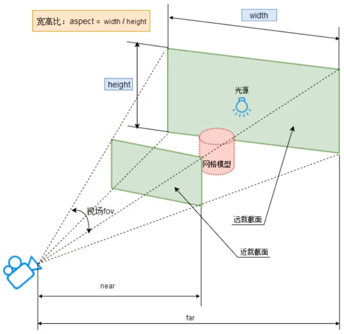
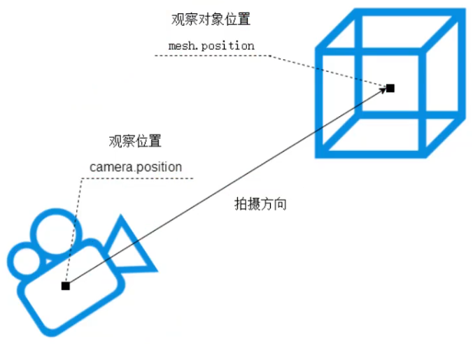
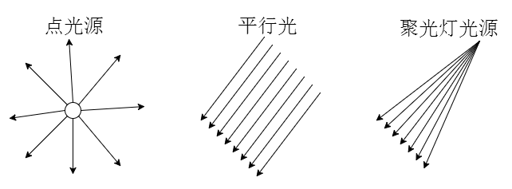
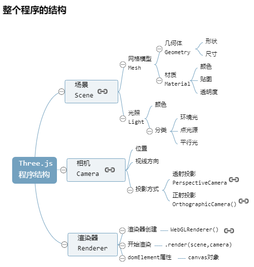

# 1. Three.js 快速入门

## 1. 引入 three.js

### 1. `script`标签方式引入 three.js

你可以像平时开发 web **前端**项目一样，把 three.js 当做一个 js 库引入你的项目。

```html
<!-- 引入 three.js -->
<script src="./three.js-dev/build/three.min.js"></script>
<!-- 引入扩展库 -->
<script src="./three.js-dev/examples/js/controls/OrbitControls.js"></script>
```

### 2. es6 的`import`方式引入

给`script`标签设置`type="module"`，也可以在 .html 文件中使用`import`方式引入 three.js。

```html
<script type="importmap">
  {
    "imports": {
      "three": "./three.js-dev/build/three.module.js"
    }
  }
</script>
<script type="module">
  // 引入 three.js
  import * as THREE from 'three'
  // 引入扩展库
  import {OrbitControls} from './three.js-dev/examples/jsm/controls/OrbitControls.js'
</script>
```

### 3. three.js 工程化开发

平时学习，为了方便可以直接在 .html 文件中引入 three.js 相关文件，不过在正式开发的时候，你可以在你的 node.js 工程文件中，通过 npm 命令安装 three.js。

安装特定版本的 three.js：

```bash
npm i three@0.143.0
```

使用：

```js
// 引入 three.js
import * as THREE from 'three'
// 引入扩展库
import {OrbitControls} from 'three/examples/jsm/controls/OrbitControls.js'
```

## 2. 第一个 3D 案例

### 1. 创建 3D 场景`Scene`

你可以将`Scene`理解为虚拟的 3D 场景，用来表示模拟生活中的真实三维场景，或者说三维世界。

```js
// 1. 创建 3D 场景对象 Scene
const scene = new THREE.Scene()
```

### 2. 给场景添加物体

你可以把网络模型`Mesh`理解为一个虚拟的物体，用来表示生活中真实的物体，比如一个箱子、一个鼠标。

```js
// 2. 给场景添加物体
const geometry = new THREE.BoxGeometry(100, 100, 100) // 创建几何体对象 Geometry
const material = new THREE.MeshBasicMaterial({ // 创建材质对象 Material
  color: 0x00ff00 // 设置材质颜色
})
const mesh = new THREE.Mesh(geometry, material) // 创建网格模型对象 Mesh
scene.add(mesh) // 将网格模型 Mesh 添加到场景中
```

### 3. 创建与设置透视投影相机

通过相机`camera`和渲染器`renderer`把虚拟的三维场景`Scene`渲染出来。

three.js 想把三维场景`Scene`呈现在 web 页面上，其实就像你生活中拍照一样，首先要有一个相机，然后还有你，你拿着相机，按一下，咔，完成拍照，获得照片。

**透视投影相机`PerspectiveCamera`**

构造器：PerspectiveCamera(fov: Number, aspect: Number, near: Number, far: Number)

- fov：视场角度
- aspect：画布宽高比
- near：近裁截面
- far：远裁截面

**近裁截面和远裁截面**

就是只能看到近裁截面和远裁截面里的东西，小于近裁截面和大于远裁截面的东西看不到，会被裁截掉



**相机位置`.position`和`.lookAt`**



```js
// width 和 height 用来设置 three.js 输出的 canvas 画布尺寸（像素 px）
const width = 800
const height = 500

// 3. 创建与设置透视投影相机
const camera = new THREE.PerspectiveCamera(45, width / height, 1, 1000) // 创建透视投影相机
camera.position.set(200, 200, 200) // 设置相机的坐标位置
camera.lookAt(0, 0, 0) // 设置相机的拍摄位置（0, 0, 0 为中心点）
```

### 4. WebGL 渲染器`WebGLRenderer`

```js
// 4. WebGL 渲染器对象 WebGLRenderer
const renderer = new THREE.WebGLRenderer() // 创建 WebGL 渲染器对象
renderer.setSize(width, height) // 设置渲染区域的尺寸（像素 px）
renderer.render(scene, camera) // 执行渲染操作
document.body.appendChild(renderer.domElement) // 执行渲染命令会输出一个 canvas 画布，也就是一个 html 元素，你可以插入到 web 页面中
```

### 5. 光照效果设置

**常见光源类型**

| 光源             | 简介   |
| ---------------- | ------ |
| AmbientLight     | 环境光 |
| PointLight       | 点光源 |
| DirectionalLight | 平行光 |
| SpotLight        | 聚光灯 |



```js
const geometry = new THREE.BoxGeometry(100, 100, 100)
// const material = new THREE.MeshBasicMaterial({ // 这种材质不受光照的影响
//   color: 0x00ffff
// })
const material = new THREE.MeshLambertMaterial({ // 改用 MeshLambertMaterial 材质
  color: 0x00ffff
})
const mesh = new THREE.Mesh(geometry, material)
scene.add(mesh)

// 添加一个环境光
const ambientLight = new THREE.AmbientLight(0xffffff, 0.5) // 第二个参数表示光照的强度
scene.add(ambientLight)

// 添加一个点光源
const pointLight = new THREE.PointLight(0xffffff, 0.5) // 第二个参数表示光照的强度
point.position.set(200, 300, 400)
scene.add(pointLight)
```

### 6. 整个程序的结构图



## 3. 相机控件-轨道控制器`OrbitControls`

平时开发调式代码，或者展示模型的时候，可以通过相机控件`OrbitControls`实现旋转缩放预览效果。

**`OrbitControls`使用**

- 旋转：拖动鼠标左键
- 缩放：滚动鼠标中键
- 平移：拖动鼠标右键

```js
// 创建轨道控制器
const controls = new OrbitControls(camera, renderer.domElement)

// 监听轨道控制器改变，如：鼠标拖动、滚动滚轮（只有在状态改变时触发）
controls.addEventListener('change', () => {
  renderer.render(scene, camera) // 执行渲染操作
})
```

# 2. 三维坐标系

three.js 描述物体的位置和尺寸，都是以三维直角坐标系为准的。

## 1. 坐标轴辅助观察

根据渲染场景尺寸范围大小，设置坐标系尺寸

```js
// 添加坐标轴辅助观察
const axesHelper = new THREE.AxesHelper(150) // 大小 150
scene.add(axesHelper)
```

设置材质半透明方便观察坐标系

```js
const material = new THREE.MeshLambertMaterial({
  color: 0x00ffff,
  transparent: true, // 开启透明
  opacity: 0.5 // 设置透明度
})
```

> three.js 坐标轴颜色 **R、G、B** 分别对应坐标系的 **x、y、z** 轴，对于 three.js 的 3D 坐标系默认 y 轴朝上。

## 2. 设置模型在坐标系中的属性

通过模型的位置、姿态和尺寸设置，加深 3D 坐标系的概念。

### 1. 不同方向尺寸

```js
// 设置几何体长宽高，也就是 xyz 三个方向的尺寸
new THREE.BoxGeometry(150, 100, 50)
```

### 2. 位置

```js
// 设置模型 mesh 的 xyz 坐标位置
mesh.position.set(100, 0, 0)
mesh.position.x = 100 // 还可以用属性来设置
```

### 3. 缩放

```js
// 设置模型 mesh 的 xyz 三个方向的缩放比
mesh.scale.set(0.5, 0.5, 0.5) // 当前设置是宽、高、长都为 0.5 倍
mesh.scale.x = 0.5 // 还可以用属性来设置
```

### 4. 旋转

```js
// 设置模型 mesh 的 xyz 三个方向的旋转角度
// Math.PI 返回圆周率，旋转 180 度，除以 4 就是 45 度
mesh.rotation.set(Math.PI / 4, 0, 0, 'XZY') // 第二个参数表示旋转顺序，当前是先旋转 x 轴，再旋转 z 轴，再旋转 y 轴
mesh.rotation.x = Math.PI / 4 // 还可以用属性来设置
mesh.rotateX(Math.PI / 4) // 可以用方法来旋转，该方法不是修改 rotation 属性，是一调用这个方法就让 mesh 旋转 45 度
```

## 3. 点光源辅助观察

```js
// 添加点光源辅助观察
const pointLightHelper = new THREE.PointLightHelper(pointLight, 10)
scene.add(pointLightHelper)
```

# 3. 动画渲染循环

three.js 可以借助 HTML5 的 API 请求动画帧`window.requestAnimationFrame`实现动画渲染。

## 1. 请求动画帧`window.requestAnimationFrame`

- 实现周期性循环执行
- 默认每秒执行 60 次，但不一定能做到，要看代码的性能

```js
let i = 0
function render() {
  i++
  console.log('执行次数', i)
  requestAnimationFrame(render) // 请求再次执行函数 render
}
render()
```

## 2. three.js 旋转动画

动画说白了就是一张张照片，连起来依次展示，这样就形成一个动画效果，只要帧率高，人的眼睛就感觉不到卡顿，是连续的视频效果。

```js
const controls = new OrbitControls(camera, renderer.domElement)
controls.enableDamping = true // 启动控制器阻尼（惯性），必须在动画循环里调用 controls.update()

// 渲染函数
function render() {
  mesh.rotateX(0.01) // 每次绕 x 轴旋转 0.01 弧度
  controls.update()
  renderer.render(scene, camera) // 执行渲染操作
  requestAnimationFrame(render) // 请求再次执行渲染函数 render，渲染下一帧
}
render()
```

## 3. 均匀旋转

在实际执行程序的时候，可能`requestAnimationFrame(render)`请求的函数并不一定能按照理想的 60FPS 频率执行，两次执行渲染函数的时间间隔也不一定相同，如果执行旋转命令的`rotateX`的时间间隔不同，旋转运动就不均匀，为了解决这个问题需要记录两次执行绘制函数的时间间隔。

使用下面的渲染函数替换原来的渲染函数即可，`rotateX()`的参数是`0.001 * t`，也意味着两次调用渲染函数执行渲染操作的间隔`t`毫秒时间内，立方体旋转了`0.001 * t`弧度，很显然立方体的角速度是`0.001`弧度每毫秒(0.0001 rad/ms = 1 rad/s = 180度/s)。CPU 和 GPU 执行一条指令时间是纳秒 ns 级，相比毫秒 ms 低了 6 个数量级，所以一般不用考虑渲染函数中几个计时语句占用的时间，除非你编写的是要精确到纳秒 ns 的级别的标准时钟程序。

```js
// 上次时间
let T0 = new Date()

// 渲染函数
function render() {
  // mesh.rotateX(0.01) // 每次绕 x 轴旋转 0.01 弧度
  // 均匀旋转
  const T1 = new Date() // 本次时间
  const t = T1 - T0 // 时间差
  T0 = T1 // 把本次时间赋值给上次时间
  mesh.rotateX(0.001 * t) // 旋转角速度：0.001 弧度每毫秒
  controls.update()
  renderer.render(scene, camera)
  requestAnimationFrame(render)
}
```

## 4. 计算两帧渲染时间**间隔**和**帧率**

```js
// 设置时钟
const clock = new THREE.Clock()

// 渲染函数
function render() {
  const spt = clock.getDelta() // 毫秒
  console.log('两帧渲染时间间隔（毫秒）', spt)
  console.log('帧率 FPS', 1000 / spt)
}
render()
```

## 5. 渲染循环和相机控件`OrbitControls`

设置了渲染循环，相机控件`OrbitControls`就不用再通过事件`change`执行`renderer.render(scene, camera)`，毕竟渲染循环一直在执行`renderer.render(scene, camera)`。

# 4. 画布尺寸和布局

three.js 渲染输出的结果就是一个 Cavnas 画布，canvas 画布也是 HTML 的元素之一，这意味着 three.js 渲染结果的布局和普通 web 前端习惯是一样的。

通过`renderer.domElement`属性可以访问 three.js 的渲染结果，也就是 HTML 的元素`canvas`画布。

## 1. 局部布局

你可以把 three.js 的渲染结果`renderer.domElement`，插入到 web 页面上任何一个元素中，只要符合你项目的布局规则即可。

html：

```html
<div id="webgl"></div>
```

css：

```css
#webgl {
  border: 1px solid red;
  margin: 100px auto 0;
  width: 900px;
  height: 600px;
}
```

js：

```js
// 将渲染结果插入到 div 中
document.querySelector('#webgl').appendChild(renderer.domElement)
```

## 2. 全屏布局

css：

```css
* {
  margin: 0;
  padding: 0;
}
```

```js
// 把 width 和 height 改成当前屏幕的宽高即可
const width = window.innerWidth
const height = window.innerHeight

// 将渲染结果插入到 body 中
document.body.appendChild(renderer.domElement)
```

# 5. 阵列立方体和相机适配体验

通过阵列一片立方体，进一步体验下透视投影相机的投影规律。

## 1. 循环添加 1 行 10 列物体

```js
// 循环添加 1 行 10 列物体
for (let i = 0; i < 10; i++) {
  const mesh = new THREE.Mesh(geometry, material)
  mesh.position.set(i * 100, 0, 0)
  scene.add(mesh)
}
```

## 2. 循环添加 10 行 10 列物体

```js
// 循环添加 10 行 10 列物体
for (let i = 0; i < 10; i++) {
  for (let j = 0; j < 10; j++) {
    const mesh = new THREE.Mesh(geometry, material)
    mesh.position.set(i * 100, 0, j * 100)
    scene.add(mesh)
  }
}
```

## 3. 相机位置拉远，可以看到更大的观察范围

```js
// camera.position.set(200, 200, 200)
camera.position.set(800, 800, 800) // 在原来相机位置基础上拉远，可以观察到更大的范围
```

## 4. 超出视锥体远裁截面的范围的会被剪裁掉

```js
// const camera = new THREE.PerspectiveCamera(45, width / height, 1, 1000)
const camera = new THREE.PerspectiveCamera(45, width / height, 1, 3000) // 超出视锥体远裁截面的范围的会被剪裁掉，不渲染，可以调整 far 参数适配
```

## 5. 改变相机观察目标

```js
// camera.lookAt(0, 0, 0)
camera.lookAt(600, 300, 600) // 改变相机观察目标点
```

注意相机控件`OrbitControls`会影响`lookAt`设置，注意手动设置`OrbitControls`的目标参数

```js
const controls = new OrbitControls(camera, renderer.domElement)
controls.enableDamping = true
controls.target.set(600, 300, 600) // target 属性在 OrbitControls.js 内部表示相机目标观察点，默认 0, 0, 0
controls.update() // update() 函数内会执行 camera.lookAt(controls.target)
```

## 6. 监听屏幕尺寸变化，更新渲染画面

```js
// 监听屏幕尺寸变化，更新渲染画面
window.addEventListener('resize', () => {
  camera.aspect = window.innerWidth / window.innerHeight // 更新摄像头
  camera.updateProjectionMatrix() // 更新摄像机的投影柜阵
  renderer.setSize(window.innerWidth, window.innerHeight) // 更新渲染器的尺寸大小
  renderer.setPixelRatio(window.devicePixelRatio) // 设置渲染器的像素比
})
```

# 6. 精灵模型和粒子系统

## 1. 精灵模型`Sprite`

精灵模型对象`Sprite`和网格模型`Mesh`一样都是模型对象，基类都是`Object3D`，关于精灵模型对象`Sprite`的方法和属性除了可以查看`Sprite`的文档，也可以查看基类`Object3D`的文档。

创建精灵模型对象`Sprite`和创建网格模型对象一样需要创建一个材质对象，不同的地方在于创建精灵模型对象不需要创建几何体对象`Geometry`，精灵模型对象本质上你可以理解为已经内部封装了一个平面矩形几何体`PlaneGeometry`，矩形精灵模型与矩形网格模型的区别在于精灵模型的矩形平面会始终平行于Canvas画布。

# 7. three.js 与前端框架结合

web 前端开发常见的框架有 Vue、React 和 Angular，不管你用哪种框架，或者说没有使用前端框架，用的是 jquery 前端库，three.js 都可以像普通的 js 库一样 npm 安装，然后 import 引入。

three.js 与前端框架结合：

第一步：通过 npm 命令行**安装**

```bash
# 安装特定版本的 three.js
npm i three@0.143.0
```

第二步：**引入** three.js

```js
// 引入 three.js
import * as THREE from 'three'
// 引入扩展库
import {OrbitControls} from 'three/examples/jsm/controls/OrbitControls.js'
```

第三步：把 three.js 渲染的结果 canvas 画布**插入**到你的 UI 组件或 body 页面中

```js
// 将渲染结果插入到 body 中
document.body.appendChild(renderer.domElement)
```

## 1. 与 Vue 结合示例

安装：

```bash
npm i three@0.143.0
```

components/threejs/index.js：

```js
import * as THREE from 'three'
import {OrbitControls} from 'three/examples/jsm/controls/OrbitControls.js'

const scene = new THREE.Scene()

const axesHelper = new THREE.AxesHelper(150)
scene.add(axesHelper)

const geometry = new THREE.BoxGeometry(50, 50, 50)
const material = new THREE.MeshLambertMaterial({
  color: 0x00ffff,
  transparent: true,
  opacity: 0.5
})
const mesh = new THREE.Mesh(geometry, material)
scene.add(mesh)

const ambientLight = new THREE.AmbientLight(0xffffff, 0.5)
scene.add(ambientLight)

const pointLight = new THREE.PointLight(0xffffff, 0.5)
pointLight.position.set(90, 140, 190)
scene.add(pointLight)

const pointLightHelper = new THREE.PointLightHelper(pointLight, 10)
scene.add(pointLightHelper)

const width = 1400
const height = 600

const camera = new THREE.PerspectiveCamera(45, width / height, 1, 3000)
camera.position.set(200, 200, 200)
camera.lookAt(0, 0, 0)

const renderer = new THREE.WebGLRenderer()
renderer.setSize(width, height)
renderer.render(scene, camera)
// document.body.appendChild(renderer.domElement)

const controls = new OrbitControls(camera, renderer.domElement)
controls.enableDamping = true
controls.target.set(0, 0, 0)
controls.update()

function render() {
  controls.update()
  renderer.render(scene, camera)
  requestAnimationFrame(render)
}
render()

window.addEventListener('resize', () => {
  camera.aspect = width / height
  camera.updateProjectionMatrix()
  renderer.setSize(width, height)
  renderer.setPixelRatio(window.devicePixelRatio)
})

export {renderer}
```

components/MyThree.vue：

```vue
<template>
  <div class="my-three" ref="webgl"></div>
</template>

<script>
import {renderer} from './threejs'

export default {
  mounted() {
    // 将渲染结果插入到 div 中
    this.$refs.webgl.appendChild(renderer.domElement)
    // 将渲染结果插入到 body 中
    // document.body.appendChild(renderer.domElement)
  }
}
</script>

<style lang="scss" scoped>
.my-three {
  width: 1400px;
}
</style>
```

App.vue：

```vue
<template>
  <div class="app-container">
    
    <MyThree/>
  </div>
</template>

<script>
import MyThree from './components/MyThree'

export default {
  components: {
    MyThree
  }
}
</script>

<style lang="scss" scoped>
.app-container {
  display: flex;
  flex-direction: column;
  justify-content: center;
  align-items: center;
}
</style>
```

## 2. Vue 前端 UI 与 3D 场景交互-改变颜色

components/threejs/index.js：

```js
// 导出 mesh
export {renderer, mesh}
```

components/MyColorControl.vue：

```vue
<template>
  <div class="my-color-control">
    <button @click="color1">红色</button>
    <button @click="color2">蓝色</button>
    <button @click="color3">紫色</button>
  </div>
</template>

<script>
import {mesh} from './threejs'

export default {
  methods: {
    color1() {
      mesh.material.color.set(0xFF69B4)
    },
    color2() {
      mesh.material.color.set(0x4444ff)
    },
    color3() {
      mesh.material.color.set(0x8A2BE2)
    }
  }
}
</script>

<style lang="scss" scoped>
.my-color-control {
  position: absolute;
  left: 50%;
  bottom: 10px;
  transform: translateX(-50%);
}
</style>
```

components/MyThree.vue：

```vue
<template>
  <div class="my-three" ref="webgl">
    <MyColorControl/>
  </div>
</template>

<script>
import MyColorControl from './MyColorControl'

export default {
  components: {
    MyColorControl
  }
}
</script>

<style lang="scss" scoped>
.my-three {
  position: relative;
}
</style>
```
