# 1. Three.js 快速入门

## 1. 引入 three.js

### 1. `script` 标签方式引入 three.js

你可以像平时开发 web **前端**项目一样，把 three.js 当做一个 js 库引入你的项目。

```html
<!-- 引入 three.js -->
<script src="./three.js-dev/build/three.min.js"></script>
<!-- 引入扩展库 -->
<script src="./three.js-dev/examples/js/controls/OrbitControls.js"></script>
```

### 2. es6 的 `import` 方式引入

给 `script` 标签设置 `type="module"`，也可以在 .html 文件中使用 `import` 方式引入 three.js。

```html
<script type="importmap">
  {
    "imports": {
      "three": "./three.js-dev/build/three.module.js"
    }
  }
</script>
<script type="module">
  // 引入 three.js
  import * as THREE from 'three'
  // 引入扩展库
  import {OrbitControls} from './three.js-dev/examples/jsm/controls/OrbitControls.js'
</script>
```

### 3. three.js 工程化开发

平时学习，为了方便可以直接在 .html 文件中引入 three.js 相关文件，不过在正式开发的时候，你可以在你的 node.js 工程文件中，通过 npm 命令安装 three.js。

安装特定版本的 three.js：

```bash
npm i three@0.143.0
```

使用：

```js
// 引入 three.js
import * as THREE from 'three'
// 引入扩展库
import {OrbitControls} from 'three/examples/jsm/controls/OrbitControls.js'
```

## 2. 第一个 3D 案例

### 1. 创建 3D 场景 `Scene`

你可以将 `Scene` 理解为虚拟的 3D 场景，用来表示模拟生活中的真实三维场景，或者说三维世界。

```js
// 1. 创建 3D 场景对象 Scene
const scene = new THREE.Scene()
```

### 2. 给场景添加物体

你可以把网络模型 `Mesh` 理解为一个虚拟的物体，用来表示生活中真实的物体，比如一个箱子、一个鼠标。

```js
// 2. 给场景添加物体
const geometry = new THREE.BoxGeometry(100, 100, 100) // 创建几何体对象 Geometry
const material = new THREE.MeshBasicMaterial({ // 创建材质对象 Material
  color: 0x00ffff // 设置材质颜色
})
const mesh = new THREE.Mesh(geometry, material) // 创建网格模型对象 Mesh
scene.add(mesh) // 将网格模型 Mesh 添加到场景中
```

### 3. 创建与设置透视投影相机

通过相机 `camera` 和渲染器 `renderer` 把虚拟的三维场景 `Scene` 渲染出来。

three.js 想把三维场景 `Scene` 呈现在 web 页面上，其实就像你生活中拍照一样，首先要有一个相机，然后还有你，你拿着相机，按一下，咔，完成拍照，获得照片。

**透视投影相机 `PerspectiveCamera`**

构造器：PerspectiveCamera(fov: Number, aspect: Number, near: Number, far: Number)

- fov：视场角度
- aspect：画布宽高比
- near：近裁截面
- far：远裁截面

**近裁截面和远裁截面**

就是只能看到近裁截面和远裁截面里的东西，小于近裁截面和大于远裁截面的东西看不到，会被裁截掉

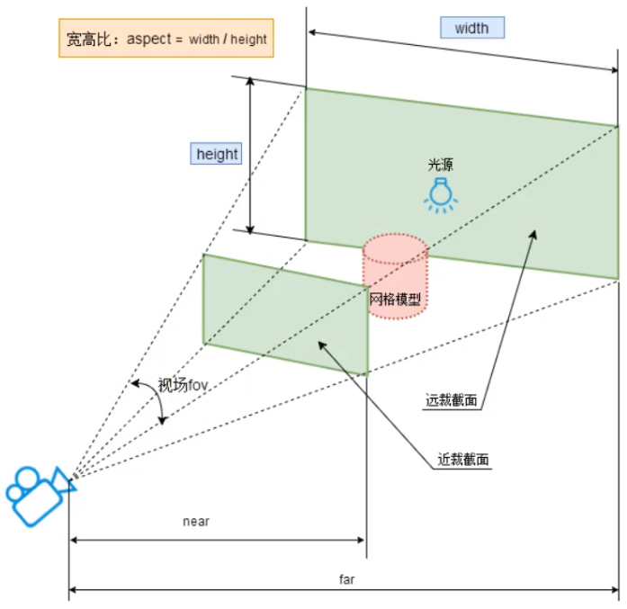

**相机位置 `.position`和`.lookAt`**

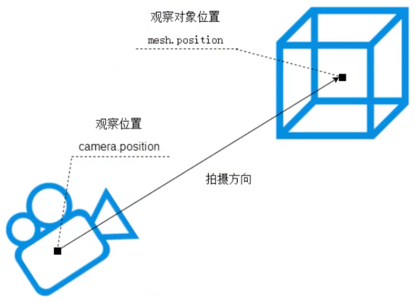

```js
// width 和 height 用来设置 three.js 输出的 canvas 画布尺寸（像素 px）
const width = 800
const height = 500

// 3. 创建与设置透视投影相机
const camera = new THREE.PerspectiveCamera(45, width / height, 1, 1000) // 创建透视投影相机
camera.position.set(200, 200, 200) // 设置相机的坐标位置
camera.lookAt(0, 0, 0) // 设置相机的拍摄位置（0, 0, 0 为中心点）
```

### 4. WebGL 渲染器 `WebGLRenderer`

效果图：


```js
// 4. WebGL 渲染器对象 WebGLRenderer
const renderer = new THREE.WebGLRenderer() // 创建 WebGL 渲染器对象
renderer.setSize(width, height) // 设置渲染区域的尺寸（像素 px）
renderer.render(scene, camera) // 执行渲染操作
document.body.appendChild(renderer.domElement) // 执行渲染命令会输出一个 canvas 画布，也就是一个 html 元素，你可以插入到 web 页面中
```

### 5. 光照效果设置

**常见光源类型**

| 光源             | 简介   |
| ---------------- | ------ |
| AmbientLight     | 环境光 |
| PointLight       | 点光源 |
| DirectionalLight | 平行光 |
| SpotLight        | 聚光灯 |


```js
const geometry = new THREE.BoxGeometry(100, 100, 100)
// const material = new THREE.MeshBasicMaterial({ // 这种材质不受光照的影响
//   color: 0x00ffff
// })
const material = new THREE.MeshLambertMaterial({ // 改用 MeshLambertMaterial 材质
  color: 0x00ffff
})
const mesh = new THREE.Mesh(geometry, material)
scene.add(mesh)

// 添加环境光
const ambientLight = new THREE.AmbientLight(0xffffff, 0.5) // 第二个参数表示光照的强度
scene.add(ambientLight)

// 添加点光源
const pointLight = new THREE.PointLight(0xffffff, 0.5) // 第二个参数表示光照的强度
pointLight.position.set(90, 140, 190)
scene.add(pointLight)

// 添加点光源辅助观察
const pointLightHelper = new THREE.PointLightHelper(pointLight, 10)
scene.add(pointLightHelper)
```

### 6. 整个程序的结构图

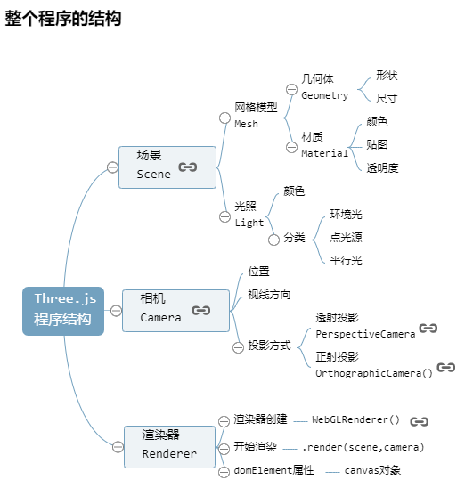

效果图：


## 3. 相机控件-轨道控制器 `OrbitControls`

平时开发调式代码，或者展示模型的时候，可以通过相机控件 `OrbitControls` 实现旋转缩放预览效果。

**`OrbitControls` 使用**

- 旋转：拖动鼠标左键
- 缩放：滚动鼠标中键
- 平移：拖动鼠标右键

```js
// 引入 three.js 扩展库 OrbitControls.js 轨道控制器
import {OrbitControls} from 'three/examples/jsm/controls/OrbitControls.js'

// 创建轨道控制器
const controls = new OrbitControls(camera, renderer.domElement)

// 监听轨道控制器改变，如：鼠标拖动、滚动滚轮（只有在状态改变时触发）
controls.addEventListener('change', () => {
  renderer.render(scene, camera) // 执行渲染操作
})
```

# 2. 三维坐标系

three.js 描述物体的位置和尺寸，都是以三维直角坐标系为准的。

## 1. 坐标轴辅助观察

根据渲染场景尺寸范围大小，设置坐标系尺寸

```js
// 添加坐标轴辅助观察
const axesHelper = new THREE.AxesHelper(150) // 大小 150
scene.add(axesHelper)
```

设置材质半透明方便观察坐标系

```js
const material = new THREE.MeshLambertMaterial({
  color: 0x00ffff,
  transparent: true, // 开启透明
  opacity: 0.5 // 设置透明度
})
```

> three.js 坐标轴颜色 **R、G、B** 分别对应坐标系的 **x、y、z** 轴，对于 three.js 的 3D 坐标系默认 y 轴朝上。

## 2. 设置模型在坐标系中的属性

通过模型的位置、姿态和尺寸设置，加深 3D 坐标系的概念。

### 1. 不同方向尺寸

```js
// 设置几何体长宽高，也就是 xyz 三个方向的尺寸
new THREE.BoxGeometry(150, 100, 50)
```

### 2. 位置

```js
// 设置模型 mesh 的 xyz 坐标位置
mesh.position.set(100, 0, 0)
mesh.position.x = 100 // 还可以用属性来设置
```

### 3. 缩放

```js
// 设置模型 mesh 的 xyz 三个方向的缩放比
mesh.scale.set(0.5, 0.5, 0.5) // 当前设置是宽、高、长都为 0.5 倍
mesh.scale.x = 0.5 // 还可以用属性来设置
```

### 4. 旋转

```js
// 设置模型 mesh 的 xyz 三个方向的旋转角度
// Math.PI 返回圆周率，旋转 180 度，除以 4 就是 45 度
mesh.rotation.set(Math.PI / 4, 0, 0, 'XZY') // 第二个参数表示旋转顺序，当前是先旋转 x 轴，再旋转 z 轴，再旋转 y 轴
mesh.rotation.x = Math.PI / 4 // 还可以用属性来设置
mesh.rotateX(Math.PI / 4) // 可以用方法来旋转，该方法不是修改 rotation 属性，是一调用这个方法就让 mesh 旋转 45 度
```

# 3. 动画渲染循环

three.js 可以借助 HTML5 的 API 请求动画帧 `window.requestAnimationFrame` 实现动画渲染。

## 1. 请求动画帧 `window.requestAnimationFrame`

- 实现周期性循环执行
- 默认每秒执行 60 次，但不一定能做到，要看代码的性能

```js
let i = 0
function render() {
  i++
  console.log('执行次数', i)
  requestAnimationFrame(render) // 请求再次执行函数 render
}
render()
```

## 2. three.js 旋转动画

动画说白了就是一张张照片，连起来依次展示，这样就形成一个动画效果，只要帧率高，人的眼睛就感觉不到卡顿，是连续的视频效果。

```js
const controls = new OrbitControls(camera, renderer.domElement)
controls.enableDamping = true // 启动控制器阻尼（惯性），必须在动画循环里调用 controls.update()

// 渲染函数
function render() {
  mesh.rotateX(0.01) // 每次绕 x 轴旋转 0.01 弧度
  controls.update()
  renderer.render(scene, camera) // 执行渲染操作
  requestAnimationFrame(render) // 请求再次执行渲染函数 render，渲染下一帧
}
render()
```

## 3. 均匀旋转

在实际执行程序的时候，可能 `requestAnimationFrame(render)` 请求的函数并不一定能按照理想的 60FPS 频率执行，两次执行渲染函数的时间间隔也不一定相同，如果执行旋转命令的 `rotateX` 的时间间隔不同，旋转运动就不均匀，为了解决这个问题需要记录两次执行绘制函数的时间间隔。

使用下面的渲染函数替换原来的渲染函数即可，`rotateX()` 的参数是 `0.001 * t`，也意味着两次调用渲染函数执行渲染操作的间隔 `t` 毫秒时间内，立方体旋转了 `0.001 * t` 弧度，很显然立方体的角速度是 `0.001` 弧度每毫秒(0.0001 rad/ms = 1 rad/s = 180度/s)。CPU 和 GPU 执行一条指令时间是纳秒 ns 级，相比毫秒 ms 低了 6 个数量级，所以一般不用考虑渲染函数中几个计时语句占用的时间，除非你编写的是要精确到纳秒 ns 的级别的标准时钟程序。

```js
// 上次时间
let T0 = new Date()

// 渲染函数
function render() {
  // mesh.rotateX(0.01) // 每次绕 x 轴旋转 0.01 弧度
  // 均匀旋转
  const T1 = new Date() // 本次时间
  const t = T1 - T0 // 时间差
  T0 = T1 // 把本次时间赋值给上次时间
  mesh.rotateX(0.001 * t) // 旋转角速度：0.001 弧度每毫秒
  controls.update()
  renderer.render(scene, camera)
  requestAnimationFrame(render)
}
```

## 4. 计算两帧渲染时间**间隔**和**帧率**

```js
// 设置时钟
const clock = new THREE.Clock()

// 渲染函数
function render() {
  const spt = clock.getDelta() // 毫秒
  console.log('两帧渲染时间间隔（毫秒）', spt)
  console.log('帧率 FPS', 1000 / spt)
}
render()
```

## 5. 渲染循环和相机控件 `OrbitControls`

设置了渲染循环，相机控件 `OrbitControls` 就不用再通过事件 `change` 执行 `renderer.render(scene, camera)`，毕竟渲染循环一直在执行 `renderer.render(scene, camera)`。

# 4. 画布尺寸和布局

three.js 渲染输出的结果就是一个 Cavnas 画布，canvas 画布也是 HTML 的元素之一，这意味着 three.js 渲染结果的布局和普通 web 前端习惯是一样的。

通过 `renderer.domElement` 属性可以访问 three.js 的渲染结果，也就是 HTML 的元素 `canvas` 画布。

## 1. 局部布局

你可以把 three.js 的渲染结果 `renderer.domElement`，插入到 web 页面上任何一个元素中，只要符合你项目的布局规则即可。

html：

```html
<div id="webgl"></div>
```

css：

```css
#webgl {
  border: 1px solid red;
  margin: 100px auto 0;
  width: 900px;
  height: 600px;
}
```

js：

```js
// 将渲染结果插入到 div 中
document.querySelector('#webgl').appendChild(renderer.domElement)
```

## 2. 全屏布局

css：

```css
* {
  margin: 0;
  padding: 0;
}
```

```js
// 把 width 和 height 改成当前屏幕的宽高即可
const width = window.innerWidth
const height = window.innerHeight

// 将渲染结果插入到 body 中
document.body.appendChild(renderer.domElement)
```

# 5. 阵列立方体和相机适配体验

通过阵列一片立方体，进一步体验下透视投影相机的投影规律。

## 1. 循环添加 1 行 10 列物体

```js
// 循环添加 1 行 10 列物体
for (let i = 0; i < 10; i++) {
  const mesh = new THREE.Mesh(geometry, material)
  mesh.position.set(i * 100, 0, 0)
  scene.add(mesh)
}
```

效果图：

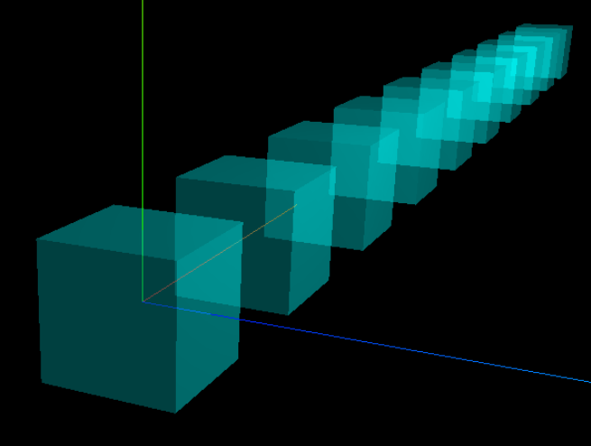

## 2. 循环添加 10 行 10 列物体

```js
// 循环添加 10 行 10 列物体
for (let i = 0; i < 10; i++) {
  for (let j = 0; j < 10; j++) {
    const mesh = new THREE.Mesh(geometry, material)
    mesh.position.set(i * 100, 0, j * 100)
    scene.add(mesh)
  }
}
```

效果图：


## 3. 相机位置拉远，可以看到更大的观察范围

```js
// camera.position.set(200, 200, 200)
camera.position.set(800, 800, 800) // 在原来相机位置基础上拉远，可以观察到更大的范围
```

效果图：


## 4. 超出视锥体远裁截面的范围的会被剪裁掉

```js
// const camera = new THREE.PerspectiveCamera(45, width / height, 1, 1000)
const camera = new THREE.PerspectiveCamera(45, width / height, 1, 3000) // 超出视锥体远裁截面的范围的会被剪裁掉，不渲染，可以调整 far 参数适配
```

## 5. 改变相机观察目标

```js
// camera.lookAt(0, 0, 0)
camera.lookAt(600, 300, 600) // 改变相机观察目标点
```

注意相机控件 `OrbitControls` 会影响 `lookAt` 设置，注意手动设置 `OrbitControls` 的目标参数

```js
const controls = new OrbitControls(camera, renderer.domElement)
controls.enableDamping = true
controls.target.set(600, 300, 600) // target 属性在 OrbitControls.js 内部表示相机目标观察点，默认 0, 0, 0
controls.update() // update() 函数内会执行 camera.lookAt(controls.target)
```

效果图：


## 6. 监听屏幕尺寸变化，更新渲染画面

```js
// 监听屏幕尺寸变化，更新渲染画面
window.addEventListener('resize', () => {
  camera.aspect = window.innerWidth / window.innerHeight // 更新摄像头
  camera.updateProjectionMatrix() // 更新摄像机的投影柜阵
  renderer.setSize(window.innerWidth, window.innerHeight) // 更新渲染器的尺寸大小
  renderer.setPixelRatio(window.devicePixelRatio) // 设置渲染器的像素比
})
```

## 7. 进入/退出全屏

```js
// 按下 Q 键进入/退出全屏
window.addEventListener('keyup', event => {
	if (event.code === 'KeyQ') {
		if (!document.fullscreenElement) renderer.domElement.requestFullscreen()
		else document.exitFullscreen()
	}
})
```

# 6. 精灵模型和粒子系统

## 1. 精灵模型 `Sprite`

精灵模型对象 `Sprite` 和网格模型 `Mesh` 一样都是模型对象，基类都是 `Object3D`，关于精灵模型对象 `Sprite` 的方法和属性除了可以查看 `Sprite` 的文档，也可以查看基类 `Object3D` 的文档。

创建精灵模型对象 `Sprite` 和创建网格模型对象一样需要创建一个材质对象，不同的地方在于创建精灵模型对象不需要创建几何体对象 `Geometry`，精灵模型对象本质上你可以理解为已经内部封装了一个平面矩形几何体 `PlaneGeometry`，矩形精灵模型与矩形网格模型的区别在于精灵模型的矩形平面会始终平行于 Canvas 画布。

## 2. `Sprite` 和 `SpriteMaterial`

通过 `Sprite` 创建精灵模型不需要几何体，只需要给构造函数 `Sprite` 的参数设置为一个精灵材质 `SpriteMaterial` 即可。

精灵材质对象 `SpriteMaterial` 和普通的网格材质一样可以设置颜色 `.color`、颜色贴图 `.map`、开启透明 `.transparent`、透明度 `.opacity` 等属性，精灵材质对象 `SpriteMaterial` 的基类是材质 `Material`。

```js
// 添加精灵模型
const map = new THREE.TextureLoader().load('./images/vue400.png')
const spriteMaterial = new THREE.SpriteMaterial({ // 创建精灵材质对象 SpriteMaterial
  color: 0xff00f, // 设置颜色
  map, // 设置纹理贴图
  rotation: Math.PI / 4 // 旋转 45 度
})
const sprite = new THREE.Sprite(spriteMaterial) // 创建精灵模型对象，不需要几何体 geometry 参数
scene.add(sprite)
sprite.position.set(50, 50, 50) // 设置坐标位置
sprite.scale.set(10, 10, 1) // 设置缩放，只需要设置 x、y 两个分量就可以
```

效果图：

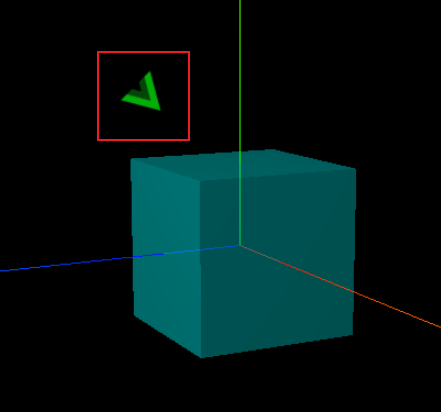

## 3. `.scale` 和 `.position`

精灵模型对象和网格模型 `Mesh` 对一样基类都是 `Object3D`，自然精灵模型也有缩放属性 `.scale` 和位置属性 `.position`，一般设置精灵模型的大小是通过 `.scale` 属性实现，而精灵模型的位置通过属性 `.position` 实现，精灵模型和普通模型一样，可以改变它在三维场景中的位置，区别在于精灵模型的正面一直平行于 Canvas 画布。

## 4. 中国城市 PM2.5 可视化案例

PM2.5.json：

```json
[
  {
    "name": "海门",
    "value": 59,
    "coordinate": [
      121.15,
      31.89
    ]
  },
  {
    "name": "青岛",
    "value": 18,
    "coordinate": [
      120.33,
      260.07
    ]
  },
  ...
]
```

js 代码：

```js
/**
 * 一个精灵模型对象表示一个城市的位置和数据
 */
const map = new THREE.TextureLoader().load('./images/react512.png') // 加载一个图片当纹理贴图
let group = new THREE.Group() // 创建组对象，包含所有精灵对象
const loader = new THREE.FileLoader().setResponseType('json') // 文件加载对象，加载 json 文件
// 加载 PM2.5 数据
loader.load('./json/PM2.5.json', data => {
  // 遍历数据
  data.forEach(item => {
    const spriteMaterial = new THREE.SpriteMaterial({
      map,
      transparent: true,
      opacity: 0.5
    })
    const sprite = new THREE.Sprite(spriteMaterial)
    group.add(sprite)
    sprite.position.set(item.coordinate[0], item.coordinate[1], 0) // 获得城市坐标设置精灵模型对象的位置
    const k = item.value / 2 // 控制精灵大小，使用 PM2.5 大小设置精灵模型的大小，注意适当缩放 pm2.5 大小，以便得到更好的显示效果
    sprite.scale.set(k, k, 1)
  })
  // 中国城市坐标整体的几何中心不在坐标原点，需要适当的平移
  group.position.set(-110, -30, 0)
  scene.add(group) // 把精灵群组插入场景中
})
```

效果图：


## 5. 模拟树林效果

下面通过通过一张背景透明的树纹理贴图 `tree512.png` 作为精灵模型的纹理贴图 `.map` 模拟一个树林效果。

```js
/**
 * 精灵创建树林效果
 */
let map = new THREE.TextureLoader().load('./images/tree512.png') // 加载树纹理贴图
// 批量创建表示一个树的精灵模型
for (let i = 0; i < 100; i++) {
  const spriteMaterial = new THREE.SpriteMaterial({
    map
  })
  const sprite = new THREE.Sprite(spriteMaterial)
  scene.add(sprite)
  const k1 = Math.random() - 0.5
  const k2 = Math.random() - 0.5
  sprite.position.set(1000 * k1, 50, 1000 * k2) // 设置精灵模型位置，在 xoz 平面上随机分布
  sprite.scale.set(100, 100, 1)
}

/**
 * 创建一个草地地面
 */
const geometry = new THREE.PlaneGeometry(1000, 1000) // 矩形平面
map = new THREE.TextureLoader().load('./images/grass700.jpeg') // 加载草地纹理贴图
// 设置纹理的重复模式
map.wrapS = THREE.RepeatWrapping
map.wrapT = THREE.RepeatWrapping
map.repeat.set(10, 10) // xy 两个方向纹理重复数量
const material = new THREE.MeshBasicMaterial({
  color: 0x777700,
  map
})
const mesh = new THREE.Mesh(geometry, material)
scene.add(mesh)
mesh.rotateX(-Math.PI / 2)
```

效果图：

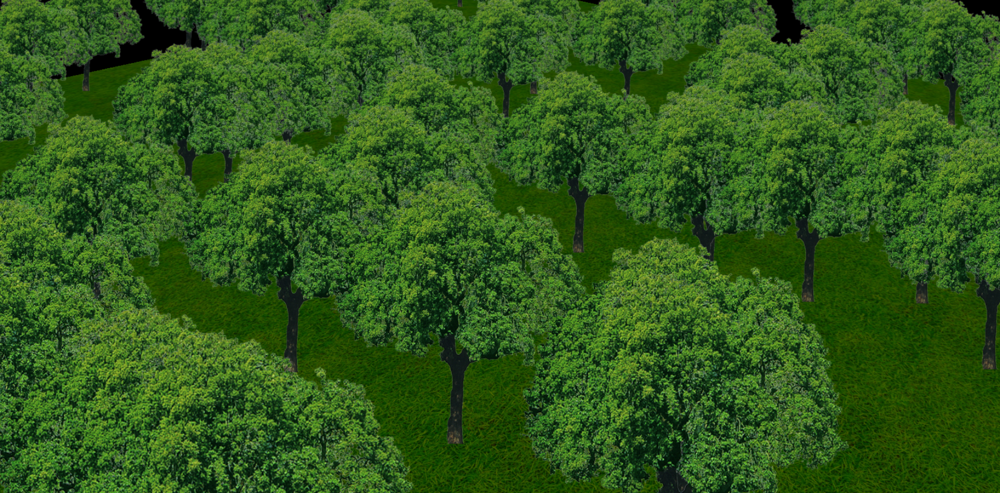

## 6. 模拟下雨效果

基本思路就是通过足够多的精灵模型构成一个粒子系统，然后每一个雨滴按照在一定空间内随机分布，每个精灵模型都使用一个背景透明的雨滴 `rain128.png` 作为纹理贴图。

```js
/**
 * 精灵创建下雨效果
 */
let map = new THREE.TextureLoader().load('./images/rain128.png') // 加载雨滴理贴图
const group = new THREE.Group() // 创建一个组表示所有的雨滴
// 批量创建表示雨滴的精灵模型
for (let i = 0; i < 400; i++) {
  const spriteMaterial = new THREE.SpriteMaterial({
    map
  })
  const sprite = new THREE.Sprite(spriteMaterial)
  const k1 = Math.random() - 0.5
  const k2 = Math.random() - 0.5
  const k3 = Math.random() - 0.5
  sprite.position.set(400 * k1, 400 * k2, 400 * k3) // 设置精灵模型位置，在整个空间上上随机分布
  sprite.scale.set(4, 4, 1)
  group.add(sprite)
}
scene.add(group)

/**
 * 创建一个草地地面
 */
const geometry = new THREE.PlaneGeometry(1000, 1000)
map = new THREE.TextureLoader().load('./images/grass700.jpeg')
map.wrapS = THREE.RepeatWrapping
map.wrapT = THREE.RepeatWrapping
map.repeat.set(10, 10)
const material = new THREE.MeshBasicMaterial({
  color: 0x777700,
  map
})
const mesh = new THREE.Mesh(geometry, material)
scene.add(mesh)
mesh.rotateX(-Math.PI / 2)
```

下落效果：

```js
function render() {
  // 每次渲染遍历雨滴群组，刷新频率 30 ~ 60FPS，两帧时间间隔 16.67ms ~ 33.33ms
  // 每次渲染都会更新雨滴的位置，进而产生动画效果
  group.children.forEach(sprite => {
    sprite.position.y -= 2 // 雨滴的 y 坐标每次减 2
    if (sprite.position.y < 0) { // 如果雨滴落到地面，重置 y，重新下落
      const k = Math.random() - 0.5
      sprite.position.y = 400 * k
    }
  })
  renderer.render(scene, camera)
  requestAnimationFrame(render)
}
```

效果图：

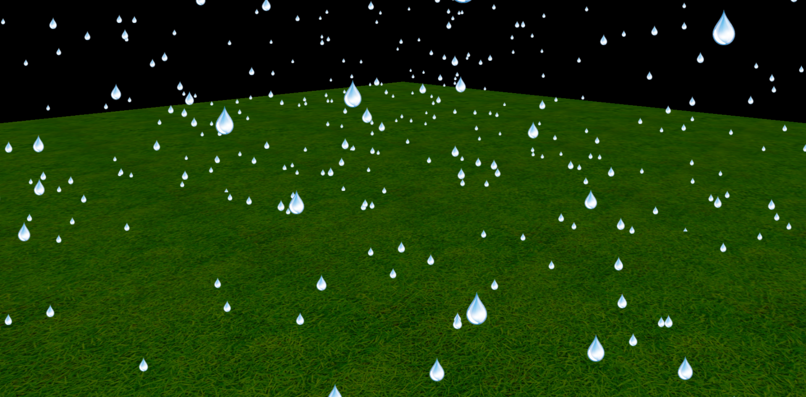

# 7. gsap 动画库

安装：

```bash
npm i gsap
```

引入：

```js
import gsap from 'gsap'
```

使用：

```js
// 控制 mesh.position
const animate1 = gsap.to(mesh.position, {
	x: 5, // 将 x 位置改成 5
	duration: 3, // 花费 3 秒
	ease: 'power1.inOut', // 速度，power1.inOut 表示先慢再快
	// repeat: 2, // 执行完后，再重复 2 次
	repeat: -1, // 重复无限次
	yoyo: true, // 往返运动
	delay: 2, // 延迟 2 秒
	onStart() { // 动画开始的回调函数
		console.log('动画开始')
	},
	onComplete() { // 动画完成的回调函数
		console.log('动画完成')
	}
})

// 控制 mesh.rotation
gsap.to(mesh.rotation, {
	x: Math.PI * 2, // 将 x 位置旋转 360 度
	duration: 2, // 花费 2 秒
	ease: 'none' // 匀速
})
```

双击暂停/开始动画：

```js
// 双击暂停/开始动画
window.addEventListener('dblclick', () => {
	if (animate1.isActive()) animate1.pause() // 如果动画正在运动，暂停动画
	else animate1.resume() // 如果动画已经暂停，恢复动画
})
```

# 8. dat.GUI

dat.GUI 是一个轻量级的图形用户界面库（GUI 组件），使用这个库可以很容易地创建出能够改变代码变量的界面组件。

安装：

```bash
npm i dat.gui
```

引入：

```js
import * as dat from 'dat.gui'
```

使用：

```js
const gui = new dat.GUI() // 创建 gui

// 修改物体的属性
gui
	.add(mesh.position, 'x') // 改变 mesh.position 对象里的 x 属性
	.min(0) // 最小 0
	.max(5) // 最大 5
	.step(0.01) // 步长 0.01
	.name('移动x轴坐标') // 设置标题名称，如果没有设置，则默认就是上面指定的 x
	.onChange(value => console.log('值被修改了', value)) // 监听值被改变，每次移动的过程中也会一直执行
	.onFinishChange(value => console.log('移动停止，值被修改了', value)) // 监听值被改变，只有停止移动后才执行

// 修改物体的颜色
gui
	.addColor({color: '#ffff00'}, 'color') // 改变第一个参数对象里的 color 属性
	.name('颜色') // 设置标题名称，如果没有设置，则默认就是上面指定的 color
	.onChange(value => { // 监听值被改变
		console.log('颜色被修改了', value)
		mesh.material.color.set(value) // 每次改变设置物体的材质颜色
	})

// 修改物体的布尔值属性
gui.add(mesh, 'visible').name('是否显示') // 改变 mesh 对象里的 visible 属性，该属性是个布尔值，用于控制物体的显示和隐藏

// 设置点击按钮执行某个函数
gui.add({ fn: () => gsap.to(mesh.position, {x: 5, duration: 3, ease: 'power1.inOut', repeat: -1, yoyo: true}) }, 'fn')

// 添加文件夹
const folder = gui.addFolder('设置立方体')
// 在文件夹里添加控制项，就像是 gui.add()
folder.add(mesh.material, 'wireframe').name('是否显示线框') // wireframe 属性表示是否显示线框
```

效果图：

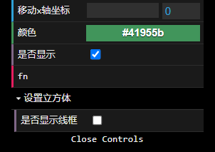

# 9. BufferGeometry

## 1. 添加一面物体

```js
const geometry = new THREE.BufferGeometry(1, 1, 1)
// 创建一个简单的矩形，在这里我们左上和右下顶点被复制了两次。
// 因为在两个三角面片里，这两个顶点都需要被用到。
const vertices = new Float32Array([
	-1.0, -1.0,  1.0,
	1.0, -1.0,  1.0,
	1.0,  1.0,  1.0,

	1.0,  1.0,  1.0,
	-1.0,  1.0,  1.0,
	-1.0, -1.0,  1.0
])
// 设置 itemSize = 3 因为每个顶点都是一个三元组
geometry.setAttribute('position', new THREE.BufferAttribute(vertices, 3))
const material = new THREE.MeshBasicMaterial({
	color: 0x00ff00
})
const mesh = new THREE.Mesh(geometry, material)
scene.add(mesh)
```

效果图：

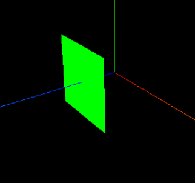

## 2. 循环添加

```js
for (let i = 0; i < 50; i++) {
	const geometry = new THREE.BufferGeometry()
	const vertices = new Float32Array(9) // 设置 Float32Array 长度为 9
	// 每一个三角形，需要 3 个顶点，每个顶点需要 3 个值
	for (let j = 0; j < 9; j++) {
		vertices[j] = Math.random() * 10 - 5 // -5 到 5
	}
	geometry.setAttribute('position', new THREE.BufferAttribute(vertices, 3))
	const color = new THREE.Color(Math.random(), Math.random(), Math.random()) // 随机颜色
	const material = new THREE.MeshBasicMaterial({
		color, // 颜色
		transparent: true, // 透明
		opacity: 0.5 // 透明度
	})
	const mesh = new THREE.Mesh(geometry, material)
	scene.add(mesh)
}
```

效果图：

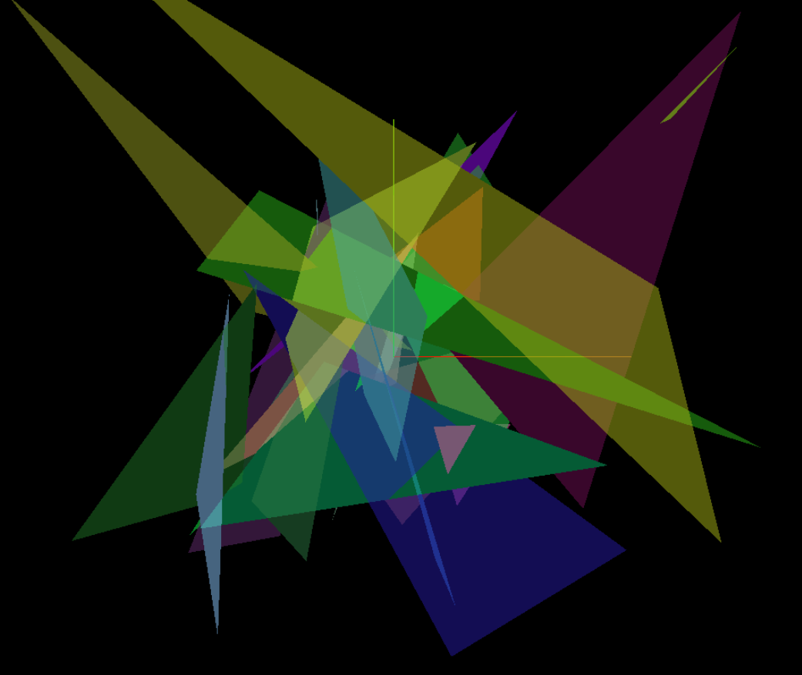

# 10. 纹理贴图

## 1. 色彩贴图

```js
const map = new THREE.TextureLoader().load('./images/door/color.jpg') // 加载纹理（就是加载图片）
const geometry = new THREE.BoxGeometry(1, 1, 1)
const material = new THREE.MeshBasicMaterial({
  map // 设置纹理贴图
})
const mesh = new THREE.Mesh(geometry, material)
scene.add(mesh)
```

效果图：

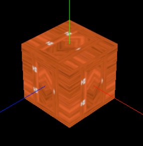

### 1. 设置偏移

```js
map.offset.set(0.2, 0.2) // 设置 x、y 轴方向的偏移
map.offset.x = 0.2 // 还可以用属性设置
```

效果图：


### 2. 设置旋转角度

```js
map.center.set(0.5, 0.5) // 设置旋转原点，当前为中心点，默认值为 (0, 0)，即左下角
map.rotation = Math.PI / 4 // 旋转 45 度
```

效果图：

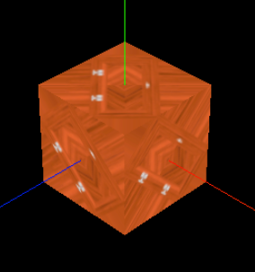

### 3. 设置纹理重复

```js
map.repeat.set(2, 3) // 设置 x、y 轴方向的重复
// 设置纹理重复模式
map.wrapS = THREE.MirroredRepeatWrapping // 垂直方向镜像重复
map.wrapT = THREE.RepeatWrapping // 水平方向普通重复
```

效果图：

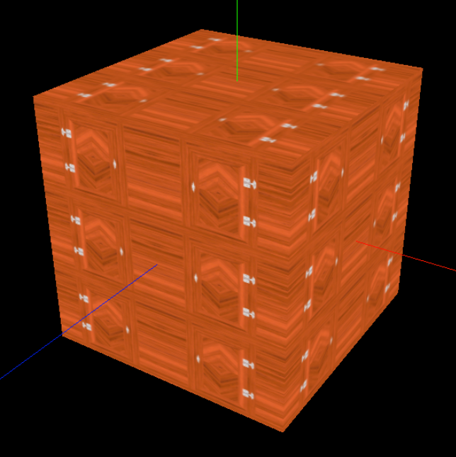

## 2. 纹理显示的算法

```js
const map = new THREE.TextureLoader().load('./images/minecraft5.jpg') // 加载一张非常小的图片

// 纹理显示设置
// 如果纹理是一张非常小的图片，放大看会很模糊，进行以下设置可以在放大后清楚的看到每个像素
map.minFilter = THREE.NearestFilter
map.magFilter = THREE.NearestFilter
```

效果图：

设置之前：


设置之后：

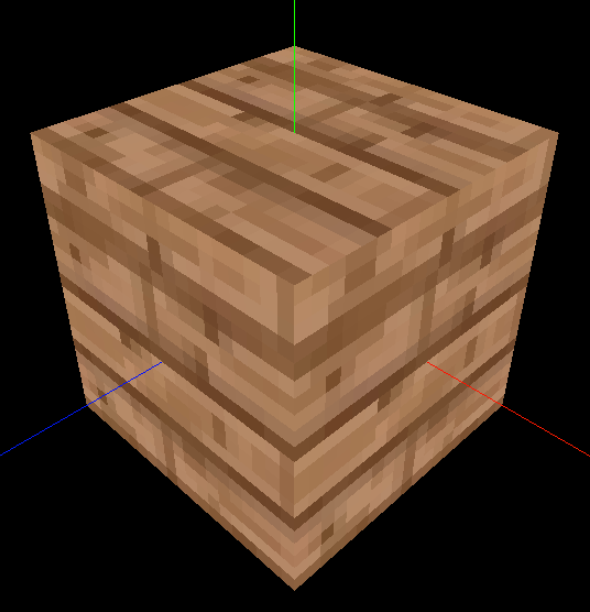

## 3. 透明纹理

```js
const textureLoader = new THREE.TextureLoader()
const map = textureLoader.load('./images/door/color.jpg')
const alpha = textureLoader.load('./images/door/alpha.jpg') // 加载一张灰度纹理贴图
const geometry = new THREE.BoxGeometry(1, 1, 1)
const material = new THREE.MeshBasicMaterial({
  map,
  transparent: true, // 允许透明
  alphaMap: alpha // 设置一张灰度纹理，用于控制整个表面的不透明度。越黑越透明，越白越不透明（黑色：完全透明，白色：完全不透明）
})
```

效果图：


## 4. AO 环境遮挡贴图

```js
const textureLoader = new THREE.TextureLoader()
const map = textureLoader.load('./images/door/color.jpg')
const ao = textureLoader.load('./images/door/ao.jpg') // 加载一张 AO 环境遮挡纹理贴图
const geometry = new THREE.BoxGeometry(1, 1, 1)
const material = new THREE.MeshBasicMaterial({
  map,
  aoMap: ao, // 设置 AO 环境遮挡贴图，白色是不遮挡，越黑越遮挡，需要第二组 UV
  aoMapIntensity: 0.8 // 环境遮挡效果的强度。默认值为 1。零是不遮挡效果。
})
const mesh = new THREE.Mesh(geometry, material)
scene.add(mesh)
geometry.setAttribute('uv2', new THREE.BufferAttribute(geometry.attributes.uv.array, 2)) // 设置第二组 uv
```

效果图：


## 5. 标准网格材质与光照物理效果

```js
const map = new THREE.TextureLoader().load('./images/door/color.jpg')
const geometry = new THREE.BoxGeometry(1, 1, 1)
const material = new THREE.MeshStandardMaterial({ // 标准网格材质 MeshStandardMaterial
  map
})
const mesh = new THREE.Mesh(geometry, material)
scene.add(mesh)

// 添加环境光
const ambientLight = new THREE.AmbientLight(0xffffff, 0.5)
scene.add(ambientLight)

// 添加平行光
const directionalLight = new THREE.DirectionalLight(0xffffff, 0.5)
directionalLight.position.set(2, 3, 4)
scene.add(directionalLight)

// 添加平行光辅助观察
const directionalLightHelper = new THREE.DirectionalLightHelper(directionalLight, 0.1)
scene.add(directionalLightHelper)
```

效果图：


## 6. 位移贴图

```js
const textureLoader = new THREE.TextureLoader()
const map = textureLoader.load('./images/door/color.jpg')
const displacement = textureLoader.load('./images/door/displacement.jpg') // 加载一张位移纹理贴图
const geometry = new THREE.BoxGeometry(1, 1, 1, 100, 100, 100) // 后三个参数是设置宽、高、长的分段数
const material = new THREE.MeshStandardMaterial({
  map,
  displacementMap: displacement, // 设置位移贴图，需要给几何体设置宽、高、长的分段数才看得出来
  displacementScale: 0.2 // 设置位移贴图对网格的影响程度（越白位移越多，黑色是无位移）。如果没有设置位移贴图，则不会应用此值。默认值为 1
})
```

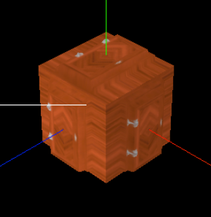

## 7. 粗糙度贴图

```js
const textureLoader = new THREE.TextureLoader()
const map = textureLoader.load('./images/door/color.jpg')
const roughness = textureLoader.load('./images/door/roughness.jpg') // 加载一张粗糙度纹理贴图
const geometry = new THREE.BoxGeometry(1, 1, 1)
const material = new THREE.MeshStandardMaterial({
  map,
  roughness: 1, // 设置材质的粗糙程度。0 表示平滑的镜面反射，1 表示完全漫反射。默认值为 1。如果还提供 roughnessMap，则两个值相乘。
  roughnessMap: roughness // 设置粗糙度贴图，越白越粗糙，越黑越平滑
})
```

效果图：

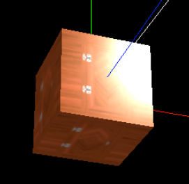

## 8. 金属度贴图

```js
const textureLoader = new THREE.TextureLoader()
const map = textureLoader.load('./images/door/color.jpg')
const roughness = textureLoader.load('./images/door/roughness.jpg')
const metalness = textureLoader.load('./images/door/metalness.jpg') // 加载一张金属度纹理贴图
const geometry = new THREE.BoxGeometry(1, 1, 1)
const material = new THREE.MeshStandardMaterial({
  map,
  roughnessMap: roughness,
  // 设置材质与金属的相似度。非金属材质，如木材或石材，使用 0，金属使用 1，通常没有中间值。默认值为 0。
  // 0 到 1 之间的值可用于生锈金属的外观。如果还提供了 metalnessMap，则两个值相乘
  metalness: 1,
  metalnessMap: metalness // 设置金属度贴图，白色是非金属，越黑越像金属
})
```

效果图：

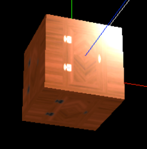

## 9. 法线贴图

```js
const textureLoader = new THREE.TextureLoader()
const map = textureLoader.load('./images/door/color.jpg')
const roughness = textureLoader.load('./images/door/roughness.jpg')
const metalness = textureLoader.load('./images/door/metalness.jpg')
const normal = textureLoader.load('./images/door/normal.jpg') // 加载一张法线度纹理贴图
const geometry = new THREE.BoxGeometry(1, 1, 1)
const material = new THREE.MeshStandardMaterial({
  map,
  roughnessMap: roughness,
  metalnessMap: metalness,
  normalMap: normal // 用于创建法线贴图的纹理。RGB 值会影响每个像素片段的曲面法线，并更改颜色照亮的方式。法线贴图不会改变曲面的实际形状，只会改变光照
})
```

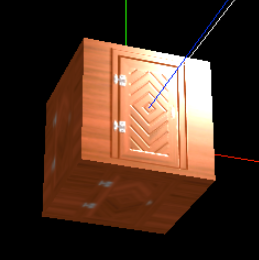

## 10. 演示从 poliigon 上下载的贴图

```js
const textureLoader = new THREE.TextureLoader()
const map = textureLoader.load('./images/MetalDesignerWeaveSteel002/MetalDesignerWeaveSteel002_COL_4K_METALNESS.jpg')
const ao = textureLoader.load('./images/MetalDesignerWeaveSteel002/MetalDesignerWeaveSteel002_AO_4K_METALNESS.jpg')
const disp = textureLoader.load('./images/MetalDesignerWeaveSteel002/MetalDesignerWeaveSteel002_DISP_4K_METALNESS.jpg')
const roughness = textureLoader.load('./images/MetalDesignerWeaveSteel002/MetalDesignerWeaveSteel002_ROUGHNESS_4K_METALNESS.jpg')
const metalness = textureLoader.load('./images/MetalDesignerWeaveSteel002/MetalDesignerWeaveSteel002_METALNESS_4K_METALNESS.jpg')
const nrm = textureLoader.load('./images/MetalDesignerWeaveSteel002/MetalDesignerWeaveSteel002_NRM_4K_METALNESS.jpg')
const geometry = new THREE.BoxGeometry(30, 30, 30, 100, 100, 100) // 正方形
const material = new THREE.MeshStandardMaterial({
  map, // 色彩贴图
  aoMap: ao, // AO 环境遮挡贴图
  displacementMap: disp, // 位移贴图
  roughnessMap: roughness, // 粗糙度贴图
  metalnessMap: metalness, // 金属度贴图
  normalMap: nrm // 法线贴图
})
const mesh = new THREE.Mesh(geometry, material)
scene.add(mesh)
geometry.setAttribute('uv2', new THREE.BufferAttribute(geometry.attributes.uv.array, 2)) // 设置第二组 uv
```

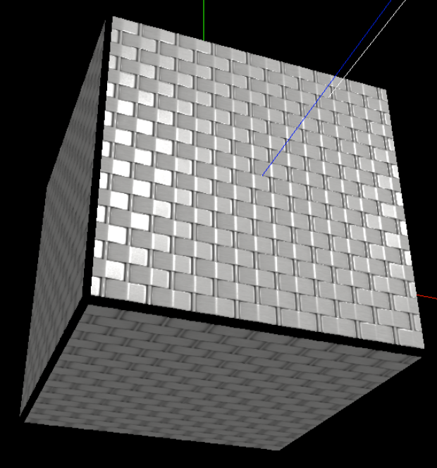

## 11. 纹理加载进度

### 1. 单张纹理的加载

```js
const map = new THREE.TextureLoader().load(
  './images/MetalDesignerWeaveSteel002/MetalDesignerWeaveSteel002_COL_4K_METALNESS.jpg',
  () => console.log('图片加载完成'), // 加载完成后执行
  () => console.log('图片加载进度'), // 好像不会执行
  error => console.log('图片加载错误', error) // 出错时执行
)
```

### 2. 多张纹理的加载

```js
const div = document.createElement('div')
div.style.position = 'fixed'
div.style.top = '0'
div.style.right = '0'
div.style.width = '200px'
div.style.color = '#fff'
document.body.appendChild(div)
const loadingManager = new THREE.LoadingManager( // 创建加载管理器
  () => console.log('图片加载完成'), // 全部加载完成后执行
  (url, num, total) => { // 每一张加载时执行
    console.log(`正在加载第 ${num} 张，共 ${total} 张，图片路径 ${url}`)
    // 显示加载进度
    const value = ((num / total) * 100).toFixed(2) + '%'
    console.log('加载进度的百分比', value)
    div.innerHTML = '图片加载进度：' + value
  },
  error => console.log('图片加载错误', error) // 出错时执行
)
const textureLoader = new THREE.TextureLoader(loadingManager) // 在构造器中传入加载管理器
const ao = textureLoader.load('./images/MetalDesignerWeaveSteel002/MetalDesignerWeaveSteel002_AO_4K_METALNESS.jpg')
const disp = textureLoader.load('./images/MetalDesignerWeaveSteel002/MetalDesignerWeaveSteel002_DISP_4K_METALNESS.jpg')
const roughness = textureLoader.load('./images/MetalDesignerWeaveSteel002/MetalDesignerWeaveSteel002_ROUGHNESS_4K_METALNESS.jpg')
const metalness = textureLoader.load('./images/MetalDesignerWeaveSteel002/MetalDesignerWeaveSteel002_METALNESS_4K_METALNESS.jpg')
const nrm = textureLoader.load('./images/MetalDesignerWeaveSteel002/MetalDesignerWeaveSteel002_NRM_4K_METALNESS.jpg')
```

## 12. 环境贴图

```js
const cubeTextureLoader = new THREE.CubeTextureLoader()
.setPath( './images/CubeTextureLoader/' ) // 设置路径前缀（可选）
.load( [
  'px.jpg', // 前
  'nx.jpg', // 后
  'py.jpg', // 上
  'ny.jpg', // 下
  'pz.jpg', // 左
  'nz.jpg' // 右
])
scene.background = cubeTextureLoader // 将环境图片甚至啊到场景背景中
scene.environment = cubeTextureLoader // 给场景所有的物体添加默认的环境贴图
const geometry = new THREE.SphereGeometry(10, 64, 32)
const material = new THREE.MeshStandardMaterial({
  roughness: 0,
  metalness: 1,
  // envMap: cubeTextureLoader // 单独设置环境贴图
})
```

效果图：


## 13. hdr 环境贴图

```js
import {RGBELoader} from 'three/examples/jsm/loaders/RGBELoader.js' // 导入 rgb 加载器

// 异步加载 hdr 环境贴图，因为比较大
new RGBELoader().loadAsync('./images/hdr/花园别墅.hdr').then(texture => {
  texture.mapping = THREE.EquirectangularReflectionMapping // 设置图像映射模式
  scene.background = texture
  scene.environment = texture
})
```

效果图：

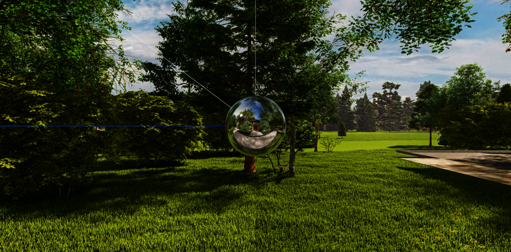

# 11. 灯光与阴影

## 1. 阴影

1. 材质要满足能够对光照有反应：

   ```js
   const material = new THREE.MeshStandardMaterial() // 1. 材质要满足能够对光照有反应
   ```

2. 设置渲染器开启场景中的阴影贴图：

   ```js
   renderer.shadowMap.enabled = true // 2. 设置渲染器开启场景中的阴影贴图
   ```

3. 设置光照投射阴影：

   ```js
   directionalLight.castShadow = true // 3. 设置光照投射阴影
   ```

4. 设置物体投射阴影：

   ```js
   sphereMesh.castShadow = true // 4. 设置物体投射阴影（球体）
   ```

5. 设置物体接收阴影：

   ```js
   planeMesh.receiveShadow = true // 5. 设置物体接收阴影（平面）
   ```

效果图：

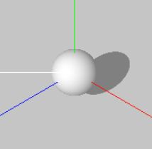

## 2. 阴影属性

```js
directionalLight.shadow.radius = 20 // 设置阴影贴图模糊度
directionalLight.shadow.mapSize.set(2048, 2048) // 设置阴影贴图的分辨率，默认值为（512, 512）

// 设置平行光投射相机的属性
directionalLight.shadow.camera.near = 0.5 // 近
directionalLight.shadow.camera.far = 500 // 远
directionalLight.shadow.camera.top = 5 // 上
directionalLight.shadow.camera.bottom = -5 // 下
directionalLight.shadow.camera.left = -5 // 左
directionalLight.shadow.camera.right = 5 // 右

scene.add(directionalLight)

// 修改 directionalLight.shadow.camera.near 属性做测试
gui
  .add(directionalLight.shadow.camera, 'near')
  .min(0)
  .max(80)
  .step(0.01)
  .name('改变近端距离')
  .onChange(() => directionalLight.shadow.camera.updateProjectionMatrix()) // 更新投影柜阵
```

## 3. 聚光灯阴影和属性

```js
const spotLight = new THREE.SpotLight( // 聚光灯 SpotLight
  0xffffff,
  0.5,
  200, // 如果非零，那么光强度将会从最大值当前灯光位置处按照距离线性衰减到 0。默认值为 0
  Math.PI / 6, // 设置照射角度，不超过 Math.PI / 2。默认值为 Math.PI / 3
  0.5, // 聚光锥的半影衰减百分比。在 0 和 1 之间的值。默认为 0
  1 // 沿着光照距离的衰减量，越远越暗，默认值为 1
)
// 修改 spotLight.distance 属性做测试（构造器中第三个参数）
gui.add(spotLight, 'distance').min(0).max(200).step(0.01)
// 修改 spotLight.angle 属性做测试（构造器中第四个参数）
gui.add(spotLight, 'angle').min(0).max(Math.PI / 2).step(0.01)
// 修改 spotLight.penumbra 属性做测试（构造器中第五个参数）
gui.add(spotLight, 'penumbra').min(0).max(1).step(0.01)
// 修改 spotLight.decay 属性做测试（构造器中第六个参数）
gui.add(spotLight, 'decay').min(0).max(5).step(0.01)

spotLight.position.set(20, 40, 60)

spotLight.target = sphereMesh // 设置照射目标
// 修改 sphereMesh.position.x 属性做测试
gui.add(sphereMesh.position, 'x').min(-50).max(50).step(0.01).onChange(() => spotLightHelper.update()) // 更新聚光灯辅助对象

spotLight.castShadow = true
spotLight.shadow.radius = 20
spotLight.shadow.mapSize.set(2048, 2048)
scene.add(spotLight)

// 添加聚光灯辅助观察
const spotLightHelper = new THREE.SpotLightHelper(spotLight)
scene.add(spotLightHelper)
```

效果图：

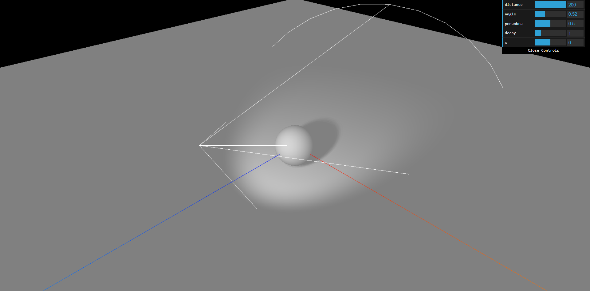

## 4. 点光源阴影和属性

```js
const pointLight = new THREE.PointLight( // 点光源 PointLight
  0xffffff,
  0.5,
  200,
  1
)
// 修改 spotLight.distance 属性做测试（构造器中第三个参数）
gui.add(pointLight, 'distance').min(0).max(200).step(0.01)
// 修改 pointLight.decay 属性做测试（构造器中第四个参数）
gui.add(pointLight, 'decay').min(0).max(5).step(0.01)

pointLight.position.set(20, 40, 60)
pointLight.castShadow = true
pointLight.shadow.radius = 20
pointLight.shadow.mapSize.set(2048, 2048)
scene.add(pointLight)

// 添加点光源辅助观察
const pointLightHelper = new THREE.PointLightHelper(pointLight, 10)
scene.add(pointLightHelper)
```

效果图：


```js
// pointLight.position.set(20, 40, 60)
pointLight.castShadow = true
pointLight.shadow.radius = 20
pointLight.shadow.mapSize.set(2048, 2048)
// scene.add(pointLight)

// 添加点光源辅助观察
// const pointLightHelper = new THREE.PointLightHelper(pointLight, 10)
// scene.add(pointLightHelper)

// 制作一个小灯泡，不用再设置点光源位置、不用将点光源添加到场景中、不用添加点光源辅助观察
const smallBall = new THREE.Mesh( // 创建一个小球
  new THREE.SphereGeometry(1, 64, 32),
  new THREE.MeshBasicMaterial()
)
smallBall.position.set(20, 40, 60)
smallBall.add(pointLight) // 将点光源添加到小球中
scene.add(smallBall)

const clock = new THREE.Clock()
function render() {
  // 让小球转起来
  const time = clock.getElapsedTime()
  smallBall.position.x = Math.sin(time) * 50 // Math.sin() 返回一个数的正弦值
  smallBall.position.z = Math.cos(time) * 50 // Math.cos() 返回一个数的余弦值
  smallBall.position.y = 40 + Math.sin(time * 5) * 10 // 上下移动

  renderer.render(scene, camera)
  requestAnimationFrame(render)
}
```

效果图：

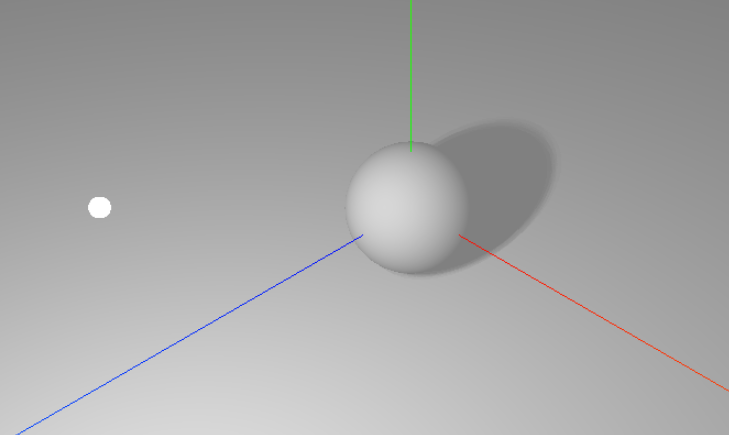


# 12. three.js 与前端框架结合

web 前端开发常见的框架有 Vue、React 和 Angular，不管你用哪种框架，或者说没有使用前端框架，用的是 jquery 前端库，three.js 都可以像普通的 js 库一样 npm 安装，然后 import 引入。

three.js 与前端框架结合：

第一步：通过 npm 命令行**安装**

```bash
# 安装特定版本的 three.js
npm i three@0.143.0
```

第二步：**引入** three.js

```js
// 引入 three.js
import * as THREE from 'three'
// 引入扩展库
import {OrbitControls} from 'three/examples/jsm/controls/OrbitControls.js'
```

第三步：把 three.js 渲染的结果 canvas 画布**插入**到你的 UI 组件或 body 页面中

```js
// 将渲染结果插入到 body 中
document.body.appendChild(renderer.domElement)
```

## 1. 与 Vue 结合示例

安装：

```bash
npm i three@0.143.0
```

components/threejs/index.js：

```js
import * as THREE from 'three'
import {OrbitControls} from 'three/examples/jsm/controls/OrbitControls.js'

const scene = new THREE.Scene()

const axesHelper = new THREE.AxesHelper(150)
scene.add(axesHelper)

const geometry = new THREE.BoxGeometry(50, 50, 50)
const material = new THREE.MeshLambertMaterial({
  color: 0x00ffff,
  transparent: true,
  opacity: 0.5
})
const mesh = new THREE.Mesh(geometry, material)
scene.add(mesh)

const ambientLight = new THREE.AmbientLight(0xffffff, 0.5)
scene.add(ambientLight)

const pointLight = new THREE.PointLight(0xffffff, 0.5)
pointLight.position.set(90, 140, 190)
scene.add(pointLight)

const pointLightHelper = new THREE.PointLightHelper(pointLight, 10)
scene.add(pointLightHelper)

const width = 1400
const height = 600

const camera = new THREE.PerspectiveCamera(45, width / height, 1, 3000)
camera.position.set(200, 200, 200)
camera.lookAt(0, 0, 0)

const renderer = new THREE.WebGLRenderer()
renderer.setSize(width, height)
renderer.render(scene, camera)
// document.body.appendChild(renderer.domElement)

const controls = new OrbitControls(camera, renderer.domElement)
controls.enableDamping = true
controls.target.set(0, 0, 0)
controls.update()

function render() {
  controls.update()
  renderer.render(scene, camera)
  requestAnimationFrame(render)
}
render()

window.addEventListener('resize', () => {
  camera.aspect = width / height
  camera.updateProjectionMatrix()
  renderer.setSize(width, height)
  renderer.setPixelRatio(window.devicePixelRatio)
})

export {renderer}
```

components/MyThree.vue：

```vue
<template>
  <div class="my-three" ref="webgl"></div>
</template>

<script>
import {renderer} from './threejs'

export default {
  mounted() {
    // 将渲染结果插入到 div 中
    this.$refs.webgl.appendChild(renderer.domElement)
    // 将渲染结果插入到 body 中
    // document.body.appendChild(renderer.domElement)
  }
}
</script>

<style lang="scss" scoped>
.my-three {
  width: 1400px;
}
</style>
```

App.vue：

```vue
<template>
  <div class="app-container">
    
    <MyThree/>
  </div>
</template>

<script>
import MyThree from './components/MyThree'

export default {
  components: {
    MyThree
  }
}
</script>

<style lang="scss" scoped>
.app-container {
  display: flex;
  flex-direction: column;
  justify-content: center;
  align-items: center;
}
</style>
```

## 2. Vue 前端 UI 与 3D 场景交互-改变颜色

components/threejs/index.js：

```js
// 导出 mesh
export {mesh, renderer}
```

components/MyColorControl.vue：

```vue
<template>
  <div class="my-color-control">
    <button @click="color1">红色</button>
    <button @click="color2">蓝色</button>
    <button @click="color3">紫色</button>
  </div>
</template>

<script>
import {mesh} from './threejs'

export default {
  methods: {
    color1() {
      mesh.material.color.set(0xFF69B4)
    },
    color2() {
      mesh.material.color.set(0x4444ff)
    },
    color3() {
      mesh.material.color.set(0x8A2BE2)
    }
  }
}
</script>

<style lang="scss" scoped>
.my-color-control {
  position: absolute;
  left: 50%;
  bottom: 10px;
  transform: translateX(-50%);
}
</style>
```

components/MyThree.vue：

```vue
<template>
  <div class="my-three" ref="webgl">
    <MyColorControl/>
  </div>
</template>

<script>
import MyColorControl from './MyColorControl'

export default {
  components: {
    MyColorControl
  }
}
</script>

<style lang="scss" scoped>
.my-three {
  position: relative;
}
</style>
```

# 13. parcel 打包工具

安装：

```bash
npm i -D parcel-bundler
```

修改 package.json 文件：

```json
{
  "scripts": {
    "dev": "parcel index.html",
    "build": "parcel build index.html"
  }
}
```

启动项目：

```bash
# 运行
npm run dev

# 构建
npm run build
```

