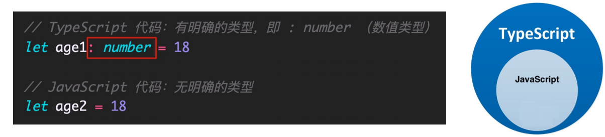
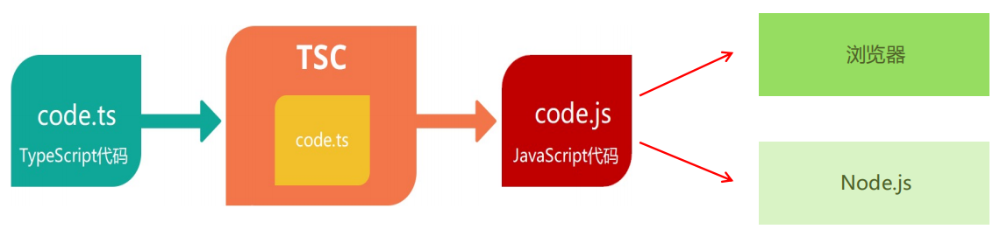
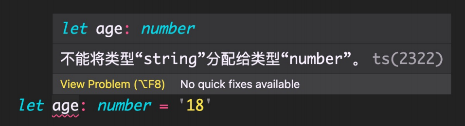
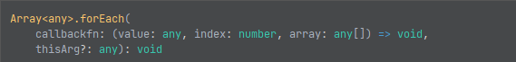
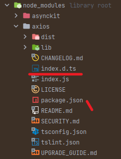
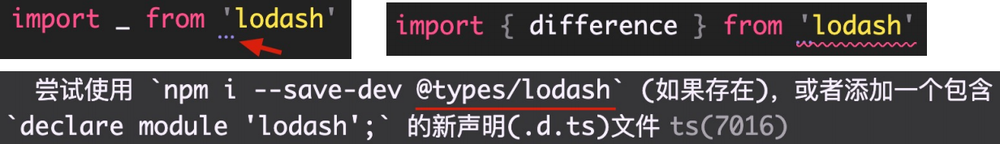
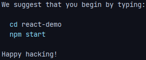
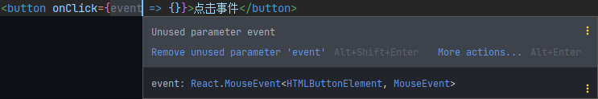

# 1. TypeScript 介绍

## 1. TypeScript 是什么

**T**ype**S**cript（简称：TS）是 JavaScript 的超集（JS 有的 TS 都有）

TypeScript = Type + JavaScript（在 JS 基础之上，为 JS 添加了类型支持）

TypeScript 是微软开发的开源编程语言，可以在任何运行 JavaScript 的地方运行



## 2. TypeScript 为什么要为 JS 添加类型支持？

背景：JS 的类型系统存在 “先天缺陷”，JS 代码中绝大部分错误都是**类型**错误（Uncaught **Type**Error）

问题：增加了找 Bug、改 Bug 的时间，严重影响开发效率

从编程语言的动静来区分，TypeScript 属于静态类型的编程语言，JS 属于动态类型的编程语言

静态类型：编译期做类型检查；动态类型：执行期做类型检查

代码编译和代码执行的顺序：1 编译 2 执行

对于 JS 来说：需要等到代码真正去**执行**的时候才能**发现错误**（晚）

对于 TS 来说：在代码**编译**的时候（代码执行前）就可以**发现错误**（早）

并且，配合 VSCode 等开发工具，TS 可以**提前到在编写代码的同时**就发现代码中的错误，**减少找 Bug、改 Bug 时间**

## 3. TypeScript 相比 JS 的优势

1. 更早（写代码的同时）发现错误，**减少找 Bug、改 Bug 时间**，提升开发效率
2. 程序中任何位置的代码都有**代码提示**，随时随地的安全感，增强了开发体验
3. 强大的**类型系统**提升了代码的可维护性，使得**重构代码更加容易**
4. 支持**最新的 ECMAScript 语法**，优先体验最新的语法，让你走在前端技术的最前沿
5. TS **类型推断**机制，**不需要**在代码中的**每个地方都显示标注类型**，让你在享受优势的同时，尽量降低了成本

除此之外，Vue 3 源码使用 TS 重写、Angular 默认支持 TS、React 与 TS 完美配合，TypeScript 已成为大中型前端项目的首先编程语言

# 2. TypeScript 初体验

## 1. 安装编译 TS 的工具包

问题：为什么要安装编译 TS 的工具包？

回答：Node.js/浏览器，只认识 JS 代码，不认识 TS 代码。需要先将 TS 代码转化为 JS 代码，然后才能运行

安装命令：

```bash
npm i -g typescript
```

typescript 包：用来编译 TS 代码的包，提供了 **tsc** 命令，实现了 TS -> JS 的转化

验证是否安装成功：tsc –v（查看 typescript 的版本）



## 2. 编译并运行 TS 代码

1. 创建 hello.ts 文件（注意：TS 文件的后缀名为 **.ts**）
2. 将 TS 编译为 JS：在终端中输入命令，`tsc hello.ts`（此时，在同级目录中会出现一个同名的 JS 文件）
3. 执行 JS 代码：在终端中输入命令，node hello.js


> 说明：所有合法的 JS 代码都是 TS 代码，有 JS 基础只需要学习 TS 的类型即可
>
> 注意：由 TS 编译生成的 **JS 文件**，代码中就**没有类型信息**了
>

## 3. 简化运行 TS 的步骤

问题描述：每次修改代码后，都要**重复执行**两个命令，才能运行 TS 代码，太繁琐

简化方式：使用 **ts-node** 包，直接在 Node.js 中执行 TS 代码

安装命令：

```bash
npm i -g ts-node
```

使用方式：

```bash
ts-node hello.ts
```

> 解释：ts-node 命令在内部偷偷的将 TS -> JS，然后，再运行 JS 代码
>

# 3. TypeScript 常用类型

**概述**

TypeScript 是 JS 的超集，TS 提供了 JS 的所有功能，并且额外的增加了：类型系统

- 所有的 JS 代码都是 TS 代码
- JS 有类型（比如，number/string 等），但是 **JS 不会检查变量的类型是否发生变化**。而 **TS 会检查**

TypeScript 类型系统的主要优势：可以**显示标记出代码中的意外行为**，从而降低了发生错误的可能性

1. 类型注解
2. 常用基础类型

## 1. 类型注解

示例代码：


说明：代码中的 **: number** 就是类型注解。

作用：为变量**添加类型约束**。比如，上述代码中，约定变量 age 的类型为 number（数值类型）

解释：**约定了什么类型，就只能给变量赋值该类型的值**，否则，就会报错



## 2. 常用基础类型概述

可以将 TS 中的常用基础类型细分为两类：1 JS 已有类型 2 TS 新增类型。

1. JS 已有类型
   - 原始类型：number/string/boolean/null/undefined/symbol
   - 对象类型：object（包括，数组、对象、函数等对象）
2. TS 新增类型
   - 联合类型、类型别名（自定义类型）、接口、元组、字面量类型、枚举、void、any 等

## 3. 原始类型

原始类型：number/string/boolean/null/undefined/symbol

特点：**简单**。这些类型，完全按照 JS 中类型的名称来书写

```typescript
let age: number = 18
let username: string = 'zhangsan'
let flag: boolean = true
let n: null = null
let u: undefined = undefined
// @ts-ignore
let s: symbol = Symbol('sss')
console.log(age, username, flag, n, u, s)
```

## 4. 数组类型

对象类型：object（包括，数组、对象、函数等对象）

特点：对象类型，在 TS 中更加细化，**每个具体的对象都有自己的类型语法**

- **数组类型**的两种写法：（推荐使用 **number[]** 写法）

```typescript
let array1: number[] = [1, 2, 3]
let array2: Array<number> = [1, 2, 3]
```

需求：数组中既有 number 类型，又有 string 类型，这个数组的类型应该如何写？

```typescript
let array3: (number | string)[] = [1, 'a', 2, 'b']
```

> 解释：|（竖线）在 TS 中叫做**联合类型**（由两个或多个其他类型组成的类型，表示可以是这些类型中的任意一种）
>
> 注意：这是 TS 中联合类型的语法，只有一根竖线，不要与 JS 中的或（||）混淆了
>

## 5. 类型别名

**类型别名**（自定义类型）：为任意类型起别名

使用场景：当同一类型（复杂）被多次使用时，可以通过类型别名，**简化该类型的使用**

```typescript
type arrayType = (number | string)[]
let array: arrayType = [1, 'a', 2, 'b']
```

> 解释：
>
> 1. 使用 **type** 关键字来创建类型别名
> 2. 类型别名（比如，此处的 arrayType），可以是任意合法的变量名称
> 3. 创建类型别名后，直接**使用该类型别名作为变量的类型注解**即可
>

## 6. 函数类型

函数的类型实际上指的是：函数**参数**和**返回值**的类型

### 1. 单独指定参数、返回值的类型

```typescript
// 函数声明
function add1(num1: number, num2: number): number {
  return num1 + num2
}

// 函数表达式（箭头函数）
const add2 = (num1: number, num2: number): number => num1 - num2
```

### 2. 同时指定参数、返回值的类型

```typescript
// 中间的 (num1: number, num2: number) => number 是指定类型的代码
const add3: (num1: number, num2: number) => number = (num1, num2) => num1 + num2
```

> 解释：当函数作为表达式时，可以通过**类似箭头函数形式的语法**来为函数添加类型
>
> 注意：这种形式只适用于函数表达式
>

### 3. 无返回值

如果函数没有返回值，那么，函数返回值类型为：void

```typescript
function output(name: string): void {
  console.log(name)
}
```

### 4. 可选参数

使用函数实现某个功能时，参数可以传也可以不传，但是在 TypeScript 中函数的参数是必须要传递的。这种情况下，在给函数参数指定类型时，就用到**可选参数**了

比如，数组的 slice 方法，可以 slice() 也可以 slice(1) 还可以 slice(1, 3)

```typescript
function mySlice(start?: number, end?: number): void {
  console.log('起始索引', start, '结束索引', end)
}
mySlice()
mySlice(1)
mySlice(1, 5)
```

> 可选参数：在可传可不传的参数名称后面添加 **?**
>
> 注意：**可选参数只能出现在参数列表的最后**，也就是说可选参数后面不能再出现必选参数
>

## 7. 对象类型

JS 中的对象是由属性和方法构成的，而 TS 中**对象的类型**就是在**描述对象的结构**（有什么类型的属性和方法）

### 1. 对象类型的写法

```typescript
const person: {name: string; age: number; sayHi(): void} = {
  name: 'zhangsan',
  age: 19,
  sayHi() {
    console.log('sayHi...')
  }
}
```

> 解释：
>
> 1. 直接使用 {} 来描述对象结构。属性采用**属性名: 类型**的形式；方法采用**方法名(): 返回值类型**的形式
> 2. 如果方法有参数，就在方法名后面的小括号中指定参数类型（比如：**output(name: string): void**）
> 3. 在一行代码中指定对象的多个属性类型时，使用 **;** 来分隔
> 4. 如果一行代码只指定一个属性类型（通过换行来分隔多个属性类型），可以去掉 **;**
> 5. 方法的类型也可以使用箭头函数形式（比如：{**sayHi: () => void**}）
>

### 2. 可选属性

对象的属性或方法，也可以是可选的，此时就用到**可选属性**了

比如，我们在使用 axios({...}) 时，如果发送 GET 请求，method 属性就可以省略

```typescript
function myAxios(config: {url: string; method?: string}): void {
  console.log(config)
}
myAxios({url: 'www.baidu.com'})
myAxios({url: 'www.baidu.com', method: 'post'})
```

**可选属性**的语法与函数可选参数的语法一致，都使用 **?** 来表示

## 8. 接口

### 1. 定义接口

当一个对象类型被多次使用时，一般会使用**接口**（**interface**）来描述对象的类型，达到**复用**的目的

解释：

1. 使用 **interface** 关键字来声明接口
2. 接口名称（比如，此处的 IPerson），可以是任意合法的变量名称
3. 声明接口后，直接**使用接口名称作为变量的类型**
4. 因为每一行只有一个属性类型，因此，属性类型后没有 **;**

```typescript
interface IPerson {name: string; age: number; sayHi(): void}

const person: IPerson = {
  name: 'zhangsan',
  age: 18,
  sayHi() {
    console.log('sayHi...')
  }
}
```

### 2. interface（接口）和 type（类型别名）的对比

- 相同点：都可以给对象指定类型
- 不同点：
  - 接口，只能为对象指定类型
  - 类型别名，不仅可以为对象指定类型，实际上可以为任意类型指定别名

### 3. 继承

如果两个接口之间有相同的属性或方法，可以**将公共的属性或方法抽离出来，通过继承来实现复用**

比如，这两个接口都有 x、y 两个属性，重复写两次，可以，但很繁琐

```typescript
interface Point2D {x: number; y: number}
interface Point3D {x: number; y: number; z: number}
```

更好的方式：

```typescript
interface Point2D {x: number; y: number}
interface Point3D extends Point2D {z: number}
```

> 解释：
>
> 1. 使用 extends（继承）关键字实现了接口 Point3D 继承 Point2D
> 2. 继承后，Point3D 就有了 Point2D 的所有属性和方法（此时，Point3D 同时有 x、y、z 三个属性）
>

## 9. 元组

场景：在地图中，使用经纬度坐标来标记位置信息

可以使用数组来记录坐标，那么，该数组中只有两个元素，并且这两个元素都是数值类型

```typescript
const position: number[] = [39.5427, 116.2317]
```

使用 number[] 的缺点：不严谨，因为该类型的数组中可以出现任意多个数字

更好的方式：**元组**（**Tuple**）

元组类型是另一种类型的数组，它**确切地知道包含多少个元素，以及特定索引对应的类型**

```typescript
const position: [number, number] = [39.5427, 116.2317]
```

> 解释：
>
> 1. 元组类型可以确切地标记出有多少个元素，以及每个元素的类型
> 2. 该示例中，元素有两个元素，每个元素的类型都是 number
>

## 10. 类型推论

在 TS 中，某些没有明确指出类型的地方，TS 的**类型推论机制会帮助提供类型**

换句话说：由于类型推论的存在，这些地方，类型注解可以**省略**不写！

发生类型推论的 2 种常见场景：

1. 声明变量并初始化时

   ```typescript
   let age = 18 // TS 自动推断出变量 age 为 number 类型
   ```

2. 决定函数返回值时

   ```typescript
   function add(num1: number, num2: number) { // TS 自动推断出函数 add 的返回值为 number 类型
     return num1 + num2
   }
   ```

> 注意：这两种情况下，类型注解可以省略不写！ 
>
> 推荐：**能省略类型注解的地方就省略**（偷懒，充分利用 TS 类型推论的能力，提升开发效率）
>
> 技巧：如果不知道类型，可以通过鼠标放在变量名称上，利用 VSCode 或 WebStorm 的提示来查看类型
>

## 11. 类型断言

有时候你会比 TS 更加明确一个值的类型，此时，可以使用类型断言来指定更具体的类型

比如：

```tsx
<a href="https://www.baidu.com/" id="link">链接</a>
const aLink = document.getElementById('link')
```

> 注意：getElementById 方法返回值的类型是 HTMLElement，该类型只包含所有标签公共的属性或方法，不包含 a 标签特有的 href 等属性
>
> 因此，这个**类型太宽泛（不具体）**，无法操作 href 等 a 标签特有的属性或方法
>
> 解决方式：这种情况下就需要**使用类型断言指定更加具体的类型**
>

**使用类型断言：**

```typescript
const aLink = document.getElementById('link') as HTMLAnchorElement
```

> 解释：
>
> 1. 使用 **as** 关键字实现类型断言
> 2. 关键字 as 后面的类型是一个更加具体的类型（HTMLAnchorElement 是 HTMLElement 的子类型）
> 3. 通过类型断言，aLink 的类型变得更加具体，这样就可以访问 a 标签特有的属性或方法了
>

另一种语法，使用 <> 语法，这种语法形式不常用知道即可：

```typescript
const aLink2 = <HTMLAnchorElement>document.getElementById('link')
```

技巧：在浏览器控制台，通过 console.dir() 打印 DOM 元素，在属性列表的最后面，即可看到该元素的类型


## 12. 字面量类型

思考以下代码，两个变量的类型分别是什么？

```typescript
let str1 = 'Hello TS'
const str2 = 'Hello TS'
```

通过 TS 类型推论机制，可以得到答案：

1. 变量 str1 的类型为：**string**
2. 变量 str2 的类型为：**'Hello TS'**

> 解释：
>
> 1. str1 是一个变量（let），它的值可以是任意字符串，所以类型为：**string**
> 2. str2 是一个常量（const），它的值不能变化只能是 'Hello TS'，所以，它的类型为：**'Hello TS'**
>
> 注意：此处的 **'Hello TS'**，就是一个**字面量类型**。也就是说**某个特定的字符串也可以作为 TS 中的类型**。除字符串外，任意的 JS 字面量（比如，对象、数字等）都可以作为类型使用。
>

**定义字面量类型**

使用模式：**字面量类型配合联合类型一起使用**

使用场景：用来**表示一组明确的可选值列表**

比如，在贪吃蛇游戏中，游戏的方向的可选值只能是上、下、左、右中的任意一个：

```typescript
function changeDirection(direction: 'up' | 'down' | 'left' | 'right') {
  console.log(direction)
}

changeDirection('up')
changeDirection('down')
changeDirection('left')
changeDirection('right')
```

> 解释：参数 direction 的值只能是 up/down/left/right 中的任意一个。
>
> 优势：相比于 string 类型，使用字面量类型更加精确、严谨。
>

## 13. 枚举

### 1. 定义枚举

枚举的功能类似于字面量类型+联合类型组合的功能，也可以**表示一组明确的可选值**。

**枚举：定义一组命名常量**。它描述一个值，该值可以是这些命名常量中的一个。

```typescript
enum Direction {Up, Down, Left, Right}

function changeDirection(direction: Direction) {
  console.log(direction)
}
```

> 解释：
>
> 1. 使用 **enum** 关键字定义枚举
> 2. 约定枚举名称、枚举中的值以大写字母开头
> 3. 枚举中的多个值之间通过 **,** 分隔
> 4. 定义好枚举后，直接使用枚举名称作为类型注解
>

### 2. 访问枚举成员

注意：形参 direction 的**类型为枚举 Direction**，那么，**实参的值就应该是枚举 Direction 成员的任意一个**。

**访问枚举成员**：

```typescript
changeDirection(Direction.Up)
changeDirection(Direction.Down)
changeDirection(Direction.Left)
changeDirection(Direction.Right)
```

解释：类似于 JS 中的对象，直接通过 **.** 语法访问枚举的成员

### 3. 枚举成员的值

问题：我们把枚举成员作为了函数的实参，它的值是什么呢？

解释：通过将鼠标移入 Direction.Up，可以看到枚举成员 Up 的值为 0

注意：**枚举成员是有值的**，默认为：**从 0 开始自增的数值**

我们把枚举成员的值为数字的枚举，称为：**数字枚举**

当然，也可以给枚举中的成员初始化值：

```typescript
// Up = 10, Down = 11, Left = 12, Right = 13
enum Direction {Up = 10, Down, Left, Right}

enum Direction {Up = 2, Down = 4, Left = 6, Right = 8}
```

### 4. 字符串枚举

**字符串枚举**：枚举成员的值是字符串

```typescript
enum Direction {Up = 'up', Down = 'down', Left = 'left', Right = 'right'}
```

注意：字符串枚举没有自增长行为，因此，**字符串枚举的每个成员必须有初始值**

### 5. 枚举被编译后的 JS 代码

枚举是 TS 为数不多的非 JavaScript 类型级扩展（不仅仅是类型）的特性之一。 

因为：其他类型仅仅被当做类型，而**枚举不仅用作类型，还提供值**（枚举成员都是有值的）。

也就是说，其他的类型会在编译为 JS 代码时自动移除。但是，**枚举类型会被编译为 JS 代码**！

ts 代码：

```typescript
enum Direction {Up = 'up', Down = 'down', Left = 'left', Right = 'right'}
```

js 代码：

```js
var Direction;
(function (Direction) {
    Direction["Up"] = "up";
    Direction["Down"] = "down";
    Direction["Left"] = "left";
    Direction["Right"] = "right";
})(Direction || (Direction = {}));
```

说明：枚举与前面讲到的字面量类型 + 联合类型组合的功能类似，都用来表示一组明确的可选值列表。

一般情况下，**推荐使用字面量类型 + 联合类型组合的方式**，因为相比枚举，这种方式更加直观、简洁、高效。

## 14. any 类型

原则：**不推荐使用 any**！这会让 TypeScript 变为 “AnyScript”（失去 TS 类型保护的优势）。

因为当值的类型为 any 时，可以对该值进行任意操作，并且不会有代码提示。

```typescript
let obj: any

obj = {x: 0, y: 0}
obj.bar = 100
obj()
const n: number = obj
```

> 解释：以上操作都不会有任何类型错误提示，即使可能存在错误！
>
> 尽可能的避免使用 any 类型，除**非临时使用 any** 来 “避免” 书写很长、很复杂的类型！
>
> 其他隐式具有 any 类型的情况：1 声明变量不提供类型也不提供默认值 2 函数参数不加类型。
>
> 注意：因为不推荐使用 any，所以，这两种情况下都应该提供类型！
>

## 15. typeof

众所周知，JS 中提供了 typeof 操作符，用来在 JS 中获取数据的类型。

```js
console.log(typeof 'Hello World') // 输出 string
```

实际上，**TS 也提供了 typeof 操作符**：可以在**类型上下文**中引用变量或属性的类型（类型查询）。

使用场景：根据已有变量的值，获取该值的类型，来简化类型书写。

```typescript
const p = {x: 1, y: 2}

// 相当于：point: {x: number; y: number}
function formatPoint(point: typeof p) {
  console.log(point)
}

formatPoint(p)
```

> 解释：
>
> 1. 使用 **typeof** 操作符来获取变量 p 的类型，结果与第一种（对象字面量形式的类型）相同
> 2. typeof 出现在**类型注解的位置**（参数名称的冒号后面）**所处的环境就在类型上下文**（区别于 JS 代码）
> 3. 注意：typeof 只能用来查询变量或属性的类型，无法查询其他形式的类型（比如，函数调用的类型）
>

# 4. TypeScript 高级类型

**概述**

TS 中的高级类型有很多，重点学习以下高级类型：

1. class 类
2. 类型兼容性
3. 交叉类型
4. 泛型和 keyof
5. 索引签名类型和索引查询类型
6. 映射类型

## 1. class 类

TypeScript 全面支持 ES2015 中引入的 **class** 关键字，并为其添加了类型注解和其他语法（比如，可见性修饰符等）。

```typescript
class Person {}

// 类型：Person
const p = new Person()
```

> 解释：
>
> 1. 根据 TS 中的类型推论，可以知道 Person 类的实例对象 p 的类型是 Person
> 2. TS 中的 **class，不仅提供了 class 的语法功能，也作为一种类型存在**
>

### 1. 实例属性初始化

```typescript
class Person {
	age: number
  // 类型：string
  gender: '男'
}
```

> 解释：
>
> 1. 声明成员 age，类型为 number（没有初始值）
> 2. 声明成员 gender，并设置初始值，此时，可省略类型注解（TS 类型推论 为 string 类型）

### 2. 构造函数

```typescript
class Person {
  name: string
  age: number

  constructor(name: string, age: number) {
    this.name = name
    this.age = age
  }
}
```

> 解释：
>
> 1. 成员初始化（比如，age: number）后，才可以通过 this.age 来访问实例成员
> 2. 需要为构造函数指定类型注解，否则会被隐式推断为 any；构造函数不需要返回值类型

### 3. 实例方法

```typescript
class Person {
  name: string
  age: number

  getInfo() {
    console.log(this.name, this.age, this.gender)
  }
}
```

解释：方法的类型注解（参数和返回值）与函数用法相同

### 4. extends（继承父类）

```typescript
class Animal {
  move() {
    console.log('Moving along!')
  }
}

class Dog extends Animal {
  bark() {
    console.log('汪！')
  }
}

const dog = new Dog()
dog.bark()
dog.move() // 调用父类的方法
```

> 解释：
>
> 1. 通过 extends 关键字实现继承
> 2. 子类 Dog 继承父类 Animal，则 Dog 的实例对象 dog 就同时具有了父类 Animal 和 子类 Dog 的所有属性和方法

### 5. implements（实现接口）

说明：JS 中只有 extends，而 implements 是 TS 提供的。

```typescript
interface Singable {
  sing(): void
}

class Person2 implements Singable {
  sing() {
    console.log('窗外的麻雀在电线杆上裸睡')
  }
}
```

> 解释：
>
> 1. 通过 implements 关键字让 class 实现接口
> 2. Person 类实现接口 Singable 意味着，Person 类中必须提供 Singable 接口中指定的所有方法和属性

### 6. 类成员可见性

可以使用 TS 来**控制 class 的方法或属性对于 class 外的代码是否可见**。

#### 1. public

public：表示公有的、公开的，**公有成员可以被任何地方访问**，默认可见性

```typescript
class Person {
  public sing() {
    console.log('你说这一句 很有夏天的感觉')
  }
}
```

> 解释：
>
> 1. 在类属性或方法前面添加 **public** 关键字，来修饰该属性或方法是共有的
> 2. 因为 **public** 是默认可见性，所以，**可以直接省略**

#### 2. protected

protected：表示**受保护的**，仅对其声明所在类和子类中（非实例对象）可见

```typescript
class Animal {
  protected move() {
    console.log('Moving along!')
  }
}

class Dog extends Animal {
  bark() {
    console.log('汪！')
    this.move()
  }
}

const dog = new Dog()
dog.bark()
// dog.move() 访问不到
```

> 解释：
>
> 1. 在类属性或方法前面添加 **protected** 关键字，来修饰该属性或方法是受保护的
> 2. 在子类的方法内部可以通过 this 来访问父类中受保护的成员，但是，**对实例不可见**！

#### 3. private

表示**私有的，只在当前类中可见**，对实例对象以及子类也是不可见的

```typescript
class Animal {
  private move() {
    console.log('Moving along!')
  }

  walk() {
    this.move()
  }
}

class Dog extends Animal {
  bark() {
    console.log('汪！')
    // this.move() // 访问不到
  }
}

const dog = new Dog()
dog.bark()
dog.walk()
```

> 解释：
>
> 1. 在类属性或方法前面添加 **private** 关键字，来修饰该属性或方法是私有的
> 2. 私有的属性或方法只在当前类中可见，对子类和实例对象也都是不可见的！

#### 4. readonly

除了可见性修饰符之外，还有一个常见修饰符就是：**readonly（只读修饰符）**。

**readonly**：表示**只读，用来防止在构造函数之外对属性进行赋值**。

```typescript
class Person4 {
  readonly age: number = 18

  constructor(age: number) {
    this.age = age
  }
}

const person4 = new Person4(20)
// person4.age = 22 // 不能赋值
console.log(person4.age)
```

> 解释：
>
> 1. 使用 **readonly** 关键字修饰该属性是只读的，注意**只能修饰属性不能修饰方法**
> 2. 注意：属性 age 后面的类型注解（比如，此处的 number）如果不加，则 age 的类型为 18（字面量类型）
> 3. **接口或者 {} 表示的对象类型，也可以使用 readonly**

## 2. 类型兼容性

### 1. class 类型兼容性

两种类型系统：1.Structural Type System（结构化类型系统） 2.Nominal Type System（标明类型系统）。

**TS 采用的是结构化类型系统**，也叫做 duck typing（鸭子类型），**类型检查关注的是值所具有的形状**。

也就是说，在结构类型系统中，如果两个对象具有相同的形状，则认为它们属于同一类型。

```typescript
class Point {x: number = 0; y: number = 0}
class Point2D {x: number = 0; y: number = 0}
// Point 和 Point2D 类型一样
const p: Point = new Point2D()
```

> 解释：
>
> 1. Point 和 Point2D 是两个名称不同的类
> 2. 变量 p 的类型被显示标注为 Point 类型，但是，它的值却是 Point2D 的实例，并且没有类型错误
> 3. 因为 TS 是结构化类型系统，只检查 Point 和 Point2D 的结构是否相同（相同，都具有 x 和 y 两个属性，属性类型也相同）
> 4. 但是，如果在 Nominal Type System 中（比如，C#、Java 等），它们是不同的类，类型无法兼容

**成员多的可以赋值给少的**

注意：在结构化类型系统中，如果两个对象具有相同的形状，则认为它们属于同一类型，这种说法并不准确。

更准确的说法：**对于对象类型来说，y 的成员至少与 x 相同，则 x 兼容 y（成员多的可以赋值给少的）**。

```typescript
class Point {x: number = 0; y: number = 0}
class Point3D {x: number = 0; y: number = 0; z: number = 0}
// 成员多的可以赋值给少的
const p: Point = new Point3D()
```

> 解释：
>
> 1. Point3D 的成员**至少**与 Point 相同，则 Point 兼容 Point3D
> 2. 所以，成员多的 Point3D 可以赋值给成员少的 Point

### 2. 接口兼容性

**接口之间的兼容性，类似于 class**。并且，class 和 interface 之间也可以兼容。

```typescript
interface IPoint {x: number; y: number}
interface IPoint2D {x: number; y: number}
interface IPoint3D {x: number; y: number; z: number}
let p1: IPoint = {x: 0, y: 0}
let p2: IPoint2D = p1
let p3: IPoint3D = {x: 0, y: 0, z: 0}
p2 = p3

// class 和 interface 之间兼容
class Point3D {x: number = 0; y: number = 0; z: number = 0}
const p4: IPoint2D = new Point3D()
```

### 3. 函数兼容性

**函数之间兼容性比较复杂**，需要考虑：1.参数个数 2.参数类型 3.返回值类型。

#### 1. 参数个数

参数多的兼容参数少的（或者说，**参数少的可以赋值给多的**）

```typescript
type F1 = (a: number) => void
type F2 = (a: number, b: number) => void
let f1: F1 = () => {}
// 参数少的可以赋值给多的
let f2: F2 = f1

const arr = ['a', 'b', 'c']
// 类型：(item: string, index: number, array: string[]) => void
arr.forEach((item, index, array) => console.log(item, index, array))
```

> 解释：
>
> 1. 参数少的可以赋值给参数多的，所以，f1 可以赋值给 f2
> 2. 数组 forEach 方法的第一个参数是回调函数，该示例中类型为：(item: string, index: number, array: string[]) => void
> 3. **在 JS 中省略用不到的函数参数实际上是很常见的，这样的使用方式，促成了 TS 中函数类型之间的兼容性**
> 4. 并且因为回调函数是有类型的，所以，TS 会自动推导出参数 item、index、array 的类型

#### 2. 参数类型

相同位置的参数类型要相同（原始类型）或兼容（对象类型）

```typescript
type F3 = (a: number) => string
type F4 = (a: number) => string
let f3: F3 = () => ''
let f4: F4 = f3
```

> 解释：函数类型 F2 兼容函数类型 F1，因为 F1 和 F2 的参数类型相同

```typescript
interface IPoint2D {x: number; y: number}
interface IPoint3D {x: number; y: number; z: number}
type F2 = (p: Point2D) => void
type F3 = (p: Point3D) => void
let f2: F2 = () => {}
let f3: F3 = f2 // 属性多的可以赋给属性少的
f2 = f3 // 报错，属性少的不可以赋给属性多的
```

> 解释：
>
> 1. 注意，此处与前面讲到的接口兼容性冲突
> 2. 技巧：**将对象拆开，把每个属性看做一个个参数**，则，参数少的（f2）可以赋值给参数多的（f3）

#### 3. 返回值类型

只关注返回值类型本身即可

```typescript
// 返回值类型是原始类型
type F7 = () => string
type F8 = () => string
let f7: F7 = () => ''
let f8: F8 = f7 // 两个类型要相同

// 返回值类型是对象类型
type F9 = () => {name: string}
type F10 = () => {name: string; age: number}
let f9: F9
let f10: F10 = () => ({name: '', age: 0})
f9 = f10 // 成员多的可以赋值给成员少的
```

> 解释：
>
> 1. 如果返回值类型是原始类型，此时两个类型要相同，比如，左侧类型 F7 和 F8
> 2. 如果返回值类型是对象类型，此时成员多的可以赋值给成员少的，比如，右侧类型 F9 和 F10

## 3. 交叉类型

**交叉类型**（**&**）：功能类似于接口继承（extends），**用于组合多个类型为一个类型（常用于对象类型）**。

比如：

```typescript
interface Person {name: string}
interface Contact {phone: string}
type PersonDetail = Person & Contact
let obj: PersonDetail = {name: 'jack', phone: '13200000000'}
```

> 解释：使用交叉类型后，新的类型 PersonDetail 就**同时具备**了 Person 和 Contact 的所有属性类型

相当于：

```typescript
type PersonDetail = {name: string; phone: string}
```

**交叉类型（&）和接口继承（extends）的对比**

- 相同点：都可以实现对象类型的组合
- 不同点：两种方式实现类型组合时，对于同名属性之间，**处理类型冲突的方式不同**

```typescript
// 接口继承（extends）
interface A {fn: (value: number) => string}
interface B extends A {fn: (value: string) => string} // 报错，value 的类型不同，继承不了

// 交叉类型（&）
interface A {fn: (value: number) => string}
interface B {fn: (value: string) => string}
type C = A & B
```

说明：以上代码，接口继承会报错（类型不兼容）；交叉类型没有错误，可以简单的理解为：

```typescript
fn: (value: number | string) => string
```

## 4. 泛型

### 1. 简介：

**泛型**是可以在**保证类型安全**前提下，让函数等**与多种类型一起工作**，从而**实现复用**，常用于：**函数、接口、class** 中。

需求：创建一个 id 函数，传入什么数据就返回该数据本身（也就是说，参数和返回值类型相同）。

```typescript
function id(value: number): number {
  return value
}
```

比如，id(10) 调用以上函数就会直接返回 10 本身。但是，该函数只接收数值类型，无法用于其他类型。

为了能让函数能够接受任意类型，可以将参数类型修改为 any。但是，这样就失去了 TS 的类型保护，类型不安全。

```typescript
function id(value: any): any {
  return value
}
```

**泛型**在**保证类型安全**（不丢失类型信息）的同时，可以**让函数等与多种不同的类型一起工作**，灵活可**复用**。

实际上，在 C# 和 Java 等编程语言中，泛型都是用来实现可复用组件功能的主要工具之一。

### 2. 创建泛型函数

```typescript
function id<T>(value: T): T {
  return value
}
```

> 解释：
>
> 1. 语法：在函数名称的后面添加 **<>**（尖括号），**尖括号中添加类型变量**，比如此处的 T
> 2. **类型变量** T，**是一种特殊类型的变量，它处理类型**而不是值
> 3. 该类型变量相当于一个类型容器，能够捕获用户提供的类型（具体是什么类型由用户调用该函数时指定）
> 4. 因为 T 是类型，因此可以将其作为函数参数和返回值的类型，表示参数和返回值具有相同的类型
> 5. 类型变量 T，可以是任意合法的变量名称

### 3. 调用泛型函数

```typescript
const num = id<number>(1)
const str = id<string>('a')
const obj = id<object>({name: 'zhangsan'})
```

> 解释：
>
> 1. 语法：在函数名称的后面添加 **<>**（尖括号），**尖括号中指定具体的类型**，比如，此处的 number
> 2. 当传入类型 number 后，这个类型就会被函数声明时指定的类型变量 T 捕获到
> 3. 此时，T 的类型就是 number，所以，函数 id 参数和返回值的类型也都是 number

同样，如果传入类型 string，函数 id 参数和返回值的类型就都是 string。

这样，通过**泛型**就做到了让 id 函数与多种不同的类型一起工作，**实现了复用的同时保证了类型安全**。

### 4. 简化调用泛型函数

```typescript
const num = id(10) // 根据参数推断，类型为：id: 10（字面量类型）
```

> 解释：
>
> 1. 在调用泛型函数时，**可以省略 <类型> 来简化泛型函数的调用**
> 2. 此时，TS 内部会采用一种叫做**类型参数推断**的机制，来根据传入的实参自动推断出类型变量 T 的类型
> 3. 比如，传入实参 10，TS 会自动推断出变量 num 的类型 10（字面量类型），并作为 T 的类型

推荐：使用这种简化的方式调用泛型函数，使代码更短，更易于阅读。

说明：当编译器无法推断类型或者推断的类型不准确时，就需要显式地传入类型参数。

### 5. 泛型约束

默认情况下，泛型函数的类型变量 T 可以代表多个类型，这导致无法访问任何属性。

比如，id('a') 调用函数时获取参数的长度：

```typescript
function id<T>(value: T): T {
  console.log(value.length) // 报错
  return value
}
```

> 解释：T 可以代表任意类型，无法保证一定存在 length 属性，比如 number 类型就没有 length
>
> 此时，就需要为泛型添加约束来**收缩类型**（缩窄类型取值范围）

添加泛型约束收缩类型，主要有以下两种方式：1.指定更加具体的类型 2.添加约束。

#### 1. 指定更加具体的类型

```typescript
function id<T>(value: T[]): T[] {
  console.log(value.length)
  return value
}

id2([1, 2, 3])
```

> 比如，将类型修改为 T[]（T 类型的数组），因为只要是数组就一定存在 length 属性，因此就可以访问了。

#### 2. 添加约束

```typescript
interface ILength {length: number}

function id3<T extends ILength>(value: T): T {
  console.log(value.length)
  return value
}

id3([1, 2, 3, 4, 5])
id3('abcde')
```

> 解释：
>
> 1. 创建描述约束的接口 ILength，该接口要求提供 length 属性
> 2. 通过 **extends** 关键字使用该接口，为泛型（类型变量）添加约束
> 3. 该约束表示：**传入的类型必须具有 length 属性**

注意：传入的实参（比如，数组）只要有 length 属性即可，这也符合前面讲到的接口的类型兼容性。

#### 3. 定义多个类型变量

泛型的类型变量可以有多个，并且**类型变量之间还可以约束**（比如，第二个类型变量受第一个类型变量约束）。

比如，创建一个函数来获取对象中属性的值：

```typescript
// 第一个参数必须是对象，第二个参数必须是该对象的键或索引
function getProp<T, K extends keyof T>(obj: T, key: K) {
  return obj[key]
}

const value = getProp({name: 'jack', age: 18}, 'name')
const item = getProp([1, 2, 3], 0)
console.log(value, item) // jack 1
```

> 解释：
>
> 1. 添加了第二个类型变量 Key，两个类型变量之间使用 **,** 分隔
> 2. **keyof** 关键字**接收一个对象类型，生成其键名称（可能是字符串或数字）的联合类型**
> 3. 本示例中 keyof Type 实际上获取的是 person 对象所有键的联合类型，也就是：'name' | 'age'
> 4. 类型变量 Key 受 Type 约束，可以理解为：Key 只能是 Type 所有键中的任意一个，或者说只能访问对象中存在的属性

### 6. 泛型接口

接口也可以配合泛型来使用，以增加其灵活性，增强其复用性。

```typescript
interface IdFunc<T> {id: (value: T) => T; ids: () => T[]}

const obj2: IdFunc<number> = {
  id(value) {
    return value
  },
  ids() {
    return [1, 2, 3]
  }
}

console.log(obj2.id(10))
console.log(obj2.ids())
```

> 解释：
>
> 1. 在接口名称的后面添加 **<类型变量>**，那么，这个接口就变成了泛型接口
> 2. 接口的类型变量，对接口中所有其他成员可见，也就是**接口中所有成员都可以使用类型变量**
> 3. 使用泛型接口时，**需要显式指定**具体的**类型**（比如，此处的`IdFunc<nunber>`）
> 4. 此时，id 方法的参数和返回值类型都是 number；ids 方法的返回值类型是 number[]

实际上，JS 中的数组在 TS 中就是一个泛型接口。

```typescript
const nums = [1, 2, 3]
nums.forEach(() => {}) // 类型：Array<number>.forEach(callbackfn: (value: number, index: number, array: number[]) => void, thisArg?: any): void
const strs = ['a', 'b', 'b']
strs.forEach(() => {}) // 类型：Array<string>.forEach(callbackfn: (value: string, index: number, array: string[]) => void, thisArg?: any): void
```

> 解释：当我们在使用数组时，TS 会根据数组的不同类型，来自动将类型变量设置为相应的类型
>
> 技巧：可以通过 Ctrl + 鼠标左键（Mac：option + 鼠标左键）来查看具体的类型信息

### 7. 泛型类

class 也可以配合泛型来使用。

比如，React 的 class 组件的基类 Component 就是泛型类，不同的组件有不同的 props 和 state。

```tsx
interface IState {count: number}
interface IProps {maxLength: number}

class InputCount extends React.Component<IProps, IState> {
  state: IState = {
    count: 0
  }

  render() {
    return (<div>{this.props.maxLength}</div>)
  }
}
```

> 解释：React.Component 泛型类两个类型变量，分别指定 props 和 state 类型

**创建泛型类**

```typescript
class GenericNumber<T> {
  defaultValue: T
  add: (x: T, y: T) => T
}
```

> 解释：
>
> 1. 类似于泛型接口，在 class 名称后面添加 **<类型变量>**，这个类就变成了泛型类
> 2. 此处的 add 方法，采用的是箭头函数形式的类型书写方式

```typescript
class GenericNumber<T> {
  defaultValue: T
  add: (a: T, b: T) => T
}

const myNum = new GenericNumber<number>()
myNum.defaultValue = 10
myNum.add = (a, b) => a + b

console.log(myNum.defaultValue, myNum.add(1, 2))
```

类似于泛型接口，在创建 class 实例时，在类名后面通过 <类型> 来指定明确的类型。

### 8. 泛型工具类型

TS 内置了一些常用的工具类型，来简化 TS 中的一些常见操作。

说明：它们都是基于泛型实现的（泛型适用于多种类型，更加通用），并且是内置的，可以直接在代码中使用。

这些工具类型有很多，主要学习以下几个：

1. Partial<Type>
2. Readonly<Type>
3. Pick<Type, Keys>
4. Record<Keys, Type>

#### 1. Partial<Type>

用来构造（创建）一个类型，将 Type 的所有属性设置为可选。

```typescript
interface Props {id: string; children: number[]}
type PartialProps = Partial<Props> // 类型：{id?: string; children?: number[]}
const obj: PartialProps = {id: ''} // 属性可选
```

> 解释：构造出来的新类型 PartialProps 结构和 Props 相同，但所有属性都变为可选的

#### 2. Readonly<Type>

用来构造一个类型，将 Type 的所有属性都设置为 readonly（只读）。

```typescript
interface Props {id: string; children: number[]}
type ReadonlyProps = Readonly<Props> // 类型：{readonly id: string, readonly children: number[]}
const obj: ReadonlyProps = {id: '', children: []}
obj.id = '10' // 不能修改，只读的
```

> 解释：构造出来的新类型 ReadonlyProps 结构和 Props 相同，但所有属性都变为只读的

#### 3. Pick<Type, Keys>

从 Type 中选择一组属性来构造新类型。

```typescript
interface Props2 {id: string; title: string; children: number[]}
type PickProps = Pick<Props2, 'id' | 'title'> // {id: string, title: string}
const obj: PickProps = {id: '', title: ''}
```

> 解释：
>
> 1. Pick 工具类型有两个类型变量：1.表示选择谁的属性 2.表示选择哪几个属性
> 2. 其中第二个类型变量，如果只选择一个则只传入该属性名即可
> 3. **第二个类型变量传入的属性只能是第一个类型变量中存在的属性**
> 4. 构造出来的新类型 PickProps，只有 id 和 title 两个属性类型

#### 4. Record<Keys, Type>

构造一个对象类型，属性键为 Keys，属性类型为 Type。

```typescript
type RecordObj = Record<'a' | 'b' | 'c', string[]> // {a: string[], b: string[], c: string[]}
const obj = {a: ['1'], b: ['2'], c: ['3']}
```

> 解释：
>
> 1. Record 工具类型有两个类型变量：**1.表示对象有哪些属性 2.表示对象属性的类型**
> 2. 构建的新对象类型 RecordObj 表示：这个对象有三个属性分别为 a/b/c，属性值的类型都是 string[]

## 5. 索引签名类型

绝大多数情况下，我们都可以在使用对象前就确定对象的结构，并为对象添加准确的类型。

使用场景：**当无法确定对象中有哪些属性**（或者说对象中可以出现任意多个属性），此时，**就用到索引签名类型了**。

```typescript
interface AnyObject {[key: string]: number}
const obj: AnyObject = {a: 1, b: 2}
```

> 解释：
>
> 1. 使用 **[key: string]** 来约束该接口中允许出现的属性名称。表示只要是 string 类型的属性名称，都可以出现在对象中
> 2. 这样，对象 obj 中就可以出现任意多个属性（比如，a、b 等）
> 3. **key 只是一个占位符**，可以换成任意合法的变量名称
> 4. 隐藏的前置知识：**JS 中对象（{}）的键是 string 类型的**

在 JS 中数组是一类特殊的对象，特殊在**数组的键（索引）是数值类型**。

并且，数组也可以出现任意多个元素。所以，在数组对应的泛型接口中，也用到了索引签名类型。

```typescript
interface MyArray<T> {[n: number]: T}
const array: MyArray<number> = [1, 2, 3]
```

> 解释：
>
> 1. MyArray 接口模拟原生的数组接口，并使用 **[n: number]** 来作为索引签名类型
> 2. 该索引签名类型表示：只要是 number 类型的键（索引）都可以出现在数组中，或者说数组中可以有任意多个元素
> 3. 同时也符合数组索引是 number 类型这一前提

## 6. 映射类型

**映射类型：基于旧类型创建新类型（对象类型）**，减少重复、提升开发效率。

### 1. 根据联合类型创建

类型 PropKeys 有 x/y/z，另一个类型 Type1 中也有 x/y/z，并且 Type1 中 x/y/z 的类型相同：

```typescript
type PropKeys = 'x' | 'y' | 'z'
type Type1 = {x: number; y: number; z: number}
```

这样书写没错，但 x/y/z 重复书写了两次。像这种情况，就可以使用映射类型来进行简化：

```typescript
type PropKeys = 'x' | 'y' | 'z'
type Type2 = {[Key in PropKeys]: number}
```

> 解释：
>
> 1. 映射类型是基于索引签名类型的，所以，该语法类似于索引签名类型，也使用了 []
> 2. **Key in PropKeys** 表示 Key 可以是 PropKeys 联合类型中的任意一个，类似于 for(let key in obj)
> 3. 使用映射类型创建的新对象类型 Type2 和类型 Type1 结构完全相同
> 4. 注意：**映射类型只能在类型别名中使用，不能在接口中使用**

### 2. 根据对象类型创建

映射类型除了根据联合类型创建新类型外，还可以根据对象类型来创建：

```typescript
type Props = {a: number; b: string; c: boolean}
type Type3 = {[key in keyof Props]: number} // 类型：{a: number, b: number, c: number}
```

> 解释：
>
> 1. 首先，先执行 **keyof Props** 获取到对象类型 Props 中所有键的联合类型即，'a' | 'b' | 'c'
> 2. 然后，**Key in ...** 就表示 Key 可以是 Props 中所有的键名称中的任意一个

### 3. 泛型工具类型解析

实际上，前面讲到的**泛型工具类型**（比如，Partial<Type>）都**是基于映射类型实现的**。

比如，Partial<Type> 的实现：

```typescript
type Partial<T> = {[P in keyof T]?: T[P]}
type Props = {a: number; b: string; c: boolean}
type PartialProps = Partial<Props>
```

> 解释：
>
> 1. **keyof T** 即 keyof Props 表示获取 Props 的所有键，也就是：'a' | 'b' | 'c'
> 2. 在 [] 后面添加 ?（问号），表示将这些属性变为**可选**的，以此来实现 Partial 的功能
> 3. 冒号后面的 **T[P] 表示获取 T 中每个键对应的类型**。比如，如果是 'a' 则类型是 number；如果是 'b' 则类型是 string
> 4. 最终，新类型 PartialProps 和旧类型 Props 结构完全相同，只是让所有类型都变为可选了

### 4. 索引查询类型

刚刚用到的 **T[P]** 语法，在 TS 中叫做**索引查询（访问）类型**。

作用：**用来查询属性的类型**。

```typescript
type Props = {a: number; b: string; c: boolean}
type TypeA = Props['a'] // 类型：number
```

> 解释：**Props['a']** 表示查询类型 Props 中属性 'a' 对应的类型 number。所以，TypeA 的类型为 number
>
> 注意：**[] 中的属性必须存在于被查询类型中**，否则就会报错

### 5. 索引查询类型的其他使用方式

同时查询多个索引的类型：

```typescript
type Props = {a: number; b: string; c: boolean}
type TypeB = Props['a' | 'b'] // number | string
```

> 解释：使用字符串字面量的联合类型，获取属性 a 和 b 对应的类型，结果为： string | number

```typescript
type TypeC = Props[keyof Props] // number | string | boolean
```

> 解释：使用 keyof 操作符获取 Props 中所有键对应的类型，结果为： string | number | boolean

# 5. TypeScript 类型声明文件

**概述**

今天几乎所有的 JavaScript 应用都会引入许多第三方库来完成任务需求。

这些第三方库不管是否是用 TS 编写的，最终都要编译成 JS 代码，才能发布给开发者使用。

我们知道是 TS 提供了类型，才有了代码提示和类型保护等机制。

但在项目开发中使用第三方库时，你会发现它们几乎都有相应的 TS 类型，这些类型是怎么来的呢？**类型声明文件类型声明文件：用来为已存在的 JS 库提供类型信息**。

这样在 TS 项目中使用这些库时，就像用 TS 一样，都会有代码提示、类型保护等机制了。

1. TS 的两种文件类型
2. 类型声明文件的使用说明

## 1. TS 中的两种文件类型

TS 中有两种文件类型：**.ts** 和 **.d.ts**。

- .ts 文件：
  1. **既包含类型信息又可执行代码**
  2. 可以被编译为 .js 文件，然后，执行代码
  3. 用途：编写程序代码的地方
- .d.ts 文件：
  1. **只包含类型信息**的类型声明文件
  2. 不会生成 .js 文件，仅用于提供类型信息
  3. 用途：为 JS 提供类型信息

> 总结：
>
> .ts 是 implementation（代码实现文件）；
>
> **.d.ts 是 declaration（类型声明文件）**。
>
> 如果要为 JS 库提供类型信息，要使用 .d.ts 文件。

## 2. 类型声明文件的使用说明

在使用 TS 开发项目时，**类型声明文件的使用**包括以下两种方式：

1. 使用已有的类型声明文件
2. 创建自己的类型声明文件

学习顺序：**先会用**（别人的）**再会写**（自己的）。

### 1. 使用已有的类型声明文件

#### 1. 内置类型声明文件

**TS 为 JS 运行时可用的所有标准化内置 API 都提供了声明文件**。

比如，在使用数组时，数组所有方法都会有相应的代码提示以及类型信息：



实际上这都是 TS 提供的内置类型声明文件。

可以通过 Ctrl + 鼠标左键（Mac：option + 鼠标左键）来查看内置类型声明文件内容。

比如，查看 forEach 方法的类型声明，在 VSCode/WebStorm 中会自动跳转到 lib.es5**.d.ts** 类型声明文件中。

当然，像 window、document 等 BOM、DOM API 也都有相应的类型声明（lib.dom**.d.ts**）。

#### 2. 第三方库的类型声明文件

目前，几乎所有常用的第三方库都有相应的类型声明文件。

第三方库的类型声明文件有两种存在形式：1.**库自带类型声明文件** 2.**由 DefinitelyTyped 提供**。

##### 1. 库自带类型声明文件

比如，axios。



> 解释：这种情况下，正常导入该库，**TS 就会自动加载库自己的类型声明文件**，以提供该库的类型声明

##### 2. 由 DefinitelyTyped 提供

[DefinitelyTyped](https://github.com/DefinitelyTyped/DefinitelyTyped/) 是一个 github 仓库，**用来提供高质量 TypeScript 类型声明**。

可以通过 npm/yarn 来下载该仓库提供的 TS 类型声明包，这些包的名称格式为：**@types/\***。

比如，@types/react、@types/lodash 等。

说明：在实际项目开发时，如果你使用的第三方库没有自带的声明文件，VSCode 会给出明确的提示。



解释：当安装 @types/* 类型声明包后，**TS 也会自动加载该类声明包**，以提供该库的类型声明。

补充：TS 官方文档提供了一个[页面](https://www.typescriptlang.org/dt/search?search=)，可以来查询 @types/* 库。

### 2. 创建自己的类型声明文件

创建自己的类型声明文件：1.**项目内共享类型** 2.**为已有 JS 文件提供类型声明**。

#### 1. 项目内共享类型

如果**多个 .ts 文件**中都用到同一个类型，此时可以创建 **.d.ts** 文件提供该类型，**实现类型共享**。

操作步骤：

1. 创建 index.**d.ts** 类型声明文件
2. 创建需要共享的类型，并**使用 export 导出**（TS 中的类型也可以使用 import/export 实现模块化功能）
3. 在需要使用共享类型的 .ts 文件中，通过 import 导入即可（.d.ts 后缀导入时，直接省略）

#### 2. 为已有 JS 文件提供类型声明

1. 在将 JS 项目[迁移](https://www.typescriptlang.org/docs/handbook/migrating-from-javascript.html)到 TS 项目时，为了让已有的 .js 文件有类型声明
2. 成为库作者，创建库给其他人使用

> 注意：**类型声明文件的编写与模块化方式相关**，不同的模块化方式有不同的写法。但由于历史原因，JS 模块化的发展 经历过多种变化（AMD、CommonJS、UMD、ESModule 等），而 TS 支持各种模块化形式的类型声明。这就导致，类型声明文件[相关内容](https://www.typescriptlang.org/docs/handbook/declaration-files/introduction.html)又多又杂。
>

演示：

**基于最新的 ESModule**（import/export）来为已有 .js 文件，创建类型声明文件。

开发环境准备：使用 webpack 搭建，通过 **ts-loader** 处理 .ts 文件。

- 说明：TS 项目中也可以使用 .js 文件

- 说明：在导入 .js 文件时，**TS 会自动加载与 .js 同名的 .d.ts 文件**，以提供类型声明

- 注意：在有了 ts-loader 配置项之后，项目的根目录必须要有一个 **tsconfig.json** 文件


**declare** 关键字：**用于类型声明，为其他地方（比如：.js 文件）已存在的变量声明类型，而不是创建一个新的变量**。

1. 对于 type、interface 等这些明确就是 TS 类型的（只能在 TS 中使用的），可以省略 declare 关键字
2. 对于 let、function 等具有双重含义（在 JS、TS 中都能用），应该使用 declare 关键字，明确指定此处用于类型声明

index.ts 文件：

```typescript
import {count, songName, position, add, changeDirection, formatPoint, Point} from './utils'

type Person = {
  name: string
  age: number
}

let p: Partial<Person> = {
  name: 'jack'
}

let p1: Point = {
  x: 10,
  y: 20
}

console.log('index.ts 的内容 ===============================================================')
console.log('p', p) // {name: 'jack'}
console.log('utils.js 的内容 ===============================================================')
console.log('count', count) // 10
console.log('songName', songName) // 痴心绝对
console.log('position', position) // {x: 0, y: 0}
console.log('add()', add(1, 2)) // 3
changeDirection('up') // up
formatPoint(p1) // 当前坐标 {x: 10, y: 20}
```

utils.js 文件：

```js
let count = 10
let songName = '痴心绝对'
let position = {
  x: 0,
  y: 0
}

function add(x, y) {
  return x + y
}

function changeDirection(direction) {
  console.log(direction)
}

const formatPoint = point => {
  console.log('当前坐标', point)
}

export {count, songName, position, add, changeDirection, formatPoint}
```

utils.d.ts 文件：

```typescript
// 为 utils.js 文件来提供类型声明

declare let count: number // 为 let count 变量声明类型
declare let songName: string // 为 let songName 变量声明类型

interface Point {
  x: number
  y: number
}

declare let position: Point // 为 let position 变量声明类型

declare function add(x: number, y: number): number // 为 add() 方法声明类型

declare function changeDirection(direction: 'up' | 'down' | 'left' | 'right'): void // 为 changeDirection() 方法声明类型

type FormatPoint = (point: Point) => void

declare const formatPoint: FormatPoint // 为 const formatPoint 常量声明类型

// 注意：类型提供好以后，需要使用模块化方案中提供的模块化语法，来导出声明好的类型。然后，才能在其他的 .ts 文件中使用
export {count, songName, position, add, changeDirection, formatPoint, Point}
```

# 6. 在 React 中使用 TypeScript

**概述**

现在，我们已经掌握了 TS 中基础类型、高级类型的使用了。但是，如果要在前端项目开发中使用 TS，还需要掌握 React、Vue、Angular 等这些库或框架中提供的 API 的类型，以及在 TS 中是如何使用的。

接下来，我们以 React 为例，来学习如何在 React 项目中使用 TS。包括以下内容：

1. 使用 CRA 创建支持 TS 的项目
2. TS 配置文件 tsconfig.json
3. React 中的常用类型

## 1. 使用 CRA 创建支持 TS 的项目

React 脚手架工具 create-react-app（简称：CRA）默认支持 TypeScript。

创建支持 TS 的项目命令：

```bash
npx create-react-app 项目名称 --template typescript
```

当看到以下提示时，表示支持 TS 的项目创建成功：



更多：[在已有项目中使用 TS](https://create-react-app.dev/docs/adding-typescript/)

相对于非 TS 项目，目录结构主要由以下三个变化：

1. 项目根目录中增加了 **tsconfig.json** 配置文件：**指定 TS 的编译选项**（比如，编译时是否移除注释）
2. React 组件的文件扩展名变为：**.tsx**
3. src 目录中增加了 react-app-env**.d.ts**：**React 项目默认的类型声明文件**

## 2. react-app-env.d.ts 文件

React 项目默认的类型声明文件。

**三斜线指令**：指定依赖的其他类型声明文件，types 表示依赖的类型声明文件包的名称：

```typescript
/// <reference types="react-scripts" />
```

> 解释：告诉 TS 帮我加载 react-scripts 这个包提供的类型声明

react-scripts 的类型声明文件包含了两部分类型：

1. react、react-dom、node 的类型
2. 图片、样式等模块的类型，以允许在代码中导入图片、SVG 等文件

TS 会自动加载该 .d.ts 文件，以提供类型声明（通过修改 tsconfig.json 中的 include 配置来验证）

## 3. TS 配置文件 tsconfig.json

tsconfig.json 指定**项目文件和项目编译所需的配置项**。

注意：TS 的配置项非常多（100+），以 CRA 项目中的配置为例来学习，其他的配置项用到时查[文档](https://www.typescriptlang.org/tsconfig)即可。

1. tsconfig.json 文件所在目录为项目根目录（与 package.json 同级）

2. tsconfig.json 可以自动生成，命令：

   ```bash
   tsc --init
   ```

tsconfig.json 的解释说明：

```json
{
  // 编译选项
  "compilerOptions": {
    // 生成代码的语言版本
    "target": "es5",
    // 指定要包含在编译中的 library
    "lib": [
      "dom",
      "dom.iterable",
      "esnext"
    ],
    // 允许 ts 编译器编译 js 文件
    "allowJs": true,
    // 跳过声明文件的类型检查
    "skipLibCheck": true,
    // es 模块 互操作，屏蔽 ESModule 和 CommonJS 之间的差异
    "esModuleInterop": true,
    // 允许通过 import x from 'y' 的方式导入，即使模块没有显式指定 default 导出
    "allowSyntheticDefaultImports": true,
    // 开启严格模式
    "strict": true,
    // 对文件名称强制区分大小写
    "forceConsistentCasingInFileNames": true,
    // 为 switch 语句启用错误报告
    "noFallthroughCasesInSwitch": true,
    // 生成代码的模块化标准
    "module": "esnext",
    // 模块解析（查找）策略
    "moduleResolution": "node",
    // 允许导入扩展名为.json的模块
    "resolveJsonModule": true,
    // 是否将没有 import/export 的文件视为旧（全局而非模块化）脚本文件。
    "isolatedModules": true,
    // 编译时不生成任何文件（只进行类型检查）
    "noEmit": true,
    // 指定将 JSX 编译成什么形式
    "jsx": "react-jsx"
  },
  // 指定允许 ts 处理的目录
  "include": [
    "src"
  ]
}
```

除了在 tsconfig.json 文件中使用编译配置外，**还可以通过命令行来使用**。

使用演示：

```bash
tsc hello.ts --target es6
```

注意：

1. tsc 后**带有输入文件时**（比如，tsc hello.ts），将忽略 tsconfig.json 文件
2. tsc 后**不带输入文件时**（比如，tsc），才会启用 tsconfig.json

**推荐使用：tsconfig.json 配置文件**

## 4. React 中的常用类型

前提说明：现在，基于 class 组件来讲解 React + TS 的使用（最新的 React Hooks，在后面讲解）。

在不使用 TS 时，可以使用 prop-types 库，为 React 组件提供[类型检查](https://react.docschina.org/docs/typechecking-with-proptypes.html)。

说明：**TS 项目中，推荐使用 TypeScript 实现组件类型校验（代替 PropTypes）**。

不管是 React 还是 Vue，只要是支持 TS 的库，都提供了很多类型，来满足该库对类型的需求。 

注意：

1. React 项目是通过 @types/react、@types/react-dom 类型声明包，来提供类型的
2. 这些包 CRA 已帮我们安装好（react-app-env.d.ts），直接用即可

参考资料：[React文档-静态类型检查](https://react.docschina.org/docs/static-type-checking.html)、[React+TS备忘单](https://github.com/typescript-cheatsheets/react)

React 是组件化开发模式，React 开发主要任务就是**写组件**，两种组件：1 函数组件 2 class 组件。

### 1. 函数组件

函数组件，主要包括以下内容：

- 组件的类型
- 组件的属性（props）
- 组件属性的默认值（defaultProps）
- 事件绑定和事件对象

#### 1. 函数组件的类型以及组件的属性

```tsx
import {FC} from "react"

type Props = { name: string; age?: number }

// 给函数参数指定类型
const Left: FC<Props> = ({name, age}) => {
  return (
    <div className="left-container">
      <h2>Left 组件</h2>
      <div>name：{name}，age：{age}</div>
    </div>
  )
}

// 在 App 组件中使用
function App() {
  return (
    <div className="app-container">
      <Left name='zhangsan'/>
      <Left name='zhangsan' age={18}/>
    </div>
  )
}
```

实际上，还可以直接简化为（完全按照函数在 TS 中的写法）：

```tsx
// 简写，完全按照函数在 TS 中的写法
const Left = ({name, age}: Props) => {
  return (
    <div className="left-container">
      <h2>Left 组件</h2>
      <div>name：{name}，age：{age}</div>
    </div>
  )
}
```

#### 2. 函数组件属性的默认值（defaultProps）

```tsx
const Left = ({name, age}: Props) => {
  return (
    <div className="left-container">
      <h2>Left 组件</h2>
      <div>name：{name}，age：{age}</div>
    </div>
  )
}
// 给 age 设置默认值
Left.defaultProps = {age: 20}
```

实际上，还可以直接简化为（完全按照函数在 TS 中的写法）：

```tsx
// 给 age 设置默认值
const Left = ({name, age = 20}: Props) => {
  return (
    <div className="left-container">
      <h2>Left 组件</h2>
      <div>name：{name}，age：{age}</div>
    </div>
  )
}
```

#### 3. 事件绑定和事件对象

```tsx
const Left = () => {
  const handleClick = (event: React.MouseEvent<HTMLButtonElement, MouseEvent>) => console.log('点击事件...', event.target)
  const handleChange = (event: React.ChangeEvent<HTMLInputElement>) => console.log('输入框改变...', event.target)

  return (
    <div className="left-container">
      <h2>Left 组件</h2>
      <button onClick={handleClick}>点击事件</button>
      <input type="text" onChange={handleChange}/>
    </div>
  )
}
```

技巧：在 JSX 中写事件处理程序（event => {}），然后，把鼠标放在 e 上，利用 TS 的类型推论来查看事件对象类型



### 2. class 组件

class 组件，主要包括以下内容：

- 组件的类型、属性、事件
- 组件状态（state）

#### 1. class 组件的类型

```tsx
type Props = { message: string }
type State = { count: number }

class C1 extends React.Component { // 无 Props 无 State
  render() {
    return (<div>C1 组件</div>)
  }
}

class C2 extends React.Component<Props> { // 有 Props 无 State
  render() {
    return (<div>C2 组件 message：{this.props.message}</div>)
  }
}

class C3 extends React.Component<{}, State> { // 无 Props 有 State
  render() {
    return (<div>C3 组件</div>)
  }
}

class C4 extends React.Component<Props, State> { // 有 Props 有 State
  render() {
    return (<div>C4 组件 message：{this.props.message}</div>)
  }
}

class Right extends React.Component {
  render() {
    return (
      <div className="right-container">
        <h2>Right 组件</h2>
        <C1/>
        <C2 message='Hello C2'/>
        <C3/>
        <C4 message='Hello C4'/>
      </div>
    )
  }
}
```

#### 2. class 组件的属性和属性默认值

```tsx
type Props = { name: string; age?: number }

class Right extends React.Component<Props> {
  // 给 age 设置默认值
  static defaultProps: Partial<Props> = {age: 20}

  render() {
    const {name, age} = this.props
    return (
      <div className="right-container">
        <h2>Right 组件</h2>
        <div>name：{name} -- age：{age}</div>
      </div>
    )
  }
}

// 在 App 组件中使用
function App() {
  return (
    <div className="app-container">
      <h2>App 组件</h2>
      <Right name='lisi'/>
      <Right name='lisi' age={18}/>
    </div>
  )
}
```

实际上，还可以直接简化为（完全按照函数在 TS 中的写法）：

```tsx
class Right extends React.Component<Props2> {
  render() {
    // 简写，完全按照函数在 TS 中的写法，给 age 设置默认值
    const {name, age = 20} = this.props
    return (
      <div className="right-container">
        <h2>Right 组件</h2>
        <div>name：{name}, age：{age}</div>
      </div>
    )
  }
}
```

#### 3. class 组件状态（state）和事件

```tsx
type State = { count: number }

class Right extends React.Component<{}, State> {
  // 为状态指定类型
  state: State = {
    count: 0
  }

  handleCount = () => this.setState({count: this.state.count + 1})

  render() {
    return (
      <div className="right-container">
        <h2>Right 组件</h2>
        <div>state.count：{this.state.count}</div>
        <button onClick={this.handleCount}>state.count++</button>
      </div>
    )
  }
}
```

