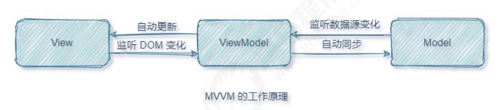
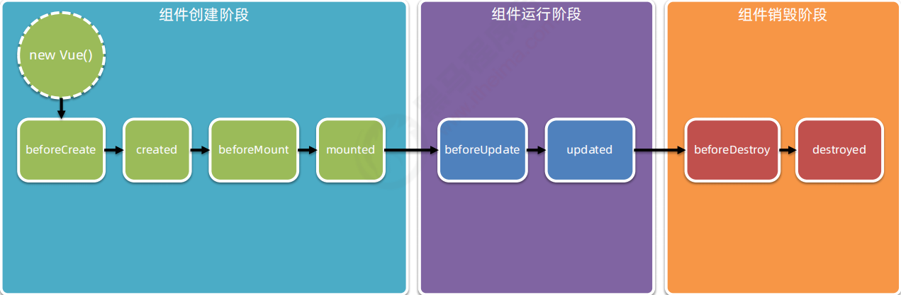

# 1.前端工程化与 Webpack

## 1.前端工程化

### 1.前端工程化的相关概念

#### 1.小白眼中的前端开发 vs 实际的前端开发

小白眼中的前端开发：

- 会写 HTML + CSS + JavaScript 就会前端开发
- 需要美化页面样式，就拽一个 bootstrap 过来
- 需要操作 DOM 或发起 Ajax 请求，再拽一个 jQuery 过来
- 需要快速实现网页布局效果，就拽一个 Layui 过来

实际的前端开发：

- **模块化**（js 的模块化、css 的模块化、资源的模块化）
- **组件化**（复用现有的 UI 结构、样式、行为）
- **规范化**（目录结构的划分、编码规范化、接口规范化、文档规范化、Git 分支管理）
- **自动化**（自动化构建、自动部署、自动化测试）

#### 2.什么是前端工程化

前端工程化指的是：在**企业级的前端项目开发**中，把前端开发所需的**工具、技术、流程、经验**等进行规范化、标准化。

企业中的 Vue 项目和 React 项目，都是基于**工程化的方式**进行开发的。

> 好处：前端开发**自成体系**，有一套**标准的开发方案和流程**。
>

#### 3.前端工程化的解决方案

早期的前端工程化解决方案：

- **grunt**（https://wwww/gruntjs.net/）
- **gulp**（https://www.gulpjs.com.cn）

目前主流的前端工程化解决方案：

- **webpack**（https://www.webpackjs.com/）
- **parcel**（https://zh.parceljs.org/）

## 2.Webpack 的基本使用

### 1.什么是 webpack

概念：webpack 是**前端项目工程化的具体解决方案**。

主要功能：它提供了友好的**前端模块化开发**支持，以及**代码压缩混淆、处理浏览器端 JavaScript 的兼容性、性能优化**等强大的功能。

> 好处：让程序员把**工作的重心**放到具体功能的实行上，提高了前端**开发效率**和项目的**可维护性**。
>
> 注意：目前 Vue 和 React 等前端项目，基本上都是基于 webpack 进行工程化开发的。
>

### 2.创建列表隔行变色项目

1. 新建 change-rows-color 项目目录，并**运行 npm init -y** 命令，初始化包管理配置文件 **package.json**
2. 新建 **src** 源代码目录
3. 新建 src -> **index.html** 首页和 src -> **index.js** 脚本文件
4. 初始化首页基本的结构
5. 运行 **npm i jquery** 命令，安装 jQuery
6. 通过 ES6 模块化的方式导入 jQuery，实现列表隔行变色效果

### 3.在项目中安装 webpack

在终端运行如下的命令，安装 webpack 相关的两个包：

```bash
npm i webpack webpack-cli -D
```

### 4.在项目中配置 webpack

1. 在项目根目录中，创建名为 **webpack.config.js** 的 webpack 配置文件，并初始化如下的基本配置：

    ```js
    module.exports = {
        mode: "development"// mode 用来指定构建模式。可选值有 development 和 production
    }
    ```

2. 在 package.json 的 scripts 节点下，新增 **dev 脚本**如下：

    ```json
    "scripts": {
        "dev": "webpack"// script 节点下的脚本，可以通过 npm run 执行。例如 npm run dev
    }
    ```

3. 在终端中运行 **npm run dev** 命令，启动 webpack 进行项目的打包构建

#### 1.mode 的可选值

1. development
    - **开发环境**
    - **不会**对打包生成的文件进行**代码压缩**和**性能优化**
    - 打包**速度块**，适合在**开发阶段**使用
2. production
    - **生产环境**
    - **会**对打包生成的文件进行**代码压缩**和**性能优化**
    - 打包**速度很慢**，仅适合在项目**发布阶段**使用

#### 2.webpack.config.js 文件的作用

webpack.config.js 是 webpack 的配置文件。webpack 在真正开始打包构建之前，会先读取这个配置文件，从而基于给定的配置，对项目进行打包。

> 注意：由于 webpack 是基于 node.js 开发出来的打包工具，因此在它的配置文件中，支持使用 node.js 相关的语法和模块进行 webpack 的个性化配置。
>

#### 3.webpack 中的默认约定

在 webpack 4.x 和 5.x 的版本中，有如下的默认约定：

1. 默认的打包入口文件为 **src** -> **index.js**
2. 默认的输出文件路径为 **dist** -> **main.js**

> 注意：可以在 **webpack.config.js** 中修改打包的默认约定
>

#### 4.自定义打包的入口与出口

在 webpack.config.js 配置文件中，通过 **entry 节点**指定**打包的入口**。通过 **output 节点**指定**打包的出口**。

示例代码如下：

```js
const path = require("path");// 导入 Node.js 中专门操作路径的模块

module.exports = {
    entry: path.join(__dirname, "./src/index.js"),// 打包入口文件的路径
    output: {
        path: path.join(__dirname, "./dist"),// 输出文件的存放路径
        filename: "main.js"// 输出文件的名称
    }
}
```

## 3.webpack 中的插件

### 1. webpack 插件的作用

通过安装和配置第三方的插件，可以**拓展 webpack 的能力**，从而让 webpack **用起来更方便**。最常用的 webpack 插件有如下两个：

1. **webpack-dev-server**
    - 类似于 node.js 阶段用到的 nodemon 工具
    - 每当修改了源代码，webpack 会自动进行项目的打包和构建
2. **html-webpack-plugin**
    - webpack 中的 HTML 插件（类似于一个模板引擎插件）
    - 可以通过此插件自定制 index.html 页面的内容

### 2.webpack-dev-server

#### 1.安装 webpack-dev-server

运行如下的命令，即可在项目中安装此插件：

```bash
npm i webpack-dev-server@3.11.2 -D
```

#### 2.配置 webpack-dev-server

1. 修改 **package.json** -> **scripts** 中的 **dev** 命令如下：

    ```json
    "scripts": {
        "dev": "webpack serve"
    }
    ```

2. 再次运行 **npm run dev** 命令，重新进行项目的打包

3. 在浏览器中访问 http://localhost:8080 地址，查看自动打包效果

> 注意：webpack-dev-server 会启动一个**实时打包的 http 服务器**
>

#### 3.打包生成的文件哪儿去了

1. 不配置 webpack-dev-server 的情况下，webpack 打包生成的文件，会存放到**实际的物理磁盘上**
    - 严格遵守开发者在 webpack.config.js 中指定配置
    - 根据 **output 节点**指定路径进行存放
2. 配置了 webpack-dev-server 之后，打包生成的文件**存放到了内存中**
    - 不再根据 output 节点指定的路径，存放到实际的物理磁盘上
    - **提高了**实时打包输出的**性能**，因为内存比物理磁盘速度快很多

#### 4.生成到内存中的文件该如何访问

webpack-dev-server 生成到内存中的文件，默认**放到了项目的根目录中**，而且是**虚拟的、不可见的**。

- 可以直接用 **/** 表示**项目根目录，后面跟上要访问的文件名称**，即可访问内存中的文件
- 例如 **/main.js** 就表示要访问 webpack-dev-server 生成到内存中的 main.js 文件

### 3.html-webpack-plugin

html-webpack-plugin 是 **webpack 中的 HTML 插件**，可以通过此插件**自定制** index.html **页面的内容**。

**需求**：通过 html-webpack-plugin 插件，将 src 目录下的 index.html 首页，**复制到项目根目录中一份**！

#### 1.安装 html-webpack-plugin

运行如下的命令，即可在项目中安装此插件：

```bash
npm i html-webpack-plugin@5.3.2 -D
```

#### 2.配置 html-webpack-plugin

```js
const htmlWebpackPlugin = require("html-webpack-plugin");// 导入 HTML 插件，得到一个构造函数

// 创建 HTML 插件的实例对象
htmlWebpackPlugin = new htmlWebpackPlugin({
    template: "./src/index.html",// 指定原文件的存放路径
    filename: "./index.html"// 指定生成的文件的存放路径
});

module.exports = {
    plugins: [htmlWebpackPlugin]// 通过 plugins 节点，使 htmlWebpackPlugin 插件生效
}
```

#### 3.解惑 html-webpack-plugin

1. 通过 HTML 插件复制到项目根目录中的 index.html 页面，**也被放到了内存中**
2. HTML 插件在生成的 **index.html 页面，自动注入了**打包的 main.js 文件

### 4.devServer 节点

在 webpack.config.js 配置文件中，可以通过 **devServer** 节点对 webpack-dev-server 插件进行更多的配置，

示例代码如下：

```json
devServer: {
    open: true,// 初次打包完成后，自动打开浏览器
    host: "localhost",// 实时打包所使用的主机地址
    port: 80// 实时打包所使用的端口号
}
```

> 注意：凡是修改了 webpack.config.js 配置文件，或修改了 package.json 配置文件，**必须重启实时打包的服**
>

**务器**，否则最新的配置文件无法生效！

## 4.webpack 中的 loader

### 1.loader 概述

在实际开发过程中，webpack 默认只能打包处理以 .js 后缀名结尾的模块。其他非 .js 后缀名结尾的模块，webpack 默认处理不了，**需要调用 loader 加载器才可以正常打包**，否则会报错！

loader 加载器的作用：**协助 webpack 打包处理特定的文件模块**。比如：

- css-loader 可以打包处理 .css 相关的文件
- less-loader 可以打包处理 .less 相关的文件
- babel-loader 可以打包处理 webpack 无法处理的高级 JS 语法

### 2.loader 的调用过程


### 3.打包处理 css 文件

- 运行 **npm i style-loader css-loader -D** 命令，安装处理 css 文件的 loader

- 在 webpack.config.js 的 **module** -> **rules** 数组中，添加 loader 规则如下：

    ```js
    module: {// 所有第三方文件模块的匹配规则
        rules: [// 文件后缀名的匹配规则
            { test: /\.css$/, use: ["style-loader", "css-loader"] }
        ]
    }
    ```

    其中，**test** 表示匹配的**文件类型**，**use** 表示对应**要调用的 loader**

> 注意：
>
> - use 数组中指定的 loader **顺序是固定的**
> - 多个 loader 的调用顺序是：**从后往前调用**
>

### 4.打包处理 less 文件

1. 运行 **npm i less-loader@10.0.1 less@4.1.1 -D** 命令

2. 在 webpack.config.js 的 module -> rules 数组中，添加 loader 规则如下：

    ```js
    module: {// 所有第三方文件模块的匹配规则
        rules: [// 文件后缀名的匹配规则
            { test: /\.less$/, use: ["style-loader", "css-loader", "less-loader"] }
        ]
    }
    ```

### 5.打包处理样式表中与 url 路径相关的文件

1. 运行 **npm i url-loader file-loader -D** 命令

2. 在 webpack.config.js 的 **module** -> **rules** 数组中，添加 loader 规则如下：

    ```js
    module: {// 所有第三方文件模块的匹配规则
        rules: [// 文件后缀名的匹配规则
            { test: /\.jpg|png|gif$/, use: ["url-loader?limit=2048"] }
        ]
    }
    ```

其中 **?** 之后的是 **loader 的参数项**：

- limit 用来指定**图片的大小**，单位是字节（byte）
- 只有 **<=** limit 大小的图片，才会被转为 base64 格式的图片

### 6.打包处理 js 文件中的高级语法

webpack 只能打包处理**一部分**高级的 JavaScript 语法。对于那些 webpack 无法处理的高级 js 语法，需要借助于 **babel-loader** 进行打包处理。例如 webpack 无法处理下面的 JavaScript 代码：

```js
// 打包处理 js 文件中的高级语法
// 1.定义了名为 info 的装饰器
function info(target) {
    // 2.为目标添加静态属性 info
    target.info = "Person info";
}

// 3.为 Person 类应用 info 装饰器
@info
class Person {};

// 4.打印 Person 的静态属性 info
console.log(Person.info);
```

#### 1.安装 babel-loader 相关的包

运行如下的命令安装对应的依赖包：

```bash
npm i babel-loader @babel/core @babel/plugin-proposal-decorators -D
```

在 webpack.config.js 的 **module** -> **rules** 数组中，添加 loader 规则如下：

```js
module: {// 所有第三方文件模块的匹配规则
    rules: [// 文件后缀名的匹配规则
        { test: /\.js$/, use: "babel-loader", exclude: /node_modules/ }// 注意：必须使用 exclude 指定排除项；因为 node_modules 目录下的第三方包不需要被打包
    ]
}
```

#### 2.配置 babel-loader

在项目根目录下，创建名为 **babel.config.js** 的配置文件，定义 **Babel 的配置项**如下：

```js
module.exports = {
    plugins: [["@babel/plugin-proposal-decorators", { legacy: true }]]// 声明 babel 可用的插件
}
```

详情请参考 Babel 的官网 https://babeljs.io/docs/en/babel-plugin-proposal-decorators

## 5.打包发布

### 1.为什么要打包发布

**项目开发完成之后**，需要使用 webpack **对项目进行打包发布**，主要原因有以下两点：

1. 开发环境下，打包生成的文件**存放于内存中**，无法获取到最终打包生成的文件
2. 开发环境下，打包生成的文件**不会进行代码压缩和性能优化**

**为了让项目能够在生产环境中高性能的运行**，因此需要对项目进行打包发布。

### 2.配置 webpack 的打包发布

在 **package.json** 文件的 scripts 节点下，新增 build 命令如下：

```json
"scripts": {
    "build": "webpack --mode production"
}
```

**--model** 是一个参数项，用来指定 webpack 的**运行模式**。production 代表生产环境，会对打包生成的文件进行**代码压缩**和**性能优化**。

> 注意：通过 --model 指定的参数项，会**覆盖** webpack.config.js 中的 model 选项。
>

### 3.把 JavaScript 文件统一生成到 js 目录中

在 **webpack.config.js** 配置文件的 **output** 节点中，进行如下的配置：

```js
output: {
    path: path.join(__dirname, "./dist"),// 输出文件的存放路径
    filename: "js/main.js"// 明确告诉 webpack 把生成的 main.js 文件存放到 dist 目录下的 js 子目录中
}
```

### 4.把图片文件统一生成到 image 目录中

修改 webpack.config.js 中的 **url-loader** 配置项，新增 **outputPath** 选项即可指定图片文件的输出路径：

```js
module: {// 所有第三方文件模块的匹配规则
    rules: [// 文件后缀名的匹配规则
        { test: /\.jpg|png|gif$/, use: ["url-loader?limit=2048&outputPath=images"] }// 明确指定把生成的图片文件存放到 dist 目录下的 images 子目录中
    ]
}
```

### 5.自动清理 dist 目录下的旧文件

为了在每次打包发布时**自动清理掉 dist 目录中的旧文件**，可以安装并配置 **clean-webpack-plugin** 插件：

1. 安装清理 dist 目录的 webpack 插件

    ```bash
    npm i clean-webpack-plugin -D
    ```

2. 在 **webpack.config.js** 文件中新增以下代码：

    ```js
    // 导入自动清理 dist 目录的插件
    const { CleanWebpackPlugin } = require("clean-webpack-plugin");
    const cleanWebpackPlugin = new CleanWebpackPlugin();
    ```

3. 在 plugins 节点中挂载插件

    ```js
    plugins: [htmlWebpackPlugin, cleanWebpackPlugin],// 挂载插件
    ```

## 6.Source Map

### 1.生产环境遇到的问题

前端项目在投入生产环境之前，都需要对 JavaScript 源代码进行**压缩混淆**，从而减小文件的体积，提高文件的加载效率。此时就不可避免的产生了另一个问题：

**对压缩混淆之后的代码除错（debug）**是一件极其困难的事情

- 变量被替换成**没有任何语义**的名称
- 空行和注释被剔除

### 2.什么是 Source Map

**Source Map 就是一个信息文件，里面储存着位置信息**。也就是说，Source Map 文件中存储着压缩混淆后的代码，所对应的转换前的位置。

有了它，出错的时候，除错工具将**直接显示原始代码，而不是转换后的代码**，能够极大的方便后期的调试。

### 3.webpack 开发环境下的 Source Map

在**开发环境下**，webpack **默认启用了** Source Map 功能。当程序运行出错时，可以直接在控制台提示**错误行的位置**，并**定位到具体的源代码**：


#### 1.默认 Source Map 的问题

开发环境下默认生成的 Source Map，记录的是**生成后的代码的位置**。会导致**运行时报错的行数**与**源代码的行数**不一致的问题。示意图如下：


#### 2.解决默认 Source Map 的问题

开发环境下，推荐在 **webpack.config.js** 中添加如下的配置，即可保证**运行时报错的行数**与**源代码的行数**保持一致：

```js
module.exports = {
    mode: "development",// mode 用来指定构建模式。可选值有 development 和 production
    devtool: "eval-source-map"// 此选项生成的 Source Map 能够保证 “运行时报错的行数” 与 “源代码的行数” 保持一致
}
```


### 4.webpack 生产环境下的 Source Map

在**生产环境下**，如果**省略了 devtool 选项**，则最终生成的文件中**不包含 Source Map**。这能够**防止原始代码**通过 Source Map 的形式**暴露**给别有所图之人。


#### 1.只定位行数不暴露源码

在生产环境下，如果**只想定位报错的具体行数**，且**不想暴露源码**。此时可以将 **devtool** 的值设置为 **nosources-source-map**。实际效果如图所示：


#### 2.定位行数且暴露源码

在生产环境下，如果**想在定位报错行数的同时，展示具体报错的源码**。此时可以将 **devtool** 的值设置为 **source-map**。实际效果如图所示：


采用此选项后：你应该将你的服务器配置为，**不允许普通用户访问 source map 文件**！

### 5.Source Map 的最佳实践

1. 开发环境下：
    - 建议把 devtool 的值设置为 **eval-source-map**
    - 好处：可以精准定位到具体的错误行
2. 生产环境下：
    - 建议**关闭 Source Map** 或将 devtool 的值设置为 **nosources-source-map**
    - 好处：防止源码泄露，提高网站的安全性

## 7.实际开发中需要自己配置 webpack 吗

答案：**不需要**！

- 实际开发中会使命令行工具（俗称 **CLI**）**一键生成**带有 webpack 的项目
- 开箱即用，所有 webpack 配置项都是现成的！
- 我们只需要知道 webpack 中的基本概念即可！

## 8.总结

1. 能够掌握 webpack 的基本使用
    - 安装、**webpack.config.js**、修改打包入口
2. 了解常用的 plugin 的基本使用
    - **webpack-dev-server**、html-webpack-plugin
3. 了解常用的 loader 的基本使用
    - loader 的作用、**loader 的调用过程**
4. 能够说出 Source Map 的作用
    - 精准定位到**错误行**并显示**对应的源码**
    - 方便开发者调试源码中的错误

# 2.vue 基础入门

## 1.vue 简介

### 1.什么是 vue

官方给出的概念：Vue（读音 /vjuː/，类似于 view）是一套用于构建用户界面的前端框架。


### 2.vue 的特性

vue 框架的特性，主要体现在如下两方面：

1. **数据驱动视图**
2. **双向数据绑定**

#### 1.数据驱动视图

在使用了 vue 的页面中，vue 会**监听数据的变化**，从而**自动**重新渲染页面的结构。示意图如下：


> 好处：当页面数据发生变化时，页面会自动重新渲染！
>
> 注意：数据驱动视图是**单向的数据绑定**。

#### 2.双向数据绑定

在**填写表单**时，双向数据绑定可以辅助开发者在**不操作 DOM 的前提下，自动**把用户填写的内容**同步到**数据源中。示意图如下：


> 好处：开发者不再需要手动操作 DOM 元素，来获取表单元素最新的值！

#### 3.MVVM

**MVVM** 是 vue 实现**数据驱动视图**和**双向数据绑定**的核心原理。MVVM 指的是 **M**odel、**V**iew 和 **V**iew**M**odel，它把每个 HTML 页面都拆分成了这三个部分，如图所示：


在 MVVM 概念中：

- **Model** 表示当前页面渲染时所依赖的数据源。
- **View** 表示当前页面所渲染的 DOM 结构。
- **ViewModel** 表示 vue 的实例，它是 MVVM 的核心。

#### 4.MVVM 的工作原理

**ViewModel 作为 MVVM 的核心**，是它把当前页面的**数据源**（Model）和**页面的结构**（View）连接在了一起。



当**数据源发生变化**时，会被 ViewModel 监听到，VM 会根据最新的数据源**自动更新**页面的结构

当**表单元素的值发生变化**时，也会被 VM 监听到，VM 会把变化过后最新的值**自动同步**到 Model 数据源中

### 3.vue 的版本

当前，vue 共有 3 个大版本，其中：

1.x 版本的 vue 几乎被淘汰，不再建议学习与使用

**2.x 版本的 vue 是目前企业级项目开发中的主流版本**

3.x 版本的 vue 于 2020-09-19 发布，生态还不完善，尚未在企业级项目开发中普及和推广

> 总结：
>
> 2.x 版本的 vue 在未来（1 ~ 2年内）会被逐渐淘汰；
>
> 3.x 版本的 vue 是未来企业级项目开发的趋势；

## 2.vue 的基本使用

1. 导入 vue.js 的 script 脚本文件
2. 在页面中声明一个将要被 vue 所控制的 DOM 区域
3. 创建 vm 实例对象（vue 实例对象）

```html
<!-- 1.导入 Vue 的库文件，在 window 全局就有了 Vue 这个构造函数 -->
<script src="./lib/vue-2.6.14.min.js"></script>

<!-- View 视图区域 -->
<div id="app">{{username}}</div>

<script>
    // 2.创建 Vue 的实例对象（new Vue() 构造函数，得到的 vm 实例对象，就是 ViewModel）
    const vm = new Vue({
        el: '#app',// el 属性是固定的写法，表示当前 vm 实例要控制页面上的哪个区域，接收的值是一个选择器（el 指向的选择器，就是 View 视图区域）
        data: {// data 对象就是要渲染到页面上的数据（data 指向的对象，就是 Model 数据源）
            username: 'zhangsan'
        }
    });
</script>
```

## 3.vue 的调试工具

### 1.安装 vue-devtools 调试工具

**在谷歌浏览器中安装 vue-devtools 调式工具**：

1. 打开谷歌浏览器找到扩展程序

    

2. 在右上角打开开发者模式：

    

3. 再将 **vue_devtools_chrome_5.3.4.crx** 文件拖进来点击添加**扩展程序**

4. 安装完成以后再点击详情，将**允许访问文件网址**打开：

    

### 2.使用 vue-devtools 调试 vue 页面

在浏览器中访问一个**使用了 vue 的页面**，打开浏览器的**开发者工具，切换到 Vue 面板**，即可使用 vue-devtools 调试当前的页面（要引入开发版本的 vue 才行）。


## 4.vue 的指令与过滤器

### 1.指令的概念

**指令（Directives）**是 vue 为开发者提供的**模板语法**，用于**辅助开发者渲染页面的基本结构**。

vue 中的指令**按照不同的用途**可以分为如下 6 大类：

1. **内容渲染**指令
2. **属性绑定**指令
3. **事件绑定**指令
4. **双向绑定**指令
5. **条件渲染**指令
6. **列表渲染**指令

> 注意：指令是 vue 开发中最基础、最常用、最简单的知识点。

#### 1.内容渲染指令

**内容渲染指令**用来辅助开发者**渲染 DOM 元素的文本内容**。常用的内容渲染指令有如下 3 个：

- v-text
- {{ }}
- v-html

##### 1.v-text

用法示例：

```html
<script src="./lib/vue-2.6.14.js"></script>

<!-- View -->
<div id="app">
    <!-- text -->
    <div v-text="username"></div>
    <div v-text="gender">性别：</div>
</div>

<!-- ViewModel -->
<script>
    new Vue({
        el: '#app',
        data: {
            username: 'zhangsan',
            gender: '女'
        }
    });
</script>
```


> 注意：v-text 指令会**覆盖元素内默认的值**。

##### 2.{{ }}

vue 提供的 **{{ }}** 语法，专门用来解决 v-text 会覆盖默认文本内容的问题。这种 {{ }} 语法的专业名称是**插值表达式**（英文名为：**Mustache**）。

```html
<script src="./lib/vue-2.6.14.js"></script>

<!-- View -->
<div id="app">
    <!-- {{ }} -->
    <div>姓名：{{ username }}</div>
    <div>性别：{{ gender }}</div>
</div>

<!-- ViewModel -->
<script>
    new Vue({
        el: '#app',
        data: {
            username: 'zhangsan',
            gender: '女'
        }
    });
</script>
```

> 注意：相对于 v-text 指令来说，**插值表达式在开发中更常用一些**！因为它不会覆盖元素中默认的文本内容。

##### 3.v-html

**v-text** 指令和**插值表达式**只能渲染**纯文本内容**。如果要把**包含 HTML 标签的字符串**渲染为页面的 HTML 元素，则需要用到 v-html 这个指令：

```html
<script src="./lib/vue-2.6.14.js"></script>

<!-- View -->
<div id="app">
    <!-- v-html -->
    <div v-text="info"></div>
    <div>{{info}}</div>
    <div v-html="info"></div>
</div>

<!-- ViewModel -->
<script>
    new Vue({
        el: '#app',
        data: {
            username: 'zhangsan',
            gender: '女'
        }
    });
</script>
```

#### 2.属性绑定指令

如果需要为**元素的属性**动态绑定**属性值**，则需要用到 **v-bind** 属性绑定指令（v-bind: 指令可以简写为 :）。用法示例如下：

```html
<script src="./lib/vue-2.6.14.js"></script>

<!-- View -->
<div id="app">
	<input type="text" v-bind:placeholder="tips">

    <hr>

    <!-- v-bind: 指令可以简写为 : -->
    
</div>

<!-- ViewModel -->
<script>
    new Vue({
        el: '#app',
        data: {
            tips: '请输入用户名',
            photo: 'https://cn.vuejs.org/images/logo.svg'
        }
    });
</script>
```

#### 3.使用 Javascript 表达式

在 vue 提供的模板渲染语法中，除了支持**绑定简单的数据值**之外，还**支持 Javascript 表达式的运算**，例如：

```html
<script src="./lib/vue-2.6.14.js"></script>

<!-- View -->
<div id="app">
    <div>1 + 2 的结果是：{{ 1 + 2 }}</div>
    <div>{{ username }} 反转的结果是：{{ username.split('').reverse().join('') }}</div>
    <div :title="'box' + index">这是一个 div</div>
</div>

<!-- ViewModel -->
<script>
    new Vue({
        el: '#app',
        data: {
            username: 'zhangsan',
            index: 3
        }
    });
</script>
```

#### 4.事件绑定指令

vue 提供了 **v-on 事件绑定**指令（v-on: 指令可以简写为 @），用来辅助程序员为 DOM 元素绑定事件监听。语法格式如下：

```html
<script src="./lib/vue-2.6.14.js"></script>

<!-- View -->
<div id="app">
    <p>count 的值是：{{ count }}</p>
    <!-- v-on: 指令可以被简写为 @ -->
    <button @click="add(1)">+1</button>
    <button @click="sub">-1</button>
</div>

<!-- ViewModel -->
<script>
    new Vue({
        el: '#app',
        data: {
            count: 0
        },
        // methods 的作用，就是定义事件的处理函数
        methods: {
            add(n) {
                // 在 methods 处理函数中，this 就是 vue 实例对象
                this.count += n;
            },
            sub() {
                this.count -= 1;
            }
        }
    });
</script>
```


> 注意：原生 DOM 对象有 **onclick、oninput、onkeyup** 等原生事件，替换为 vue 的事件绑定形式后，
>
> 分别为：v-on:click、v-on:input、v-on:keyup

#### 5.事件对象$event

vue 提供了内置变量，名字叫做 **$event**，它就是原生 DOM 的事件对象 **event**：

```html
<script src="./lib/vue-2.6.14.js"></script>

<!-- View -->
<div id="app">
    <p>count 的值是：{{ count }}</p>
    <!-- 如果 count 是偶数，则 按钮背景变成红色，否则，取消背景颜色 -->
    <button @click="add($event, 1)">+1</button>

    <button @click="sub">-1</button>
</div>

<!-- ViewModel -->
<script>
    const vm = new Vue({
        el: '#app',
        data: {
            count: 0
        },
        methods: {
            add(event, n) {// 如果传了参数，需要传递 $event 参数才能拿到事件对象
                console.log(event);// 事件对象

                this.count += n;

                // 判断 this.count 的值是否为偶数
                if (this.count % 2 === 0) {
                    // 偶数
                    event.target.style.backgroundColor = 'red';
                } else {
                    // 奇数
                    event.target.style.backgroundColor = '';
                }
            },
            sub(event) {// 如果不传参数，默认 event 就是事件对象
                console.log(event);// 事件对象

                this.count -= 1;
            }
        }
    });
</script>
```

#### 6.事件修饰符

在事件处理函数中调用 **event.preventDefault()** 或 **event.stopPropagation()** 是非常常见的需求。因此，vue 提供了**事件修饰符**的概念，来辅助程序员更方便的**对事件的触发进行控制**。常用的 5 个事件修饰符如下：

| 事件修饰符 | 说明                                                      |
| ---------- | --------------------------------------------------------- |
| .prevent   | 阻止默认行为（例如：阻止 a 连接的跳转、阻止表单的提交等） |
| .stop      | 阻止事件冒泡                                              |
| .capture   | 以捕获模式触发当前的事件处理函数                          |
| .once      | 绑定的事件只触发1次                                       |
| .self      | 只有在 event.target 是当前元素自身时触发事件处理函数      |

| 按键修饰符                      | 说明                               |
| ------------------------------- | ---------------------------------- |
| @键盘事件.enter 或 @键盘事件.13 | 只有在 "key" 是 "Enter" 时调用函数 |
| @键盘事件.esc                   | 只有在 "key" 是 "Esc" 时调用函数   |

语法格式如下：

```html
<script src="./lib/vue-2.6.14.js"></script>

<!-- View -->
<div id="app">
    <!-- 阻止默认行为 -->
    <a href="http://www.baidu.com" @click.prevent="show">跳转到百度首页</a>

    <hr>

    <div class="button" @click="divHandler">
        <!-- 只有在 event.target 是当前元素自身时触发事件处理函数 -->
        <button @click.stop="buttonHandler">按钮</button>
    </div>

    <hr>

    <!-- 只有在 "key" 是 "Enter" 时调用函数 -->
    <input type="text" @keyup.13="submit" placeholder="请按下Enter">
    <!-- 只有在 "key" 是 "Esc" 时调用函数 -->
    <input type="text" @keyup.esc="clearInput" placeholder="请按下Esc">
</div>

<!-- ViewModel -->
<script>
    const vm = new Vue({
        el: '#app',
        data: {},
        methods: {
            show() {
                console.log('点击了 a 链接');
            },
            divHandler() {
                console.log('divHandler');
            },
            buttonHandler() {
                console.log('buttonHandler');
            },
            submit() {
                console.log('按下了Enter');
            },
            clearInput() {
                console.log('按下了Esc');
            }
        }
    });
</script>
```

#### 7.双向绑定指令

vue 提供了 **v-model 双向数据绑定**指令，用来辅助开发者在**不操作 DOM** 的前提下，**快速获取表单的数据**。

```html
<script src="./lib/vue-2.6.14.js"></script>

<!-- View -->
<div id="app">
    <p>用户的名字是：{{ username }}</p>
    <input type="text" v-model="username">

    <hr>

    <p>选择的城市是：{{ city }}</p>
    <select v-model="city">
        <option value="">请选择城市</option>
        <option value="1">北京</option>
        <option value="2">上海</option>
        <option value="3">广州</option>
    </select>
</div>

<!-- ViewModel -->
<script>
    const vm = new Vue({
        el: '#app',
        data: {
            username: 'zhangsan',
            city: '2'
        }
    });
</script>
```

**v-model 指令的修饰符**

**为了方便对用户输入的内容进行处理**，vue 为 v-model 指令提供了 3 个修饰符，分别是：

| 修饰符  | 作用                              | 示例                                       |
| ------- | --------------------------------- | ------------------------------------------ |
| .number | 自动将用户的输入值转为数值类型    | `<input type="text" v-model.number="age">` |
| .trim   | 自动过滤用户输入的首尾空白字符    | `<input type="text" v-model.trim="msg">`   |
| .lazy   | 在 “change” 时而非 “input” 时更新 | `<input type="text" v-model.lazy="msg">`   |

```html
<script src="./lib/vue-2.6.14.js"></script>

<!-- View -->
<div id="app">
    <!-- .number -->
    <input type="text" v-model.number="n1"> + <input type="text" v-model.number="n2"> = <span>{{ n1 + n2 }}</span>

    <hr>

    <!-- .trim -->
    <input type="text" v-model.trim="username">
    <button @click="showName">获取用户名</button>

    <hr>

    <!-- .lazy -->
    <input type="text" v-model.lazy="username">
</div>

<!-- ViewModel -->
<script>
    const vm = new Vue({
        el: '#app',
        data: {
            username: 'zhangsan',
            n1: 1,
            n2: 2
        },
        methods: {
            showName() {
                console.log(`用户名是："${this.username}"`);
            }
        }
    });
</script>
```

#### 8.条件渲染指令

**条件渲染指令**用来辅助开发者**按需控制 DOM 的显示与隐藏**。条件渲染指令有如下两个，分别是：

- v-if

    原理是：动态为元素添加或移除 display: none 样式，来实现元素的显示和隐藏

    如果要频繁的切换元素的显示状态，用 v-show 性能会更好

- v-show

    原理是：每次动态创建或删除元素，来实现元素的显示和隐藏

    如果刚进入页面的时候，某些元素默认不需要被展示，而且后期这个元素很可能也不需要被展示出来，此时 v-if 性能更好

> 在实际开发中，绝大多数情况下，不用考虑新能问题，直接使用 v-if 就好了！！！

示例用法如下：

```html
<script src="./lib/vue-2.6.14.js"></script>

<!-- View -->
<div id="app">
    <p v-if="flag">这是被 v-if 控制的元素</p>
    <p v-show="flag">这是被 v-show 控制的元素</p>

    <hr>

    <div v-if="type === 'A'">优秀</div>
    <div v-else-if="type === 'B'">良好</div>
    <div v-else-if="type === 'C'">一般</div>
    <div v-else>差</div>
</div>

<!-- ViewModel -->
<script>
    const vm = new Vue({
        el: '#app',
        data: {
            flag: true,// 如果 flag 为 true，则显示被控制的元素；如果为 false 则隐藏被控制的元素
            type: 'A'
        }
    });
</script>
```

#### 9.列表渲染指令

vue 提供了 **v-for** 列表渲染指令，用来辅助开发者**基于一个数组来循环渲染一个列表结构**。v-for 指令需要使用 **(item, index) in list** 形式的特殊语法，其中：

- list 是**待循环的数组**
- item 是**被循环的每一项**
- index 是**被循环的每一项的索引**

**使用 key 维护列表的状态**

当**列表的数据变化**时，默认情况下，vue 会**尽可能的复用**已存在的 DOM 元素，从而**提升渲染的性能**。但这种默认的性能优化策略，会导致**有状态的列表无法被正确更新**。

为了给 vue 一个提示，以便它能跟踪每个节点的身份，从而在保证**有状态的列表被正确更新**的前提下，**提升渲染的性能**。此时，需要为每项提供一个**唯一的 key 属性**：

```html
<link rel="stylesheet" href="./lib/bootstrap.css">
<script src="./lib/vue-2.6.14.js"></script>

<!-- View -->
<div id="app">
    <table class="table table-bordered table-hover table-striped">
        <thead>
            <th>索引</th>
            <th>Id</th>
            <th>姓名</th>
        </thead>
        <tbody>
            <!-- 官方建议：只要用到了 v-for 指令，那么一定要绑定一个 :key 属性 -->
            <!-- 而且，尽量把 id 作为 key 的值 -->
            <!-- 官方对 key 的值类型，是有要求的：字符串或数字类型 -->
            <!-- key 的值是千万不能重复的，否则会终端报错：Duplicate keys detected -->
            <tr v-for="(item, index) in list" :key="item.id">
                <td>{{ index }}</td>
                <td>{{ item.id }}</td>
                <td>{{ item.name }}</td>
            </tr>
        </tbody>
    </table>
</div>

<!-- ViewModel -->
<script>
    const vm = new Vue({
        el: '#app',
        data: {
            list: [
                { id: 1, name: '张三' },
                { id: 2, name: '李四' },
                { id: 3, name: '王五' },
                { id: 4, name: '赵六' }
            ]
        }
    });
</script>
```

**key 的注意事项**

1. key 的值只能是**字符串**或**数字**类型
2. key 的值**必须具有唯一性**（即：key 的值不能重复）
3. 建议把**数据项 id 属性的值**作为 key 的值（因为 id 属性的值具有唯一性）
4. 使用 **index 的值**当作 key 的值**没有任何意义**（因为 index 的值会变化）
5. 建议使用 v-for 指令时**一定要指定 key 的值**（既提升性能、又防止列表状态紊乱）

### 2.过滤器

**过滤器**（**Filters**）是 vue 为开发者提供的功能，常用于**文本的格式化**。过滤器可以用在两个地方：**插值表达式**和 **v-bind 属性绑定**。

过滤器应该被添加在 JavaScript 表达式的**尾部**，由 “**管道符**” 进行调用

#### 1.定义过滤器

在创建 vue 实例期间，可以在 **filters 节点**中定义过滤器，示例代码如下：

```html
<script src="./lib/vue-2.6.14.js"></script>

<!-- View -->
<div id="app">
    <p>message 的值是：{{ message | capi }}</p>
</div>

<!-- ViewModel -->
<script>
    new Vue({
        el: '#app',
        data: {
            message: 'hello vue.js'
        },
        filters: {// 过滤器函数，必须被定义到 filters 节点之下，过滤器本质上是函数
            capi(val) {// 将第一个字母转大写的过滤器，注意：过滤器函数形参中的 val，永远都是 “管道符” 前面的那个值
                const first = val.charAt(0).toUpperCase();
                const other = val.slice(1);// 字符串的 slice 方法，可以截取字符串，从指定索引往后截取
                return first + other;// 强调：过滤器中，一定要有一个返回值
            }
        }
    });
</script>
```

#### 2.私有过滤器和全局过滤器

在 filters 节点下定义的过滤器，称为 “**私有过滤器**”，因为它**只能在当前 vm 实例所控制的 el 区域内使用**。

如果希望**在多个 vue 实例之间共享过滤器**，则可以按照如下的格式定义**全局过滤器**：

```html
<div id="app">
	<p>message 的值是：{{ message | capi }}</p>
</div>

<div id="app2">
    <p>message 的值是：{{ message | capi }}</p>
</div>

<script>
    // 定义全局过滤器，app 和 app2 都可以使用
    Vue.filter('capi', (val) => {
        const first = val.charAt(0).toUpperCase();
        const other = val.slice(1);
        return first + other;
    });

    new Vue({
        el: '#app',
        data: {
            message: 'hello vue.js'
        }
    });

    new Vue({
        el: '#app2',
        data: {
            message: 'hello vue.js'
        }
    });
</script>
```

#### 3.连续调用多个过滤器

过滤器可以**串联地**进行调用，例如：

```html
<!-- 把 message 的值，交给 filterA 进行处理 -->
<!-- 把 filterA 处理的结果，再交给 filterB 进行处理 -->
<!-- 最终把 filterB 处理的结果，作为最终的值渲染到页面上 -->
<div>message 的值是：{{ message | filterA | filterB }}</div>
```

#### 4.过滤器传参

过滤器的**本质**是 **JavaScript 函数**，因此可以接收参数，格式如下：

```html
<!-- View -->
<div id="app">
    <p>message 的值是：{{ message | capi(10, 'zhangsan') }}</p>
</div>

<!-- ViewModel -->
<script>
    new Vue({
        el: '#app',
        data: {
            message: 'hello vue.js'
        },
        filters: {
            capi(val, id, name) {
                console.log(val, id, name);// 结果：hello vue.js 10 zhangsan
            }
        }
    });
</script>
```

#### 5.过滤器的兼容性

过滤器仅在 vue 2.x 和 1.x 中受支持，在 **vue 3.x** 的版本中**剔除了过滤器**相关的功能。

在企业级项目开发中：

- 如果使用的是 2.x 版本的 vue，则依然可以使用过滤器相关的功能
- 如果项目已经升级到了 3.x 版本的 vue，官方建议使用**计算属性**或**方法**代替被剔除的过滤器功能

具体的迁移指南，请参考 vue 3.x 的官方文档给出的说明：

https://v3.vuejs.org/guide/migration/filters.html#migration-strategy

## 5.watch 侦听器

### 1.什么是 watch 侦听器

**watch 侦听器**允许开发者监视数据的变化，从而**针对数据的变化做特定的操作**。例如，监视用户名的变化并发起请求，判断用户名是否可用。

### 2.watch 侦听器的基本语法

开发者需要**在 watch 节点**下，定义自己的侦听器。实例代码如下：

```html
<!-- View -->
<div id="app">
    <input type="text" v-model="username">
</div>

<!-- ViewModel -->
<script>
    new Vue({
        el: '#app',
        data: {
            username: 'admin'
        },
        watch: {// 所有的侦听器，都应该被定义到 watch 节点下
            username(newVal, oldVal) {// 侦听器本质上是一个函数，要监视哪个数据的变化，就把数据名作为方法名即可
                console.log(newVal, oldVal);// 新值在前，旧值在后
            }
        }
    });
</script>
```

### 3.使用 watch 检测用户名是否可用

监听 username 值的变化，**检测当前输入的用户名是否可用**：

```vue
<!-- View -->
<div id="app">
    <input type="text" v-model="username">
</div>

<!-- ViewModel -->
<script>
    new Vue({
        el: '#app',
        data: {
            username: 'admin'
        },
        watch: {
            username(newVal, oldVal) {
                // 假设只有 admin 可用
                if (newVal === 'admin') {
                    console.log('可用');
                } else console.log('不可用');
            }
        }
    });
</script>
```

### 4.immediate 选项

默认情况下，组件在初次加载完毕后不会调用 watch 侦听器。如果想让 watch 侦听器**立即被调用**，则需要使用 immediate 选项。示例代码如下：

```html
<!-- View -->
<div id="app">
    <input type="text" v-model="username">
</div>

<!-- ViewModel -->
<script>
    new Vue({
        el: '#app',
        data: {
            username: 'admin'
        },
        watch: {
            username: {
                async handler(newVal, oldVal) {// handler 是固定写法，表示当 username 的值变化时，自动调用 handler 处理函数
                    console.log(newVal, oldVal);
                },
                immediate: true// 表示页面初次渲染好之后，就立即触发当前的 watch 侦听器
            }
        }
    });
</script>
```

### 5.deep 选项

如果 **watch 侦听的是一个对象**，如果**对象中的属性值发生了变化**，则**无法被监听到**。此时需要使用 **deep 选项**，代码示例如下：

```html
<!-- View -->
<div id="app">
    <input type="text" v-model="user.username">
    <input type="text" v-model="user.address.city">
</div>

<!-- ViewModel -->
<script>
    new Vue({
        el: '#app',
        data: {
            user: {
                username: 'admin',
                address: {
                    city: '北京'
                }
            }
        },
        watch: {
            user: {
                handler(newVal, oldVal) {
                    console.log(newVal.username, newVal.address.city, '==', oldVal.username, oldVal.address.city);// 新值跟旧值一样
                },
                deep: true// 开启深度监听，只要对象中任何一个属性变化了，都会触发 “对象的侦听器”
            }
        }
    });
</script>
```

### 6.监听对象单个属性的变化

如果**只想监听对象中单个属性的变化**，则可以按照如下的方式定义 watch 侦听器：

```html
<!-- View -->
<div id="app">
    <input type="text" v-model="user.username">
</div>

<!-- ViewModel -->
<script>
    new Vue({
        el: '#app',
        data: {
            user: {
                username: 'admin'
            }
        },
        watch: {
            'user.username'(newVal, oldVal) {
                console.log(newVal, oldVal);
            }
        }
    });
</script>
```

## 6.计算属性

### 1.什么是计算属性

计算属性指的是**通过一系列运算**之后，最终得到一个**属性值**。

**这个动态计算出来的属性值**可以被模板结构或 methods 方法使用。示例代码如下：

```html
<!-- View -->
<div id="app">
    <div>
        <span>R：</span>
        <input type="text" v-model.number="r">
    </div>
    <div>
        <span>G：</span>
        <input type="text" v-model.number="g">
    </div>
    <div>
        <span>B：</span>
        <input type="text" v-model.number="b">
    </div>

    <hr>

    <!-- 专门用户呈现颜色的 div 盒子 -->
    <div class="box" :style="'background-color: ' + rgb + ';'">{{ rgb }}</div>
    <!-- 两种写法一致 -->
    <div class="box" :style="{ backgroundColor: rgb }">{{ rgb }}</div>
    <button @click="show">按钮</button>
</div>

<!-- ViewModel -->
<script>
    new Vue({
        el: '#app',
        data: {
            r: 0,// 红色
            g: 0,// 绿色
            b: 0// 蓝色
        },
        methods: {
            show() {// 点击按钮，在终端显示最新的颜色
                console.log(this.rgb);
            }
        },
        computed: {// 所有的计算属性，都要定义到 computed 节点之下
            rgb() {// rgb 作为一个计算属性，被定义成了方法格式，
                return `rgb(${this.r}, ${this.g}, ${this.b})`;
            }
        }
    });
</script>
```

### 2.计算属性的特点

1. 虽然计算属性在**声明的时候**被定义为**方法**，但是计算属性的**本质是一个属性**
2. 计算属性会**缓存计算的结果**，只有计算属性**依赖的数据变化时**，才会重新进行运算

### 3.计算属性 vs 侦听器

计算属性和侦听器**侧重的应用场景不同**：

计算属性侧重于监听**多个值**的变化，最终计算并**返回一个新值**

侦听器侧重于监听**单个数据**的变化，最终**执行特定的业务处理，不需要有任何返回值**

## 7.vue-cli

### 1.单页面应用程序

#### 1.什么是单页面应用程序

**单页面应用程序**（英文名：**S**ingle **P**age **A**pplication）简称 SPA，顾名思义，指的是**一个 Web 网站中只有唯一的一个 HTML 页面**，所有的功能与交互都在这唯一的一个页面内完成。

例如资料中的这个 Demo 项目：


#### 2.单页面应用程序的特点

单页面应用程序将所有的功能局限于一个 web 页面中，**仅在该 web 页面初始化时加载相应的资源**（ HTML、JavaScript 和 CSS）。

一旦页面加载完成了，SPA **不会**因为用户的操作而**进行页面的重新加载或跳转**。而是利用 JavaScript 动态地变换 HTML 的内容，从而实现页面与用户的交互。

#### 3.单页面应用程序的优点

SPA 单页面应用程序最显著的 3 个优点如下：

1. **良好的交互体验**
    - 单页应用的内容的改变不需要重新加载整个页面
    - 获取数据也是通过 Ajax 异步获取
    - 没有页面之间的跳转，不会出现 “白屏现象”
2. **良好的前后端工作分离模式**
    - 后端专注于提供 API 接口，更易实现 API 接口的复用
    - 前端专注于页面的渲染，更利于前端工程化的发展
3. **减轻服务器的压力**
    - 服务器只提供数据，不负责页面的合成与逻辑的处理，吞吐能力会提高几倍

#### 4.单页面应用程序的缺点

**任何一种技术都有自己的局限性**，对于 SPA 单页面应用程序来说，主要的缺点有如下两个：

1. **首屏加载慢**
    - 路由懒加载
    - 代码压缩
    - CDN 加速
    - 网络传输压缩
2. **不利于 SEO**
    - SSR 服务器端渲染

### 2.什么是 vue-cli

**vue-cli 是 Vue.js 开发的标准工具**。它简化了程序员基于 webpack 创建工程化的 Vue 项目的过程。

引用自 vue-cli 官网上的一句话：

程序员可以**专注在撰写应用上**，而**不必花**好几天去**纠结** webpack 配置的问题。

中文官网：https://cli.vuejs.org/zh/

### 3.安装和使用

vue-cli 是 npm 上的一个**全局包，使用 npm i** 命令，即可方便的把它安装到自己的电脑上：

```bash
# 安装
npm i -g @vue/cli

# 查看版本
vue -V
```

基于 vue-cli 快速生成工程化的 Vue 项目：

```bash
# 在终端创建项目
vue create 项目的名称

# 打开浏览器，在可视化面板创建项目
vue ui
```

例如：要创建一个 demo-first 项目

1. 进入到要创建项目的目录下打开终端输入 vue create demo-first，然后会进入如下界面：

    

    - 第一项表示创建 Vue3 项目，会自动把 babel 和 eslint 配置好
    - 第二项表示创建 Vue2 项目，会自动把 babel 和 eslint 配置好
    - 第三项表示自定义创建
    - **选择第三项**

2. 然后进入如下界面：

    

    - 按空格进行选择
    - 要选择 CSS Pre-processors
    - 将 Linter / Formatter 取消选择

3. 然后进入如下界面：

    

    - 选择安装 vue3 还是 vue2
    - **选择 vue2**

4. 然后进入如下界面：

    

    - 选择 CSS 的预处理器
    - **选择 Less**

5. 然后进入如下界面：

    

    询问你要把像 Babel、ESLint 等，这些配置文件放在哪里？

    - 第一项表示放在独立的配置文件
    - 第二项表示放在 package.json 文件里
    - **选择第一项**

6. 然后进入如下界面：

    

    是否将之前的选择保存起来？

    - 输入 y 保存
    - 输入 n 不保存
    - **如果输入 y，要起个名字**

7. 安装完成后会提示你运行以下命令启动项目：

    

### 4.vue 项目的运行流程

在工程化的项目中，vue 要做的事情很单纯：通过 **main.js** 把 **App.vue** 渲染到 **index.html** 的指定区域中。

其中：

1. **src/App.vue** 用来编写待渲染的**模板结构**
2. **public/index.html** 中需要预留一个 **el 区域**
3. **src/main.js** 把 App.vue 渲染到了 index.html 所预留的区域中

### 5.vue 项目中 src 目录的结构

- **assets/ 文件夹**：存放项目中用到的静态资源文件，例如：CSS 样式表、图片资源
- **components/ 文件夹**：程序员封装的、可复用的组件，都要放到 components/ 目录下
- **main.js** 是项目的入口文件。整个项目的运行，要先执行 main.js
- **App.vue** 是项目的根组件

## 8.vue 组件

### 1.什么是组件化开发

**组件化开发**指的是：根据**封装**的思想，**把页面上可重用的 UI 结构封装为组件**，从而方便项目的开发和维护。

### 2.组件化开发的好处

前端组件化开发的好处主要体现在以下两方面：

1. 提高了前端代码的**复用性**和**灵活性**
2. 提升了**开发效率**和后期的**可维护性**

### 3.vue 中的组件化开发

vue 是一个**支持组件化开发**的前端框架。vue 中规定**组件的后缀名**是 **.vue**。之前接触到的 App.vue 文件本质上就是一个 vue 的组件。

### 4.vue 组件的三个组成部分

每个 .vue 组件都由 3 部分构成，分别是：

1. **template** -> 组件的**模板结构**
2. **script** -> 组件的 **JavaScript 行为**
3. **style** -> 组件的**样式**

其中，**每个组件中必须包含 template 模板结构**，而 **script 行为**和 **style 样式**是**可选的**组成部分。

#### 1.template

vue 规定：每个组件对应的**模板结构**，需要定义到 **`<template>` 节点**中。

```vue
<template>
	<!-- 当前组件的 DOM 结构，需要定义到 template 标签的内部 -->
</template>
```

> 注意：
>
> - template 是 vue 提供的**容器标签**，只起到**包裹性质的作用**，它不会被渲染为真正的 DOM 元素
> - template 中只能包含唯一的根节点

#### 2.script

vue 规定：开发者可以在 `<script>` 节点中**封装组件的 JavaScript 业务逻辑**。

`<script>` 节点的基本结构如下：

```vue
<script>
// 今后，组件相关的 data 数据、methods 方法等，都需要定义到 export default 所导出的对象中
export default {};
</script>
```

##### 1.script 中的 data 节点必须是函数

vue 规定：.vue 组件中的 **data 必须是一个函数**，**不能**直接**指向一个数据对象**。

因此在组件中定义 data 数据节点时，下面的方式是**错误的**：

```js
// 错误写法
data: {
	username: "zhangsan"
}

// 正确写法
data() {
    return {
        username: "zhangsan"
    };
}
```

会导致**多个组件实例**共用**同一份数据**的问题，请参考官方给出的示例：

https://cn.vuejs.org/v2/guide/components.html#data-必须是一个函数

##### 2.script 中的 name 节点

可以通过 name 节点为当前组件定义一个名称：

```vue
<script>
export default {
  // name 属性指向的是当前组件的名称（建议：每个单词的首字母大写）
  name: 'App',
}
</script>
```

在使用 vue-devtools 进行项目调试的时候，自定义的组件名称**可以清晰的区分每个组件**：


#### 3.style

vue 规定：组件内的 `<style>` 节点是**可选的**，开发者可以在 `<style>` 节点中**编写样式美化当前组件的 UI 结构**。

`<style>` 节点的基本结构如下：

```vue
<style>
    div {
        background-color: skyblue;
    }
</style>
```

**让 style 中支持 less 语法**

安装依赖包：

```bash
npm i less -D
```

在 `<style>` 标签上添加 **lang="less"** 属性，即可使用 less 语法编写组件的样式：

```vue
<style lang="less">
    div {
        background-color: skyblue;

        span {
            color: pink;
        }
    }
</style>
```

### 5.组件的基本使用

#### 1.组件之间的父子关系

组件在被封装好之后，**彼此之间是相互独立的**，不存在父子关系：


在**使用组件**的时候，**根据彼此的嵌套关系**，形成了**父子关系、兄弟关系**：


#### 2.使用组件的三个步骤

1. 步骤1：使用 import 语法**导入需要的组件**

    ```js
    import Left from "@/components/Left.vue"; // .vue 可以不写
    ```

2. 步骤2：使用 **components** 节点注册组件

    ```js
    export default {
        components: {
            Left,
        },
    };
    ```

3. 步骤3：**以标签形式**使用刚才注册的组件

    ```html
    <div id="app">
        <!-- 使用 Left.vue 组件 -->
        <Left />
    </div>
    ```

#### 3.通过 components 注册的是私有子组件

例如：

在**组件 A** 的 components 节点下，注册了**组件 F**。

则组件 F 只能用在组件 A 中；不能被用在**组件 C** 中。

#### 4.注册全局组件

在 vue 项目的 **main.js** 入口文件中，通过 **Vue.component()** 方法，可以注册全局组件。示例代码如下：

```js
import Count from "@/components/Count.vue";
Vue.component("Count", Count);// 第一个参数是使用这个组件时用的标签名
```

#### 5.全局注册和局部注册的区别

- 被**全局**注册的组件，**可以在全局任何一个组件内使用**
- 被**局部**注册的组件，**只能在当前注册的范围内使用**

应用场景：

如果某些组件在开发期间的**使用频率很高**，推荐进行**全局**注册；

如果某些组件**只在特定的情况下会被用到**，推荐进行**局部**注册。

#### 6.组件注册时名称的大小写

在进行组件的注册时，**定义组件注册名称的方式**有两种：

1. 使用 **kebab-case** 命名法（俗称**短横线命名法**，例如 my-swiper 和 my-search） 
2. 使用 **PascalCase** 命名法（俗称**帕斯卡命名法**或**大驼峰命名法**，例如 MySwiper 和 MySearch）

短横线命名法的特点：

- 必须严格按照短横线名称进行使用

帕斯卡命名法的特点：

- 既可以严格按照帕斯卡名称进行使用，又可以**转化为短横线名称**进行使用

> 注意：在实际开发中，**推荐使用帕斯卡命名法**为组件注册名称，因为它的**适用性更强**。

### 6.组件的 props

props 是组件的**自定义属性**，在**封装通用组件**的时候，合理地使用 props 可以极大的**提高组件的复用性**！

它的语法格式如下：

script 模块：

```js
export default {
    // 组件的自定义属性
    props: ["num"],
};
```

template 模块：

```html
<!-- 给自定义属性 num 赋值为 4 -->
<Count num="4" />
```

#### 1.props 是只读的

vue 规定：组件中封装的自定义属性是**只读的**，程序员**不能直接修改** props 的值。否则会直接报错：


要想修改 props 的值，可以**把 props 的值转存到 data 中**，因为 data 中的数据都是可读可写的！

```js
export default {
    // 组件的自定义属性，数组的形式不能定义默认值
    props: ["num"],
    data() {
        return {
            count: this.num, // 把 props 中 num 的值转存到 count 上
        };
    },
};
```

#### 2.props 的 default 默认值

在声明自定义属性时，可以通过 **default** 来**定义属性的默认值**。示例代码如下：

```js
export default {
    // 用对象的形式定义
    props: {
        num: {
            // 默认值
            default: 0,
        },
    },
    data() {
        return {
            count: this.num, // 把 props 中 num 的值转存到 count 上
        };
    },
};
```

#### 3.props 的 type 值类型

在声明自定义属性时，可以通过 **type** 来**定义属性的值类型**。示例代码如下：

```js
export default {
    // 用对象的形式定义
    props: {
        num: {
            // 默认值
            default: 0,
            // 指定类型
            type: Number,
        },
    },
    data() {
        return {
            count: this.num, // 把 props 中 num 的值转存到 count 上
        };
    },
};
```

#### 4.props 的 required 必填项

在声明自定义属性时，可以通过 **required** 选项，将属性设置为**必填项**，强制用户必须传递属性的值。示例代码如下：

```js
export default {
    // 用对象的形式定义
    props: {
        num: {
            // 默认值
            default: 0,
            // 指定类型
            type: Number,
            // 必填项
            required: true,
        },
    },
    data() {
        return {
            count: this.num, // 把 props 中 num 的值转存到 count 上
        };
    },
};
```

#### 5.props 的大小写命名

组件中如果使用 “**camelCase（驼峰命名法）**” 声明了 props 属性的名称，则有两种方式为其绑定属性的值：


### 7.组件之间的样式冲突问题

默认情况下，**写在 .vue 组件中的样式会全局生效**，因此很容易造成**多个组件之间的样式冲突问题**。

导致组件之间样式冲突的根本原因是：

1. 单页面应用程序中，所有组件的 DOM 结构，都是基于**唯一的 index.html 页面**进行呈现的
2. 每个组件中的样式，都会**影响整个 index.html 页面**中的 DOM 元素

#### 1.如何解决组件样式冲突的问题

为每个组件**分配唯一的自定义属性**，在编写组件样式时，通过**属性选择器**来控制**样式的作用域**，示例代码如下：

```vue
<template>
    <!-- 给每一个元素都加一个 data-v-001 自定义属性，该属性在每个组件中要保证唯一 -->
    <div class="left" data-v-001>
        <h2 data-v-001>这是 Left.vue 的内容</h2>
    </div>
</template>

<style lang="less">
    /* 用属性选择器选择 data-v-001 属性 */
    .left[data-v-001] {
        flex: 1;
        background-color: pink;

        h2[data-v-001] {
            color: #fff !important;
        }
    }
</style>
```

#### 2.style 节点的 scoped 属性

为了提高开发效率和开发体验，vue 为 **style 节点**提供了 **scoped** 属性，从而防止组件之间的样式冲突问题：

```vue
<template>
    <div class="right">
        <h2>这是 Right.vue 的内容</h2>
    </div>
</template>

<style lang="less" scoped>
    /*
    style 节点的 scoped 属性，用来自动为每个组件分配唯一的 “自定义属性”，
    并自定为当前组件的 DOM 标签和 style 样式应用这个自定义属性，防止组件的样式冲突问题
    */
    .right {
        flex: 1;
        background-color: blueviolet;

        h2 {
            color: #fff !important;
        }
    }
</style>
```

#### 3./deep/ 样式穿透

如果给当前组件的 style 节点添加了 scoped 属性，则**当前组件的样式对其子组件是不生效的**。如果想让某些样式对子组件生效，可以使用 **/deep/ 深度选择器**。

```less
// 不加 /deep/ 生成的选择器是 .right h2[data-v-xxx]
// 加了之后是这样的 .right[data-v-xxx] h2，这样就可以选择到 Count.vue 里的 h2
/deep/ h2 {
    color: #fff !important;
}
```


## 9.总结

1. 能够知道 vue 的**基本使用步骤**
    - 导入 vue.js 文件
    - new Vue() 构造函数，得到 vm 实例对象
    - 声明 el 和 data 数据节点
    - MVVM 的对应关系
2. 掌握 vue 中常见**指令**的基本用法
    - 插值表达式、v-bind、v-on、v-if 和 v-else
    - v-for 和 :key、v-model
3. 掌握 vue 中**过滤器**的基本用法
    - 全局过滤器 Vue.filter('过滤器名称', function () {})
    - 私有过滤器 filters 节点

# 3.生命周期 & 数据共享

## 1.组件的生命周期

### 1.生命周期 & 生命周期函数

**生命周期**（Life Cycle）是指一个组件从**创建** -> **运行** -> **销毁**的整个阶段，**强调的是一个时间段**。

**生命周期函数**：是由 vue 框架提供的**内置函数**，会伴随着组件的生命周期，**自动按次序执行**。

> 注意：**生命周期**强调的是**时间段**，**生命周期函数**强调的是**时间点**。

### 2.组件生命周期函数的分类



可以参考 vue 官方文档给出的 “生命周期图示”，进一步理解组件生命周期执行的过程：

https://cn.vuejs.org/v2/guide/instance.html#生命周期图示


## 2.组件之间的数据共享

### 1.组件之间的关系

在项目开发中，组件之间的**最常见的关系**分为如下两种：

1. 父子关系
2. 兄弟关系


### 2.父子组件之间的数据共享

父子组件之间的数据共享又分为：

1. **父 -> 子**共享数据
2. **子 -> 父**共享数据

#### 1.父组件向子组件共享数据

父组件向子组件共享数据需要使用**自定义属性**。示例代码如下：

父组件：

```vue
<template>
    <div id="app">
        <!-- 向 Left 子组件共享 username 数组 -->
        <Left :username="username" />
    </div>
</template>

<script>
    export default {
        data() {
            return {
                username: "zhangsan",
            };
        },
        components: {
            Left,
        },
    };
</script>
```

子组件：

```vue
<template>
    <div class="left" data-v-001>
        <p>这是父组件共享的 username：{{ username }}</p>
    </div>
</template>

<script>
    export default {
        // 用 props 接收，父组件传递过来的数据
        props: {
            username: {
                default: "",
                type: String,
                require: true,
            },
        },
    };
</script>
```

#### 2.子组件向父组件共享数据

子组件向父组件共享数据使用**自定义事件**。示例代码如下：

子组件：

```vue
<template>
    <div class="right">
        <p>要向父组件传递的数据 count：{{ count }}</p>
        <button @click="add">count++</button>
    </div>
</template>

<script>
    export default {
        data() {
            return {
                count: 1,
            };
        },
        methods: {
            add() {
                this.count++;
                // 修改 count 时，通过 $emit 触发自定义事件 countChange 并将 this.count 作为参数，向父组件传递数据
                this.$emit("countChange", this.count);
            }
        },
    };
</script>
```

父组件：

```vue
<template>
    <div id="app">
        <p>Right 子组件传递过来的 countFromSon：{{ countFromSon }}</p>

        <!-- 接收子组件传递过来的数据 -->
        <Right @countChange="countChange" />
    </div>
</template>

<script>
    export default {
        data() {
            return {
                countFromSon: 1,
            };
        },
        methods: {
            countChange(val) {
                this.countFromSon = val;
            }
        },
        components: {
            Right,
        },
    };
</script>
```

#### 3.兄弟组件之间的数据共享

在 **vue2.x** 中，兄弟组件之间数据共享的方案是 **EventBus**。

兄弟组件 A（发送方）：

```vue
<script>
    import bus from "@/components/eventBus.js";

    export default {
        data() {
            return {
                msg: "Hello Right.vue"
            };
        },
        methods: {
            sendMsg() {
                // 发送数据给兄弟组件
                bus.$emit("share", this.msg);
            }
        }
    };
</script>
```

eventBus.js：

```js
import Vue from "vue";

export default new Vue();
```

兄弟组件 B（接收方）：

```vue
<script>
    import bus from "@/components/eventBus.js";

    export default {
        data() {
            return {
                msgFromLeft: "",
            };
        },
        created() {
            // 接收兄弟组件发送过来的数据
            bus.$on("share", val => this.msgFromLeft = val);
        },
    };
</script>
```

**EventBus 的使用步骤**

1. 创建 **eventBus.js** 模块，并向外共享一个 **Vue 的实例对象**
2. 在数据**发送方**，调用 **bus.$emit**("事件名称", 要发送的数据) 方法触发自定义事件
3. 在数据**接收方**，调用 **bus.$on**("事件名称", 事件处理函数) 方法注册一个自定义事件

#### 4.使用自定义事件注意事项

开发者为组件封装的**自定义事件**，要事先在 **emits** 节点中声明（也可以不声明），示例代码如下：

```vue
<script>
export default {
  // 声明 click 自定义事件
  emits: ['click']
}
</script>
```

如果没有声明要**保证自定义事件的名称与自带的事件（如：click、change）的名称不重复**

如果重复了，如：**定义了 click 自定义事件**，就会**同时触发**自带的 click 事件和自定义的 click 事件

## 3.ref 引用

### 1.什么是 ref 引用

ref 用来辅助开发者在**不依赖于 jQuery 的情况下**，获取 DOM 元素或组件的引用。

每个 vue 的组件实例上，都包含一个 **$refs 对象**，里面存储着对应的 DOM 元素或组件的引用。默认情况下，

**组件的 $refs 指向一个空对象**。

```vue
<template>
    <div id="app">
        <button @click="getRefs">获取 $refs 对象</button>
    </div>
</template>

<script>
    export default {
        methods: {
            getRefs() {
                // this 是当前组件的实例对象，this.$refs 默认是一个空对象
                console.log(this);
            }
        },
    };
</script>
```

### 2.使用 ref 引用 DOM 元素

如果想要使用 ref **引用页面上的 DOM 元素**，则可以按照如下的方式进行操作：

```vue
<template>
    <div id="app">
        <!-- 使用 ref 属性为对应的 DOM 元素绑定引用名称 -->
        <h1 ref="h1Ref">h1</h1>
        <button @click="getRefs">获取 $refs 对象</button>
    </div>
</template>

<script>
    export default {
        methods: {
            getRefs() {
                // this 是当前组件的实例对象，this.$refs 默认是一个空对象
                console.log(this);
                console.log(this.$refs.h1Ref);
                // 操作 DOM 元素
                this.$refs.h1Ref.style.color = "red";
            },
        },
    };
</script>
```

### 3.使用 ref 引用组件实例

如果想要使用 ref **引用页面上的组件实例**，则可以按照如下的方式进行操作：

Son.vue 子组件（被引用方）：

```vue
<template>
    <div class="son">
        <h2>这是 Son.vue 组件</h2>
        <p>count：{{ count }}</p>
        <button @click="countAdd">count++</button>
    </div>
</template>

<script>
    export default {
        data() {
            return {
                count: 1,
            };
        },
        methods: {
            countAdd() {
                this.count++;
            },
        },
    };
</script>
```

App.vue 父组件（引用方）：

```vue
<template>
    <div id="app">
        <!-- 使用 ref 引用组件实例 -->
        <Son ref="SonRef" />
        <button @click="sonCountAdd">将 Son.vue 子组件的 count++</button>
    </div>
</template>

<script>
    export default {
        methods: {
            sonCountAdd() {
                // 这是 Son.vue 组件的实例对象
                console.log(this.$refs.SonRef);
                // 调用 Son.vue 组件的 countAdd() 方法
                this.$refs.SonRef.countAdd();
            }
        },
    };
</script>
```

### 4.this.$nextTick(cb) 方法

组件的 **$nextTick(cb)** 方法，会把 cb 回调**推迟到下一个 DOM 更新周期之后执行**。通俗的理解是：等组件的 DOM 更新完成之后，再执行 cb 回调函数。从而能保证 cb 回调函数可以操作到最新的 DOM 元素。

```vue
<template>
    <div id="app">
        <!-- 演示 this.$nextTick(cb) 方法 -->
        <input type="text" v-if="inputVisible" ref="inputRef" />
        <button @click="showInput" v-if="!inputVisible">点击显示输入框</button>
    </div>
</template>

<script>
    export default {
        data() {
            return {
                inputVisible: false,
            };
        },
        methods: {
            showInput() {
                this.inputVisible = true;
                // 把对输入框的操作，推迟到 DOM 元素更新完之后
                this.$nextTick(() => {
                    // 直接执行这一行获取不到 inputRef，因为才刚显示了输入框，DOM 元素还没更新完
                    this.$refs.inputRef.focus();
                });
            },
        },
    };
</script>
```

## 4.总结

1. 能够知道 vue 中常用的生命周期函数
    - 创建阶段、运行阶段、销毁阶段
    - **created**、mounted
2. 能够知道如何实现组件之间的数据共享
    - 父 -> 子（**自定义属性**）
    - 子 -> 父（**自定义事件**）
    - 兄弟组件（**EventBus**）
3. 能够知道如何使用 ref 引用 DOM 元素或组件
    - 给元素或组件添加 **ref="xxx"** 的引用名称
    - 通过 **this.$refs.xxx** 获取元素或组件的实例
    - **$nextTick()** 函数的执行时机

# 4.动态组件 & 插槽 & 自定义指令

## 1.动态组件

### 1.什么是动态组件

动态组件指的是**动态切换组件的显示与隐藏**。vue 提供了一个内置的 **`<component>`** 组件，专门用来实现组件的动态渲染。

1. `<component>` 是组件的**占位符**
2. 通过 **is 属性**动态指定要渲染的组件名称
3. `<component is="要渲染的组件的名称" />`

### 2.如何实现动态组件渲染

vue 提供了一个内置的 `<component>` 组件，专门用来实现动态组件的渲染。示例代码如下：

```vue
<template>
    <div id="app">
        <button @click="comName = 'Left'">切换 Left.vue 组件</button>
        <button @click="comName = 'Right'">切换 Right.vue 组件</button>
        <component :is="comName" />
    </div>
</template>

<script>
    export default {
        name: "App",
        data() {
            return {
                comName: "Left",
            };
        },
    };
</script>
```

### 3.使用 keep-alive 保持状态

默认情况下，切换动态组件时**无法保持组件的状态**。此时可以使用 vue 内置的 **`<keep-alive>`** 组件保持动态组件的状态。示例代码如下：

```vue
<!-- 被 <keep-alive> 包起来的组件在切换时会被缓存起来 -->
<keep-alive>
    <component :is="comName" />
</keep-alive>
```

### 4.keep-alive 对应的生命周期函数

当组件**被缓存**时，会自动触发组件的 **deactivated** 生命周期函数。

当组件**被激活**时，会自动触发组件的 **activated** 生命周期函数。

```vue
<script>
    export default {
        activated() {
            console.log("Left 组件被激活了");
        },
        deactivated() {
            console.log("Left 组件被缓存了");
        },
    };
</script>
```

### 5.keep-alive 的 include 和 exclude 属性

include 属性用来指定：只有名称匹配的组件会被缓存。多个组件名之间使用英文的逗号分隔，而 exclude 与之相反：

```vue
<!-- 只有 Left 和 Right 会被缓存 -->
<keep-alive include="Left, Right">
    <component :is="comName" />
</keep-alive>

<!-- 只有 Left 和 Right 不会被缓存 -->
<keep-alive exclude="Left, Right">
    <component :is="comName" />
</keep-alive>
```

### 6.组件的名称

如果在 “声明组件” 的时候，没有为组件指定 name 名称，则组件的名称默认就是 “注册时候的名称”：

```vue
<script>
    export default {
        components: {
            // 组件的名称是 Left
            Left,
        },
    };
</script>
```

当提供了 name 属性之后，组件的名称就是 name 属性的值：

```vue
<script>
    export default {
        // 组件的名称是 MyLeft
        name: "MyLeft",
    };
</script>
```

1. 组件的 “注册名称” 的主要应用场景是：以标签的形式，把注册好的组件，渲染和使用到页面结构之中
2. 组件声明时候的 “name” 名称的主要应用场景：结合 `<keep-alive>` 标签实现组件缓存功能；以及在调式工具中看到组件的 name 名称

## 2.插槽

### 1.什么是插槽

**插槽（Slot）**是 vue 为**组件的封装者**提供的能力。允许开发者在封装组件时，把**不确定的、希望由用户指定的部分**定义为插槽。


> 可以把插槽认为是组件封装期间，为用户预留的**内容的占位符**。
>

### 2.体验插槽的基础用法

在封装组件时，可以通过 **`<slot>`** 元素**定义插槽**，从而**为用户预留内容占位符**。示例代码如下：

Right.vue 组件：

```vue
<template>
    <div class="right">
        <!-- 声明一个插槽区域 -->
        <slot />
    </div>
</template>
```

App.vue 组件：

```vue
<template>
    <div id="app">
        <div class="box">
            <!-- 演示插槽 -->
            <Right>
                <p>这是在 Right 组件的内容区域声明的 p 标签</p>
            </Right>
        </div>
    </div>
</template>
```

**后备内容**

封装组件时，可以为预留的 `<slot>` 插槽提供**后备内容**（默认内容）。如果组件的使用者没有为插槽提供任何内容，则后备内容会生效。示例代码如下：

```vue
<template>
    <div class="right">
        <slot>
            <h1>这是后备内容</h1>
    	</slot>
    </div>
</template>
```

### 3.具名插槽

如果在封装组件时**需要预留多个插槽节点**，则需要为每个 `<slot>` 插槽指定**具体的 name 名称**。这种带有**具体名称的插槽**叫做 “具名插槽”。示例代码如下：

```vue
<template>
    <div class="right">
        <!-- 声明一个插槽区域 -->
        <!-- vue 官方规定：每一个 slot 插槽，都要有一个 name 名称，如果没有，则默认为 default -->
        <slot name="content">这是后备内容</slot>
    </div>
</template>
```

> 注意：没有指定 name 名称的插槽，会有隐含的名称叫做 “**default**”

#### 1.为具名插槽提供内容

在向具名插槽提供内容的时候，我们可以在一个 **`<template>`** 元素上使用 **v-slot** 指令，并以 v-slot 的参数的形式提供其名称。示例代码如下：

```vue
<template>
    <div id="app">
        <div class="box">
            <!-- 演示插槽 -->
            <Right>
                <!-- 默认情况下，在使用组件的时候，提供的内容都会被填充到名字为 default 的插槽之中 -->
                <!-- 可以用 template 标签中的 v-slot: 属性指定内容要填充到哪个插槽，也可以写在 Right 上 -->
                <template v-slot:content>
                    <p>这是在 Right 组件的内容区域声明的 p 标签</p>
                </template>
            </Right>
        </div>
    </div>
</template>
```

#### 2.具名插槽的简写形式

跟 v-on 和 v-bind 一样，v-slot 也有缩写，即把参数之前的所有内容 (**v-slot:**) 替换为字符 **#**。例如 **v-slot:**content 可以被重写为 **#**content：

```vue
<template>
    <div id="app">
        <div class="box">
            <!-- 演示插槽 -->
            <Right>
                <!-- 默认情况下，在使用组件的时候，提供的内容都会被填充到名字为 default 的插槽之中 -->
                <!-- 可以用 template 标签中的 v-slot: 属性指定内容要填充到哪个插槽，也可以写在 Right 上 -->
                <!-- v-slot: 可以被简写为 # -->
                <template #content>
                    <p>这是在 Right 组件的内容区域声明的 p 标签</p>
                </template>
            </Right>
        </div>
    </div>
</template>
```

### 4.作用域插槽

在封装组件的过程中，可以为预留的 `<slot>` 插槽绑定 props 数据，这种**带有 props 数据的 `<slot>`** 叫做 “**作用域插槽**”。示例代码如下：

```vue
<template>
    <div class="right">
        <!-- 演示作用域插槽，绑定 props 数据 -->
        <slot name="content" msg="Hello vue.js">
            <h1>这是后备内容</h1>
        </slot>
    </div>
</template>
```

#### 1.使用作用域插槽

可以使用 **v-slot:**（简写 #） 的形式，接收作用域插槽对外提供的数据。示例代码如下：

```vue
<template>
    <div id="app">
        <div class="box">
            <Right>
                <!-- obj 是作用域插槽对外提供的数据，结果为 { "msg": "Hello vue.js" } -->
                <template #content="obj">
                    <p>{{ obj }}</p>
                </template>
            </Right>
        </div>
    </div>
</template>
```

#### 2.解构插槽 Prop

作用域插槽对外提供的数据对象，可以使用**解构赋值**简化数据的接收过程。示例代码如下：

```vue
<template>
    <div id="app">
        <div class="box">
            <Right>
                <!-- 用结构赋值接收 msg，结果为 Hello vue.js -->
                <template #content="{ msg }">
                    <p>{{ msg }}</p>
                </template>
            </Right>
        </div>
    </div>
</template>
```

## 3.自定义指令

### 1.什么是自定义指令

vue 官方提供了 v-text、v-for、v-model、v-if 等常用的**内置指令**。除此之外 vue 还允许开发者**自定义指令**。

vue 中的自定义指令分为两类，分别是：

- **私有**自定义指令
- **全局**自定义指令

### 2.私有自定义指令

在每个 vue 组件中，可以在 **directives** 节点下声明**私有自定义指令**。示例代码如下：

```vue
<script>
    export default {
        name: "App",
        // 私有自定义指令
        directives: {
            // 定义名为 color 的指令，指向一个配置对象
            color: {
                // 只有当指令第一次被绑定到元素上的时候，会立即触发 bind 函数
                // 形参中的 el 表示当前指令所绑定到的那个 DOM 对象
                bind(el) {
                    console.log("触发了 v-color 的 bind 函数");
                    el.style.color = "red";
                },
            },
        },
    };
</script>
```

### 3.使用自定义指令

在使用自定义指令时，需要加上 **v-** 前缀。示例代码如下：

```vue
<template>
    <div id="app">
        <div class="box">
            <h1 v-color>私有自定义指令</h1>
        </div>
    </div>
</template>
```

### 4.为自定义指令动态绑定参数值

在 template 结构中**使用自定义指令**时，可以通过等号（**=**）的方式，为当前指令**动态绑定参数值**：

```vue
<template>
    <div id="app">
        <div class="box">
            <h1 v-color="skyblue">私有自定义指令</h1>
        </div>
    </div>
</template>
```

### 5.通过 binding 获取指令的参数值

在声明自定义指令时，可以通过形参中的**第二个参数**，来接收指令的参数值：

```vue
<script>
    export default {
        name: "App",
        data() {
            return {
                color: "skyblue",
            };
        },
        // 私有自定义指令
        directives: {
            // 定义名为 color 的指令，指向一个配置对象
            color: {
                // 通过 binding 对象的 .value 属性，获取动态的参数值
                bind(el, binding) {
                    console.log("触发了 v-color 的 bind 函数");
                    console.log("v-color 的 binding：", binding);
                    el.style.color = binding.value;
                },
            },
        },
    };
</script>
```

### 6.update 函数

bind 函数**只调用 1 次**：当指令第一次绑定到元素时调用，**当 DOM 更新时 bind 函数不会被触发**。**update** 函数会在**每次 DOM 更新时**被调用。示例代码如下：

```vue
<script>
    export default {
        name: "App",
        data() {
            return {
                color: "skyblue",
            };
        },
        // 私有自定义指令
        directives: {
            // 定义名为 color 的指令，指向一个配置对象
            color: {
                bind(el, binding) {
                    console.log("触发了 v-color 的 bind 函数");
                    console.log("v-color 的 binding：", binding);
                    el.style.color = binding.value;
                },
                // 每次 DOM 元素更新的时候
                update(el, binding) {
                    console.log("触发了 v-color 的 bind 函数");
                    console.log("v-color 的 binding：", binding);
                    el.style.color = binding.value;
                },
            },
        },
    };
</script>
```

### 7.函数简写

如果 **insert** 和 **update** 函数中的**逻辑完全相同**，则**对象格式**的自定义指令可以简写成**函数格式**：

```vue
<script>
    export default {
        name: "App",
        data() {
            return {
                color: "skyblue",
            };
        },
        // 私有自定义指令
        directives: {
            color(el, binding) {
                console.log("触发了 v-color 的 bind 函数");
                console.log("v-color 的 binding：", binding);
                el.style.color = binding.value;
            },
        },
    };
</script>
```

### 8.全局自定义指令

全局共享的自定义指令需要通过 “**Vue.directive()**” 进行声明，示例代码如下：

```js
// main.js 文件

import Vue from "vue";
import App from "./App.vue";

Vue.config.productionTip = false;

// 全局自定义指令
Vue.directive("color", {
    bind(el, binding) {
        console.log("触发了全局的 v-color 指令的 bind 函数");
        el.style.color = binding.value;
    },
    update(el, binding) {
        console.log("触发了全局的 v-color 指令的 bind 函数");
        el.style.color = binding.value;
    },
});

// 全局自定义指令的简写形式
Vue.directive("color", (el, binding) => {
    console.log("触发了全局的 v-color 指令的 bind 函数");
    el.style.color = binding.value;
});

new Vue({
    render: h => h(App),
}).$mount("#app");
```

## 4.总结

1. 能够掌握 **keep-alive** 元素的基本使用
    - `<keep-alive>` 标签、include 属性
2. 能够掌握**插槽**的基本用
    - `<slot>` 标签、具名插槽、**作用域插槽**、后备内容
3. 能够知道如何**自定义指令**
    - 私有自定义指令 directives: { }
    - **全局自定义指令 Vue.directive()**

# 5.路由

## 1.前端路由的概念与原理

### 1.什么是路由

路由（英文：router）就是**对应关系**。路由分为两大类：

1. 后端路由
2. 前端路由

### 2.回顾：后端路由

后端路由指的是：**请求方式、请求地址**与 **function 处理函数**之间的**对应关系**。在 node.js 课程中，express 路由的基本用法如下：

```js
const express = require('express')
const router = express.Router()

router.get('/userlist', (request, response) => { /* 路由的处理函数 */ })
router.post('/adduser', (request, response) => { /* 路由的处理函数 */ })

module.exports = router
```

### 3.SPA 与前端路由

SPA 指的是一个 web 网站只有唯一的一个 HTML 页面，**所有组件的展示与切换**都在这唯一的一个页面内完成。

此时，**不同组件之间的切换**需要通过**前端路由**来实现。

结论：在 SPA 项目中，**不同功能之间的切换**，要**依赖于前端路由**来完成！

### 4.什么是前端路由

通俗易懂的概念：**Hash 地址**与**组件**之间的**对应关系**。

### 5.前端路由的工作方式

1. 用户**点击了**页面上的**路由链接**
2. 导致了 **URL 地址栏**中的 **Hash 值**发生了变化
3. **前端路由监听了到 Hash 地址的变化**
4. 前端路由把当前 **Hash 地址对应的组件**渲染都浏览器中


> 结论：前端路由，指的是 **Hash 地址**与**组件之间**的**对应关系**！

### 6.实现简易的前端路由

步骤1：通过 **`<component>`** 标签，结合 **comName** 动态渲染组件。示例代码如下：

```vue
<template>
  <div class="app-container">
    <component :is="comName" />
  </div>
</template>

<script>
export default {
  name: 'App',
  data() {
    return {
      comName: 'Home'
    }
  }
}
</script>
```

步骤2：在 App.vue 组件中，为 **`<a>` 链接**添加对应的 **hash 值**：

```vue
<template>
  <div class="app-container">
    <a href="#/home">首页</a>
    <a href="#/movie">电影</a>
    <a href="#/about">关于</a>
  </div>
</template>
```

步骤3：在 **created** 生命周期函数中，监听浏览器地址栏中 **hash 地址的变化**，动态切换要展示的组件的名称：

```vue
<script>
export default {
  name: 'App',
  created() {
    // 只要当前的 App 组件一被创建，就立即监听 window 对象的 hashchange 事件
    window.addEventListener('hashchange', () => {
      console.log('监听到了 hash 地址变化', location.hash);
      switch (location.hash) {
        case '#/home':
          this.comName = 'Home'
          break
        case '#/movie':
          this.comName = 'Movie'
          break
        case '#/about':
          this.comName = 'About'
          break
      }
    });
  }
}
</script>
```

## 2.vue-router 的基本使用

### 1.什么是 vue-router

**vue-router** 是 vue.js 官方给出的**路由解决方案**。它只能结合 vue 项目进行使用，能够轻松的管理 SPA 项目中组件的切换。

vue-router 的官方文档地址：https://router.vuejs.org/zh/

### 2.vue-router 安装和配置的步骤

1. 安装 vue-router 包
2. **创建路由模块**
3. 导入并挂载路由模块
4. 声明**路由链接**和**占位符**
5. 声明路由的**匹配规则**

#### 1.在项目中安装 vue-router

在 vue2 的项目中，安装 vue-router 的命令如下：

```bash
npm i vue-router@3.5.2
```

#### 2.创建路由模块

在 **src** 源代码目录下，新建 **router/index.js** 路由模块，并初始化如下的代码：

```js
// 1. 导入 Vue 和 VueRouter 的包
import Vue from 'vue'
import VueRouter from 'vue-router'

// 2. 调用 Vue.use() 函数，把 VueRouter 安装为 Vue 的插件
Vue.use(VueRouter)

// 3. 创建路由的实例对象
const router = new VueRouter()

// 4. 向外共享路由的实例对象
export default router
```

#### 3.导入并挂载路由模块

在 src/**main.js** 入口文件中，导入并挂载路由模块。示例代码如下：

```js
import Vue from 'vue'
import App from './App.vue'
// 1. 导入路由模块
import router from '@/router'

Vue.config.productionTip = false

new Vue({
  render: h => h(App),
  // 2. 挂载路由模块
  router
}).$mount('#app')
```

#### 4.声明路由链接和占位符

在 src/App.vue 组件中，使用 vue-router 提供的 **`<router-link>`** 和 **`<router-view>`** 声明路由链接和占位符：

```vue
<template>
  <div class="app-container">
    <!-- 1. 定义路由的占位符，# 省略 -->
    <router-link to="/home">首页</router-link>
    <router-link to="/movie">电影</router-link>
    <router-link to="/about">关于</router-link>
    <hr />

    <!-- 2. 定义路由的占位符 -->
    <router-view />
  </div>
</template>
```

#### 5.声明路由的匹配规则

在 src/router/index.js 路由模块中，通过 **routes 数组**声明路由的匹配规则。示例代码如下：

```js
// 导入需要使用路由切换展示的组件
import Home from '@/components/Home.vue'
import Movie from '@/components/Movie.vue'
import About from '@/components/About.vue'

const router = new VueRouter({
  // 在 routes 数组中，声明路由的匹配规则
  routes: [
    // path 表示要匹配的 hash 地址（# 省略），component 表示要展示的路由组件
    { path: '/home', component: Home },
    { path: '/movie', component: Movie },
    { path: '/about', component: About }
  ]
})
```

## 3.vue-router 的常见用法

### 1.路由重定向

**路由重定向**指的是：用户在访问**地址 A** 的时候，**强制用户跳转**到地址 C ，从而展示特定的组件页面。通过路由规则的 **redirect** 属性，指定一个新的路由地址，可以很方便地设置路由的重定向：

```js
const router = new VueRouter({
  routes: [
    // 当用户访问根路径 / 的时候，通过 redirect 属性重定向到 /home 对应的路由规则
    { path: '/', redirect: '/home' },
    { path: '/home', component: Home },
    { path: '/movie', component: Movie },
    { path: '/about', component: About }
  ]
})
```

### 2.嵌套路由

通过路由实现**组件的嵌套展示**，叫做嵌套路由。

- 点击**父级路由链接**显示模板内容：

    

- 模板内容中又有**子级路由链接**，点击**子级路由链接**显示**子级模板内容**：

    

#### 1.声明子路由链接和子路由占位符

在 **About.vue** 组件中，声明 tab1 和 tab2 的**子路由链接**以及**子路由占位符**。示例代码如下：

```vue
<template>
  <div class="about-container">
    <h3>About 组件</h3>

    <!-- 子级路由链接 -->
    <router-link to="/about/tab1">tab1</router-link>
    <router-link to="/about/tab2">tab2</router-link>
    <hr />

    <!-- 子级路由占位符 -->
    <router-view />
  </div>
</template>
```

#### 2.通过 children 属性声明子路由规则

在 src/router/index.js 路由模块中，导入需要的组件，并使用 **children 属性**声明子路由规则：

```js
import Tab1 from '@/components/tabs/Tab1.vue'
import Tab2 from '@/components/tabs/Tab2.vue'

const router = new VueRouter({
  routes: [
    { path: '/', redirect: '/home' },
    { path: '/home', component: Home },
    { path: '/movie', component: Movie },
    {
      path: '/about',
      component: About,
      // 通过 children 属性，声明嵌套的子级路由规则
      children: [
        // 访问 /about/tab1 时，展示 Tab1 组件
        { path: 'tab1', component: Tab1 },
        { path: 'tab2', component: Tab2 }
      ]
    }
  ]
})
```

#### 3.默认子路由

在访问 /about 的时候，默认展示 /about/tab1 子组件

第一种，用 redirect：

```json
const router = new VueRouter({
  routes: [
    {
      path: '/about',
      component: About,
      children: [
        { path: 'tab1', component: Tab1 },
        { path: 'tab2', component: Tab2 }
      ],
      // 当访问 / 的时候，通过 redirect 属性重定向到 /about/tab1 对应的路由规则
      redirect: '/about/tab1'
    }
  ]
})
```

第二种，写空路径：

```js
const router = new VueRouter({
  routes: [
    {
      path: '/about',
      component: About,
      children: [
        // 访问 /about 时，展示 Tab1 组件
        { path: '', component: Tab1 },
        { path: 'tab2', component: Tab2 }
      ]
    }
  ]
})
```

```vue
<template>
  <div class="about-container">
    <h3>About 组件</h3>

    <!-- 子级路由链接 -->
    <!-- 配置的是空路径，不用写 /tab1 了 -->
    <router-link to="/about">tab1</router-link>
    <router-link to="/about/tab2">tab2</router-link>
  </div>
</template>
```

### 3.动态路由匹配

思考：有如下 3 个路由链接：

```vue
<router-link to="/movie/1">电影1</router-link>
<router-link to="/movie/2">电影2</router-link>
<router-link to="/movie/3">电影3</router-link>
```

定义如下 3 个路由规则，是否可行？？？

```js
{ path: '/movie/1', component: Movie }
{ path: '/movie/2', component: Movie }
{ path: '/movie/3', component: Movie }
```

> 缺点：路由规则的**复用性差**。

#### 1.动态路由的概念

动态路由指的是：把 Hash 地址中**可变的部分**定义为**参数项**，从而**提高路由规则的复用性**。 

在 vue-router 中使用**英文的冒号**（**:**）来定义路由的参数项。示例代码如下：

```js
// 路由中的动态参数以 : 进行声明，冒号后面的是动态参数的名称
{ path: '/movie/:id', component: Movie }

// 将以下 3 个路由规则，合并成了一个，提高了路由规则的复用性
{ path: '/movie/1', component: Movie }
{ path: '/movie/2', component: Movie }
{ path: '/movie/3', component: Movie }
```

#### 2.$route.params 参数对象

在**动态路由**渲染出来的组件中，可以使用 this.**$route.params** 对象访问到**动态匹配的参数值**。

```vue
<template>
  <div class="movie-container">
    <h3>Movie 组件</h3>

	<!-- 接收动态匹配的 :id 的参数值，this 可以省略 -->
    <h3>id 的值是：{{ this.$route.params.id }} -- {{ $route.params.id }}</h3>
  </div>
</template>
```

#### 3.使用 props 接收路由参数

**为了简化路由参数的获取形式**，vue-router 允许在**路由规则**中**开启 props 传参**。示例代码如下：

```js
const router = new VueRouter({
  routes: [
    // 声明 props: true 选项，即可在 Movie.vue 组件中使用 props 接收 :id 参数
    { path: '/movie/:id', component: Movie, props: true },
  ]
})
```

```vue
<template>
  <div class="movie-container">
    <h3>Movie 组件</h3>

    <!-- 以 props 的形式接收动态匹配的 :id 的参数值 -->
    <h3>id 的值是：{{ id }}</h3>
  </div>
</template>
```

### 4.声明式导航 & 编程式导航

在浏览器中，**点击链接**实现导航的方式，叫做**声明式导航**。例如：

- 普通网页中点击 **`<a>` 链接**、vue 项目中点击 **`<router-link>`** 都属于声明式导航

在浏览器中，**调用 API 方法**实现导航的方式，叫做**编程式导航**。例如：

- 普通网页中调用 **location.href** 跳转到新页面的方式，属于编程式导航

#### 1.vue-router 中的编程式导航 API

vue-router 提供了许多编程式导航的 API，其中最常用的导航 API 分别是：

1. this.$router.**push**('hash 地址')
    - 跳转到指定 hash 地址，并**增加**一条历史记录
2. this.$router.**replace**('hash 地址')
    - 跳转到指定的 hash 地址，并**替换掉当前**的历史记录
3. this.$router.**go**(数值 n)
    - 实现导航历史前进、后退

#### 2.$router.push

调用 this.**$router.push**() 方法，可以跳转到指定的 hash 地址，从而展示对应的组件页面。示例代码如下：

```vue
<template>
  <div class="home-container">
    <h3>Home 组件</h3>

    <!-- $router.push() -->
    <button @click="$router.push('/movie/1')">跳转到 Movie/1 页面</button>
  </div>
</template>
```

#### 3.$router.replace

调用 this.**$router.replace**() 方法，可以跳转到指定的 hash 地址，从而展示对应的组件页面。用法和 this.$router.push() 一样

push 和 replace 的区别：

- push 会**增加一条历史记录**
- replace 不会增加历史记录，而是**替换掉当前的历史记录**

可以直接在 `<router-link>` 标签上加 replace 属性：

```vue
<template>
  <div class="about-container">
    <h3>About 组件</h3>
    <router-link to="/about">tab1</router-link>
    <!-- 默认点击是调用 $router.push() 方法，加了 replace 属性后会调用 $router.replace() -->
    <router-link to="/about/tab2" replace>tab2</router-link>
  </div>
</template>
```

#### 4.$router.go

调用 this.**$router.go**() 方法，可以在浏览历史中前进和后退。示例代码如下：

```vue
<template>
  <div class="home-container">
    <h3>Home 组件</h3>

    <!-- $router.go() -->
    <button @click="$router.go(-1)">后退</button>
  </div>
</template>
```

#### 5.$router.go 的简化用法

在实际开发中，一般只会前进和后退一层页面。因此 vue-router 提供了如下两个便捷方法：

1. $router.**back**()
    - 在历史记录中，**后退**到上一个页面
2. $router.**forward**()
    - 在历史记录中，**前进**到下一个页面

### 5.导航守卫

**导航守卫**可以**控制路由的访问权限**。示意图如下：


#### 1.全局前置守卫

每次发生路由的**导航跳转**时，都会触发**全局前置守卫**。因此，在全局前置守卫中，程序员可以对每个路由进行**访问权限**的控制：

```js
const router = new VueRouter()

// 为 router 实例对象，声明全局前置导航守卫
router.beforeEach(() => {

})
```

#### 2.守卫方法的 3 个形参

**全局前置守卫**的回调函数中接收 3 个形参，格式为：

```js
router.beforeEach((to, from, next) => {
  // to 是将要访问的路由的信息对象
  // from 是将要离开的路由的信息对象
  // next 是一个函数，调用 next() 表示放行，允许这次路由导航
  console.log('将要访问的路由的信息对象', to);
  console.log('将要离开的路由的信息对象', from);
  next()
})
```

#### 3.next 函数的 3 种调用方式

参考示意图，分析 next 函数的 3 种调用方式最终导致的结果：


当前用户**拥有**后台主页的访问权限，直接放行：next()

当前用户**没有**后台主页的访问权限，**强制其跳转到登录页面**：next('**/login**')

当前用户**没有**后台主页的访问权限，**不允许跳转到后台主页**：next(**false**)

#### 4.结合 token 控制后台主页的访问权限

```js
router.beforeEach((to, from, next) => {
  // 如果用户没有登录，就跳转到 Login.vue 组件
  if (to.path === '/main') {
    if (localStorage.getItem('token')) {
      next()// 已经登录
    } else next('/login')// 没有登录
  } else next()// 访问的不是 /main
})
```

## 4.总结

1. 能够知道如何在 vue 中配置路由
    - createRouter、app.**use**(router)
2. 能够知道如何使用嵌套路由
    - 通过 **children** 属性进行路由嵌套
3. 能够知道如何实现动态路由匹配
    - 使用**冒号**声明参数项、this.**$route**.params、**props: true**
4. 能够知道如何使用编程式导航
    - this.$router.push、this.$router.go
5. 能够知道如何使用导航守卫
    - 路由实例.**beforeEach**((to, from, **next**) => { /* 必须调 next 函数 */ })
