# 1. vue 基础入门

## 1. vue 简介

### 1. 解读核心关键词

官方给 vue 的定位是**前端框架**，因为它**提供了构建用户界面的一整套解决方案**（俗称 vue 全家桶）：

- vue（核心库）
- vue-router（路由方案）
- vuex（状态管理方案）
- vue 组件库（快速搭建页面 UI 效果的方案）

以及**辅助 vue 项目开发**的一系列工具：

- vue-cli（npm 全局包：一键生成工程化的 vue 项目 - 基于 webpack、大而全）
- vite（npm 全局包：一键生成工程化的 vue 项目 - 小而巧）
- vue-devtools（浏览器插件：辅助调试的工具）
- vetur（vscode 插件：提供语法高亮和智能提示）

### 2. vue2.x 和 vue3.x 版本的对比

vue2.x 中**绝大多数的 API 与特性**，在 vue3.x 中**同样支持**。同时，vue3.x 中还**新增了 3.x 所特有的功能**、并**废弃了某些 2.x 中的旧功能**：

新增的功能例如：

- **组合式 API**、多根节点组件、更好的 TypeScript 支持等

废弃的旧功能如下：

- **过滤器**、不再支持 $on，$off 和 $once 实例方法等

详细的变更信息，请参考官方文档给出的迁移指南：

https://v3.cn.vuejs.org/guide/migration/introduction.html

## 2. vue 的调试工具

### 1. 安装 vue-devtools 调试工具

**Chrome 浏览器**在线安装 vue-devtools

vue 2.x 调试工具：

- https://chrome.google.com/webstore/detail/vuejs-devtools/nhdogjmejiglipccpnnnanhbledajbpd

vue 3.x 调试工具：

- https://chrome.google.com/webstore/detail/vuejs-devtools/ljjemllljcmogpfapbkkighbhhppjdbg

> 注意：vue2 和 vue3 的浏览器调试工具不能交叉使用！

# 2. 组件基础（上）

## 1. vite 的基本使用

### 1. 如何快速创建 vue 的 SPA 项目

vue 官方提供了**两种**快速创建工程化的 SPA 项目的方式：

1. 基于 **vite** 创建 SPA 项目
2. 基于 **vue-cli** 创建 SPA 项目

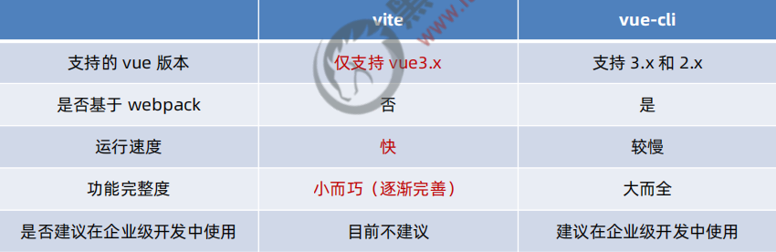

### 2. 创建 vite 的项目

按照顺序执行如下的命令，即可基于 vite 创建 vue 3.x 的工程化项目：

```bash
# 1.x
npm init vite-app 项目名称
# 3.x
npm create vite@latest 项目名称 -- --template vue

cd 项目名称
npm i
npm run dev
```

### 3. 梳理项目的结构

使用 vite 创建的项目结构如下：

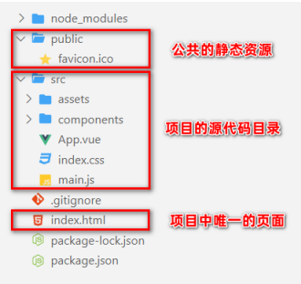

其中：

- node_modules 目录用来存放第三方依赖包
- public 是公共的静态资源目录
- **src** 是项目的源代码目录（程序员写的所有代码都要放在此目录下）
- .gitignore 是 Git 的忽略文件
- **index.html** 是 SPA 单页面应用程序中唯一的 HTML 页面
- package.json 是项目的包管理配置文件

在 **src** 这个项目源代码目录之下，包含了如下的文件和文件夹：

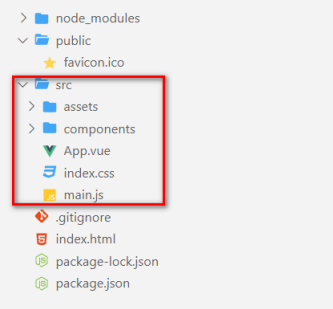

其中：

- **assets** 目录用来存放项目中所有的**静态资源文件**（css、fonts等）
- **components** 目录用来存放项目中所有的**自定义组件**
- **App.vue** 是项目的**根组件**
- **index.css** 是项目的**全局样式表**文件
- **main.js** 是整个项目的**打包入口文件**

### 4. vite 项目的运行流程

在工程化的项目中，vue 要做的事情很单纯：通过 **main.js** 把 **App.vue** 渲染到 **index.html** 的指定区域中。

其中：

1. **App.vue** 用来编写待渲染的**模板结构**
2. **index.html** 中需要预留一个 **el 区域**
3. **main.js** 把 App.vue 渲染到了 index.html 所预留的区域中

#### 1. 在 App.vue 中编写模板结构

清空 App.vue 的默认内容，并书写如下的模板结构：

```vue
<template>
  <div class="app-container">
    <h3>这是 App 根组件</h3>
  </div>
</template>
```

#### 2. 在 index.html 中预留 el 区域

打开 index.html 页面，确认预留了 el 区域：

```html
<!-- id 为 app 的 div，就是将来 vue 要控制的区域 -->
<div id="app"></div>
<script type="module" src="/src/main.js"></script>
```

#### 3. 在 main.js 中进行渲染

按照 **vue 3.x** 的**标准用法**，把 **App.vue 中的模板内容**渲染到 **index.html 页面的 el 区域**中：

```js
// 1. 从 vue 中按需导入 createApp 函数
// createApp 函数的作用：创建 vue 的 “单页面应用程序实例”
import { createApp } from 'vue'
// 2. 导入待渲染的 App 组件
import App from './App.vue'

// 3. 调用 createApp() 函数，返回值是 “单页面应用程序的实例”，同时把 App 组件作为参数传给 createApp 函数，表示要把 App 渲染到 index.html 页面上
const vue = createApp(App)

// 4. 调用 “单页面应用程序实例” 的 mount 方法，用来指定 vue 实例要控制的区域
vue.mount('#app')

funciton fun() {
  console.log('===')
}
```

## 2. vue 组件的构成

### 1 在 template 中定义根节点

在 **vue 2.x** 的版本中，`<template>` 节点内的 DOM 结构仅支持**单个根节点**：

```vue
<template>
  <div class="app-container">
    <h3>这是 App 根组件</h3>
  </div>
</template>
```

但是，在 **vue 3.x** 的版本中，`<template>` 中支持定义**多个根节点**：

```vue
<template>
  <!-- 在 vue 3.x 的版本中，<template> 中支持定义多个根节点 -->
  <h3>这是 App 根组件</h3>
  <h3>这是 App 的第二个根节点</h3>
</template>
```

### 2. 让 style 中支持 less 语法

安装依赖包：

```bash
npm i less -D
```

在 `<style>` 标签上添加 **lang="less"** 属性，即可使用 less 语法编写组件的样式：

```vue
<style lang="less">
  div {
    background-color: skyblue;

    span {
      color: pink;
    }
  }
</style>
```

## 3. 组件的基本使用

### 1. 使用全局注册组件

使用 vue.component() 方法注册的全局组件，**直接以标签的形式进行使用**即可，例如：

```js
import Count from "@/components/Count.vue";
vue.component("Count", Count);// 第一个参数是使用这个组件时用的标签名
```

### 2. Class 与 Style 绑定

在实际开发中经常会遇到**动态操作元素样式**的需求。因此，vue 允许开发者通过 **v-bind** 属性绑定指令，为元素动态绑定 **class 属性的值**和**行内的 style 样式**。

#### 1. 动态绑定 HTML 的 class

可以通过**三元表达式，动态的为元素绑定 class 的类名**。示例代码如下：

```vue
<template>
  <div :class="isItalic ? 'italic' : ''">动态绑定 HTML 的 class</div>
  <button @click="isItalic = !isItalic">改变 isItalic 的值</button>
</template>

<script>
export default {
  name: 'App',
  data() {
    return {
      isItalic: true
    }
  }
}
</script>

<style lang="less" scoped>
.italic {
  font-style: italic;
}
</style>
```

#### 2. 以数组语法绑定 HTML 的 class

如果元素需要动态**绑定多个** class 的类名，此时可以使用**数组的语法格式**：

```vue
<template>
  <div :class="[isItalic ? 'italic' : '', isRed ? 'red': '']">以数组语法绑定 HTML 的 class</div>
  <button @click="isItalic = !isItalic">改变 isItalic 的值</button>
  <button @click="isRed = !isRed">改变 isRed 的值</button>
</template>

<script>
export default {
  name: 'App',
  data() {
    return {
      isItalic: true,
      isRed: true
    }
  }
}
</script>

<style lang="less" scoped>
.italic {
  font-style: italic;
}
.red {
  color: red;
}
</style>
```

#### 3. 以对象语法绑定 HTML 的 class

使用**数组语法**动态绑定 class 会导致**模板结构臃肿**的问题。此时可以使用**对象语法**进行**简化**：

```vue
<template>
  <div :class="classObj">以对象语法绑定 HTML 的 class</div>
  <button @click="classObj.italic = !classObj.italic">改变 classObj.isItalic 的值</button>
  <button @click="classObj.red = !classObj.red">改变 classObj.isRed 的值</button>
</template>

<script>
export default {
  name: 'App',
  data() {
    return {
      // 对象中，属性名是 class 类名，值是布尔值
      classObj: {
        italic: true,
        red: true
      }
    }
  }
}
</script>

<style lang="less" scoped>
.italic {
  font-style: italic;
}
.red {
  color: red;
}
</style>
```

#### 4. 以对象语法绑定内联的 style

**:style** 的**对象语法**十分直观——看着非常像 CSS，但其实是一个 **JavaScript 对象**。CSS property 名可以用驼峰式（camelCase）或短横线分隔（kebab-case，记得用引号括起来）来命名：

```vue
<template>
  <div :style="{ color: 'skyblue', fontSize: '30px', 'background-color': 'black' }">以对象语法绑定内联的 style</div>
</template>
```

# 3. 组件基础（下）

## 1. props 验证

**对象类型的 props 节点**提供了多种数据验证方案，例如：

1. 基础的类型检查
2. 多个可能的类型
3. 必填项校验
4. 属性默认值
5. 自定义验证函数

### 1. 基础的类型检查

可以直接为组件的 prop 属性指定**基础的校验类型**，从而防止**组件的使用者**为其绑定**错误类型的数据**：

```vue
<script>
export default {
  props: {
    args1: String,// 字符串类型
    args2: Number,// 数字类型
    args3: Boolean,// 布尔类型
    args4: Array,// 数组类型
    args5: Object,// 对象类型
    args6: Date,// 日期类型
    args7: Function,// 函数类型
    args8: Symbol// 符号类型
  }
}
</script>
```

### 2. 多个可能的类型

如果某个 prop 属性值的**类型不唯一**，此时可以通过数组的形式，为其指定多个可能的类型，示例代码如下：

```vue
<script>
export default {
  props: {
    args: [String, Number]// 字符串或数字类型
  }
}
</script>
```

### 3. 必填项校验

如果**组件的某个 prop 属性是必填项**，必须让组件的使用者为其传递属性的值。此时，可以通过如下的方式将其设置为必填项：

```vue
<script>
export default {
  props: {
    args: {
      type: String,
      required: true// 当前属性的值是必填项，如果使用者没指定 args 属性的值，则在终端进行警告提示
    }
  }
}
</script>
```

### 4. 属性默认值

在封装组件时，可以为某个 prop 属性**指定默认值**。示例代码如下：

```vue
<script>
export default {
  props: {
    args: {
      default: 'aaa'// 如果使用者没有指定 args 的值，则 args 的值默认为 aaa
      type: String
    }
  }
}
</script>
```

### 5. 自定义验证函数

在封装组件时，可以为 prop 属性指定**自定义的验证函数**，从而**对 prop 属性的值进行更加精确的控制**：

```vue
<script>
export default {
  props: {
    args: {
      // 通过 validator 函数，对 args 属性的值进行校验，“属性的值” 可以通过形参 value 进行接收
      validator(value) {
        console.log(value)
        // 返回值为 true 表示验证通过，false 表示验证失败，终端会提示警告
        return value === 'aaa'
      }
    }
  }
}
</script>
```

## 2. 组件上的 v-model

### 1. 为什么需要在组件上使用 v-model

v-model 是双向数据绑定指令，当**需要维护组件内外数据的同步**时，可以在组件上使用 v-model 指令。示意图如下：

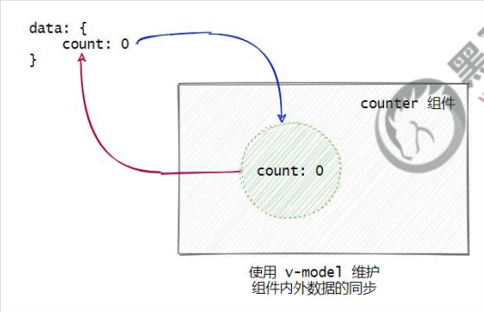

- **外界数据的变化**会**自动同步**到 counter 组件中
- counter 组件中数据的变化，也会**自动同步到外界**

### 2. 在组件上使用 v-model 的步骤

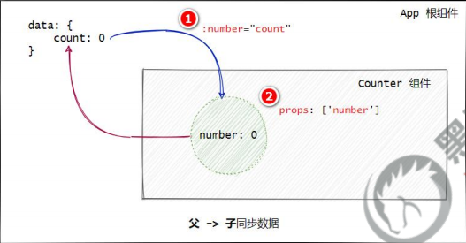

1. 父组件通过 **v-bind:** 属性绑定的形式，把数据传递给子组件
2. 子组件中，通过 **props** 接收父组件传递过来的数据

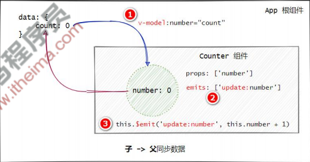

1. 在 v-bind: 指令之前添加 **v-model** 指令
2. 在子组件中声明 **emits** 自定义事件，格式为 **update:**xxx
3. 调用 **$emit()** 触发自定义事件，更新父组件中的数据

# 4. 组件高级（上）

## 1. 组件的生命周期

### 1. 组件中主要的生命周期函数

| 生命周期函数  | 执行时机                     | 所属阶段 | 执行次数 | 应用场景             |
| ------------- | ---------------------------- | -------- | -------- | -------------------- |
| **created**   | 组件在内存中创建完毕后       | 创建阶段 | 唯一1次  | 发 ajax 请求初始数据 |
| **mounted**   | 组件初次在页面中渲染完毕后   | 创建阶段 | 唯一1次  | 操作 DOM 元素        |
| **updated**   | 组件在页面中被重新渲染完毕后 | 运行阶段 | 0或多次  | -                    |
| **unmounted** | 组件被销毁后（页面和内存）   | 销毁阶段 | 唯一1次  | -                    |

> 注意：在实际开发中，**created** 是**最常用的**生命周期函数！

### 2. 组件中全部的生命周期函数

| 生命周期函数  | 执行时机                                   | 所属阶段 | 执行次数 | 应用场景             |
| ------------- | ------------------------------------------ | -------- | -------- | -------------------- |
| beforeCreate  | 在内存中开始创建组件之前 http://loclahost: | 创建阶段 | 唯一1次  | -                    |
| **created**   | 组件在内存中创建完毕后                     | 创建阶段 | 唯一1次  | 发 ajax 请求初始数据 |
| beforeMount   | 在把组件初次渲染到页面之前                 | 创建阶段 | 唯一1次  | -                    |
| **mounted**   | 组件初次在页面中渲染完毕后                 | 创建阶段 | 唯一1次  | 操作 DOM 元素        |
| beforeUpdate  | 在组件被重新渲染之前                       | 运行阶段 | 0或多次  | -                    |
| **updated**   | 组件在页面中被重新渲染完毕后               | 运行阶段 | 0或多次  | -                    |
| beforeUnmount | 在组件被销毁之前                           | 销毁阶段 | 唯一1次  | -                    |
| **unmounted** | 组件被销毁后（页面和内存）                 | 销毁阶段 | 唯一1次  | -                    |

> 疑问：为什么不在 **beforeCreate** 中发 ajax 请求初始数据？

### 3. 完整的生命周期图示

可以参考 vue 官方文档给出的 “**生命周期图示**”，进一步理解组件生命周期执行的过程：

https://v3.cn.vuejs.org/guide/instance.html#%E7%94%9F%E5%91%BD%E5%91%A8%E6%9C%9F%E5%9B%BE%E7%A4%BA


## 2. 组件之间的数据共享

### 1. 兄弟组件之间的数据共享

**兄弟组件之间**实现数据共享的方案是 **EventBus**。可以借助于第三方的包 **mitt** 来创建 **eventBus** 对象，从而实现兄弟组件之间的数据共享。示意图如下：

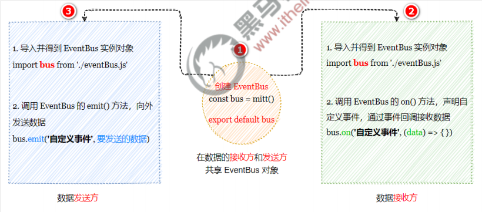

在项目中运行如下的命令，安装 mitt 依赖包：

```bash
npm i mitt
```

兄弟组件 A（发送方）：

```vue
<script>
import bus from './eventBus.js'

export default {
  data() {
    return {
      msg: "Hello Right.vue"
    }
  },
  methods: {
    sendMsg() {
      // 发送数据给兄弟组件，注意：不要 $ 符号
      bus.emit('share', this.msg)
    }
  }
}
</script>
```

eventBus.js：

```js
import mitt from 'mitt'

const bus = mitt()

export default bus
```

兄弟组件 B（接收方）：

```vue
<script>
import bus from './eventBus.js'

export default {
  created() {
    // 接收兄弟组件发送过来的数据，注意：不要 $ 符号
    bus.on('share', val => this.msgFromLeft = val)
  },
  data() {
    return {
      msgFromLeft: '',
    };
  }
}
</script>
```

### 2. 后代关系组件之间的数据共享

后代关系组件之间共享数据，指的是**父节点的组件**向其**子孙组件**共享数据。此时组件之间的嵌套关系比较复杂，可以使用 **provide** 和 **inject** 实现后代关系组件之间的数据共享。

#### 1. 父节点通过 provide 共享数据

父节点的组件可以通过 **provide 方法**，对其**子孙组件**共享数据：

```vue
<script>
export default {
  name: 'App',
  // provide 函数 return 的对象中，包含了 “要向子孙组件共享的数据”
  provide() {
    return {
      message: this.message
    }
  },
  data() {
    return {
      message: 'Hello'
    }
  }
}
</script>
```

#### 2. 子孙节点通过 inject 接收数据

子孙节点可以使用 **inject** 数组，接收父级节点**向下共享的数据**。示例代码如下：

```vue
<template>
  <div class="left-son-container">
    <h3>这是 LeftSon.vue 组件</h3>
    <p>App.vue 祖宗节点向下共享的 message 数据：{{ message }}</p>
  </div>
</template>

<script>
export default {
  // 接收 App.vue 祖宗节点向下共享的 message 数据
  inject: ['message']
}
</script>
```

#### 3. 父节点对外共享响应式的数据

父节点使用 provide 向下共享数据时，可以结合 **computed 函数**向下共享**响应式的数据**。示例代码如下：

```vue
<script>
import { computed } from 'vue'

export default {
  name: 'App',
  provide() {
    return {
      // 共享响应式的数据
      color: computed(() => this.color)
    }
  },
  data() {
    return {
      color: 'pink'
    }
  }
}
</script>
```

#### 4. 子孙节点使用响应式的数据

如果父级节点共享的是**响应式的数据**，则子孙节点必须以 .value 的形式进行使用。示例代码如下：

```vue
<template>
  <div class="left-son-container">
    <h3>这是 LeftSon.vue 组件</h3>
    <p>App.vue 祖宗节点向下共享的 color 数据：{{ color.value }}</p>
  </div>
</template>

<script>
export default {
  // 接收 App.vue 祖宗节点向下共享的 color 数据
  inject: ['color']
}
</script>
```

## 3. vue 3.x 中全局配置 axios

### 1. 为什么要全局配置 axios

在实际项目开发中，几乎每个组件中都会用到 axios 发起数据请求。此时会遇到如下两个问题：

1. 每个组件中都需要**导入 axios**（代码臃肿）
2. 每次发请求都需要填写**完整的请求路径**（不利于后期的维护）

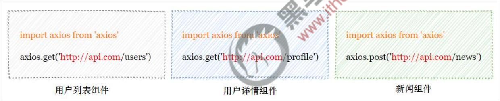

### 2. 如何全局配置 axios

在 **main.js** 入口文件中，通过 **app.config.globalProperties** 全局挂载 axios，示例代码如下：

```js
// 导入 axios
import axios from 'axios'

// 为 axios 配置请求的根路径
axios.defaults.baseURL = 'https://www.escook.cn/api'

// 将 axios 挂载为 vue 的全局自定义属性
vue.config.globalProperties.$http = axios
```

在组件中使用：

```vue
<script>
export default {
  created() {
    // 测试 axios
    this.$http.get('/cart').then(response => console.log(response.data))
  }
}
</script>
```

# 5. 组件高级（下）

## 1. 自定义指令

【bind 改成了 **mounted**】【update 改成了 **updated**】，其他根 vue2 一样

# 6. 路由

## 1. vue-router 的基本使用

### 1. vue-router 的版本

vue-router 目前有 **3.x** 的版本和 **4.x** 的版本。其中：

- vue-router 3.x 只能结合 **vue2** 进行使用
- vue-router 4.x 只能结合 **vue3** 进行使用

vue-router 的官方文档地址：https://router.vuejs.org/zh/

### 2. vue-router 4.x 的基本使用步骤

#### 1. 在项目中安装 vue-router

在 vue3 的项目中，只能安装并使用 vue-router 4.x。安装的命令如下：

```bash
npm i vue-router
```

#### 2. 创建路由模块

在 **src** 源代码目录下，新建 **router/index.js** 路由模块，并初始化如下的代码：

```js
// 1. 从 vue-router 中按需导入两个方法
// createRouter 方法用于创建路由的实例对象
// createWebHashHistory 用于指定路由的工作模式（hash 模式）
import { createRouter, createWebHashHistory } from 'vue-router'

// 2. 创建路由的实例对象
const router = new createRouter({
  // 3. 通过 history 属性指定路由的工作模式
  history: createWebHashHistory()
})

// 4. 向外共享路由的实例对象
export default router
```

#### 3. 导入并挂载路由模块

在 src/**main.js** 入口文件中，导入并挂载路由模块。示例代码如下：

```js
import { createApp } from 'vue';
import App from './App.vue';
import './index.css';
// 导入路由模块
import router from './components/router/index.js'

const vue = createApp(App);

// 挂载路由模块
vue.use(router)

vue.mount('#app');
```

#### 4. 声明路由链接和占位符

在 src/App.vue 组件中，使用 vue-router 提供的 **`<router-link>`** 和 **`<router-view>`** 声明路由链接和占位符：

```vue
<template>
  <!-- 1. 定义路由的占位符，# 省略 -->
  <router-link to="/home">首页</router-link>
  <router-link to="/movie">电影</router-link>
  <router-link to="/about">关于</router-link>
  <!-- 2. 定义路由的占位符 -->
  <router-view />
</template>
```

#### 5. 声明路由的匹配规则

在 src/router/index.js 路由模块中，通过 **routes 数组**声明路由的匹配规则。示例代码如下：

```js
// 导入需要使用路由切换展示的组件
import Home from '../Home.vue'
import Movie from '../Movie.vue'
import About from '../About.vue'

const router = new createRouter({
  history: createWebHashHistory(),
  // 声明路由规则
  routes: [
    { path: '/home', component: Home },
    { path: '/movie', component: Movie },
    { path: '/about', component: About }
  ]
})
```

## 2. vue-router 的高级用法

### 1. 路由高亮

可以通过如下的两种方式，将**激活的路由链接**进行高亮显示：

1. 使用**默认的**高亮 class 类
2. **自定义**路由高亮的 class 类

#### 1. 默认的高亮 class 类

被激活的路由链接，默认会应用一个叫做 **router-link-active** 的类名。开发者可以使用此**类名选择器**，为**激活的路由链接**设置高亮的样式：

```vue
<style lang="less" scoped>
.router-link-active {
  background-color: red;
  color: #fff;
  font-weight: bold;
}
</style>
```

#### 2. 自定义路由高亮的 class 类

在创建路由的实例对象时，开发者可以基于 **linkActiveClass** 属性，自定义路由链接被激活时所应用的类名：

```js
const router = new createRouter({
  // 默认的 router-link-active 路由高亮类名会被覆盖掉，改为 router-active
  linkActiveClass: 'router-active',
})
```

### 2. 命名路由

通过 **name 属性**为路由规则**定义名称**的方式，叫做**命名路由**。示例代码如下：

```js
const router = new createRouter({
  routes: [
    // 使用 name 属性为当前路由规则定义一个 “名称”
    { path: '/movie/:id', name: 'movie', component: Movie }
  ]
})
```

> 注意：命名路由的 **name 值不能重复，必须保证唯一性**！

#### 1. 使用命名路由实现声明式导航

为 `<router-link>` 标签动态绑定 to 属性的值，并通过 **name 属性**指定要跳转到的路由规则。期间还可以用 **params 属性**指定跳转期间要携带的路由参数。示例代码 如下：

```vue
<template>
	<h3>App 组件</h3>
  <!-- 使用命名路由实现声明式导航，相当于 to="/movie/4" -->
  <router-link :to="{ name: 'movie', params: {id: 4} }">电影4</router-link>
</template>
```

#### 2. 使用命名路由实现编程式导航

调用 **push 函数**期间指定一个**配置对象，name** 是要跳转到的路由规则、**params** 是携带的路由参数：

```vue
<template>
  <div class="home-container">
    <h3>Home 组件</h3>
    <!-- 使用命名路由实现编程式导航 -->
    <button @click="$router.push({ name: 'movie', params: {id: 4} })">跳转到电影4</button>
  </div>
</template>
```

# 7. vue 基础 - 综合案例

## 1. 组件库

### 1. 什么是 vue 组件库

在实际开发中，前端开发者可以把**自己封装的 .vue 组件**整理、打包、并**发布为 npm 的包**，从而供其他人下载和使用。这种可以直接下载并在项目中使用的现成组件，就叫做 vue **组件库**。

### 2. vue 组件库和 bootstrap 的区别

二者之间存在本质的区别：

- bootstrap 只提供了**纯粹的原材料**（css 样式、HTML 结构以及 JS 特效），需要由开发者做**进一步的组装**和**改造**
- vue 组件库是**遵循 vue 语法、高度定制**的现成组件，开箱即用

### 3. 最常用的 vue 组件库

1. **PC 端**
   - Element UI（https://element.eleme.cn/#/zh-CN）
   - View UI（http://v1.iviewui.com/）
2. **移动端**
   - Vant（https://vant-contrib.gitee.io/vant/v4/#/zh-CN）
   - Mint UI（http://mint-ui.github.io/#!/zh-cn）

### 4. Element UI

Element UI 是**饿了么前端团队**开源的一套 **PC 端 vue 组件库**。支持在 vue2 和 vue3 的项目中使用：

- **vue2** 的项目使用**旧版的** Element UI（https://element.eleme.cn/#/zh-CN）
- **vue3** 的项目使用**新版的** Element Plus（https://element-plus.gitee.io/zh-CN/）

## 2. axios 拦截器

### 1. 什么是拦截器

**拦截器**（英文：Interceptors）会在**每次发起 ajax 请求**和**得到响应**的时候自动被触发。

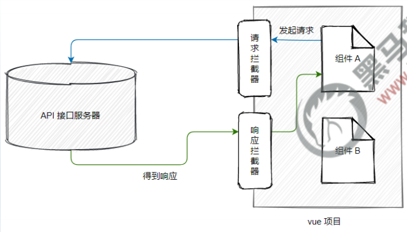

应用场景：

1. Token 身份认证
2. Loading 效果
3. etc...

### 2. 配置请求拦截器

通过 **axios.interceptors.request.use(成功的回调, 失败的回调)** 可以配置请求拦截器。示例代码如下：

```js
// 配置请求拦截器
axios.interceptors.request.use(config => {
  // Do something before request is sent
  return config
}, error => {
  // Do something with request error
  return Promise.reject(error)
})
```

> 注意：**失败的回调函数可以被省略**！

#### 1. 请求拦截器 – Token 认证

```js
// 导入 axios
import axios from 'axios'

// 为 axios 配置请求的根路径
axios.defaults.baseURL = 'https://www.escook.cn'

// 配置请求拦截器
axios.interceptors.request.use(config => {
  // 为当前请求配置 Token 认证字段
  config.headers.Authorization = 'Bearer xxx'
  return config
})

// 将 axios 挂载为 vue 的全局自定义属性
vue.config.globalProperties.$http = axios
```

#### 2. 请求拦截器 – 展示 Loading 效果

借助于 element-plus 提供的 **Loading 效果**组件（https://element-plus.gitee.io/zh-CN/component/loading.html#%E4%BB%A5%E6%9C%8D%E5%8A%A1%E7%9A%84%E6%96%B9%E5%BC%8F%E6%9D%A5%E8%B0%83%E7%94%A8）可以方便的实现 Loading 效果的展示：

```js
// 按需导入 Loading 效果组件
import { ElLoading } from 'element-plus'

// 声明变量，用来存储 ElLoading 组件的实例对象
let loadingInstance = null

// 配置请求拦截器
axios.interceptors.request.use(config => {
  // 调用 ElLoading 组件的 service() 方法，创建 Loading 组件的实例，并全屏展示 loading 效果
  loadingInstance = ElLoading.service({ fullscreen: true })
  return config
})
```

### 3. 配置响应拦截器

通过 **axios.interceptors.response.use(成功的回调, 失败的回调)** 可以配置响应拦截器。示例代码如下：

```js
配置响应拦截器
axios.interceptors.response.use(response => {
  // Any status code that lie within the range of 2xx cause this function to trigger
  // Do something with response data
  return response
}, error => {
  // Any status code that falls outside the range of 2xx cause this function to trigger
  // Do something with response error
  return Promise.reject(error)
})
```

> 注意：**失败的回调函数可以被省略**！

#### 1. 响应拦截器 – 关闭 Loading 效果

调用 **ElLoading 实例**提供的 **close()** 方法即可**关闭 Loading 效果**，示例代码如下：

```js
// 配置响应拦截器
axios.interceptors.response.use(response => {
  // 调用 ElLoading 实例的 close() 方法即可关闭 Loading 效果
  loadingInstance.close()
  return response
})
```

## 3. proxy 跨域代理

### 1. 回顾：接口的跨域问题

vue 项目运行的地址：http://localhost:8080/

API 接口运行的地址：https://www.escook.cn/api/users

由于当前的 API 接口**没有开启 CORS** 跨域资源共享，因此默认情况下，上面的接口**无法请求成功**！

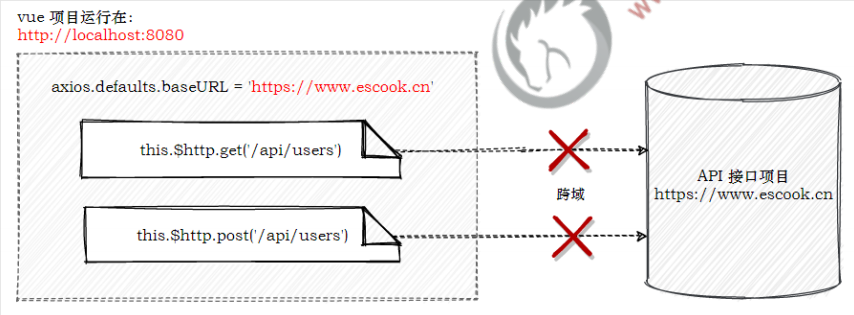

### 2. 通过代理解决接口的跨域问题

通过 vue-cli 创建的项目在遇到接口跨域问题时，可以通过**代理**的方式来解决：

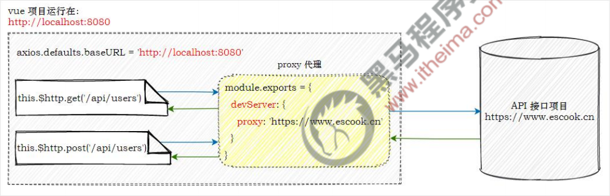

1. 把 axios 的**请求根路径**设置为 **vue 项目的运行地址**（接口请求不再跨域）
2. vue 项目发现请求的接口不存在，把请求**转交给 proxy 代理**
3. 代理把请求根路径**替换为** devServer.proxy 属性的值，**发起真正的数据请求**
4. 代理把请求到的数据，**转发给 axios**

### 3. 在项目中配置 proxy 代理

步骤1，在 **main.js** 入口文件中，把 **axios 的请求根路径**改造为**当前 web 项目的根路径**：

```js
// 把 https://www.escook.cn 改成了 http://localhost:8080
axios.defaults.baseURL = 'http://localhost:8080'
```

步骤2，在**项目根目录**下创建 **vue.config.js** 的配置文件，并声明如下的配置：

```js
const { defineConfig } = require('@vue/cli-service')

module.exports = defineConfig({
  transpileDependencies: true,
  // 通过代理解决接口的跨域问题
  devServer: {
    // 当项目在开发调式阶段，会将任何未知请求（没有匹配到静态文件的请求）代理到 https://www.escook.cn
    proxy: 'https://www.escook.cn'
  }
})
```

> 注意：
>
> 1. **devServer.proxy** 提供的代理功能，**仅在开发调试阶段生效**
> 2. 项目上线发布时，依旧需要 API 接口服务器**开启 CORS** 跨域资源共享

# 3. Vuex

## 1. Vuex 概述

### 1. 组件之间共享数据的方式

父向子传值：**v-bind 属性绑定**

子向父传值：**v-on 事件绑定**

- $on 接收数据的那个组件
- $emit 发送数据的那个组件

### 2. Vuex 是什么

**Vuex** 是实现组件全局状态（数据）管理的一种机制，可以方便的实现组件之间数据的共享。

在企业级的 vue 项目开发中，vuex 可以让组件之间的数据共享变得**高效、清晰**、且**易于维护**。

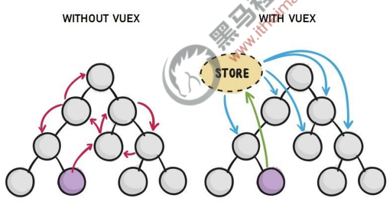

### 3. 使用 Vuex 统一管理状态的好处

1. 能够在 vuex 中集中管理共享的数据，易于开发和后期维护
2. 能够高效地实现组件之间的数据共享，提高开发效率
3. 存储在 vuex 中的数据都是响应式的，能够实时保持数据与页面的同步

### 4. 什么样的数据适合存储到 Vuex 中

一般情况下，只有组件之间共享的数据，才有必要存储到 vuex 中；对于组件中的私有数据，依旧存储在组件自身的 data 中即可。

## 2. Vuex 的基本使用

### 1. 安装 vuex 依赖包

```bash
npm i vuex
```

### 2. 导入 vuex 包

```js
// vue3.x
import { createStore } from 'vuex'

// vue2.x
import Vue from 'vue'
import Vuex from 'vuex'

Vue.use(Vuex)
```

### 3. 创建 store 对象

```js
// vue3.x
// 创建 store 数据源，提供唯一的公共数据
export default createStore({
  // state 中存放的就是全局共享的数据
  state: {
    count: 0
  }
})

// vue2.x
export default new Vuex.Store({})
```

### 4. 将 store 对象挂载到 vue 实例中

```js
// vue3.x
import { createApp } from 'vue'
import App from './App.vue'
import store from './store'

// 将创建的共享数据对象，挂载到 Vue 实例中
// 所有的组件，就可以直接从 store 中获取全局的数据了
createApp(App).use(store).mount('#app')

// vue2.x
import store from './store/store.js'

new Vue({store}).$mount()
```

## 3. Vuex 的核心概念

### 1. 核心概念概述

Vuex 中的主要核心概念如下：

- state
- getters
- mutations
- actions

### 2. state

state 提供唯一的公共数据源，所有共享的数据都要统一放到 store 的 state 中进行存储。

定义 state：

```js
export default createStore({
  // state 中存放的就是全局共享的数据
  state: {
    count: 0
  }
})
```

**访问 state 中数据的第一种方式**

```js
// 访问 count
this.$store.state.count
```

**访问 state 中数据的第二种方式**

```vue
<script>
// 1. 从 vuex 中按需导入 mapState 函数
import { mapState } from 'vuex'

export default {
  computed: {
    // 2. 将全局数据，映射为当前组件的计算属性
    ...mapState(['count'])
  }
}
</script>
```

### 3. getters

getters 用于对 store 中的数据进行加工处理形成新的数据。

1. getters 可以对 store 中已有的数据加工处理之后形成新的数据，类似 Vue 的计算属性。
2. store 中数据发生变化，getters 的数据也会跟着变化。

定义 getters：

```js
export default createStore({
  state: {
    count: 0
  },
  // getters 用于对 state 中的数据进行加工处理形成新的数据
  getters: {
    getCount(state) {
      return `当前最新的数量是【${state.count}】`
    }
  }
})
```

**访问 getters 的第一种方式**

```js
// 访问 getCount()
this.$store.getters.getCount
```

**访问 getters 的第二种方式**

```vue
<script>
// 1. 从 vuex 中按需导入 mapGetters 函数
import { mapGetters } from 'vuex'

export default {
  computed: {
    // 2. 将指定的 getters 函数，映射为当前组件的计算属性
    ...mapGetters(['getCount'])
  }
}
</script>
```

### 4. mutations

mutations 用于变更 store 中的数据。

1. 只能通过 mutations 变更 store 数据，不可以直接操作 stroe 中的数据。
2. 通过这种方式虽然操作起来稍微繁琐一些，但是可以集中监控所有数据的变化。

**触发 mutations 的第一种方式**

定义 mutations：

```js
export default createStore({
  // mutations 中的函数用于变更 state 中的数据
  mutations: {
    // 定义 mutation 函数 add
    add(state) {
      state.count++
    }
  }
})
```

触发 mutations：

```js
// 调用 mutations 里的 add() 函数
this.$store.commit('add')
```

可以在触发 mutations 时传递参数：

```js
export default createStore({
  mutations: {
    // 传递参数，step 是传递过来的参数
    addN(state, step) {
      state.count += step
    }
  }
})
```

触发 mutations：

```js
// 调用 mutations 里的 addN() 函数，并传递参数 5
this.$store.commit('addN', 5)
```

**触发 mutations 的第二种方式**

```vue
<script>
// 1. 从 vuex 中按需导入 mapMutations 函数
import { mapMutations } from 'vuex'

export default {
  methods: {
    // 2. 将指定的 actions 函数，映射为当前组件的 methods 函数
    ...mapActions(['addAsync', 'addNAsync'])
  }
}
</script>
```

### 5. actions

actions 用于处理异步任务。

如果通过异步操作变更数据，必须通过 actions，而不能使用 mutations，但是在 action 中还是要通过触发 mutations 的方式间接变更数据。

**触发 actions 的第一种方式**

定义 actions：

```js
export default createStore({
  mutations: {
    add(state) {
      state.count++
    }
  },
  // actions 中的函数用于处理异步任务
  actions: {
    addAsync(context) {
      // 1 秒后调用 mutations 里的 add() 函数
      setTimeout(() => context.commit('add'), 1000)
    }
  }
})
```

触发 actions：

```js
// 调用 actions 里的 addAsync() 函数
this.$store.dispatch('addAsync')
```

触发 actions 异步任务时携带参数：

```js
export default createStore({
  mutations: {
    addN(state, step) {
      state.count += step
    }
  },
  // actions 中的函数用于处理异步任务
  actions: {
    addNAsync(context, step) {
      setTimeout(() => context.commit('addN', step), 1000)
    }
  }
})
```

触发 actions：

```js
// 调用 actions 里的 addNAsync() 函数，并传递参数 5
this.$store.dispatch('addNAsync', 5)
```

**触发 actions 的第二种方式**

```vue
<script>
// 1. 从 vuex 中按需导入 mapActions 函数
import { mapActions } from 'vuex'

export default {
  methods: {
    // 2. 将指定的 actions 函数，映射为当前组件的 methods 函数
    ...mapActions(['addAsync', 'addNAsync'])
  }
}
</script>
```

## 4. vuex 中的 store 分模块管理

需要在 store/index.js 中引入各个模块，为了解决不同模块命名冲突的问题，将不同模块设置 **namespaced: true**，之后在不同页面中引入 stats、mutations、actions、getter 时，**需要加上所属的模块名**

store/index.js 文件：

```js
import { createStore } from 'vuex'
import moduleCart from './modules/cart.js' // 导入外部模块

export default createStore({
  state: {},
  getters: {},
  mutations: {},
  actions: {},
  // 外部模块放到 modules 节点中
  modules: {
    moduleCart
  }
})
```

store/modules/cart.js 文件：

```js
export default {
  namespaced: true, // 为当前模块开启命名空间，在访问这个模块的数据的时候要指定模块名
  state: {
    cart: [...]
  },
	getters: {
    getCart(state) {...}
  },
  mutations: {
    addToCart(state) {...}
  },
  actions: {
    addToCartAsync(context) {...}
  }
}
```

访问 store/modules/cart.js 文件里的数据：

```vue
<script>
import { mapState, mapMutations, mapActions, mapGetters } from 'vuex'

export default {
  computed: {
    ...mapState('moduleCart', ['cart']), // moduleCart 是 modules 节点中指定的模块名
    ...mapGetters('moduleCart', ['getCart']) // moduleCart 是 modules 节点中指定的模块名
  },
  methods: {
    ...mapMutations('moduleCart', ['addToCart']), // moduleCart 是 modules 节点中指定的模块名
    ...mapActions('moduleCart', ['addToCartAsync']) // moduleCart 是 modules 节点中指定的模块名
  }
}
</script>
```

# 4. mixins 混入

不再推荐

在 Vue 2 中，mixins 是创建可重用组件逻辑的主要方式。尽管在 Vue 3 中保留了 mixins 支持，但对于组件间的逻辑复用，[Composition API](https://cn.vuejs.org/guide/reusability/composables.html) 是现在更推荐的方式。

# 5. 单文件组件 `<script setup>`

`<script setup` 是在单文件组件（SFC）中使用组合式 API 的编译时语法糖。当同时使用 SFC 与组合式 API 时该语法是默认推荐。相比于普通的 `<script>` 语法，它具有更多优势：

- 更少的样板内容，更简洁的代码。
- 能够使用纯 TypeScript 声明 props 和自定义事件。
- 更好的运行时性能（其模板会被编译成同一作用域内的渲染函数，避免了渲染上下文代理对象）。
- 更好的 IDE 类型推导性能（减少了语言服务器从代码中抽取类型的工作）。

## 1. 基本语法

要启用该语法，需要在 `<script>` 代码块上添加 `setup` attribute：

```vue
<script setup>
console.log('hello script setup')
</script>
```

> 里面的代码会被编译成组件 `setup()` 函数的内容。这意味着与普通的 `<script>` 只在组件被首次引入的时候执行一次不同，`<script setup>` 中的代码会在**每次组件实例被创建的时候执行**。

### 1. 顶层的绑定会被暴露给模板

当使用 `<script setup>` 的时候，任何在 `<script setup>` 声明的顶层的绑定 (包括变量，函数声明，以及 import 导入的内容) 都能在模板中直接使用：

```vue
<template>
  <button @click="log">{{ msg }}</button>
</template>

<script setup>
// 变量
const msg = 'Hello!'

// 函数
function log() {
  console.log(msg)
}
</script>
```

import 导入的内容也会以同样的方式暴露。这意味着我们可以在模板表达式中直接使用导入的 helper 函数，而不需要通过 `methods` 选项来暴露它：

```vue
<template>
  <div>{{ capitalize('hello') }}</div>
</template>

<script setup>
import { capitalize } from './helpers'
</script>
```

## 2. 响应式

响应式状态需要明确使用[响应式 API](https://cn.vuejs.org/api/reactivity-core.html) 来创建。和 `setup()` 函数的返回值一样，ref 在模板中使用的时候会自动解包：

### 1. ref 定义基本数据类型

```vue
<template>
  <!-- template 中读写可以直接使用 count（自动解包） -->
  <button @click="count++">{{ count }}</button>
</template>

<script setup>
import { ref } from 'vue'

const count = ref(0)
console.log(count.value) // script 中读写必须 count.value
</script>
```

### 2. reactive 定义复杂数据类型

```vue
<template>
  <button @click="user.age++">{{ user }}</button>
</template>

<script setup>
import { reactive } from 'vue'

const user = reactive({
  name: 'zhangsan',
  age: 18
})
console.log(user)
</script>
```

### 3. 模拟 this.$refs 的使用

```vue
<template>
	<div ref="divRef"></div>
</template>

<script setup>
import { ref, onMounted } from 'vue'
  
const divRef = ref() // 变量名与 ref="divRef" 一致

onMounted(() => {
  console.log(divRef.value) // Proxy {…}
})
</script>
```

## 3. 使用组件

`<script setup>` 范围里的值也能被直接作为自定义组件的标签名使用：

```vue
<template>
  <MyComponent/>
</template>

<script setup>
import MyComponent from './MyComponent.vue'
</script>
```

> 这里 `MyComponent` 应当被理解为像是在引用一个变量。如果你使用过 JSX，此处的心智模型是类似的。其 kebab-case 格式的 `<my-component>` 同样能在模板中使用——不过，我们强烈建议使用 PascalCase 格式以保持一致性。同时这也有助于区分原生的自定义元素。

### 1. 动态组件

由于组件是通过变量引用而不是基于字符串组件名注册的，在 `<script setup>` 中要使用动态组件的时候，应该使用动态的 `:is` 来绑定：

```vue
<template>
  <component :is="Foo"/>
  <component :is="someCondition ? Foo : Bar"/>
</template>

<script setup>
import Foo from './Foo.vue'
import Bar from './Bar.vue'
</script>
```

> 请注意组件是如何在三元表达式中被当做变量使用的。

### 2. 递归组件

一个单文件组件可以通过它的文件名被其自己所引用。例如：名为 `FooBar.vue` 的组件可以在其模板中用 `<FooBar/>` 引用它自己。

请注意这种方式相比于导入的组件优先级更低。如果有具名的导入和组件自身推导的名字冲突了，可以为导入的组件添加别名：

```js
import { FooBar as FooBarChild } from './components'
```

### 3. 命名空间组件

可以使用带 `.` 的组件标签，例如 `<Foo.Bar>` 来引用嵌套在对象属性中的组件。这在需要从单个文件中导入多个组件的时候非常有用：

```vue
<template>
  <Form.Input>
    <Form.Label>label</Form.Label>
  </Form.Input>
</template>

<script setup>
import * as Form from './form-components'
</script>
```

## 4. 使用自定义指令

全局注册的自定义指令将正常工作。本地的自定义指令在 `<script setup>` 中不需要显式注册，但他们必须遵循 `vNameOfDirective` 这样的命名规范：

```vue
<template>
  <h1 v-my-directive>This is a Heading</h1>
</template>

<script setup>
const vMyDirective = {
  beforeMount: el => {
    // 在元素上做些操作
  }
}
</script>
```

如果指令是从别处导入的，可以通过重命名来使其符合命名规范：

```vue
<script setup>
import { myDirective as vMyDirective } from './MyDirective.js'
</script>
```

## 5. `defineProps()` 和 `defineEmits()`

为了在声明 `props` 和 `emits` 选项时获得完整的类型推导支持，我们可以使用 `defineProps` 和 `defineEmits` API，它们将自动地在 `<script setup>` 中可用：

```vue
<script setup>
const props = defineProps({
  foo: String
})

const emit = defineEmits(['change', 'delete'])
// setup 代码
</script>
```

- `defineProps` 和 `defineEmits` 都是只能在 `<script setup>` 中使用的**编译器宏**。他们不需要导入，且会随着 `<script setup>` 的处理过程一同被编译掉。
- `defineProps` 接收与 `props` 选项相同的值，`defineEmits` 接收与 `emits` 选项相同的值。
- `defineProps` 和 `defineEmits` 在选项传入后，会提供恰当的类型推导。
- 传入到 `defineProps` 和 `defineEmits` 的选项会从 setup 中提升到模块的作用域。因此，传入的选项不能引用在 setup 作用域中声明的局部变量。这样做会引起编译错误。但是，它*可以*引用导入的绑定，因为它们也在模块作用域内。

如果使用了 TypeScript，[使用纯类型声明来声明 prop 和 emit](https://cn.vuejs.org/api/sfc-script-setup.html#typescript-only-features) 也是可以的。

## 6. `defineExpose`

使用 `<script setup>` 的组件是**默认关闭**的——即通过模板引用或者 `$parent` 链获取到的组件的公开实例，**不会**暴露任何在 `<script setup>` 中声明的绑定。

可以通过 `defineExpose` 编译器宏来显式指定在 `<script setup>` 组件中要暴露出去的属性：

```vue
<script setup>
import { ref } from 'vue'

const a = 1
const b = ref(2)

defineExpose({
  a,
  b
})
</script>
```

> 当父组件通过模板引用的方式获取到当前组件的实例，获取到的实例会像这样 `{ a: number, b: number }`（ref 会和在普通实例中一样被自动解包）

## 7. `useSlots()` 和 `useAttrs()`

在 `<script setup>` 使用 `slots` 和 `attrs` 的情况应该是相对来说较为罕见的，因为可以在模板中直接通过 `$slots` 和 `$attrs` 来访问它们。在你的确需要使用它们的罕见场景中，可以分别用 `useSlots` 和 `useAttrs` 两个辅助函数：

```vue
<script setup>
import { useSlots, useAttrs } from 'vue'

const slots = useSlots()
const attrs = useAttrs()
</script>
```

> `useSlots` 和 `useAttrs` 是真实的运行时函数，它的返回与 `setupContext.slots` 和 `setupContext.attrs` 等价。它们同样也能在普通的组合式 API 中使用。

## 8. 与普通的 `<script>` 一起使用

`<script setup>` 可以和普通的 `<script>` 一起使用。普通的 `<script>` 在有这些需要的情况下或许会被使用到：

- 声明无法在 `<script setup>` 中声明的选项，例如 `inheritAttrs` 或插件的自定义选项。
- 声明模块的具名导出（named exports）。
- 运行只需要在模块作用域执行一次的副作用，或是创建单例对象。

```vue
<script>
// 普通 <script>, 在模块作用域下执行（仅一次）
runSideEffectOnce()

// 声明额外的选项
export default {
  inheritAttrs: false,
  customOptions: {}
}
</script>

<script setup>
// 在 setup() 作用域中执行（对每个实例皆如此）
</script>
```

## 9. 顶层 `await`

`<script setup>` 中可以使用顶层 await。结果代码会被编译成 async setup()：

```vue
<script setup>
const post = await fetch(`/api/post/1`).then(r => r.json())
</script>
```

> 另外，await 的表达式会自动编译成在 `await` 之后保留当前组件实例上下文的格式。
>
> **注意**：`async setup()` 必须与 [`Suspense` 内置组件](https://cn.vuejs.org/guide/built-ins/suspense.html)组合使用，`Suspense` 目前还是处于实验阶段的特性，会在将来的版本中稳定。

## 10. 针对 TypeScript 的功能

### 1. 针对类型的 props/emit 声明

props 和 emit 都可以通过给 `defineProps` 和 `defineEmits` 传递纯类型参数的方式来声明：

```typescript
const props = defineProps<{
  foo: string
  bar?: number
}>()

const emit = defineEmits<{
  (e: 'change', id: number): void
  (e: 'update', value: string): void
}>()
```

- `defineProps` 或 `defineEmits` 要么使用运行时声明，要么使用类型声明。同时使用两种声明方式会导致编译报错。

- 使用类型声明的时候，静态分析会自动生成等效的运行时声明，从而在避免双重声明的前提下确保正确的运行时行为。

  - 在开发模式下，编译器会试着从类型来推导对应的运行时验证。例如这里从 `foo: string` 类型中推断出 `foo: String`。如果类型是对导入类型的引用，这里的推导结果会是 `foo: null`（与 `any` 类型相等），因为编译器没有外部文件的信息。
  - 在生产模式下，编译器会生成数组格式的声明来减少打包体积（这里的 props 会被编译成 `['foo', 'bar']`）。
  - 生成的代码仍然是有着合法类型的 TypeScript 代码，它可以在后续的流程中被其他工具处理。

- 截至目前，类型声明参数必须是以下内容之一，以确保正确的静态分析：

  - 类型字面量
  - 在同一文件中的接口或类型字面量的引用

  现在还不支持复杂的类型和从其他文件进行类型导入，但我们有计划在将来支持。

### 2. 使用类型声明时的默认 props 值

针对类型的 `defineProps` 声明的不足之处在于，它没有可以给 props 提供默认值的方式。为了解决这个问题，我们还提供了 `withDefaults` 编译器宏：

```typescript
export interface Props {
  msg?: string
  labels?: string[]
}

const props = withDefaults(defineProps<Props>(), {
  msg: 'hello',
  labels: () => ['one', 'two']
})
```

> 上面代码会被编译为等价的运行时 props 的 `default` 选项。此外，`withDefaults` 辅助函数提供了对默认值的类型检查，并确保返回的 `props` 的类型删除了已声明默认值的属性的可选标志。

## 11. 限制

由于模块执行语义的差异，`<script setup>` 中的代码依赖单文件组件的上下文。当将其移动到外部的 `.js` 或者 `.ts` 文件中的时候，对于开发者和工具来说都会感到混乱。因此，**`<script setup>`** 不能和 `src` attribute 一起使用。

## 12. 全局挂载属性

```js
import axios from 'axios'

// 全局挂载
vue.provide('$http', axios)
```

```vue
<script setup>
import { inject, onMounted } from 'vue'
 
// 导入挂载的 axios
const http = inject("$http")
 
onMounted(() => {
  http.get('http://localhost:8080/get')
})
</script>
```

## 13. 使用 this.$router 和 this.$route

在 setup 里边因为不能访问 this，所以也没有 `this.$router` 和 `this.$route`。但是我们可以通过 vue-router 提供的函数来进行访问 router：

- **useRouter**

  返回 router 实例。相当于在模板中使用 $router。必须在 setup() 中调用。

- **useRoute**

  返回当前路由地址。相当于在模板中使用 $route。必须在 setup() 中调用。

**用法示例**：

```vue
<script setup>
import { useRouter, useRoute } from 'vue-router'

const router = useRouter()
const route = useRoute()

function toTarget() {
  router.push({
    path: '/target' // 目标路由地址
    query: {
      ...route.query // 路由传参
    }
  })
}
</script>
```

## 14. 生命周期

生命周期函数有：onBeforeMount、onMounted、onBeforeUpdate、onUpdated、onBeforeUnmount、onUnmounted、onErrorCaptured、onRenderTracked、onRenderTriggered、onActivated、onDeactivated，**没有 beforeCreate 和 created**。

```vue
<script setup>
import { onBeforeMount, onMounted, onBeforeUpdate, onUpdated, onBeforeUnmount, onUnmounted, onRenderTracked, onRenderTriggered } from 'vue'

onBeforeMount(() => console.log('onBeforeMount ====> beforeMount'))
onMounted(() => console.log('onMounted ====> mounted'))
onBeforeUpdate(() => console.log('onBeforeUpdate ====> beforeUpdate'))
onUpdated(() => console.log('onUpdated ====> updated'))
onBeforeUnmount(() => console.log('onBeforeUnmount ====> beforeUnmount'))
onUnmounted(() => console.log('onUnmounted ====> unmounted'))
// 新增两个生命周期函数
onRenderTracked(({ key, type, target }) => { // 每次渲染后重新收集响应式依赖
  // 跟踪虚拟 DOM 重新渲染时调用，钩子接收 debugger event 作为参数，此事件告诉你哪个操作跟踪了组件以及该操作的目标对象和键。
  // type：set/get 操作
  // key：追踪的键
  // target：重新渲染后的键
  console.log('onRenderTracked', key, type, target)
})
onRenderTriggered(({ key, type, target }) => { // 每次触发页面重新渲染时自动执行
  // 当虚拟 DOM 重新渲染被触发时调用，和 renderTracked 类似，接收 debugger event 作为参数。
  // 此事件告诉你是什么操作触发了重新渲染，以及该操作的目标对象和键。
  console.log('onRenderTriggered', key, type, target)
})
</script>
```

## 15. 使用 computed 计算属性

```vue
<script setup>
import { ref, computed } from 'vue'

const firstName = ref('Hello')
const lastName = ref('orld')

const fullName = computed(() => firstName.value + lastName.value) // 返回 firstName + lastName
</script>
```

## 16. 使用 watch 侦听器

```vue
<script setup>
import { ref, watch } from 'vue'

const count = ref(0)

watch(count, (newVal, oldVal) => { // 监听 count 属性
  console.log(newVal, oldVal)
}, { immediate: true }) // 表示页面初次渲染好之后，就立即触发当前的 watch 侦听器
</script>
```

# 6. Vite

## 1. 总览

Vite（法语意为 "快速的"，发音 `/vit/`，发音同 "veet"）是一种新型前端构建工具，能够显著提升前端开发体验。它主要由两部分组成：

- 一个开发服务器，它基于 [原生 ES 模块](https://developer.mozilla.org/en-US/docs/Web/JavaScript/Guide/Modules) 提供了 [丰富的内建功能](https://cn.vitejs.dev/guide/features.html)，如速度快到惊人的 [模块热更新（HMR）](https://cn.vitejs.dev/guide/features.html#hot-module-replacement)。
- 一套构建指令，它使用 [Rollup](https://rollupjs.org/) 打包你的代码，并且它是预配置的，可输出用于生产环境的高度优化过的静态资源。

Vite 意在提供开箱即用的配置，同时它的 [插件 API](https://cn.vitejs.dev/guide/api-plugin.html) 和 [JavaScript API](https://cn.vitejs.dev/guide/api-javascript.html) 带来了高度的可扩展性，并有完整的类型支持。

你可以在 [为什么选 Vite](https://cn.vitejs.dev/guide/why.html) 中了解更多关于项目的设计初衷。

## 2. 搭建 Vite 项目

> 兼容性注意
>
> Vite 需要 [Node.js](https://nodejs.org/en/) 版本 14.18+，16+。然而，有些模板需要依赖更高的 Node 版本才能正常运行，当你的包管理器发出警告时，请注意升级你的 Node 版本。

使用 npm：

```sh
npm create vite@latest
```

使用 yarn：

```sh
yarn create vite
```

使用 pnpm：

```sh
pnpm create vite
```

然后按照提示操作即可！

你还可以通过附加的命令行选项直接指定项目名称和你想要使用的模板。例如，要构建一个 Vite + Vue 项目，运行：

```sh
# npm 6.x
npm create vite@latest 项目名称 --template vue

# npm 7.x+
npm create vite@latest 项目名称 -- --template vue

# yarn
yarn create vite 项目名称 --template vue

# pnpm
pnpm create vite 项目名称 --template vue
```

更多模板：`vue`、`vue-ts`、`react`、`react-ts`、`vanilla`、`vanilla-ts`、`preact`、`preact-ts`、`lit`、`lit-ts`、`svelte`、`svelte-ts`

## 3. 环境变量与模式

- `vite serve` 时是 `development` 开发模式，`vite build` 时是 `production` 生产模式。
- 分别创建配置文件：`.env.development`、`.env.production`
- **注意：**命名规范 `VITE_` 为前缀的变量才会暴露给经过 `vite` 处理的代码

.env.development 文件：

```
# 开发环境
ENV = development

# 基本路径
VITE_APP_BASE_URL = http://localhost:3000
```

.env.production 文件：

```
# 生产环境
ENV = production

# 基本路径
VITE_APP_BASE_URL = http://127.0.0.1:3000
```

读取环境变量：

```js
console.log(import.meta.env.VITE_APP_BASE_URL)
```

# 7. Pinia

## 1. 介绍

Pinia [最初是在 2019 年 11 月左右重新设计使用](https://github.com/vuejs/pinia/commit/06aeef54e2cad66696063c62829dac74e15fd19e) [Composition API](https://github.com/vuejs/composition-api)。从那时起，最初的原则仍然相同，但 Pinia 对 Vue 2 和 Vue 3 都有效，并且不需要您使用组合 API。除了安装和 SSR 之外，两者的 API 都是相同的，并且这些文档针对 Vue 3，并在必要时提供有关 Vue 2 的注释，以便 Vue 2 和 Vue 3 用户可以阅读！

## 2. 为什么要使用 Pinia？

Pinia 是 Vue 的存储库，它允许您跨组件/页面共享状态。如果您熟悉 Composition API，您可能会认为您已经可以通过一个简单的 `export const state = reactive({})`，这对于单页应用程序来说是正确的，但如果它是服务器端呈现的，**会使您的应用程序暴露于安全漏洞**。但即使在小型单页应用程序中，您也可以从使用 Pinia 中获得很多好处：

- dev-tools 支持
  - 跟踪动作、突变的时间线
  - Store 出现在使用它们的组件中
  - time travel 和 更容易的调试
- 热模块更换
  - 在不重新加载页面的情况下修改您的 Store
  - 在开发时保持任何现有状态
- 插件：使用插件扩展 Pinia 功能
- 为 JS 用户提供适当的 TypeScript 支持或 **autocompletion**
- 服务器端渲染支持

## 3. 安装

用你最喜欢的包管理器安装 `pinia`：

```sh
npm i pinia
# 或者使用 yarn
yarn add pinia
```

> 提示
>
> 如果您的应用使用 Vue 2，您还需要安装组合 API：`@vue/composition-api`。 如果您使用 Nuxt，则应遵循 [这些说明](https://pinia.web3doc.top/ssr/nuxt.html)。
>
> 如果你使用的是 Vue CLI，你可以试试这个 [**非官方插件**](https://github.com/wobsoriano/vue-cli-plugin-pinia)。

创建一个 pinia（根存储）并将其传递给应用程序：

main.js 文件：

```js
import { createPinia } from 'pinia'

app.use(createPinia())
```

如果您使用的是 Vue 2，您还需要安装一个插件并将创建的 `pinia` 注入应用程序的根目录：

```js
import { createPinia, PiniaVuePlugin } from 'pinia'

Vue.use(PiniaVuePlugin)

new Vue({
  el: '#app',
  pinia: createPinia()
})
```

这也将添加 devtools 支持。在 Vue 3 中，仍然不支持时间旅行和编辑等一些功能，因为 vue-devtools 尚未公开必要的 API，但 devtools 具有更多功能，并且整体开发人员体验要好得多。在 Vue 2 中，Pinia 使用 Vuex 的现有接口（因此不能与它一起使用）。

## 4. 核心概念

### 1. 定义一个 Store

在深入了解核心概念之前，我们需要知道 Store 是使用 `defineStore()` 定义的，并且它需要一个**唯一**名称，作为第一个参数传递：

```js
import { defineStore } from 'pinia'

// 第一个参数是应用程序中 store 的唯一 id
export const useUserStore = defineStore('user', {
  // other options...
})
```

这个 *name*，也称为 *id*，是必要的，Pinia 使用它来将 store 连接到 devtools。 将返回的函数命名为 *use...* 是跨可组合项的约定，以使其符合你的使用习惯。

#### 使用 store

我们正在*定义*一个 store，因为在 `setup()` 中调用 `useStore()` 之前不会创建 store：

```vue
<script lang="ts" setup>
import { useUserStore } from '@/store/user'

const userStore = useUserStore()
</script>
```

您可以根据需要定义任意数量的 store ，并且**您应该在不同的文件中定义每个 store **以充分利用 pinia（例如自动允许您的包进行代码拆分和 TypeScript 推理）。

如果您还没有使用 `setup` 组件，[您仍然可以将 Pinia 与 *map helpers* 一起使用](https://pinia.web3doc.top/cookbook/options-api.html)。

一旦 store 被实例化，你就可以直接在 store 上访问 `state`、`getters` 和 `actions` 中定义的任何属性。 我们将在接下来的页面中详细介绍这些内容，但自动补全会对您有所帮助。

请注意，`store` 是一个用 `reactive` 包裹的对象，这意味着不需要在getter 之后写 `.value`，但是，就像 `setup` 中的 `props` 一样，**我们不能对其进行解构**：

```js
export default defineComponent({
  setup() {
    const store = useStore()
    // ❌ 这不起作用，因为它会破坏响应式
    // 这和从 props 解构是一样的
    const { name, doubleCount } = store

    name // "eduardo"
    doubleCount // 2

    return {
      // 一直会是 "eduardo"
      name,
      // 一直会是 2
      doubleCount,
      // 这将是响应式的
      doubleValue: computed(() => store.doubleCount)
    }
  }
})
```

为了从 Store 中提取属性同时保持其响应式，您需要使用 `storeToRefs()`。 它将为任何响应式属性创建 refs。 当您仅使用 store 中的状态但不调用任何操作时，这很有用：

```js
import { storeToRefs } from 'pinia'

export default defineComponent({
  setup() {
    const store = useStore()
    // `name` 和 `doubleCount` 是响应式引用
    // 这也会为插件添加的属性创建引用
    // 但跳过任何 action 或 非响应式（不是 ref/reactive）的属性
    const { name, doubleCount } = storeToRefs(store)

    return {
      name,
      doubleCount
    }
  }
})
```

### 2. State

大多数时候，state 是 store 的核心部分。我们通常从定义应用程序的状态开始。在 Pinia 中，状态被定义为返回初始状态的函数。Pinia 在服务器端和客户端都可以工作。

```js
import { defineStore } from 'pinia'

const useStore = defineStore('storeId', {
  // 推荐使用 完整类型推断的箭头函数
  state: () => {
    return {
      // 所有这些属性都将自动推断其类型
      counter: 0,
      name: 'Eduardo',
      isAdmin: true
    }
  }
})
```

> 提示
>
> 如果您使用的是 Vue 2，您在 `state` 中创建的数据遵循与 Vue 实例中的 `data` 相同的规则，即 state 对象必须是普通的，并且您需要在以下情况下调用 `Vue.set()` **为其添加新的**属性。**另请参阅：[Vue#data](https://vuejs.org/v2/api/#data)**。

#### 1. 访问 “state”

默认情况下，您可以通过 `store` 实例访问状态来直接读取和写入状态：

```js
const store = useStore()

store.counter++
```

#### 2. 重置状态

您可以通过调用 store 上的 `$reset()` 方法将状态 *重置* 到其初始值：

```js
const store = useStore()

store.$reset()
```

##### 1. 使用选项 API

对于以下示例，您可以假设已创建以下 Store：

```js
import { defineStore } from 'pinia'

const useCounterStore = defineStore('counterStore', {
  state: () => ({
    counter: 0
  })
})
```

##### 2. 使用 `setup()`

虽然 Composition API 并不适合所有人，但 `setup()` 钩子可以使在 Options API 中使用 Pinia 更容易。不需要额外的 map helper！

```js
import { useCounterStore } from '../stores/counterStore'

export default {
  setup() {
    const counterStore = useCounterStore()

    return {
      counterStore
    }
  },
  computed: {
    tripleCounter() {
      return counterStore.counter * 3
    }
  }
}
```

##### 3. 不使用 `setup()`

如果您不使用 Composition API，并且使用的是 `computed`、`methods`、...，则可以使用 `mapState()` 帮助器将状态属性映射为只读计算属性：

```js
import { mapState } from 'pinia'
import { useCounterStore } from '../stores/counterStore'

export default {
  computed: {
    // 允许访问组件内部的 this.counter
    // 与从 store.counter 读取相同
    ...mapState(useCounterStore, {
      myOwnName: 'counter',
      // 您还可以编写一个访问 store 的函数
      double: store => store.counter * 2,
      // 它可以正常读取 “this”，但无法正常写入...
      magicValue(store) {
        return store.someGetter + this.counter + this.double
      }
    })
  }
}
```

###### 可修改状态

如果您希望能够写入这些状态属性（例如，如果您有一个表单），您可以使用 `mapWritableState()` 代替。 请注意，您不能传递类似于 `mapState()` 的函数：

```js
import { mapWritableState } from 'pinia'
import { useCounterStore } from '../stores/counterStore'

export default {
  computed: {
    // 允许访问组件内的 this.counter 并允许设置它
    // this.counter++
    // 与从 store.counter 读取相同
    ...mapWritableState(useCounterStore, ['counter'])
    // 与上面相同，但将其注册为 this.myOwnName
    ...mapWritableState(useCounterStore, {
      myOwnName: 'counter'
    })
  }
}
```

> 提示
>
> 对于像数组这样的集合，您不需要 `mapWritableState()`，除非您用 `cartItems = []` 替换整个数组，`mapState()` 仍然允许您调用集合上的方法。

#### 3. 改变状态

除了直接用 `store.counter++` 修改 store，你还可以调用 `$patch` 方法。 它允许您使用部分 “state” 对象同时应用多个更改：

```js
store.$patch({
  counter: store.counter + 1,
  name: 'Abalam'
})
```

但是，使用这种语法应用某些突变非常困难或代价高昂：任何集合修改（例如，从数组中推送、删除、拼接元素）都需要您创建一个新集合。正因为如此，`$patch` 方法也接受一个函数来批量修改集合内部分对象的情况：

```js
cartStore.$patch(state => {
  state.items.push({ name: 'shoes', quantity: 1 })
  state.hasChanged = true
})
```

这里的主要区别是 `$patch()` 允许您将批量更改的日志写入开发工具中的一个条目中。 注意**两者，`state` 和 `$patch()` 的直接更改都出现在 devtools** 中，并且可以进行 time travelled（在 Vue 3 中还没有）。

#### 4. 替换 `state`

您可以通过将其 `$state` 属性设置为新对象来替换 Store 的整个状态：

```js
store.$state = { counter: 666, name: 'Paimon' }
```

您还可以通过更改 `pinia` 实例的 `state` 来替换应用程序的整个状态。这在 [SSR for hydration](https://pinia.web3doc.top/ssr/#state-hydration) 期间使用。

```js
pinia.state.value = {}
```

### 3. Getters

Getter 完全等同于 Store 状态的[计算值](https://v3.vuejs.org/guide/reactivity-computed-watchers.html#computed-values)。它们可以用 `defineStore()` 中的 `getters` 属性定义。他们接收 “状态” 作为第一个参数**以鼓励**箭头函数的使用：

```js
export const useStore = defineStore('main', {
  state: () => ({
    counter: 0
  }),
  getters: {
    doubleCount: (state) => state.counter * 2
  }
})
```

大多数时候，getter 只会依赖状态，但是，他们可能需要使用其他 getter。正因为如此，我们可以在定义常规函数时通过 `this` 访问到 *整个 store 的实例*，**但是需要定义返回类型（在 TypeScript 中）**。这是由于 TypeScript 中的一个已知限制，并且**不会影响使用箭头函数定义的 getter，也不会影响不使用 `this` 的 getter**：

```js
export const useStore = defineStore('main', {
  state: () => ({
    counter: 0
  }),
  getters: {
    // 自动将返回类型推断为数字
    doubleCount(state) {
      return state.counter * 2
    },
    // 返回类型必须明确设置
    doublePlusOne(): number {
      return this.counter * 2 + 1
    }
  }
})
```

然后你可以直接在 store 实例上访问 getter：

```vue
<template>
  <p>Double count is {{ store.doubleCount }}</p>
</template>

<script>
export default {
  setup() {
    const store = useStore()

    return {
      store
    }
  }
}
</script>
```

#### 1. 访问其他 getter

与计算属性一样，您可以组合多个 getter。通过 `this` 访问任何其他 getter。即使您不使用 TypeScript，您也可以使用 [JSDoc](https://jsdoc.app/tags-returns.html) 提示您的 IDE 类型：

```js
export const useStore = defineStore('main', {
  state: () => ({
    counter: 0
  }),
  getters: {
    // 类型是自动推断的，因为我们没有使用 `this`
    doubleCount: (state) => state.counter * 2,
    // 这里需要我们自己添加类型（在 JS 中使用 JSDoc）。我们还可以
    // 使用它来记录 getter
    /**
     * 返回计数器值乘以二加一。
     *
     * @returns {number}
     */
    doubleCountPlusOne() {
      // 自动完成 ✨
      return this.doubleCount + 1
    }
  }
})
```

#### 2. 将参数传递给 getter

*Getters* 只是幕后的 *computed* 属性，因此无法向它们传递任何参数。但是，您可以从 *getter* 返回一个函数以接受任何参数：

```js
export const useStore = defineStore('main', {
  getters: {
    getUserById: state => userId => state.users.find(user => user.id === userId)
  }
})
```

并在组件中使用：

```vue
<script>
export default {
  setup() {
    const store = useStore()

    return {
      getUserById: store.getUserById
    }
  }
}
</script>

<template>
  <p>User 2：{{ getUserById(2) }}</p>
</template>
```

请注意，在执行此操作时，**getter 不再缓存**，它们只是您调用的函数。但是，您可以在 getter 本身内部缓存一些结果，这并不常见，但应该证明性能更高：

```js
export const useStore = defineStore('main', {
  getters: {
    getActiveUserById: state => {
      const activeUsers = state.users.filter(user => user.active)
      return (userId: number) => activeUsers.find(user => user.id === userId)
    }
  }
})
```

#### 3. 访问其他 Store 的 getter

要使用其他存储 getter，您可以直接在 *better* 内部使用它：

```js
import pinia from '@/store'
import { useRoleStore } from './role' // 导入角色 Store

const roleStore = useRoleStore(pinia)

export const useUserStore = defineStore('user', {
  state: () => ({
    username: 'zhangsan'
  }),
  getters: {
    getUsernameAndRoleName: state => state.username + roleStore.roleName
  },
  actions: {}
})
```

#### 4. 与 `setup()` 一起使用

您可以直接访问任何 getter 作为 store 的属性（与 state 属性完全一样）：

```js
export default {
  setup() {
    const store = useStore()

    store.counter = 3
    store.doubleCount // 6
  }
}
```

#### 5. 使用选项 API

对于以下示例，您可以假设已创建以下 store：

```js
// ./src/stores/counterStore.js

import { defineStore } from 'pinia'

const useCounterStore = defineStore('counterStore', {
  state: () => ({
    counter: 0
  }),
  getters: {
    doubleCounter() {
      return this.counter * 2
    }
  }
})
```

##### 1. 使用 `setup()`

虽然 Composition API 并不适合所有人，但 `setup()` 钩子可以使在 Options API 中使用 Pinia 更容易。不需要额外的 map helpers 功能！

```js
import { useCounterStore } from '../stores/counterStore'

export default {
  setup() {
    const counterStore = useCounterStore()

    return {
      counterStore
    }
  },
  computed: {
    quadrupleCounter() {
      return counterStore.doubleCounter * 2
    }
  }
}
```

##### 2. 没有 `setup()`

您可以使用 [previous section of state](https://pinia.web3doc.top/core-concepts/state.html#options-api) 中使用的相同 `mapState()` 函数映射到 getter：

```js
import { mapState } from 'pinia'
import { useCounterStore } from '../stores/counterStore'

export default {
  computed: {
    // 允许访问组件内的 this.doubleCounter
    // 与从 store.doubleCounter 中读取相同
    ...mapState(useCounterStore, ['doubleCount'])
    // 与上面相同，但将其注册为 this.myOwnName
    ...mapState(useCounterStore, {
      myOwnName: 'doubleCounter',
      // 您还可以编写一个访问 store 的函数
      double: store => store.doubleCount
    })
  }
}
```

### 4. Actions

Actions 相当于组件中的 [methods](https://v3.vuejs.org/guide/data-methods.html#methods)。它们可以使用 `defineStore()` 中的 `actions` 属性定义，并且**它们非常适合定义业务逻辑**：

```js
export const useStore = defineStore('main', {
  state: () => ({
    counter: 0
  }),
  actions: {
    increment() {
      this.counter++
    },
    randomizeCounter() {
      this.counter = Math.round(100 * Math.random())
    }
  }
})
```

与 [getters](https://pinia.web3doc.top/core-concepts/getters.html) 一样，操作可以通过 `this` 访问 *whole store instance* 并提供**完整类型（和自动完成✨）支持**。 **与它们不同，`actions` 可以是异步的**，您可以在其中 `await` 任何 API 调用甚至其他操作！这是使用 [Mande](https://github.com/posva/mande) 的示例。请注意，只要您获得 “Promise”，您使用的库并不重要，您甚至可以使用浏览器的 “fetch” 函数：

```js
import { mande } from 'mande'

const api = mande('/api/users')

export const useUsers = defineStore('users', {
  state: () => ({
    userData: null
    // ...
  }),
  actions: {
    async registerUser(login, password) {
      try {
        this.userData = await api.post({ login, password })
        showTooltip(`Welcome back ${this.userData.name}!`)
      } catch (error) {
        showTooltip(error)
        // 让表单组件显示错误
        return error
      }
    }
  }
})
```

你也可以完全自由地设置你想要的任何参数并返回任何东西。调用 Action 时，一切都会自动推断！

Actions 像 methods 一样被调用：

```js
export default defineComponent({
  setup() {
    const main = useMainStore()
    // Actions 像 methods 一样被调用：
    main.randomizeCounter()

    return {}
  }
})
```

#### 1. 访问其他 store 操作

要使用另一个 store ，您可以直接在操作内部使用它：

```js
import pinia from '@/store'
import { useRoleStore } from './role'

const roleStore = useRoleStore(pinia)

export const useSettingsStore = defineStore('settings', {
  state: () => ({
    // ...
  }),
  actions: {
    changeRoleName() {
      roleStore.roleName = '普通用户'
    }
  }
})
```

#### 2. 与 `setup()` 一起使用

您可以直接调用任何操作作为 store 的方法：

```js
export default {
  setup() {
    const store = useStore()

    store.changeRoleName()
  }
}
```

#### 3. 使用选项 API

对于以下示例，您可以假设已创建以下 store：

```js
// ./src/stores/counterStore.js

import { defineStore } from 'pinia'

const useCounterStore = defineStore('counterStore', {
  state: () => ({
    counter: 0
  }),
  actions: {
    increment() {
      this.counter++
    }
  }
})
```

##### 1. 使用 `setup()`

虽然 Composition API 并不适合所有人，但 `setup()` 钩子可以使在 Options API 中使用 Pinia 更容易。 不需要额外的 map helpers 功能！

```js
import { useCounterStore } from '../stores/counterStore'

export default {
  setup() {
    const counterStore = useCounterStore()

    return {
      counterStore
    }
  },
  methods: {
    incrementAndPrint() {
      counterStore.increment()
      console.log('New Count:', counterStore.count)
    }
  }
}
```

##### 2. 不使用 `setup()`

如果您根本不想使用 Composition API，可以使用 `mapActions()` 将操作属性映射为组件中的方法：

```js
import { mapActions } from 'pinia'
import { useCounterStore } from '../stores/counterStore'

export default {
  methods: {
    // gives access to this.increment() inside the component
    // same as calling from store.increment()
    ...mapActions(useCounterStore, ['increment'])
    // same as above but registers it as this.myOwnName()
    ...mapActions(useCounterStore, { myOwnName: 'doubleCounter' })
  }
}
```
