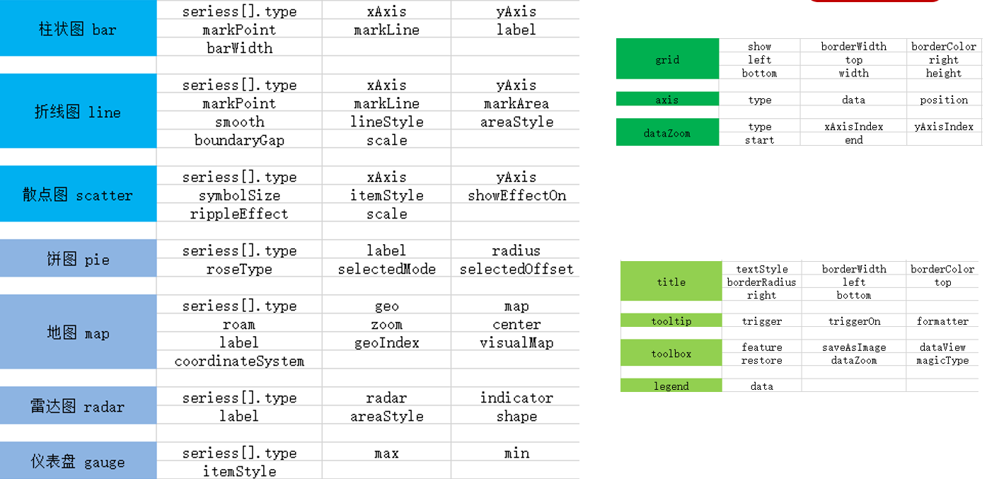

# 1. 数据可视化概念

## 1. 什么是数据可视化

把数据以更直观的形式展现 --> 图表


## 2. 数据可视化的好处

1. 清晰有效地传达与沟通信息

   

2. 隐藏在数据中的信息

   

## 3. 可视化的实现方式

1. 报表类
   - Excel
   - 水晶报表
2. 商业只能 BI
   - Microsoft BI
   - Power-BI
3. 编码类
   - ECharts.js
   - D3.js

# 2. ECharts 的介绍

## 1. 介绍

ECharts 是一个使用 JavaScript 实现的开源可视化库，兼容性强，底层依赖矢量图形库 ZRender，提供直观，交互丰富，可高度个性化定制的数据可视化图表。


官网地址：https://echarts.apache.org/zh/index.html

## 2. 特点

1. 丰富的可视化类型
   - 折线图、柱状图、饼图、K线图
   - 只有你想不到，没有它做不到
   - https://echarts.apache.org/examples/zh/index.html
2. 多种数据格式支持
   - key-value 数据格式
   - 二维表
   - TypedArray 格式
3. 流数据的支持
   - 流数据的动态渲染
   - 增量渲染技术
4. 移动端优化
5. 跨平台使用
6. 绚丽的特效
7. 三维可视化
8. ...
9. 特性介绍地址：https://echarts.apache.org/zh/feature.html

# 3. ECharts 的基本使用

## 1. ECharts 的快速入门

### 1. 5 分钟上手 ECharts

- 步骤1：引入 echarts.min.js 文件
- 步骤2：准备一个呈现图表的盒子
- 步骤3：初始化 echarts 实例对象
- 步骤4：准备配置项
- 步骤5：将配置项设置给 echarts 实例对象

完整代码：

```html
<!DOCTYPE html>
<html lang="en">
<head>
  <meta charset="UTF-8">
  <meta name="viewport" content="width=device-width, user-scalable=no, initial-scale=1.0">
  <meta http-equiv="X-UA-Compatible" content="ie=edge">
  <!-- 步骤1：引入 echarts.min.js 文件 -->
  <script src="./lib/echarts.min.js"></script>
  <title>HelloWorld</title>
</head>
<body>
<!-- 步骤2：准备一个呈现图表的盒子 -->
<div id="container" style="width: 600px; height: 400px;"></div>
<script>
  // 步骤3：初始化 echarts 实例对象
  // const myChart = echarts.init(document.getElementById('container')) // Canvas 渲染
  const myChart = echarts.init(document.getElementById('container'), null, {renderer: 'svg'}) // SVG 渲染

  // 步骤4：准备配置项
  const option = {
    title: {
      text: 'ECharts 入门示例' // 标题
    },
    legend: {
      data: ['语文', '数学', '英语'] // 图例的数据
    },
    xAxis: {
      type: 'category', // 类目轴
      data: ['小明', '小红', '小王']
    },
    yAxis: {
      type: 'value' // 数值轴
    },
    series: [
      {
        type: 'bar', // 柱状图
        name: '语文',
        data: [10, 20, 36]
      },
      {
        type: 'bar',
        name: '数学',
        data: [65, 26, 50]
      },
      {
        type: 'bar',
        name: '英语',
        data: [23, 53, 27]
      }
    ]
  }

  // 步骤5：将配置项设置给 echarts 实例对象
  myChart.setOption(option)
</script>
</body>
</html>
```

效果：


### 2. 相关配置讲解

查阅官方文档：https://echarts.apache.org/zh/option.html#title

配置项太多，无需去刻意记忆。

## 2. ECharts 的常用图表

### 1. 通用配置

通用配置指的就是任何图表都能使用的配置。

- 标题：title
- 图例：legend
- 提示：tooltip
- 工具按钮：toolbox

#### 1. title

标题组件，包含主标题和副标题。

1. 文字样式
   - textStyle
2. 标题位置
   - top
   - right
   - bottom
   - left
3. 标题边框
   - borderColor
   - borderWidth
   - borderRadius

#### 2. legend

图例组件，用于筛选系列，需要和 series 配合使用。

- legend 中的 data 是一个数组
- legend 中的 data 的值需要和 series 数组中某组数据的 name 值一直

#### 3. tooltip

提示框组件，用于配置鼠标滑过或点击图表时的显示框.

1. 触发类型：trigger
   - item（默认）
   - axis
   - none
2. 触发时机：triggerOn
   - mousemove
   - click
   - mousemove|click（默认）
   - none
3. 格式化：formatter
   - 字符串模板
   - 回调函数

#### 4. toolbox

工具栏。内置有[导出图片](https://echarts.apache.org/zh/option.html#toolbox.feature.saveAsImage)，[重置](https://echarts.apache.org/zh/option.html#toolbox.feature.reset)，[数据视图](https://echarts.apache.org/zh/option.html#toolbox.feature.dataView)，[数据区域缩放](https://echarts.apache.org/zh/option.html#toolbox.feature.dataZoom)，[动态类型切换](https://echarts.apache.org/zh/option.html#toolbox.feature.magicType)五个工具。

1. 各工具配置项：feature
   - saveAsImage 导出图片
   - restore 重置
   - dataView 数据视图
   - dataZoom 数据区域缩放
   - magicType 动态类型切换

### 2. 柱状图

**期末语文成绩如下**：

```
张三：88
李四：92
王五：63
靖总：77
欣爷：94
佩奇：80
骚男：72
添狗：86
```

**实现步骤**：

1. ECharts 最基本代码结构：
   - 引入 js 文件
   - DOM 容器
   - 初始化对象
   - 设置 option
2. x 轴数据：
   - ['张三', '李四', '王五', '靖总', '欣爷', '佩奇', '骚男', '添狗']
3. y 轴数据：
   - [88, 92, 63, 77, 94, 80, 72, 86]
4. 图表类型：
   - 在 series 下设置 `type: 'bar'`

**常用配置**：

1. **显示**：数值显示、柱宽度、横向柱状图
   - label
   - barWidth
2. **标记**：最大值、最小值、平均值
   - markPoint
   - markLine

**完整代码**：

```html
<!DOCTYPE html>
<html lang="en">
<head>
  <meta charset="UTF-8">
  <meta http-equiv="X-UA-Compatible" content="IE=edge">
  <meta name="viewport" content="width=device-width, user-scalable=no, initial-scale=1.0">
  <script src="./lib/echarts.min.js"></script>
  <title>柱状图</title>
</head>
<body>
<div id="container" style="width: 600px; height: 400px;"></div>
<script>
  const xDataArray = ['张三', '李四', '王五', '靖总', '欣爷', '佩奇', '骚男', '添狗'] // x 轴数据
  const yDataArray = [88, 92, 63, 77, 94, 80, 72, 86] // y 轴数据

  const myChart = echarts.init(document.getElementById('container'), null, {renderer: 'svg'})

  const option = {
    title: {
      text: '柱状图'
    },
    xAxis: {
      type: 'category',
      data: xDataArray
    },
    yAxis: {
      type: 'value'
    },
    series: [
      {
        type: 'bar',
        name: '语文',
        label: { // 图形上的文字
          show: true,
          rotate: 30,
          position: 'top'
        },
        barWidth: '30%',
        markPoint: { // 标记最大值和最小值
          data: [
            {
              type: 'max',
              name: '最大值'
            },
            {
              type: 'min',
              name: '最小值'
            }
          ]
        },
        markLine: { // 标记平均线
          data: [
            {
              type: 'average',
              name: '平均线'
            }
          ]
        },
        data: yDataArray
      }
    ]
  }

  myChart.setOption(option)
</script>
</body>
</html>
```

**最终效果**：


### 3. 折线图

**康师傅方便面销量如下**：

```
1月：3000
2月：2800
3月：900
4月：1000
5月：800
6月：700
7月：1400
8月：1300
9月：900
10月：1000
11月：800
12月：600
```

**实现步骤**：

1. ECharts 最基本代码结构：
   - 引入 js 文件
   - DOM 容器
   - 初始化对象
   - 设置 option
2. x 轴数据：
   - ['1月', '2月', '3月', '4月', '5月', '6月', '7月', '8月', '9月', '10月', '11月', '12月']
3. y 轴数据：
   - [3000, 2800, 900, 1000, 800, 700, 1400, 1300, 900, 1000, 800, 600]
4. 图表类型：
   - 在 series 下设置 `type: 'line'`

**常用配置**：

1. **线条控制**：风格、平滑
   - lineStyle
   - smooth
2. 区域风格
   - areaStyle
3. **标记**：最大值、最小值、平均值、标注区间
   - markPoint
   - markLine
   - markArea
4. 紧挨边缘
   - boundaryGap
5. **缩放**：脱离 0 值比例
   - scale
6. 堆叠图
   - stack

**完整代码**：

```html
<!DOCTYPE html>
<html lang="en">
<head>
  <meta charset="UTF-8">
  <meta http-equiv="X-UA-Compatible" content="IE=edge">
  <meta name="viewport" content="width=device-width, user-scalable=no, initial-scale=1.0">
  <script src="./lib/echarts.min.js"></script>
  <title>折线图</title>
</head>
<body>
<div id="container" style="width: 600px; height: 400px;"></div>
<script>
  const xDataArray = ['1月', '2月', '3月', '4月', '5月', '6月', '7月', '8月', '9月', '10月', '11月', '12月']
  const yDataArray = [3000, 2800, 900, 1000, 800, 700, 1400, 1300, 900, 1000, 800, 600]
  const yDataArray2 = [2000, 1800, 1600, 1100, 1800, 600, 400, 300, 800, 900, 700, 1500]

  const myChart = echarts.init(document.getElementById('container'), null, {renderer: 'svg'})

  const option = {
    title: {
      text: '折线图'
    },
    xAxis: {
      type: 'category',
      boundaryGap: false, // 紧挨边缘
      data: xDataArray
    },
    yAxis: {
      type: 'value',
      scale: true // 脱离 0 值比例
    },
    series: [
      {
        type: 'line',
        name: '康师傅',
        stack: 'all', // 堆叠图
        lineStyle: { // 风格
          color: 'green',
          type: 'dashed' // 可选值：solid（默认）、dashed、dotted
        },
        areaStyle: { // 区域风格
          color: 'pink'
        },
        smooth: true, // 平滑
        markPoint: { // 标记最大值和最小值
          data: [
            {
              type: 'max',
              name: '最大值'
            },
            {
              type: 'min',
              name: '最小值'
            }
          ]
        },
        markLine: { // 标记平均线
          data: [
            {
              type: 'average',
              name: '平均线'
            }
          ]
        },
        markArea: { // 标记一个范围的数据
          data: [
            [{xAxis: '1月'}, {xAxis: '2月'}], // 标记 1月 到 2 月
            [{xAxis: '7月'}, {xAxis: '8月'}] // 标记 7月 到 8月
          ]
        },
        data: yDataArray
      },
      {
        type: 'line',
        name: '康师傅2',
        stack: 'all', // 堆叠图
        areaStyle: {},
        data: yDataArray2
      }
    ]
  }

  myChart.setOption(option)
</script>
</body>
</html>
```

**最终效果**：


### 4. 散点图

散点图可以帮助我们推断出变量间的相关性，比如身高和体重的关系。

```
[
  {height: 161.2, weight: 50.6},
  {height: 167.5, weight: 59},
  {height: 159.5, weight: 72.2},
  {height: 171.2, weight: 61.6},
  {height: 168.5, weight: 59.6},
  {height: 160.1, weight: 50.2},
  {height: 173.2, weight: 91},
  {height: 169.5, weight: 55},
  {height: 181.1, weight: 67.2}
]
```

**实现步骤**：

1. ECharts 最基本代码结构：
   - 引入 js 文件
   - DOM 容器
   - 初始化对象
   - 设置 option
2. x 轴数据和 y 轴数据：二维数组
   - [[身高1, 体重1], [身高2, 体重2], [身高3, 体重3], ...]
3. 图表类型：
   - 在 series 下设置 `type: 'scatter'`
   - xAxis 和 yAxis 的 type 都要设置为 value
4. 调整：
   - 将坐标轴都设置为脱离 0 值比例，scale

**常用配置**：

1. 气泡图效果
   - symbolSize 散点的大小
   - itemStyle.color 散点的颜色
2. 涟漪动画效果
   - type: 'effectScatter'
   - showEffectOn
   - rippleEffect

**完整代码**：

```html
<!DOCTYPE html>
<html lang="en">
<head>
  <meta charset="UTF-8">
  <meta http-equiv="X-UA-Compatible" content="IE=edge">
  <meta name="viewport" content="width=device-width, user-scalable=no, initial-scale=1.0">
  <script src="./lib/echarts.min.js"></script>
  <title>散点图</title>
</head>
<body>
<div id="container" style="width: 600px; height: 400px;"></div>
<script>
  const data = [ // 数据
    {height: 161.2, weight: 50.6},
    {height: 167.5, weight: 59},
    {height: 159.5, weight: 72.2},
    {height: 171.2, weight: 61.6},
    {height: 168.5, weight: 59.6},
    {height: 160.1, weight: 50.2},
    {height: 173.2, weight: 91},
    {height: 169.5, weight: 55},
    {height: 181.1, weight: 67.2}
  ]
  const axisDataArray = []
  data.forEach(item => axisDataArray.push([item.height, item.weight])) // 将数据转换成二维数组格式

  const myChart = echarts.init(document.getElementById('container'), null, {renderer: 'svg'})

  const option = {
    title: {
      text: '散点图'
    },
    xAxis: {
      type: 'value',
      scale: true
    },
    yAxis: {
      type: 'value',
      scale: true
    },
    series: [
      {
        // type: 'scatter',
        type: 'effectScatter', // 涟漪动画效果
        showEffectOn: 'emphasis', // hover 的时候显示涟漪特效
        rippleEffect: { // 涟漪特效相关配置
          scale: 5
        },
        // symbolSize: 20, // 散点的大小
        symbolSize(value) { // 回调函数方式
          const height = value[0] / 100 // 身高（米）
          const weight = value[1] // 体重
          // bmi = 体重kg / (身高m * 身高m)，大于 28 就代表肥胖
          const bmi = weight / (height * height)
          return bmi > 28 ? 30 : 20
        },
        itemStyle: { // 散点的颜色
          color(params) {
            const height = params.data[0] / 100 // 身高（米）
            const weight = params.data[1] // 体重
            // bmi = 体重kg / (身高m * 身高m)，大于 28 就代表肥胖
            const bmi = weight / (height * height)
            return bmi > 28 ? 'pink' : 'lightgreen'
          }
        },
        data: axisDataArray
      }
    ]
  }

  myChart.setOption(option)
</script>
</body>
</html>
```

**最终效果**：


### 5. 直角坐标系中的常用配置

**直角坐标系图表**：柱状图、折线图、散点图

- 配置1：网格 grid
- 配置2：坐标轴 axis
- 配置3：区域缩放 dataZoom

#### 1. 网格 grid

grid 是用来控制直角坐标系的布局和大小，x 轴和 y 轴就是在 grid 的基础上进行绘制的。

1. 显示 grid
   - show
2. grid 的位置和大小
   - top
   - right
   - bottom
   - left
   - width
   - height
3. grid 的边框
   - borderWidth
   - borderColor

```js
grid: { // 网格
  show: true,
  // 位置和大小
  width: '50%',
  height: 'auto',
  top: '100',
  left: '100',
  // 边框
  borderWidth: 10,
  borderColor: 'pink'
}
```

#### 2. 坐标轴 axis

坐标轴分为 x 轴和 y 轴（xAxis 和 yAxis），一个 grid 中最多有两种位置的 x 轴和 y 轴。

1. 坐标轴类型 type
   - **value**：数值轴，自动会从目标数据中读取数据
   - **category**：类目轴，该类型必须通过 data 设置类目数据
2. 显示位置 position
   - xAxis 可取值为 top 或者 bottom
   - yAxis 可取值为 left 或者 right

```js
xAxis: { // x 坐标轴
  type: 'category',
  position: 'top',
  data: xDataArray
},
yAxis: { // y 坐标轴
  type: 'value',
  position: 'right'
}
```

#### 3. 区域缩放 dataZoom

dataZoom 用于区域缩放，对数据范围过渡，x 轴和 y 轴都可以拥有，dataZoom 是一个数组，意味着可以配置多个区域缩放器。

1. 类型 type
   - **inside**：里面，依靠鼠标滚轮或者双指缩放
   - **slider**：滑块
2. 指明产生作用的轴
   - **xAxisIndex**：设置缩放组件控制的是哪个 x 轴，一般写 0 即可
   - **yAxisIndex**：设置缩放组件控制的是哪个 y 轴，一般写 0 即可
3. 指明初始状态的缩放情况
   - **start**：数据范围的起始百分比
   - **end**：数据范围的结束百分比

```js
dataZoom: [
  {
    type: 'inside', // 里面，依靠鼠标滚轮或者双指缩放
    xAxisIndex: 0, // 设置缩放组件控制的是哪个 x 轴，一般写 0 即可
    start: 30, // 数据范围的起始百分比
    end: 80 // 数据范围的结束百分比
  },
  {
    type: 'inside',
    yAxisIndex: 0 // 设置缩放组件控制的是哪个 y 轴，一般写 0 即可
  },
  {
    type: 'slider', // 滑块
    xAxisIndex: 0,
    start: 30,
    end: 80
  },
  {
    type: 'slider',
    yAxisIndex: 0
  }
]
```

### 6. 饼图

**小明今年在各个网购平台的消费金额**：

```
淘宝：11231
京东：22673
唯品会：6123
1号店：8989
聚美优品：6700
```

**实现步骤**：

1. ECharts 最基本代码结构：
   - 引入 js 文件
   - DOM 容器
   - 初始化对象
   - 设置 option
2. 数据准备：
   - [
       {name: '淘宝', value: 11231},
       {name: '京东', value: 22673},
       {name: '唯品会', value: 6123},
       {name: '1号店', value: 8989},
       {name: '聚美优品', value: 6700}
     ]
3. 图表类型：
   - 在 series 下设置 `type: pie`

**常用配置**：

1. 选中效果
   - selectedMode 选中模式
   - selectedOffset 选中的偏移量
2. 南丁格尔图
   - `roseType: 'radius'`
3. 显示数值
   - label.formatter
4. 圆环
   - `radius: ['20%', '75%']`

**完整代码**：

```html
<!DOCTYPE html>
<html lang="en">
<head>
  <meta charset="UTF-8">
  <meta http-equiv="X-UA-Compatible" content="IE=edge">
  <meta name="viewport" content="width=device-width, user-scalable=no, initial-scale=1.0">
  <script src="./lib/echarts.min.js"></script>
  <title>饼图</title>
</head>
<body>
<div id="container" style="width: 800px; height: 400px;"></div>
<script>
  const pieData = [
    {name: '淘宝', value: 11231},
    {name: '京东', value: 22673},
    {name: '唯品会', value: 6123},
    {name: '1号店', value: 8989},
    {name: '聚美优品', value: 6700}
  ]

  const myChart = echarts.init(document.getElementById('container'), null, {renderer: 'svg'})

  const option = {
    title: {
      text: '饼图'
    },
    series: [
      {
        type: 'pie',
        // 选中效果
        selectedMode: 'single', // 可选值 single、multiple、series 分别表示单选、多选、全选
        selectedOffset: 50, // 选中的偏移量
        // 南丁格尔图
        roseType: 'radius', // 扇区圆心角展现数据的百分比，半径展现数据的大小
        // 显示数值
        label: {
          show: true,
          // formatter: '在{b}平台消费{c}元', // 字符串形式
          formatter(params) { // 回调函数形式
            return `在${params.name}平台消费${params.value}元，占比${params.percent}%`
          },
        },
        // radius: 40, // 外圆半径
        // radius: '20%', // 百分比参照的是宽高中较小的那一个的一半
        radius: ['20%', '75%'], // 第一个是内圆半径，第二个是外圆半径
        data: pieData
      }
    ]
  }

  myChart.setOption(option)
</script>
</body>
</html>
```

**最终效果**：


### 7. 地图

**地图图标的使用方式**：

1. 百度地图 API
   - 需要申请百度地图 ak
2. 矢量地图
   - 需要准备矢量地图数据

**实现步骤**：

1. ECharts 最基本代码结构：
   - 引入 js 文件
   - DOM 容器
   - 初始化对象
   - 设置 option
2. 准备中国的矢量地图 json 文件，放到 json/map 的目录下
   - china.json
3. 使用 Ajax 获取 china.json
   - axios.get('/json/map/china.json').then(response => {})
4. 在回调函数中往 echarts 全局对象注册地图的 json 数据
   - echarts.registerMap('chinaMap', response.data)
5. 在 geo 下设置：
   - `type: 'map'`
   - `map: 'chinaMap'`

**常用配置**：

1. 缩放和拖动
   - roam
2. 地图中心点
   - center
3. 缩放比例
   - zoom
4. 显示名称
   - label
5. 显示某个区域
   - 加载该区域的矢量地图数据：`axios.get('/json/map/province/anhui.json').then(response => {})`
6. 不同城市颜色不同
   1. 显示基本的中国地图
   2. 将城市的空气质量数据设置给 series
   3. 将 series 下的数据和 geo 关联起来
      - `type: 'map'`
      - `geoIndex: 0`
   4. 结合 visualMap 配合使用
      - min
      - max
      - calculable
      - inRange
7. 地图和散点图结合
   1. 给 series 下增加新的对象
   2. 准备好散点坐标数据，设置给新对象的 data
   3. 配置新对象的 type
      - `type: 'effectScatter'`
   4. 让散点图使用地图坐标系统
      - `coordinateSystem: 'geo'`
   5. 让涟漪的效果更加明显
      - `rippleEffect: {scale: 10}`

**完整代码**：

```html
<!DOCTYPE html>
<html lang="en">
<head>
  <meta charset="UTF-8">
  <meta http-equiv="X-UA-Compatible" content="IE=edge">
  <meta name="viewport" content="width=device-width, user-scalable=no, initial-scale=1.0">
  <script src="./lib/echarts.min.js"></script>
  <script src="./lib/axios.min.js"></script>
  <title>地图</title>
</head>
<body>
<div id="container" style="width: 600px; height: 400px;"></div>
<script>
  const airData = [ // 城市的空气质量数据
    {name: '北京', value: 39.92},
    {name: '天津', value: 39.13},
    {name: '上海', value: 31.22},
    {name: '重庆', value: 66},
    {name: '河北', value: 147},
    {name: '河南', value: 113},
    {name: '云南', value: 25.04},
    {name: '辽宁', value: 50},
    {name: '黑龙江', value: 114},
    {name: '湖南', value: 175},
    {name: '安徽', value: 117},
    {name: '山东', value: 92},
    {name: '新疆', value: 84},
    {name: '江苏', value: 67},
    {name: '浙江', value: 84},
    {name: '江西', value: 96},
    {name: '湖北', value: 273},
    {name: '广西', value: 59},
    {name: '甘肃', value: 99},
    {name: '山西', value: 39},
    {name: '内蒙古', value: 58},
    {name: '陕西', value: 61},
    {name: '吉林', value: 51},
    {name: '福建', value: 29},
    {name: '贵州', value: 71},
    {name: '广东', value: 38},
    {name: '青海', value: 57},
    {name: '西藏', value: 24},
    {name: '四川', value: 58},
    {name: '宁夏', value: 52},
    {name: '海南', value: 54},
    {name: '台湾', value: 88},
    {name: '香港', value: 66},
    {name: '澳门', value: 77},
    {name: '南海诸岛', value: 55}
  ]
  const scatterData = [ // 散点坐标数据
    {value: [117.283042, 31.86119]}
  ]

  const myChart = echarts.init(document.getElementById('container'), null, {renderer: 'svg'})
  axios.get('/json/map/china.json').then(response => { // 加载中国的矢量地图数据
  // axios.get('/json/map/province/anhui.json').then(response => { // 加载安徽省的矢量地图数据
    console.log(response.data)

    echarts.registerMap('chinaMap', response.data) // 注册地图的 json 数据，名称为 chinaMap

    const option = {
      title: {
        text: '地图'
      },
      visualMap: { // 结合 visualMap 配合使用
        min: 0,
        max: 300,
        calculable: true, // 出现滑块
        inRange: {
          color: ['white', 'red'] // 控制颜色渐变的范围（白色到红色）
        }
      },
      geo: {
        type: 'map',
        map: 'chinaMap', // 使用刚注册的 chinaMap
        roam: true, // 缩放和拖动
        center: [115.97, 32.71], // 地图中心点
        zoom: 1, // 缩放比例
        label: {
          show: true // 显示名称
        }
      },
      series: [
        {
          type: 'map',
          geoIndex: 0, // 将空气质量的数据和第 0 个 geo 配置关联在一起
          data: airData // 城市的空气质量数据设置给 series
        },
        {
          type: 'effectScatter',
          coordinateSystem: 'geo', // 使用 geo 的坐标系
          rippleEffect: {
            scale: 10 // 让涟漪的效果更加明显
          },
          data: scatterData // 设置散点坐标数据
        }
      ]
    }

    myChart.setOption(option)
  })
</script>
</body>
</html>
```

**最终效果**：


### 8. 雷达图

**有两台手机在 5 个方面的打分数据如下**：

```
华为手机1：易用性80、功能90、拍照80、跑分82、续航90

中兴手机1：易用性70、功能82、拍照75、跑分70、续航78
```

**实现步骤**：

1. ECharts 最基本代码结构：
   - 引入 js 文件
   - DOM 容器
   - 初始化对象
   - 设置 option
2. 定义各个维度的最大值：
   - [{name: '易用性', max: 100}, ...]
3. 准备具体产品的数据：
   - [{name: '华为手机1', value: [80, 90, 80, 82, 90]}, ...]
4. 图表类型：
   - 在 series 下设置：`type: 'radar'`

**常用配置**：

1. 显示数值
   - label
2. 区域风格
   - areaStyle
3. 绘制类型
   - shape

**完整代码**：

```html
<!DOCTYPE html>
<html lang="en">
<head>
  <meta charset="UTF-8">
  <meta http-equiv="X-UA-Compatible" content="IE=edge">
  <meta name="viewport" content="width=device-width, user-scalable=no, initial-scale=1.0">
  <script src="./lib/echarts.min.js"></script>
  <script src="./lib/axios.min.js"></script>
  <title>雷达图</title>
</head>
<body>
<div id="container" style="width: 600px; height: 400px;"></div>
<script>
  const dataMax = [ // 定义各个维度的最大值
    {name: '易用性', max: 100},
    {name: '功能', max: 100},
    {name: '拍照', max: 100},
    {name: '跑分', max: 100},
    {name: '续航', max: 100}
  ]
  const data = [ // 准备具体产品的数据
    {name: '华为手机1', value: [80, 90, 80, 82, 90]},
    {name: '中兴手机1', value: [70, 82, 85, 70, 78]}
  ]

  const myChart = echarts.init(document.getElementById('container'), null, {renderer: 'svg'})

  const option = {
    title: {
      text: '雷达图'
    },
    radar: {
      shape: 'circle', // 圆形雷达，默认 polygon 多边形
      indicator: dataMax // 配置各个维度的最大值
    },
    series: [
      {
        type: 'radar',
        label: {
          show: true // 显示数值
        },
        areaStyle: {}, // 区域风格
        data
      }
    ]
  }

  myChart.setOption(option)
</script>
</body>
</html>
```

**最终效果**：


### 9. 仪表盘图

仪表盘主要用在进度把控以及数据范围的监测。

**实现步骤**：

1. ECharts 最基本代码结构：
   - 引入 js 文件
   - DOM 容器
   - 初始化对象
   - 设置 option
2. 准备数据：
   - [{value: 97}]
3. 图表类型：
   - 在 series 下设置：`type: 'gauge'`

**常用配置**：

1. 数值范围
   - min
   - max
2. 多个指针
   - 增加 data 中的数组元素
3. 指针颜色
   - itemStyle

**完整代码**：

```html
<!DOCTYPE html>
<html lang="en">
<head>
  <meta charset="UTF-8">
  <meta http-equiv="X-UA-Compatible" content="IE=edge">
  <meta name="viewport" content="width=device-width, user-scalable=no, initial-scale=1.0">
  <script src="./lib/echarts.min.js"></script>
  <script src="./lib/axios.min.js"></script>
  <title>仪表盘</title>
</head>
<body>
<div id="container" style="width: 600px; height: 400px;"></div>
<script>
  const myChart = echarts.init(document.getElementById('container'), null, {renderer: 'svg'})

  const option = {
    title: {
      text: '仪表盘'
    },
    series: [
      {
        type: 'gauge',
        data: [
          {
            value: 97,
            itemStyle: {
              color: 'pink' // 指针颜色
            }
          },
          { // 多个指针，增加 data 中的数组元素
            value: 80,
            itemStyle: {
              color: 'skyblue'
            }
          }
        ],
        // 数值范围
        min: 50,
        max: 100
      }
    ]
  }

  myChart.setOption(option)
</script>
</body>
</html>
```

**最终效果**：


### 10. 七个图表小结

**各个图表的英文单词**：

- bar（柱状图）
- line（折线图）
- scatter/effectScatter（散点图）
- pie（饼图）
- map（地图）
- radar（雷达图）
- gauge（仪表盘）



**使用场景**：

- 柱状图：柱状图描述的是分类数据，呈现的是每一个分类中**有多少**
- 折线图：折线图常用来分析数据随时间的**变化趋势**
- 散点图：散点图可以帮助我们推断出不同维度数据之间的**相关性**
- 饼图：饼图可以很好地帮助用户快速了解不同分类的数据的**占比情况**
- 地图：地图主要可以帮助我们从宏观的角度快速看出不同**地理位置**上数据的差异
- 雷达图：雷达图可以用来分析**多个维度**的数据与标准数据的对比情况
- 仪表盘：仪表盘可以更直观的表现出某个指标的**进度**或实际情况

# 4. ECharts 的高级使用

## 1. 显示相关

### 1. 主题

**内置主题**

- ECharts 中默认内置了两套主题：light、dark
- 在初始化对象方法 init 中可以指明
  - echarts.init(dom, 'light')
  - echarts.init(dom, 'dark')

**自定义主题**

1. 在 ECharts 官网的[定制主题](https://echarts.apache.org/zh/theme-builder.html)中编辑主题
2. 下载主题，是一个 js 文件
3. 引入主题 js 文件
4. 在 init 方法中使用主题

### 2. 调色盘

#### 1. 调色盘

它是一组颜色，图形、系列会自动从其中选择颜色。

**主题调色盘**

在主题文件中，有一行注册主题的代码，其中 color 节点就是主题调色盘

```js
echarts.registerTheme('long', {
  color: [
    "#dd6b66",
    "#759aa0",
    "#e69d87",
    "#8dc1a9",
    "#ea7e53",
    "#eedd78",
    "#73a373",
    "#73b9bc",
    "#7289ab",
    "#91ca8c",
    "#f49f42"
  ],
  ...
})
```

**全局调色盘**

```js
const option = {
  color: [ // 全局调色盘，会覆盖主题调色盘
    '#5470c6',
    '#91cc75',
    '#fac858',
    '#ee6666',
    '#73c0de',
    '#3ba272',
    '#fc8452',
    '#9a60b4',
    '#ea7ccc'
  ]
}
```

**局部调色盘**

```js
series: [
  {
    color: [ // 局部调色盘，会覆盖全局调色盘
      '#008000',
      '#91cc75',
      '#fac858',
      '#ee6666',
      '#73c0de',
      '#3ba272',
      '#fc8452',
      '#9a60b4',
      '#ea7ccc'
    ]
  }
]
```

> 调色盘的作用遵循就近原则

#### 2. 颜色渐变

**线性渐变**

```js
series: [
  {
    itemStyle: {
      color: {
        type: 'linear', // 线性渐变
        x: 0,
        y: 0,
        x2: 0,
        y2: 1,
        colorStops: [
          {offset: 0, color: 'red'}, // 0% 处的颜色
          {offset: 1, color: 'blue'} // 100% 处的颜色
        ]
      }
    }
  }
]
```


**径向渐变**

```js
series: [
  {
    itemStyle: {
      color: {
        type: 'radial', // 径向渐变
        x: 0.5,
        y: 0.5,
        r: 0.5,
        colorStops: [
          {offset: 0, color: 'red'}, // 0% 处的颜色
          {offset: 1, color: 'blue'} // 100% 处的颜色
        ]
      }
    }
  }
]
```


### 3. 样式

**直接样式**

- label 控制文字的展示
- itemStyle 控制一块区域的样式
- textStyle 控制图表的标题样式
- lineStyle 控制线的样式
- areaStyle 控制区域的样式

**高亮样式**

在 emphasis 节点中包裹 label、itemStyle、textStyle、lineStyle、areaStyle 即可。

优先级高，会覆盖主题中、调色盘的效果。

### 4. 自适应

当浏览器的大小发生变化的时候，让图表也能随之适配变化

1. 将 div 容器的固定宽度去掉
2. 监听窗口大小变化事件
3. 在事件处理函数中调用 ECharts 实例对象的 resize 即可

```js
// window.addEventListener('resize', () => myChart.resize()) // 第一种写法
window.addEventListener('resize', myChart.resize) // 第二种写法
```

## 2. 动画的使用

### 1. 加载动画

ECharts 已经内置好了加载数据的动画，我呢只需要在合适的时机显示或者隐藏即可。

1. 显示加载动画
   - `myChart.showLoading()`
2. 隐藏加载动画
   - `myChart.hideLoading()`

### 2. 增量动画

myChart.setOption()

- 所有数据的更新都通过 setOption() 实现
- 不用考虑数据到底产生了那些变化
- ECharts 会找到两组数据之间的差异然后通过合适的动画表现数据的变化

### 3. 动画的配置

1. 开启动画
   - `animation: true` 默认为 true
2. 动画阈值
   - `animationThreshold: 8` 当单个系列显示的图形数量大于这个阈值时会关闭动画
3. 动画时长
   - `animationDuration: 5000`
4. 缓动效果
   - `animationEasing: 'bounceOut'`

## 3. 交互 API

### 1. 全局 echarts 对象

全局 echarts 对象是引入 echarts.js 文件之后就可以直接使用的

1. init 方法

   - 初始化 ECharts 实例对象
   - 使用主题

   ```js
   const myChart = echarts.init(document.getElementById('container'), 'dark', {renderer: 'svg'})
   ```

2. registerTheme 方法

   - 注册主题
   - 只有注册过的主题，才能在 init 方法中使用该主题

   ```js
   echarts.registerTheme('long', {...}) // 注册 long 主题
   const myChart = echarts.init(document.getElementById('container'), 'long', {renderer: 'svg'}) // 使用 long 主题
   ```

3. registerMap 方法

   - 注册地图数据

   ```js
   axios.get('/json/map/china.json').then(response => {
     echarts.registerMap('chinaMap', response.data) // 注册地图
   
     const option2 = {
       geo: {
         type: 'map',
         map: 'chinaMap', // 使用地图
       }
     }
   
     myChart2.setOption(option2)
   })
   ```

4. connect 方法

   - 一个页面中可以有多个独立的图表

   - 每一个图表对应一个 ECharts 实例对象

   - connect 可以实现多图关联，传入联动目标为 ECharts 实例对象，支持数组。

     保存图片的自动拼接
   
     刷新按钮

     重置按钮

     提示框联动、图例选择、数据范围修改等...
   
   ```js
   echarts.connect([myChart, myChart2]) // 将两个图表关联起来，两个图表不能用 SVG 渲染
   ```

### 2. echartsInstance 对象

echartsInstance 对象是通过 `echarts.init()` 方法调用之后得到的，myChart 就是 echartsInstance

1. setOption 方法

   - 设置或修改图表实例的配置项以及数据

   - 多次调用 setOption 方法

     **合并**新的配置和旧的配置

     增量动画

2. resize 方法

   - 重新计算和绘制图表
   - 一般和 window 对象的 resize 事件结合使用

   ```js
   window.addEventListener('resize', myChart.resize)
   ```

3. on/off 方法

   - 绑定或者解绑事件处理函数

   - 鼠标事件

     常见事件：'click'、'dblclick'、'mousedown'、'mousemove'、'mouseup' 等

     事件参数 arg：和事件相关的数据信息

   - ECharts 事件

     常见事件：legendselectchanged、'datazoom'、'pieselectchanged'、'mapselectchanged' 等

     事件参数 arg：和事件相关的数据信息

   ```js
   const fn = params => alert('点击了' + params.name)
   myChart.on('click', fn) // 绑定事件
   myChart.off('click', fn) // 解绑事件
   ```

4. dispatchAction 方法

   - 触发某些行为
   - 使用代码模拟用户的行为

   ```js
   myChart.dispatchAction({
     type: 'highlight', // 行为类型
     seriesIndex: 0, // 图表索引
     dataIndex: 1 // 图表中哪一项高亮
   })
   ```

5. clear 方法

   - 清空实例，会移除实例中所有的组件和图表
   - 清空之后可以再次 setOption

   ```js
   myChart.clear() // 清空实例
   myChart.setOption(option) // 重新设置
   ```

6. dispose

   - 销毁实例
   - 销毁后实例无法再次被使用

   ```js
   myChart.dispose()
   ```

# 5. 电商平台数据可视化项目

## 1. 后台开发

### 1. Koa2 的介绍

**简介**

- 基于 Node.js 平台的 web 开发框架

- 由 Express 原班人马打造

  | 框架名  | 作用     | 异步处理        |
  | ------- | -------- | --------------- |
  | Express | web 框架 | 回调函数        |
  | Koa     | web 框架 | Generator/yield |
  | Koa2    | web 框架 | async/await     |

- 环境依赖 Node v7.6.0 及以上

**特点**

- 支持 async/await
- 洋葱模型的中间件


### 2. Koa2 快速上手

**快速上手**

1. 检查 Node 的环境

   ```sh
   node -v
   ```

2. 安装 Koa

   ```sh
   npm init -y
   npm i koa
   ```

3. 创建并编写 01-快速上手.js 文件

   1. 创建 Koa 对象

      ```js
      const Koa = require('koa')
      const app = new Koa()
      ```

   2. 编写响应函数（中间件）

      ```js
      app.use((ctx, next) => {
        // ctx：上下文（web 容器），ctx.request，ctx.response
        // next：下一个中间件
        console.log(ctx.request.url) // 输出请求路径
        ctx.response.body = 'hello koa2' // 设置响应体
      })
      ```

   3. 监听端口

      ```js
      app.listen(3000, () => console.log('http://localhost:3000'))
      ```

4. 启动服务器

   ```sh
   node 01-快速上手.js
   ```

**中间件的特点**

- Koa 对象通过 use 方法加入一个中间件

- 一个中间件就是一个函数

- 中间件的执行顺序符合洋葱模型

- 内层中间件能否执行取决于外层中间件的 next 函数是否调用

- 调用 next 函数得到的是 Promise 对象

  ```js
  app.use(async (ctx, next) => {
    // 刚进入中间件想做的事情
    await next()
    // 内层所有中间件结束之后想做的事情
  })
  ```

### 3. 搭建后台项目

#### 1. 后台项目的目标

1. 计算服务器处理请求的总耗时
2. 在相应头上加上相应内容的 mime 类型
3. 根据 url 读取指定目录下的文件内容

#### 2. 后台项目的实现步骤

1. 项目准备
2. 总耗时中间件
3. 响应头中间件
4. 业务逻辑中间件
5. 允许跨域

#### 3. 项目准备

1. 安装包

   ```sh
   npm init -y
   npm i koa
   ```

2. 创建文件和目录结构

   ```
   |-- app.js                        服务器的入口文件
   |-- data                          存放 json 数据文件
   |-- middleware                    存放中间件
       |-- koaResponseData.js        处理业务逻辑的中间件，读取某个 json 文件的中间件
       |-- koaResponseDuration.js    计算服务器消耗时长的中间件
       |-- koaResponseHeader.js      设置响应头的中间件
   |-- utils                         存放工具模块
       |-- fileUtils.js              读取文件的工具模块
   ```

#### 4. 总耗时中间件

1. **第1层**中间件
2. 计算执行时间
   - 一进入时记录开始时间
   - 其他所有中间件执行完后记录结束时间
   - 两者相减
3. 设置响应头
   - X-Response-Time: 毫秒ms

#### 5. 响应头中间件

1. **第2层**中间件
2. 获取 mime 类型
   - application/json
3. 设置响应头
   ```js
   ctx.set('Content-Type', 'application/json;charset=utf-8')
   ```

#### 6. 业务逻辑中间件

**业务逻辑中间件**

1. **第3层**中间件
2. 读取文件内容，假如路径为 http://localhost:3000/api/seller
   - 获取请求的路径，拼接文件路径
   - 读取该路径对应文件的内容
3. 设置响应体
   - ctx.response.body

**接口总览**

1. 商家销量 /api/seller
2. 预算开销 /api/budget
3. 库存信息 /api/stock
4. 销量趋势 /api/trend
5. 销量排行 /api/rank
6. 商家分布 /api/map
7. 热销商品 /api/hotproduct

**WebSocket**

#### 7. 允许跨域

1. 实际是通过 Ajax 访问服务器

2. 同源策略

   - 同协议/同域名/同端口
   - 当前页面的地址和 Ajax 获取数据的地址

3. 设置响应头

   ```js
   ctx.set('Access-Control-Allow-Origin', '*')
   ctx.set('Access-Control-Allow-Methods', 'OPTIONS, GET, POST, PUT, DELETE')
   ```

## 2. 前端项目的准备

略

# 6. WebSocket 的基本使用

## 1. 后端

### 1. 安装包

```sh
npm i ws@7.5.9
```

### 2. 创建对象

```js
const WebSocket = require('ws') // 引入 WebSocket

const wss = new WebSocket.Server({ port: 9999 }) // 创建 WebSocket 服务对象
```

### 3. 监听事件

```js
wss.on('connection', client => { // 监听连接事件
  console.log('有客户端连接...')
  client.on('message', msg => { // 监听接收数据事件
    console.log('客户端发送过来的数据', msg)
  })
})
```

### 4. 发送数据

```js
client.send('hello socket rear end') // 发送数据给客户端
```

## 2. 前端

### 1. 连接

WebSocket 是 window 对象就提供了的，因此不需要额外的包：

```js
const ws = new WebSocket('ws://localhost:9999')
```

### 2. 监听事件

- 连接成功事件：ws.onopen

  ```js
  ws.onopen = () => console.log('连接服务器成功')
  ```

- 连接失败事件：ws.onclose

  ```js
  ws.onclose = () => console.log('连接服务器失败或服务器关闭')
  ```

- 接收数据事件：ws.onmessage

  ```js
  ws.onmessage = msg => console.log('服务器发送过来的数据', msg)
  ```

### 3. 发送数据

- ws.send()

  ```js
  send.addEventListener('click', () => {
    ws.send('hello socket front end') // 发送数据给服务器
  })
  ```

