# 操作：

```bash
# 设置在拉取时合并远程分支的更改。如果有冲突，需要手动解决。这是默认策
git config --global pull.rebase false

# 拉取
git pull

# 创建 login 分支
git checkout -b login

# 提交并推送 login 分支
git add .
git commit -m '完成了登录功能的开发'
git push -u origin login

# 切换到 master 合并 login 后删除 login，再提交 master
git checkout master
git merge login
git branch -d login
git push

# 拉取出现冲突
git stash
git pull
git add .
git stash pop
# 在文件中解决冲突后提交上传
git add .
git commit -m 'update'
git push
```

# 1. 起步

## 1. 文件的版本


人和动物的区别？

人会**制造**并**使用**工具

## 2. 版本控制软件


## 3. 使用版本控制软件的好处


## 4. 版本控制系统的分类


### 1. 本地版本控制系统

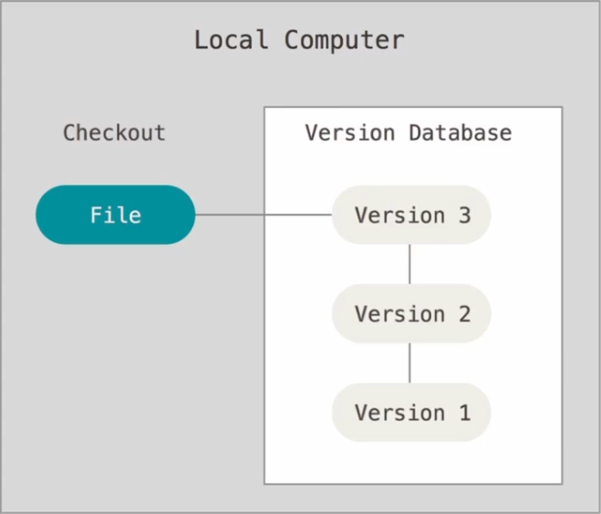

特点：

使用软件来纪律文件的不同版本，提高了工作效率，见降低了手动维护版本的出错率

缺点：

1. **单机运行，不支持多人协作开发**
2. 版本数据库故障后，所有历史更新记录会丢失

### 2. 集中化的版本控制系统

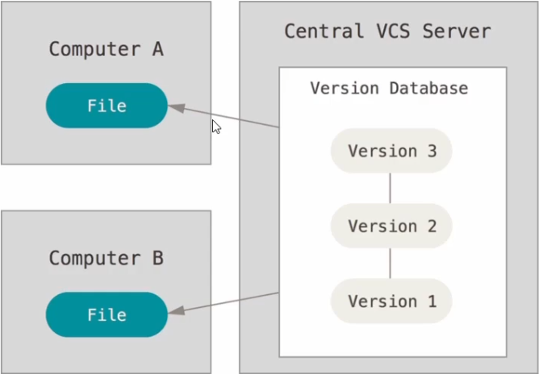

典型代表：SVN

特点：基于**服务器、客户端**的运行模式

1. 服务器保存文件的所有更新记录
2. 客户端**只保留最新的文件版本**

优点：联网运行，支持多人协作开发

缺点：

1. 不支持离线提交版本更新
2. 中心服务器崩溃后，所有人无法正常工作
3. 版本数据库故障后，所有历史更新记录会丢失

### 3. 分布式版本控制系统

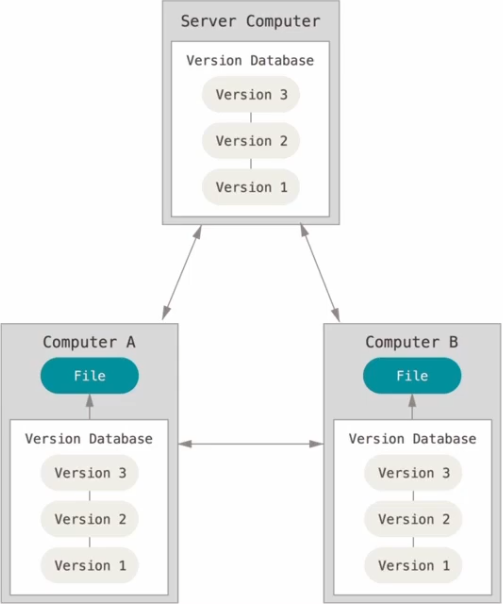

典型代表：Git

特点：基于**服务器、客户端**的运行模式

- 服务器保存文件的所有更新版本
- **客户端是服务器的完整备份**，并不是只保留文件的最新版本

优点：

1. 联网运行，支持多人协作开发
2. 客户端**断网**后支持离线本地提交版本更新
3. 服务器故障或损坏后，可使用任何一个客户端的备份进行恢复

## 5. Git 基础概念

### 1. 什么是 Git

Git是一个**开源的分布式版本控制系统**，是目前世界上**最先进、最流行**的版本控制系统。可以快速高效地处理从很小到非常大的项目版本管理。

特点：项目越大越复杂，协同开发者越多，越能体现出 Git 的**高性能**和**高可用性**！

### 2. Git 的特性

Git 之所以快速和高效，主要依赖于它的如下两个特性：

1. 直接记录快照，而非差异比较
2. 近乎所有操作都是本地执行

#### 1. SVN 的差异比较

传统的版本控制系统（例如 SVN）是**基于差异**的版本控制，它们存储的是**一组基本文件**和**每个文件随时间逐步累积的差异**。

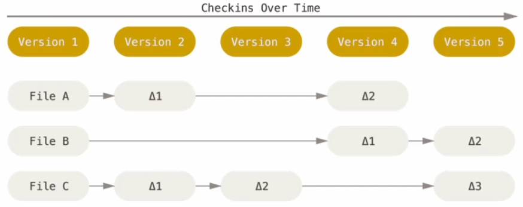

好处：节省磁盘空间

缺点：**耗时、效率低**

#### 2. Git 的记录快照

**Git 快照**是在原有文件版本的基础上重新生成一份新的文件，**类似于备份**。为了效率，如果文件没有修改，Git 不再重新存储该文件，而是只保留一个链接指向之前存储的文件。

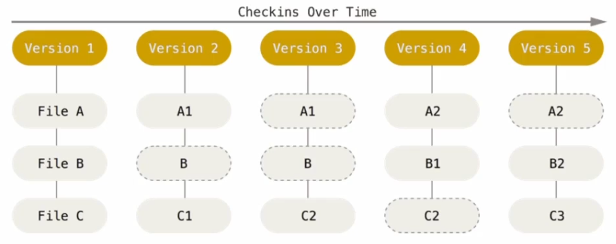

缺点：占用磁盘空间较大

优点：**版本切换时非常快**，因为每个版本都是完整的文件快照，切换版本时直接恢复目标版本的快照即可。

特点：**空间换时间**

#### 3. 近乎所有操作都是本地执行

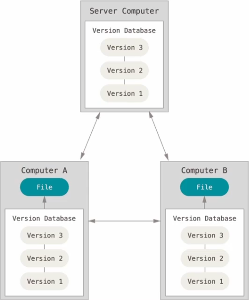

在 Git 中的绝大多数操作都**只需要访问本地文件和资源**，一般不需要来自网络上其他计算机的信息。

特性：

1. 断网后依旧可以在本地对项目进行版本管理
2. 联网后，把本地修改的记录同步到云端服务器即可

### 3. Git 中的三个区域

使用 Git 管理的项目，拥有三个区域，分别是**工作区、暂存区、Git 仓库**。


### 4. Git 中的三种状态

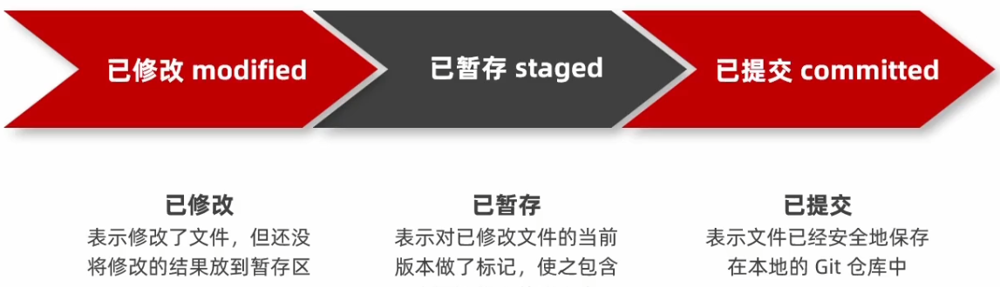

注意：

- 工作区的文件被修改了，但还没有放到暂存区，就是**已修改**状态。
- 如果文件已修改并放入暂存区，就属于**已暂存**状态。
- 如果 Git 仓库中**保存着特定版本**的文件，就属于**已提交**状态。

### 5. 基本的 Git 工作流程

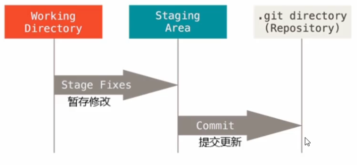

基本的Git工作流程如下：

1. 在工作区中修改文件
2. 将你想要下次提交的更改进行暂存
3. 提交更新，找到暂存区的文件，将快照永久性存储到 Git 仓库

# 2. Git 基础

## 1. 安装并配置 Git

### 1. 在 Windows 中下载并安装 Git

地址 https://git-scm.com/downloads

### 2. 配置用户信息

设置用户信息：

- git config --global user.name "longyuhuan"
- git config --global user.email "longyuhuanweb@icloud.com"

注意：如果使用了 **--global** 选项，那么该命令只需要运行一次，即可永久生效。

### 3. Git 的全局配置文件

通过 **git config --global user.name** 和 **git config --global user.email** 配置的用户名和邮箱地址，会被写入到 **C:/Users/用户名文件夹/.gitconfig** 文件中。这个文件是 Git 的**全局配置文件，配置一次即可永久生效**。

可以使用记事本打开此文件，从而查看自己曾经对 Git 做了哪些全局性的配置

### 4. 检查配置信息

除了使用记事本查看全局的配置信息之外，还可以运行如下的终端命令，快速的查看 Git 的全局配置信息：

查看所有的全局配置项：

- git config --list --global

查看指定的全局配置项：

- git config user.name
- git config user.email

### 5. 获取帮助信息

可以使用 **git help** 命令，无需联网即可在浏览器中打开帮助手册，例如：

| 命令            | 作用                           |
| --------------- | ------------------------------ |
| git help config | 打开 config 命令的帮助手册     |
| git config -h   | 获取 config 命令的快速参考手册 |

## 2. Git 的基本操作

### 1. 获取 Git 仓库的两种方式

1. 将尚未进行版本控制的**本地目录转换为 Git 仓库**
2. 从其它服务器**克隆**一个已经存在的 Git 仓库

以上两种方式都能够在自己的电脑上得到一个可用的 Git 仓库

### 2. 在现有目录中初始化仓库

如果自己有一个尚未进行版本控制的项目目录，想要用 Git 来控制它，需要执行如下两个步骤：

1. 在项目目录中，通过鼠标右键打开 “Git Bash”
2. 执行 **git init** 命令将当前的目录转化为 Git 仓库

git init 命令会创建一个名为 **.git** 的隐藏目录，**这个 .git 目录就是当前项目的 Git 仓库**，里面包含了**初始的必要文件**，这些文件是 Git 仓库的**必要组成部分**。

### 3. 工作区中文件的4种状态

工作区中的每一个文件可能有**4种状态**，这四种状态共分为**两大类**，如图所示：

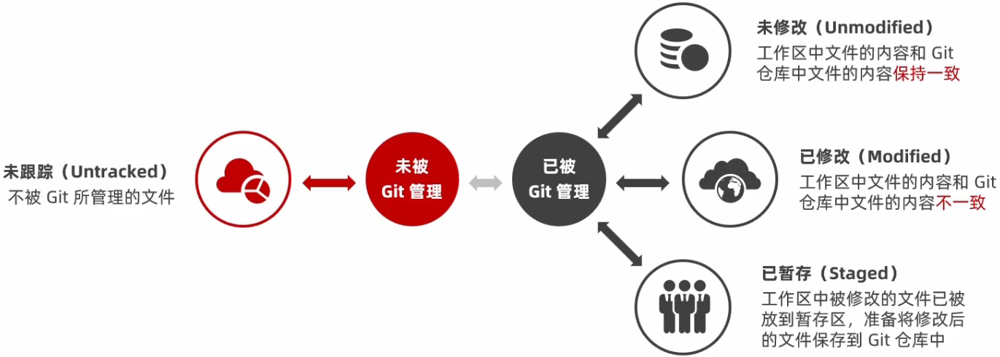

Git 操作的终极结果：让工作区中的文件都处于 “**未修改**” 的状态。

### 4. 检查文件的状态

可以使用 **git status** 命令查看文件处于什么状态，例如：

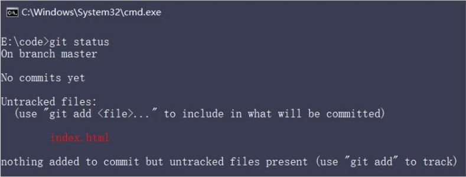

在状态报告中可以看到新建的 **index.html** 文件出现在 **Untracked files**（未跟踪的文件）下面。

未跟踪的文件意味着 **Git在之前的快照（提交）中没有这些文件**；Git 不会自动将之纳入跟踪范围，除非明确地告诉它 “我需要使用 Git 跟踪管理该文件”。

### 5. 以精简的方式显示文件状态

使用 **git status** 输出的状态报告很详细，但有些繁琐。如果希望**以精简的方式显示文件的状态**，可以使用如下两条完全等价的命令，其中 **-s 是 --short 的简写形式**：

- git status -s
- git status -short

未跟踪文件前面有**红色**的 **??** 标记，例如：

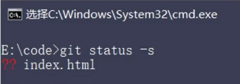

### 6. 跟踪新文件

使用命令 **git add** 开始跟踪一个文件。所以，要跟踪 index.html 文件，运行如下的命令即可：

- git add index.html

此时再运行 **git status** 命令，会看到 index.html 文件在 **Changes to be committed** 这行的下面，说明**已被跟踪**，并**处于暂存状态**：

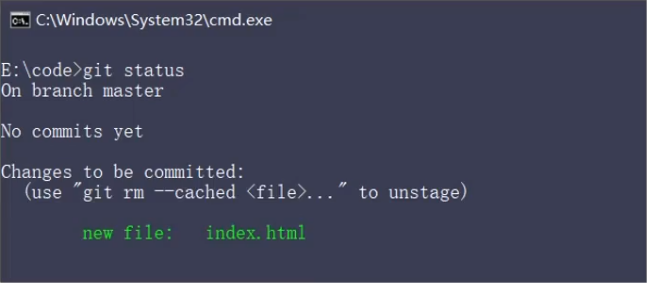

以精简的方式显示文件的状态：

**新添加到暂存区**中的文件前面有**绿色**的 **A** 标记

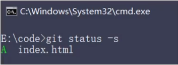

### 7. 提交更新

现在暂存区中有一个 index.html 文件**等待被提交**到 Git 仓库中进行保存。可以执行 **git commit** 命令进行提交，其中 **-m 选项**后面是本次的**提交消息**，用来**对提交的内容做进一步的描述**：

- git commit -m "提交信息"

提交成功之后，会显示如下的信息：

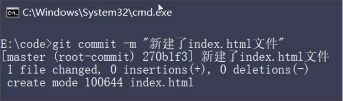

提交成功之后，再次检查文件的状态，得到提示如下：

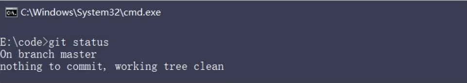

证明工作区中所有的文件都处于 “未修改” 的状态，**没有任何文件需要被提交**。

### 8. 对已提交的文件进行修改

目前，index.html 文件**已经被 Git 跟踪**，并且**工作区和 Git 仓库**中的 index.html 文件**内容保持一致**。当我们修改了工作区中 index.html 的内容之后，再次运行 **git status** 和 **git status -s** 命令，会看到如下的内容：

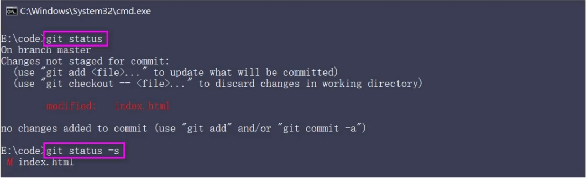

文件 index.html 出现在 **Changes not staged for commit** 这行下面，说明**已跟踪文件的内容发生了变化，但还没有放到暂存区**。

注意：修改过的、没有放入暂存区的文件前面有**红色**的 **M** 标记。

### 9. 暂存已修改的文件

目前，工作区中的 index.html 文件已被修改，如果要暂存这次修改，需要再次运行 **git add** 命令，这个命令是个多功能的命令，主要有如下3个功效：

1. 可以用它**开始跟踪新文件**
2. 把**已跟踪的、且已修改的**文件放到暂存区
3. 把有冲突的文件标记为已解决状态

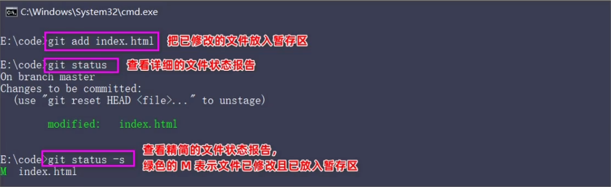

### 10. 提交已暂存的文件

再次运行 git commit -m "提交消息" 命令，即可将暂存区中记录的 index.html 的快照，提交到 Git 仓库中进行保存：

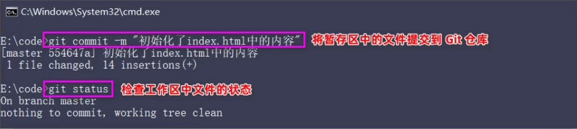

### 11. 撤销对文件的修改

撤销对文件的修改指的是：把对工作区中对应文件的修改，**还原**成 Git 仓库中所保存的版本。

操作的结果：所有的修改会丢失，且无法恢复！**危险性比较高，请慎重操作**！

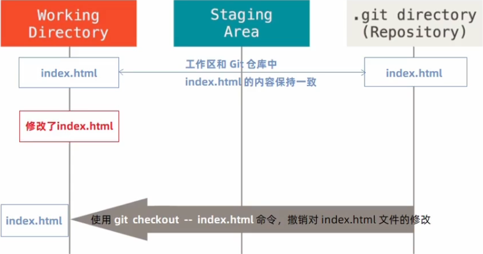

**撤销操作的本质**：用 Git 仓库中保存的文件，覆盖工作区中指定的文件。

### 12. 向暂存区中一次性添加多个文件

如果需要被暂存的文件个数比较多，可以使用如下的命令，一次性将所有的新增和修改过的文件加入暂存区：

- git add .

**今后在项目开发中，会经常使用这个命令，将新增和修改过后的文件加入暂存区。**

### 13. 取消暂存的文件

如果需要从暂存区中移除对应的文件，可以使用如下的命令：

- git reset HEAD 要移除的文件名称

如果需要从暂存区中移除所有的文件，可以使用如下的命令：

- git reset HEAD .

### 14. 跳过使用暂存区域

Git 标准的工作流程是**工作区** -> **暂存区** -> **Git 仓库**，但有时候这么做略显繁琐，此时可以跳过暂存区，直接将工作区中的修改提交到 Git 仓库，这时候 Git 工作的流程简化为了**工作区** -> **Git 仓库**。

Git 提供了一个跳过使用暂存区域的方式，只要在提交的时候，给 **git commit** 加上 **-a** 选项，Git 就会自动把所有已经跟踪过的文件暂存起来一并提交，从而跳过 git add 步骤：

- git commit -a -m "提交消息"

### 15. 移除文件

从 Git 仓库中移除文件的方式有两种：

1. 从 Git 仓库和工作区中**同时移除**对应的文件
2. 只从 Git 仓库中移除指定的文件，但保留工作区中对应的文件

| 命令                      | 作用                                                         |
| ------------------------- | ------------------------------------------------------------ |
| git rm -f index.js        | 从 Git 仓库和工作区中同时移除 index.js 文件                  |
| git rm --cached index.css | 只从 Git 仓库中移除 index.css，但保留工作区中的 index.css 文件 |

被移除的文件前面有个**绿色**的 **D** 标记

### 16. 忽略文件

一般我们总会有些文件无需纳入 Git 的管理，也不希望它们总出现在未跟踪文件列表。在这种情况下，我们可以创建一个名为  **.gitignore** 的配置文件，列出要忽略的文件的匹配模式。

文件 .gitignore 的格式规范如下：

1. 以 **# 开头**的是注释
2. 以 **/ 结尾**的是目录
3. 以 **/ 开头**防止递归
4. 以 **! 开头**表示取反
5. 可以使用 **glob 模式**进行文件和文件夹的匹配（glob 指简化了的正则表达式）

### 17. glob 模式

所谓的 **glob 模式**是指简化了的正则表达式：

1. ***** 匹配**零个或多个任意字符**
2. **[abc]** 匹配**任何一个列在方括号中的字符**（此案例匹配一个 a 或匹配一个 b 或匹配一个 c）
3. **?** 只**匹配一个任意字符**
4. 在方括号中使用**短划线**分隔两个字符，表示所有在这两个字符范围内的都可以匹配（比如 [0-9] 表示匹配所有 0 到 9 的数字）
5. **两个星号**表示**匹配任意中间目录**（比如 a/**/z 可以匹配 a/z、a/b/z 或 a/b/c/z 等）

### 18. .gitignore 文件的例子

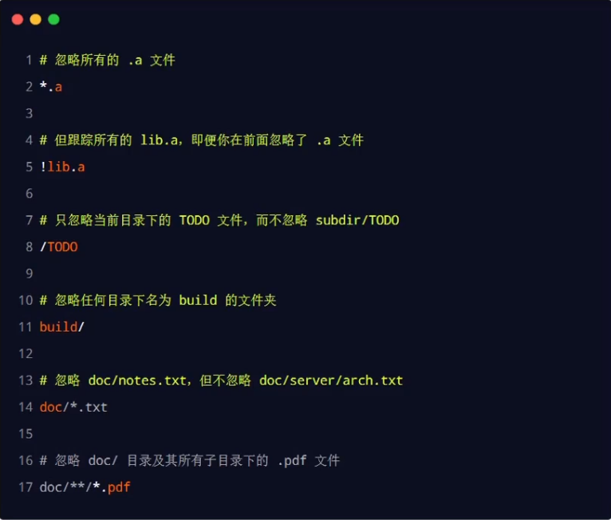

### 19. 查看提交历史

如果希望回顾项目的提交历史，可以使用 git log 这个简单且有效的命令。

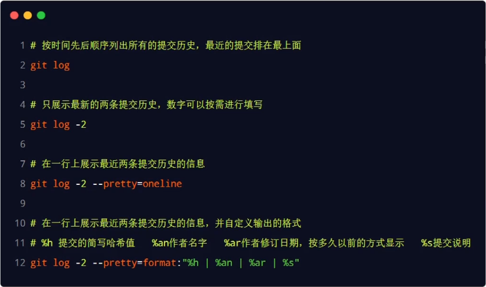

git log 命令后面还可以继续跟以下属性：

| 属性             | 作用                       |
| ---------------- | -------------------------- |
| --pretty=oneline | 将提交信息显示为一行       |
| --abbrev-commit  | 使得输出的 commitID 更简便 |
| --all            | 显示所有分支               |
| --graph          | 以图的形式显示             |

git log --pretty=oneline --abbrev-commit --all --graph：组合在一起使用

### 20. 回退到指定的版本

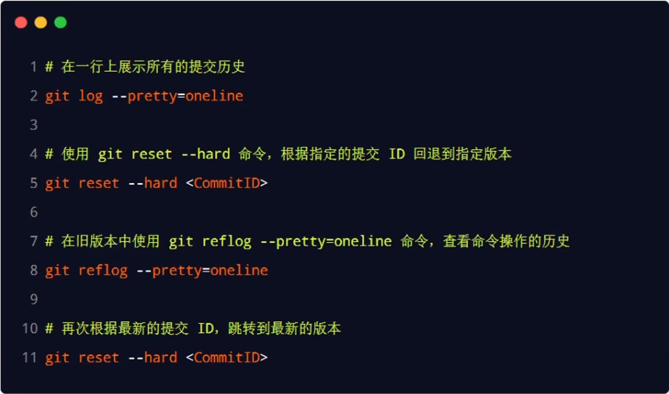

### 21. 为常用指令配置别名

1. 打开用户目录，创建 .bashrc 文件

    注意：部分 Windows 系统不允许用户创建点好开头的文件，可以打开 Git Bash Here 执行 touch ~/.bashrc 直接创建

2. 在 .bashrc 文件中输入：alias 别名='要取别名的指令'

    如：

    ​	#用于输出 git 提交日志

    ​	alias git-log='git log --pretty=oneline --abbrev-commit --all --graph'

3. 打开 Git Bash Here 执行 source ~/.bashrc

# 3. Github

## 1. 了解开源相关的概念

### 1. 什么是开源

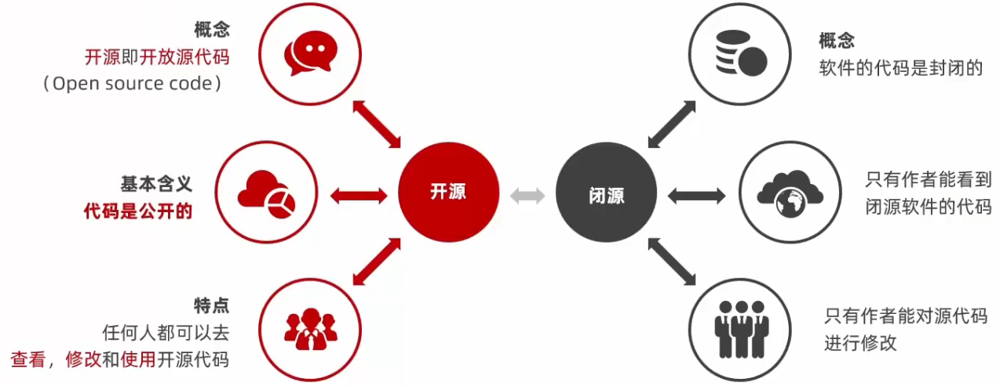

**通俗的理解**

开源是指不仅提供程序还提供程序的源代码

闭源是只提供程序，不提供源代码

### 2. 什么是开源许可协议

开源并不意味着完全没有限制，为了**限制使用者的使用范围**和**保护作者的权利**，每个开源项目都应该遵守**开源许可协议**（Open Source License）。

### 3. 常见的5种开源许可协议

1. BSD（Berkeley Software Distribution）

2. Apache Licence 2.0

3. **GPL**（GNU General Public License）

    具有传染性的一种开源协议，不允许修改后和衍生的代码做为闭源的商业软件发布和销售

    使用 GPL 的最著名的软件项目是：Linux

4. LGPL（GNU Lesser General Public License）

5. **MIT**（Massachusetts Institute of Technology, MIT）

    是目前限制最少的协议，唯一的条件：在修改后的代码或者发行包中，必须包含原作者的许可信息

    使用 MIT 的软件项目有：jQuery、Node.js

### 4. 为什么要拥抱开源

开源的**核心思想**是 “**我为人人，人人为我**”，人们越来越喜欢开源大致是出于以下3个原因：

1. 开源给使用者更多的控制权
2. 开源让学习变得容易
3. 开源才有真正的安全

开源是软件开发领域的大趋势，**拥抱开源就像站在了巨人的肩膀上**，不用自己重复造轮子，让开发越来越容易。

### 5. 开源项目托管平台

专门用于**免费存放开源项目源代码的网站**，叫做**开源项目托管平台**。目前世界上**比较出名的**开源项目托管平台主要有以下3个：

- Github（全球最牛的开源项目托管平台，没有之一）
- Gitlab（对代码私有性支持较好，因此企业用户较多）
- Gitee（又叫做**码云**，是国产的开源项目托管平台。访问速度快、纯中文界面、使用友好）

注意：以上3个开源项目托管平台，只能托管以 Git 管理的项目源代码，因此，它们的名字都以 Git 开头。

### 6. 什么是 Github

Github 是全球最大的**开源项目托管平台**。因为只支持 Git 作为唯一的版本控制工具，故名 GitHub。

在 Github 中，你可以：

1. 关注自己喜欢的开源项目，为其点赞打 call
2. 为自己喜欢的开源项目做贡献（Pull Request）
3. 和开源项目的作者讨论 Bug 和提需求（Issues）
4. 把喜欢的项目复制一份作为自己的项目进行修改（Fork）
5. 创建属于自己的开源项目
6. etc...

So，Github != Git

## 2. 注册账号

注册 Github 账号的流程

1. 访问 Github 的官网首页 https://github.com/
2. 点击 “**Sign up**” 按钮跳转到注册页面
3. 填写可用的**用户名、邮箱、密码**
4. 通过点击箭头的形式，**将验证图片摆正**
5. 点击 “**Create account**” 按钮注册新用户
6. 登录到第三步填写的邮箱中，**点击激活链接，完成注册**

## 3. 远程仓库的使用

### 1. 新建空白远程仓库

步骤：

1. 点击 New repository
2. 输入仓库名称（Repository name）
3. 输入描述（Description）

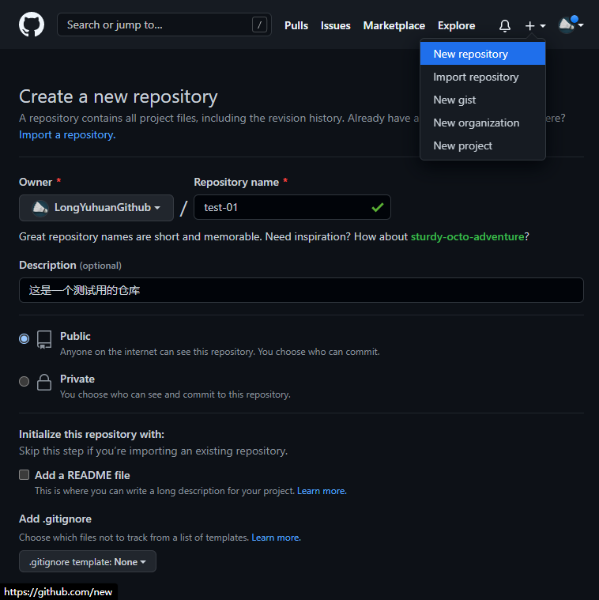

创建成功之后的视图：

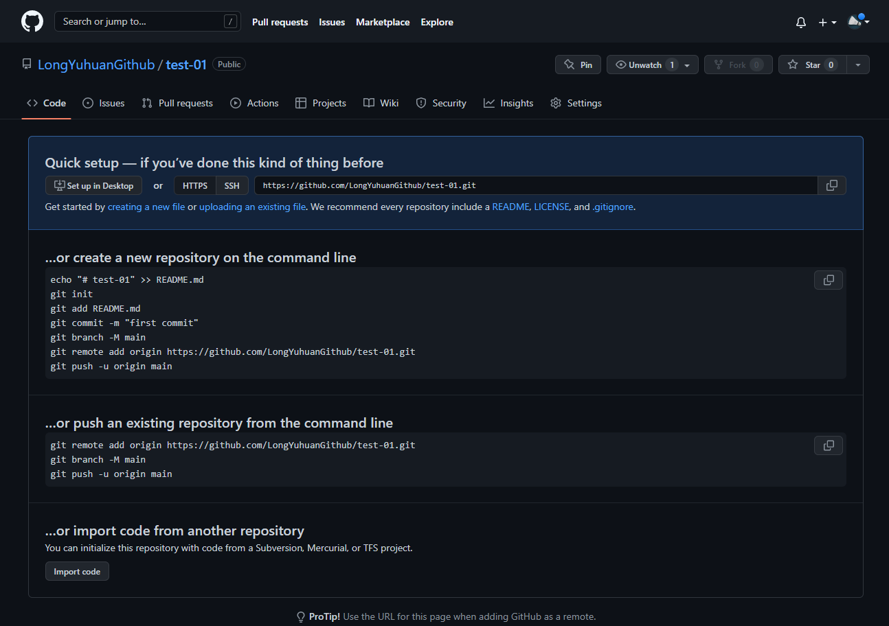

### 2. 远程仓库的两种访问方式

Github 上的远程仓库，有两种访问方式，分别是 **HTTPS** 和 **SSH**。它们的区别是：

1. HTTPS：**零配置**；但是每次访问仓库时，需要重复输入 Github 的账号和密码才能访问成功
2. SSH：**需要进行额外的配置**；但是配置成功后，每次访问仓库时，不需重复输入 Github 的账号和密码

注意：在实际开发中，**推荐使用 SSH 的方式访问远程仓库**。

### 3. 基于 HTTPS 将本地仓库上传到 Github

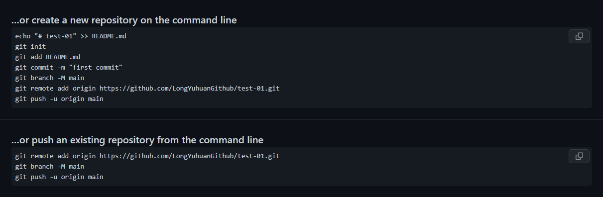

如果**本地没有**现成的 Git 仓库，就执行图中的**上半部分命令**

如果**本地有**现成的 Git 仓库，就执行图中的**下半部分命令**

**注意**：Git 的默认分支是 master，以上操作是以 main 为主分支

执行了以上操作之后，以后再想将修改的文件上传到 Github，直接执行 **git push** 即可

### 4. SSH

SSH 的**作用**：实现本地仓库和 Github 之间**免登录**的**加密数据传输**。

SSH 的**好处**：免登录身份认证、数据加密传输。

SSH 由**两部分组成**，分别是：

1. id_rsa（私钥文件，存放于客户端的电脑中即可）
2. id_rsa.pub（公钥文件，需要配置到 Github 中）

### 5. 生成 SSH

1. 打开 Git Bash Here

2. 粘贴如下的命令（-C 后面跟的是 Github 账号的邮箱）：

    ssh-keygen -t rsa -b 4096 -C "longyuhuanweb@icloud.com"

3. 连续敲击3次回车，即可在 C:/Users/用户名文件夹/.ssh 目录中生成 id_ras 和 id_rsa.pub 两个文件

### 6. 配置 SSH

1. 打开 **Git Bash Here**
2. 执行 **cat ~/.ssh/id_rsa.pub**，复制文件里的内容
3. 在浏览器中登录 Github，**点击头像** -> **Settings** -> **SSH and GPG Keys** -> **New SSH key**
4. 将复制的内容**粘贴到 Key 对应的文本框中**
5. 在 Title 文本框中任意填写一个名称，来标识这个 Key 从何而来
6. 点击 **Add SSH key** 即可

### 7. 检测 Github 的 SSH 是否配置成功

打开 Git Bash Here，执行如下命令：

- ssh -T git@github.com

上述命令执行成功后，可能会看到如下的提示消息：

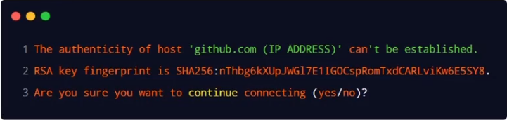

输入 yes 之后，如果能看到类似于下面的提示消息，证明 SSH 已经配置成功了：

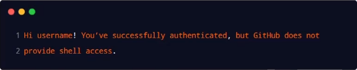

### 8. 基于 SSH 将本地仓库上传到 Github

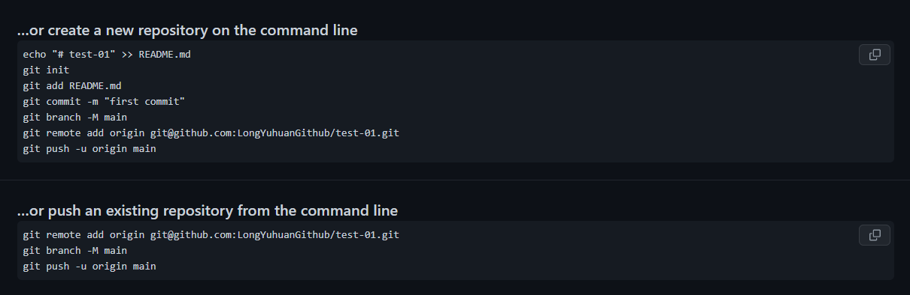

如果**本地没有**现成的 Git 仓库，就执行图中的**上半部分命令**

如果**本地有**现成的 Git 仓库，就执行图中的**下半部分命令**

**注意**：Git 的默认分支是 master，以上操作是以 main 为主分支

执行了以上操作之后，以后再想将修改的文件上传到 Github，直接执行 **git push** 即可

### 9. 将远程仓库克隆到本地

打开 Git Bash Here，执行如下命令：

- git clone 远程仓库的SSH地址

远程仓库的 SSH 地址如下图（点击 Code 展示出来）：

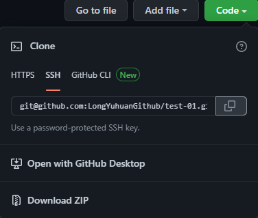

# 4. Git 分支

## 1. 本地分支操作

### 1. 分支的概念

分支就是科幻电影里面的**平行宇宙**，当你正在电脑前努力学习 Git 的时候，另一个你正在另一个平行宇宙努律学习 SVN。

如果两个平行宇宙互不干扰，那对现在的你也没啥影响。

不过，**在某个时间点，两个平行宇宙合并了**，结果，你既学会了 Git 又学会了 SVN！


### 2. 分支在实际开发中的作用

在进行多人协作开发的时候，为了防止互相干扰，提高协同开发的体验，建议每个开发者都基于分支进行项目功能的开发，例如：


### 3. master 主分支

在初始化本地 Git 仓库的时候，Git 默认已经帮我们创建了一个名字叫做 **master** 的分支。通常我们把这个 master 分支叫做**主分支**。

在实际工作中，master 主分支的作用是：**用来保存和记录整个项目已完成的功能代码**。

因此，不允许程序员直接在 master 分支上修改代码，因为这样做的风险太高，容易导致整个项目崩溃。

### 4. 功能分支

由于程序员不能直接在 master 分支上进行功能的开发，所以就有了**功能分支**的概念。

**功能分支**指的是**专门用来开发新功能的分支**。它是临时从 master 主分支上分叉出来的，当新功能开发且测试完毕后，最终需要合并到 master 主分支上，如图所示：


### 5. 查看分支列表

使用如下的命令，可以查看当前 Git 仓库中所有的分支列表：

- git branch

运行的结果如下所示：

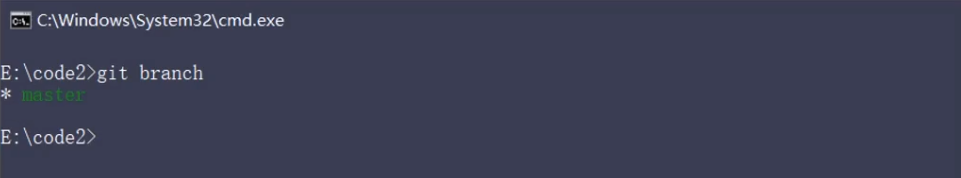

注意：分支名字前面的 ***** 号表示**当前所处的分支**。

### 6. 创建新分支

使用如下的命令，可以**基于当前分支，创建一个新的分支**，此时，新分支中的代码和当前分支完全一样：

- git branch 分支名称

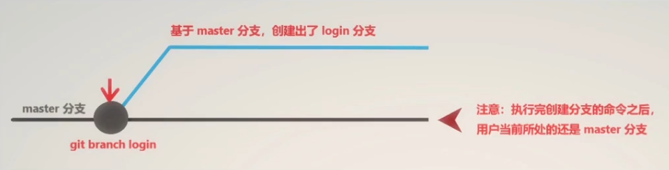

### 7. 切换分支

使用如下的命令，可以**切换到指定的分支上**进行开发：

- git checkout 分支名称

### 8. 分支的快速创建和切换

使用如下命令，可以**创建指定名称的新分支**，并**立即切换到新分支**上：

- git checkout -b 分支名称

    -b 表示创建一个新分支

    checkout 表示切换到刚才新建的分支上

注意：

**git checkout -b 分支名称** 是下面两条命令的简写形式：

1. **git branch 分支名称**
2. **git checkout 分支名称**

### 9. 修改当前分支名

- git branch -M main

    表示将当前所在分支的名字修改为 **main**

### 10. 合并分支

功能分支的代码开发测试完毕之后，可以使用如下的命令，将完成后的代码合并到 master 主分支上：

- git checkout master

    切换到 master 分支

- git merge login

    在 master 分支上运行 git merge 命令，将 login 分支的代码合并到 master 分支

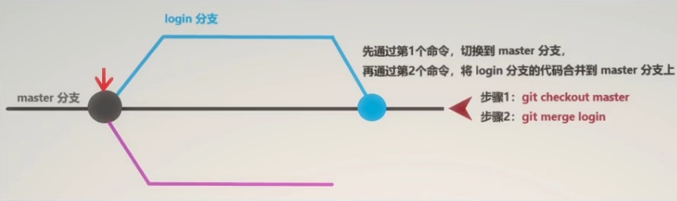

合并分支时的注意点：

假设要把 C 分支的代码合并到 A 分支，则必须**先切换到 A 分支**上，**再运行 git merge 命令**，来合并 C 分支！

### 11. 删除分支

当把功能分支的代码合并到 master 主分支上以后，就可以使用如下的命令，删除对应的功能分支：

- git branch -d 分支名称

图示如下：

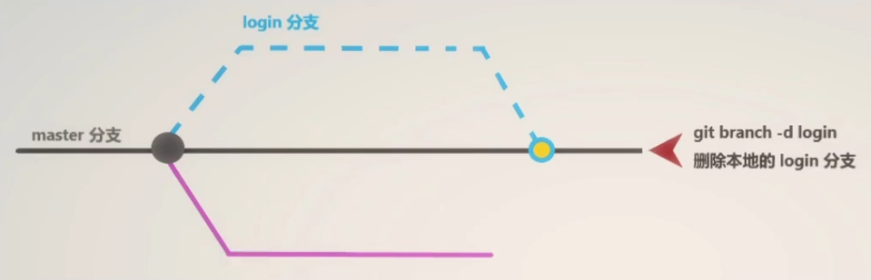

### 12. 遇到冲突时的分支合并

如果**在两个不同的分支中**，对**同一个文件**进行了**不同的修改**，Git 就没法干净的合并它们。此时，我们需要打开这些包含冲突的文件然后**手动解决冲突**。

假设：在把 register 分支合并到 master 分支期间，代码发生了冲突

- git checkout master
- git merge register

打开包含冲突的文件，手动解决冲突之后，再执行如下的命令：

- git commit -a -m "解决了分支合并冲突的问题"

## 2. 远程分支操作

### 1. 将本地分支推送到远程仓库

如果是**第一次**将本地分支推送到远程仓库，需要运行如下的命令：

- git push -u 远程仓库的别名 本地分支名称:远程分支名称

案例：

- git push -u origin register:master

如果远程分支名称和本地分支名称一致，可以对命令进行简化：

- git push -u origin master

注意：第一次推送分支需要带 **-u 参数**，此后可以直接

使用 **git push** 推送代码到远程分支。

### 2. 查看远程仓库中所有的分支列表

通过如下的命令，可以查看远程仓库中，所有的分支列表的信息：

- git remote show 远程仓库名称

### 3. 跟踪分支

跟踪分支指的是：从远程仓库中，把远程分支下载到本地仓库中。需要运行的命令如下：

| 命令                                                   | 作用                                                         |
| ------------------------------------------------------ | ------------------------------------------------------------ |
| git checkout 远程分支的名称                            | 从远程仓库中，把对应的远程分支下载到本地仓库，保持本地分支和远程分支名称相同 |
| git checkout -b 本地分支名称 远程仓库名称/远程分支名称 | 从远程仓库中，把对应的远程分支下载到本地仓库，并把下载的本地分支进行重命名 |

### 4. 拉取远程分支的最新的代码

可以使用如下的命令，把远程分支最新的代码下载到本地对应的分支中：

- git pull

    从远程仓库，拉取当前分支最新的代码，保持当前分支的代码和远程分支代码一致

### 5. 删除远程分支

可以使用如下的命令，删除远程仓库中指定的分支：

- git push 远程仓库名称 --delete 远程分支名称

    删除远程仓库中，指定名称的远程分支