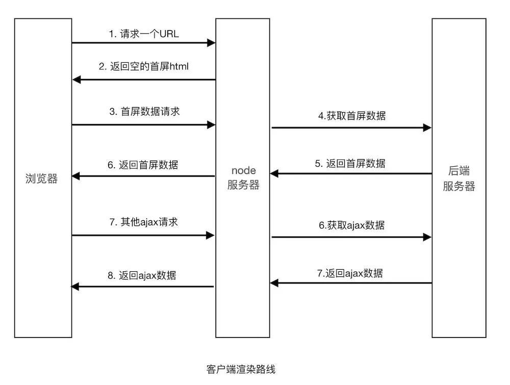
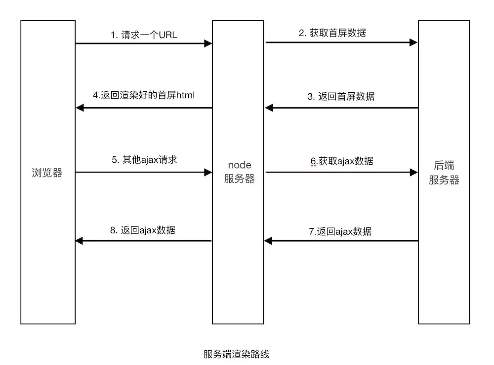

# 1. 客户端渲染 VS 服务端渲染

## 1. 什么是 CSR

**CSR（Client side Render）**：客户端渲染简单理解就是浏览器发送页面请求，服务器返回的是一个 HTML 模板页面，浏览器从上至下解析模板过程中如果遇到 ajax，就会发送 ajax 请求获取数据，最后再调用模板引擎（art-template 等）与数据拼装，以 DOM 的形式插入到 HTML 页面中。第一步拿到的是静态页面，第二步拿到的是动态数据。

客户端渲染因为数据是异步获取，所以在展示完整页面的过程中最少发起两次请求，数据是动态的添加到页面中，因此，非常不利于 SEO，便于前后端分离开发。现如今前端采用 Vue 等框架开发非常多见，因此为了解决纯客户端渲染面临的问题，很多类似 Vue 中使用 SSR 和前后端同构的思想也非常常见。



## 2. 什么是 SSR

**SSR（Server side Render）**：客户端发送请求，服务端执行相应的 js 代码把请求的页面与数据拼接好后返回给客户端，客户端调用模板引擎进行解析渲染成页面。https://blog.csdn.net/jal517486222/article/details/107809945

`疑问：服务器渲染不会遇到 ajax 请求吗？`

如果有 link 标签、script 标签，浏览器还是会发送请求加载文件。



## 3. CSR & SSR 优缺点对比

**CSR 优点**：

- 网络传输数据量小
- 可以减小服务端的压力
- 无需每次去请求完整页面

**CSR 缺点**：

首屏渲染速度慢、不利于 SEO、爬虫不能爬取到完整的 HTML 代码。如果一个项目的流量入口来自搜索引擎，用 CSR 就非常不合适了

`为什么 CSR 的首屏渲染速度会慢？`

CSR 项目中 TTFP（Time To First Page）时间比较长，在 CSR 的页面渲染流程中，首先要加载 HTML 文件，之后要下载页面所需的 JavaScript 文件，然后 JavaScript 文件渲染生成页面。在这个渲染过程中至少涉及到两个 HTTP 请求周期，所以会有一定的耗时，这也是为什么大家在低网速下访问普通的 React 或者 Vue 应用时，初始页面会有出现白屏的原因。

**SSR 优点**：

- 首屏渲染速度快
- 有利于 SEO，因为返回的是整个 HTML 页面，有利于爬虫获取数据。多见于电商网站商品信息获取
- 节能

**SSR 缺点**：

- 不易维护
- 容易导致服务端的压力比较大。可以使用服务端缓存技术减轻服务端的压力

# 2. Vue 服务端渲染指南

安装：

```sh
npm i vue@2.7.13 vue-server-renderer@2.7.13
```

使用：

```js
const Vue = require('vue')
const vueServerRenderer = require('vue-server-renderer')

// 1. 创建一个 Vue 实例
const vue = new Vue(Vue.defineComponent({
  template: `<div>Hello</div>`
}))

// 2. 创建一个 renderer
const renderer = vueServerRenderer.createRenderer()

// 3. 将 Vue 实例渲染为 HTML
// renderer.renderToString(Vue实例, (错误, 渲染后的html) => {})
renderer.renderToString(vue, (error, html) => {
  if (error) throw error
  console.log('回调函数形式', html)
})

// 在 2.5.0+ 版本中，如果没有传入回调函数，则会返回 Promise
renderer.renderToString(vue).then(html => console.log('Promise形式', html)).catch(error => console.log(error))
```

结合 express 使用：

```js
const Vue = require('vue')
const vueServerRenderer = require('vue-server-renderer')
const express = require('express')

const app = express()

// express 响应
app.get('/', (request, response) => {
  const vue = new Vue(Vue.defineComponent({
    template: `<div>${request.url}</div>`
  }))

  const renderer = vueServerRenderer.createRenderer()

  renderer.renderToString(vue).then(html => {
    // 将渲染出来的内容响应给客户端
    response.send(`
      <!DOCTYPE html>
      <html lang="en">
      <head>
        <meta charset="UTF-8">
        <meta http-equiv="X-UA-Compatible" content="IE=edge">
        <meta name="viewport" content="width=device-width, user-scalable=no, initial-scale=1.0">
        <title>Title</title>
      </head>
      <body>
      ${html}
      </body>
      </html>
    `)
  }).catch(error => console.log(error))
})

app.listen(3000)
```

# 3. Nuxt 框架


# 4. 生命周期

# 5. 路由

# 6. 数据交互

# 7. 状态管理

# 8. UI 库服务端渲染

# 9. 全局定义

# 10. Meta 优化

# 11. Sass、SCSS 在服务端使用

# 12. 定义模板、模块、插件

# 13. 资源配置

# 14. 部署

# 15. Nuxt for ts