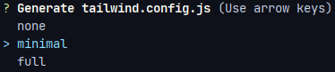

# 1. Vue 项目结合 Tailwind CSS

## 第一种：

### 1. 使用 vue-cli 创建 Vue 项目

```sh
vue create vue-demo
```

### 2. 安装 Tailwind CSS

安装 Tailwind CSS 以及其它依赖项：

```sh
npm install -D tailwindcss@latest postcss@latest autoprefixer@latest
```

### 3. 创建配置文件

接下来，生成您的 tailwind.config.js 和 postcss.config.js 文件：

```sh
npx tailwindcss init -p
```

tailwind.config.js 文件：

```js
/** @type {import('tailwindcss').Config} */
module.exports = {
  content: ['./public/**/*.html', './src/**/*.{vue,js,ts,jsx,tsx}'], // 指定所有模板文件的路径
  theme: {
    extend: {
      screens: {
        ms: '720px' // 配置 ms 类名
      }
    }
  },
  plugins: []
}
```

postcss.config.js 文件：

```js
module.exports = {
  plugins: {
    tailwindcss: {},
    autoprefixer: {}
  }
}
```

### 4. 包含 Tailwind CSS 到 CSS 中

创建 src/assets/tailwind.css 文件：

```css
@tailwind base;

@tailwind components;

@tailwind utilities;
```

如果您使用的是像 Vue 或 React 这样的 JavaScript 框架，支持直接将 CSS 文件导入到 JS 中，那么您也可以完全跳过创建 CSS 文件，而直接导入 tailwindcss/tailwind.css，而后者已经安装了所有这些指令：

src/main.js 文件：

```js
import './assets/tailwind.css' // 导入刚刚创建的 tailwind.css 文件
// import 'tailwindcss/tailwind.css' // 或者直接导入 tailwindcss/tailwind.css 文件，内容是一样的
import {createApp} from 'vue'
import App from './App.vue'

createApp(App).mount('#app')
```

### 5. 使用 Tailwind CSS

src/App.vue 文件：

```vue
<template>
  <div class="app">
    <!-- 使用 Tailwind -->
    <div class="w-full h-screen bg-red-400 flex justify-center items-center">
      hello
    </div>
  </div>
</template>
```

## 第二种：

### 1. 使用 vue-cli 创建 Vue 项目

```sh
vue create vue-demo
```

### 2. 执行以下命令直接结合 Tailwind CSS

```sh
vue add tailwind
```



选择 minimal（最小的）即可，除了 `tailwindcss`、`postcss`、`autoprefixer` 三个依赖是安装在 `dependencies` 节点中以外，其他结构和第一种方式一样。

# 2. Node.js 项目结合 Tailwind CSS

## 1. 初始化 package.json 文件

```sh
npm init -y
```

## 2. 安装 Tailwind CSS

```sh
npm i tailwindcss postcss postcss-cli autoprefixer
```

## 3. 创建配置文件

创建 tailwind.config.js 和 postcss.config.js 文件：

```sh
npx tailwindcss init -p
```

tailwind.config.js 文件：

```js
/** @type {import('tailwindcss').Config} */
module.exports = {
  content: ['./layouts/**/*.{html,js,ts}'],
  theme: {
    extend: {}
  },
  plugins: []
}
```

postcss.config.js 文件：

```js
module.exports = {
  plugins: {
    tailwindcss: {},
    autoprefixer: {}
  }
}
```

## 4. 创建 tailwind.css 文件

```css
@tailwind base;

@tailwind components;

@tailwind utilities;
```

## 5. 创建 style.css 文件

创建一个空文件出来即可

## 6. 修改 package.json 文件

添加以下命令并执行：

```json
"scripts": {
  "test": "postcss tailwind.css -o style.css"
}
```

## 7. 使用 Tailwind CSS

```html
<!DOCTYPE html>
<html lang="en">
<head>
  <meta charset="UTF-8">
  <meta http-equiv="X-UA-Compatible" content="IE=edge">
  <meta name="viewport" content="width=device-width, user-scalable=no, initial-scale=1.0">
  <!-- 导入 style.css -->
  <link rel="stylesheet" href="../style.css">
  <title>Title</title>
</head>
<body>
<!-- 使用 Tailwind -->
<div class="w-full h-screen bg-red-400 flex justify-center items-center">
  hello
</div>
</body>
</html>
```

# 3. ElementPlus 结合 Tailwind CSS

要先安装 **Tailwind CSS** 再安装 **ElementPlus**，不然可能没有 **Tailwind CSS** 的类名提示

# 4. 生产优化

作用：在构建时，移除没有使用到的类，tailwind2.0 版本在 purge 里配置，tailwind3.0 版本不需要配置，就在 content 里。

tailwind.config.js 文件（2.0）：

```js
module.exports = {
  purge: ['./public/**/*.html', './src/**/*.{vue,js,ts,jsx,tsx}'] // 指定对哪些文件进行生产优化
}
```

# 5. 预设

tailwind.config.js 文件中默认预设了一些主题，默认预设文件的网址：https://unpkg.com/browse/tailwindcss@3.1.8/stubs/defaultConfig.stub.js

可根据以上网址在 tailwind.config.js 文件中扩展和覆盖预设主题：

```js
/** @type {import('tailwindcss').Config} */
module.exports = {
  theme: {
    extend: { // 在 extend 中配置的主题是扩展（保留预设的主题）
      screens: {
        ms: '720px'
      }
    },
    height: { // 在这里配置的主题是覆盖（不保留预设的主题）
      '50screen': '50vh' // 配置 50screen 类名
    }
  }
}
```

src/App.vue 组件：

```vue
<template>
  <div class="app">
    <!-- h-50screen 是刚刚配置的 50screen 类名 -->
    <div class="w-full h-50screen bg-red-400 flex justify-center items-center">
      hello
    </div>
  </div>
</template>
```

# 6. 生态

https://github.com/icopy-site/awesome-cn/blob/master/docs/awesome/awesome-tailwindcss.md

以上网址提供了很多 **tailwindcss** 的封装库

# 7. 基本样式

src/assets/tailwind.css 文件中的 `@tailwind base;` 设置了很多基本样式，参考：https://tailwindcss.com/docs/preflight

**扩展基本样式**

修改 src/assets/tailwind.css 文件：

```css
@tailwind base;

/* 扩展基本样式 */
@layer base {
  /* 定义 h1 标签的基本样式 */
  h1 {
    @apply text-green-400 text-2xl font-bold;
  }

  /* 定义 h2 标签的基本样式 */
  h2 {
    @apply text-green-500 text-xl font-bold;
  }
}

@tailwind components;

@tailwind utilities;

```

src/App.vue 组件：

```vue
<template>
  <div class="app">
    <h1>h1标签</h1>
    <h2>h2标签</h2>
  </div>
</template>
```

# 8. 抽取组件

## 1. 第一种方式

修改 src/assets/tailwind.css 文件：

```css
@tailwind base;

@tailwind components;

/* 抽取组件 */
@layer components {
  /* 抽取一个 banner 组件 */
  .banner {
    /* 没有 ms 类名，需要配置主题 */
    @apply flex flex-wrap sm:flex-nowrap sm:justify-center sm:items-center bg-indigo-500 relative sm:gap-3 px-4 sm:pr-8 ms:px-8 py-3;
  }
}

@tailwind utilities;
```

tailwind.config.js 文件：

```js
module.exports = {
  theme: {
    extend: {
      screens: {
        ms: '720px' // 配置 ms 类名
      }
    }
  }
}
```

src/App.vue 组件：

```vue
<template>
  <div class="app">
    <!-- 使用 Flowrift -->
    <div class="bg-white pb-6 sm:pb-8 lg:pb-12">
      <!-- 使用抽取的 banner 组件 -->
      <div class="banner">...</div>
    </div>
  </div>
</template>
```

## 2. 第二种方式

src/App.vue 组件：

```vue
<template>
  <div class="app">
    <!-- 使用 Flowrift -->
    <div class="bg-white pb-6 sm:pb-8 lg:pb-12">
      <!-- 使用抽取的 banner 组件 -->
      <div class="banner">
        <!-- 使用抽取的 title 组件 -->
        <div class="title">This is a section of some simple filler text, also known as placeholder text.</div>
      </div>
    </div>
  </div>
</template>

<style lang="scss">
// 抽取组件
.title {
  @apply order-1 sm:order-none w-11/12 sm:w-auto max-w-screen-sm inline-block text-white text-sm md:text-base mb-2 sm:mb-0;
}
</style>
```

## 3. 抽取的组件无法对响应式做出改变

src/App.vue 组件：

```vue
<template>
  <div class="app">
    <!-- 测试抽取组件的响应式 -->
    <div class="w-1/3 h-50screen flex justify-center items-center green-500 hover:green-400">
      测试抽取组件的响应式
    </div>
  </div>
</template>

<script>
export default {}
</script>

<style lang="scss">
// 抽取的组件无法对响应式做出改变
.green-400 {
  @apply bg-green-400;
}

.green-500 {
  @apply bg-green-500;
}
</style>
```

想要抽取的组件对响应式做出改变，用 @variants 包裹起来即可。

src/assets/tailwind.css 文件：

```css
@tailwind base;

@tailwind components;

/* 抽取组件 */
@layer components {
  /* 想要抽取的组件对响应式做出改变，用 @variants 包裹起来即可 */
  @variants hover, focus {
    .green-400 {
      @apply bg-green-400;
    }

    .green-500 {
      @apply bg-green-500;
    }
  }
}

@tailwind utilities;
```

# 9. 添加原生 css 功能类

src/assets/tailwind.css 文件：

```css
@tailwind base;

@tailwind components;

@tailwind utilities;

/* 添加原生 css 功能类 */
@layer utilities {
  .box {
    width: 300px;
    height: 300px;
    background-color: pink;
    text-align: center;
    line-height: 300px;
  }
}

```

src/App.vue 组件：

```vue
<template>
  <div class="app">
    <!-- 使用添加的原生 css 功能类-->
    <div class="box">Lorem ipsum dolor sit amet.</div>
  </div>
</template>
```

