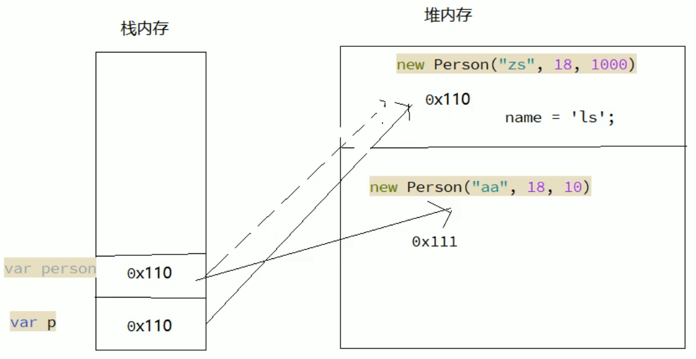
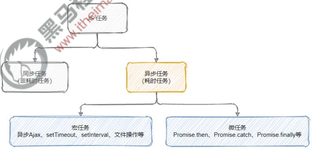
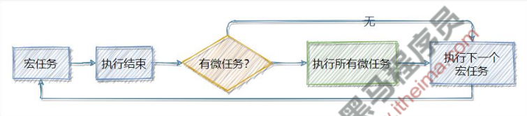
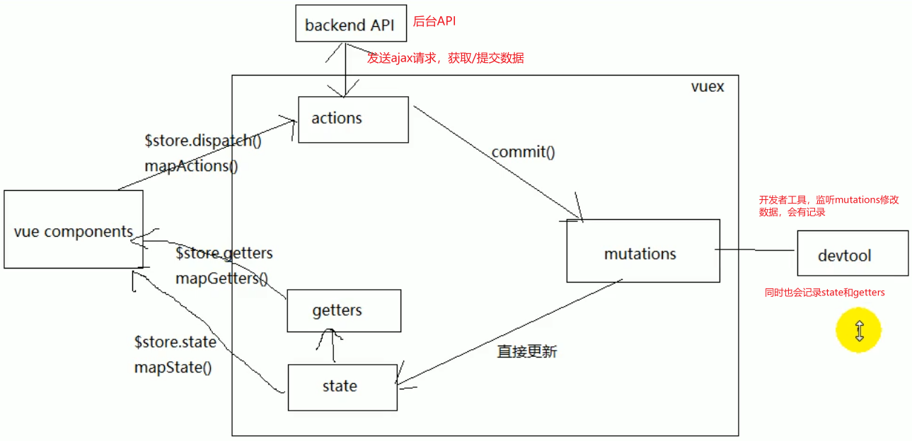
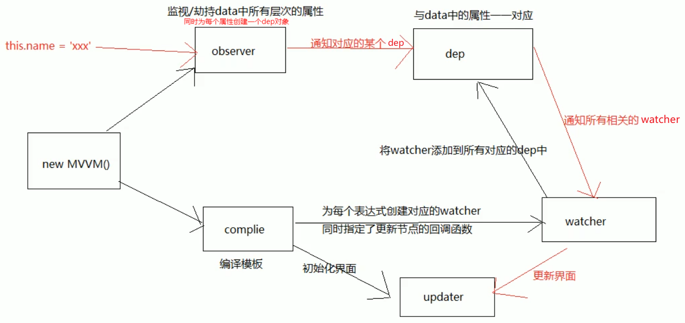

# 1. 作用域

```js
// 作用域
var num1 = 55
var num2 = 66

function f1(num, num1) {
  // var num1 = 55
  // var num2 = 66
  num = 100
  num1 = 100
  num2 = 100
  console.log(num) // 100
  console.log(num1) // 100
  console.log(num2) // 100
}

// 55    66
f1(num1, num2)
console.log(num1) // 55
console.log(num2) // 100
console.log(num) // 报错
```

# 2. 值类型和引用类型的传递

```js
function Person(name, age, salary) {
  this.name = name
  this.age = age
  this.salary = salary
}

function f1(person) {
  // 内部是创建了以下变量
  // var person = p

  person.name = 'ls'
  person = new Person('aa', 18, 10) // person 改变了，但是 p 没改变
}

var p = new Person('zs', 18, 1000)
console.log(p.name) // zs
f1(p)
console.log(p.name) // ls
```



# 3. 封装函数将字符串进行驼峰命名

```js
// 已知有字符串 foo='get-element-by-id'，写一个 function 将其转化成驼峰表示法 “getElementById”

function toString(foo) {
  // var foo = 'get-element-by-id'
  const array = foo.split('-') // 根据某个字符进行切割
  for (let i = 1; i < array.length; i++) {
    array[i] = array[i].charAt(0).toUpperCase() + array[i].substring(1) // 获取每个元素中的第一个字符并转换成大写
  }
  return array.join('')
}

console.log(toString('get-element-by-id')) // getElementById
```

# 4. 冒泡排序

```js
// 第一种（效率高）
let array = [2, 3, 1, 5, 4]

for (let i = 0; i < array.length; i++) {
  for (let j = i + 1; j < array.length; j++) {
    if (array[i] > array[j]) array[i] = [array[j], array[j] = array[i]][0] // 交换值
  }
}

console.log(array)

// 第二种（效率低）
array = [2, 3, 1, 5, 4]

for (let i = 0; i < array.length - 1; i++) {
  for (let j = 0; j < array.length - 1 - i; j++) {
    if (array[j] > array[j + 1]) array[j] = [array[j + 1], array[j + 1] = array[j]][0] // 交换值
  }
}

console.log(array)
```

# 5. 反转数组

```js
// 第一种
let array = [1, 2, 3, 4, 5]

array.reverse()

console.log(array)

// 第二种
array = [1, 2, 3, 4, 5]

for (let i = 0; i < array.length / 2; i++) {
  array[i] = [array[array.length - 1 - i], array[array.length - 1 - i] = array[i]][0] // 交换值
}

console.log(array)

```

# 6. 数组去重

```js
let array = [1, 1, 2, 2, 3, 3]

array = [...new Set(array)]

console.log(array)
```

# 7. 水平垂直居中

```html
<!DOCTYPE html>
<html lang="en">
<head>
  <meta charset="UTF-8"/>
  <meta http-equiv="X-UA-Compatible" content="IE=edge"/>
  <meta name="viewport" content="width=device-width, initial-scale=1.0"/>
  <style>
    * {
      margin: 0;
      padding: 0;
    }

    .father {
      width: 400px;
      height: 400px;
      background-color: pink;

      /* 第一种和第二种 */
      /*position: relative;*/

      /* 新版本 flex */
      /*display: flex;
      justify-content: center;
      align-items: center;*/

      /* 老版本 flex */
      display: -webkit-box;
      -webkit-box-pack: center;
      -webkit-box-align: center;
    }

    .father .son {
      width: 200px;
      height: 200px;
      background-color: skyblue;

      /* 第一种 */
      /*position: absolute;
      top: 0;
      right: 0;
      bottom: 0;
      left: 0;
      margin: auto;*/

      /* 第二种 */
      /*position: absolute;*/
      /*top: 50%;*/
      /*left: 50%;*/
      /*transform: translate(-50%, -50%);*/
    }
  </style>
  <title>Title</title>
</head>
<body>
<div class="father">
  <div class="son"></div>
</div>
</body>
</html>
```

# 8. 三角形

```html
<!DOCTYPE html>
<html lang="en">
<head>
  <meta charset="UTF-8"/>
  <meta http-equiv="X-UA-Compatible" content="IE=edge"/>
  <meta name="viewport" content="width=device-width, initial-scale=1.0"/>
  <style>
    * {
      margin: 0;
      padding: 0;
    }

    .box {
      border: 100px solid;
      border-top-color: pink;
      border-right-color: transparent;
      border-bottom-color: transparent;
      border-left-color: transparent;
      width: 0;
      height: 0;
    }
  </style>
  <title>Title</title>
</head>
<body>
<div class="box"></div>
</body>
</html>

```

# 9. rem 适配

```html
<!DOCTYPE html>
<html lang="en">
<head>
  <meta charset="UTF-8"/>
  <meta http-equiv="X-UA-Compatible" content="IE=edge"/>
  <meta name="viewport" content="width=device-width, initial-scale=1.0"/>
  <style>
    * {
      margin: 0;
      padding: 0;
    }

    .box {
      /* 公式：像素 / 设备宽度 */
      width: 0.2666666666666667rem; /* 100 / 375 = 100px */
      height: 0.2666666666666667rem; /* 100 / 375 = 100px */
      background-color: pink;
    }
  </style>
  <title>Title</title>
</head>
<body>
<div class="box"></div>
<script>
  window.addEventListener('load', () => {
    const html = document.documentElement
    html.style.fontSize = html.clientWidth + 'px' // 设置 html 字体大小为设备的宽度 375px
  })
</script>
</body>
</html>
```

# 10. 背景距离

```html
<!DOCTYPE html>
<html lang="en">
<head>
  <meta charset="UTF-8"/>
  <meta http-equiv="X-UA-Compatible" content="IE=edge"/>
  <meta name="viewport" content="width=device-width, initial-scale=1.0"/>
  <style>
    * {
      margin: 0;
      padding: 0;
    }

    .box {
      border: 80px solid blue;
      padding: 100px;
      width: 100px;
      height: 200px;
      background-color: pink;
      background-image: url("./images/vue50.png");
      background-repeat: no-repeat;
      background-origin: content-box;
      background-position: -50px 0;
      /* 求背景图片左边到 box 盒子左边框外侧的距离 */
      /* border + padding - background-position */
      /* 80 + 100 - 50 = 130 */
    }
  </style>
  <title>Title</title>
</head>
<body>
<div class="box"></div>
</body>
</html>
```

# 11. js 综合面试题

```html
<!doctype html>
<html lang="en">
<head>
  <meta charset="UTF-8">
  <meta name="viewport" content="width=device-width, user-scalable=no, initial-scale=1.0">
  <meta http-equiv="X-UA-Compatible" content="ie=edge">
  <title>Document</title>
</head>
<body>
<script>
  function Foo() {
    getName = function () {console.log(1)}
    return this
  }

  // var getName // 1. 变量提升
  // function getName() {console.log(5)} // 2. 函数提升，与上面的变量名重复，最后会保留函数

  Foo.getName = function () {console.log(2)} // 添加静态属性
  Foo.prototype.getName = function () {console.log(3)} // 添加原型属性

  var getName = function () {console.log(4)} // 3. 此时 getName 变量已失效，赋值的是 getName 函数

  function getName() {console.log(5)}

  // 请写出下列的输出结果
  Foo.getName() // 2
  getName() // 4
  Foo().getName() // 1 -- 解释：(window.Foo()).getName()，先调用 window.Foo() 返回的 this 指向的是 window，再调用 window.getName()
  getName() // 1
  new Foo.getName()// 2 -- 解释：点（.）的优先级最高，所以是执行 new (Foo.getName)() 可以看成 new (function () {console.log(2)})()
  new Foo().getName()// 3 -- 解释：点（.）的优先级最高，但是括号不能用点（.）调用，所以是执行 (new Foo()).getName() 可以看成 foo.getName()
  new new Foo().getName() // 3 -- 解释：根上一行一样 new ((new Foo()).getName)() 可以看成 new (foo.getName)() 可以看成 new (function () {console.log(3)})()
</script>
</body>
</html>

```

# 12. 函数节流和防抖

```html
<!DOCTYPE html>
<html lang="en">
<head>
  <meta charset="UTF-8">
  <meta http-equiv="X-UA-Compatible" content="IE=edge">
  <meta name="viewport" content="width=device-width, user-scalable=no, initial-scale=1.0">
  <style>
    html {
      height: 500%;
    }
  </style>
  <title>Title</title>
</head>
<body>
<button>按钮</button>
<script>
  // 函数节流：一个需要频繁触发的函数，在规定时间内，只让函数触发的第一次生效，后面的不生效
  /**
   * 节流函数
   * @param fn 要被节流的函数
   * @param delay 规定的时间
   */
  function throttle(fn, delay) {
    let lastTime = 0 // 记录上一次函数触发的时间
    return function() { // 闭包
      let nowTime = Date.now() // 记录当前函数触发的时间
      if (nowTime - lastTime > delay) { // 判断两次触发时间的间隔大于规定的时间
        fn.call(this) // 修正 this 指向的问题
        lastTime = nowTime // 同步时间
      }
    }
  }

  // 测试节流函数
  window.addEventListener('scroll', throttle(() => console.log('触发了页面滚动事件', Date.now()), 200)) // 每隔 200 毫秒才能再次执行

  // 函数防抖：一个需要频繁触发的函数，在规定时间内，只让最后一次生效，前面的不生效
  /**
   * 防抖函数
   * @param fn 要被节流的函数
   * @param delay 规定的时间
   */
  function debounce(fn, delay) {
    let timer = null // 记录上一次的延时器
    return function () {
      clearTimeout(timer) // 清除上一次的延时器
      timer = setTimeout(() => fn.apply(this), delay) // 重新设置延时器
    }
  }

  // 测试防抖函数
  document.querySelector('button').addEventListener('click', debounce(() => console.log('触发了点击事件', Date.now()), 500)) // 500 毫秒内只有最后一次点击才生效
</script>
</body>
</html>
```

# 13. 跨域

```html
<!DOCTYPE html>
<html lang="en">
<head>
  <meta charset="UTF-8">
  <meta http-equiv="X-UA-Compatible" content="IE=edge">
  <meta name="viewport" content="width=device-width, user-scalable=no, initial-scale=1.0">
  <title>Title</title>
</head>
<body>
<script>
  /*
  * 面试题：什么是跨域？解决跨域的办法有哪些？
  *
  * 1. 同源策略
  *   - 是浏览器安全策略
  *   - 协议名、域名、端口号必须完全一致
  * 2. 跨域
  *   违背同源策略就会就会产生跨域
  * 3. 解决跨域
  *   jsonp、cors、服务器代理...
  * */

  // jsonp 的前端实现规则
  // 设置回调函数，数据请求回来会被触发的函数
  function getData(response) {
    console.log(response)
  }
  const script = document.createElement('script') // 创建 script 元素
  script.src = 'http://localhost:3000?callback=getData' // 设置 script 的 src 属性为设置请求地址
  document.body.appendChild(script) // 将 script 添加到 body 中
</script>
</body>
</html>
```

# 14. node.js 的事件轮询机制

```js
/*
* 面试题：node.js 的事件轮询机制
* */

// js 的定时器
setTimeout(() => {
  console.log('setTimeout()')
}, 0)

// node 的函数，用来异步执行代码
setImmediate(() => {
  console.log('setImmediate()')
})

// node 的函数，用来异步执行代码
process.nextTick(() => {
  console.log('process.nextTick()')
})

/*
* 执行顺序：
*   process.nextTick()
*   setTimeout()
*   setImmediate()
* 解释：
*   process.nextTick() 能在任意阶段优先执行，所以它最先执行
*   一进来是 timers 定时器阶段，发现 setTimeout() 是 0，立即执行
*   然后进入到 poll 轮询阶段（轮询队列），发现之前设置过 setImmediate() 函数
*   所以又会跳转到 check 查阶段，执行 setImmediate() 函数
* */
```

node.js 的事件轮询机制：借助 libuv 库实现的

概括事件轮询机制，分为 6 个阶段：

1. timers 定时器阶段
   - 计时和执行到点的定时器回调函数
2. pending callbacks
   - 某些系统操作（例如 TCP 错误类型）的回调函数
3. idle prepare
   - 准备工作
4. poll 轮询阶段（轮询队列）
   - **如果轮询队列不为空**；依次同步取出轮询队列中第一个回调函数执行，直到轮询队列为空或者达到系统最大的限制
   - **如果轮询队列为空**；
     - **如果之前设置过 setImmediate 函数**；直接进入下一个 check 阶段
     - **如果之前没有设置过 setImmediate 函数**；在当前 poll 阶段等待
       - 直到轮询队列添加回调函数，就去执行**如果轮询队列不为空**的情况
       - 如果定时器到点了，它也会去下一个阶段
5. check 查阶段
   - 执行 setImmediate 设置的回调函数
6. close callbacks 关闭阶段
   - 执行 close 事件回调函数

# 15. 输入 url 地址到页面渲染完成的过程

面试题：从输入 url 地址到最终页面渲染完成，发生了什么？

1. DNS 解析：将域名地址解析为 IP 地址
   - 先会读取浏览器 DNS 缓存
   - 如果没有，会读取系统 DNS 缓存
   - 如果还没有，会读取路由器 DNS 缓存，前提是要有路由器存在
   - 如果还没有，会读取网络运营商 DNS 缓存
   - 如果还没有，递归搜索：（例如网址是 blog.baidu.com）
     - 先会去 .com 域名下查找 DNS 解析
     - 如果没有，会去 .baidu 域名下查找
     - 如果还没有，会去 blog 域名下查找
     - 如果还没有，就会出错
2. TCP 连接：**TCP 三次握手**
   - 第一次握手：**由客户端发起**，请求与服务器建立连接。
   - 第二次握手：**由服务器发起**，向客户端发起建立连接请求并对客户端发来的连接请求进行响应。
   - 第三次握手：**由客户端发起**，向服务器发来的报文进行响应。
3. 发送 HTTP 请求
   - 请求报文：HTTP 协议的通信内容
4. 服务器处理请求并返回 HTTP 报文
   - 响应报文
5. 浏览器解析渲染页面
   - 遇见 HTML 标记，浏览器调用 HTML 解析器解析成 Token 并构建成 dom 树
   - 遇见 style/link 标记，浏览器调用 css 解析器，处理 css 标记并构建 cssom 树
   - 遇见 script 标记，调用 javascript 解析器，处理 script 代码（绑定事件，修改 dom 树/cssom 树）
   - 将 dom 树和 cssom 树合并成一个渲染树
   - 根据渲染树来计算布局，计算每个节点的几何信息（布局）
   - 将各个节点颜色绘制到屏幕上（渲染）
   - 注意：
     - 这五个步骤不一定按照顺序执行，如果 dom 树或 cssom 树被修改了，可能会执行多次布局和渲染
     - 往往实际页面中，这些步骤都会执行多次
6. 断开连接：**TCP 四次挥手**
   - 第一次挥手：**由客户端发起**，请求与服务器断开连接。
   - 第二次挥手：**由服务器发起**，对客户端发来的断开连接请求进行响应。
   - 第三次挥手：**由服务器发起**，当没有数据需要响应给客户端的时候，服务器就会向客户端发起断开连接请求。
   - 第四次挥手：**由客户端发起**，对服务器发来的断开连接请求进行响应，服务器收到后直接关闭，客户端再等待 2MSL 后关闭（**MSL** 指的是报文最大生存时间）。

# 16. 闭包

1. 理解：什么是闭包？
   - 密闭的容器，类似于 set，map 容器，存储数据的
   - 闭包是一个对象，存放数据的格式：key: value
2. 形成的条件
   - 函数嵌套
   - 内部函数引用外部函数的局部变量
3. 闭包的优点
   - 延长外部函数局部变量的生命周期
4. 闭包的缺点
   - 容易造成内容泄露
5. 注意点
   - 合理的使用闭包
   - 用完闭包要及时清除（销毁）

```js
// 闭包的应用场景
function fun() {
  let count = 1

  return function() {
    count++
    console.log(count)
  }
}

const fun2 = fun()
fun2() // 2
fun2() // 3
```

```js
/*
  * 说说它们的输出情况
  * */

function fun(n, o) {
  // var n, o
  console.log(o)
  return {
    fun: function(m) {
      // var m
      return fun(m, n) // 这里调用的是 window.fun()，也就是外层的那个 fun()
    }
  }
}

var a = fun(0) // undefined
a.fun(1) // 0 -- 解释：这次调用返回的值并没有接收，用的还是第一次调用接收到的 a，所以 o 一直没变，下面调用也都是一样
a.fun(2) // 0
a.fun(3) // 0

var b = fun(0).fun(1).fun(2).fun(3) // undefined, 0, 1, 2 -- 解释：每次调用用的都是上次调用返回的值，所以 o 一直在改变

var c = fun(0).fun(1) // undefined, 0 -- 解释：接收的是第二次调用返回的值，所以 o 是 1 然后一直没变，下面调用也都是一样
c.fun(2) // 1
c.fun(3) // 1
```

# 17. 变量提升

1. js 引擎在代码正式执行之前会做一个预处理的工作
   - 收集变量
   - 收集函数
2. 依据
   - 将 var 后边的变量定义但是不赋值
   - function() {} 提前定义该函数

```js
// var username
// function fun() {console.log('fun()')}

console.log(username) // undefined
var username = 'kobe'
console.log(username) // kobe

fun() // fun()
function fun() {
  console.log('fun()')
}
```

**执行上下文，执行上下文对象**

- 执行上下文（execute context）EC

  1. 理解：代码执行的环境（作用域）

  2. 时机：代码正式执行之前会进入到执行环境

  3. 工作：

     1. 创建变量对象

        - 变量
        - 函数及函数的参数
        - 全局：window
        - 局部：抽象的但是确实存在

     2. 确认 this 指向

        - 全局：this --> window
        - 局部：this --> 调用其的对象

     3. 创建作用域链

        - 父级作用域链 + 当前的变量对象

     4. 扩展：

        - ECObj = {

            变量对象: {变量, 函数, 函数的形参},

            scopeChain: 父级作用域链 + 当前的变量对象,

            this: {window || 调用其的对象}

          }

- 执行上下文对象

# 18. 宏任务和微任务

## 1. 什么是宏任务和微任务

JavaScript 把异步任务又做了进一步的划分，异步任务又分为两类，分别是：

1. **宏任务**（macrotask）
   - 异步 Ajax 请求、
   - setTimeout、setInterval、requestAnimationFrame
   - 文件操作
   - 其它宏任务
2. **微任务**（microtask）
   - Promise.then、Promise.catch 和 Promise.finally
   - process.nextTick
   - 其它微任务



## 2. 宏任务和微任务的执行顺序



每一个宏任务执行完之后，都会检查**是否存在待执行的微任务**，

如果有，则执行完所有微任务之后，再继续执行下一个宏任务。

## 3. 去银行办业务的场景

1. 小云和小腾去银行办业务。首先，需要**取号之后进行排队**
   - 宏任务队列
2. 假设当前银行网点只有一个柜员，小云在办理存款业务时，**小腾只能等待**
   - **单线程**，宏任务**按次序执行**
3. 小云办完存款业务后，柜员询问他**是否还想办理其它业务**？
   - 当前宏任务执行完，**检查是否有微任务**
4. 小云告诉柜员：想要买理财产品、再办个信用卡、最后再兑换点马年纪念币？
   - 执行微任务，后续**宏任务被推迟**
5. 小云离开柜台后，柜员开始为小腾办理业务
   - **所有微任务执行完毕**，开始**执行下一个宏任务**

## 4. 分析以下代码输出的顺序

```js
setTimeout(() => console.log('1')) // 宏任务

new Promise(resolve => { // 同步任务
  console.log('2') // 同步任务
  resolve()
}).then(() => console.log('3')) // 微任务

console.log('4') // 同步任务
```

> 正确的输出顺序是：2431
>
> 分析：
>
> 1. 先执行所有的**同步任务**
>    - 执行第 6 行、第 12 行代码
> 2. 再执行**微任务**
>    - 执行第 9 行代码
> 3. 再执行**下一个宏任务**
>    - 执行第 2 行代码

## 5. 经典面试题

请分析以下代码输出的顺序（代码较长，截取成了左中右 3 个部分）：

```js
console.log('1') // 同步任务

setTimeout(() => { // 宏任务
  console.log('2')
  new Promise(resolve => { // 同步任务
    console.log('3')
    resolve()
  }).then(() => console.log('4')) // 微任务
})

new Promise(resolve => { // 同步任务
  console.log('5')
  resolve()
}).then(() => console.log('6')) // 微任务

setTimeout(() => { // 宏任务
  console.log('7')
  new Promise(resolve => { // 同步任务
    console.log('8')
    resolve()
  }).then(() => console.log('9')) // 微任务
})
```

> 正确的输出顺序是：156234789

# 19. 比较一下 Vue 与 React

- 相同点
  1. 都有组件化开发和 Virtual DOM（虚拟 DOM）
  2. 都支持 props 进行父子组件间数据通信
  3. 都支持数据驱动视图，不直接操作真实 DOM，更新状态数据界面就自动更新
  4. 都支持服务器端渲染
  5. 都有支持 native（原生应用）的方案，**Vue 的 WEEX**，**React 的 React Native**
- 不同点
  1. 数据绑定
     - vue 实现了数据的双向绑定
     - react 数据流动是单向的
  2. 组件写法不一样
     - vue 推荐的做法是 webpack + vue-loader 的单文件组件格式，即 html、css、js 写在同一个文件
     - react 推荐的做法是 JSX，也就是把 HTML 和 CSS 全都写进 JavaScript，即 “all in js”
  3. state 对象
     - 在 vue 中，state 对象不是必须的，数据由 data 属性在 vue 对象中管理
     - 在 react 中，state 对象是不可变的，需要使用 setState 方法更新状态
  4. Virtual DOM 不一样
     - vue 会跟踪每一个组件的依赖关系，不需要重新渲染整个组件树
     - react 是每当应用的状态被改变是，全部组件都会重新渲染，所以 react 中会需要 shouldComponentUpdate 这个生命周期函数来进行控制
  5. react 严格来说只针对 MVC 的 view 层，vue 则是 MVVM 模式的实现

# 20. 说说 Vue 组件通信方式

1. 通信种类
   1. 父组件向子组件通信
   2. 子组件向父组件通信
   3. 隔代组件间通信
   4. 兄弟组件间通信
2. 实现通信的方式
   1. props
      - 通过一般类型的属性实现父向子通信
      - 通过函数类型的属性实现子向父通信
      - 隔代组件需要逐层传递
      - 兄弟组件必须借助于父组件才能通信
   2. vue 自定义事件
      - vue 内置实现，可以代替函数类型的 props
        1. 在父组件监听事件：`<MyComponent @eventName="callback"/>`
        2. 在子组件触发事件：this.$emit('eventName', data)
      - 缺点：只适合子向父通信
   3. 消息订阅与发布
      - 需要引入消息订阅与发布的实现库，如：pubsub-js
        1. 订阅消息：PubSub.pubscribe('msg', (msg, data) => {})
        2. 发布消息：PubSub.publish('msg', data)
      - 优点：此方式可以实现任意关系组件间通信
   4. vuex
      - vuex 是 vue 官方提供的集中式管理 vue 多组件共享状态数据的 vue 插件
      - 缺点：对组件间关系没有限制，且相比与 pubsub-js 库管理更集中，更方便
   5. slot 插槽
      - 子组件通过`<slot>`元素定义插槽，从而**为用户预留内容占位符**
      - 父组件传递带数据的模板结构实现父向子通信

# 21. Vuex 管理状态的机制

## 1. 对 Vuex 基本理解

- vuex 是一个专为 Vue.js 应用程序开发的状态管理的 vue 插件
- 作用：集中式管理 vue 多个组件共享的状态和从后台获取的数据

## 2. Vuex 的工作原理



# 22. 说说 Vue 的 MVVM 实现原理

## 1. 理解

1. Vue 作为 MVVM 模式的实现库的 2 种技术
   - 模板解析
   - 数据绑定
2. 模板解析：实现初始化显示
   - 解析大括号表达式
   - 解析指令
3. 数据绑定：实现更新显示
   - 通过数据劫持实现

## 2. 原理结构图

同时为每个属性创建一个dep对象



# 23. 跨端适配

移动端 -> PC端的适配：rem 等比例缩放，两边空白水平居中

PC端 -> 移动端的适配：移动端设置 viewport=980

# 24. 实战面试题

## 1. 浏览器部分面试题：

### 1. http 和 https 有何区别？

- http： 所有传输的内容都是明文，客户端和服务器端都无法验证对方的身份。
- https：所有传输的内容都经过加密。


### 2. 浏览器缓存的过程？

1. 发起网络请求
2. 后端处理请求
3. 浏览器响应


### 3. 缓存策略：强缓存 和 协商缓存？

   - 强缓存：是访问 url 的时候不会向服务器发送请求，直接从缓存中读取资源，单是会返回状态码 200 的状态码。
   - 协商缓存：强缓存失效后，流浪器携缓存标识向服务器发送请求，由服务器根据缓存标识来决定是否使用缓存的过程。
   - 协商缓存：向服务器发送请求，服务器会根据这个请求的 resquest header 的一些参数来判断是否命中协商缓存，如果命中则返回 304 状态码并带上 response header 通知浏览器从缓存中读取资源。

### 4. 常见状态码

- 100：信息状态码
- 200：请求成功
- 300：重定向
- 400：请求错误
- 401：未授权
- 404：未找到
- 500：服务器错误
- 502：错误网关


### 5. 输入 url 到看到整个页面经历了什么过程？

- DNS 解析：将域名解析成 IP 地址
- TCP 连接：TCP 三次握手
- 发送 HTTP 请求
- 服务器处理请求并返回 HTTP 报文
- 浏览器解析渲染页面
- 断开连接：TCP 四次挥手


### 6. get 和 post 区别？

-  get 请求受限于浏览器的 url 大小，一般不超过 32k，而 post 不受限制。
-  get 比 post 更不安全，因为参数直接暴露在 url 上。
-  get 请求参数会被完整保留在浏览器历史记录里，而 POST 中的参数不会被保留。
-  对参数的数据类型，get 只接受字符串，而 post 没有限制。

### 7. location 对象：（理解）

- 方法：
  - assign()：用来跳转到其他页面，作用和直接修改 Location 一样
  - reload()：重新加载页面，作用和刷新按钮一样。reload(true)：如果方法中加了 true 则强制清除缓存刷新页面
  - replace()：用来跳转到其他页面，没有其他记录（不能回退）
- 属性：
  - href：声明或取当前文档完整 url
  - protocol：协议部分包括后缀冒号。例如 http:
  - host：主机名和端口名 www.baidu.com:8080
  - hostname：主机名称
  - port：端口号
  - earch：url 查询部分，包括前导问号
  - hash：错误部分包括前导
  - pathname：路径部分


（理解）

### 8. History：代表浏览器的历史记录，可以通过该对象来操作浏览器的历史记录。（常用）浏览器向前向后（理解）

- back()：回退上一个页面。
- forward()：前进一个页面。
- go()：1：表示向前一个页面，2：表示向前2个页面，-1：表示向后跳转一个页面，-2：表示向后跳 2 个页面。
- length：可以获取当次（一次性）访问的链接数量。

### 9. Navigator：代表浏览器信息，通过该对象可以来识别不同的浏览器。

- appName：浏览器名称。
- userAgent：用来判断浏览器信息。


### 10. 当一个请求 url 的协议、域名、端口三者之间任意一个与当前页面 url 不同即为跨域。（背/并且实现）

```js
// 解决跨域：proxy 重写 API
// vue.confing.js：

module.exports = {
  devServer: {
    // 跨域
    proxy: {
      '/api': {
        target: "http://39.98.123.211",  // 域名
        ws: true,
        changOrigin: true,
        pathRewrite: {
          '^/api': '/api'
        }
      }
    }
  }
}
```


### 11. js 同源策略？

- 协议  域名  端口下都相同。

## 2. HTML 部分：

### 1. src和href的区别

src和href都是**用来引用外部的资源**，它们的区别如下：

- **src：**表示对资源的引用，它指向的内容会嵌入到当前标签所在的位置。src会将其指向的资源下载并应⽤到⽂档内，如请求js脚本。当浏览器解析到该元素时，会暂停其他资源的下载和处理，直到将该资源加载、编译、执⾏完毕，所以⼀般js脚本会放在页面底部。
- **href：**表示超文本引用，它指向一些网络资源，建立和当前元素或本文档的链接关系。当浏览器识别到它他指向的⽂件时，就会并⾏下载资源，不会停⽌对当前⽂档的处理。 常用在a、link等标签上。

### 2. 对HTML语义化的理解

**语义化是指根据内容的结构化（内容语义化），选择合适的标签（代码语义化）**。通俗来讲就是用正确的标签做正确的事情。

语义化的优点如下：

- 对机器友好，带有语义的文字表现力丰富，更适合搜索引擎的爬虫爬取有效信息，有利于SEO。除此之外，语义类还支持读屏软件，根据文章可以自动生成目录；
- 对开发者友好，使用语义类标签增强了可读性，结构更加清晰，开发者能清晰的看出网页的结构，便于团队的开发与维护。

### 4. script标签中defer和async的区别

如果没有defer或async属性，浏览器会立即加载并执行相应的脚本。它不会等待后续加载的文档元素，读取到就会开始加载和执行，这样就阻塞了后续文档的加载。

**defer 和 async属性都是去异步加载外部的JS脚本文件，它们都不会阻塞页面的解析**，其区别如下：

- **执行顺序：**多个带async属性的标签，不能保证加载的顺序；多个带defer属性的标签，按照加载顺序执行；
- **脚本是否并行执行：async属性，表示后续文档的加载和执行与js脚本的加载和执行是并行进行的**，即异步执行；defer属性，加载后续文档的过程和js脚本的加载（此时仅加载不执行）是并行进行的（异步），js脚本需要等到文档所有元素解析完成之后才执行，DOMContentLoaded事件触发执行之前。

### 5. HTML5有哪些更新

1. **语义化标签**

   - header：定义文档的页眉（头部）；
   - nav：定义导航链接的部分；
   - footer：定义文档或节的页脚（底部）；
   - article：定义文章内容；
   - section：定义文档中的节（section、区段）；
   - aside：定义其所处内容之外的内容（侧边）；

2. **媒体标签**

   - audio：音频
   - video：视频

3. **表单**

   1. 表单类型：
      - email：能够验证当前输入的邮箱地址是否合法
      - url：验证URL
      - number：只能输入数字，其他输入不了，而且自带上下增大减小箭头，max属性可以设置为最大值，min可以设置为最小值，value为默认值
      - search：输入框后面会给提供一个小叉，可以删除输入的内容，更加人性化
      - range：可以提供给一个范围，其中可以设置max和min以及value，其中value属性可以设置为默认值
      - color：提供了一个颜色拾取器
      - time：时分秒
      - data：日期选择年月日
      - datatime：时间和日期(目前只有Safari支持)
      - datatime-local：日期时间控件
      - week：周控件
      - month：月控件
   2. 表单属性：
      - placeholder：提示信息
      - autofocus：自动获取焦点
      - autocomplete=“on” 或者 autocomplete=“off” 使用这个属性需要有两个前提：
        - 表单必须提交过
        - 必须有name属性
      - required：要求输入框不能为空，必须有值才能够提交
      - pattern=" "：里面写入想要的正则模式，例如手机号patte="^(+86)?\d{10}$"
      - multiple：可以选择多个文件或者多个邮箱
      - form="form表单的ID"
   3. 表单事件：
      - oninput：每当input里的输入框内容发生变化都会触发此事件。
      - oninvalid：当验证不通过时触发此事件。

4. **进度条、度量器**

   - progress标签：用来表示任务的进度（IE、Safari不支持），max用来表示任务的进度，value表示已完成多少
   - meter属性：用来显示剩余容量或剩余库存（IE、Safari不支持）
     - high/low：规定被视作高/低的范围
     - max/min：规定最大/小值
     - value：规定当前度量值

   设置规则：min < low < high < max

5. DOM查询操作

   - document.querySelector()
   - document.querySelectorAll()

   它们选择的对象可以是标签，可以是类(需要加点)，可以是ID(需要加#)

6. Web存储

   HTML5 提供了两种在客户端存储数据的新方法：

   - localStorage - 没有时间限制的数据存储
   - sessionStorage - 针对一个 session 的数据存储

7. 其他

   - 拖放：拖放是一种常见的特性，即抓取对象以后拖到另一个位置。设置元素可拖放：

     ```html
     
     ```

   - 画布（canvas）：canvas 元素使用 JavaScript 在网页上绘制图像。画布是一个矩形区域，可以控制其每一像素。canvas 拥有多种绘制路径、矩形、圆形、字符以及添加图像的方法。

     ```html
     <canvas id="myCanvas" width="200" height="100"></canvas>
     ```

   - SVG：SVG 指可伸缩矢量图形，用于定义用于网络的基于矢量的图形，使用 XML 格式定义图形，图像在放大或改变尺寸的情况下其图形质量不会有损失，它是万维网联盟的标准

   - 地理定位：Geolocation（地理定位）用于定位用户的位置。

### 6. 行内元素有哪些？块级元素有哪些？空(void)元素有那些？

- 行内元素有：`a b span img input select strong`；
- 块级元素有：`div ul ol li dl dt dd h1 h2 h3 h4 h5 h6 p`；

空元素，即没有内容的HTML元素。空元素是在开始标签中关闭的，也就是空元素没有闭合标签：

- 常见的有：`<br>`、`<hr>`、``、`<input>`、`<link>`、`<meta>`；
- 鲜见的有：`<area>`、`<base>`、`<col>`、`<colgroup>`、`<command>`、`<embed>`、`<keygen>`、`<param>`、`<source>`、`<track>`、`<wbr>`。

## 3. CSS 部分：

### 1. 重绘和回流？

- 重绘：元素的外观、风格发生变化，浏览器会重新绘制元素的当前的样式。
- 回流：元素的尺寸、结构等等改变让页面重新渲染。

### 2. 垂直居中：

```css
/* flex */
.box {
  display: flex;
  justify-content: center;
  align-items: Center;
}

/* 子绝父相 */
.father {
  position: relative;
}
.son {
  position: absolute;
  top: 50%;
  left: 50%;
  transform: translate(-50%, -50%);
}
```


### 3. display: none 与 vislbilty: hidden 的区别是什么？

- display: none：不占页面空间，子元素也一定无法显示。引起页面重绘和回流。
- vislbilty: hidden：占据原先的页面空间，子元素可以设置显示。只引起页面重绘。


### 4. 什么是盒子模型？

   - 盒子模型是把 HTML 中元素看作为一个矩形盒子，相当于一个装内容的容器。
   - 盒子由外到内可以分成四个部分：margin（外边距）、border（边框）、padding（内边距）、content（内容）。

### 5. w3c 和 IE 盒子模型？

 - w3c 盒子模型的范围包括 margin、border、padding、content，并且 content 部分不包含其他部分
 - IE 盒子模型：IE 盒子模型的范围包括 margin、border、padding、content，和 w3c 盒子模型不同的是，IE 盒子模型的 content 部分包含了 padding 和 border

### 6. 为什么要初始化 css 样式以 8 像素距离？

- 因为浏览器的兼容性，每个浏览器设计时都有自己的特性，因此在解析标签的时候就产生一些差异，因此显示页面的时候就会出现微小的差异

## 4. JS 部分：

### 1. 字符串方法：

- split()：符转换位数组,取决于字符串里用什么隔开的
- charAt()：根据下标位置返回字符
- charCodeAt(): 根据索引位置 获取字符 ASCII 码值
- trim()方法：去掉字符串两头的空格
- sbustr('下标','几个字符串') ：截取的起始位置（下标）, 截取几个位置（几个字符）
- replace('被替换的字符','替换的字符')： 替换字符
- join()：将数组转换位字符串
- indexOf() :查询字符串的, [起始位置]
- toLowerCase() 方法用于把字符串转换为小写

### 2. 数组方法：

- push()：数组末尾添加一个元素
- pop()：删除数组最后一个
- shift()：删除数组的第一个
- unshift()：数组头部添加一个元素
- concat()：合并数组，把所有的参数添加到数组的尾部，直接返回新的数组
- slice()：截取数组，对原数组没有影响
- sort()：升序
- reverse()：降序
- indexOf()：加粗数组中有没有出现某个元素
- join()：数组转字符串以什么分割
- split()：字符串转数组，参数：代表以什么为切割
- splice()：删除、替换、添加

- filte()：数组过滤
- forEach()：遍历数组
- map()： 映射数组 会得到一个新的数组，有返回值
- reduce(): 汇总 reduce(function(x,n){});
- some()：判断是否有符合条件的，数组里面只要有一个位真就返回真
- every()：判断数组中所有的元素都符合要求，有一个为假则为假

### 3. js 垃圾回收机制：

- 垃圾回收机制是为了防止内存泄漏，垃圾回收机制就是不停的寻找不在使用的变量，并且释放掉它所指向的内存。

### 4. js 的数据类型有哪些，如何判断某变量是数组数据类型 ？

- 基本类型：number、string、boolean、null、undefined、(symbol、BigInt) 保存的是值。
    -  特点：
        1. 保存到栈区
        2. 基本类型值是不可变的（不能改变自身， 只能直接替换）
        3. 基本类型的比较是值比较
        4. 基本值得类型是不能添加属性和方法，添加了也获取不到
- 引用类型：（function、object、Array、Date、Mate、Set、Global 等）保存的是一个地址值。
    -  特点：
        1. 保存在堆中，地址值保存在栈区中，变量保存的是地址值
        2. 对象的值是可变的
        3. 变量和变量的比较是引用地址的比较，而不是对象值得比较

判断为数组类型：

```js
const array = []
console.log(array instanceof Array)
```

### 5. 检测数据类型：

1. typeof：可以检测的类型（基本类型）有：boolean undefined string number function
2. Object.prototype.toString.call(数据类型)：可以检测任意数据类型（推荐的）
3. instanceof：一般用于检测引用数据类型，通过 new 才会是实例。只能用来判断数组和对象，不能判断 string 和 boolean 类型，数组也属于对象。
4. constructor：是 prototype 对象上的属性，指向构造函数，除了 null 和 undefined 报错，其他类型都可以使用
5. toString() 判断 string 和 boolean 类型
6. ===：有些类型只有一个值可以用全等判断：null undefined

Object.prototype.toString.call(数据类型)：所有数据原型的父类都是 Object，toString 为 Object 的原型方法，默认返回的是 [Object]


### 6. ES-5 `'==' 和 '==='` 有什么不同？

- ==：判断 2 个值是否相等，当类型不同，则会自动进行转换类型，将其转换为相同的类型，然后再比较
  
    隐式转换：对象和字符串比较、对象和数字比较、字符串和数字比较、字符串和布尔值比较、布尔值和数字比较
    
- ===：全等于，用来判断 2 个值是否全等，它不会做自动类型转换。如果两个值类型的值不同则直接返回 false

### 7. null 和 undefined 的区别是什么？

- null：无值定义为为空。作为原型链的终点。

- undefined：
  
    变量被声明了，但没有赋值就等于 undefined。
    
    对象没有赋值的属性，该属性的值为 undefined。
    
    调用函数时没有提供参数，该参数也属于 undefined。
    
    函数没有返回值时默认返回 undefined。


### 8. 深浅拷贝：(背、并且实现深浅拷贝)

- 深拷贝：递归每层应用类型，遇到对象、数组，创建一个新的对象、数组把基础值复制过来

- 浅拷贝：只能拷贝一层，如果某个属性值是一个对象的时候则拷贝地址值
  
    Object.assign()：只能拷贝一层

深浅拷贝函数：

```js
// 深浅拷贝函数，deep 为 true 表示深拷贝，false 表示浅拷贝
function extend(obj, deep) {
  let newObj = {}
  if (obj instanceof Array) newObj = [] // 如果传入的是数组，就将 obj 改成数组
  for (let key in obj) {
    const value = obj[key]
    newObj[key] = (!!deep && typeof value === 'object' && value !== null) ? extend(value, deep) : value // 判断 value 为引用型，前提是 deep 是 true，如果 deep 是 false 直接赋值
  }
  return newObj
}

const obj = { // 原对象
  name: '张三',
  age: '18',
  like() {
    console.log('喜欢听歌')
  },
  a: [[1, 1], 2, 3, 4]
}
const newObj = extend(obj, true) // 新对象
newObj.a[0].push(6666)
console.log(obj)
console.log(newObj)
```

### 9. 原型和原型链：

- 什么是原型：所有引用类型都有一个 `__proto__` 属性，所有的函数都有一个 prototype 属性，所有引用类型的 `__proto__` 属性指向构造函数的 prototype

- 原型作用：1：对象共享属性和方法（实现对象之间的数据共享）2：为了实现继承

- 谁有原型：函数中的原型对象通过 prototype 来访问，实例对象通过 `__proto__` 来访问。函数原型和对象原型是相等的

- 原型链：当查找一个对象的方法或者属性的时候，如果自身没有，则会沿着隐式原型（`__proto__`）找到这个对象构造函数的显示原型（prototype）
  
    如果还查找不到，则会沿着隐式原型一直向上查找，直到找到，或者隐式原型返回 null

### 10. 作用域链：就近原则

### 11. 作用域 及 作用域链？

- 作用域用处：就是隔离变量，不同作用域下同名变量不会有冲突。
- 全局作用域：
    1. 页面打开是被创建，页面关闭时被销毁。
    2. 在 script 标签中的变量和函数为全局作用域。
    3. 在全局作用域中声明的变量和函数会作为 window 对象和方法保存。
- 函数作用域：
    1. 调用函数时被创建，函数执行完毕之后 函数作用域也销毁。
    2. 每一调用函数就会创建一个新的作用域，他们之间相互独立的。
    3. 在函数作用域中可以访问到全局作用域的变量。 在函数外无法访问函数作用域的变量。
- 块级作用域，在 {} 中使用 let 声明的变量，只在 {} 中有效。
- 作用于链：一般情况下，变量从取值到创建这个变量的函数作用域中取值，但是如果咋当前的作用域中没有查到值，就会向上级作用域去查，直到查到全局作用域，这么查找的过程就形成的链条叫作用域链。


### 12. 为什么在闭包里可以访问到外部函数的数据，在外部函数访问不到内部函数的变量的数据。

- 牵涉到作用域。


### 13. 为甚会产生闭包：

- 原因：js 函数作用域里面的特性所导致的，


### 14. 简述下闭包？对闭包的理解？

- 闭包的理解：闭包就是能够读取其他函数内部变量的函数 或 沟通内外部的桥梁 或 函数套函数，内部的函数被称作为闭包。
- 优点：(1)延长了局部变量的生命周期，(2)函数外部可以操作函数内部的局部变量，(3)创建私有的环境。
- 缺点：长期存在内存中造成内存泄漏。
- 闭包缺点的解决：及时释放（re = null）、减少使用闭包。

- 闭包应用场景：防抖-节流
    - 防抖：代码一定时间内只执行最后一次。
    - 防抖-应用场景：输入框事件

    - 节流：规定时间内只执行一次，降低高频代码的执行频率
    - 节流应用场景：鼠标移动事件

### 15. 有哪几种继承方式？

- 构造函数继承：
- class 继承：
- 原型链继承：
- 组合继承：

### 16. 谈谈 this 对象的理解？

- 以函数形式调用 this 就是 window
- 方法的形式 this 指向调用的对象
- 永远指向最后的调用者
- 通过 call 和 apply、bind 可以改变其指向
- 构造函数中指向 new 一个实例化对象
- 事件函数中的 this 指向的绑定事件的事件源

### 17. call 和 apply、bind 之间有什么区别？

- 共同点：都是改变 this 指向的；第一个参数都是 this 要指向的对象；
- 不同点：call 和 bind 的参数是依次传参，但 apply 只有两个参数，第二个参数为数组；call 和 apply 都是对函数进行直接调用，而 bind 方法返回的仍是一个函数


- 基本语法：函数 .call(this，arg1, arg2...)
- call：作用：改变 this 指向，调用函数。


- 基本语法：函数 .apply(this, [arg1, arg2])
- apply：把需要的参数全部放在一个数组中，当 call 的第一个参数传入


- bind：和 call 类似，只不过少比 call 了一个功能。

- 基本语法：函数 .bind(this，arg1, arg2....)

    作用：1：改变 this 指向，2：返回一个被改变的 this 指向函数并不调用。


### 18. 如何阻止事件冒泡？

- event.stopPropagation()：阻止事件冒泡。
- event.preventDefault()：阻止默认事件。
- return false：既阻止了事件冒泡又阻止了默认事件


### 19. jquery 中又那几中类型的选择器？css 权重等级？

- 基本选择器：层级选择器  过滤选择器  子元素选择器  表单选择器

- css 权重等级：

    !important 权重：10000

    行内样式 权重：1000

    id 选择器 权重：100

    class 属性和伪类选择器 权重：10

    标签 和 伪元素选择器（:before :after）权重：1

### 20. bom 和 dom

- bom：浏览器对象模型，主要作用是：跟浏览器窗口进行交互，其核心对象就是顶级对象 window
- dom：通过 dom 接口可以改变页面的内容、结构、样式

### 21. 事件流？

- 事件捕获阶段：事件开始由顶层元素触发，然后逐级向下传播，直到目标的元素。
- 处理目标阶段：触发当前自身的事件。
- 冒泡阶段：事件由具体的元素先接收，然后逐级向上传播，直到不具体的元素。


### 22. 事件循环？

- js 是单线程的，同步任务会直接进入主线程依次执行，执行完后再执行异步任务。异步任务会再分为宏任务和微任务，会先执行微任务再执行宏任务
- 微任务的操作：promise、async/await、nextTick() - 宏任务：setTimeout、setInterval、Ajax、Dom 事件
- 微任务里面嵌套微任务：内层微任务先执行，外层微任务后执行

### 23. 事件委派：

- 将事件统一绑定给共同的祖先元素，当后代元素触发时，会一直冒泡到祖先元素，从而通过祖先元素的相应函数来处理事件。


### 24. 事件冒泡？

- 事件冒泡：就是指事件向上传导，当后代元素上的事件被触发时，其祖先元素的相同事件也会被触发。
- 取消冒泡：e.cancelBubble = true 不希望事件冒泡可以通过事件对象取消冒泡。

### 25. es6 特性：

- var：1：声明提升，2：变量覆盖，3：var 没有块级作用域；
- const：1：声明之后必须赋值，否则报错。2：const 定义的值是不能被修改，否则报错。3：支持块级作用域。4：不存在声明提升，变量覆盖
- let：let 是块级作用域，函数内部使用 let 定义后，对函数外部无影响。


- 模板字符串：字符串使用反引号，表达式使用 ${}。
- 箭头函数：不需要 function 关键字来创建函数，省略 return 关键字。
- 解构赋值：对象的解构赋值的内部机制，是先找到同名属性，然后再赋给对应的变量。真正被赋值的是后者。而不是前者。
- for...of：语句遍历可迭代对象定义要迭代的数据。
- for...in：以任意顺序迭代对象的可枚举属性。
- Promise：用于异步操作，解决回调地域。
- 类 class：是原型链的语法糖表现式，函数中使用 static 关键词定义构造函数的方法和属性。

#### 1. 箭头函数：

- 箭头函数没有原型。
- 箭头函数不能通过 new 关键字。
- 箭头函数不绑定 argumebts，取而代之的是用展开运算符解决。
- 箭头函数的会捕获其所在的上下文本的 this。
- 箭头函数通过 call() 或 apply() 方法调用一个函数时，只传入了一个参数对 this 并没有影响。


- 箭头函数中 this：箭头函数没有自己的 this，导致内部 this 就是外层代码块的 this，正因为没有 this，所以就不能作为构造函数。

    外层代码块的 this：继承父执行上下文的 this。

#### 2. 什么是 Promise？promise 解决的主要问题？个 Promise 有以下几种状态？

1. Promise 出现解决了传统 callback 函数回调地域问题，支持链式调用，函数作为参数层层嵌套。
2. Promise 种状态状态：状态是不可变的。
    -  pending：等待状态。fulfilled：成功的状态。rejected：失败的状态
3. 如何让解决回调地狱：.then 里面可以 return Promise; 来防止回调地域。
4. Promise 常用的方法？
    - Promise.all()：接收的多个请求是一个数组，所接收的都是 resolve，只要有一个 reject 就会进入 catch 里。
    - Promise.race()：接受的是一个数组不分 resolve 和 reject，是快就先执行谁 i。
5. 如何让 Promise 按顺序执行？（async/await）
    - 使用 async/await 是基于 Promise 实现的，它返回的是一个 Promise 对象，可以使异步代码看起来和同步代码一样，更加方便阅读和理解，解决了 Promise 里面不停 .then 的问题。

#### 3. 前后端分离

  - 用户输入账号登录请求后台服务器，服务器验证用户的信息，并生成用户信息 token 返回给前端。前端可以在 cookie 或 localstore 进行存储 token。
    

  后续的每次请求可以通过自定义请求头把 token 带上，服务端验证 token，从而获取用户的信息

  - token 安全性；1.增加有效期（时效性）2.不存储密码字段，如密码等。


#### 4. Ajax？

- AJAX 都有哪些优点和缺点？
- 优点：1、最大的一点是页面无刷新，用户的体验非常好。2、使用异步方式与服务器通信，具有更加迅速的响应能力。
  
- 缺点：1、ajax 不支持浏览器 back 按钮。2、安全问题 AJAX 暴露了与服务器交互的细节。3、对搜索引擎的支持比较弱。4、破坏了程序的异常机制。不容易调试。


## 5. vue 部分

读取对象没有的属性值是不会报错的。是 undefined 不会被展示。

### 1. vue 的优点

- 优点：轻量级框架：只关注视图层，是一个构建数据视图的集合，数据驱动试图。
- 简单易学。
- 数据双向绑定保留了 angular 的特点，在数据操作方面更为简单。
- 组件化保留了 react 的优点，实现封装 html 的封装和重用，在构建单页面有独特的优势。
- 视图、数据、结构不分离，使数据更为简单、不需要进行逻辑代码的修改、只需要操作数据就能完成相关操作。


### 2. vue 数据双向绑定是如何实现？

- vue.js 是采用数据劫持结合发布者-发布订阅者模式的方式，也就说数据和视图同步，数据变化，试图跟着变化，试图变化数据也随之变化。
- 核心：通过 Object.defineProperty() 来劫持各个属性的 setter，getter 在数据变动时发布消息给订阅者，触发相应的监听回调。

### 3. v-model 实现原理以及修饰符？

- 可以实现双向绑定
- v-model 实现原理：可以看成是 value 与 input 事件实现，可以通过 v-model 实现父子组件数据同步


- v-model 修饰符：
- .lazy：在 “change” 时而非 “input” 时更新
- .number：将输入的值自动转成数字类型
- .trim：去除首尾的空白字符


### 4. 非表单元素，就是父子组件 v-model：

1. 子组件 props 接收
2. 自定义事件发送到父组件：this.$emit


### 5. 说出至少 4 种 vue 当中的指令和用法？

- v-if：直接销毁和重建 DOM 达到让元素显示和隐藏

- v-show：无论是什么都会先进行数据渲染。display 设置元素隐藏和显示

- v-for：数据循环

- v-model：双向绑定。通常用于表单组件，input、select

- v-bind：绑定一个属性，简写 : 冒号
- v-focus：自定义指令
- v-noce：所在节点初次动态渲染后，就视为静态内容了
- v-text 都是输出为文本
- v-html 是渲染为 html


### 6. v-if 和 v-for 哪个优先级更高？

- v-for 具有比 v-if 更高的优先级。因为 v-if 拿不到循环 item 的值，所以需要先执行 v-for 循环，先拿到 item 再交给 v-if
- 判断整个列表是否显示，实现：v-if 放置在 v-for 外层容器元素上（例如：ul、ol、div、还可以是 `<template>`）
- 优点：只判断一次，性能更好


### 7. 事件修饰符：

-  .prevent：阻止默认事件
-  .stop：阻止冒泡
-  .once：事件只触发一次

### 8. 自定义指令 v-focus

-  在 directives 里定义一个函数在 vue 对象的 directive 方法里面有两个参数，一个是指令名称，另外一个是函数
- 自定义函数何时会被调用：1：指令和元素成功绑定时。2：指令所在的模板被重新解析时。


### 9. Vue 组件通信？

- 父组件通信子组件：父组件使用 v-bind 绑定数据，子组件使用 props 接收。
- 子组件通信父组件：父组件使用自定义事件绑定获取数据的方法，子组件通过 $emit 调用父组件的事件来发送数据。
- 兄弟组件数据共享：EventBus。数据接收方：通过 bus.$on 注册自定义事件。数据发送方：通过 bus.$emit 发送数据。
- vuex：数据共享。

### 10. 子组件获取父组件的方法：

- this.$parent.event 来调用父组件的方法

- this.$refs.event 调用子组件的方法

- $parent + $children：父组件里定一个变量，子组件在 computed 里定义一个方法并返回 this.$parent 变量
	    
	
	    不推荐使用：据传输乱，中间件不
	
- $attrs + $listeners：多组件嵌套需要传递数据是

### 11. 父子组件生命周期执行顺序？

- 加载渲染过程：

    父 beforeCreate - 父 created - 父 beforeMount - 子 beforeCreated - 子 create - 子 beforeMounted - 子 mounted - 父 mounted

- 子组件更新渲染过程：
  
    父 beforeUpdate - 子 beforeUpdate - 子 updated - 父 updated
    
- 销毁过程：
  
    父 beforeDestroy - 子 beforeDestroy - 子 destroyed - 子 destroyed

### 12. 怎么理解 vue 单项数据流：

- 数据是从父组件传到子组件，子组件没有权利修改父组件传过来的数据，只能请求父组件对原始数据进行修改，这样会防止子组件意外改变父组件的状态。


### 13. 为什么子组件不能修改父组件的数据？

1. 因为 vue 设计是单向数据流，数据的流动方向只能是自上往下的方向
2. 这是为了防止意外的改变父组件状态，使得应用的数据流变得难以理解


### 14. vue 生命周期：

- 初始化阶段
    - beforeCreate（创建前）：vue 实例刚刚创建出来，还没有初始化好 data 和 methods 属性。
    - created（创建后）：实例已经创建完成，此时 data 和 methods 已经创建 OK，此时还没有开始编译模板，但这时候可以发送 ajax 请求数据，用于后续的渲染。

- 挂载阶段
    - beforeMount（挂载前）：此时已经完成了模板的编译，完成了 el 和 data 初始化、还没有挂在 html 到页面上。
    - mounted（挂载后）：挂在完成，也就是模板中的 HTML 渲染到页面中，此时可以做一些 ajax 操作，mounted 只会执行一次。

- 更新阶段
    - beforeUpdate（更新前）：状态更新之前执行此函数，此时 data 中的状态值是最新的，但是界面上显示的数据还是旧的，因为此时还没有开始重新渲染 DOM 节点。
    - updated（更新后）：只有界面刷新的时候执行回调。实例更新完毕之后调用此函数，此时 data 中的状态值和界面上显示的数据，都已经完成了更新，界面已经被重新渲染好了。

- 销毁阶段
    - beforeDestroy（销毁前）：实例销毁之前调用。在这一步，实例仍然完全可用。
    - destroyed（销毁后）：Vue 实例销毁后调用。调用后，Vue 实例指示的所有东西都会解绑定，所有的事件监听器会被移除，所有的子组件也会被销毁。


### 15. vuex 是什么？vuex 的核心概念？vuex 中的数据在页面刷新后数据消失？- vuex 非持久化存储。

 - vuex 是实现组件全局状态（数据）管理的一种机制，相当于一个数据容器，其作用可以实现组件之间的数据共享

- vuex 的属性；vuex 五大核心属性：state、getters、mutations、actions、modules
    - state：定义初始化状态：存储数据，存储状态。
    - getters：简化数据，获取状态可以认为是 store 的计算属性，在项目中简化仓库中的数据。`this.$store.getters.方法` 调用
    - mutations：设置状态：更改 Vuex 的 store 中的状态的唯一方法是提交 mutation。`this.$store.commit(方法，参数)` 调用
    - actions：异步提交：Action 提交的是 mutation，而不是直接变更状态，Action 可以包含任意异步操作。`this.$store.dispatch(方法, 参数)`
    - modules：把状态管理模块化：将 store 分割成模块，每个模块都具有 state、getters、mutations、actions 甚至是嵌套子模块


### 16. vuex 中的数据在页面刷新后数据消失：

- 用 sessionstorage 或者 localstorage 存储数据。

### 17. Vuex 和本地存储的区别？

- vuex 存的是状态，存储在内存，localstorage 是浏览器提供的接口，存储的是文件，以文件的形式存储在本地。
- vuex 用于组件之间的传值，localstorage 则主要用于页面之间的传值。

### 18. html 中的 localStorage 和 sessionStorage 有什么区别？

- localStorage：永久性存储。
- sessionStorage：临时性存储。
- cookie：通常用于存储用户身份登录状态。
- session：通过在服务器端记录信息确定用户身份。

### 19. vue-router 传参方式：

- params：只能使用 name，不能使用 path，参数不会显示在路径上，浏览器强制刷新参数会被清空
- query：参数会显示在路径上，刷新不会被清空，name 可以使用 path 路径

- $route：用来获取当前路由参数，如何查询参数：this.$route.params.name
- $router：编程式导航，跳转页面前进或后退：this.$router.push


### 20. 路由两种模式？hash 和 history 区别？

   - 1：hash 路由在地址栏上 URL 上有 # 号，而 history 路由没有会好看点。
   - 2：回车刷新操作，hash 路由户加载到地址栏对应的页面，而 history 一般就是 404 了。
   - 3：hash 路由能够兼容 IE8，而 history 只兼容 IE10。

### 21. 路由导航 - 全局守卫：项目当中只要路由发生变化就能监听到

- 路由守卫作用：通过路由拦截，来判断用户是否登录，该页面用户是否有权限浏览。

- 前置守卫：在路由跳转之前进行判断（先执行常用）
      
    ```js
    router.beforeEach((to, from, next) => {
      // to：获取到要跳转到那个路由信息
        // from：可以获取到从哪个路由而来的信息
        // next：放行的函数，next()：直接放行，next(path)：放行到指定的路由，next(false)
      })
    ```

### 22. 在 axios 里有哪些操作？

- axios 是基于 promise 的 http 请求库，vue 配合 axios 来发请求，可用在浏览器端还可以用在服务端

### 23. watch 和 computed 的区别：

- watch：监听组件实例身上的属性值的变化

- watch：更多的作用是观察，不支持缓存，类似于某些数据回调，当监听到数据发生变化，会直接会触发回调进行后续操作
  
    主要用来监听某些数据特定的变化，从而进行某些业务逻辑处理。watch 支持异步
    
- computed：支持缓存，只有依赖数据发生改变，才会重新进行计算不支持异步（只有依赖数据发生改变才不会缓存），当 computed 内有异步操作时无效，无法监听数据的变化
  
   只要是模板有比较复杂的业务逻辑，放在 computed 里处理，而且是响应式的，只要依赖项发生变化就会通知视图去更新
   
- 应用场景：多个因素影响显示使用 computed，一个因素变化影响多个其他因素显示用 watch


### 24. 过滤器？

- 过滤器：不改变 data 中的数据，只是修改渲染的数据，返回一个过滤后的数据。

### 25. vue- 之 _mixin 混入？

- 2 个组件共享一个配置，并且这个配置是一样的。


### 26. vue- 之 _render 函数？

- render 函数的作用就是返回一个虚拟 dom，将该虚拟 dom 渲染成真实的 dom。


### 27. vue.set？

- 给数据添加属性，并且是响应式的。
- set 有局限性：只能给 data 里面的某一个对象添加属性，不能给 data 追加属性。

### 28. vue 如何监测数组中的数据？

- 调用原生的数组方法进行操作

### 29. v-for 中为什么使用 key？

- 使用 key 时，它会基于 key 的变化重新排列元素顺序，并且会移除/销毁 key 不存在的元素
- 给每个 dom 元素加上 key 作为唯一标识，diff 算法可以正确识别这个节点、使页面渲染更加迅速。key 不建议是 index
- 如果使用 index 时候，在元素中间进行增、删，下标就会出现问题

### 30. 那么 Diff 算法是什么呢？

- 当页面的数据发生变化时，Diff 算法只会比较同一层级的节点。
- 如果节点类型不同，直接干掉前面的节点，再创建并插入新的节点，不会再比较这个节点的子节点了。 
- 如果节点类型相同，则会重新设置该节点的属性，从而实现节点的更新。

### 31. 为什么 vue 组件中 data 为什么要返回一个函数并且 return 一个对象？

- 复用组件时，数据对象都指向同一个 data 对象，当在一个组件中修改 data 时，其他重用的组件中的 data 会同时被修改

   而使用返回对象的函数，由于每次返回的都是一个新对象（Object 的实例），引用地址不同，则不会出现这个问题

- 不用闭包会导致各个组件相互干扰

### 32. 为什么要用 $nextTick？

- 数据来自仓库，仓库当中的最开始的时候是空的，当发请求后把空的数据替换不是空的数据，空数据向服务器发送请求，数据变化过程。
- 当 data 中的数据修改后，页面中无法获取 data 修改后的数据，使用 nextTlick，当 data 中的数据修改后，可以实时的渲染页面。
- nextTick 是在下次 DOM 更新循环结束之后执行延迟回调。
- 理解：当数据更新时，在 dom 不会立刻渲染，在 js 引擎清空事件队列里面的缓存清空了之后才会进行渲染 或 当数据更新时，在 dom 渲染之后会自动执行 callback 函数。

### 33. kep-alive：？及怎么用？

- 全局使用：App 组件使用包住 route-view `<keep-alive><router-view /></keep-alive>`
- 主要用于频繁切换的组件时进行缓存，不需要重新渲染页面。
- 作用：避免多次重复渲染降低性能

### 34. 前端性能优化：

1. 用户体验
   - 路由懒加载
   - 减少 http 请求
   - 减少文件大小
   - 减少 DNS 查询
   - 使用 CDN（第三方库 大文件、大图 通过链接来引入）
   - SSR 服务端渲染、 预渲染
   - 懒加载（图片懒加载）
   - 第三方插件的按需引入
   - 减少 DOM 操作
2. 代码层面
   - v-if 和 v-show 区分场景使用
   - v-for 遍历必须为 item 添加 key，且避免同时使用 v-if
3. webpack 层面优化
    - webpack 对图片进行压缩，减少 es6 转为 es5 的冗余，提取公共代码，模板编译，提取组件 css
4. 基础的 web 技术的优化
    - 开启 gzip 压缩，浏览器缓存


### 35. 允许跨域的情况下，webpack 打包后怎么区分开发环境和生产环境，线上环境？

- .env 默认全局配置文件
- .env.development：开发环境配置文件
- .env.production：生产环境配置文件

### 36. webpack 打包原理？什么是 webpack？插件？

- webpack 打包原理？
    - webpack 把所有的前端资源都当成一个模块来对待，通过其配置文件指定打包入口 main.js 和出口 dist 目录中，打包时会把入口文件中的所有的模块依赖都编译成浏览器能够识别的静态资源，最终输出到一个或多个 bundle.js 文件中。
    
      遇到非js模块的文件会借助loader进行转化处理。同时，打包的时候会使用各种插件plugin优化（合并、压缩、私有css前缀）打包和开发体验。

    - wepack 不仅支持 ES6 导入还支持 Node 导入，因为它支持 CommonJS，但是配置文件 webpack.config.js 使用 nodex 形式，入口文件使用 ES6 和 node 形式都可以。
    
 - 什么是 webpack？
    - webpack 是一个前端模块化方案，侧重模块打包，把开发中的所有资源（图片、js 文件、css 文件等）都看成模块，通过 loader（加载器）和 plugins（插件）对资源进行处理，打包成符合生产环境部署的前端资源。
    -  webpack 的核心概念：loader、pluagins、entry、output
   - Entry：入口：webpack 以那个文件为入口开始打包。
   - Output：输出结果：指示 webpack 打包后的资源 bundles 输出到哪里去以及如何命名。
   - Loader：模块转换器：让 webpack 处理那些非 js 文件。
   - Plugins：插件：从打包优化和压缩，一直到重新定义环境中的变量等。
   - Mode：模式：
     1. development 开发模式：代码在本地调试运行。
	  2. prodution 生产模式：线上运行的环境。

- 插件：Plugins：
    - html-webpack-plugin // 生成 html 文件
    - DefinePlugin // 决定打成 dev 包
    - SplitChunksPlugin(斯里特 呛克斯 普拉更音) // 代码分割插件（最重要）
    - CommonsChunkPlugin(砍门斯 呛克 普拉更音) // 压缩

- 总结：

    webpack 能处理 js 和 josn 资源，不能处理 css/img 等其他资源。

    生产环境比开发环境多一个压缩 js 代码。

    生产环境和开发环境讲 es6 模块化编译成浏览器能够识别的模块。

### 37. 是什么diff算法

先来一句概念：

> diff算法就是进行虚拟节点对比，并返回一个patch对象，用来存储两个节点不同的地方，最后用patch记录的消息去局部更新Dom。

换句人话

> diff的过程就是调用名为patch的函数，比较新旧节点，一边比较一边给真实的DOM打补丁

**其有两个特点：**

- 比较只会在同层级进行, 不会跨层级比较
- 在diff比较的过程中，循环从两边向中间比较
