# 1.小程序 - 起步

## 1.小程序简介

### 1.小程序与普通网页开发的区别

#### 1.运行环境不同

**网页**运行在**浏览器环境**中

**小程序**运行在**微信环境**中

#### 2.API 不同

由于运行环境的不同，所以小程序中，**无法调用 DOM 和 BOM 的 API**。

但是，小程序中可以调用微信环境提供的各种 API，例如：

- 地理定位
- 扫码
- 支付

#### 3.开发模式不同

网页的开发模式：**浏览器 + 代码编辑器**

小程序有自己的一套标准开发模式：

- **申请小程序开发账号**
- **安装小程序开发者工具**
- **创建和配置小程序项目**

### 2.体验小程序

可使用手机微信（6.7.2 及以上版本）扫码下方小程序码，体验小程序：


## 2.第一个小程序

### 1.注册小程序开发帐号

#### 1.点击注册按钮

使用浏览器打开 https://mp.weixin.qq.com/ 网址，点击右上角的 “**立即注册**” 选择小程序开发账号的注册流程

#### 2.获取小程序的 AppID

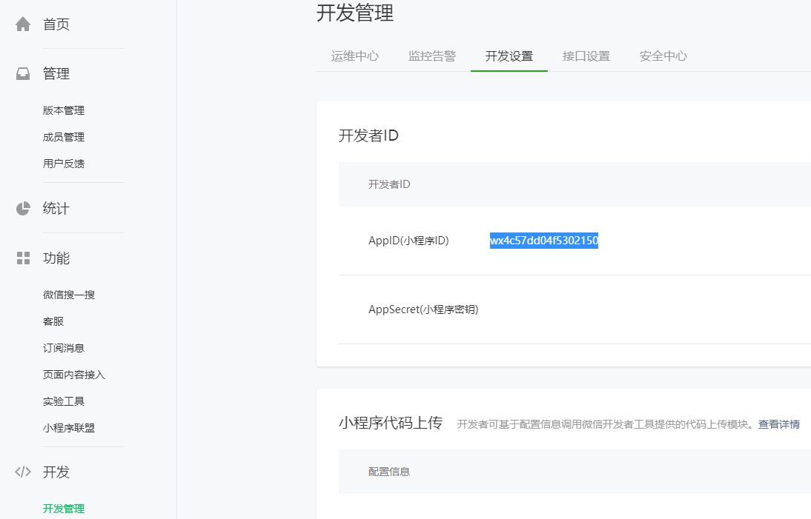

### 2.安装开发者工具

#### 1.了解微信开发者工具

**微信开发者工具**是官方推荐使用的小程序开发工具，它提供的主要功能如下：

1. 快速创建小程序项目
2. 代码的查看和编辑
3. 对小程序功能进行调试
4. 小程序的预览和发布

#### 2.下载

推荐下载和安装最新的**稳定版**（Stable Build）的微信开发者工具，下载页面的链接如下：

https://developers.weixin.qq.com/miniprogram/dev/devtools/stable.html

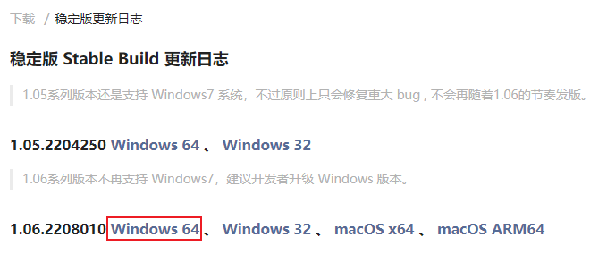

#### 3.扫码登录

打开微信开发者工具，用手机微信扫码登录

#### 4.设置代理

点击设置：

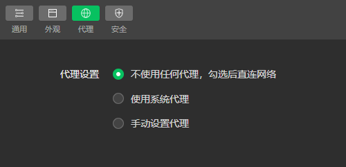

### 3.创建小程序项目

#### 1.点击 “加号” 按钮

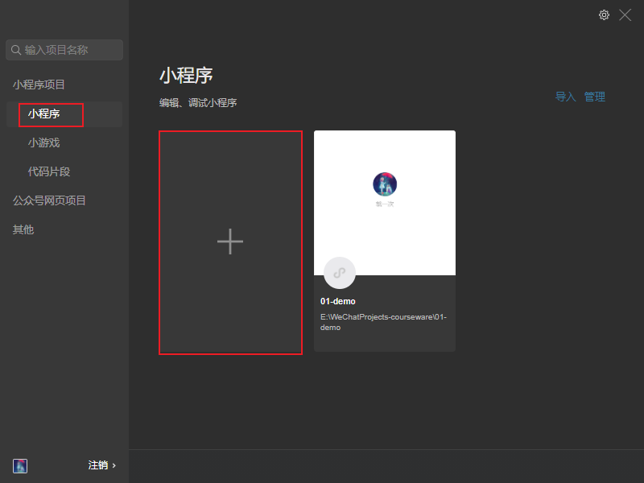

#### 2.填写项目信息


#### 4.在模拟器上查看项目效果

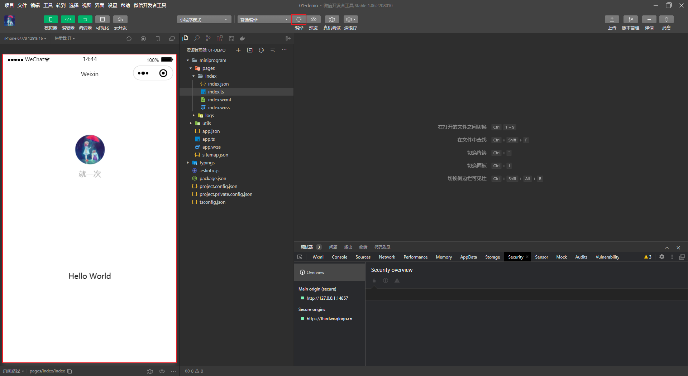

#### 5.在真机上预览项目效果

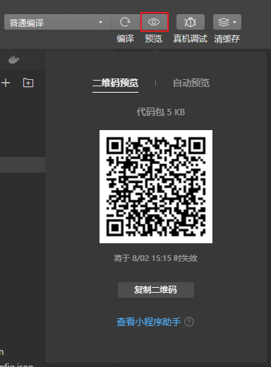


## 3.小程序代码的构成

### 1.项目结构

#### 1.了解项目的基本组成结构

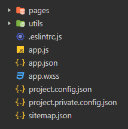

1. **pages 用来存放所有小程序的页面**
2. utils 用来存放工具性质的模块（例如：格式化时间的自定义模块）
3. **app.js 小程序项目的入口文件**
4. **app.json 小程序项目的全局配置文件**
5. app.wxss 小程序项目的全局样式文件
6. project.config.json 项目的配置文件
7. project.private.config.json 项目的私有配置文件
8. sitemap.json 用来配置小程序及其页面是否允许被微信索引

#### 2.小程序页面的组成部分

小程序官方建议把所有小程序的页面，都存放在 **pages 目录**中，以**单独的文件夹**存在，如图所示：

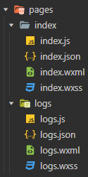

其中，每个页面**由 4 个基本文件**组成，它们分别是：

1. **.js** 文件（页面的脚本文件，存放页面的数据、事件处理函数等）
2. **.json** 文件（当前页面的配置文件，配置窗口的外观、表现等）
3. **.wxml** 文件（页面的模板结构文件）
4. **.wxss** 文件（当前页面的样式表文件）

### 2.JSON 配置文件

#### 1.JSON 配置文件的作用

**JSON 是一种数据格式**，在实际开发中，JSON 总是以**配置文件**的形式出现。小程序项目中也不例外：通过不同的 .json 配置文件，可以对小程序项目进行不同级别的配置。

小程序项目中有 5 种 json 配置文件，分别是：

1. 项目根目录中的 **app.json** 配置文件
2. 项目根目录中的 **project.config.json** 配置文件
3. 项目根目录中的 **project.private.config.json** 配置文件
4. 项目根目录中的 **sitemap.json** 配置文件
5. **每个页面文件夹中的 .json 配置文件**

#### 2.app.json 文件

app.json 是当前小程序的**全局配置**，包括了小程序的**所有页面路径、窗口外观、界面表现、底部 tab** 等。

01-Demo 项目里边的 app.json 配置内容如下：

```json
{
  "pages": [
    "pages/index/index",
    "pages/logs/logs"
  ],
  "window": {
    "backgroundTextStyle": "light",
    "navigationBarBackgroundColor": "#fff",
    "navigationBarTitleText": "Weixin",
    "navigationBarTextStyle": "black"
  },
  "style": "v2",
  "sitemapLocation": "sitemap.json"
}
```

简单了解下这 4 个配置项的作用：

1. **pages**：用来记录当前小程序所有页面的路径
2. **window**：全局定义小程序所有页面的背景色、文字颜色等
3. **style**：全局定义小程序组件所使用的样式版本
4. sitemapLocation：用来指明 sitemap.json 的位置

#### 3.project.config.json 文件

project.config.json 是项目配置文件，用来记录我们**对小程序开发工具所做的个性化配置**，例如：

- **setting** 中保存了**编译相关的配置**
- **projectname** 中保存的是**项目名称**
- **appid** 中保存的是**小程序的账号 ID**

#### 4.project.private.config.json 文件

项目私有配置文件。此文件中的内容将**覆盖 project.config.json 中的相同字段**。项目的改动优先同步到此文件中。

详见文档：https://developers.weixin.qq.com/miniprogram/dev/devtools/projectconfig.html

#### 5.sitemap.json 文件

微信现已开放**小程序内搜索**，效果类似于 PC 网页的 SEO。sitemap.json 文件用来**配置小程序页面是否允许微信索引**。

当开发者允许微信索引时，微信会通过爬虫的形式，为小程序的页面内容建立索引。当用户的搜索关键字和页面的索引匹配成功的时候，小程序的页面将可能展示在搜索结果中。

```json
{
  "desc": "关于本文件的更多信息，请参考文档 https://developers.weixin.qq.com/miniprogram/dev/framework/sitemap.html",
  "rules": [
    {
      "action": "allow", // allow 表示所有页面都可以被索引，disallow 表示所有页面都不可以被索引
      "page": "*"
    }
  ]
}
```

注意：sitemap 的索引提示是默认开启的，如需要关闭 sitemap 的索引提示，可在小程序项目配置文件 **project.config.json** 的 **setting** 中配置字段 **checkSiteMap** 为 **false**

#### 6.页面的 .json 配置文件

小程序中的每一个页面，可以使用 .json 文件来**对本页面的窗口外观进行配置，页面中的配置项会覆盖 app.json 的 window 中相同的配置项**。例如：


#### 7.新建小程序页面

只需要在 **app.json** -> **pages** 中新增页面的存放路径，小程序开发者工具即可帮我们自动创建对应的页面文件，如图所示：

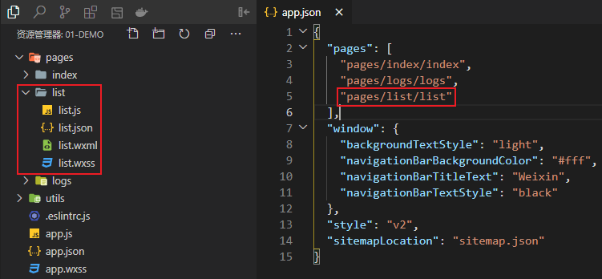

#### 8.修改项目首页

只需要调整 **app.json** -> **pages** 数组中页面路径的前后顺序，即可修改项目的首页。小程序会把排在第一位的页面，当作项目首页进行渲染，如图所示：

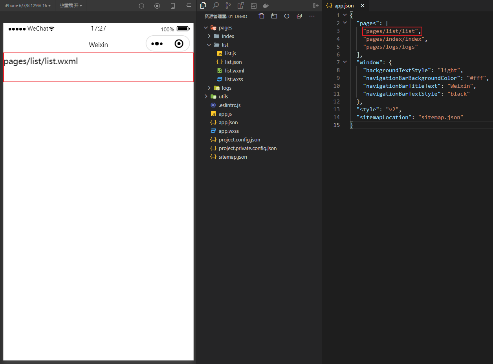

### 3.WXML 模板

#### 1.什么是 WXML

WXML（微信标记语言：WeiXin Markup Language）是小程序框架设计的一套**标签语言，用来构建小程序页面的结构**，其作用类似于网页开发中的 HTML。

#### 2.WXML 和 HTML 的区别

1. 标签名称不同
   - HTML（div，span，img，a）
   - WXML（view，text，image，navigator）
2. 属性节点不同
   - `<a href="#">超链接</a>`
   - `<navigator url="/pages/index/index">超链接</navigator>`
3. 提供了类似于 Vue 中的模板语法
   - 数据绑定
   - 列表渲染
   - 条件渲染

### 4.WXSS 样式

#### 1.什么是 WXSS

WXSS（微信样式表：WeiXin Style Sheets）是一套**样式语言**，用于描述 WXML 的组件样式，类似于网页开发中的 CSS。

#### 2.WXSS 和 CSS 的区别

1. 新增了 rpx 尺寸单位
   - CSS 中需要手动进行像素单位换算，例如 rem
   - WXSS 在底层支持新的尺寸单位 rpx，在不同大小的屏幕上小程序会自动进行换算
2. 提供了全局的样式和局部样式
   - 项目根目录中的 app.wxss 会作用于所有小程序页面
   - 局部页面的 .wxss 样式仅对当前页面生效
3. WXSS 仅支持部分 CSS 选择器
   - .class 和 #id
   - element
   - 并集选择器、后代选择器
   - ::after 和 ::before 等伪类选择器

### 5.JS 逻辑交互

#### 1.小程序中的 .js 文件

一个项目仅仅提供界面展示是不够的，在小程序中，我们通过 .js 文件来处理用户的操作。例如：响应用户的点击、获取用户的位置等等。

#### 2.小程序中 .js 文件的分类

小程序中的 JS 文件分为三大类，分别是：

1. app.js
   - 是**整个小程序项目的入口文件**，通过调用 **App() 函数**来启动整个小程序
2. 页面的 .js 文件
   - 是**页面的入口文件**，通过调用 **Page() 函数**来创建并运行页面
3. 普通的 .js 文件
   - 是**普通的功能模块文件**，用来封装**公共的函数或属性**供页面使用

## 4.小程序的宿主环境

### 1.宿主环境简介

#### 1.什么是宿主环境

**宿主环境**（host environment）指的是**程序运行所必须的依赖环境**。例如：

**Android 系统**和 **iOS 系统**是两个不同的宿主环境。安卓版的微信 App 是不能在 iOS 环境下运行的，所以，

Android 是安卓软件的宿主环境，**脱离了宿主环境的软件是没有任何意义的**！

#### 2.小程序的宿主环境

**手机微信是小程序的宿主环境**，如图所示：

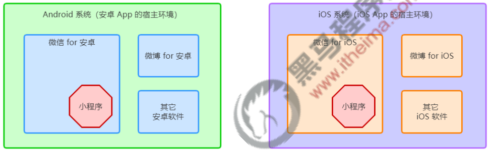

小程序**借助宿主环境提供的能力**，可以完成许多普通网页无法完成的功能，例如：

微信扫码、微信支付、微信登录、地理定位、etc...

#### 3.小程序宿主环境包含的内容

1. 通信模型
2. 运行机制
3. 组件
4. API

### 2.通信模型

#### 1.通信的主体

小程序中通信的主体是**渲染层**和**逻辑层**，其中：

1. WXML 模板和 WXSS 样式工作在渲染层
2. JS 脚本工作在逻辑层

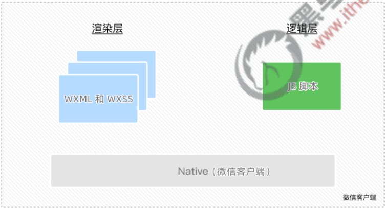

#### 2.小程序的通信模型

小程序中的通信模型分为两部分：

1. **渲染层**和**逻辑层**之间的通信
   - 由微信客户端进行转发
2. **逻辑层**和**第三方服务器**之间的通信
   - 由微信客户端进行转发

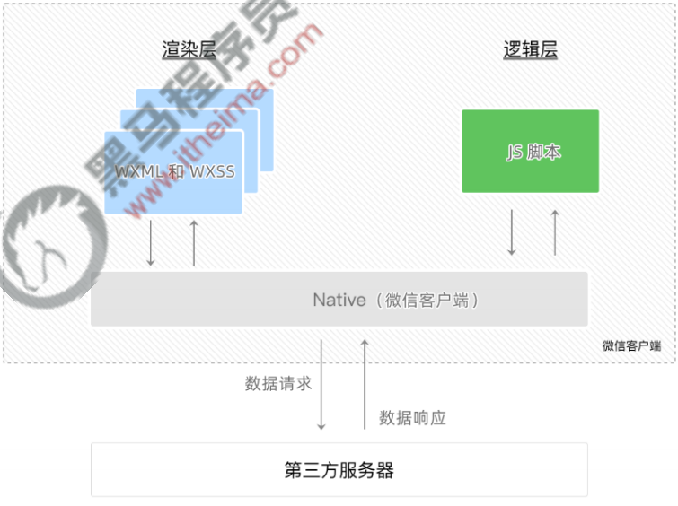

### 3.运行机制

#### 1.小程序启动的过程

1. 把小程序的代码包下载到本地
2. 解析 app.json 全局配置文件
3. 执行 app.js 小程序入口文件，**调用 App() 创建小程序实例**
4. 渲染小程序首页
5. 小程序启动完成

#### 2.页面渲染的过程

1. 加载解析页面的 .json 配置文件
2. 加载页面的 .wxml 模板和 .wxss 样式
3. 执行页面的 .js 文件，**调用 Page() 创建页面实例**
4. 页面渲染完成

### 4.组件

#### 1.小程序中组件的分类

**小程序中的组件也是由宿主环境提供的**，开发者可以基于组件快速搭建出漂亮的页面结构。官方把小程序的组件分为了 9 大类，分别是：

1. **视图容器组件**
2. **基础内容组件**
3. **表单组件**
4. **导航组件**
5. 媒体组件
6. map 地图组件
7. canvas 画布组件
8. 开放能力
9. 无障碍访问

#### 2.视图容器组件

1. view
   - 普通视图区域
   - 类似于 HTML 中的 div，是一个块级元素
   - 常用来实现页面的布局效果
2. scroll-view
   - 可滚动的视图区域
   - 常用来实现滚动列表效果
3. swiper 和 swiper-item
   - 轮播图容器组件和轮播图 item 组件

##### 1.view 组件的基本使用

实现如图的 flex 横向布局效果：

wxml 代码：

```html
<view class="container1">
  <view>A</view>
  <view>B</view>
  <view>C</view>
</view>
```

wxss 代码：

```css
.container1 {
  display: flex;
  justify-content: space-evenly;
}

.container1 view {
  width: 100px;
  height: 100px;
  background-color: pink;
  text-align: center;
}
```

效果：

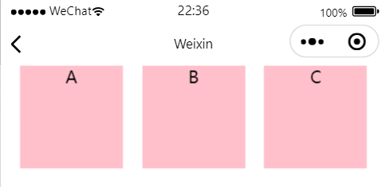

##### 2.scroll-view 组件的基本使用

实现如图的纵向滚动效果：

wxml 代码：

```html
<!--
  scroll-x 属性：允许横向滚动
  scroll-y 属性：允许纵向滚动
-->
<scroll-view class="container2" scroll-y>
  <view>A</view>
  <view>B</view>
  <view>C</view>
</scroll-view>
```

wxss 代码：

```css
.container2 {
  border: 1px solid;
  width: 120px;
  height: 120px;
}

.container2 view {
  width: 100px;
  height: 100px;
  background-color: skyblue;
  text-align: center;
}
```

效果：

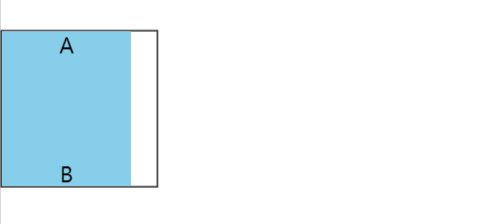

##### 3.swiper 和 swiper-item 组件的基本使用

实现如图的轮播图效果：

wxml 代码：

```html
<swiper class="container3"
  indicator-dots
  indicator-color="#fff"
  indicator-active-color="red"
  autoplay
  interval="2000"
  circular
>
  <swiper-item>
    <view class="item">A</view>
  </swiper-item>
  <swiper-item>
    <view class="item">B</view>
  </swiper-item>
  <swiper-item>
    <view class="item">C</view>
  </swiper-item>
</swiper>
```

wxss 代码：

```css
.container3 {
  height: 150px;
}

.item {
  height: 100%;
  line-height: 150px;
  text-align: center;
}

swiper-item:nth-child(1) {
  background-color: pink;
}

swiper-item:nth-child(2) {
  background-color: skyblue;
}

swiper-item:nth-child(3) {
  background-color: lightgreen;
}
```

效果：


**swiper 组件的常用属性**

| 属性                   | 类型    | 默认值            | 说明                 |
| ---------------------- | ------- | ----------------- | -------------------- |
| indicator-dots         | boolean | false             | 是否显示面板指示点   |
| indicator-color        | color   | rgba(0, 0, 0, .3) | 指示点颜色           |
| indicator-active-color | color   | \#000000          | 当前选中的指示点颜色 |
| autoplay               | boolean | false             | 是否自动切换         |
| interval               | number  | 5000              | 自动切换时间间隔     |
| circular               | boolean | false             | 是否采用衔接滑动     |

#### 3.基础内容组件

1. text
   - 文本组件
   - 类似于 HTML 中的 span 标签，是一个行内元素
2. rich-text
   - 富文本组件
   - 支持把 HTML 字符串渲染为 WXML 结构

##### 1.text 组件的基本使用

通过 text 组件的 **selectable** 属性，实现长按选中文本内容的效果：

wxml 代码：

```html
<view class="container4">
  手机号支持长按选中效果：
  <text selectable>17374000851</text>
</view>
```

效果：

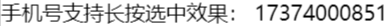

##### 2.rich-text 组件的基本使用

通过 rich-text 组件的 **nodes** 属性节点，**把 HTML 字符串渲染为对应的 UI 结构**：

```html
<!-- 应用场景：商品详情页的结构渲染 -->
<rich-text nodes="<h1 style='color: red'>标题</h1>"></rich-text>
```

效果：


#### 4.其他常用组件

1. button
   - 按钮组件
   - 功能比 HTML 中的 button 按钮丰富
   - 通过 open-type 属性可以调用微信提供的各种功能（客服、转发、获取用户授权、获取用户信息等）
2. image
   - 图片组件
   - image 组件默认宽度约 300px、高度约 240px
3. navigator（后面课程会专门讲解）
   - 页面导航组件
   - 类似于 HTML 中的 a 链接

##### 1.button 按钮的基本使用

wxml 代码：

```html
<!-- 类型 -->
<view>
  <button>默认按钮</button>
  <button type="default">default</button>
  <button type="primary">primary</button>
  <button type="warn">warn</button>
</view>
<!-- 尺寸 -->
<view>
  <button type="default" size="mini">default</button>
  <button type="primary" size="mini">primary</button>
  <button type="warn" size="mini">warn</button>
</view>
<!-- 镂空按钮 -->
<view>
  <button type="default" plain>default</button>
  <button type="primary" plain>primary</button>
  <button type="warn" plain>warn</button>
  <button type="default" plain size="mini">default</button>
  <button type="primary" plain size="mini">primary</button>
  <button type="warn" plain size="mini">warn</button>
</view>
```

效果：

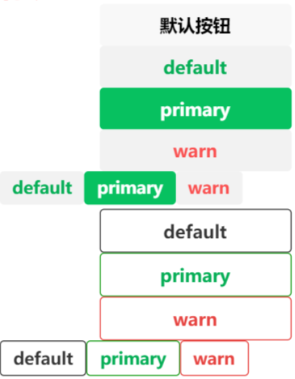

##### 2.image 组件的基本使用

wxml 代码：

```html
<image></image>
<image src="./images/code.png"></image>
```

wxss 代码：

```css
image {
  border: 1px solid;
}
```

效果：

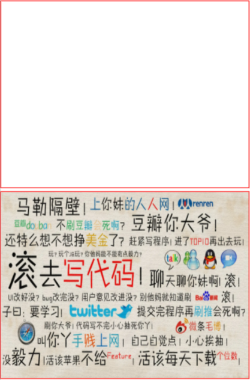

##### 3.image 组件的 mode 属性

image 组件的 **mode** 属性用来指定图片的**裁剪**和**缩放**模式，常用的 mode 属性值如下：

| mode 值     | 说明                                                         |
| ----------- | ------------------------------------------------------------ |
| scaleToFill | （默认值）缩放模式，**不保持纵横比缩放图片**，使图片的宽高完全拉伸至**填满 image 元素** |
| aspectFit   | 缩放模式，**保持纵横比缩放图片，使图片的长边能完全显示出来**。也就是说，可以完整地将图片显示出来 |
| aspectFill  | 缩放模式，**保持纵横比缩放图片，只保证图片的短边能完全显示出来**。也就是说，图片通常只在水平或垂直方向是完整的，另一个方向将会发生截取 |
| widthFix    | 缩放模式，**宽度不变，高度自动变化**，保持原图宽高比不变     |
| heightFix   | 缩放模式，**高度不变，宽度自动变化**，保持原图宽高比不变     |

### 5.API

#### 1.小程序 API 概述

**小程序中的 API 是由宿主环境提供的**，通过这些丰富的小程序 API，开发者可以方便的调用微信提供的能力，例如：获取用户信息、本地存储、支付功能等。

#### 2.小程序 API 的 3 大分类

小程序官方把 API 分为了如下 3 大类：

1. 事件监听 API
   - 特点：以 **on** 开头，用来**监听某些事件的触发**
   - 举例：wx.**onWindowResize**(function callback) 监听窗口尺寸变化的事件
2. 同步 API
   - 特点1：以 **Sync** 结尾的 API 都是同步 API
   - 特点2：同步 API 的执行结果，可以通过函数返回值直接获取，如果执行出错会抛出异常
   - 举例：wx.**setStorageSync**('key', 'value') 向本地存储中写入内容
3. 异步 API
   - 特点：类似于 jQuery 中的 **$.ajax(options)** 函数，需要通过 success、fail、complete 接收调用的结果
   - 举例：wx.**request()** 发起网络数据请求，通过 success 回调函数接收数据

## 5.协同工作和发布

### 1.协同工作

#### 1.了解权限管理需求

在中大型的公司里，人员的分工非常仔细：同一个小程序项目，一般会有不同岗位、不同角色的员工同时参与设计与开发。

此时出于管理需要，我们**迫切需要对**不同岗位、不同角色的**员工的权限进行边界的划分**，使他们能够高效的进行协同工作。

#### 2.了解项目成员的组织结构

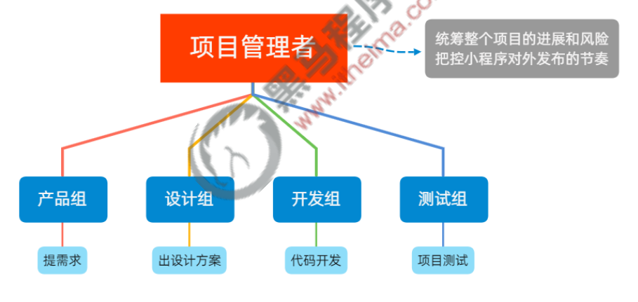

#### 3.小程序的开发流程

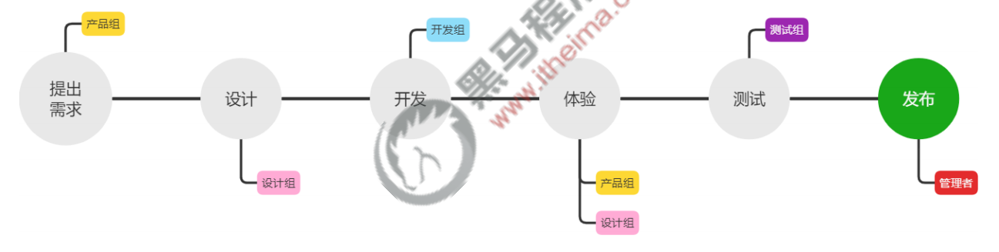

### 2.小程序成员管理

#### 1.成员管理的两个方面

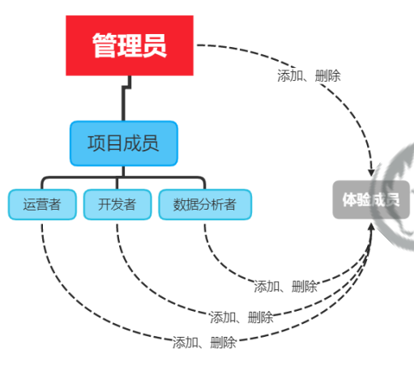

小程序成员管理体现在**管理员**对小程序**项目成员**及**体验成员**的管理：

1. 项目成员：
   - 表示参与小程序开发、运营的成员
   - 可登录小程序管理后台
   - 管理员可以添加、删除项目成员，并设置项目成员的角色
2. 体验成员：
   - 表示参与小程序内测体验的成员
   - 可使用体验版小程序，但不属于项目成员
   - 管理员及项目成员均可添加、删除体验成员

#### 2.不同项目成员对应的权限

| 权限           | 运营者  | 开发者      | 数据分析者 |
| -------------- | ------- | ----------- | ---------- |
| 开发者权限     |         | **checked** |            |
| 体验者权限     | checked | **checked** | checked    |
| 登录           | checked | **checked** | checked    |
| 数据分析       |         |             |            |
| 微信支付       | checked |             |            |
| 推广           | checked |             |            |
| 开发管理       | checked |             |            |
| 开发设置       |         | **checked** |            |
| 暂停服务       | checked |             |            |
| 解除关联公众号 | checked |             |            |
| 腾讯云管理     |         | **checked** |            |
| 小程序插件     | checked |             |            |
| 游戏运营管理   | checked |             |            |

#### 3.开发者的权限说明

1. **开发者权限**：可使用小程序开发者工具及对小程序的功能进行代码开发
2. **体验者权限**：可使用体验版小程序
3. **登录权限**：可登录小程序管理后台，无需管理员确认
4. **开发设置**：设置小程序服务器域名、消息推送及扫描普通链接二维码打开小程序
5. 腾讯云管理：云开发相关设置

#### 4.添加项目成员和体验成员

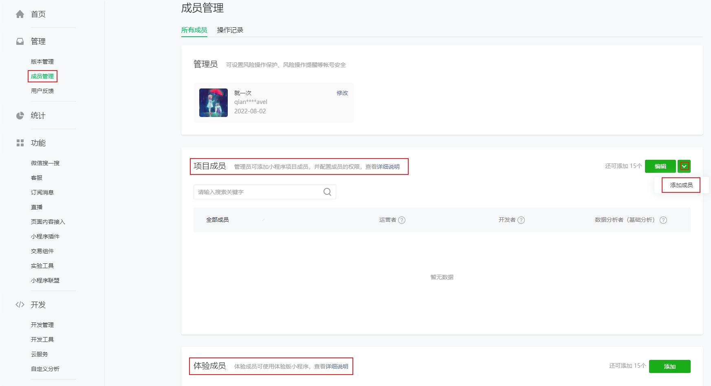

### 3.小程序的版本

#### 1.软件开发过程中的不同版本

在软件开发过程中，根据时间节点的不同，会产出不同的软件版本，例如：

1. 开发者编写代码的同时，对项目代码进行自测（**开发版本**）
2. 直到程序达到一个稳定可体验的状态时，开发者把体验版本给到产品经理和测试人员进行**体验测试**
3. 最后修复完程序的 Bug 后，**发布正式版**供外部用户使用

#### 2.小程序的版本

| 版本阶段     | 说明                                                         |
| ------------ | ------------------------------------------------------------ |
| 开发版本     | 使用开发者工具，可将代码上传到开发版本中。 开发版本只保留每人最新的一份上传的代码。<br>点击提交审核，可将代码提交审核。开发版本可删除，不影响线上版本和审核中版本的代码。 |
| 体验版本     | 可以选择某个开发版本作为体验版，并且选取一份体验版。         |
| 审核中的版本 | 只能有一份代码处于审核中。有审核结果后可以发布到线上，也可直接重新提交审核，覆盖原审核版本。 |
| 线上版本     | 线上所有用户使用的代码版本，该版本代码在新版本代码发布后被覆盖更新。 |

### 4.发布上线

#### 1.小程序发布上线的整体步骤

一个小程序的发布上线，一般要经过**上传代码** -> **提交审核** -> **发布**这三个步骤。

#### 2.上传代码

1. 点击开发者工具顶部工具栏中的 “**上传**” 按钮
2. 填写**版本号**以及**项目备注**

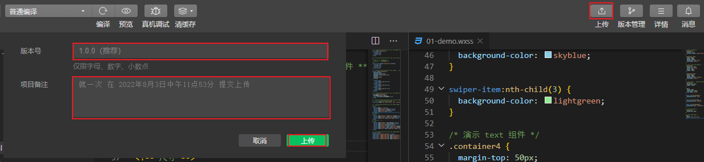

#### 3.在后台查看上传之后的版本

**登录小程序管理后台** -> **管理** -> **版本管理** -> 开发版本，即可查看刚才提交上传的版本了：

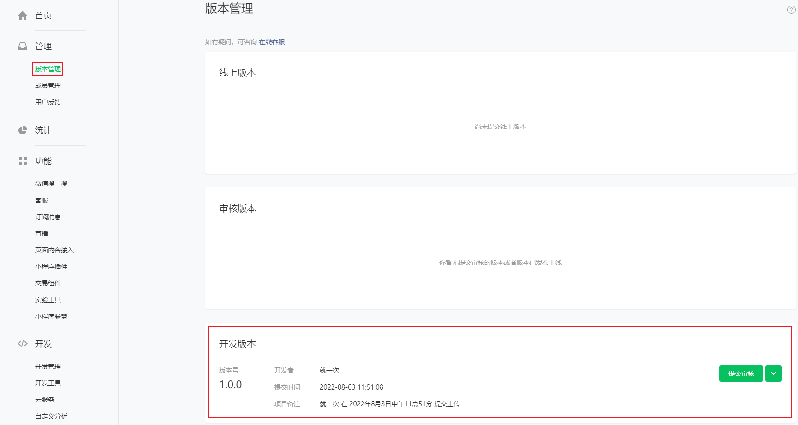

#### 4.提交审核

- 为什么需要提交审核：为了保证小程序的质量，以及符合相关的规范，小程序的发布是需要经过腾讯官方审核的
- 提交审核的方式：在开发版本的列表中，点击 “**提交审核**” 按钮之后，按照页面提示填写相关的信息，就能把小程序提交到腾讯官方进行审核

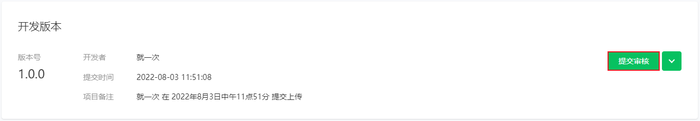

#### 5.发布

审核通过之后，管理员的微信中会收到小程序通过审核的通知，此时在审核版本的列表中，点击 “**发布**” 按钮之后，即可把 “**审核通过**” 的版本发布为 “**线上版本**”，供所有小程序用户访问和使用。

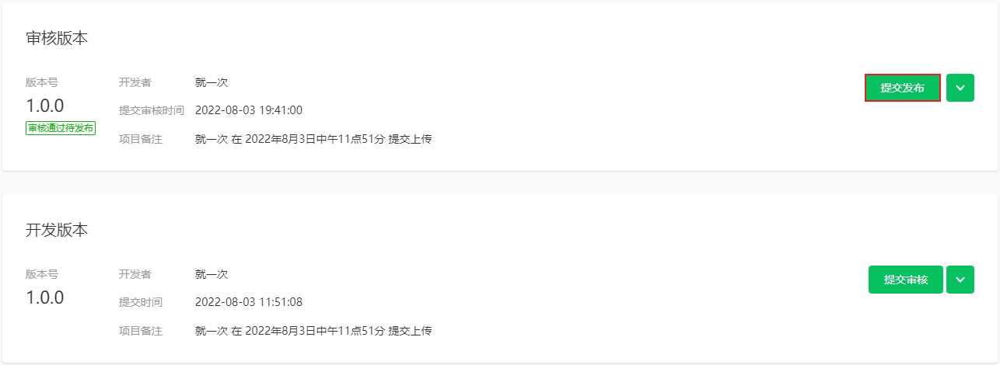

#### 6.基于小程序码进行推广


相对于普通二维码来说，小程序码的优势如下：

1. 在样式上更具**辨识度**和**视觉冲击力**
2. 能够更加清晰地树立小程序的**品牌形象**
3. 可以帮助开发者**更好地推广小程序**

获取小程序码的 5 个步骤：

**登录小程序管理后台** -> **设置** -> **基本设置** -> **基本信息** -> **小程序码及线下物料下载**

### 5.运营数据

#### 1.查看小程序运营数据的两种方式

1. 在 “小程序后台” 查看
   1. 登录小程序管理后台
   2. 点击侧边栏的 “统计”
   3. 点击相应的 tab 可以看到相关的数据
2. 使用 “小程序数据助手” 查看
   1. 打开微信
   2. 搜索 “小程序数据助手”
   3. 查看已发布的小程序相关的数据

## 6.总结

1. 能够知道如何创建小程序项目
   - 微信开发者工具的使用、appID 的获取
2. 能够清楚小程序项目的基本组成结构
   - app.js、app.json、app.wxss、pages 文件夹
3. 能够知道小程序页面由几部分组成
   - wxml、wxss、json、js
4. 能够知道小程序中常见的组件如何使用
   - view、text、image
5. 能够知道小程序如何进行协同开发和发布
   - 成员管理、发布小程序、查看运营数据

# 2.小程序 - 模板与配置

## 1.WXML 模板语法

### 1.数据绑定

#### 1.数据绑定的基本原则

1. 在 data 中定义数据
2. 在 WXML 中使用数据

#### 2.在 data 中定义页面的数据

在页面对应的 .js 文件中，把数据定义到 data 对象中即可：

```js
Page({
  data: {
    info: 'init data'
  }
})
```

#### 3.Mustache 语法的格式

把 data 中的数据绑定到页面中渲染，使用 **Mustache 语法**（双大括号）将变量包起来即可。语法格式为：

```html
<view>
  <text>info 的值：{{info}}</text>
</view>
```

#### 4.Mustache 语法的应用场景

Mustache 语法的主要应用场景如下：

- 绑定内容
- 绑定属性
- 运算（三元运算、算术运算等）

#### 5.动态绑定内容

页面的数据如下：

```js
Page({
  data: {
    info: 'init data'
  }
})
```

页面的结构如下：

```html
<view>info 的值：{{info}}</view>
```

#### 6.动态绑定属性

页面的数据如下：

```js
Page({
  data: {
    imgSrc: '../../images/a.jpg'
  }
})
```

页面的结构如下：

```html
<image src="{{imgSrc}}"></image>
```

#### 7.三元运算

页面的数据如下：

```js
Page({
  data: {
    randomNum: Math.floor(Math.random() * 10)
  }
})
```

页面的结构如下：

```html
<view>randomNum 的值：{{randomNum}} -- {{randomNum >= 5 ? '随机数字大于或等于5' : '随机数字小于5'}}</view>
```

#### 8.算数运算

页面的数据如下：

```js
Page({
  data: {
    num: 5
  }
})
```

页面的结构如下：

```html
<view>{{num + 3}}</view>
<view>{{num - 3}}</view>
<view>{{num * 3}}</view>
<view>{{num / 3}}</view>
```

### 2.事件绑定

#### 1.什么是事件

事件是**渲染层到逻辑层的通讯方式**。通过事件可以将用户在渲染层产生的行为，反馈到逻辑层进行业务的处理。

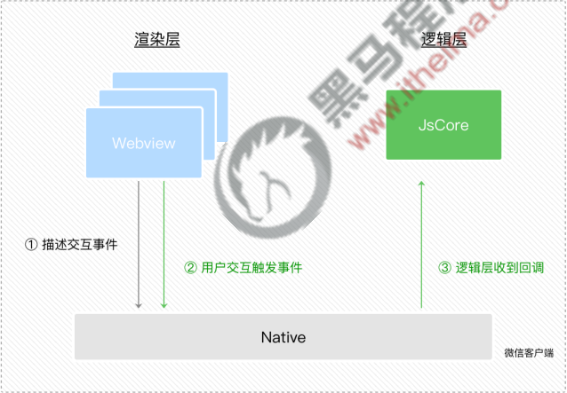

#### 2.小程序中常用的事件

| 类型   | 绑定方式                  | 事件描述                                        |
| ------ | ------------------------- | ----------------------------------------------- |
| tap    | bindtap 或 bind:tap       | 手指触摸后马上离开，类似于 HTML 中的 click 事件 |
| input  | bindinput 或 bind:input   | 文本框的输入事件                                |
| change | bindchange 或 bind:change | 状态改变时触发                                  |

#### 3.事件对象的属性列表

当事件回调触发的时候，会收到一个事件对象 event，它的详细属性如下表所示：

| 属性           | 类型       | 说明                                         |
| -------------- | ---------- | -------------------------------------------- |
| type           | String     | 事件类型                                     |
| timeStamp      | Integer    | 页面打开到触发事件所经过的毫秒数             |
| **target**     | **Object** | **触发事件的组件的一些属性值集合**           |
| currentTarget  | Object     | 当前组件的一些属性值集合                     |
| **detail**     | **Object** | **额外的信息**                               |
| touches        | Array      | 触摸事件，当前停留在屏幕中的触摸点信息的数组 |
| changedTouches | Array      | 触摸事件，当前变化的触摸点信息的数组         |

#### 4.target 和 currentTarget 的区别

**target** 是**触发该事件的源头组件**，而 **currentTarget** 则是**当前事件所绑定的组件**。举例如下：

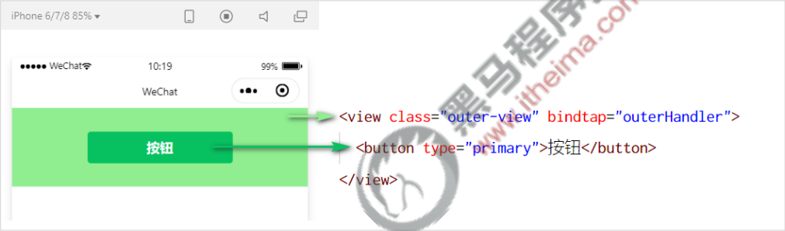

点击内部的按钮时，点击事件以**冒泡**的方式向外扩散，也会触发外层 view 的 tap 事件处理函数。

此时，对于外层的 view 来说：

- event.target 指向的是触发事件的源头组件，因此，**event.target 是内部的按钮组件**
- event.currentTarget 指向的是当前正在触发事件的那个组件，因此，**event.currentTarget 是当前的 view 组件**

#### 5.bindtap 的语法格式

在小程序中，不存在 HTML 中的 onclick 鼠标点击事件，而是通过 **tap 事件**来响应用户的触摸行为。

1. 通过 **bindtap**，可以为组件绑定 tap 触摸事件，语法如下：

   ```html
   <button type="primary" bindtap="handleTap">tap 事件</button>
   ```

2. 在页面的 .js 文件中定义对应的事件处理函数，事件参数通过形参 event（一般简写成 e）来接收：

   ```js
   Page({
     handleTap(event) {
       console.log(event)
     }
   })
   ```

#### 6.在事件处理函数中为 data 中的数据赋值

通过调用 **this.setData(dataObject)** 方法，可以给页面 data 中的数据重新赋值，示例如下：

```js
Page({
  data: {
    count: 1
  },
  countAdd() {
    this.setData({count: this.data.count + 1})
  }
})
```

#### 7.事件传参

小程序中的事件传参比较特殊，**不能在绑定事件的同时为事件处理函数传递参数**。例如，下面的代码将不能正常工作：

```html
<button type="primary" bindtap="countAddN(5)">count+=5</button>
```

> 因为小程序会把 bindtap 的属性值，统一当作事件名称来处理，相当于要调用一个名称为 **countAdd(5)** 的事件处理函数。

可以为组件提供 **data-*** 自定义属性传参，其中 *** 代表的是参数的名字**，示例代码如下：

```html
<button type="primary" bindtap="countAddN" data-num="{{5}}">count+=5</button>
```

> 最终：
>
> - **num** 会被解析为**参数的名字**
> - 数值 **5** 会被解析为**参数的值**

在事件处理函数中，通过 **event.target.dataset.参数名**即可获取到**具体参数的值**，示例代码如下：

```js
Page({
  data: {
    count: 1
  },
  countAddN(event) {
    console.log(event.target.dataset) // dataset 是一个对象，包含了所有通过 data-* 传递过来的参数项
    console.log(event.target.dataset.num) // 通过 dataset 可以访问到具体参数的值
    this.setData({count: this.data.count + event.target.dataset.num})
  }
})
```

#### 8.bindinput 的语法格式

在小程序中，通过 **input 事件**来响应文本框的输入事件，语法格式如下：

1. 通过 bindinput，可以为文本框绑定输入事件：

   ```html
   <input type="text" bindinput="handleInput"/>
   ```

2. 在页面的 .js 文件中定义事件处理函数：

   ```js
   Page({
     handleInput(event) {
       console.log(event.detail.value)
     }
   })
   ```

#### 9.实现文本框和 data 之间的数据同步

wxml 代码：

```html
<input type="text" value="{{txt}}" bindinput="handleInput"/>
```

js 代码：

```js
Page({
  data: {
    txt: '你好'
  },
  handleInput(event) {
    this.setData({txt: event.detail.value})
  }
})
```

### 3.条件渲染

#### 1.wx:if

在小程序中，使用 **wx:if="{{condition}}"** 来判断是否需要渲染该代码块：

```html
<text wx:if="{{condition}}">True</text>
```

也可以用 **wx:elif** 和 **wx:else** 来添加 else 判断：

```html
<text wx:if="{{txt === '1'}}">txt 是 1</text>
<text wx:elif="{{txt === '2'}}">txt 是 2</text>
<text wx:else>txt 是其他值</text>
```

#### 2.结合`<block>`使用 wx:if

如果要**一次性控制多个组件的展示与隐藏**，可以使用一个**`<block></block>`**标签将多个组件包装起来，并在`<block>`标签上使用 wx:if 控制属性，示例如下：

```html
<block wx:if="{{true}}">
  <text>text1</text>
  <text>text2</text>
</block>
```

> 注意：`<block>`**并不是一个组件**，它只是一个包裹性质的容器，**不会在页面中做任何渲染**

#### 3.hidden

在小程序中，直接使用 **hidden="{{condition}}"** 也能控制元素的显示与隐藏：

```html
<text hidden="{{txt !== '1'}}">txt 是 1</text>
```

#### 4.wx:if 与 hidden 的对比

1. 运行方式不同
   - wx:if 以**动态创建和移除元素**的方式，控制元素的展示与隐藏
   - hidden 以**切换样式**的方式（display: none/block;），控制元素的显示与隐藏
2. 使用建议
   - **频繁切换**时，建议使用 **hidden**
   - **控制条件复杂**时，建议使用 **wx:if** 搭配 wx:elif、wx:else 进行展示与隐藏的切换

### 4.列表渲染

#### 1.wx:for

通过 wx:for 可以根据指定的数组，循环渲染重复的组件结构，语法示例如下：

```html
<view wx:for="{{array}}">
  当前项是：{{item}} -- 索引是：{{index}}
</view>
```

> 默认情况下，当前循环项的**索引**用 **index** 表示；当前循环项用 **item** 表示

#### 2.手动指定索引和当前项的变量名

- 使用 **wx:for-item** 可以指定**当前项**的变量名
- 使用 **wx:for-index** 可以指定**当前循环项的索引**的变量名

示例代码如下：

```html
<view wx:for="{{array}}" wx:for-item="itemName" wx:for-index="indexName">
  当前项是：{{itemName}} -- 索引是：{{indexName}}
</view>
```

#### 3.wx:key 的使用

类似于 Vue 列表渲染中的 **:key**，小程序在实现列表渲染时，也建议为渲染出来的列表项指定唯一的 key 值，从而**提高渲染的效率**，示例代码如下：

wxml 代码：

```html
<!-- 可以直接写 id，不用写大括号 wx:key="{{item.id}} -->
<view wx:for="{{personList}}" wx:key="id">
  name：{{item.name}}
</view>
```

js 代码：

```js
Page({
  data: {
    personList: [
      {id: 1, name: 'zhangsan'},
      {id: 2, name: 'lisi'},
      {id: 3, name: 'wangwu'}
    ]
  }
})
```

## 2.WXSS 模板样式

### 1.模板样式

#### 1.什么是 WXSS

WXSS（WeiXin Style Sheets）是一套**样式语言**，用于美化 WXML 的组件样式，类似于网页开发中的 CSS。

#### 2.WXSS 和 CSS 的关系

WXSS 具有 CSS 大部分特性，同时，WXSS 还对 CSS 进行了扩充以及修改，以适应微信小程序的开发。

与 CSS 相比，WXSS 扩展的特性有：

- **rpx** 尺寸单位
- **@import** 样式导入

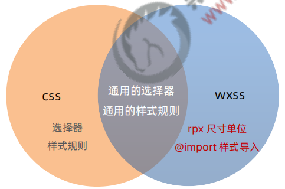

### 2.rpx

#### 1.什么是 rpx 尺寸单位

**rpx**（responsive pixel）是微信小程序独有的，用来**解决屏适配的尺寸单位**。

#### 2.rpx 的实现原理

rpx 的实现原理非常简单：鉴于不同设备屏幕的大小不同，为了实现屏幕的自动适配，rpx 把所有设备的屏幕，在宽度上**等分为 750 份**（即：**当前屏幕的总宽度为 750rpx**）。

- 在**较小**的设备上，**1rpx 所代表的宽度较小**
- 在**较大**的设备上，**1rpx 所代表的宽度较大**

小程序在不同设备上运行的时候，会自动把 rpx 的样式单位换算成对应的像素单位来渲染，从而实现屏幕适配。

#### 3.rpx 与 px 之间的单位换算

在 iPhone6 上，屏幕宽度为**375px**，共有 **750 个物理像素**，等分为 **750rpx**。则：

**750rpx** = **375px** = **750 物理像素**

**1rpx** = **0.5px** = **1 物理像素**

| 设备         | rpx 换算 px（屏幕宽度 / 750） | px 换算 rpx（750 / 屏幕宽度） |
| ------------ | ----------------------------- | ----------------------------- |
| iPhone5      | 1rpx = 0.42px                 | 1px = 2.34rpx                 |
| **iPhone6**  | **1rpx = 0.5px**              | **1px = 2rpx**                |
| iPhone6 Plus | 1rpx = 0.552px                | 1px = 1.81rpx                 |

官方建议：开发微信小程序时，设计师可以用 **iPhone6** 作为**视觉稿的标准**。

开发举例：在 iPhone6 上如果要绘制**宽 100px**，**高 20px** 的盒子，换算成 rpx 单位，宽高分别为 **200rpx** 和 **40rpx**。

### 3.样式导入

#### 1.什么是样式导入

使用 WXSS 提供的 **@import** 语法，可以导入外联的样式表。

#### 2.@import 的语法格式

**@import** 后跟需要导入的外联样式表的**相对路径**，用 **;** 表示语句结束。示例如下：

common.wxss 文件：

```css
page {
  background-color: pink;
}
```

01-demo.wxss 文件：

```css
/* 导入外部样式 */
@import "../../css/common.wxss";

input {
  border: 1px solid;
}
```

### 4.全局样式和局部样式

#### 1.全局样式

定义在 **app.wxss** 中的样式为**全局样式**，作用于每一个页面。

#### 2.局部样式

在**页面的 .wxss** 文件中定义的样式为**局部样式**，只作用于当前页面。

注意：

1. 当局部样式和全局样式冲突时，根据**就近原则**，局部样式会覆**盖全**局样式
2. 当局部样式的**权重大于或等于**全局样式的权重时，才会覆盖全局的样式

## 3.全局配置

### 1.全局配置文件及常用的配置项

小程序根目录下的 **app.json** 文件是小程序的**全局配置文件**。常用的配置项如下：

1. pages
   - 记录当前小程序所有页面的存放路径
2. **window**
   - 全局设置小程序窗口的外观
3. **tabBar**
   - 设置小程序底部的 tabBar 效果
4. style
   - 是否启用新版的组件样式

### 2.window

#### 1.小程序窗口的组成部分

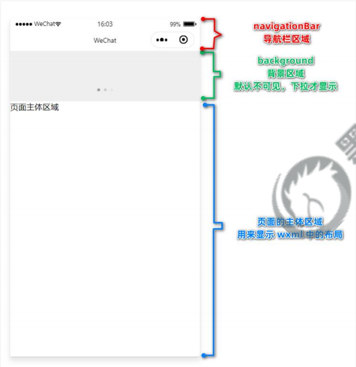

#### 2.了解 window 节点常用的配置项

| 属性名                       | 类型     | 默认值   | 说明                                             |
| ---------------------------- | -------- | -------- | ------------------------------------------------ |
| navigationBarTitleText       | String   | 字符串   | 导航栏标题文字内容                               |
| navigationBarBackgroundColor | HexColor | \#000000 | 导航栏背景颜色，如 #000000                       |
| navigationBarTextStyle       | String   | white    | 导航栏标题颜色，仅支持 **black** / **white**     |
| enablePullDownRefresh        | Boolean  | false    | 是否全局开启下拉刷新                             |
| backgroundColor              | HexColor | #ffffff  | 窗口的背景色                                     |
| backgroundTextStyle          | String   | dark     | 下拉 loading 的样式，仅支持 **dark** / **light** |
| onReachBottomDistance        | Number   | 50       | 页面上拉触底事件触发时距页面底部距离，单位为 px  |

#### 3.设置导航栏的标题

设置步骤：app.json -> window -> navigationBarTitleText

需求：把导航栏上的标题，从默认的 “**Weixin**” 修改为 “**就一次的第一个测试小程序**”：

```json
{
  "window": {
    "navigationBarTitleText": "就一次的第一个测试小程序"
  }
}
```

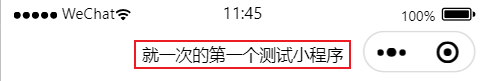

#### 4.设置导航栏的背景色

设置步骤：app.json -> window -> navigationBarBackgroundColor

需求：把导航栏标题的背景色，从默认的 **#fff** 修改为 **\#87ceeb**：

```json
{
  "window": {
    "navigationBarBackgroundColor": "#87ceeb"
  }
}
```

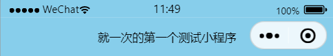

#### 5.设置导航栏的标题颜色

设置步骤：app.json -> window -> navigationBarTextStyle

需求：把导航栏上的标题颜色，从默认的 **black** 修改为 **white**：

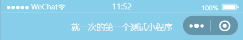

> 注意：navigationBarTextStyle 的可选值只有 **black** 和 **white**

#### 6.全局开启下拉刷新功能

概念：**下拉刷新**是移动端的专有名词，指的是通过手指在屏幕上的下拉滑动操作，从而**重新加载页面数据**的行为。

设置步骤：app.json -> window -> 把 **enablePullDownRefresh** 的值设置为 **true**：

```json
{
  "window": {
    "enablePullDownRefresh": true
  }
}
```

> 注意：在 app.json 中启用下拉刷新功能，会作用于每个小程序页面！

#### 7.设置下拉刷新时窗口的背景色

当全局开启下拉刷新功能之后，默认的窗口背景为白色。如果自定义下拉刷新窗口背景色，设置步骤为：

app.json -> window -> 为 backgroundColor 指定16进制的颜色值 **#efefef**：

```json
{
  "window": {
    "backgroundColor": "#000"
  }
}
```

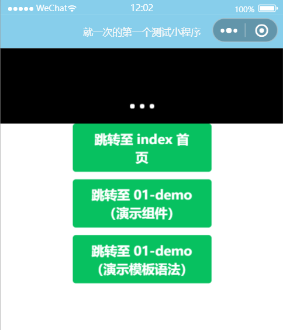

#### 8.设置下拉刷新时 loading 的样式

当全局开启下拉刷新功能之后，默认窗口的 loading 样式为白色，如果要更改 loading 样式的效果，设置步

骤为 app.json -> window -> 为 backgroundTextStyle 指定 **dark** 值：

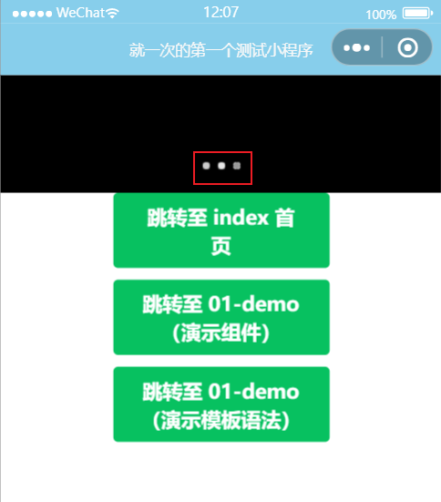

> 注意：backgroundTextStyle 的可选值只有 **light** 和 **dark**

#### 9.设置上拉触底的距离

概念：**上拉触底**是移动端的专有名词，通过手指在屏幕上的上拉滑动操作，从而**加载更多数据**的行为。

设置步骤： app.json -> window -> 为 onReachBottomDistance 设置新的数值

> 注意：**默认距离为 50px**，如果没有特殊需求，建议使用默认值即可

### 3.tabBar

#### 1.什么是 tabBar

**tabBar** 是移动端应用常见的页面效果，**用于实现多页面的快速切换**。小程序中通常将其分为：

- 底部 tabBar
- 顶部 tabBar

注意：

- tabBar 中只能配置**最少 2 个**、**最多 5 个** tab 页签
- 当渲染**顶部 tabBar** 时，**不显示 icon**，只显示文本

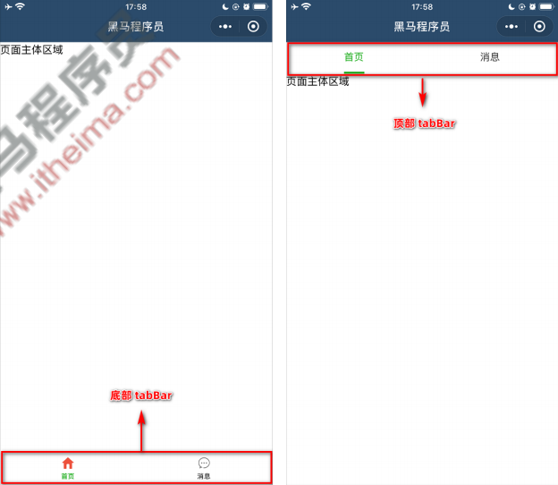

#### 2.tabBar 的 6 个组成部分

1. **borderStyle**：tabBar 上边框的颜色
2. **backgroundColor**：tabBar 的背景色
3. **color**：tab 上文字的默认颜色
4. **selectedColor**：tab 上的文字选中时的颜色
5. **iconPath**：未选中时的图片路径
6. **selectedIconPath**：选中时的图片路径

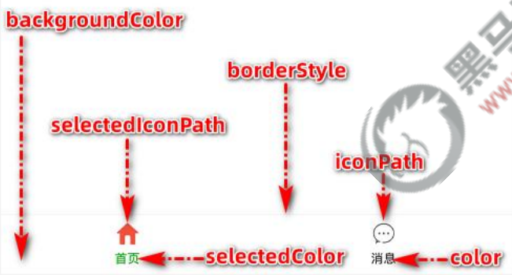

#### 3.tabBar 节点的配置项

| 属性            | 类型      | 必填   | 默认值 | 描述                                            |
| --------------- | --------- | ------ | ------ | ----------------------------------------------- |
| position        | String    | 否     | bottom | tabBar 的位置，仅支持 **bottom**/**top**        |
| borderStyle     | String    | 否     | black  | tabBar 上边框的颜色，仅支持 **black**/**white** |
| backgroundColor | HexColor  | 否     |        | tabBar 的背景色                                 |
| color           | HexColor  | 否     |        | tab 上文字的默认颜色                            |
| selectedColor   | HexColor  | 否     |        | tab 上的文字选中时的颜色                        |
| **list**        | **Array** | **是** |        | **tab 页签的列表，最少 2 个、最多 5 个 tab**    |

4.每个 tab 项的配置选项

| 属性             | 类型   | 必填   | 描述                                                      |
| ---------------- | ------ | ------ | --------------------------------------------------------- |
| **pagePath**     | String | **是** | **页面路径，页面必须在 pages 中预先定义**                 |
| **text**         | String | **是** | **tab 上显示的文字**                                      |
| iconPath         | String | 否     | **未选中时**的图标路径；当 postion 为 top 时，不显示 icon |
| selectedIconPath | String | 否     | **选中时**的图标路径；当 postion 为 top 时，不显示 icon   |

#### 4.案例：配置 tabBar

需求：


代码：

```json
{
  "pages": [
    "pages/home/home", // pages 里第一行是首页
    "pages/message/message",
    "pages/contact/contact"
  ]
  "tabBar": {
    "list": [
      {
        "pagePath": "pages/home/home", // 第一个必须是首页
        "text": "首页",
        "iconPath": "images/tabs/home.png",
        "selectedIconPath": "images/tabs/home-active.png"
      },
      {
        "pagePath": "pages/message/message",
        "text": "消息",
        "iconPath": "images/tabs/message.png",
        "selectedIconPath": "images/tabs/home-active.png"
      },
      {
        "pagePath": "pages/contact/contact",
        "text": "联系我们",
        "iconPath": "images/tabs/contact.png",
        "selectedIconPath": "images/tabs/contact-active.png"
      }
    ]
  }
}
```

## 4.页面配置

### 1.页面配置文件的作用

小程序中，每个页面都有自己的 .json 配置文件，用来对**当前页面**的窗口外观、页面效果等进行配置。

### 2.页面配置和全局配置的关系

小程序中，app.json 中的 window 节点，可以**全局配置**小程序中**每个页面的窗口表现**。

如果某些小程序页面**想要拥有特殊的窗口表现**，此时，“**页面级别的 .json 配置文件**” 就可以实现这种需求。

注意：当页面配置与全局配置**冲突**时，根据**就近原则**，最终的效果**以页面配置为准**。

### 3.页面配置中常用的配置项

| 属性                         | 类型     | 默认值   | 描述                                                     |
| ---------------------------- | -------- | -------- | -------------------------------------------------------- |
| navigationBarTitleText       | String   |          | 当前页面导航栏标题文字内容                               |
| navigationBarBackgroundColor | HexColor | \#000000 | 当前页面导航栏背景颜色，如 #000000                       |
| navigationBarTextStyle       | String   | white    | 当前页面导航栏标题颜色，仅支持 **black** / **white**     |
| **enablePullDownRefresh**    | Boolean  | false    | 是否为当前页面开启下拉刷新的效果                         |
| backgroundColor              | HexColor | \#ffffff | 当前页面窗口的背景色                                     |
| backgroundTextStyle          | String   | dark     | 当前页面下拉 loading 的样式，仅支持 **dark** / **light** |
| onReachBottomDistance        | Number   | 50       | 页面上拉触底事件触发时距页面底部距离，单位为 px          |

## 5.网络数据请求

### 1.小程序中网络数据请求的限制

出于**安全性**方面的考虑，小程序官方对**数据接口的请求**做出了如下两个限制：

1. 只能请求 **HTTPS** 类型的接口
2. 必须将**接口的域名**添加到**信任列表**中

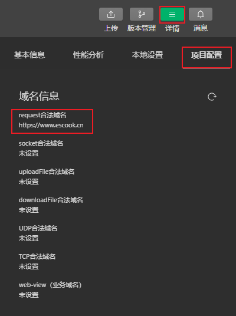

### 2.配置 request 合法域名

需求描述：假设在自己的微信小程序中，希望请求 https://www.escook.cn/ 域名下的接口

配置步骤：**登录微信小程序管理后台** -> **开发** -> **开发管理** -> **开发设置** -> **服务器域名** -> **修改 request 合法域名**

注意事项：

1. 域名只支持 https 协议
2. 域名不能使用 IP 地址或 localhost
3. 域名必须经过 ICP 备案
4. 服务器域名一个月内最多可申请 5 次修改

### 3.发起 GET 请求

调用微信小程序提供的 **wx.request()** 方法，可以发起 GET 数据请求，示例代码如下：

```js
wx.request({
  url: 'https://www.escook.cn/api/get', // 请求的接口地址，必须基于 https 协议
  method: 'GET', // 请求方式
  data: { // 请求参数
    name: 'zhangsan',
    age: 18
  },
  success(response) { // 请求成功之后的回调函数
    console.log(response)
  }
})
```

### 4.发起 POST 请求

调用微信小程序提供的 **wx.request()** 方法，可以发起 POST 数据请求，示例代码如下：

```js
wx.request({
  url: 'https://www.escook.cn/api/post', // 请求的接口地址，必须基于 https 协议
  method: 'POST', // 请求方式
  data: { // 请求参数
    name: 'list',
    age: 20
  },
  success(response) { // 请求成功之后的回调函数
    console.log(response)
  }
})
```

5.在页面刚加载时请求数据

在很多情况下，我们需要**在页面刚加载的时候，自动请求一些初始化的数据**。此时需要在页面的 **onLoad** 事件中调用获取数据的函数，示例代码如下：

```js
Page({
  /**
   * 生命周期函数--监听页面加载
   */
  onLoad(options) {
    console.log('初始化数据')
  }
})
```

### 5.跳过 request 合法域名校验

如果后端程序员**仅仅提供了 http 协议的接口、暂时没有提供 https 协议的接口**。

此时为了不耽误开发的进度，我们可以在微信开发者工具中，临时开启【**开发环境不校验请求域名、TLS 版本及 HTTPS 证书**】选项，跳过 request 合法域名的校验。

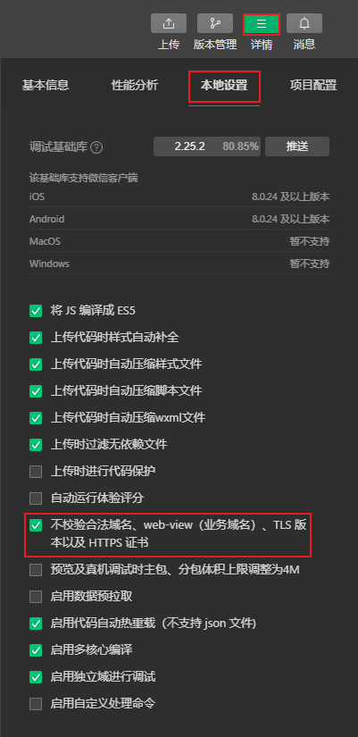

> 注意：
>
> 跳过 request 合法域名校验的选项，**仅限**在**开发与调试阶段**使用！

### 6.关于跨域和 Ajax 的说明

跨域问题**只存在于**基于浏览器的 Web 开发中。由于**小程序的宿主环境**不是浏览器，而**是微信客户端**，所以**小程序中不存在跨域的问题**。

Ajax 技术的核心是依赖于浏览器中的 XMLHttpRequest 这个对象，由于**小程序的宿主环境是微信客户端**，所以小程序中**不能叫做** “发起 Ajax 请求”，而是叫做 “**发起网络数据请求**”。

## 6.案例 - 本地生活（首页）

### 1.首页效果以及实现步骤

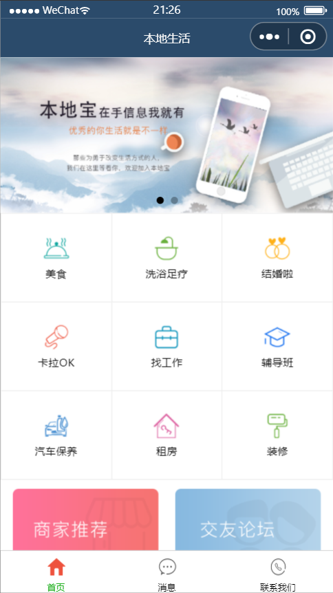

1. 新建项目并梳理项目结构
2. 配置**导航栏**效果
3. 配置 **tabBar** 效果
4. 实现**轮播图**效果
5. 实现**九宫格**效果
6. 实现**图片布局**

### 2.接口地址

1. 获取**轮播图**数据列表的接口
   - 【GET】https://www.escook.cn/slides
2. 获取**九宫格**数据列表的接口
   - 【GET】https://www.escook.cn/categories

## 7.总结

1. 能够使用 WXML 模板语法渲染页面结构
   - **wx:if**、wx:elif、wx:else、hidden、**wx:for**、**wx:key**
2. 能够使用 WXSS 样式美化页面结构
   - **rpx 尺寸单位**、@import 样式导入、全局样式和局部样式
3. 能够使用 app.json 对小程序进行全局性配置
   - pages、**window**、**tabBar**、style
4. 能够使用 page.json 对小程序页面进行个性化配置
   - 对单个页面进行个性化配置、**就近原则**
5. 能够知道如何发起网络数据请求
   - **wx.request()** 方法、**onLoad()** 事件

# 3.小程序 - 视图与逻辑

## 1.页面导航

### 1.什么是页面导航

页面导航指的是**页面之间的相互跳转**。例如，浏览器中实现页面导航的方式有如下两种：

1. `<a>`链接
2. location.href

### 2.小程序中实现页面导航的两种方式

1. 声明式导航
   - 在页面上声明一个`<navigator>`导航组件
   - 通过点击`<navigator>`组件实现页面跳转
2. 编程式导航
   - 调用小程序的导航 API，实现页面的跳转

### 3.声明式导航

#### 1.导航到 tabBar 页面

**tabBar 页面**指的是被配置为 tabBar 的页面。

在使用`<navigator>`组件跳转到指定的 tabBar 页面时，需要指定 **url** 属性和 **open-type** 属性，其中：

- url 表示要跳转的**页面的地址**，必须以 **/** 开头
- open-type 表示**跳转的方式**，必须为 **switchTab**

示例代码如下：

```html
<navigator url="/pages/message/message" open-type="switchTab">导航到消息页面</navigator>
```

#### 2.导航到非 tabBar 页面

**非 tabBar 页面**指的是没有被配置为 tabBar 的页面。

在使用`<navigator>`组件跳转到普通的非 tabBar 页面时，则需要指定 **url** 属性和 **open-type** 属性，其中：

- url 表示要跳转的**页面的地址**，必须以 **/** 开头
- open-type 表示**跳转的方式**，必须为 **navigate**

示例代码如下：

```html
<navigator url="/pages/01-demo/01-demo" open-type="navigate">导航到 01-demo 页面</navigator>
<!-- open-type="navigate" 可以省略 -->
<navigator url="/pages/01-demo/01-demo">导航到 01-demo 页面</navigator>
```

> 注意：为了简便，在导航到非 tabBar 页面时，**open-type="navigate"** 属性**可以省略**

#### 3.后退导航

如果要后退到上一页面或多级页面，则需要指定 open-type 属性和 delta 属性，其中：

- **open-type** 的值必须是 **navigateBack**，表示要进行后退导航
- **delta** 的值必须是**数字**，表示要后退的层级

示例代码如下：

```html
<navigator open-type="navigateBack" delta="1">返回上一页</navigator>
<!-- delta="1" 可以省略，默认就是 1 -->
<navigator open-type="navigateBack">返回上一页</navigator>
```

> 注意：为了简便，如果只是后退到上一页面，则**可以省略 delta 属性**，因为其**默认值就是 1**

### 4.编程式导航

#### 1.导航到 tabBar 页面

调用 **wx.switchTab(Object)** 方法，可以跳转到 tabBar 页面。其中 Object **参数对象**的属性列表如下：

| 属性     | 类型       | 是否必选 | 说明                                             |
| -------- | ---------- | -------- | ------------------------------------------------ |
| **url**  | **string** | **是**   | 需要跳转的 tabBar 页面的路径，路径后不能带参数   |
| success  | function   | 否       | 接口调用成功的回调函数                           |
| fail     | function   | 否       | 接口调用失败的回调函数                           |
| complete | function   | 否       | 接口调用结束的回调函数（调用成功、失败都会执行） |

示例代码如下：

wxml 代码：

```html
<button type="primary" bindtap="gotoContact">导航到联系我们页面</button>
```

js 代码：

```js
Page({
  // 通过编程式导航，跳转到 conact 页面
  gotoContact() {
    wx.switchTab({url: '/pages/contact/contact'})
  }
})
```

#### 2.导航到非 tabBar 页面

调用 **wx.navigateTo(Object)** 方法，可以跳转到非 tabBar 的页面。其中 Object **参数对象**的属性列表和 wx.switchTab(Object) 一致

示例代码如下：

wxml 代码：

```html
<button type="primary" bindtap="goto02demo">导航到 02-demo 页面</button>
```

js 代码：

```js
Page({
  // 通过编程式导航，跳转到 02-demo 页面
  goto02demo() {
    wx.navigateTo({url: '/pages/02-demo/02-demo'})
  }
})
```

#### 3.后退导航

调用 **wx.navigateBack(Object)** 方法，可以返回上一页面或多级页面。其中 Object **参数对象**可选的属性列表除了 url 变成了 delta 其他和 wx.switchTab(Object) 一致：

| 属性  | 类型   | 默认值 | 是否必选 | 说明                                                  |
| ----- | ------ | ------ | -------- | ----------------------------------------------------- |
| delta | number | 1      | 否       | 返回的页面数，如果 delta 大于现有页面数，则返回到首页 |

示例代码如下：

wxml 代码：

```html
<button type="primary" bindtap="gotoBack">后退</button>
```

js 代码：

```js
Page({
  // 编程式导航，后退到上一页面
  gotoBack() {
    wx.navigateBack()
  }
})
```

### 5.导航传参

#### 1.声明式导航传参

navigator 组件的 url 属性用来指定将要跳转到的页面的路径。同时，**路径的后面还可以携带参数**：

- **参数**与**路径**之间使用 **?** 分隔
- **参数键**与**参数值**用 **=** 相连
- **不同参数**用 **&** 分隔

代码示例如下：

```html
<navigator url="/pages/02-demo/02-demo?name=zhangsan&age=20">导航到 02-demo 页面传参</navigator>
```

#### 2.编程式导航传参

调用 **wx.navigateTo(Object)** 方法跳转页面时，也可以携带参数，代码示例如下：

wxml 代码：

```html
<button type="primary" bindtap="goto02demoParams">导航到 02-demo 页面传参</button>
```

js 代码：

```js
Page({
  // 通过编程式导航，跳转到 02-demo 页面，并携带参数
  goto02demoParams() {
    wx.navigateTo({url: '/pages/02-demo/02-demo?name=lisi&age=18'})
  }
})
```

#### 3.在 onLoad 中接收导航参数

通过**声明式导航传参**或**编程式导航传参**所携带的参数，可以直接在 **onLoad 事件**中直接获取到，示例代码如下：

```js
Page({
  /**
   * 生命周期函数--监听页面加载
   */
  onLoad(options) {
    console.log('参数：', options)
  }
})
```

## 2.页面事件

### 1.下拉刷新事件

#### 1.什么是下拉刷新

**下拉刷新**是移动端的专有名词，指的是通过手指在屏幕上的下拉滑动操作，从而**重新加载页面数据**的行为。

#### 2.启用下拉刷新

启用下拉刷新有两种方式：

1. 全局开启下拉刷新
   - 在 app.json 的 window 节点中，将 enablePullDownRefresh 设置为 true
2. 局部开启下拉刷新
   - 在页面的 .json 配置文件中，将 enablePullDownRefresh 设置为 true

在实际开发中，推荐使用第 2 种方式，**为需要的页面单独开启下拉刷新的效果**

#### 3.配置下拉刷新窗口的样式

在全局或页面的 .json 配置文件中，通过 **backgroundColor** 和 **backgroundTextStyle** 来配置下拉刷新窗口的样式，其中：

- **backgroundColor** 用来配置下拉刷新**窗口的背景颜色**，仅支持 16 进制的颜色值
- **backgroundTextStyle** 用来配置下拉刷新 **loading 的样式**，仅支持 dark 和 light

#### 4.监听页面的下拉刷新事件

在页面的 .js 文件中，通过 **onPullDownRefresh()** 函数即可监听当前页面的下拉刷新事件。

例如，在页面的 wxml 中有如下的 UI 结构，点击按钮可以让 count 值自增 +1：

```html
<view>
  count 的值是：{{count}}
  <button type="primary" bindtap="countAdd">count++</button>
</view>
```

在触发页面的下拉刷新事件的时候，如果要把 count 的值重置为 0，示例代码如下：

```js
Page({
  data: {
    count: 0
  },
  /**
   * 页面相关事件处理函数--监听用户下拉动作
   */
  onPullDownRefresh() {
    this.setData({count: 0})
  },
  // count++
  countAdd() {
    this.setData({count: this.data.count + 1})
  }
})
```

当处理完下拉刷新后，下拉刷新的 loading 效果会一直显示，**不会主动消失**，所以需要手动隐藏下拉刷新的 loading 效果。此时，调用 **wx.stopPullDownRefresh()** 可以停止当前页面的下拉刷新。示例代码如下：

```js
Page({
  /**
   * 页面相关事件处理函数--监听用户下拉动作
   */
  onPullDownRefresh() {
    this.setData({count: 0})
    // 当数据重置成功之后，调用此函数，关闭下拉刷新的效果
    wx.stopPullDownRefresh()
  }
})
```

### 2.上拉触底事件

#### 1.什么是上拉触底

**上拉触底**是移动端的专有名词，通过手指在屏幕上的上拉滑动操作，从而**加载更多数据**的行为。

#### 2.监听页面的上拉触底事件

在页面的 .js 文件中，通过 **onReachBottom()** 函数即可监听当前页面的上拉触底事件。示例代码如下：

```js
Page({
  /**
   * 页面上拉触底事件的处理函数
   */
  onReachBottom() {
    console.log('触发了上拉触底事件')
  }
})
```

#### 3.配置上拉触底距离

上拉触底距离指的是**触发上拉触底事件时，滚动条距离页面底部的距离**。

可以在全局或页面的 .json 配置文件中，通过 **onReachBottomDistance** 属性来配置上拉触底的距离。

小程序默认的触底距离是 50px，在实际开发中，可以根据自己的需求修改这个默认值。

### 3.上拉触底案例

效果展示：

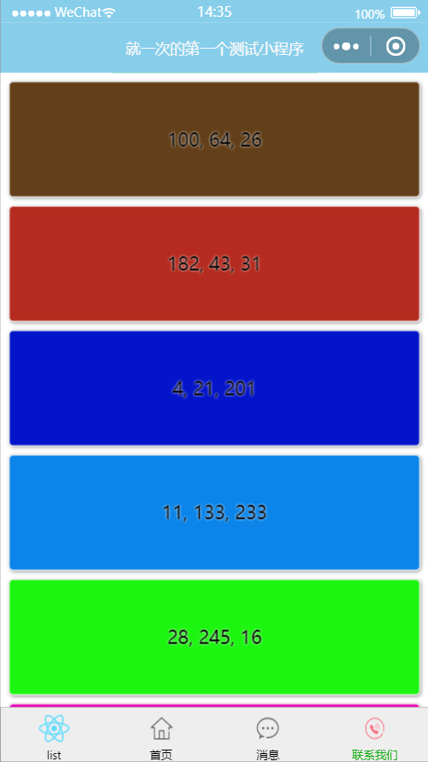

### 4.扩展

#### 1.自定义编译模式

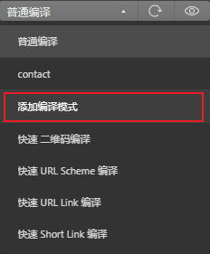

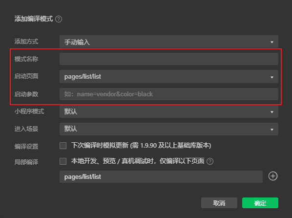

## 3.生命周期

### 1.什么是生命周期

**生命周期**（Life Cycle）是指一个对象从**创建** -> **运行** -> **销毁**的整个阶段，**强调的是一个时间段**。例如：

- 张三**出生**，表示这个人**生命周期的开始**
- 张三**离世**，表示这个人**生命周期的结束**
- 中间张三的一生，就是张三的生命周期

我们可以把每个小程序运行的过程，也概括为生命周期：

- 小程序的**启动**，表示**生命周期的开始**
- 小程序的**关闭**，表示**生命周期的结束**
- 中间小程序运行的过程，就是小程序的生命周期

### 2.生命周期的分类

在小程序中，生命周期分为两类，分别是：

1. 应用生命周期
   - 特指小程序从启动 -> 运行 -> 销毁的过程
2. 页面生命周期
   - 特指小程序中，每个页面的加载 -> 渲染 -> 销毁的过程

其中，**页面**的生命周期**范围较小**，**应用程序**的生命周期**范围较大**，如图所示：

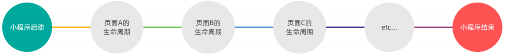

### 3.什么是生命周期函数

**生命周期函数**：是由小程序框架提供的**内置函数**，会伴随着生命周期，**自动按次序执行**。

**生命周期函数的作用**：允许程序员**在特定的时间点，执行某些特定的操作**。例如，页面刚加载的时候，可以在 onLoad 生命周期函数中初始化页面的数据。

> 注意：**生命周期**强调的是**时间段**，**生命周期函数**强调的是**时间点**。

### 4.生命周期函数的分类

小程序中的生命周期函数分为两类，分别是：

1. 应用的生命周期函数
   - 特指小程序从启动 -> 运行 -> 销毁期间依次调用的那些函数
2. 页面的生命周期函数
   - 特指小程序中，每个页面从加载 -> 渲染 -> 销毁期间依次调用的那些函数

### 5.应用的生命周期函数

小程序的**应用生命周期函数**需要在 **app.js** 中进行声明，示例代码如下：

```js
App({
  // 小程序初始化完成时，执行此函数，全局只触发一次，可以做一些初始化的工作
  onLaunch(options) {},
  // 小程序启动，或从后台进入前台显示时触发
  onShow(options) {},
  // 小程序从前台进入后台时触发
  onHide() {}
})

```

### 6.页面的生命周期函数

小程序的**页面生命周期函数**需要在页面的 **.js 文件**中进行声明，示例代码如下：

```js
Page({
  // 监听页面加载，一个页面只调用一次
  onLoad(options) {},
  // 监听页面初次渲染完成，一个页面只调用一次
  onReady() {},
  // 监听页面显示
  onShow() {},
  // 监听页面隐藏
  onHide() {},
  // 监听页面卸载，一个页面只调用一次
  onUnload() {}
})
```

## 4.WXS 脚本

### 1.概述

#### 1.什么是 wxs

**WXS**（WeiXin Script）是**小程序独有的一套脚本语言**，结合 WXML，可以构建出页面的结构。

#### 2.wxs 的应用场景

**wxml 中无法调用在页面的 .js 中定义的函数**，但是，wxml 中可以调用 wxs 中定义的函数。因此，小程序中 wxs 的**典型应用场景**就是 “**过滤器**”。

#### 3.wxs 和 JavaScript 的关系

虽然 wxs 的语法类似于 JavaScript，但是 wxs 和 JavaScript 是完全不同的两种语言：

1. wxs 有自己的数据类型
   - **number** 数值类型
   - **string** 字符串类型
   - **boolean** 布尔类型
   - **object** 对象类型
   - **function** 函数类型
   - **array** 数组类型
   - **date** 日期类型
   - **regexp** 正则
2. wxs 不支持类似于 ES6 及以上的语法形式
   - **不支持**：let、const、解构赋值、展开运算符、箭头函数、对象属性简写、etc...
   - **支持**：var 定义变量、普通 function 函数等类似于 ES5 的语法
3. wxs 遵循 CommonJS 规范
   - **module** 对象
   - **require()** 函数
   - **module.exports** 对象

### 2.基础语法

#### 1.内嵌 wxs 脚本

wxs 代码可以编写在 wxml 文件中的**`<wxs>`**标签内，就像 Javascript 代码可以编写在 html 文件中的`<script>`标签内一样。

wxml 文件中的每个`<wxs></wxs>`标签，**必须提供 module 属性**，用来指定**当前 wxs 的模块名称**，方便在 wxml 中访问模块中的成员：

```jsx
<view>{{m1.toUpper('abc')}}</view>

<!-- 定义内部的 wxs 脚本 -->
<wxs module="m1">
  // 将文本转换为大写
  module.exports.toUpper = function(str) {
    return str.toUpperCase()
  }
</wxs>
```

#### 2.定义外联的 wxs 脚本

wxs 代码还可以编写在**以 .wxs 为后缀名的文件内**，就像 javascript 代码可以编写在以 .js 为后缀名的文件中一样。示例代码如下：

tools.wxs 文件：

```js
// 将文本转换为小写
function toLower(str) {
  return str.toLowerCase()
}

module.exports = {
  toLower
}
```

#### 3.使用外联的 wxs 脚本

在 wxml 中引入外联的 wxs 脚本时，**必须**为`<wxs>`标签添加 **module** 和 **src** 属性，其中：

- **module** 用来指定模块的名称
- **src** 用来指定要引入的脚本的路径，且**必须是相对路径**

示例代码如下：

```html
<view>{{m2.toLower('ABC')}}</view>

<!-- 引用外联的 tools.wxs 脚本 -->
<wxs src="../../utils/tools.wxs" module="m2"></wxs>
```

### 3.WXS 的特点

#### 1.与 JavaScript 不同

为了降低 wxs（**WeiXin Script**）的学习成本， wxs 语言在设计时借大量鉴了 JavaScript 的语法。但是本质上，wxs 和 JavaScript 是完全不同的两种语言！

#### 2.不能作为组件的事件回调

wxs 典型的应用场景就是 “**过滤器**”，**经常配合 Mustache 语法进行使用**，例如：

```html
<view>{{m1.toUpper(name)}}</view>
```

但是，在 wxs 中定义的函数**不能作为组件的事件回调函数**。例如，下面的用法是错误的：

```html
<button bindtap="m1.toUpper">按钮</button>
```

#### 3.隔离性

**隔离性**指的是 wxs 的运行环境和其他 JavaScript 代码是隔离的。体现在如下两方面：

1. wxs 不能调用 js 中定义的函数
2. wxs 不能调用小程序提供的 API

#### 4.性能好

- 在 **iOS 设备**上，小程序内的 **WXS** 会比 JavaScript 代码**快 2 ~ 20 倍**
- 在 **android 设备**上，二者的运行效率**无差异**

## 5.案例 - 本地生活（列表页面）

### 1.演示页面效果以及主要功能

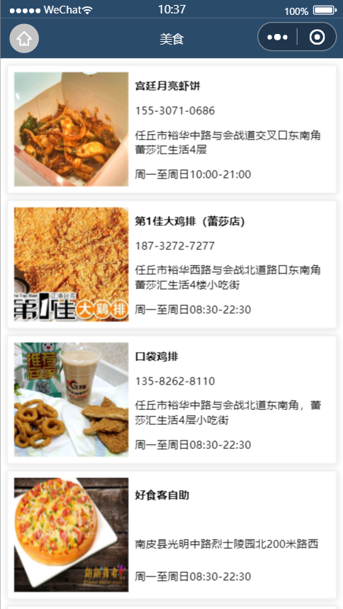

- 页面导航并传参
- 上拉触底时加载下一页数据
- 下拉刷新列表数据

### 2.列表页面的 API 接口

以**分页**的形式，加载**指定分类下**商铺列表的数据：

1. 接口地址
   - https://www.escook.cn/categories/:cate_id/shops
   - URL 地址中的 :cate_id 是动态参数，表示分类的 Id
2. 请求方式
   - GET 请求
3. 请求参数
   - **_page** 表示请求第几页的数据
   - **_limit** 表示每页请求几条数据

## 6.总结

1. 能够知道如何实现页面之间的导航跳转
   - 声明式导航、编程式导航
2. 能够知道如何实现下拉刷新效果
   - enablePullDownRefresh、**onPullDownRefresh**
3. 能够知道如何实现上拉加载更多效果
   - onReachBottomDistance、**onReachBottom**
4. 能够知道小程序中常用的生命周期函数
   - 应用生命周期函数：**onLaunch**、onShow、onHide
   - 页面生命周期函数：**onLoad**、onShow、**onReady**、onHide、onUnload

# 4.小程序 - 基础加强

## 1.自定义组件

### 1.组件的创建与引用

#### 1.创建组件

1. 在项目的根目录中，鼠标右键，创建 **components** -> **test** 文件夹
2. 在新建的 components -> test 文件夹上，鼠标右键，点击 “**新建 Component**”
3. 键入组件的名称之后回车，会自动生成组件对应的 4 个文件，后缀名分别为 .js，.json， .wxml 和 .wxss

注意：为了保证目录结构的清晰，建议把不同的组件，存放到单独目录中，例如：

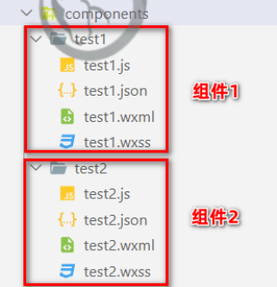

#### 2.引用组件

组件的引用方式分为 “**局部引用**” 和 “**全局引用**”，顾名思义：

- 局部引用：组件只能在当前被引用的页面内使用
- 全局引用：组件可以在每个小程序页面中使用

#### 3.局部引用组件

在页面的 .json 配置文件中引用组件的方式，叫做 “局部引用”。示例代码如下：

04-demo.json 文件：

```json
{
  "usingComponents": {
    "my-test": "/components/test/test"
  }
}
```

04-demo.wxml 文件：

```html
<!-- 使用 test 组件 -->
<my-test></my-test>
```

#### 4.全局引用组件

在 app.json 全局配置文件中引用组件的方式，叫做 “全局引用”。示例代码如下：

app.json 文件：

```json
{
  "pages": [...],
  "window": {...},
  "usingComponents": {
    "my-test1": "/components/test1/test1"
  }
}
```

04-demo.wxml 文件：

```html
<!-- 使用 test 组件 -->
<my-test1></my-test1>
```

#### 5.全局引用 VS 局部引用

根据组件的**使用频率**和**范围**，来选择合适的引用方式：

- 如果某组件**在多个页面中经常被用到**，建议进行 “全局引用”
- 如果某组件只**在特定的页面中被用到**，建议进行 “局部引用”

#### 6.组件和页面的区别

从表面来看，组件和页面都是由 .js、.json、.wxml 和 .wxss 这四个文件组成的。但是，组件和页面的 .js 与 .json 文件有明显的不同：

- 组件的 .json 文件中需要声明 **"component": true** 属性
- 组件的 .js 文件中调用的是 **Component()** 函数
- 组件的事件处理函数需要定义到 **methods** 节点中

### 2.样式

#### 1.组件样式隔离

默认情况下，自定义组件的样式只对当前组件生效，不会影响到组件之外的 UI 结构，如图所示：

- 组件 A 的样式**不会影响**组件 C 的样式
- 组件 A 的样式**不会影响**小程序页面的样式
- 小程序页面的样式**不会影响**组件 A 和 C 的样式

好处：

1. 防止外界的样式影响组件内部的样式
2. 防止组件的样式破坏外界的样式

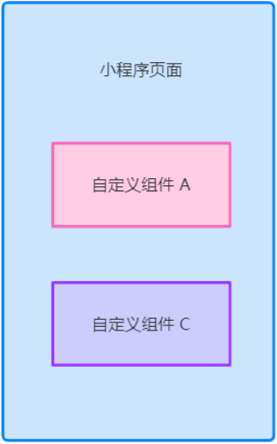

#### 2.组件样式隔离的注意点

- app.wxss 中的全局样式对组件无效
- 只有 class 选择器会有样式隔离效果，id 选择器、属性选择器、标签选择器不受样式隔离的影响

建议：在**组件**和**引用组件的页面**中建议使用 class 选择器，**不要使用 id、属性、标签选择器**！

#### 3.修改组件的样式隔离选项

默认情况下，自定义组件的**样式隔离特性**能够**防止组件内外样式互相干扰的问题**。但有时，我们希望在外界能够控制组件内部的样式，此时，可以通过 **styleIsolation** 修改组件的样式隔离选项，用法如下：

在组件的 .js 文件中新增如下配置：

```js
Component({
  options: {
    styleIsolation: 'apply-shared'
  }
})
```

或在组件的 .json 文件中新增如下配置：

```json
{
  "styleIsolation": "apply-shared"
}
```

#### 4.styleIsolation 的可选值

| 可选值       | 默认值 | 描述                                                         |
| ------------ | ------ | ------------------------------------------------------------ |
| isolated     | 是     | 表示**启用样式隔离**，在自定义组件内外，使用 class 指定的样式将**不会相互影响** |
| apply-shared | 否     | 表示**页面 wxss 样式将影响到自定义组件**，但自定义组件 wxss 中指定的样式不会影响页面 |
| **shared**   | 否     | 表示页面 wxss 样式将影响到自定义组件，自定义组件 wxss 中指定的样式也会影响页面和其他设置了 apply-shared 或 shared 的自定义组件 |

### 3.数据、方法和属性

#### 1.data 数据

在小程序组件中，**用于组件模板渲染**的**私有数据**，需要定义到 **data 节点**中，示例如下：

```js
Component({
  /**
   * 组件的初始数据
   */
  data: {
    count: 0
  }
})

```

#### 2.methods 方法

在小程序组件中，**事件处理函数**和**自定义方法**需要定义到 **methods 节点**中，示例代码如下：

```js
Component({
  /**
   * 组件的初始数据
   */
  data: {
    count: 0
  },

  /**
   * 组件的方法列表
   */
  methods: {
    // 事件处理函数 count++
    countAdd() {
      this.setData({count: this.data.count + 1})
      this._showCount() // 通过 this 直接调用自定义函数
    },
    // 自定义函数，建议以 _ 开头
    _showCount() {
      // 显示 count 值
      wx.showToast({
        title: `count 的值为：${this.data.count}`,
        icon: 'none'
      })
    }
  }
})

```

#### 3.properties 属性

在小程序组件中，properties 是组件的对外属性，**用来接收外界传递到组件中的数据**，示例代码如下：

```js

```


## 2.使用 npm 包

## 3.全局数据共享

## 4.分包

## 5.案例 - 自定义 tabBar