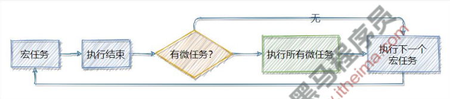
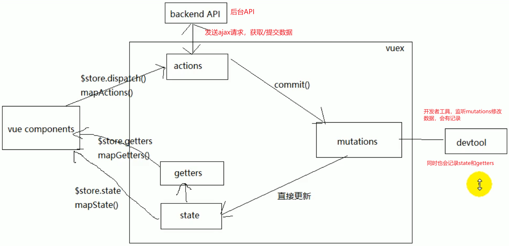

# 1. 作用域

```js
// 作用域
var num1 = 55
var num2 = 66

function f1(num, num1) {
  // var num1 = 55
  // var num2 = 66
  num = 100
  num1 = 100
  num2 = 100
  console.log(num) // 100
  console.log(num1) // 100
  console.log(num2) // 100
}

// 55    66
f1(num1, num2)
console.log(num1) // 55
console.log(num2) // 100
console.log(num) // 报错
```

# 2. 值类型和引用类型的传递

```js
function Person(name, age, salary) {
  this.name = name
  this.age = age
  this.salary = salary
}

function f1(person) {
  // 内部是创建了以下变量
  // var person = p

  person.name = 'ls'
  person = new Person('aa', 18, 10) // person 改变了，但是 p 没改变
}

var p = new Person('zs', 18, 1000)
console.log(p.name) // zs
f1(p)
console.log(p.name) // ls
```


# 3. 封装函数将字符串进行驼峰命名

```js
// 已知有字符串 foo='get-element-by-id'，写一个 function 将其转化成驼峰表示法 “getElementById”

function toString(foo) {
  // var foo = 'get-element-by-id'
  const array = foo.split('-') // 根据某个字符进行切割
  for (let i = 1; i < array.length; i++) {
    array[i] = array[i].charAt(0).toUpperCase() + array[i].substring(1) // 获取每个元素中的第一个字符并转换成大写
  }
  return array.join('')
}

console.log(toString('get-element-by-id')) // getElementById
```

# 4. 冒泡排序

```js
// 第一种（效率高）
let array = [2, 3, 1, 5, 4]

for (let i = 0; i < array.length; i++) {
  for (let j = i + 1; j < array.length; j++) {
    if (array[i] > array[j]) array[i] = [array[j], array[j] = array[i]][0] // 交换值
  }
}

console.log(array)

// 第二种（效率低）
array = [2, 3, 1, 5, 4]

for (let i = 0; i < array.length - 1; i++) {
  for (let j = 0; j < array.length - 1 - i; j++) {
    if (array[j] > array[j + 1]) array[j] = [array[j + 1], array[j + 1] = array[j]][0] // 交换值
  }
}

console.log(array)
```

# 5. 反转数组

```js
// 第一种
let array = [1, 2, 3, 4, 5]

array.reverse()

console.log(array)

// 第二种
array = [1, 2, 3, 4, 5]

for (let i = 0; i < array.length / 2; i++) {
  array[i] = [array[array.length - 1 - i], array[array.length - 1 - i] = array[i]][0] // 交换值
}

console.log(array)

```

# 6. 数组去重

```js
let array = [1, 1, 2, 2, 3, 3]

array = [...new Set(array)]

console.log(array)
```

# 7. 水平垂直居中

```html
<!DOCTYPE html>
<html lang="en">
<head>
  <meta charset="UTF-8"/>
  <meta http-equiv="X-UA-Compatible" content="IE=edge"/>
  <meta name="viewport" content="width=device-width, initial-scale=1.0"/>
  <style>
    * {
      margin: 0;
      padding: 0;
    }

    .father {
      width: 400px;
      height: 400px;
      background-color: pink;

      /* 第一种和第二种 */
      /*position: relative;*/

      /* 新版本 flex */
      /*display: flex;
      justify-content: center;
      align-items: center;*/

      /* 老版本 flex */
      display: -webkit-box;
      -webkit-box-pack: center;
      -webkit-box-align: center;
    }

    .father .son {
      width: 200px;
      height: 200px;
      background-color: skyblue;

      /* 第一种 */
      /*position: absolute;
      top: 0;
      right: 0;
      bottom: 0;
      left: 0;
      margin: auto;*/

      /* 第二种 */
      /*position: absolute;*/
      /*top: 50%;*/
      /*left: 50%;*/
      /*transform: translate(-50%, -50%);*/
    }
  </style>
  <title>Title</title>
</head>
<body>
<div class="father">
  <div class="son"></div>
</div>
</body>
</html>
```

# 8. 三角形

```html
<!DOCTYPE html>
<html lang="en">
<head>
  <meta charset="UTF-8"/>
  <meta http-equiv="X-UA-Compatible" content="IE=edge"/>
  <meta name="viewport" content="width=device-width, initial-scale=1.0"/>
  <style>
    * {
      margin: 0;
      padding: 0;
    }

    .box {
      border: 100px solid;
      border-top-color: pink;
      border-right-color: transparent;
      border-bottom-color: transparent;
      border-left-color: transparent;
      width: 0;
      height: 0;
    }
  </style>
  <title>Title</title>
</head>
<body>
<div class="box"></div>
</body>
</html>

```

# 9. rem 适配

```html
<!DOCTYPE html>
<html lang="en">
<head>
  <meta charset="UTF-8"/>
  <meta http-equiv="X-UA-Compatible" content="IE=edge"/>
  <meta name="viewport" content="width=device-width, initial-scale=1.0"/>
  <style>
    * {
      margin: 0;
      padding: 0;
    }

    .box {
      /* 公式：像素 / 设备宽度 */
      width: 0.2666666666666667rem; /* 100 / 375 = 100px */
      height: 0.2666666666666667rem; /* 100 / 375 = 100px */
      background-color: pink;
    }
  </style>
  <title>Title</title>
</head>
<body>
<div class="box"></div>
<script>
  window.addEventListener('load', () => {
    const html = document.documentElement
    html.style.fontSize = html.clientWidth + 'px' // 设置 html 字体大小为设备的宽度 375px
  })
</script>
</body>
</html>
```

# 10. 背景距离

```html
<!DOCTYPE html>
<html lang="en">
<head>
  <meta charset="UTF-8"/>
  <meta http-equiv="X-UA-Compatible" content="IE=edge"/>
  <meta name="viewport" content="width=device-width, initial-scale=1.0"/>
  <style>
    * {
      margin: 0;
      padding: 0;
    }

    .box {
      border: 80px solid blue;
      padding: 100px;
      width: 100px;
      height: 200px;
      background-color: pink;
      background-image: url("./images/vue50.png");
      background-repeat: no-repeat;
      background-origin: content-box;
      background-position: -50px 0;
      /* 求背景图片左边到 box 盒子左边框外侧的距离 */
      /* border + padding - background-position */
      /* 80 + 100 - 50 = 130 */
    }
  </style>
  <title>Title</title>
</head>
<body>
<div class="box"></div>
</body>
</html>
```

# 11. js 综合面试题

```html
<!doctype html>
<html lang="en">
<head>
  <meta charset="UTF-8">
  <meta name="viewport" content="width=device-width, user-scalable=no, initial-scale=1.0">
  <meta http-equiv="X-UA-Compatible" content="ie=edge">
  <title>Document</title>
</head>
<body>
<script>
  function Foo() {
    getName = function () {console.log(1)}
    return this
  }

  // var getName // 1. 变量提升
  // function getName() {console.log(5)} // 2. 函数提升，与上面的变量名重复，最后会保留函数

  Foo.getName = function () {console.log(2)} // 添加静态属性
  Foo.prototype.getName = function () {console.log(3)} // 添加原型属性

  var getName = function () {console.log(4)} // 3. 此时 getName 变量已失效，赋值的是 getName 函数

  function getName() {console.log(5)}

  // 请写出下列的输出结果
  Foo.getName() // 2
  getName() // 4
  Foo().getName() // 1 -- 解释：(window.Foo()).getName()，先调用 window.Foo() 返回的 this 指向的是 window，再调用 window.getName()
  getName() // 1
  new Foo.getName()// 2 -- 解释：点（.）的优先级最高，所以是执行 new (Foo.getName)() 可以看成 new (function () {console.log(2)})()
  new Foo().getName()// 3 -- 解释：点（.）的优先级最高，但是括号不能用点（.）调用，所以是执行 (new Foo()).getName() 可以看成 foo.getName()
  new new Foo().getName() // 3 -- 解释：根上一行一样 new ((new Foo()).getName)() 可以看成 new (foo.getName)() 可以看成 new (function () {console.log(3)})()
</script>
</body>
</html>

```

# 12. 函数节流和防抖

```html
<!DOCTYPE html>
<html lang="en">
<head>
  <meta charset="UTF-8">
  <meta http-equiv="X-UA-Compatible" content="IE=edge">
  <meta name="viewport" content="width=device-width, user-scalable=no, initial-scale=1.0">
  <style>
    html {
      height: 500%;
    }
  </style>
  <title>Title</title>
</head>
<body>
<button>按钮</button>
<script>
  // 函数节流：一个需要频繁触发的函数，在规定时间内，只让函数触发的第一次生效，后面的不生效
  /**
   * 节流函数
   * @param fn 要被节流的函数
   * @param delay 规定的时间
   */
  function throttle(fn, delay) {
    let lastTime = 0 // 记录上一次函数触发的时间
    return function() { // 闭包
      let nowTime = Date.now() // 记录当前函数触发的时间
      if (nowTime - lastTime > delay) { // 判断两次触发时间的间隔大于规定的时间
        fn.call(this) // 修正 this 指向的问题
        lastTime = nowTime // 同步时间
      }
    }
  }

  // 测试节流函数
  window.addEventListener('scroll', throttle(() => console.log('触发了页面滚动事件', Date.now()), 200)) // 每隔 200 毫秒才能再次执行

  // 函数防抖：一个需要频繁触发的函数，在规定时间内，只让最后一次生效，前面的不生效
  /**
   * 防抖函数
   * @param fn 要被节流的函数
   * @param delay 规定的时间
   */
  function debounce(fn, delay) {
    let timer = null // 记录上一次的延时器
    return function () {
      clearTimeout(timer) // 清除上一次的延时器
      timer = setTimeout(() => fn.apply(this), delay) // 重新设置延时器
    }
  }

  // 测试防抖函数
  document.querySelector('button').addEventListener('click', debounce(() => console.log('触发了点击事件', Date.now()), 500)) // 500 毫秒内只有最后一次点击才生效
</script>
</body>
</html>
```

# 13. 跨域

```html
<!DOCTYPE html>
<html lang="en">
<head>
  <meta charset="UTF-8">
  <meta http-equiv="X-UA-Compatible" content="IE=edge">
  <meta name="viewport" content="width=device-width, user-scalable=no, initial-scale=1.0">
  <title>Title</title>
</head>
<body>
<script>
  /*
  * 面试题：什么是跨域？解决跨域的办法有哪些？
  *
  * 1. 同源策略
  *   - 是浏览器安全策略
  *   - 协议名、域名、端口号必须完全一致
  * 2. 跨域
  *   违背同源策略就会就会产生跨域
  * 3. 解决跨域
  *   jsonp、cors、服务器代理...
  * */

  // jsonp 的前端实现规则
  // 设置回调函数，数据请求回来会被触发的函数
  function getData(response) {
    console.log(response)
  }
  const script = document.createElement('script') // 创建 script 元素
  script.src = 'http://localhost:3000?callback=getData' // 设置 script 的 src 属性为设置请求地址
  document.body.appendChild(script) // 将 script 添加到 body 中
</script>
</body>
</html>
```

# 14. node.js 的事件轮询机制

```js
/*
* 面试题：node.js 的事件轮询机制
* */

// js 的定时器
setTimeout(() => {
  console.log('setTimeout()')
}, 0)

// node 的函数，用来异步执行代码
setImmediate(() => {
  console.log('setImmediate()')
})

// node 的函数，用来异步执行代码
process.nextTick(() => {
  console.log('process.nextTick()')
})

/*
* 执行顺序：
*   process.nextTick()
*   setTimeout()
*   setImmediate()
* 解释：
*   process.nextTick() 能在任意阶段优先执行，所以它最先执行
*   一进来是 timers 定时器阶段，发现 setTimeout() 是 0，立即执行
*   然后进入到 poll 轮询阶段（轮询队列），发现之前设置过 setImmediate() 函数
*   所以又会跳转到 check 查阶段，执行 setImmediate() 函数
* */
```

node.js 的事件轮询机制：借助 libuv 库实现的

概括事件轮询机制，分为 6 个阶段：

1. timers 定时器阶段
   - 计时和执行到点的定时器回调函数
2. pending callbacks
   - 某些系统操作（例如 TCP 错误类型）的回调函数
3. idle prepare
   - 准备工作
4. poll 轮询阶段（轮询队列）
   - **如果轮询队列不为空**；依次同步取出轮询队列中第一个回调函数执行，直到轮询队列为空或者达到系统最大的限制
   - **如果轮询队列为空**；
     - **如果之前设置过 setImmediate 函数**；直接进入下一个 check 阶段
     - **如果之前没有设置过 setImmediate 函数**；在当前 poll 阶段等待
       - 直到轮询队列添加回调函数，就去执行**如果轮询队列不为空**的情况
       - 如果定时器到点了，它也会去下一个阶段
5. check 查阶段
   - 执行 setImmediate 设置的回调函数
6. close callbacks 关闭阶段
   - 执行 close 事件回调函数

# 15. 输入 url 地址到页面渲染完成的过程

面试题：从输入 url 地址到最终页面渲染完成，发生了什么？

1. DNS 解析：将域名地址解析为 ip 地址
   - 先会读取浏览器 DNS 缓存
   - 如果没有，会读取系统 DNS 缓存
   - 如果还没有，会读取路由器 DNS 缓存，前提是要有路由器存在
   - 如果还没有，会读取网络运营商 DNS 缓存
   - 如果还没有，递归搜索：（例如网址是 blog.baidu.com）
     - 先会去 .com 域名下查找 DNS 解析
     - 如果没有，会去 .baidu 域名下查找
     - 如果还没有，会去 blog 域名下查找
     - 如果还没有，就会出错
2. TCP 连接：**TCP 三次握手**
   - 第一次握手：**由浏览器发起**，告诉服务器我要发送请求了
   - 第二次握手：**由服务器发起**，告诉浏览器我准备接受了，你赶紧发送吧
   - 第三次握手：**由浏览器发起**，告诉服务器，我马上就发了，准备接受吧
3. 发送请求
   - 请求报文：HTTP 协议的通信内容
4. 接受响应
   - 响应报文
5. 渲染页面
   - 遇见 HTML 标记，浏览器调用 HTML 解析器解析成 Token 并构建成 dom 树
   - 遇见 style/link 标记，浏览器调用 css 解析器，处理 css 标记并构建 cssom 树
   - 遇见 script 标记，调用 javascript 解析器，处理 script 代码（绑定事件，修改 dom 树/cssom 树）
   - 将 dom 树和 cssom 树合并成一个渲染树
   - 根据渲染树来计算布局，计算每个节点的几何信息（布局）
   - 将各个节点颜色绘制到屏幕上（渲染）
   - 注意：
     - 这五个步骤不一定按照顺序执行，如果 dom 树或 cssom 树被修改了，可能会执行多次布局和渲染
     - 往往实际页面中，这些步骤都会执行多次
6. 断开连接：**TCP 四次挥手**
   - 第一次挥手：**由浏览器发起**，发送给服务器，我东西发送完了（请求报文），你准备关闭吧
   - 第二次挥手：**由服务器发起**，告诉浏览器，我东西接受完了（请求报文），我准备关闭了，你也准备吧
   - 第三次挥手：**由服务器发起**，告诉浏览器，我东西发送完了（响应报文），你准备关闭吧
   - 第四次挥手：**由浏览器发起**，告诉服务器，我东西接受完了，我准备关闭了（响应报文），你也准备吧

# 16. 闭包

1. 理解：什么是闭包？
   - 密闭的容器，类似于 set，map 容器，存储数据的
   - 闭包是一个对象，存放数据的格式：key: value
2. 形成的条件
   - 函数嵌套
   - 内部函数引用外部函数的局部变量
3. 闭包的优点
   - 延长外部函数局部变量的生命周期
4. 闭包的缺点
   - 容易造成内容泄露
5. 注意点
   - 合理的使用闭包
   - 用完闭包要及时清除（销毁）

```js
// 闭包的应用场景
function fun() {
  let count = 1

  return function() {
    count++
    console.log(count)
  }
}

const fun2 = fun()
fun2() // 2
fun2() // 3
```

```js
/*
  * 说说它们的输出情况
  * */

function fun(n, o) {
  // var n, o
  console.log(o)
  return {
    fun: function(m) {
      // var m
      return fun(m, n) // 这里调用的是 window.fun()，也就是外层的那个 fun()
    }
  }
}

var a = fun(0) // undefined
a.fun(1) // 0 -- 解释：这次调用返回的值并没有接收，用的还是第一次调用接收到的 a，所以 o 一直没变，下面调用也都是一样
a.fun(2) // 0
a.fun(3) // 0

var b = fun(0).fun(1).fun(2).fun(3) // undefined, 0, 1, 2 -- 解释：每次调用用的都是上次调用返回的值，所以 o 一直在改变

var c = fun(0).fun(1) // undefined, 0 -- 解释：接收的是第二次调用返回的值，所以 o 是 1 然后一直没变，下面调用也都是一样
c.fun(2) // 1
c.fun(3) // 1
```

# 17. 变量提升

1. js 引擎在代码正式执行之前会做一个预处理的工作
   - 收集变量
   - 收集函数
2. 依据
   - 将 var 后边的变量定义但是不赋值
   - function() {} 提前定义该函数

```js
// var username
// function fun() {console.log('fun()')}

console.log(username) // undefined
var username = 'kobe'
console.log(username) // kobe

fun() // fun()
function fun() {
  console.log('fun()')
}
```

**执行上下文，执行上下文对象**

- 执行上下文（execute context）EC

  1. 理解：代码执行的环境（作用域）

  2. 时机：代码正式执行之前会进入到执行环境

  3. 工作：

     1. 创建变量对象

        - 变量
        - 函数及函数的参数
        - 全局：window
        - 局部：抽象的但是确实存在

     2. 确认 this 指向

        - 全局：this --> window
        - 局部：this --> 调用其的对象

     3. 创建作用域链

        - 父级作用域链 + 当前的变量对象

     4. 扩展：

        - ECObj = {

            变量对象: {变量, 函数, 函数的形参},

            scopeChain: 父级作用域链 + 当前的变量对象,

            this: {window || 调用其的对象}

          }

- 执行上下文对象

# 18. 宏任务和微任务

## 1. 什么是宏任务和微任务

JavaScript 把异步任务又做了进一步的划分，异步任务又分为两类，分别是：

1. **宏任务**（macrotask）
   - 异步 Ajax 请求、
   - setTimeout、setInterval、requestAnimationFrame
   - 文件操作
   - 其它宏任务
2. **微任务**（microtask）
   - Promise.then、Promise.catch 和 Promise.finally
   - process.nextTick
   - 其它微任务


## 2. 宏任务和微任务的执行顺序



每一个宏任务执行完之后，都会检查**是否存在待执行的微任务**，

如果有，则执行完所有微任务之后，再继续执行下一个宏任务。

## 3. 去银行办业务的场景

1. 小云和小腾去银行办业务。首先，需要**取号之后进行排队**
   - 宏任务队列
2. 假设当前银行网点只有一个柜员，小云在办理存款业务时，**小腾只能等待**
   - **单线程**，宏任务**按次序执行**
3. 小云办完存款业务后，柜员询问他**是否还想办理其它业务**？
   - 当前宏任务执行完，**检查是否有微任务**
4. 小云告诉柜员：想要买理财产品、再办个信用卡、最后再兑换点马年纪念币？
   - 执行微任务，后续**宏任务被推迟**
5. 小云离开柜台后，柜员开始为小腾办理业务
   - **所有微任务执行完毕**，开始**执行下一个宏任务**

## 4. 分析以下代码输出的顺序

```js
setTimeout(() => console.log('1')) // 宏任务

new Promise(resolve => { // 同步任务
  console.log('2') // 同步任务
  resolve()
}).then(() => console.log('3')) // 微任务

console.log('4') // 同步任务
```

> 正确的输出顺序是：2431
>
> 分析：
>
> 1. 先执行所有的**同步任务**
>    - 执行第 6 行、第 12 行代码
> 2. 再执行**微任务**
>    - 执行第 9 行代码
> 3. 再执行**下一个宏任务**
>    - 执行第 2 行代码

## 5. 经典面试题

请分析以下代码输出的顺序（代码较长，截取成了左中右 3 个部分）：

```js
console.log('1') // 同步任务

setTimeout(() => { // 宏任务
  console.log('2')
  new Promise(resolve => { // 同步任务
    console.log('3')
    resolve()
  }).then(() => console.log('4')) // 微任务
})

new Promise(resolve => { // 同步任务
  console.log('5')
  resolve()
}).then(() => console.log('6')) // 微任务

setTimeout(() => { // 宏任务
  console.log('7')
  new Promise(resolve => { // 同步任务
    console.log('8')
    resolve()
  }).then(() => console.log('9')) // 微任务
})
```

> 正确的输出顺序是：156234789

# 19. 比较一下 Vue 与 React

- 相同点
  1. 都有组件化开发和 Virtual DOM（虚拟 DOM）
  2. 都支持 props 进行父子组件间数据通信
  3. 都支持数据驱动视图，不直接操作真实 DOM，更新状态数据界面就自动更新
  4. 都支持服务器端渲染
  5. 都有支持 native（原生应用）的方案，**Vue 的 WEEX**，**React 的 React Native**
- 不同点
  1. 数据绑定
     - vue 实现了数据的双向绑定
     - react 数据流动是单向的
  2. 组件写法不一样
     - vue 推荐的做法是 webpack + vue-loader 的单文件组件格式，即 html、css、js 写在同一个文件
     - react 推荐的做法是 JSX，也就是把 HTML 和 CSS 全都写进 JavaScript，即 “all in js”
  3. state 对象
     - 在 vue 中，state 对象不是必须的，数据由 data 属性在 vue 对象中管理
     - 在 react 中，state 对象是不可变的，需要使用 setState 方法更新状态
  4. Virtual DOM 不一样
     - vue 会跟踪每一个组件的依赖关系，不需要重新渲染整个组件树
     - react 是每当应用的状态被改变是，全部组件都会重新渲染，所以 react 中会需要 shouldComponentUpdate 这个生命周期函数来进行控制
  5. react 严格来说只针对 MVC 的 view 层，vue 则是 MVVM 模式的实现

# 20. 说说 Vue 组件通信方式

1. 通信种类
   1. 父组件向子组件通信
   2. 子组件向父组件通信
   3. 隔代组件间通信
   4. 兄弟组件间通信
2. 实现通信的方式
   1. props
      - 通过一般类型的属性实现父向子通信
      - 通过函数类型的属性实现子向父通信
      - 隔代组件需要逐层传递
      - 兄弟组件必须借助于父组件才能通信
   2. vue 自定义事件
      - vue 内置实现，可以代替函数类型的 props
        1. 在父组件监听事件：`<MyComponent @eventName="callback"/>`
        2. 在子组件触发事件：this.$emit('eventName', data)
      - 缺点：只适合子向父通信
   3. 消息订阅与发布
      - 需要引入消息订阅与发布的实现库，如：pubsub-js
        1. 订阅消息：PubSub.pubscribe('msg', (msg, data) => {})
        2. 发布消息：PubSub.publish('msg', data)
      - 优点：此方式可以实现任意关系组件间通信
   4. vuex
      - vuex 是 vue 官方提供的集中式管理 vue 多组件共享状态数据的 vue 插件
      - 缺点：对组件间关系没有限制，且相比与 pubsub-js 库管理更集中，更方便
   5. slot 插槽
      - 子组件通过`<slot>`元素定义插槽，从而**为用户预留内容占位符**
      - 父组件传递带数据的模板结构实现父向子通信

# 21. Vuex 管理状态的机制

## 1. 对 Vuex 基本理解

- vuex 是一个专为 Vue.js 应用程序开发的状态管理的 vue 插件
- 作用：集中式管理 vue 多个组件共享的状态和从后台获取的数据

## 2. Vuex 的工作原理



# 22. 说说 Vue 的 MVVM 实现原理

## 1. 理解

1. Vue 作为 MVVM 模式的实现库的 2 种技术
   - 模板解析
   - 数据绑定
2. 模板解析：实现初始化显示
   - 解析大括号表达式
   - 解析指令
3. 数据绑定：实现更新显示
   - 通过数据劫持实现

## 2. 原理结构图

同时为每个属性创建一个dep对象


