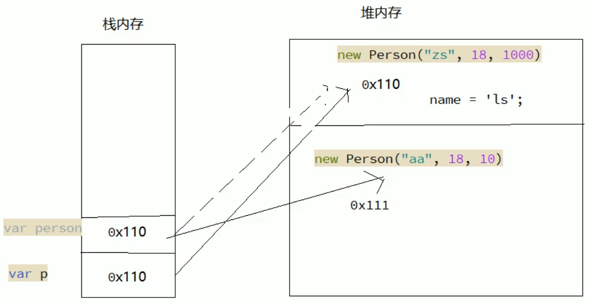

# 1. 作用域

```js
// 作用域
var num1 = 55
var num2 = 66

function f1(num, num1) {
  // var num1 = 55
  // var num2 = 66
  num = 100
  num1 = 100
  num2 = 100
  console.log(num) // 100
  console.log(num1) // 100
  console.log(num2) // 100
}

// 55    66
f1(num1, num2)
console.log(num1) // 55
console.log(num2) // 100
console.log(num) // 报错
```

# 2. 值类型和引用类型的传递

```js
function Person(name, age, salary) {
  this.name = name
  this.age = age
  this.salary = salary
}

function f1(person) {
  // 内部是创建了以下变量
  // var person = p

  person.name = 'ls'
  person = new Person('aa', 18, 10) // person 改变了，但是 p 没改变
}

var p = new Person('zs', 18, 1000)
console.log(p.name) // zs
f1(p)
console.log(p.name) // ls
```



# 3. 封装函数将字符串进行驼峰命名

```js
// 已知有字符串 foo='get-element-by-id'，写一个 function 将其转化成驼峰表示法 “getElementById”

function toString(foo) {
  // var foo = 'get-element-by-id'
  const array = foo.split('-') // 根据某个字符进行切割
  for (let i = 1; i < array.length; i++) {
    array[i] = array[i].charAt(0).toUpperCase() + array[i].substring(1) // 获取每个元素中的第一个字符并转换成大写
  }
  return array.join('')
}

console.log(toString('get-element-by-id')) // getElementById
```

# 4. 冒泡排序

```js
// 第一种（效率高）
let array = [2, 3, 1, 5, 4]

for (let i = 0; i < array.length; i++) {
  for (let j = i + 1; j < array.length; j++) {
    if (array[i] > array[j]) array[i] = [array[j], array[j] = array[i]][0]
  }
}

console.log(array)

// 第二种（效率低）
array = [2, 3, 1, 5, 4]

for (let i = 0; i < array.length - 1; i++) {
  for (let j = 0; j < array.length - 1 - i; j++) {
    if (array[j] > array[j + 1]) array[j] = [array[j + 1], array[j + 1] = array[j]][0]
  }
}

console.log(array)
```

# 5. 反转数组

```js
reverse()：反转数组
```

